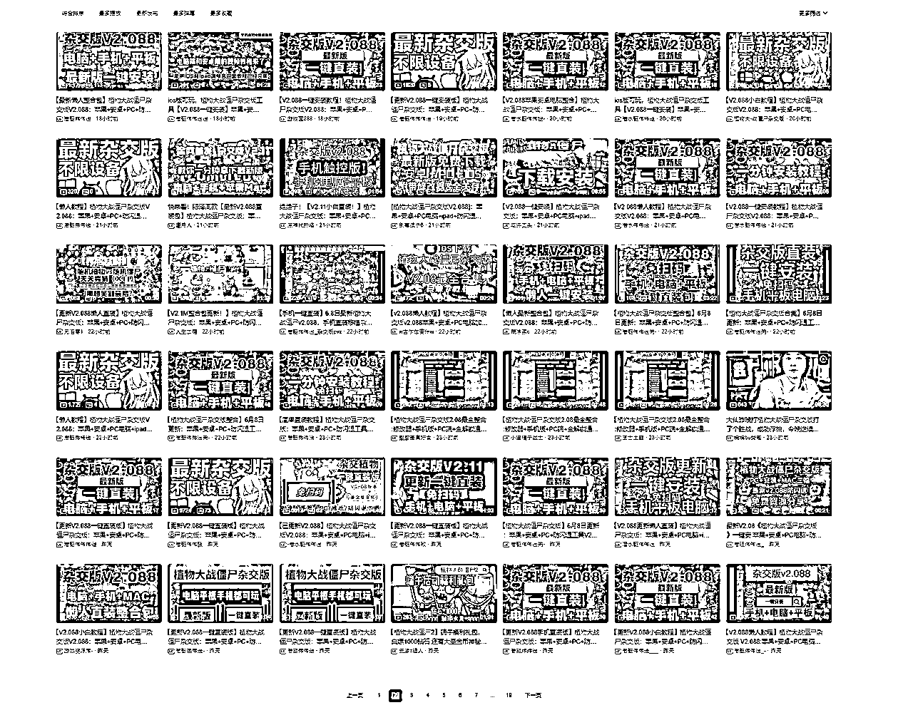
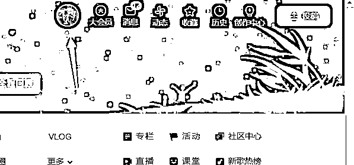
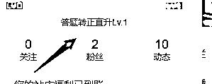
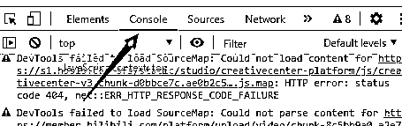
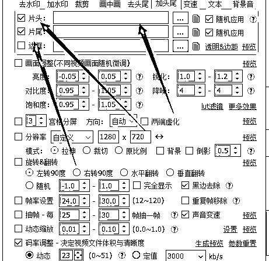
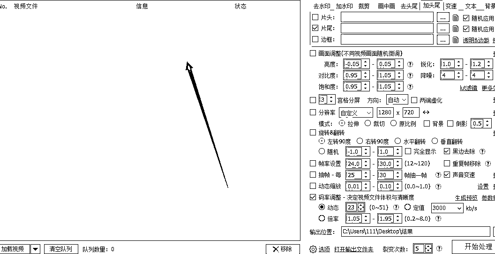
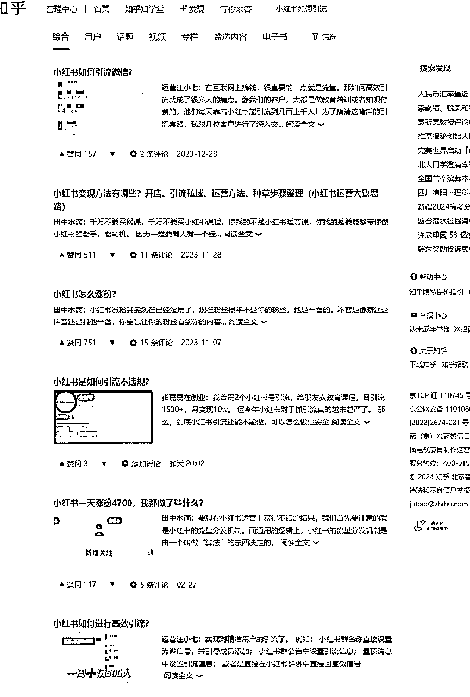
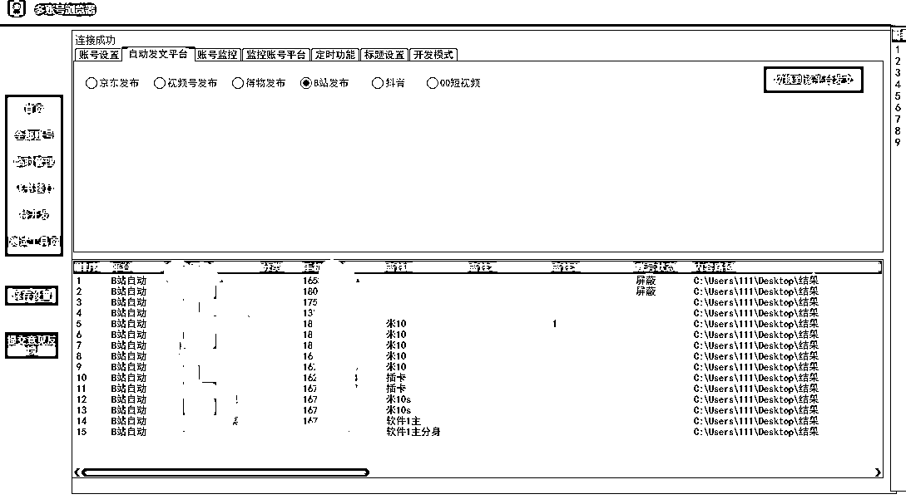
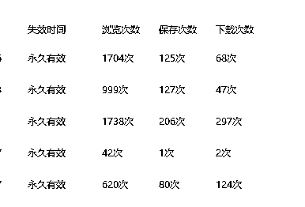

# 新手如何在B站低成本铺满1000篇视频做钩子。

> 来源：[https://udxxg5rx5m.feishu.cn/docx/FI0vdsYhzoCBbkx9JjgcfhdNnAc](https://udxxg5rx5m.feishu.cn/docx/FI0vdsYhzoCBbkx9JjgcfhdNnAc)

前一阵 植物大战僵尸杂交版 很火 ，我也玩了一阵，

但是因为从头玩解锁道具实在太花时间，

我就想找一个全部道具解锁的存档直接玩，

于是在B站搜了一下，

结果给大家看看，



好几页都是如出一辙的内容，要求 三连然后私信获取文件。

并且账号来来回回都是那几个up主发的作品，

于是我就想可不可以在B站通过较低成本的B站号+素材裂变+软件批量发布完成这个操作。

于是说搞就搞。

## 一、首先需要有10个B站账号

这个账号只能手机注册，手机号不够的可以考虑接码平台注册，

只要你发布的视频内容不过分，B站账号软广引流几乎不会封号，

所以这10个号理论上可以一直用。

为什么要10个号，

因为经过我的测试，

目前B站24小时发布作品超过10个后，

是要验证码才能继续发布，

这个规则我不清楚是什么时候添加的，

因为前几年我做B站引流是没有这个限制的，

一个账号就可以用软件无限发。

一个号一天10个作品，10个号一天100个，

10天就可以铺1000个作品，

哪怕就算有一部分作品审核不通过，

15天也可以妥妥完成。

## 二、通过自动答题批量完成B站答题转正

注册好的B站首先要通过答题考试到达2级，

否则发5个作品就会提示 非正式会员单日只能投递五个稿件。





登录账号后点这里进入答题页，

然后按F12，



鼠标点击这里，

在最下方输入这串代码：

```
var i=0
setInterval(function(){
        $('.answer-outer').eq(i%$(".answer-outer").length).trigger("click")
        i++
}, 1500)
```

然后敲回车，

页面会自动答题，

B站答题即使答错也会让你重选，

这串代码意思就是每个选项轮流选一遍，

答对就进入下一道题。

答题的时候只需要关注他会不会弹出验证码，

如果弹出验证码手动过一下验证就行了，网页会自动往下执行答题。

相当于半自动答题。如果嫌麻烦可以直接买邀请码，

## 三、测试批量软件发布是否风控

我先拿账号挂软件发了三天搬运的素材，

素材的内容没任何广告，也不是同一个视频剪辑出来的，

一是为了测试平台风控的底线，

IP是否出问题，

短时间发布作品是否对人工审核有影响，

二是测试软件是否好用，能否达到全自动发布的效果。

测试下来几乎没什么问题，

通过答题考试的账号，24小时内可以发布10篇，10篇之后就需要验证码才能继续发布。

我试了一下软件识别验证码，效果不是很理想，而且单账号这么操作很容易触发风控。

索性就让每个号只发10篇。

测试下来没发现账号有什么问题。

## 四、一个视频裂变1000个视频素材，过B站人工审核

同一个视频是无法在B站短时间内多次发布，B站人工审核会直接拒绝，

我是通过自己写的视频分割软件+CRVideoMate 去绕过的，

操作起来其实很简单，

首先找一些视频素材，然后用视频分割软件将视频分割成2-5秒的视频，

我

比如一个一分钟的视频，分割成10-30个作品。

放在同一个文件夹内，假如路径为 C:\Users\111\Desktop\结果，

然后CRVideoMate里把加片尾这里的文件夹路径设置成 C:\Users\111\Desktop\结果，



然后再软件左边加入你用来引流的视频素材，



简单概括就是，软件自动合成，在你的引流视频后面加入不同的片尾，

这样的话，用户在点入你的作品后，前面视频都播放的你的引流素材，

只有在最后几秒钟才会播放无意义的片尾素材，

通过这种方法百分百能过B站的视频人工审核。

## 四、准备10个以上的视频标题作为核心

根据10个标题为基础模板，延伸裂变出30个以上的标题。

然后全部放在txt文档里，

一行一个标题。

如果觉的标题不好裂变，

可以教大家一个简单的方式，

根据标题关键字在百度或者知乎搜索，

搜出来的标题人工筛选一下，

就可以作为你的标题使用，



## 五、初次发布5天后复盘

我把准备好的视频素材，和标题素材放入自动发布的软件内，设定每个号发布10篇。

然后将钩子放在视频简介。



发了5天后发现一些问题，

可能是由于所有素材都是以一个视频为基础做的剪辑，

两个账号被人工审核查出了批量发布，进行了封禁，

5个账号被强制退出登录，再次登录需要实名。

结果比较出乎意料，没想到会有这么多问题，

被退出登录并且强制要求实名的账号，

我分析是因为账号触发了风控，

跟IP和没有进行养号有关。

因为我最开始测试发布作品时用的账号都没遇到这个问题，

被风控的号都是后来补充上来的B站号，

注册后直接答题然后发布作品，最后导致了风控。

这个也好解决。

注册IP分开，手机卡，热点。分批注册。不要在短时间内同时注册即可。

至于封禁账号，

根据封禁原因，大概率是短时间内发布了相同作品，

被人工审核的时候发觉了。

但是测试下来也只有两个号出现这个问题，

我之前添加片尾素材的操作看来并不能百分百规避审核，

这次复盘结果：

注册IP分开，手机卡，热点。分批注册。不要在短时间内同时注册即可。

多增加一个步骤，将素材也进行片头添加，同时裂变出更多不同标题，增加标题多样性。

## 六、再次测试

这次我把素材、标题进行分组，

一个分组固定对应3个账号，

然后每个分组对应不同的引流渠道，这样可以测试出比较优质的标题跟内容，

然后可以根据优质的标题再去裂变不同的标题。

以下是我从上个月开始在B站做的钩子，

数据最差的那个大概做了十多天我就换内容了，



复盘后再次测试，还有有4个账号被人工审核查出来并且封禁了，

于是我把发布作品的间隔时间延长了一下，

将间隔改成了5分钟，

但是测试了几天我觉得这样做并没有什么效率，

延长了发布完作品的时间，

还不如一次性将作品全部发完，

封号的话直接淘宝搜B站号，

可以购买换绑服务，

两块就可以把封禁账号换绑，

相对来说成本并不高，

当然也可以通过批量发布做其他的钩子，比如B站很多都是三连+私信的钩子。

这个完全可以发散思维。

用到的工具就是多账号浏览器+CR剪辑。

CR用来生成多个素材，链接：https://www.cr-soft.net/crvideomate.html

这个我买的是付费的，如果有平替软件你们也可以用别的

多账号浏览器用来批量发布。链接：https://pan.baidu.com/s/1Ry9ciJZxaT2t2GheTQb9hw?pwd=4628

提取码：4628

--来自百度网盘超级会员V8的分享

软件教程：

这个是我工作室有需求自己开发的。所以是免费的。