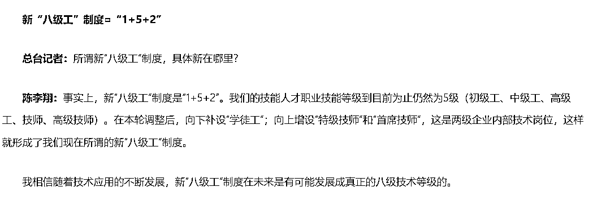
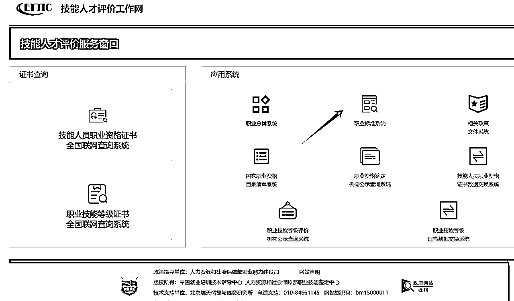

# 如何选择合适证书来考

> 来源：[https://lxkvj39q93t.feishu.cn/docx/Gc7udYlOuojRVyxaTOBc00EanTa](https://lxkvj39q93t.feishu.cn/docx/Gc7udYlOuojRVyxaTOBc00EanTa)

# 个人介绍

【微信昵称】

Gavin吴佳文

【星球ID】

佳文（老ID温戈）

【地区】

深圳

【个人介绍】

中医学学士、深圳大学工商管理硕士（MBA）

GPT 提效航海教练

广东省人工智能训练师考评员

深圳健康管理师考试、全媒体运营师等多个考试命题人

现在是个小创业者，努力生存中

24年主业务：人社部人工智能训练师培训考试

# 写在前面

证书，只能成为加分项，成为你前行路上为你铺路的垫脚石，成为你进入某些行业的敲门砖

但在一个行业长久的发展，并不只能依靠证书，更多的是要坚持、长期的深耕，在行业里获得核心能力，才能形成自己的核心竞争力，证书说到底，只是一张纸，起到辅助作用

# 一、考证金字塔

第一级：行业核心证书

第二级：行业职称证书/行业准入证书（职业资格证书）

第三级：区域人才对应证书

第四级：职业技能等级证书

第五级：口碑较好的“小证”

第六级：其他证书

## 1、行业核心证书：

什么是行业核心证书？核心证书指的就是，你这个行业、岗位，含金量最强最高最牛X的证，可以把你和其他人的水平直接拉开的证，不是所有人都有的证，但大牛一定有这个证做背书

没有这个证，你可以在这个行业里混，但混不到顶级，混到顶级的前提一定是你要持这个证

举例：

注册会计师、一建、PMP（？）

这种证书，一般都是全国甚至全球联考，考下来一般是可以升职加薪，迎娶白富美/高富帅/矮富美/矮富帅/白富丑/高富丑/矮富丑/，走上人生巅峰的

这种证书的考试难度也注定了，不是所有人都能考得下来，所以在金字塔尖尖上的人才有能力持有，也是区分行业顶级人才和普通人才的最重大区别

## 2、行业职称证书/行业准入证书（职业资格证书）

有些工作岗位，需要准入证书才能正式“执业”

比如医师、药师、律师、教师等，先要考下来，才能从事本职业工作，这些准入证书有一部分会对应“初级职称”（例如执业医师），有一部分不对应，需要再另考职称

哪怕你是本专业毕业的，你没有医师证，就做不了医师，没有处方权，不能给人开处方

所以这是入行必须要考的

准入证入门之后，再根据自己的工作年限，评或者考对应职称，才能涨工资，升官

准入证：重要且紧急

职称：重要但不紧急

还有一类职称，例如中级经济师、软考等，对专业限制不强，大多数人都可以考

职称证呢，在某些条件下是很有用的

比如退休，可以多领些退休金（但政策在变，等我们退休的时候有没有退休金都不一定）

比如你可以获得更多的升职机会

建议体制内或半体制内（含国企），或某些按资排辈情况比较严重的企业，优先把职称提起来

## 3、区域人才对应证书

什么是区域人才对应证书？

特指，本省、本市、本区的区域内，有引进人才政策，这些人才都要有对应的证书作为申请条件

以北上广深杭五个地区的政策举例

紧缺人才：

北京：（2021年更新）

https://www.gov.cn/xinwen/2021-09/07/content_5635828.htm

上海：（2024年更新）

https://m12333.cn/policy/mkzkb.html

广州：（2024年更新）

https://m12333.cn/policy/mceme.html

深圳：（2021年更新）

http://hrss.sz.gov.cn/tzgg/content/post_8340671.html

深圳区级政策——以宝安区凤凰英才计划为例

https://www.baicebao.com/upload/portal/20240125/6b14368d4b58f6b9258cd554d777bda1.pdf

杭州：（2022年更新）

https://www.hangzhou.gov.cn/art/2022/8/16/art_1229063383_1824530.html

其他地区人才政策：搜索地区+紧缺人才

区域性高端人才政策

深圳孔雀计划：https://baike.baidu.com/item/%E5%AD%94%E9%9B%80%E8%AE%A1%E5%88%92/5568489

杭州 人才A-E https://zhuanlan.zhihu.com/p/688681793

从更新频率上可以看到，并不是每年都有更新，一般是2-4年更新一次紧缺人才目录

这类的目录更新后，会有配套政策出来，要么给钱，要么给户口，要么给配人才房，总之就是考这些证的核心就是薅ZF羊毛，为自己争取最强的背书

## 4、职业技能等级证书

指由经人力资源社会保障部门备案的用人单位和社会培训评价组织（以下统称评价机构）在备案职业（工种）范围内对劳动者实施职业技能考核评价所颁发的证书。

说白了，是人社的证~

为了推进“放管服”改革要求，对现行《国家职业资格目录》外的、社会通用性强、专业性强、技术技能要求高的职业（工种），由经人力资源社会保障部门备案的用人单位和社会培训评价组织（以下统称评价机构）实行职业技能等级认定，颁发职业技能等级证书。

一般分为：五、四、三、二、一，五个等级，五级最低，一级最高

五级（初级工）、四级（中级工）、三级（高级工）、二级（技师）、一级（高级技师）

除这五个等级之外，还有三个等级，不进行考试评价

五级以下的叫“学徒工”，没有证书

高级技师以上的还有特级技师和首席技师，这两个是企业内部认定的等级，换了企业不认

二、一级，在一定条件下，可以贯通职称，等同使用

职业技能等级证书，国家是给发钱的，这个钱一般是从各地的“失业保险”基金里出

所以要求领补贴的人，是“企业在职”，事业编，公务员，学生，老师，无业游民，均不可以领取补贴

而且~一般是以省为单位，发补贴的时候一般不认外省的证书（毕竟是从本省的基金出钱啊~~）

各地对补贴申领要求也不一样

以广东为例：

广东省（非深圳）要求社保累计36个月以上（以失业保险为准）

深圳要求在缴状态或深户即可

补贴标准：一级3000，二级2500，三级2000，四级1500，五级1000

列入《紧缺人才目录》的，一、二、三级再上浮30%

有特殊政策的，更高

（比如深圳的区级政策，在对应名录里的，高级技师（一级）每人 3 万元；技师（二级）每人 2 万元； 高级工（三级）每人 5000 元）

到哪里领补贴呢？

到当地政务网，搜“职业技能提升补贴”“职业技能等级提升补贴”“失业技能提升补贴”，一般都是这三个类目办理

实在找不到，就打12333问人社！

2024年，全国各地基本都实行了新国标，现在报考职业技能等级也要求很高了

以职业技能三级为例

2023及以前的老国标：相关专业中专以上学历或非相关专业大专以上学历+2年社保，相关专业大专以上学历不限社保

2024的新国标：无相关学历+10年社保，或相关专业大专以上学历不限社保

下面是国标的全文

所以想跨别的专业考证，基本要从五级或四级开始考了

这一块的证书，很多都和上一个部分的“紧缺工种”重合，建议优先考取能考的且紧缺的，最高等级证书，再考虑别的证书，一般来说，按各地的补贴政策，一年只发一个证的补贴，一年考一个就行了，补贴基本可以cover学费+考试费

那说到这里有人就要问了，现在有哪些职业技能等级证书可以考

emmm，太多了，让我背到明天早上也背不完

大家自己去下面网站看，人社部的网

http://www.osta.org.cn/（考完查证书也在这里，基本现在全国都是考完半年左右拿证）

那除了考试拿职业等级的证书之外还有没有别的方式拿？

有的

还有两种评价模式：企业评价和技能大赛

企业评价，要本企业有这个评价资质，如果没有的话。。。也没用

技能大赛，进复赛且获奖就能拿了，一般是复赛前10%，会发证

技能大赛进到国赛的话，还能拿“五一劳动奖章”，有条件的宝子们可以试下

## 5、口碑较好的“小证”

什么是“小证”？

就是非官方的证，但是在某些行业内，大部分都认的，认可比较高

比如IT 方面，华为的认证、腾讯的认证

比如心理咨询方面，中科院心理研究所的证（被人举报了，快停考了）

比如营养学会的注册营养师

比如项目管理方面的PMP(?)

为什么又要说PMP，因为含金量随着持证人数逐年上涨，证书核心竞争力也在下降

等等，不一一列举

那怎么来看哪些证书在行业内认不认呢？有几个比较简单的方式

1、到BOSS直聘查，查20个这个行业的对应岗位，大企业小企业都看一下，看岗位JD下面写的，有XXXX证优先，就说明认

2、到自媒体平台认证中心看，认证中心要求提交的认证资料里有的，就说明认

3、到招标网站看，招标网站上有要求，说明认（一般认的都是职称和职业技能等级）

## 6、其他证书

其他证书就是最低的一档了

既不是职称，也不是职业技能等级，也不是行业内广泛认可的证

这种证有一个共同的特点，就是：

通过率高，基本“包过”的，都是这类证书

甚至某些证书，连考试都不要，参加个XX大会，就给你发一个“XX能力认证”

大家都不是傻子，这证有多少公信力，大家心里都有数的

例如：工信XXXX中心的大部分证书

# 二、证书能不能挂靠

前两个能，但最近查的也越来越严了，挂靠的钱也越来越少了

职业技能等级、小证等，基本没有挂靠的空间，太多混帐同行，以能“挂靠”为名收学员了，我不做这个事儿，我良心过不去

想知道能不能，别信网上的信息，到招聘网看有没有招这个证书的兼职的，直接问他证书到人不到行不行，能行的就是有挂靠，不能的就是挂靠不了

# 三、退税

以个税APP为准，每年都会变

今年基本只有部分职称和职业资格证能退了

当然学历也可以退，考之前到个税APP查一下就行了

（弱弱的说，真退不了多少钱，是加了点儿免税额度）

# 四、总结

那么，说到这里，今天的分享就基本结束了

相信大家对要考什么证书心里也多少有个方向了

我们来复习一下

核心优先：行业核心证书

次级优先：行业职称证书/行业准入证书（职业资格证书）

再次级优先：区域人才对应证书

一年考一个：职业技能等级证书

有时间精力再考：口碑较好的“小证”

实在对这个行业感兴趣，无所谓证书强度的：其他证书

我这边主做职业技能考试，全国都做，主做的证书是《人工智能训练师》，还有《健康管理师》和《公共营养师》

但~其他证书也都可以问我下，我以同行的身份去找兄弟机构询价，会比大家拿到更低的价格

最后~祝大家多学习，多赚钱，越努力，越幸运

欢迎链接~