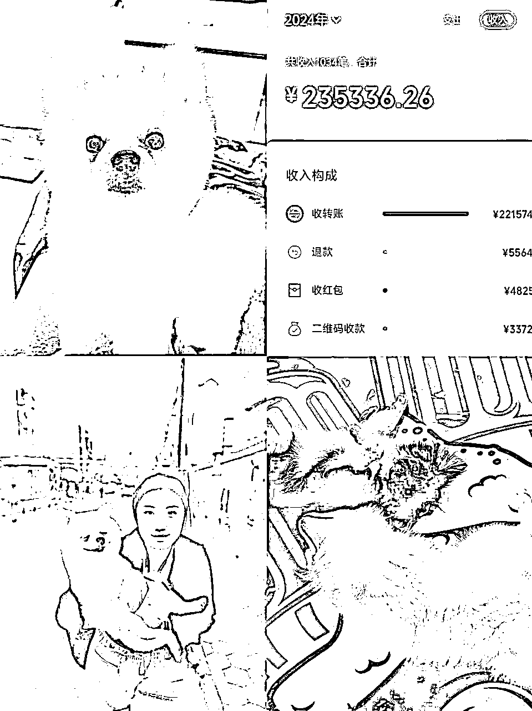
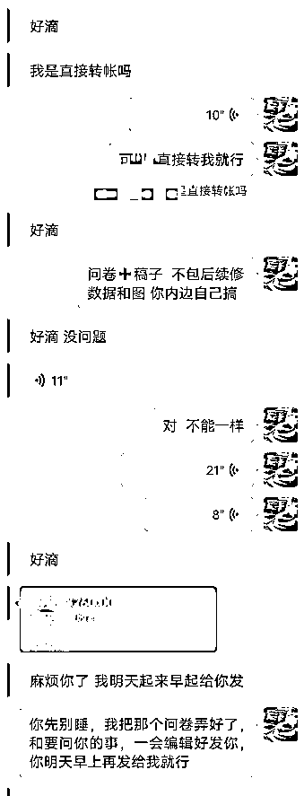
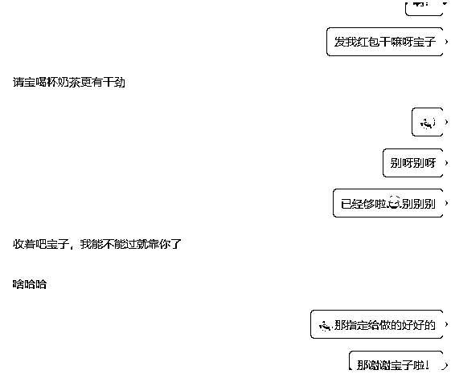
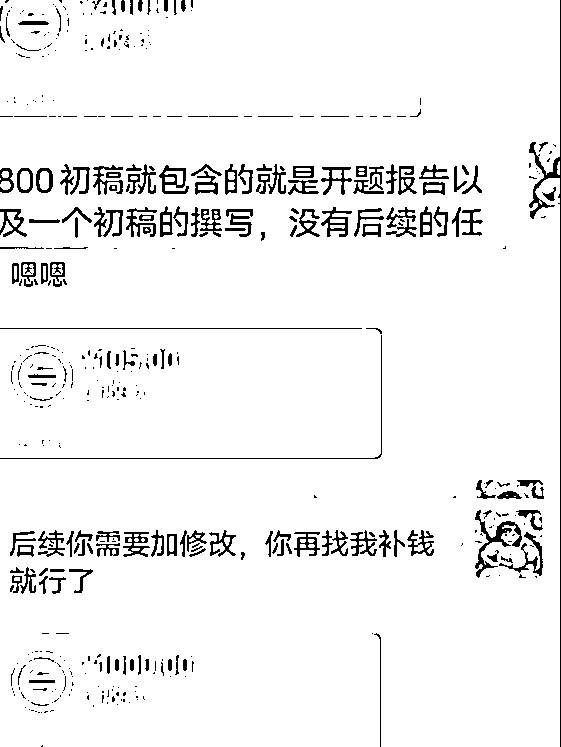
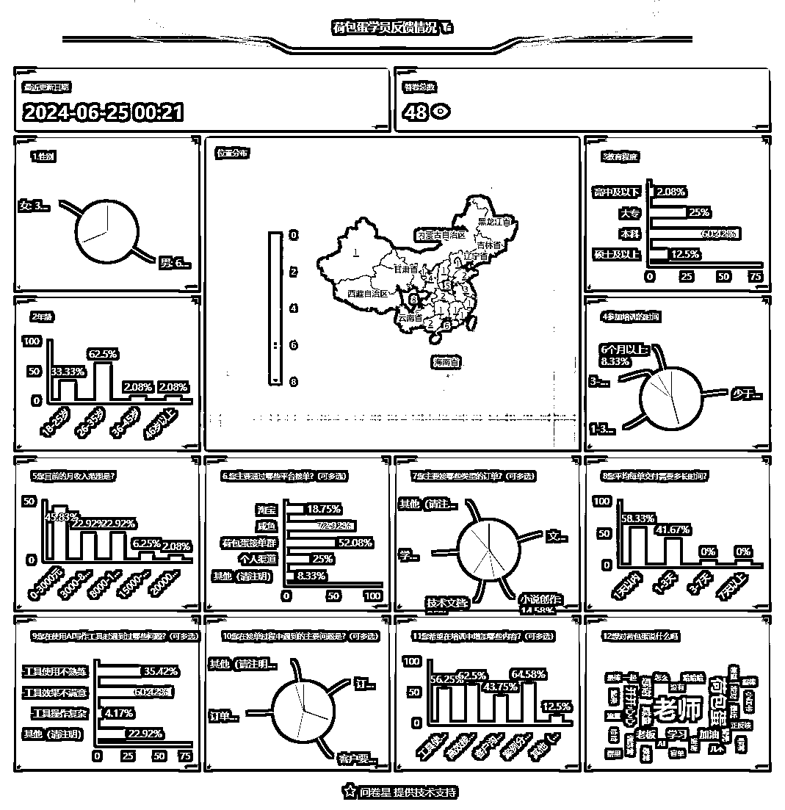

# 十八线小城市女孩，如何靠零成本项目实现刚毕业单月月入6万？

> 来源：[https://lv9qj6hfr4z.feishu.cn/docx/HOD5drNDNor5Oyx9tfwcGhEFnFd](https://lv9qj6hfr4z.feishu.cn/docx/HOD5drNDNor5Oyx9tfwcGhEFnFd)

大家好，我是荷包蛋糕，一个00后，现居天津的自由撰稿人。

毕业一年啦，在很多同龄人还在找工作的时候，我已经实现了月入6万。毕业后我定下了一个目标，我想存够100万，带着我的两只狗去旅居。一年时间，我已经存下了15.7万元，今年五月份开始还去了长沙、济南 哈尔滨 香港，澳门，杭州，北京等城市旅游。这一切得益于我正在做的Ai写作项目，让我实现了边旅游边赚钱的目标。

非常感谢那些引领我的大佬们，以及一路同行的朋友们，是你们让我从一个对什么都不懂的小白，逐渐有了今天的成绩。今天，我也想分享这一路走来的点滴，希望能为大家带来启发和鼓励。

## Part 1 个人介绍

首先感谢有人会点开这篇帖子，阅读我的故事，占用一点点篇幅来介绍一下我的成长经历。

我的起点并不高，出生在天津与河北交界的【小县城】，教育资源匮乏，原生家庭贫苦。父母离异后，我父亲用每个月【2-3k】的淡薄工资养育我和我妹妹，和半身不遂在床的祖父。所以可能是天性使然和原生家庭的影响，我对金钱的渴望印入了骨髓。

2018年，我高考失利了，【400】多分的成绩压线考入了成都的一个【民办】本科，学习【国际经济与贸易】专业。入学的时候，我身上只带了几百块钱生活费，学费还是临到学校了去申请的助学贷款。

与别人的大学不一样的是，我的大学只有学习和兼职。在大学期间我做过很多工作与兼职：

1.  二姑包子服务员，一天站12小时 一小时6块钱

1.  发传单，时薪10-20元；

1.  在韵达捡快递，一天120元；

1.  帮自考本科做招生，一个人头800元；

1.  帮美容院或者奶茶店做引流和客户维系，月入800左右。

直到大三的时候，我偶然接触到了代写这个行业，发现身边很多人都在找代写。我开始觉得这个行业大有可为。选择这个行业的原因有以下几个：

快速赚钱： 代写一单一结，很适合缺生活费的我，而且不需要任何成本。

灵活工作时间：没有固定的时间限制，我可以根据自己的时间安排进行工作，对我来说很方便，不用考虑到时间。

无须特别设备或场地：只需要一台电脑和网络，不需要额外的设备或办公场所，成本低廉，也不用到处去晒太阳等等。

有发展潜力：这个行业需求一直都有，任何时候都有人需要人帮忙写文章，是一个很长远的项目。

认识到这一需求后，我开始在兼职群里发布信息，提供代写服务。最初的尝试非常顺利，很快就有了第一批客户。这些客户大多是因为时间紧迫或缺乏写作能力，而无法完成自己的文科类作业。通过与客户的沟通，我逐渐了解他们的具体需求，调整和提升自己的服务质量。

从刚开始依靠发传单一个月只能赚【几百块】到现在月入【几万块】，只有我知道我背后付出的努力与艰辛，欢乐与成就，接下来我将分享一下我从【0到1】的全过程。

#### 提升和扩展

1.  优化服务流程：

*   初期沟通：详细了解客户的需求，包括写作目的、目标读者、核心观点等。

*   撰写提纲：在正式开始写作前，先撰写详细的文章提纲，确保文章结构合理、逻辑清晰。

*   交付初稿：在规定时间内完成初稿，并及时与客户沟通，征求他们的修改意见。

*   修改完善：根据客户的反馈，对文章进行多次修改和完善，直至客户满意为止。

1.  提升专业技能：

*   广泛阅读：通过阅读大量优秀的文科类文章，不断提升自己的语言表达和逻辑思维能力。

*   专业培训：参加各种写作培训课程，学习先进的写作技巧和方法。

1.  扩展业务范围：

*   多样化服务：除了提供代写服务外，还扩展到文案撰写、自媒体文章、市场分析报告等多个领域。

*   建立品牌：通过不断提升服务质量和客户满意度，逐渐建立起自己的品牌影响力，吸引更多客户。

## Part 2 项目历程

### 项目1.0时期：初涉代写

我前面提到过我高考失利了，也就意味着我其实成绩不怎么样，为了赚取生活费，我决定接触代写这个行业。然而，刚入行的那段时间对我来说并不容易。一开始，我只能接一些简单的单子，比如帮其他同学写一些基本的作文或是简单的作业。这些任务看上去简单，但对于当时经验不足的我来说，还是有点难度的，经常一篇几十块钱的文章，我需要花费大量的时间去研究和修改，才能勉强完成任务。

记得第一次接单，那时候还没有Ai，得自己原创，我花了整整一个通宵来完成一篇千字的小作文。为了让客户满意，我反复修改了十几遍。好在最后客户反馈挺好的，虽然只有几十块钱，但是我不用出去晒太阳发传单，也不用出去拉人头，这种踏踏实实完成任务就能拿到钱的感觉太棒了，也让我更坚定的在这个行业做下去，那时候我一边上课一边接单写稿子。

在接下来的几个月里，我不断接受不同类型的稿子，从简单的课堂作业到稍微复杂点的报告。我开始逐渐积累经验，学会了如何构建文章结构、如何准确理解和表达客户的需求，慢慢地我靠代写能赚到自己大学的生活费了。

### 项目2.0时期：拓展业务

写了一段时间之后，我发现很多学生都有找人写论文的想法，尤其是我这种学校，很多学生其实就是来混文凭的，让他们自己写论文压根写不出来。而一篇论文的单价通常在几百上千，完成一单能抵得上我写很多篇小稿子了。

于是，我开始有意识地往这方面发展。我在学校的代课群等地方，加了很多需要写论文的客户，逐渐开始接触写论文。这期间，我花时间研究大部分文科的论文写作方法和要求，提升自己的写作水平，以便能够胜任更多类型的论文写作任务。学会了论文写作之后，我每个月的收入已经开始稳定在几千了，甚至论文高峰期的时候，能达到1万多一个月，这时候我还是一名学生。

一篇高质量的论文能带来不少报酬，还能获得客户的满意和好评。而且我比较本身是一名e人，很擅长跟人沟通交流，与客户沟通的时候，情绪价值给的很到位，论文质量也不错，慢慢的客户就会给我转介绍，一般转介绍成功的客户，我都会发个红包感谢客户，有了感谢红包，她们很多会更积极地帮我转介绍，而且他们自己需要写东西的时候，也经常会想到我，我和很多客户都成了朋友。其中有一个研究生客户，她的单子我帮她写了大半年，今年终于毕业了，6月份我去长沙旅游的时候，这个客户还请我吃饭了，并且说以后读博的论文也交给我了。

### 项目3.0时期：AI技术的引入

### （1）与ai的初接触

我的AI之旅始于一次社群组织的在线研讨会，主题是“玩转ChatGPT”。

其实一开始，我对AI持有一定的疑虑，担心它可能会复杂难懂，或许还需要编程知识。像我这种懒得动脑子的人，感觉不一定适合我。但是我看到很多人分享Ai，用Ai写稿子能轻松完成任务之后，我还是决定试试。

等我我实际上手使用之后，这些顾虑很快就烟消云散了。ChatGPT的界面友好，只需输入提示，AI就能迅速生成高质量的文本，于是我开始将Ai运用到我的代写业务中。

利用AI技术，我能够更快速地完成稿件。例如，我接到的一项任务是为一个学生写商业计划书作业。以前，这类稿子我需要数天的时间来收集数据、分析信息和撰写报告。但有了AI的帮助，我只需要输入一些关键词和提示，ChatGPT就能迅速生成初步的分析内容，然后我再进行细化和调整。

以前自己写一篇论文得半天，但是用AI写论文，稍微简单点的论文，我基本上一个小时内就可以搞定了，而一篇论文稿费都是好几百，也就是用Ai写作我能实现时薪好几百。

AI写作还帮助我拓宽了接单的范围。以前，我主要接一些相对简单的任务，但现在我可以承接更复杂、更专业的项目。比如，我接到过几次需要撰写技术文档和行业报告的订单，这些任务对专业知识要求较高，且需要大量的数据支持。有了AI，我能够快速获取并整理相关信息，生成高质量的初稿，再根据客户的具体需求进行优化。这样一来，我不仅可以接到更多类型的订单，还能提高收入。

有了Ai写作之后，我的收入也有了明显的增加。之前，我一个月累死累活也只能赚一万多元，但自从引入AI技术后，我的收入实现了爆发性增长。3月我的日收入平均值达到了998元，将近1000元，整个3月的收入达到了30966.88元！这个数字让我自己都感到震惊，一个月的收入竟然达到了身边大多数同龄人月工资的七八倍之多。

### 项目4.0时期：

在AI技术和写作技能的双重推动下，我的代写事业逐步走向成熟。我也迎来了新的转折点，我的转折点源自，“生财有术”社群中结识的圈友们。

有很多大佬不仅分享了他们的知识和经验，还帮助我理解了如何扩大业务规模，从单打独斗转向团队合作和系统化经营。

### （1）第一次尝试搭建培训营

在大佬们的邀请和鼓励下，我决定尝试搭建一个专门的写作培训营。初衷是结合CHATGPT和写作，分享我的Ai代写经验，教其他人进入这个行业。第一次尝试反馈不是很好，去年整个陪跑计划的学员不是很多 忙忙叨叨一整年只招收了30＋学员。，但是学员们的反馈都很棒，有不少学员都在Ai代写这个行业深耕下来了。

### （2）圈友相助 搭建自营盘

我的短板是不擅长做渠道获取培训，只擅长做交付和写稿服务指导培训。所以我在圈友中筛选了目前渠道端做的不错的学员达成合作，形成了我们自营盘的闭环。

有了合伙人之后，我们俩沟通商量下，以及在学员们的建议下，我的训练营也越来越完善了，不仅有很详细的Ai写作指导，还有渠道端获客的内容，基本上做这个行业会碰到的问题都有了解决办法。

说实话，我从来没想过我会走到这一步，有越来越多志同道合的朋友，大家一起互相鼓励互相学习一起进步，会一起分享学到的新东西，也会分享好的不好的情绪，更重要的是，能互相督促一起赚钱，每次我想摆烂的时候，看到其他学员们赚钱赚的热火朝天，我就又有动力了！

作为一个野路子，我在代写这个行业待了四年，没有系统学习过，但是前段时候，我写了一篇期刊文章，问了一名期刊大佬打分，他的评价是100分，说实话我觉得挺自豪的。 很多研究生写出来的稿子都被这个大佬骂了，但我写出来的他给了100分，这是我在这个行业四年的积累，也是我的底气。

很多人看到这里可能会觉得四年才能做到这个程度，感觉好难，那我要说，如果是以前的代写行业，确实需要门槛，但是现在升级版的Ai代写项目，是真正最适合小白的项目，不需要你会写稿子，只需要你看得懂文章就行，只需要你会指令让Ai帮你写。

甚至你也可以不用自己写，你可以做一个中间商，接单了转给其他写手去写，自己赚个差价，这个也不需要任何门槛不需要任何成本。

## Part 3 项目复盘

#### 初期问题：资源匮乏与认知局限

问题：刚开始从事代写项目时，我面临着资源匮乏、经验不足以及认知局限的问题。特别是面对复杂的写作任务和多样化的客户需求，我感到有些力不从心。

思考：在初期阶段，资源的匮乏和认知的局限是每一个创业者都会遇到的问题。为了突破这些限制，我采取了以下措施：

*   广泛学习：通过阅读大量的专业书籍和参加线上线下的写作培训课程，不断提升自己的写作技能和专业知识。

*   建立人脉：积极参与行业内的社群活动，与行业内的前辈和同仁交流，获取他们的经验和建议。

*   小步快跑：从小单子做起，逐步积累经验和客户资源，同时不断反思和改进自己的服务质量。

#### 业务扩展问题：多样化需求与专业提升

问题：随着业务的扩大，我开始尝试更多样化的写作任务，包括商业文案、自媒体文章等。这一阶段，我面临的主要问题是如何快速提升自己的专业水平，以满足不同客户的需求。

思考：业务扩展阶段，需要快速提升专业能力以应对多样化的客户需求。我的解决方案包括：

*   系统学习：针对不同类型的写作任务，进行系统化的学习和训练，提升自己的专业技能。

*   客户反馈：通过与客户的密切沟通，了解他们的需求和反馈，及时调整和改进自己的服务。

*   资源整合：利用已有的人脉和资源，寻找专业人士的帮助，借鉴他们的成功经验和技巧。

#### 技术引入问题：AI技术的应用与效率提升

问题：2023年初，我引入了AI技术，特别是ChatGPT。虽然这一技术大大提升了我的工作效率和写作质量，但在初期的应用过程中，也遇到了一些技术障碍和操作难题。

思考：AI技术的引入是一个重大的变革，需要在实践中不断摸索和改进。我的具体措施包括：

*   技术学习：深入学习AI技术的原理和应用方法，掌握ChatGPT的操作技巧和最佳实践。

*   优化流程：将AI技术融入到写作流程中，制定标准化的操作流程，确保每一个环节都能高效运行。

*   持续改进：通过实际操作中的反馈，不断优化和改进AI技术的应用，使之更好地服务于写作任务。

#### 团队管理问题：学员培训与渠道拓展

问题：随着业务的进一步扩大，我开始招收学员并教授他们利用AI技术和写作技能变现。同时，我也需要不断拓展渠道和对接期刊，以增加业务范围和收入来源。这一阶段，我面临的主要问题是如何有效地管理团队和优化培训流程。

思考：团队管理和渠道拓展需要系统的规划和执行。我的解决方案包括：

*   系统培训：为学员提供系统化的培训课程，从基础写作技能到AI技术应用，再到实际操作演练，确保每一个学员都能掌握必要的技能。

*   分工合作：根据每个团队成员的特长和能力，进行合理的任务分配，确保每个人都能在自己擅长的领域发挥最大价值。

*   渠道拓展：积极对接各种写作平台和期刊，扩大业务覆盖面，同时建立稳定的合作关系，确保持续的业务来源。

## Part 4 个人感想

回首这几年的创业之路，我的心中充满感慨。这个过程充满了挑战与艰辛，但也收获了无数宝贵的经验和成长。

从最初的彷徨无助，到现在的稳步前行，这条路上，我经历了太多的风雨。

曾经，我只是一个来自小镇的普通女孩，面对生活的压力，我选择了迎难而上。每一个创业者，都经历过从零开始的阶段。在实际操作中，你会遇到各种各样的问题和挑战，但正是这些磨练，让你逐渐变得更强大，更有经验。

不要害怕犯错，因为错误是成长的必经之路。每一次尝试都是一次宝贵的经验积累，每一次修正都是向成功迈进的一步。你会发现，在做的过程中，自己会逐渐掌握更多的技能，了解更多的行业动态，积累更多的人脉资源。也不要忘记保持积极的心态和持续的学习能力。随着时间的推移，你的视野会变得更加开阔，思维会变得更加敏锐，能力也会不断提升。你会逐渐从一个对行业一无所知的新手，成长为一个经验丰富的专业人士。

对于刚刚起步的新手，我有以下几点建议：

1.  保持学习：无论是写作技巧还是AI技术的应用，都需要不断学习和提升。只有不断更新自己的知识和技能，才能在激烈的竞争中立于不败之地。

1.  勇于尝试：不要害怕失败，勇于尝试不同的项目和方法。每一次尝试都是一次学习和成长的机会，即使失败也能积累宝贵的经验。

1.  积极沟通：与行业内的前辈和同仁多交流，获取他们的经验和建议。建立良好的人脉关系，不仅能帮助你解决问题，还能带来更多的合作机会。

1.  坚持不懈：成功没有捷径，只有通过不断的努力和坚持，才能最终实现目标。面对困难和挫折时，不要轻言放弃，坚持下去，你会发现成功离你越来越近。

感谢一路陪伴我的贵人和朋友们，是你们的支持和帮助，让我走到了今天。未来的路上，我将继续努力，不断挑战自我，实现更大的突破。让我们一起，为了梦想而奋斗，不畏艰难，勇往直前！