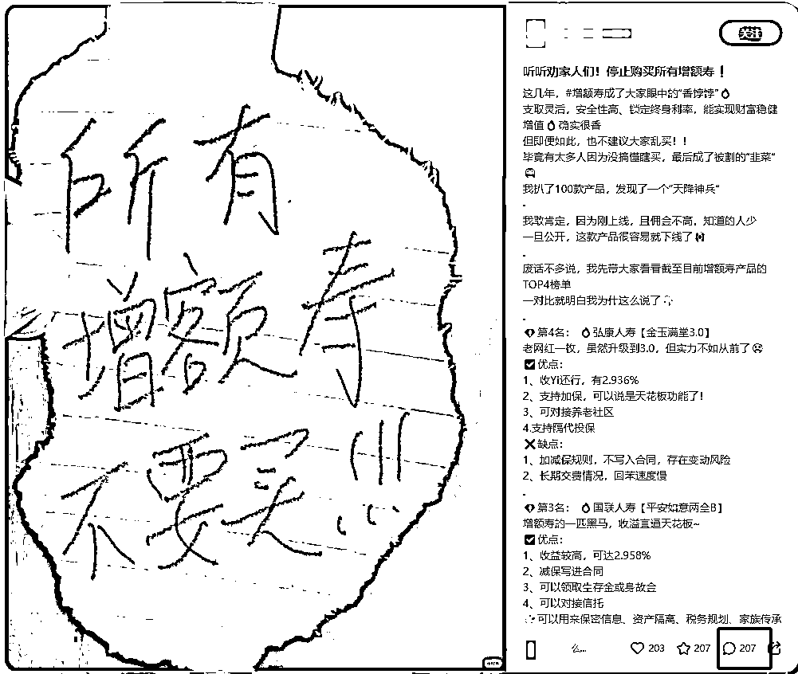

# 小红书低粉高获客玩法，每月精准「引流高客」800+，加V率30%-40%，1.5万字SOP

> 来源：[https://lwsczvh505.feishu.cn/docx/I8afdNOmtojPGuxzu2TcqhH4n2g](https://lwsczvh505.feishu.cn/docx/I8afdNOmtojPGuxzu2TcqhH4n2g)

有公域获客需求的圈友们，看过来呀～

如果你有产品，但还处在缺客户阶段

如果你的产品受众是「高客单价」用户，但苦于获客成本太高

如果你已经在小红书平台获客，但导流效果不理想

滴滴！缘分来了！这篇帖子也许能给你些启发！

圈友们，大家好，我是叶凡，一个干了 4 年保险的自媒体人，跟团队累计做了 1200 万粉丝的运营负责人，涉及抖音/快手/小红书/视频号/百家号等等平台，在行业政策红利期，单账号单月变现 500 万，是互联网保险赛道的首批玩家。

2023 年 3 月份，我们发现了小红书保险赛道的红利，当时市面上一个小红书保险客户微信售价在 800-1000 元。

我们本身在其他平台做了 1200 多万粉丝，这么多年也积累了账号运营能力，综合考虑「机会」和「能力」之后，就立马入局小红书平台上，目前快一年半的时间，已经沉淀了一套完整链路 SOP：

发布小红书笔记——>小红书站内用户咨询回复——>引导加微信——>微信端接待用户，了解需求，出方案，沟通，最终完成成交

【项目的特点】：

1、低粉高效获客，粉丝不重要

起号期，16 个粉丝的小红书账号就能带来 21 个咨询，加 V 率做到 38%，当天加的微信当天成交 8999 的高端医疗险。

2、加 V 率高，目前可稳定在 30%-40%

我们面向的人群算是高客单价用户，产品价格每年几千到几十万不等，小红书的这些用户整体学历高一些，一般能做到 25%的加 V 率（加 V/咨询量）就属于不错的了。

我们这版导流的 SOP 也是做了行业调研，并且结合运营经验反复迭代，最后做到 30%-40%，成了业内的模仿对象。

3、用户精准，成交快，效率高。

我们只发精准笔记，带的都是精准咨询，所以在微信接待环节，不用花多余的时间筛选无效客户，不仅节省了后端用户筛选成本，成交周期也短，快的话 1-3 天可成交，一般成交周期 2 周内。

4、免费自然流，无付费推广

整篇文章约1.5万字，我在培养我们团队新人的SOP基础上，又结合了小红书其他行业的案例，前后一共迭代了1个多月

希望能做到能让其他行业的圈友，在看完之后，能更清晰的知道如何套用在自己的业务上。

整个链路的逻辑是相通的，对需要在小红书获客的圈友算是比较有借鉴意义的，我已经看到，这个模式在房产/母婴/婚恋等多赛道有类似玩法。

接下来的内容框架：

01 为什么要来小红书获客，适合谁？

02 高加V率的核心关键点

03 具体执行的SOP（从0-1，再到矩阵扩大）

04 项目避坑和心得

# 一、为什么要来小红书获客，适合谁？

## （1）用户人群匹配：消费能力强，认知高，流量大。

这个是小红书聚光平台官方同步的数据，可以看到：小红书 2 亿的月活用户，月均可支配消费 4000+元，50%一二线城市，70%都是 90 后。

这样的用户画像是符合互联网保险的消费群体的。

在我们入局小红书时，既然行业内一个用户微信能卖到 800-1000 的价格，可见小红书的用户价值。

基于目前我们跑出来的结果看，小红书的消费能力确实很高，比抖音/快手/视频号都要高。

## （2）小红书生态优势，种草属性强，用户精准，产品更好卖

不知道大家发现没有，小红书 app 的启动页，写的是“小红书，你的生活指南”，这就是小红书目前的平台调性。

现在小红书已经代替了百度的角色，生活中遇到什么问题，大家更愿意打开小红书做攻略

我就是一个小红书重度使用者，从怀孕开始，所有的攻略都是去小红书上搜一搜。生娃后的第一个月，小红书是我使用最多的app，遇到带娃新挑战，第一时间打开小红书一顿搜，看别人是怎么处理的，会很多素人分享的经验，感觉真实靠谱，赶紧试一试。

这个过程中，也会很容易被种草。

数据显示，有81%的小红书用户，曾在app上浏览产品或者服务后，产生购买欲望。

用户愿意在小红书这个平台做攻略，很容易被产品种草，这就是小红书平台相较于其他平台的优势。

我们只需要在这个平台发布辅助消费决策的内容，想办法让更多用户看到，就很容易被种草，顺利获客。

总结：小红书平台有足够优质的客户，如果与你业务的用户画像匹配，这是一个很好的平台。

# 二、高加 V 率的核心逻辑

整个获客链路逻辑是做：小红书「精准」「搜索流」🔍

## （1）什么是小红书「精准」「搜索流」？

◼️ 精准，是指只发「跟产品相关」的笔记，产品无关的不要发。

比如，保险行业就是某款高端医疗险 xxx，这种具体的产品笔记，就可以发，但是，社保就不要发，因为单纯科普社保跟保险产品没有直接关系。

◼️ 搜索流，是指，用户通过在小红书「搜索」，搜到我们的产品笔记。

40%的用户会通过“搜索”辅助决策，这一部分流量占比很高。

结合在一起，就是通过发跟产品相关的笔记，让用户搜到我们，被我们提到的产品种草，主动咨询我们，最后完成服务。

比如保险行业，某用户他已经有保险需求，但只是不知道怎么买，他可能在想“xx这个产品风很大，到底怎么样？攻略一下看看到底好不好，适不适合自己。

他带着「精准的问题」在小红书「搜索」找答案，看到我们的笔记，感觉还不错，最后找到我们做咨询。

## （2）为什么要做小红书「精准」「搜索流」？

快速筛选，后端省事，变现链路短。

成交=①他有需求+②这个产品能解决+③我最合适

做精准搜索流的好处，这种模式能直接完成成交的第一步，即筛选出“①他有需求”的客户，这样用户足够精准，我就不用再去花多余时间去教育用户，告诉他“你需要买保险”，教育用户很费事儿。

我只需要在笔记里好好讲好我的产品特点，做好成交第②点“这个产品能解决”，并在服务的过程中让他体会到“③我最合适”，从而下单。

可以给大家看看我们做的精准客户，有多精准和直接。

## （3）高加 V 率的几个关键环节

1、用户的行动链路：

用户搜索具体的问题，小红书平台通过问题里的「关键词」，匹配对应的笔记，用户在一堆笔记里通过展示的「封面」和「标题」，「点击」笔记，阅读后对这个产品或者攻略资料「产生兴趣」，私信博主，「加到微信」做咨询。

这里重点给大家强调一下，小红书区别于抖音/视频号平台一个很大的点，在于它是双列模式，而不是抖音的瀑布流模式。双列模式就是说你打开 app 之后，笔记都是双排呈现的，看到的是封面和标题，所以，封面和标题的设计非常非常重要。

2、用户动作拆分关键点：

①关键词匹配

②点击笔记

③产生咨询兴趣

④加微信

基于拆分的关键点，我们逐一做针对性的动作，即可得到重点发力的行动关键点。

3、行动关键点：

①关键词匹配——>梳理关键词，并埋词（把关键词放在标题、封面、正文、内图中），保证用户在搜索的时候，能多展示我们的笔记

②增加笔记点击率——>在封面+标题上下功夫，保证在展示了我们的笔记之后，用户更愿意点击查看

③产生咨询兴趣——>正文讲清楚产品亮点，并留好咨询钩子

④加微信——>设计好导流话术，以及用户加 V 跟进等细节动作，从而增加留 V 率

以上行动关键点具体怎么做，我会在第三模块详细介绍。

# 三、具体执行 SOP（从 0-1，再到矩阵扩大）

我们前期摸索也走过弯路，后面找到新机会，慢慢走通了0-1之后，再做了矩阵号放大，最后在导流环节又做了一次大迭代，实现了30%-40%的加V率。

下面会分两块跟大家聊聊：

第1部分，我们走弯路，给大家避避坑

第2部分，从0-1详细的SOP

## （1）前期摸索，从走弯路到跑通 0-1

### 1、走弯路的 3 个月

我们刚开始入局小红书，其实走了 3 个月的弯路。

因为我们在其他平台，做短视频账号积累了 1200 多万粉丝，比较熟悉怎么做视频类账号，所以刚开始入局小红书找对标账号，都是视频类型的

我们发现比较成熟的几家干矩阵号的，视频内容包括泛流量视频（涨粉）+精准视频（获客），结合的来。

什么是泛流量视频？

视频内容跟产品没有关系，比如我们的产品是商业保险，那讲社保福利/社保使用攻略/存钱方法/省钱方法就是泛流量。这种视频因为受众面广，只要内容干有价值，跑矩阵号还是很容易涨粉。

什么是精准流量视频？

讲跟产品相关的视频，比如讲儿童高端医疗应该怎么买？xxx这款高端医疗险测评产品？虽然这种视频受众相对小，但是，都是知道这个险种，有购买需求的精准用户在看，所以，内容讲的好就能带来咨询。

于是，我们就仿着他们的策略两种视频夹杂着发，做了3个账号，3个月粉丝量到了1万多，但是，咨询产品的用户很少。

后面我们发现，这些对标的账号在做投放，于是，我们也开始做聚光平台投放，结果，投放成本太高，一个微信成本80-400元，一方面成本不稳定，另一方面价格还是有点偏高。

这条视频获客转化的路，我们还没完全走通。

### 2、发现机会，跑通 0-1

正当我们苦恼的时候，行业里突然兴起了一批做图文的保险账号，看起来平平无奇，点赞量没几个，粉丝量也没几个，但是咨询特别多，而且笔记做的非常像，制作简单，还能带来不错的咨询。

而且，我们对标的几家头部团队，在维持他们视频类型的账号同时，也起了一批这样的图文号。

早期那批笔记案例搜不到了，我拿近期类似的案例对比，方便大家理解：

◼️ 第 1 组案例：

下面 2 条笔记，封面文字一样，只是换了个样式。标题和正文也相差不大，评论量可以看到分别有 50-100 个咨询。

◼️ 第2组案例：

也是2个不同的账号，封面、标题、正文做了微调，咨询量都有100-200个。

这个时候，我们判断，这肯定是个机会！

于是我们立马去模仿他们的爆款图文，用一样的方式：换封面样式，换标题，正文微调，不到半个月，我们出了一条笔记带来了50多个咨询，获客效率比之前的视频高很多，因为图文做起来比视频快很多，不用拍摄和剪辑，咨询量还高。

然后我们就开始重点拆解这种图文笔记怎么做，为什么能带来咨询。毕竟不能一直洗别人的爆款，而且洗的太类似了，咨询量只会越来越少。

研究之后，发现这类笔记的获客逻辑——小红书精准搜索流

并且按照这套方式，我们最终跑通了0-1。

期间，我们还对比泛流量账号的获客效果差距。我们把同款笔记，分别发在1万粉丝的泛流量账号上，和只有几十个粉丝但流量非常垂直的账号上，经过多次对比，发现垂直的低粉账号获客效果更好，可见垂直+精准有多重要。

这里之所以把我们走弯路的经验分享出来，主要是有2个价值吧：

1.  做导流到微信业务的圈友（前提），千万千万要记住，小红书粉丝量不重要，一定要做垂直+精准+搜索流，这个坑，我们已经趟过了，避开它。

1.  做任何平台，时刻关注同行，转机都在这。

## （2）从 0-1 的 SOP

这里包括 2 大块内容：

◼️ 创作爆款笔记：注册账号、养号、梳理关键词库、找对标账号、搭建选题库、完成第 1 个爆款、复制爆款、放大爆款

◼️ 私信导流：同行调研、运营迭代

### 1、创作爆款笔记

#### step1：注册账号

账号命名、简介、头像等内容这里就不细讲了

这里需要注意的是，尽量做蓝 V 专业号（每年认证费用 600 元），原因有 2 个：

①对于某些行业，有资质限制，比如保险行业/律师行业就有，做了蓝 V 资质认证之后，发保险产品笔记合规才不会限流。这个算是一个入门门槛。

②专业号导流限制会少一些，这个是我们亲测的结果。而且， 2025 年 1 月7 号，小红书通知「私信获客工具」将成为全行业商家在小红书和用户私信通过中交换联系方式的唯一路径。现在的留资卡片真的太方便了，用户可以一键提交他的电话，可以直接通过微信名片、企业微信名片等加我们，还可以提交他的微信，总之，很方便！

当然不是专业号也能做，就是限制相对多一点，导流方式不一样

👉小红书专业号入驻网站

#### step2：养号

这里我们没有做什么特别的操作，就是像个真人一样刷刷小红书笔记，搜索关注的话题，每天刷个20-30分钟，3-7天就差不多了

#### step3：梳理关键词库

这个环节非常，非常，非常重要！

在第二模块中已详细分析过，我们要把这些关键词放在笔记中，使得目标用户在搜索相关问题的时候，我们的笔记能够被更多机会搜到。

梳理关键词库的3个方式：

① 聚光平台的后台关键词，以此推词、行业推词

网址：聚光平台

操作步骤如下：

大关键词我们是按照险种来输入的，比如高端医疗险、重疾险，然后基于搜到的词语继续往下挖2级关键词，继续搜索。

最后把搜到的结果，列在一个表里，然后整理出高频的关键词。

说明：

*   聚光平台需要企业付费预充值，不同行业预充值费用不同，保险行业是2万预充，如果不投放后续可以退。

*   不用聚光平台也不影响对关键词的梳理，这个就是效率高一点，下面2个方法做好也够了。

② 小红书平台的搜索栏+分类栏

【操作方法】：

*   搜索大关键词（保险行业是险种，比如高端医疗险、百万医疗险、重疾险等等，这里以“高端医疗险”给大家验演示操作步骤）

*   基于大关键词搜索，把搜索栏弹出来的其他话题也都点一遍

*   大关键词+分类栏再点一遍，直到点到没有话题

*   对关键词进行整理归类，并记录哪些关键词热度更高，热度的判断标准以笔记的咨询量为准。

怎么判断这个笔记带来的咨询多不多？——看评论用户的留言咨询数

有咨询的评论区长这样：

（用户留言“表格”，就是在问博主领资料，博主就可以私信往微信导流了。)

通过以上4步，就可以得到行业的关键词库和高频热词了。

比如高端医疗险的关键词库，就可以分为：

*   人群类：成人、儿童、孕产

*   功能类：疫苗、续保、既往症等等

*   公司品牌/产品类：友邦、MSH、京东、新燕保等

*   场景：医院（和睦家、卓正、协和国际、嘉会……）、儿保等

*   地区类：上海、深圳、北京……

*   问题词缀类：保什么？有必要吗？对比、价格

以上列举部分，大家知道思路即可。

③ 爆款笔记拆解，总结同行爆款笔记里出现的「高频关键词」

【目的】：找到用户需求点比较高的关键词，优先写这类笔记，更容易获客

【爆款标准】：还是看评论区的咨询量，不要看点赞、收藏！！

【操作方法】：找到评论区咨询很多，且近期还有用户在评论区咨询，尤其是这个选题谁发谁火的笔记，拆解封面、标题、正文，哪些关键词出现的频率比较高。

比如，高端医疗险里面和睦家、协和国际，跟医院相关的话题火的概率就更大

所以，我们就优先发能解决和睦家/协和国际的高端医疗险产品笔记，比如能报销和睦家医疗费的 A 产品种草，比如能报销和睦家医疗费的 ABCD 多款产品测评对比等等。

综合以上 3 步，就能梳理出关键词库+重点关键词了

关键词梳理下来，基本包括人群/品牌/产品/险种/功能/场景/合集……其他行业差不多也可以这么分，去搜索一下就知道了

#### step4：找对标账号

在step3通过搜索搭建关键词库的时候，基本上就能找到接下来重点对标的账号了。

选择对标的标准：评论区咨询量高，输出比较稳定

敲重点：笔记比较模板化，且咨询量高的账号，重点对标。

模板化，是指他的选题、标题、封面和正文，有明显的“公式”痕迹，很有规律的那种。这样的账号，直接拆他的模板你就能快速上手了。

比如这个账号：

◼️ 封面排版公式化：固定一套模板，主标题 2 行字+副标题 1 行字+左下角几个字+左上角英文

○ 主标题：2 行，险种/人群方案/产品名+种草词（黑马、王牌、王炸、之王、榜单、宝藏、第一名、大央企、年化 8.1%、绝版、地板价、逆天、国企、n 月排行榜、万能，神仙，顶级，头部，热门）

○ 副标题：1 行，体现价值/产品亮点（看完就会！花了 7 天/8 小时整理！致命缺点）

◼️ 选题公式化：排行榜类——③④⑦；产品避坑类——⑤⑥⑨⑩；险种种草——②⑧；产品种草——①⑧

◼️ 包括正文也是，就不再贴图了，大家应该懂这个意思了。

当然，也有可能刷不到这么模板化的账号，刷不到没关系，你可以用下面的方法成为你们行业里的模板号哈哈

有圈友可能会问有没有省力的方法，比如什么工具可以快速找账号，答案：无。

因为这类低粉高获客的笔记，有一个特点，就是粉丝量不高，可能就几百几千个，像新红等数据网站可能都搜不到这些账号。所以，大家在搜索关键词的时候，重点留意。

#### step5：搭建爆款选题库+封面库+标题库

什么是选题？就是这个笔记是讲什么的，比如“小孩的保险怎么买”

封面/标题/正文对应下图

##### 1、爆款笔记生产逻辑

爆款笔记=①爆款选题+②爆款封面+③爆款标题+④爆款正文，4个元素的排列组合

为啥这么说呢？拿几套案例，给大家解密一下爆款笔记生产过程：

◼️ 案例1：保留爆款选题+爆款封面+爆款标题，只是改改正文内容。

左边是4个笔记数据对比，都爆了，右边2个是正文的区别

可以点下面笔记链接，对比分析

http://xhslink.com/s6buxN

http://xhslink.com/1WjuxN

http://xhslink.com/9nuuxN

◼️ 案例2：保留爆款选题+爆款封面，换选题和正文

下图，可以看到都是讲B超单拼照片的选题，封面也用的是同一个，只是换了标题和正文，也都爆了。

可以点下面笔记链接，对比分析

http://xhslink.com/1WjuxN

http://xhslink.com/1wewxN

◼️ 案例3：同一类爆款封面+同一类爆款标题，换选题和正文，还是能爆

下面2篇笔记，可以看到选题不同，一个是讲拍摄技巧，一个还旅游攻略。但是封面用的是同一类，标题相同“拜托，xxx的姐妹存下吧”，也都爆了

◼️ 案例4：同一类爆款标题，换爆款封面、选题和正文，还是能爆

下面5篇笔记，标题都是“拜托，xxx的姐妹存下吧”，虽然是不同的行业，选题、封面、正文换了，还是能火。

通过以上案例，大家应该就能清楚，小红书爆款笔记=爆款选题+爆款封面+爆款标题+爆款正文，4个元素做排列组合的逻辑了

所以，我们要做的事情，就是把就是把行业里爆款的4个元素拆解出来，帮助你快速的输出第1个爆款，并迭代出更多爆款。

##### 2、爆款选题库搭建方法

创建一个文档，把爆款笔记链接、评论数等信息复制进来

分析出爆款选题方向，比如保险行业包括：产品测评类/榜单类/产品种草/产品避坑/需求合集/需求种草等等

找那些很多人发了都能火的选题，优先模仿，比如保险行业里的《3999和睦家自由》、《MSH欣生代猫腻》

说明：在后续做账号的过程中，刷到爆款，记得持续往里面更新，创作笔记时需要拿来对标的。

##### 3、搭建爆款封面库

前面给大家举例对比过，爆款笔记的封面是可以直接套用的，这里再强调一下，爆款封面各个行业是可以套用的，被数据验证过的封面，咱们直接拿来用就行。

◼️ 使用方式1：A行业的爆款封面样式，一模一样套用到你的行业上来，比如下面拍摄行业用的这个纸片爆款封面，旅游行业的直接拿来用。

◼️ 使用方式2：一条笔记爆了，可以用换几套爆款封面，再发几次笔记，一样能爆

（这个敲重点，特别重要！！因为小红书图文笔记查重不严格，这样操作，无比高效！！）

比如，下面的封面乍一看是两个很不一样的封面，其实封面呈现的文字内容一致，只是换了个爆款封面样式而已

我整理了保险行业的小红书爆款封面，大家可以直接套用到你的行业

(圈友欢迎交流)

（保险行业的圈友，缺客户，也可私聊看看合作机会，我们有富余的精准客户，或者聊聊其他可能的合作方式）

##### 4、拆解爆款标题库

跟爆款封面一样，标题也是可以套用的，使用爆款标题，用户打开我们笔记的概率更大，阅读量自然更好。

标题的使用分 2 类：一种是套用小红书平台爆款标题，一种是关键词组合标题。接下来分别讲讲

◼️ 第一类：小红书平台爆款标题

【使用方式】：把平台的爆款标题，套用到自己的行业上即可

比如，下面 3 组爆款标题，套在各个行业都有爆款

“终于有人把 xxx 说明白了”

“xxx，存下吧，很难找全的”

“一句话秒懂 xx”

我整理了小红书44个常用爆款标题，你可以直接套，后续也可以边做边积累自己的标题库：

1．救命！我真的会 xxxx !

2．居然有人会说 xxxx ，我真的会 xxxx !

3．女生一定要学会 xxxx ！格局炸裂

4．人人都能学会！深扒 yyyy 的 xxxx 小心机

5．后悔没有早点 xxXX

6．穿出门被问了很多次的 xxx ，出门没输过！

7．拒绝摆烂| xxxx 应该打卡的 n 件事！

8．任何人错过这个 xxx 我都会伤心的 ok ?

9.90％小白都避不开的 xxxx 误区！后悔没早

10．全网最 yyy 的 xxx 它才是我心目中的王炸！

11．我宣布 xxx 是 yyy 的 n 个 zzz 在这里！

12．这个 xxxx 神器我怎么没早点发现！

13．救命 sos 这是谁发明的 xxx ！没想到这么好吃！

14．只有1％知道的 xx ，却能让你 xxxx !

15.xx10w＋的秘密，就是 xxxx !

16．学会这三点，保证让你 xxxxx !

17．月薪 xx 和月薪 xx 的区别，就是 xx ?

18．当你 xx 的时候，人家已经 xxxx !

19．同样的 xx ，比 xx （类比物）厉害在哪里？

20．你是不是和我一样， xxxx !

21．大家都是 xx 只是因为 xxxx !

22．别以为你 xx ，就可以 xxxx !

23.xx爆火的背后，是 xxxx !

24．当大家都在关心 xx 的时候，我们 xx !

25．从 xx 身上，可以学到的3件重要的事！

26.xx的秘密在于 xx ?

27．那些过目不忘的 xx 保证你记得一辈子！

28．如何做出既 xx 又 xx 的 xxxx ?

29．一定要收藏的 xx 条 xx ，也许哪天就用上了！

30.24位宝藏博主|学 xxxxxx 全靠它！

31.xxx一年， xxx 是怎么狠狠奖励我的？

32.xxx关系中的过度 xxx 是怎么回事？

33.xxx女生，怎么 xxx 才好看？

34.请大数据把这篇推荐给 xxx !

35.xxx干货，40个 xxx 专业术语大全！

36．减脂干货，已减 xxx 斤，帕梅拉一周运动＋食谱37.xxx白嫖教程！不会还有人花钱拍 xxx 吧！

38．不是吧！？你 xxx 还要花钱？

39.99％不知道的 xxx ，让你 yyy !

40．为你省下私教钱！帮你制定 xxx 新手计划！

41.迄今为止，刷到讲xx最xx的一条视频了！

42.救命！终于有人把xx讲清楚了！

43.都给我看，不允许还有一个人被xxx坑！（不允许还有人不知道xxx）

44.xxx，存下吧，很难找全的

◼️ 第二类：关键词组合标题

还记得前面说的关键词搜索逻辑吧，标题里放了用户会搜索的一些关键词，就可以被关键词搜索到。

有些爆款笔记的标题，就是用这些关键词拼起来的。那我们要做的，就是保留这些关键词，再拼一次就可以了。

比如，同行的爆款标题是：“高端医疗险|800实现协和国际部自由”

我们的标题就可以改成：“逆天！ 800块 协和国际自由！高端医疗 王中王”

保留了3个核心关键词（蓝色字体），加几个情绪词拼了一下。

#### step6：完成第1个爆款

上面已经讲过，爆款笔记=爆款选题+爆款标题+爆款封面+爆款正文，4个元素的排列组合，前期的准备工作都已经做完了，接下来开始大量模仿行业的爆款笔记，尽快产出你的第1篇爆款笔记。

行业的爆款选题在爆款选题库搭建那一步已经找到了，接下来就是换封面/标题/正文3个元素至少任意1个即可。

下面以一篇笔记完整的创作过程举例。

1、确定要模仿的笔记，建议至少参考 2 条，说明这选题很容易爆款

🌰【范例】：对标的 2 条笔记

http://xhslink.com/kVmMXu

http://xhslink.com/ja24pv

2、 提炼关键词

搭建关键词库的时候，关键词咱们已经心里有数了，然后我们在要模仿笔记中：

① 提炼出标题、封面、正文里高频的关键词（重叠词）

② 按照出现的频率进行降序排序，前 3 个词作为“核心关键词”，其余的部分作为次优先级关键词

③ 再结合关键词库，看看是否还有需要补充的次级关键词

🌰【范例】：关键词提取如下：

*   前 3 的核心关键词：协和国际、800、高端医疗

*   次关键词/产品亮点：0 免赔、核保宽松、绿色通道、儿童单买

3、编写标题

两种制作思路，在整理爆款标题提到过，一类是用平台爆款标题套用，一类是用关键词组合，下面直接看例子。

原标题：高端医疗险 800 实现协和国际部自由

🌰用平台爆款标题套用：爆款标题公式+最核心的关键词

*   套爆款标题：xxx，存下吧，很难找全的

*   生成标题：去协和国际的姐妹，存下吧！很难找全的

*   套爆款标题：终于有人把 xxx 说清楚了

*   生成标题：终于有人把去「协和国际看病」说清楚了

🌰用关键词组合：保留原标题的核心关键词，加上种草关键词（语气词、形容词类，下面的红色字）

*   标题 1：每天 2 元 协和国际部自由|10 月高端医疗 王炸

*   标题 2：逆天❗️ 800 块 协和国际自由！高端医疗 王中王

小技巧：

标题中多加emoji表情和情绪符号，尤其是颜色鲜艳的/生动活泼的，正文中也是可以适当加一些，这样正文结构更清晰，阅读体验更好。

一些常用的emoji表情可以参考，列在这里

高频emoji：🔥❌🌈💁💡✔️👩‍⚕️🏥💌🔍🔸✅🚀✨❓❗️

4、编写正文

核心保证3点：

①确保核心关键词完整，增加用户能搜到的概率

②体现产品的亮点

③增加私信导流钩子（特别特别重要！！！），吸引用户来找你咨询。钩子可以是资料，也可以是测算价格

一般来说，爆款笔记基本都具备了以上特点，如果缺失，可以做一下补充，如果完整，正文微调一下即可。

正文编写常用的方法，可以是做多篇笔记的组合，也可以做一些信息增量，加一些符合笔记的用户搜索关键词，也可以是做一些减法。

比如，这篇笔记就是在原笔记正文的基础上，做了一些信息增量，增加了一些产品细节、互动话术，并补充了2个导流钩子（价格测算和产品资料）

🌰【范例拆解】

6、制作封面

跟标题的逻辑一模一样，用2种方式，一种是调整关键词组合（但要保证核心关键词不要动），一种是套用爆款封面

🌰【范例拆解】：

第1种，模仿原封面样式，调整了次级关键词，其他几乎不动（右边是原笔记封面，左边是模仿的封面）

第2种，套用爆款封面，小红书上聊天消息弹框和备忘录的封面，都很火。这里就直接套用其他爆款封面，把信息堆进去，2个封面就生成了。

7、制作内图

内图可要可不要，参考行业的爆款笔记。

我们常用的做法，是根据正文里提到的产品亮点，补充计划书/产品介绍的信息截图，并框选关键信息，并做必要的文字备注，这样①比原笔记多一些信息增量，更能火 ②更显专业增加信任感 ③方便私信导流时拿来查阅和沟通

🌰【范例拆解】：增加3张细节图，并上下排列标注关键信息

### 

8、发布测试

模仿某篇爆款时，至少准备2-3套笔记测试，发在多个账号上，提高测试效率。主要是封面和标题做一下差异，正文、内图可以不用咋改动，发布后观察用户咨询数据

通过以上步骤，「大量」「快速」的模仿爆款，直到出现第一个爆款。

#### step7：复制爆款

当自己账号出现第1个爆款之后，这个时候你就已经掌握了如何制作这种咨询笔记的基本技能了。

这个时候，要做一件很重要的事情——复制爆款，榨干这条选题

如何复制？

只需要调整封面和标题，正文微调，内图可不变。继续发在「爆了」的那个账号上，大概率是还能火，一直发到不火为止。

甚至只调整正文，其他内容都不改动，也是有机会再爆的，在“爆款笔记生产逻辑”章节，放过一个类似的案例，那个账号同一篇笔记发了至少10次，数据都很好。

#### step8：衍生创作，放大爆款

出现爆款之后，我们需要分析，这篇笔记为什么会爆。可以基于爆点衍生创作，放大爆款的价值。

◼️ 什么叫衍生创作呢？

提炼爆点，创作满足这个爆点的其他选题方向的笔记。

比如，《MSH欣生代超全测评》这篇笔记带来了很多咨询，它的爆点是“MSH欣生代”这款产品，选题方向是“测评类”。

那么，就可以基于"MSH欣生代”这款产品，衍生“MSH欣生代”+“避坑”选题方向=《MSH欣生代隐藏猫腻》

“MSH欣生代”是一款儿童高端医疗产品，衍生“MSH欣生代”+“合集”选题方向=《3款真正的少儿高端医疗险》

◼️ 衍生创作的详细步骤：

1.  提取爆点，确定衍生写作选题

1.  去小红书平台搜索是否有相关笔记，如果有，找到爆款可以做参考，可以按照step7里的方法创作

1.  如果没有相关爆款，进行笔记原创，笔记的标题/封面都可以按照step7的方法创作，正文的内容如何写，可以拆解行业里的爆款笔记行文公式，这里给大家列举几个保险行业的常用写法。

◼️ 保险行业常见正文结构

✔️榜单类：

案例拆解：我宣布2023成人重疾险榜单，正式出炉

✔️单款产品种草类

拆解案例：7月增额寿不急上车，8月新品爆款了！

✔️单款产品避坑

案例拆解：90%人忽略了这一点！康乾3号，买前必看

### （3） 私信导流

前面的步骤，我们解决了如何让用户「看到」我们的笔记，并且在「看完」之后，愿意找我们做咨询。

接下来就是导流到微信非常关键的一步：如何在私信导流环节，提高加微信的成功率？

我们首先做了同行私信回复调研，在行业里做的比较好的账号笔记下评论和留言，看他们引导的话术和方法是怎么样的。

#### 1、同行调研

整体来说有 3 种：

① 直接引导加微信，不去了解用户信息，把自己的微信号留给用户

② 直接引导留微信，不去了解用户信息，让用户留微信

③ 先去了解用户信息，用户回复后，再让用户留微信，不是一上来就导流

以上3种，我们分别测试过，最终选择了第3种，加V率最高。

因为第1种和第2种，没有跟用户有前期需求的沟通，信任感建立不够，有些用户就不愿意把自己的联系方式留给你，而且第1种主动给用户留微信，导流违规风险更大，让用户留微信相对安全一些。

再后来，我们有一条笔记一天咨询量集中达到了100+，就发现了用户的问题其实非常用共性，然后再结合了营销心理上的技巧，我们把回复话术又做了一次迭代，最终V率就达到了30%-40%的水平。

接下来，我基于私信回复整个环节，给大家详细拆一下，我们比大部分人回复私信的方式，额外多做了什么，哪里做了细节处理。

#### 2、高加 V 率的细节拆解

一般来说，咨询回复流程：第一步收到用户的咨询，第二步回复用户的咨询，让用户留微信就结束了

我们的区别：

第一步，收咨询的3个小细节，让咨询更多

用户的咨询来自于两个渠道，一个是评论区留言，第二个是主动私信我们

①为了增加评论区的留言量，我们会在评论区置顶一条让用户留言的评论

②我们会在正文里边引导用户关注，这样子的话，关注过的用户，我们能够主动的私信他，不受限制（小红书每日只能主动私信非粉丝20次）

③我们会留两个咨询的钩子，一个是测算价格，二个是产品资料/产品对比表等，增加用户来找我们咨询的概率

第二步，回复用户

①评论区的留言，主动私信后，给用户点赞，增加触达概率

②评论区的留言，主动私信后，评论区回复提醒。

其中，粉丝这个评论回复也有讲究，如果用户是我们的粉丝，那么就回复他“已丝”，如果用户不是我们的粉丝，我们就要回复“已丝，注意查看陌生人消西”。

为什么要加一个“陌生人消息”，这个区别就在于小红书里边回复用户的评论，如果不是粉丝的话，都会统一的放在陌生人消息里面，他是一个折叠消息，因为你要提醒用户，他在陌生消息里面这样子的话呢，用户打开率会更高一些。

③私信回复内容，第一句话不是让用户留微信，而是回应用户问题，了解用户需求

很多人一上来就要用户的微信，这种方式我们不推荐，因为用户还没有给你建立信任用户，他私信环节是带着问题来了，他不确定要不要来找你深入咨询，所以我们要先去回应用户的问题，跟他建立一个专业度信任，然后才去引导他加我们微信，用户抵触心理会小很多。大家换位思考一下就能感受到了。

因为需要根据用户的需求进行回复，可能有圈友觉得不好把私信的回复工作转接给其他人来干。

其实，也是可以的，只要把用户常见的问题罗列下来，整理一份回复流程表就行了。

④回复用户，尽量连续给用户提2个问题，了解需求

我们要一次性问两个问题，用户回复后再抛出一个问题，始终把把握一个私信聊天的主动权，让用户跟着我们的节奏走，这样子用户加微信的概率也会大一些。

私信具体问什么，给大家提炼一个逻辑：就是用户在找你买这个产品的时候，需要了解用户的哪些信息，毕竟每个人的需求不同，匹配的产品也不同。比如保险产品，不同的就医需求/城市/身体情况，选择的产品就有区别。

我们要先去问他这些信息，让他知道我们在了解他的需求，不是一个通版的产品推荐，那么这样用户对我们的信任感也会强一些

⑤增加微信确认环节

用户把微信留给我们之后，我们还会给用户留言一个确认动作，告诉他我们已经把需求对接给后端的老师，让他注意留意通过好友申请。因为有些时候，用户留了微信，但是后来又不想加，这样的情况也是有的，所以，给用户一个明确的反馈，体验感会更好。

⑥增加二次激活环节

就是用户他在跟我们留言之后，表现出了他有需求，但是他又没有留微信号，我们会在第二天再给他留言一次，并且把我们的微信留给他，这样子的话也能激发少部分用户加过来

⑦跟进用户加微情况

我们会做一个线索追踪表，如果用户留了微信之后，第二天还没有加上，我们也会再去给用户留言，提醒他通过申请，并且把我们的微信留给用户，让他用户来主动加我们。

#### 3、完整的私信回复流程图

#### 4、回复话术说明

◼️ 大误区：上来直接引导加 V

小红书上的用户有个特点，在做攻略的时候，他会不止加某一家的微信，是会去对比的，即使不加你，还还是能找到人咨询。

所以，要在私信回复这一步，让他感觉：①你看到了他的需求 ②你很专业，可以加你到微信上详细了解一下

◼️ 精髓：

【围绕用户需求】【主动抛 1 个问题】【2-3 个来回对话】【不要等用户问问题】，始终【掌握主动权】，让客户跟着你的节奏走！

◼️ 好处：

不仅加 V 率高，建立了信任+铺垫好了需求+过滤了无效用户，销售端转化率也随着上升

◼️ 提高回复效率的办法：

建立话术库，使用搜狗输入法的“闪光语录”功能，把固定话术建好分类，用户问啥，就对应调出回复模板。

创建好话术库之后，可以团队共用这个搜狗输入法账号，支持多手机同时登录，这样协作也很高效。

#### 5、话术库案例

日咨询超过 100+之后，在大量的回复过程中，我发现用户的问题表现非常集中，主要分为 5 类：

<1>问产品名字，比如，笔记里提到的产品是什么？

<2>领资料：笔记里会放一个资料钩子

<3>问价格，比如 XX 多少岁，买这个产品多少钱？

<4>问产品怎么买，比如，xxx 岁怎么买（这款产品）？

<5>求推荐，比如，小孩买什么（保险）？

于是，基于用户需求，做了归纳和分类，配合搜狗输入法的快捷回复，不仅留 V 率高，回复效率也高，也可以直接用来培训回复私信的客服同学，他们在不懂保险的情况下，也能明白回复思路。

以下是我们的话术库，大家可以结合自己的行业，用户的需求进行套用。

✅私信回复

<1> 问产品是什么：发笔记+话术2件套

我：①这是Xxx（产品名），之前了解过吗？②是需要给谁配置呢，多大年龄？

⚠️主动私信的用户，或者是粉丝，就分两句发；其他情况，合在一起发（因为后一种情况，小红书只支持回复1条消息）

用户：没了解过

我：你这边配置需求是什么，可以给你分析下是否匹配/或者发公司介绍的笔记给他（如果嫌弃公司小，可以继续了解他的配置需求，说给他对接专业老师给他筛选）

用户：了解过

我：是否匹配你的需求呢？

用户：我的需求是xxx

我：了解了，这款产品适合/不适合/对接专业顾问老师基于你的需求，给你筛选后fa资料和方案你详细分析

用户：xx岁

我：按照<3>价格话术回复

案例：

<2> 领资料：发笔记+通版话术

我：你好，是需要XXX资料吧，这里fa送有限制，你微❤️多少，fa你

我：Fa了说下，避免被屏蔽了，我这边收不到

案例：

<3>咨询价格

我：

①Xxx 岁保障Xxx是多少钱

②价格优惠政策（可说可不说，看情况）

③不过还要分析是否符合你的需求/这个年纪是否买的上

④这边对ABC（影响产品价格的几个关键因素）有具体需求吗，这款产品搭配非常灵活（追问一个问题，掌控主动权，很重要！！）

⚠️主动私信/粉丝，分两句发；其他，合在一起发

用户：我有ABC需求

我：答疑/分析

①需求符合：这里咨询较多，你威❤️多少，我对接专业顾问老师根据你的需求，给你fa资料和方案详解

②需求不符合：OK，了解你的需求了，你威❤️多少，我对接专业顾问老师分析你的需求后，匹配更适合你的方案详解

用户：没有需求/不懂

——好的，这里咨询较多，你威❤️多少，我对接专业顾问老师了解你的需求后，给你fa资料和方案详解

案例：

<4>问【具体某款】产品怎么买：发笔记+问年龄+测算价格+追问+通版导流话术

我：你好，是需要给Xxx （人群）配置Xxx 吧，多少岁呢？（年龄）

用户：Xx岁

——

我：回到<3>价格话术

<5> 咨询人群怎么买，或要求推荐产品：话术3件套+导流

我：

①好的，多少岁呢？

②对医院、保额、门诊、体检等有特别的需求吗？

③或者有看哪个笔记吗，发我或者截个图我给你分析

用户：提出需求123

我：了解了，这里咨询较多，你❤️多少，我对接专业顾问老师，分析你的需求后，发方案你详解

用户：发某一个笔记过来问

我：使用话术<3>

案例：

敲重点！！

留V话术也要设计一下，因为私信多了，用户发的微信可能会被屏蔽，同样我们发出去的微信也可能被屏蔽。

所以，做一个留V确认的动作，留V率就能提升

<6>留V确认通版话术

*   用户留

用户留V前：Fa了说下，避免被屏蔽了，我这边收不到(这个也会促进用户留V）

用户留V后：好的，留意（Xxx）老师好友申请

*   自己留

我：

①Xxx（微信号）

②收到了吗？加了说下，我去对接需求

（如果用户没收到，用分段方式发送；或者发微信号截图；或者用汉字首字母对暗号+数字分开发）

✅评论区回复

<1>陌生人打招呼次数未消耗完（2套换着用，避免被平台屏蔽）

我：已丝，看下陌生人宵夕

我：丝你了，看下陌生人宵夕收到了吗

<2>打招呼次数用完

1）问资料/什么产品

我：好的，今天陌生人打招呼次数用完了，关zhu后滴我下，或者主动丝我fa你

2）问怎么买？留年龄

我：好的，今天陌生人打招呼次数用完了，关zhu后滴我下，或者主动丝我笔记+“年龄”，给你分析

✅把话术存到输入法做模板

——通用版话术

——单款产品话术

每个产品的高频问题，单独做一个话术库

像高端医疗会涉及的几个通用问题：

*   能不能直付？

*   医院列表有哪些？

*   免赔额/起付线

*   门诊限次吗？

*   价格多少？

● 范例1：尊享e生2023高端医疗

● 范例2：新燕保

## 3.3 批量复制，做矩阵放大

跑通流程之后，我们基于以上梳理的SOP，培训新人，从3个视频账号+2个图文号，增加到8个图文账号，总的咨询量就起来了

# 四、项目避坑和心得

## （1）项目跑通核心

1、只做精准流量，不做与产品无关的泛流量

衡量笔记好不好的金标准：评论区的咨询数。别看点赞、收藏。

1 条阅读量只有 100，咨询 3 个的笔记，也比阅读量 10 万，咨询 0 个的笔记强

2、梳理好行业的关键词库

整理小红书平台上的行业关键词+聚光后台的行业关键词+行业爆款笔记常见关键词+梳理产品关键词

详细步骤，参照 三.（2）

3、搭建一个爆款封面库和爆款标题库

这个各行业其实是通用的，大家可以在我的这个基础上使用，日常在刷小红书的时候继续积累。

4、设计一套高效导流的话术模板

## （2）项目避坑

1、千万不要去追求粉丝量

这是我们自己拿时间和金钱蹚出来的经验！真没啥价值。

我们做过多组测试，同样的精准笔记，发到泛流量 1 万粉丝的账号上，获客效率都不如一个 20 个粉丝的精准垂直账号。

2、不用迷恋账号差异化

你的笔记内容能让用户搜索到，吸引到他，匹配上她的需求就行。

把关键词、笔记封面、导流话术每个环节优化好，就能有很好的获客。

唯一可以做差异化的地方：可以打一个专业人设，做一条介绍自己的笔记，置顶。并且每条笔记正文结尾，加一句人设话术，这样增加用户信任度

3、后端的销售专业度要高

小红书平台的用户整体消费能力、学历比抖音、快手和视频号的更高，他们普遍都是做过攻略的，有些甚至比普通的保险代理人都专业，像我们就收到很多北大学历的咨询单。所以，对后端销售的要求更高。

同时，到微信端的用户服务流程，私域朋友圈运营特别重要，要多花功夫，增加成交率。

END

欢迎交流~

VX:Yfwy100