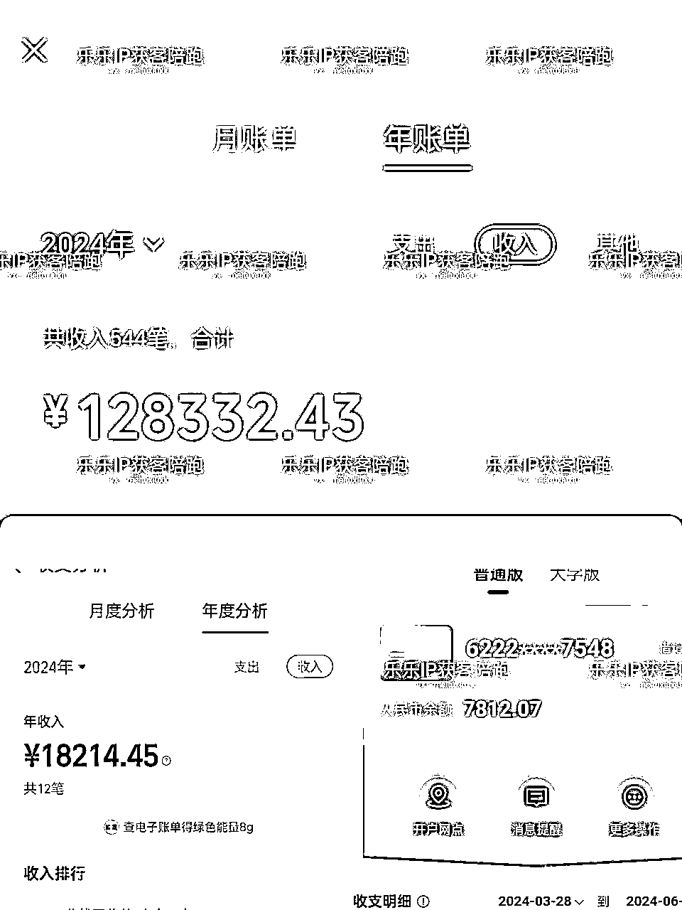
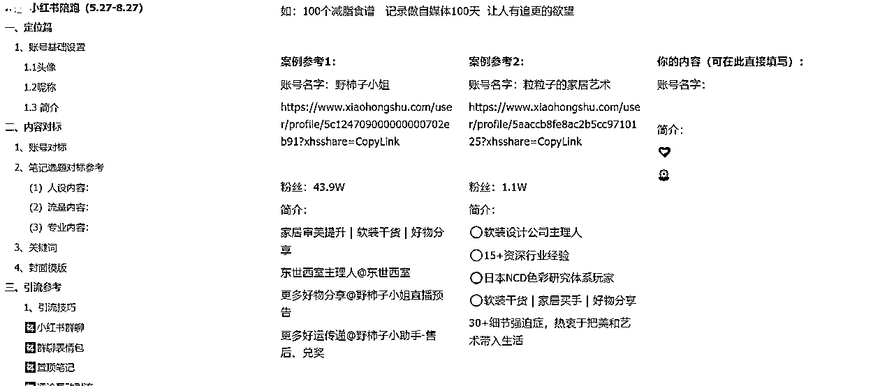
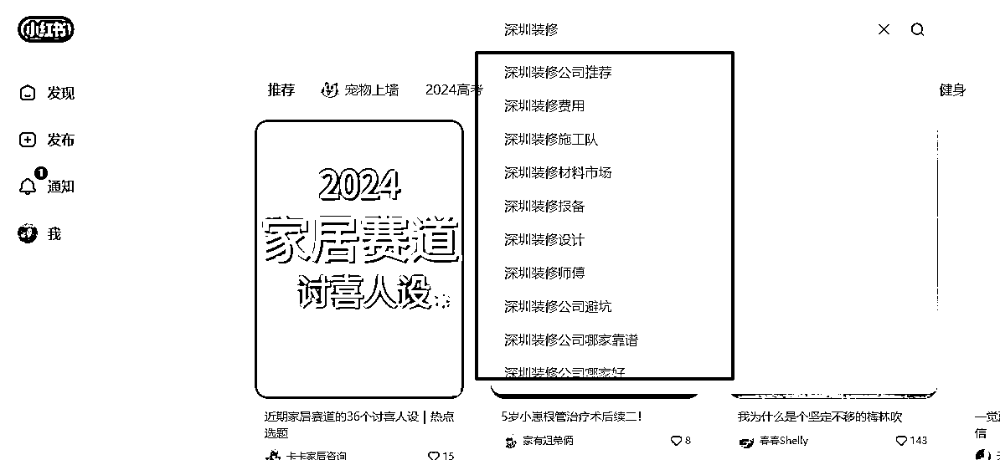

# 离职后转型做小红书个体服务商，半年变现15万，我是怎么跑通的？

> 来源：[https://ffnudxerwe.feishu.cn/docx/IWWGdHArqoAuRGxlUnHcOfnFnfb](https://ffnudxerwe.feishu.cn/docx/IWWGdHArqoAuRGxlUnHcOfnFnfb)

见帖生财，我是颜乐乐。2022年4月加入生财，今年我在生财的第三年，也是我自由职业第1年。

今天我想跟大家讲讲，我离职后的转型经历，非常适合职场从事品牌，运营，市场推广等岗位的伙伴参考。

很荣幸，第一年，我在尝试了好几个方向后，终于跑通了闭环。从每月靠2000的失业救助金到现在可以自立更生，在5月份，我的月收入突破了4万。上半年累计收入在15万。目前主要从事的小红书高客单获客陪跑，服务的客户大多是深圳地区的个体户或者实体门店。

看到这里，你是不是觉得，哇塞，我要辞职，我要创业，我要生财，我要做炒掉老板。然后，事实上，并没有那么顺，先吃口冰西瓜冷静下。今天我将会把我是如何选择这个赛道以及后面的运营变现的思考一起分享给你。

### （一）运营人离了公司，还能活吗？

之前在生财泡着的时候也在想，是不是离了企业，我就活不下去了。因为当时收入比较单一，只有工资收入和少量的自媒体收入。但很不幸，23年5月，我没有保住我的老板，所以失业了。被迫离职，离职之后家里发生了一些事，就没法再继续去上班了。但，不上班，也要生活不是。

从职场出来后，其实我知道我可以做一些运营相关的工作。毕竟以前工资2万，我自己在家接代运营一个月赚个几千块还是没问题的。同时我也确实这样做了两个月，但事实证明，一个人2只手，又搞孩子又搞代运营工作，根本忙不赢，接少了收入跟不上，接多了做不了，因为涉及到做图，文案等内容，都要我自己动手，因为代运营的老板，大多是个体户，他们预算非常有限，对ROI又极为敏感。而账号稳定后，有一定的量，他们一般会拿回去自己发，也摸到了这个内容的规律了。代运营这条路在做到第二个月的时候，我就放弃了。

想赚钱，钱不会自己来，要去解决问题，问题解决了，钱就来了。可，我能解决什么问题呢？

代运营的工作结束后，我因为逃避又去做了一些不需要和人说话的项目，短剧推广和公众号流量主，直播切片，无一例外，变现不怎么样，但粉丝倒是涨了不少。但也因为天天呆在家，白天工作效率并不高，晚上老熬夜，钱没赚几个，小命快没了。于是，我又开始寻找，什么才是适合我的道理。在这期间，我也去测了盖洛普。

典型的小黄人和小蓝人。找了老师给我做解读后，我思虑再三，还是应该去多接触人。

### （二）职业技能迁移后，产品怎么设计

通过回顾我的过往经历，小红书：一万粉，抖音：6000粉，今日头条:2万粉

写得不咋好，能写，拍得不咋好，能拍。

曾经在上班的时候也做出过累计播放过亿的视频。我没有产品，那能不能为有产品和服务的个体服务呢？可是，代运营我也不想接啊。

当时在生财发贴看到很多做小红书服务这块的老师，便加了他们围观了一下。感觉这个事，我好像也能做，但又感觉自己不够牛，要是被怼怎么办？后来看到有人说到本地市场，当是觉得要不我就先只做深圳，试试看。

当时接近年关了，很多人都在做新年的计划。我当时就想，是不是会有人想明年计划做小红书获客，但不知道咋做，也不知道平台有什么玩法。我把人约到线下来聊，面对面聊小红书和明年怎么做号引流放大业务。

于是第一个产品出现了：

1、线下一对一咨询

我用以前在企业，帮公司做媒体账号，根据业务找到人群特点，设计内容的方式。那我能不能，也来帮个体老板们做梳理账号定位，梳理完了，送一个年度社群，你在里面做的时候有问题可以群里问我？我向身边的人分享了这个想法，就开始有人感兴趣了。

比起线上海量的老师，我立足本地，同时可以出来面对面的一对一讲，除了费时间精力，用户来说也体验非常好。问到的一些实操问题，我当场就直接示范给他看了，省事。这个价格，可以拦住一些，没有业务没有后端的人。

有交付，也有售后，所以口碑和评价上，就这样立住了。

这个产品帮我积累了第一批用户，大概有30人左右，基中这里面一半都是转介绍。

目前因为精力原因，线下我还在做，价格已经涨到了699，但每月只做8个，一周2个。这样我能出门见人，身心愉悦些，也能保持和用户的深度链接。

但只有这样也不够，因为很多用户聊完脑子知道了，手还是不会，写的标题很烂，钩子不会设计，卖点不会提炼，文案没有结构。这时有咨询的学员找我说，能不能一对一陪跑一段时间，我一想，也不是不行。

于是我的第二个产品出现了。

2、一对一陪跑 3980三个月

因为我没做过，也不知道SOP是怎么样的，但我花过钱，体验过别人的服务。一般是老师做前期的关键沟通，然后就助教跟进，我没有助教（没钱请）所以就全程自己跟就好了。

当时客户说，他们行业4000-5000这个价格肯定是可以接受的，于是我设置了一个3980的体验价。我的陪跑是从一对一咨询转化来的，因为他们一对一咨询后，比较了解我了，再入陪跑就比较好接受。

陪跑这里，因为高客单，肯定要有比较明确的交付点。总不能说一对一答疑3个月吧。人家付了钱，总要得到点什么。在第一个客户跑了一个月后，我对陪跑这个模式相对清晰。就是陪着用户把这个事情推下去。

这个时候我们的服务清单就梳理出来了，重点有5部分：

（1) 建议合作，客户迷茫，我去梳理当时最重要的问题，是账号内容生产，还是定位，找到问题，提供解题思路

（2）根据解题思路，协助帮客户找对标，找选题库

（3）客户问，我去答疑，客户做，我去纠正

（4）客户摸鱼，我去按按头

（5）客户心情不好，我给心理按摩

基于这个，我就必须要提供对应的数据，做相应的内容计划。方便用户可以随时查看，

我的工作也明确了，每周必须要去看号，去盯着客户，每周至少沟通3次。

在服务客户的过程中，我的工作也更加明确了。

到这里，其实我的产品已经有2个了，私域也转化了几个高客单的客户。

算是跑通了一阶段的闭环了。

### （三）只有私域是不够了，要去跑公域

我一个做陪跑的，光给客户做，私域流量是不够的，还得去公域跑。前期基于转介绍有点饭吃，但始终不长久。因为流量还是持续把这个生意做下去的关键。

前面我提过我自己有小红书号，很不幸，我对这个账号进行转型过程中，遭遇了万粉号被平台封号的问题。一时之间，感觉天都踏了，原因是被人反复举报。（我建议大家不要去跟别人聊自己的账号，除了我的深度付费用户，后面都不会随便给人随便看我的号）

号没了，怎么办咯？那就，再开一个吧。我一个陪跑小红书的还做不了第二个号吗？于是我从平台找对标，做了两个号，一个是账号拆解，一个是垂直赛道干货。

不出所料，账号拆解跑得很快（这个是平台本身经过验证的模式），不到2个月直接跑了5000粉。加到私域近千人。加过来以后，问题又来了。这些流量太泛了，转化效率很低。来的人最多买个社群，就是我之前送给咨询客户的社群，我以199的价格卖给他们。（现有产品不够的时候，加产品进来补充）

其实大家看到这，聪明的伙伴已经发现我的问题了。你明明前面做深圳本地才有优势，做公域也尽量围绕深圳不就可以了吗？做全国，你拿什么和大博主PK？是嘛，这个坑那么明显，我就是踩了。

基于我的过往经历和地域优势，我家住百安居附近，之前我服务过一些保险客户。

我把账号内容调整成我做过的保险、家居、减脂等赛道。不出所料，内容调整后，加来的人就确实有同城且这个行业的，最快的成交是用户加了我，然后1个小时后我们见面了，喝了一杯咖啡后，决定了一对一陪跑。

到现在，我服务的客户，大多就是同城，深圳香港地区。我也相信，我基于同城做下去，一定还会有更大的空间。

### （四）我的交付，如何逐步完善的？

做服务的，实际上，在做的过程中，才会发现用户真正的需求是什么。对于新手来说，不要做标品，因为流量真的有限，一定要做非标，才有可能有差异化。一对一的差异化解决问题。

为了保证服务效果，在下单服务后，我会先进行一次电话沟通，了解他最想我帮忙解决的问题是什么，同时我提供自己的解题思路。当然这个电话结束后，我会进行一次内容调研，平台哪些做得好的，出一个内容策划出来。

然后进行二次电话沟通，目的是对齐双方对小红书这个赛道上的内容要求和获客思路。

确定以后就进行第一批内容测试，完成第一阶段的执行工作。

在内容的设计上，我会针对具体的赛道，搭建内容铁三角，特别是有具体的业务场景的商家，在获客上，我们的账号笔记由三部分构成。

1.  流量型选题（40%）-提升曝光、覆盖人群广，让更多人认识你

1.  专业型选题（40%）-展示专业能力，提升你的专业度、让用户知道这一领域你真的牛

1.  ⼈设型选题（20%）-展示差异化，建⽴粉丝粘性，告诉用户为什么找你

从知道你——认识你——信任你——为你付钱。成交是个进度条，那用户在小红书看你的内容也是个进度条。

通过流量内容看到你，进了主页通过专业内容信任你，同时看到置顶的人设内容介绍自己表明业务范围，链接你，咨询问价。

因为本身都是本地有业务需求的才会搜索，这一块也会更加着重在关键词搜索上。

这一块的关键词获取，之前生财伙伴也分享过，基于输入法的A-Z来抓取就可以了。

因为我公域引流都是一个赛道，所以来的人也比较类似，在赛道的了解上，我会随着接手的客户越来越多，业务理解程度更高，后续新客户聊起来转化率也会更高一些，技能+垂直行业，越打磨就越值钱。

### （五）渠道合作，增加收入多元性

公域流量开始跑了以后，客户量就上涨了。每个月有300-400的流量进来，转化上我自己一个月就接5-6单陪跑，因为前期交付比较重，暂时也接不了太多。这个情况就会，就会出现，有客户，我没法消化。有一些项目太大了，那我能怎么办？找人合作啊！不要什么都想自己吃。

于是我也整合了一些做小红书陪跑私教这块的老师，有的是北方的，有的是做香港保险赛道的。在跟他们的合作过程中，我也小赚了一些钱，只要做流量，他们做好交付就行。

在这合作的过程中，我真诚的推荐，也会让他们愿意推荐一些他们吃不完的客户给我。大家互相配合，一起CPS分佣，把盘子做大。

以上，是我关于自己离职后探索个体业务的一些分享。在此，感谢曾经在我探索路上给过我支持的芷蓝老师，靠谱老师，他们在我的产品推出，销售转化上打通了我的卡点，感谢生财这个平台，在我离职之前，我已经参加了7次航海，上了至少15艘船去不断探索自己的边界，如果不是因为不断的跑项目，我也没有勇气去做这样的尝试。感谢生财这个平台~哈哈 无限期续费呀！

祝福大家一起生财有术。