# 能落地！项目选择核心方法论，他帮我4次用5W做到年利润100W~

> 来源：[https://u16gtzbrexc.feishu.cn/docx/IZcwdkr5Xoe77bxau6lcJVsXnUg](https://u16gtzbrexc.feishu.cn/docx/IZcwdkr5Xoe77bxau6lcJVsXnUg)

大家好，我是千易。如果你现在感觉没有项目可做，不知道哪里有好项目，不知道自己该如何挑选项目，过去干了很多项目却失败居多，那么本篇文章一定要看完，专业给大家解决项目选择、项目判断的问题。

今天给大家分享的是选项目的底层方法论，也是我过去这么多年创业的经验总结，这套方法论帮我3次用5W资金做到年利润100W，我觉得能够帮助很多人拿到结果。再过去的两年中，我也测试了多个项目，用这套方法没有亏过钱，基本都能跑通从0到1。

这套方法论都是实操总结，能落地！非常适合个人、新手小白、团队扩展新项目。

本文就以内容型直播间项目选择为例给大家讲讲如何正确的挑选项目，判断项目，做项目。

不知道内容型直播间是什么的朋友，先看这篇分享：

Ps:本文列举的项目都仅仅是列举，并不是推荐大家照抄去做，学方法才是正确方式！

* * *

# 项目选择底层认知

你们有没有见过那种创业大佬，做什么项目都成，做什么项目都赚钱。我刚开始创业的时候特别佩服这样的人。为什么我做项目就只能挣个零花钱呢，核心问题就是出在项目的选择、判断上。由于我们对项目的判断能力、选择能力不一样，导致最后的结果千差万别，运营技术都是可以很快学会的。有道无术，术尚可求，有术无道，止于术。在讲方法之前，请先理解有关项目的底层逻辑。

1、一个项目想要成，首先是得保证项目本身有市场，能挣钱；其次得看自身优势能不能干掉竞争对手，最后看自己能不能干到行业前三，干不到就只能短期挣钱，终会被人干掉。

2、告别瞎想，实际分析。现在整个市场的竞争已经非常大了，而咱们国民不缺非常聪明，非常勤奋的人，市场空白很少很少，不要为了避免竞争去臆想很多产品和项目。除非你是天才，要不老老实实的找到已经有人做成功的项目进去做。普通人创业就是复制，谁赚钱复制谁，创新是有能力的大公司干的，二八定律，九死一生！

3、复制的前提是调研！项目成败80%的因素都是在调研阶段。选择一个高手林立，自身又没有优势的项目注定是失败的。我们要找的是还在成长期的项目，对手比自己还弱小的项目。你是小学水平去打幼儿园水平的，才有胜算！

4、调研的结果就是找到对标！如何判断自己选择项目一定是真实的，有市场，竞争小的项目呢？核心就是找到对标，有赚钱的对标，就代表项目本身没有问题。

5、对标才是最好的老师！对标能够告诉我们整个项目是如何运营的，大到项目天花板、用户画像，产品组成，竞争对手的水平，小到话术、养号的所有问题，对标已经帮你测试好了。所以，有对标就是开卷考试，照抄！

6、提高胜算的唯一做法就是没把握不干。为什么找到了对标还容易做不成项目呢？很多时候是你不具备对标的资金、资源、技术能力等成功要素，从而难以复制。如果对标比较强，自身差距较大，就寻找其他项目，不要贸然去干！猎豹也是在潜伏很久以后才主动出击一次。所有人的时间、精力、资金都是有限的，必须得在有胜算的时候出击。

7、一个项目就是一个系统。无论多小的项目，都有其特定的经验和方法，所以从0到1一定是需要时间积累的，所以当你决定做一个项目的时候，也需要给自己足够的时间和精力测试，实操迭代才有可能成，猴子捡西瓜是做不出成绩的。

8、判断能力才是选择项目的难点。一个项目最后能不能成，客观环境我们没法控制，能够准确判断项目的市场环境、竞争对手能力，以及未来可能的风险是很难的，这是一个经验积累的活儿。而人的大脑在判断的时候，经常出现高估自己，低估对手的情况，真正交战的时候才发现对手异常强大。

9、用数量提高胜算。在选择项目的过程中，你觉得是从3个项目中选一个，还是从300个项目中选一个，更容易找到适合自己的项目呢？世界的发展是不平均的，行业也是这样，总会有项目在发展期，竞争少，竞争弱，想要找到这样的项目，就得多看，多听，多搜集信息，然后按照这个方法论分析判断。

10、整个项目选择一定要按照这个流程走：粗选一个赛道——调研赛道——找到对标——分析敌我形势——确定优势，有胜算——搭团队——测试项目（MVP），扣细节——不断迭代——成功or放弃。

这个顺序千万不要随意调整。在实操过程中，后一个节点有问题，可以通过调整前一个节点修正。比如，赛道没问题，测试项目一直做不出来，那极有可能是团队人员问题，换人就是解决方案。但是如果是赛道本身有问题，换人也没用。如果人和赛道都没问题，那就死扣细节，不断研究，肯定能做出来。

# 粗选赛道方向

## 一、什么是赛道

1、赛道就是一个行业，一个项目的称呼。做电商卖女装、男装、玩具就是不同的赛道。赛道可以不断细分，比如，女装可以按风格、年龄、价位、人群等细分，比如大码女装、通勤风、汉服等，细分赛道会更加具体到一类人群。

2、那么什么不是赛道呢，就是很多个行业，项目的称呼，比如大健康产业、旅游产业，他是一类项目的统称，并不是一个。所以选择赛道的时候不要选这种很大的、概念类的。比如达人领域里面的很多分类就不是赛道。

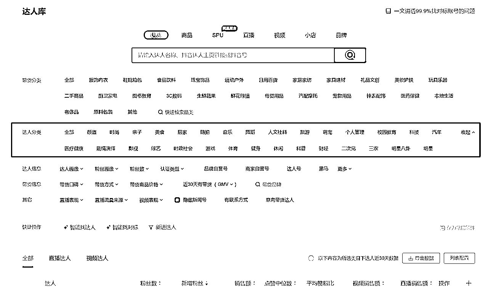

## 二、如何粗选赛道

1、在我们对很多个赛道都不了解的时候，不要盲目选择某一个赛道，而是先分析下自己的优势情况，把一些肯定没有优势的赛道排除，再从有可能的赛道里面找三几个，进去调研。

以内容型直播间为例，一个项目需要从这几个方面考虑，所需要的资源和能力匹配是成功的前提，也是选择赛道的出发点。

2、做项目只有自己的优势和项目本身契合才有可能挣到钱，不要一味的考虑追风口，机会都是会有准备的人的。首先要做的是对自我优势进行剖析。每个人的人生经历，生活方式，家庭资源，所在地域不通，都会给你一些别人没有的东西，而这些东西很有可能成为你的优势。具体自身的优势判断看下图。

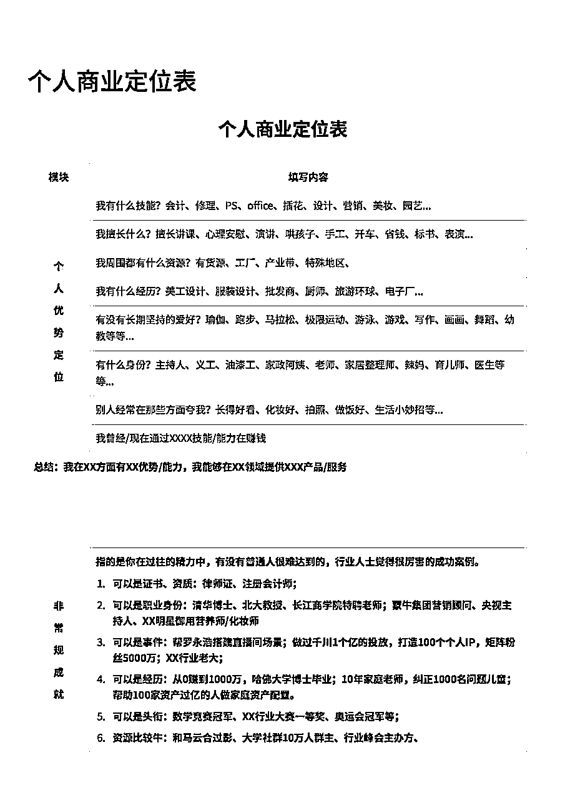

3、优先在自己的优势里面选择赛道，因为每个人的优势都是通过时间精力积累起来的，从0开始学会花费很大的时间，而从你现在的优势出发，胜算会更大一些。

4、从客观环境来说，一个项目做成得需要几个方面相互匹配才有可能做成，所以在分析自身优势的时候，也要判断下自身的整体优势和那个赛道更加契合。

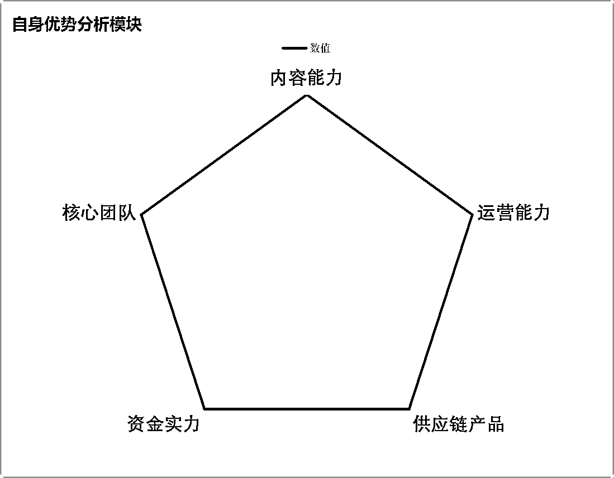

5、先记录下来自己想做，有优势的赛道，从里面挑选出来3个左右，开始进行调研。

## 三、常见问题

1、很多人容易听到一个信息差觉得某个赛道好，全然不管自身的优势能不能做。为了追风口盲目进去，大多数是拿不到结果的；

2、要用开放的心态做这个环节，除了肯定干不了的赛道，其他都可以考虑，不要在这个环节下决定。否则你的分析和判断会出现确认偏误思维，从而导致决策片面性。未见全貌，不予置评。

3、没有优势怎么办？绝大部分人都有优势，只是你还没有发现优势。如果你实在找不到自己的优势，就先选择一个比较容易上手的赛道，先从能干的项目干起来，从而在过程中挖掘。生财航海就很合适！

# 调研阶段

从这个时候才真正进入到调研阶段。调研的过程就是收集信息，判断信息、不断排除筛选的过程。很多时候大家觉得自己有很多条路可以走，但是当你把敌我形势分析之后，你会发现最优解的道路不过一两条。这就是调研的意义。

## 一、确定平台

1、现在做业务有多个平台可以选择，抖音、视频号、小红书、美团、百度、虾皮、亚马逊等等。首先确定一个平台。每个平台都有自己的调性、人群、内容风格，同一个赛道在不同的平台针对的人群画像也可能不一样。所以，在调研之前，先确定一个平台。比如内容型直播间，抖音，快手、视频号、小红书都可以做。

2、各个平台的整体情况总结

（1）快手的红利期比较小，而且人群增长乏力，付费太高，某些类目管控较松；

（2）抖音最大的内容平台，人群广，细分多，但竞争越来越大，高客单更难，付费占比越来越高，今年内容型直播间、短视频真人带货是还不错的方向；

（3）视频号比较蓝海，对普通人来说更友好，人群偏大龄偏下限，但是付费较低，免费流空间大，很多抖音干不下去的都来视频号干了，新手小白建议进入；

（4）小红书比较蓝海，对普通人来说更友好，他本身是UGC平台，素人很多，用户层次较高，高客单价产品更容易成交，而且管控较松，大健康领域很多违规词都可以直接说。

3、从客观情况来说，新手推荐视频号、小红书，其次是抖音，最后是快手。

4、从个人主观情况看，你总是玩哪个，你喜欢哪个平台，就可以优先考虑。

5、小团队，个人想要追求一年几十万利润，这几个平台都可能做到。如果追求高爆发，大流量只有抖音。

总结：根据个人习惯和平台红利期选择就行，先干成一个平台，再扩展其他平台。如果实在确定不了，几个平台一起调研也可以。

## 二、确定赛道形式

1、同一个赛道里面有不同的变现形式，你首先得确定下方向。抖音平台可以开店做商品卡，开店对接达人，短视频带货、直播带货、图文带货，先选择其中一个方向，然后找对标。

2、从利润角度来说，做流量端比做供应链高，有流量能力做流量，没有流量能力，有供应链资源做供应链；

3、从内容难度来说，真人出镜＞非真人＞半无人，直播＞短视频＞图文。

内容难度排序就是，真人出镜直播＞非真人出镜直播＞真人出镜短视频＞半无人直播＞非真人出镜短视频＞真人出镜图文＞非真人出镜图文。

## 三、找到赛道里面所有的账号

### 1、底层认知

（1）调研第一步目标，看到一个赛道的全貌，收集到足够多的信息，信息越多，越全，做决定正确率越高；

（2）账号是项目的承载体，找到足够多的账号数据，就能看到整个项目的信息；

（3）很多人喜欢找到几个账号，就确定对标模仿，这也容易出现确认偏误思维；

（4）数量越多，数据越多，你才能对项目有深入的理解。所以，你看我们做调研都是看上千、上万个账号。千万不要用战术勤奋，掩盖战略的懒略！

### 2、如何找账号

你是做抖音短视频方向，就从抖音找短视频账号；是视频号直播方向，就从视频号找直播账号。以抖音为例；

（1）商品匹配账号法。用蝉妈妈等数据平台，搜索产品关键词，从而找到对应的账号，记录其数据。

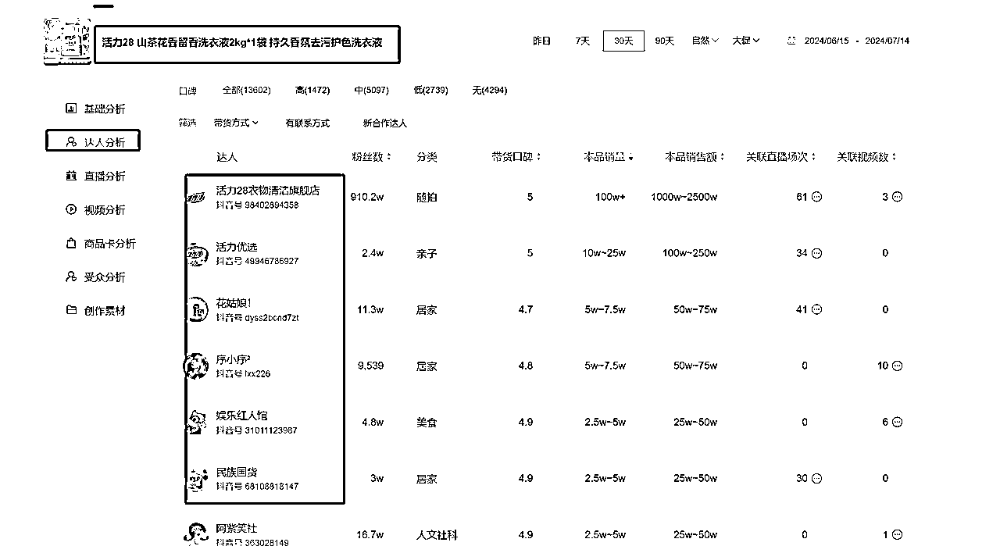

（2）达人商品关联法。当你找到一个账号，你要看下他的带货列表，然后从带货列表里面还能找到其他做同赛道的达人。

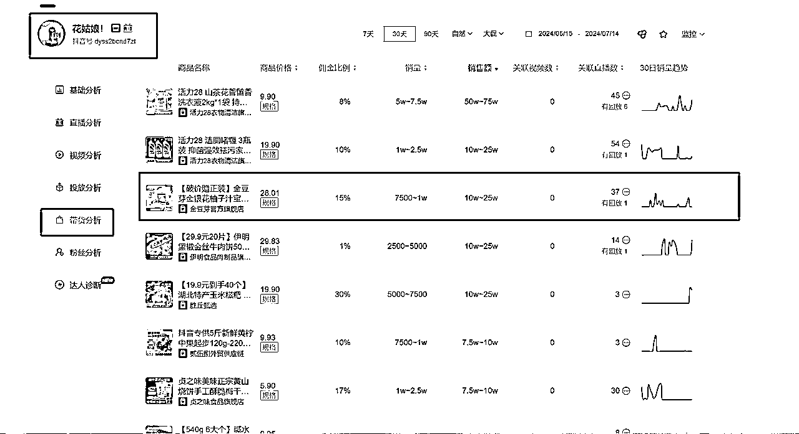

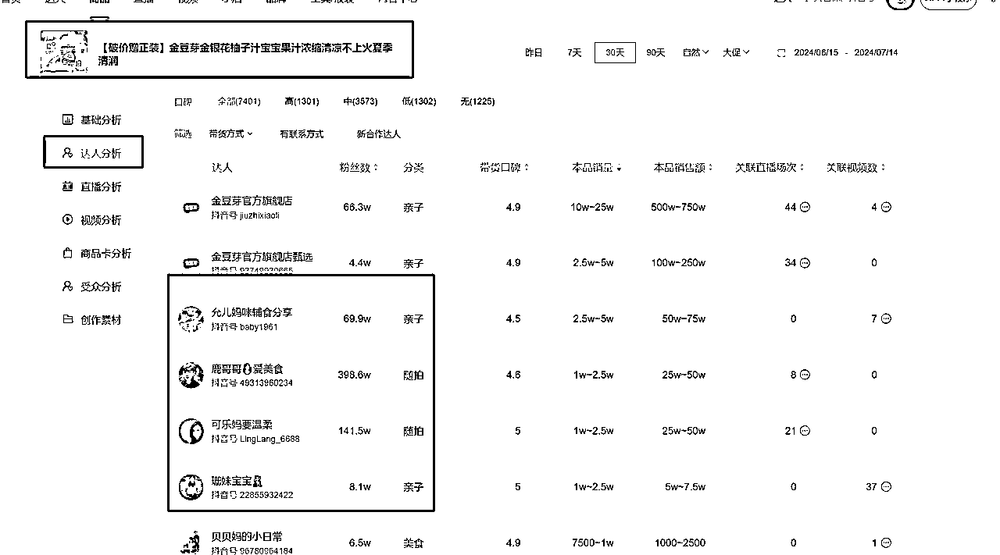

（3）关键词搜索账号法。当你找到确定某个赛道就一定有对应的关键词，那我就可以搜索对应的关键词，直接找到账号，比如搜索，清仓，护肤这样的词。使用平台：抖音APP、蝉妈妈、达人广场。

在找的时候用筛选功能，你如果是找直播间账号，就选择直播达人，是短视频账号就只看短视频达人。

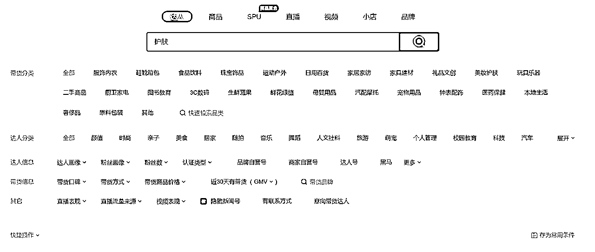

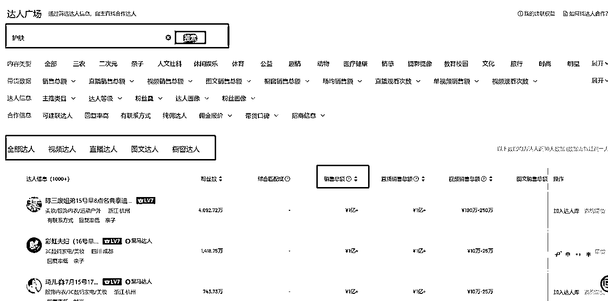

（4）系统推荐法。拿出一个新注册的抖音号，养号做标签，然后搜索赛道的关键词，点赞关注，把账号养成赛道用户的标签，这样系统就会给你推荐你想要的达人账号和内容了，现在抖音系统的反应速度很快。

### 3、关键词从哪儿来

如何找到一个赛道的很多个关键词，是搜索方法用的好不好的关键。赛道的关键词，分为产品词、用户词、人群词、类目词等形式。

（1）产品关键词。主要看产品的标题，标题里面会有很多很多产品方面关键词，总结在表格里。比如这个产品提取关键词、洗衣液、去污、护色、香氛、持久、山茶花等等关键词。

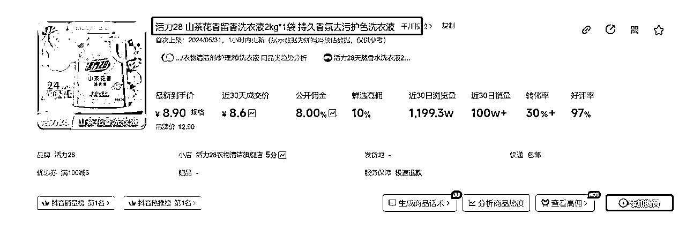

（2）产品关键词扩展。用巨量算数，百度指数，5118，微信指数，淘宝指数等都可以。

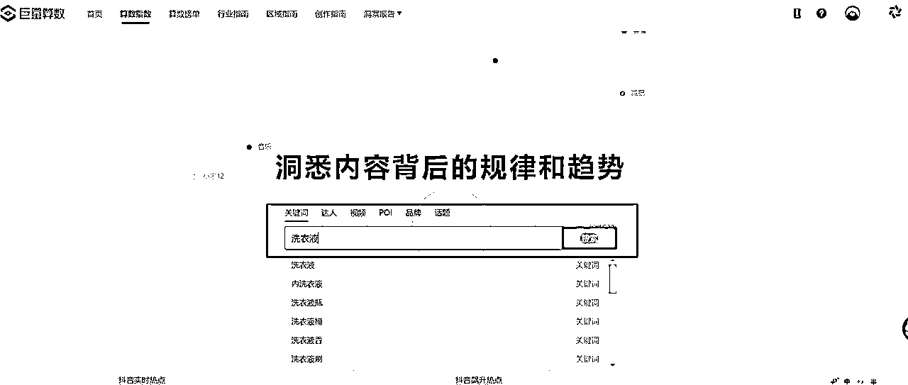

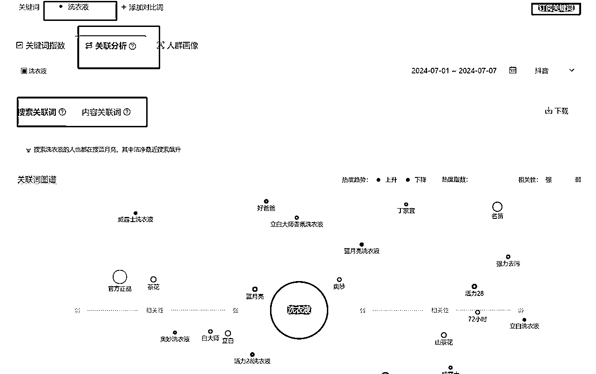

（3）话题词扩展。抖音平台都很多话题词，话题词之间也有关联。可以直接做关键词用。

总结：赛道的关键词多少决定了数据搜集的速度和完整度，关键词数量多，更容易找到全面的账号数据。

## 四、记录账号数据

找到账号以后要把账号数据都记录下来，为了后面做分析。抖音平台的账号数据优先看达人广场的数据，其次看蝉妈妈的数据，小红书用灰豚和APP前端数据，视频号手动统计。

# 数据清洗

统计好的数据在分析之前，得先把账号进行分类。因为大赛道下面，还有细分赛道，把赛道进行细分，可以在分析的时候更加准确和全面。比如健身赛道，就可以细分为，有氧健身、塑形增肌、健身舞、形体运动、瑜伽、还有偏向中老年的拍打操。

具体细分标准：同一类用户画像，同一个卖点主题，同一类产品、同一类流量形式放在一起，不同的单独细分。比如健身类的细分表格。

有一些明显的数据错误也要修正，否则容易出现判断错误。

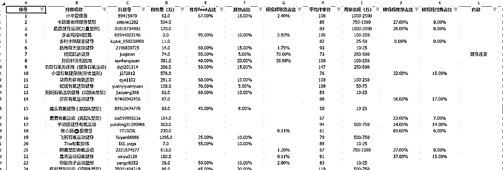

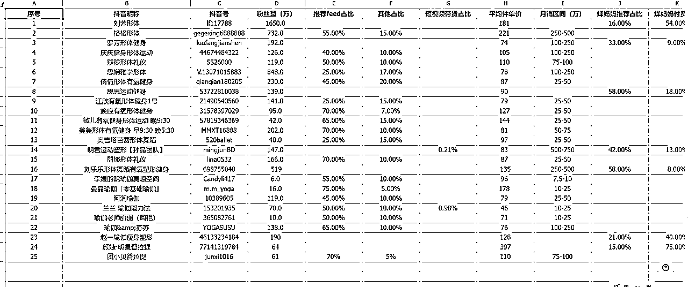

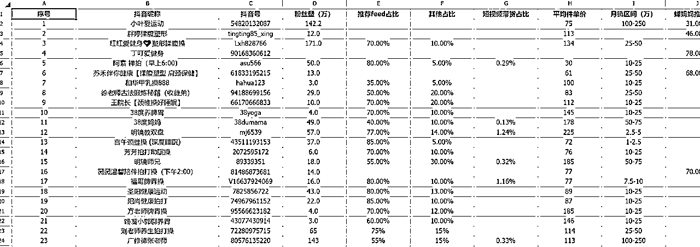

# 分析数据

把一个赛道里面的大部分账号都找到以后，就要对账号进行分析和总结，从而判断自己能不能做，天花板多高、竞争对手情况，是否匹配自身情况等等。判断选择是难点。

## 一、项目整体判断

### 1、项目的存活周期多久。

看在这个赛道里干的最久，粉丝量比较大的账号从而确定赛道的周期，如果有干超过1年的账号说明赛道本身可以存活很久，但竞争在逐渐激烈。如果都是新账号，就要分析什么原因到底账号容易死；比如健身赛道，前几个大号都是19年、20年开始的。具体看数据用蝉妈妈。

比较好的情况是赛道头部账号1-3个十几万几十万粉丝，中间一堆全是几千，几万的账号。

没有第三方数据平台的，看他第一个短视频发布的时间、第一场直播时间。

### 2、项目的天花板多高。

一个赛道里面营收最大的号基本就是项目的天花板。比如健身直播间最多是1000-2500W。如果你是新手想要进入，你的天花板大概就是行业老大的1/3左右，也就是你努力干差不多100-300W。在差一点就是几十W。看统计数据。

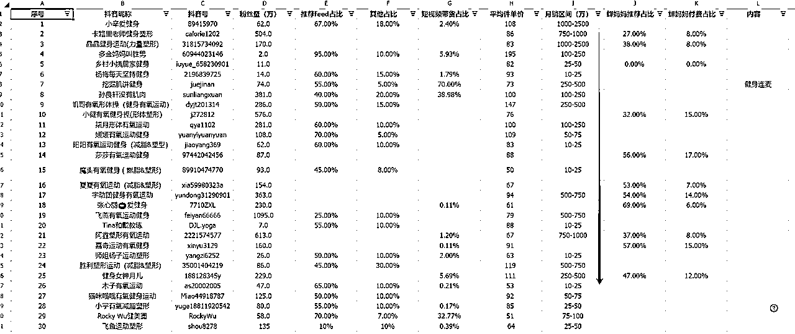

### 3、项目所在阶段

判断这个项目是否还在红利期，主要看看两个方面：

（1）行业大佬是免费流还是付费流，如果行业大佬都是付费的话，那红利期最起码是中后期了；

（2）新起的几千，几万粉丝的账号是免费流还是付费流，如果新账号付费比例也在50%以上，那基本没有红利期了。比如你看护肤带货赛道，除了护肤教程类直播间以外，其他带货直播间全是付费。

注意：没有流量红利的赛道新手不要进入，竞争白热化，存量市场玩起来很累，失败率还高。老大老二神仙打架，后面一群都得死。

## 二、项目竞争分析

接下来做竞争对手分析，从而判断这个项目的竞争难度。从以下几个方面综合分析，竞争难度大不大。

1、看有没有近3个月新起的号，如果一个行业没有新号出现，就代表竞争很大了；比较好的情况就是近1个月，有几千、几万粉丝的账号带货能够做到几十万的，并且有几个同样的案例；比如，有氧减脂赛道，几万粉丝的账号销量和自然流都低很多，一个月不过30W。

2、看新号的流量规模和头部账号的区别大不大。如果新号能够做到头部差不多代表竞争不大，如果能够明显看到分层，粉丝多时间久的账号流量大，新号流量小很多，那么就是竞争较大；对起号的能力要求较高！

3、新号的付费占比超过50%，有的类目看大账号是自然流，但是看新起的号付费比例高，那代表内容同质化较严重，新号做同样的内容不容易拿到流量，需要更新内容；这种不建议新手做；

4、近1个月新号起号的数量很多，有超过5个起来了，还有一堆正在起的，代表进场的人多，很多人都发现了该赛道，也是竞争逐渐变激烈的体现。这个时候一定要快速进入，快速起号。抖音有明显的先发优势！

5、同一赛道有非真人、真人和IP，要看下成功账号的比例，如果近1个月已经没有非真人账号起号，那代表非真人竞争激烈了，一定要做真人类内容的账号。

6、看下账号的粉丝增长情况，赛道大账号和新起的账号粉丝增长速度差不多，就说明赛道还有很多流量未被挖掘，竞争不大；如果大账号已经停止涨粉，甚至掉粉，而新账号大量涨粉，流量大，说明新账号挖掘了老号没有挖掘的人群，直接对标新账号；如果整个赛道账号涨粉都很慢，就是竞争很大。

总结：竞争分析后，要找到，近1个月，免费流起号，稳定盈利，的新号作为对标，开始进行更加深入的分析。如果没有近期起来的账号，该赛道慎重做！对标可以选择几个，但是必须是同赛道，同人群画像的。

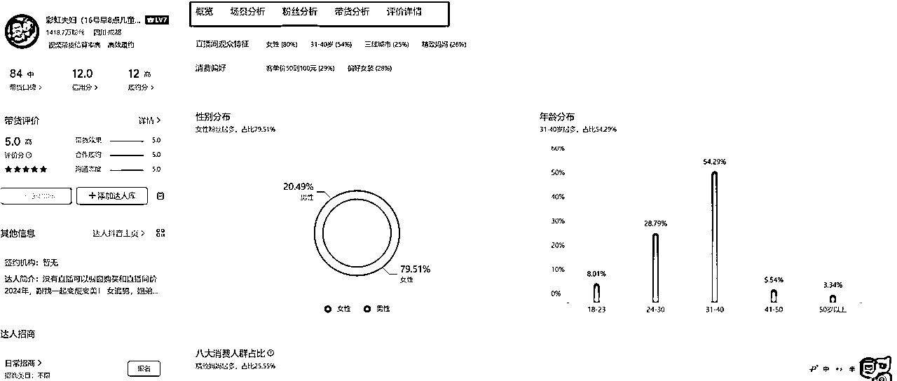

## 三、项目财务分析

找到对标以后，根据对标的情况进行如下分析，从而确定自己的成功概率有多高。

### 1、项目盈利能力分析

当我们找到对标以后，首先看对标主带的产品，产品价格，产品来源，单日销售额，退货率，计算利润。

销售额 = 产品价格 * 成交人数

退货率 = 退货金额/销售额

利润率 = 佣金率*0.9（10%技术服务费）=产品成本/销售额

成本 = 人员成本 +场地成本 + 损耗成本 + 投流成本

净利润 = 销售额*（1-退货率）*利润率 - 成本

（1）销售额数据来自于精选联盟

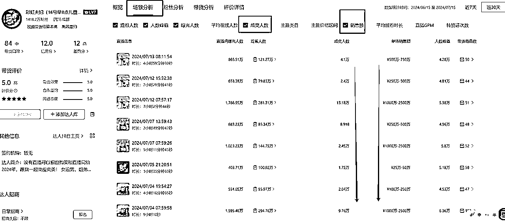

（2）免费流占比和付费流占比，付费和其他是含在一起的，其他很高代表有付费。

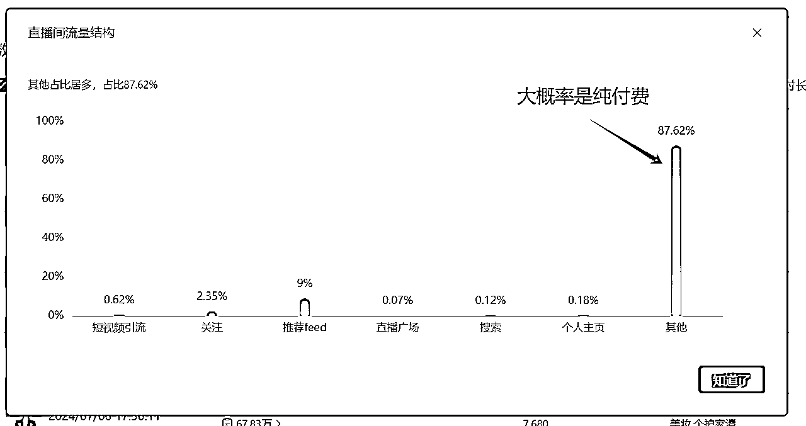

（3）退货率直接问供应链，他会给你准确的同行数据。

总结：最后算出对标账号单日、单月的净利润，然后这个项目是否能够满足自己的预期。

### 2、项目风险分析

所有的项目都有风险，哪怕你调研的多好，都有可能失败，我们要做的就是就是在提前做好最坏的打算。如果这个项目做下去需要投入多少，亏会亏多少。

（1）基础投入：场地、手机、手机卡花费、员工薪资等，自己算下；

（2）设备投入：真人出镜直播间的设备投入会比较大，不清楚的看我之前分享的文章

（3）产品投入：如果是走精选联盟没有投入，如果是自己进货需要计算产品成本、仓储成本、发货成本、快递成本。新手不建议囤货；

（4）投流成本：前期起号不考虑，免费流起不来号，投流也同样起不来。除非你是做纯付费项目的；

（5）机会成本：很多人并不知道计算这一部分，如果你是全职干都要考虑如果我上班一个月会赚多少，现在由于做这个项目不上班了，导致这部分收入没有了，如果项目失败，这部分也会损失掉。

总结，根据自身的情况，尽可能的把这些都算出来，然后加在一起算出总数，总数的1.2倍基本就是你的成本。

### 3、现金流分析

风险就是如果项目失败，你要付出的时间和资金总和，你要看下自己是否能够承受这个风险。如果可以的话就可以继续往下分析。

很多人容易把投入产出和现金流混在一起谈。其实他俩是截然不同的。接下来说说现金流分析。

（1）个人整体现金流。如果你是全职干，要计算下自己的现金流能够支撑自己多久的生活，比如现在存款20W，每个月家庭花费1W，那你首先要保证未来1年不挣钱是可以正常生活的，也就是你要给家里至少预留10-15W的资金。不要总是想着背水一战，大概率是失败，为什么那么多公司老板都跑路呢？

（2）创业资金可以支撑几次失败。每个人做项目都没法保证每次都成功，我们也需要数量打败概率!所以自己成功的其中一个重要因素，就是可以做几次尝试。比如现在可以拿5W做项目，每个项目花费1W，你就有5次机会。如果一个项目需要花5W，那你只有1次机会。尽可能降低测试成本也是重点！

（3）项目正常运营需要多少资金支撑。看对标做起来后需要多少资金支撑这个项目运行。比如内容型直播间，不投流，不囤货，那么就是人员成本很低。如果投流，那就得算投流成本，如果囤货就得算囤货周转资金。

具体可以看我之前的一篇文章理解下：

总结：做项目就像打麻将，不一定每把都能胡，而现金流就是你的筹码，不下牌桌总有机会！

# 复制难度分析

当对标找到了，盈利分析、风险分析、现金流分析都做了，觉得自己可以以上都不是问题，那么接下来就进入到复制难度分析，运营分析阶段。

运营阶段分析就要看自身是否有复制的能力，内容电商都需要从这五个方面分析，自身的优势和对标之间哪里有区别，哪里是我们的优势，哪里是我们的劣势，我们可以通过什么方法弥补自身的劣势，从而打败竞争对手。

核心：找到比我们还弱的对手进去打，成功概率才高。

## 一、拆解对标账号数据

首先，把对标账号近1个月的数据和起号时期的数据进行分析和拆解，知道对标现在的情况，以及停留、互动、下单数据水平，起号的周期，起号期的数据增长情况。

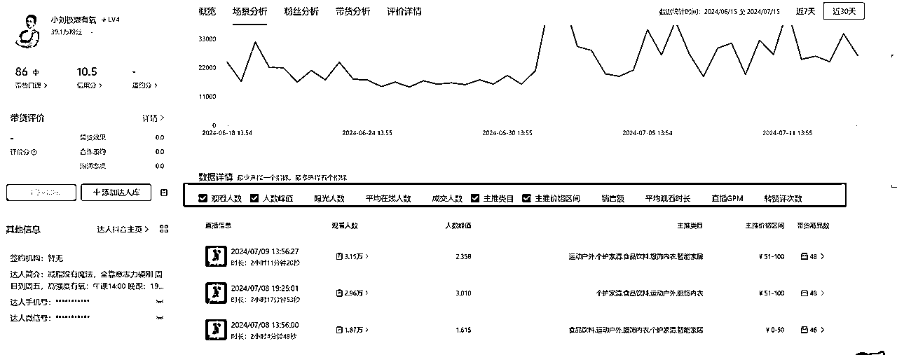

## 二、拆解对标账号直播间

### 1、画面维度

画面是真人还是非真人，画面是绿幕还是实景，画面是否高清，设备是否很好

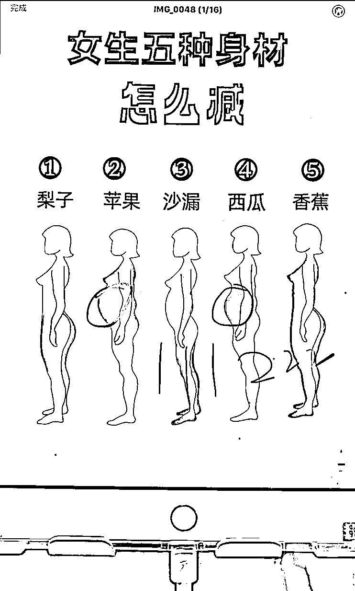

（1）这种类型的画面就很容易复制，直接手机开播，一个图片/平板，搭建费用很低，复制难度也低

（2）这种就是典型的绿植直播间，电脑+绿幕直播，搭建费用也不高，复制难度也低

（3）这种就是典型的实景直播间，搭建难度不高，但是成本要高很多，场地也不能太小

（4）这种也是实景，但是这种对设备的要求要高一些，搭建直播间光设备得几个W，成本也会高。

### 2、主播维度

主播是不是素人，专业知识水平、是否是IP，长相气质是否有特点，尤其是真人出镜直播间更要注意主播本身的问题

### 3、运营维度

对应的直播间是否有过起号的经验，对标直播间的运营难度是在自己水平的上面还是下面，是否懂平台的算法和逻辑，自己有没有这方面的优势或运营资源。如果你没有对应类型账号起号经验的话，是难以判断自己的情况的。这也是为什么很多人做抖音直播起不来的原因，运营经验没法量化，甚至招人都不一定能解决。

### 4、产品维度

项目所需的后端产品有哪儿来，对标是自己的品牌，自己找工厂生产的难度比较大；找的一件代发难度中等；如果用的是精选联盟/选品中心最简单，大部分走精选联盟的品都不用担心货源问题。

### 5、自身优势和项目的匹配度

接下来要综合判断下，自己现有的资源和优势能否做这个直播间，你可以按照这几个模块给自身和对标打分，然后做出来下面的雷达图。

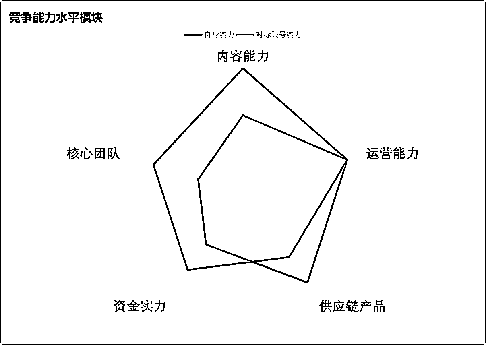

当你在分析这个项目的时候，发现其中的模块有劣势，也不要直接动手干，一定要找到解决方案。主播、运营、产品、硬件哪里有欠缺，需要用什么办法补齐。比如产品方面的多找几个供应链问问情况；主播运营等团队人员应该怎么解决；没有运营能力应该如何解决这个问题。

总结：自身的优势能力一定要和对标匹配才能增加成功概率，严重不匹配还想做就得想办法找人帮自己解决这些模块问题，否则成功率极低。

难点：分析判断打分，特别依赖自己对行业的认知、对竞争对手水平的准确判断，如果没有经验很容易出现判断失误，高估自身的优势，而低估竞争对手的能力。甚至有时候出现，判断中很多因素压根不知道，真正动手进去才发现原来自己丢了一些模块，而这些模块才是核心点，短时间无法解决。

# 项目分析总结

1、当我们按照以上的流程，把项目分析了一遍，自身优势和项目所需能力匹配上，这个项目的成功率才高；

2、胸有成竹，把项目做成开卷考试，是快速复制项目赚钱的前提条件，所以这部分操作一定不能省；

3、即便是这么多分析，真正到实际操作中，还会遇到很多细节的问题，项目刚开始要用MVP跑通流程；

4、MVP跑流程就以最低投入去跑，先卖出第1单，用最少的人，最少的钱是跑MVP，刚开始甚至佣金都不用谈，直接拿对标一模一样的链接直接开搞，先把流量搞出来，卖出去第一单再说后面的。

5、MVP第一单就是流程跑通的标志，代表项目真的可以成功，其中的细节操作都摸清楚了。然后再开始优化项目其中的细节，比如需要拉时长、场地、实景直播间、需要谈佣金等，都在出了第1单后开做，把项目真正的利润做出来。其标志就是项目超过盈亏平衡线。

6、然后在这个阶段，主播不懂的，运营不懂的，可以去找具体的课程学习，参加对应的航海，帮助自己更快的拿到结果。

7、在项目分析的每一个环节，判断自己是否能干，如果不能干，就不用继续了，可以换个赛道重新分析。

8、严格按照这个流程跑项目，不要调整顺序。

整个项目选择一定要按照这个流程走：粗选一个赛道——调研赛道——找到对标——分析敌我形势——确定优势，有胜算——搭团队——测试项目（MVP），扣细节——不断迭代——成功or放弃。

具体抖音内容型直播间的运营能力和技巧，本篇文章没法特别详细的分享，等到后面有机会再写出来。先找一个适合自己的项目吧！该项目分析方法论，不仅适合抖音，任何平台和赛道都可以用这套方法分析~

# 个人介绍

你好，我是千易，9年自媒体人，6年电商人，17年创业做今日头条至今。头条、抖音、视频号、小红书都做过，现在主要做抖音、小红书。连续三次用5W本金赚到100W，操盘过多个项目，现在主要做大健康产业的直播间和短视频带货，有相关资源的伙伴可以链接！