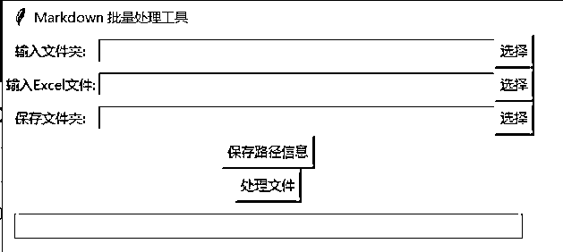
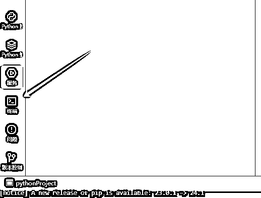
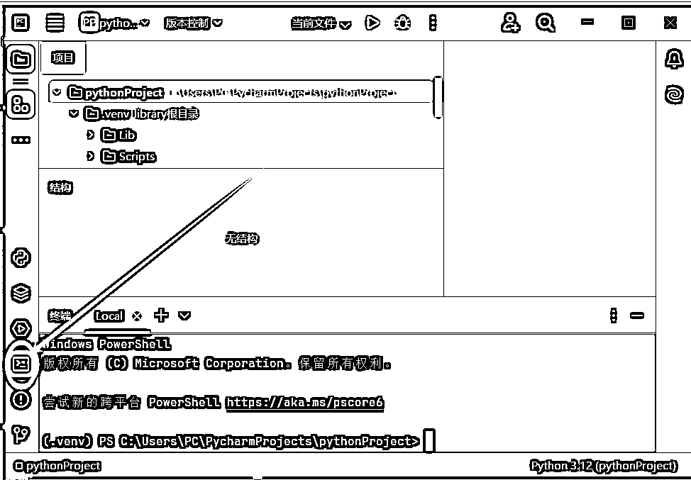
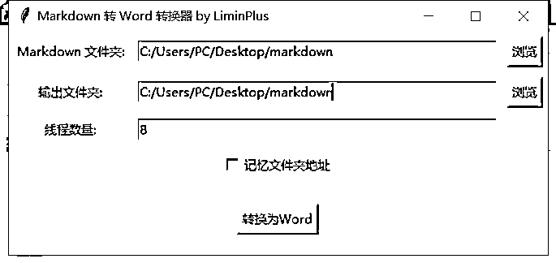

# 编程PYTHON封装为可执行程序exe

> 来源：[https://ewlsj0fnyfz.feishu.cn/docx/IbJ4dwZdwonsIXxO1gvc7kFNnXe](https://ewlsj0fnyfz.feishu.cn/docx/IbJ4dwZdwonsIXxO1gvc7kFNnXe)

# 一、个人介绍

【昵称】壹壹

【地区】苏州

【自我介绍】

①盖洛普前五才干：思维、专注、学习、竞争、理念

②主业:建筑国企搬砖。副业:1、公众号爆文写作；2、闲鱼卖货；

③目前算入生财一年。

大家好，我是壹壹，这次参加了AI编程航海，就想着能够进一步结合RPA的技术，把Rpa技术做深做强，解决一些以前不好解决的问题，继续用到自己的工作提效，和副业矩阵化无人运营商。最开始是跟着航海学习UiBot的使用，后来自学影刀Xpath，算是初步入门了影刀，也写了几十个程序和项目，过程中也接触到PYthon，不可避免的也要用一部分，在航海过程中，差不多3-4天左右的时间就完成了航海中关于数据爬取的内容。

后面在做的过程中，结合工作，不断有新的需求产生；

例如处理excel时候，手动点选太慢，用AI写了宏代码，也实现了宏代码的初次尝试。

在做公众号爆文写作中，之前使用影刀进行文字处理，经常WPS，office失效、不稳定，运行速度慢。

正在学习PYthon用AI写代码，于是就想着用PYTHON写代码，最后写成了。

但是，运行起来嫌弃软件太大，于是全网搜如何PYthon封装可执行程序EXE。

最后经过一晚上尝试解决了，而且不难。

在这里分享一下。

# 二、编程PYTHON封装为可执行程序exe

封装软件要有3个条件。

1、python写好的程序已经运行成功，代码经过测试，满足要求；

2、需要设计一个运行界面，自己要有界面的构思。

3、会用AI或者自己写代码，构建界面。

以上满足后，通过固定流程，可以实现PYthon封装为可执行程序EXE。

具体流程如下：

1、测试好的python代码。这个默认大家已经完成了。

2、设计一个运行界面。

例如我的界面是这样的：



3、会用AI或者自己写代码，构建界面。

我给AI提交的提示词是这样的：

给我的代码内容增加用户界面，需要包含以下元素：

- 输入文件夹选项

- 输入Excel文件选项

- 输入保存文件夹选项

- 处理文件按钮

- 保存路径信息按钮

AI会对应给出界面设计的代码，添加在自己的代码里面。

在这里粘贴一下，AI给我的代码：

```
import os
import sys
import tkinter as tk
from tkinter import filedialog, messagebox, ttk
import pandas as pd
from docx import Document
import win32com.client as win32
import json
import threading
from concurrent.futures import ThreadPoolExecutor
import queue

# 获取当前脚本所在目录
if hasattr(sys, '_MEIPASS'):
    # PyInstaller打包后的临时文件夹路径
    BASE_DIR = sys._MEIPASS
else:
    BASE_DIR = os.path.dirname(os.path.abspath(__file__))

CONFIG_FILE = os.path.join(BASE_DIR, "config.json")

def get_desktop_path():
    return os.path.join(os.path.expanduser("~"), 'Desktop')

def get_files_in_folder(folder_path):
    return [os.path.join(folder_path, f) for f in os.listdir(folder_path) if f.endswith('.docx') or f.endswith('.doc')]

def read_word_file(file_path):
    if file_path.endswith('.docx'):
        doc = Document(file_path)
        full_text = []
        for para in doc.paragraphs:
            full_text.append(para.text)
        return '\n'.join(full_text)
    else:
        word = win32.Dispatch("Word.Application")
        word.Visible = False
        doc = word.Documents.Open(file_path)
        text = doc.Range().Text
        doc.Close()
        word.Quit()
        return text

def replace_text_in_word(file_path, replacements, save_path):
    if file_path.endswith('.docx'):
        doc = Document(file_path)
        for para in doc.paragraphs:
            for key, value in replacements.items():
                if pd.isna(value):
                    value = ""
                if '^p' in str(value):
                    value = value.replace('^p', '\n')
                para.text = para.text.replace(key, str(value))  # 替换所有出现的文本
        save_file_path = os.path.join(save_path, os.path.basename(file_path))
        doc.save(save_file_path)
    else:
        word = win32.Dispatch("Word.Application")
        word.Visible = False
        doc = word.Documents.Open(file_path)
        for key, value in replacements.items():
            if pd.isna(value):
                value = ""
            if '^p' in value:
                value = value.replace('^p', '^p')
            find = word.Selection.Find
            find.Text = key
            find.Replacement.Text = value
            find.Execute(Replace=2)  # wdReplaceAll
        save_file_path = os.path.join(save_path, os.path.basename(file_path))
        doc.SaveAs(save_file_path)
        doc.Close()
        word.Quit()

def process_file(file, replacements, save_path, progress_queue):
    try:
        # Read and replace text in Word file
        replace_text_in_word(file, replacements, save_path)

        # Read updated text to check length
        updated_text = read_word_file(file)
        if len(updated_text) < 500:
            os.remove(file)
            print(f"Deleted file: {file}")

        # Update progress
        progress_queue.put(file)
    except Exception as e:
        print(f"Error processing file {file}: {e}")

def process_files(folder_path, excel_path, save_path, progress_queue):
    # Load Excel file
    df = pd.read_excel(excel_path)
    replacements = dict(zip(df.iloc[:, 0], df.iloc[:, 1]))

    # Get list of Word files
    files = get_files_in_folder(folder_path)
    total_files = len(files)

    with ThreadPoolExecutor(max_workers=None) as executor:
        futures = []
        for file in files:
            futures.append(executor.submit(process_file, file, replacements, save_path, progress_queue))

        for future in futures:
            future.result()  # wait for each future to complete

    progress_queue.put(None)  # Signal completion

def update_progress(progress_queue, total_files):
    processed_files = 0
    while True:
        file = progress_queue.get()
        if file is None:
            break
        processed_files += 1
        progress_var.set((processed_files / total_files) * 100)
        progress_label.config(text=f"正在处理: {os.path.basename(file)}")
        root.update_idletasks()

    messagebox.showinfo("处理完成", "文件已处理完成。")

def select_folder():
    folder_path = filedialog.askdirectory(initialdir=get_desktop_path(), title="选择文件夹")
    folder_entry.delete(0, tk.END)
    folder_entry.insert(0, folder_path)

def select_excel():
    excel_path = filedialog.askopenfilename(initialdir=get_desktop_path(), title="选择Excel文件",
                                            filetypes=(("Excel文件", "*.xlsx"), ("所有文件", "*.*")))
    excel_entry.delete(0, tk.END)
    excel_entry.insert(0, excel_path)

def select_save_folder():
    save_path = filedialog.askdirectory(initialdir=get_desktop_path(), title="选择保存文件夹")
    save_folder_entry.delete(0, tk.END)
    save_folder_entry.insert(0, save_path)

def on_process():
    folder_path = folder_entry.get()
    excel_path = excel_entry.get()
    save_path = save_folder_entry.get()
    if not folder_path or not excel_path or not save_path:
        messagebox.showwarning("输入错误", "请选择文件夹、Excel文件和保存文件夹。")
        return

    files = get_files_in_folder(folder_path)
    total_files = len(files)
    progress_queue = queue.Queue()

    threading.Thread(target=process_files, args=(folder_path, excel_path, save_path, progress_queue)).start()
    threading.Thread(target=update_progress, args=(progress_queue, total_files)).start()

def save_config():
    config = {
        "folder_path": folder_entry.get(),
        "excel_path": excel_entry.get(),
        "save_path": save_folder_entry.get()
    }
    with open(CONFIG_FILE, 'w') as f:
        json.dump(config, f)
    messagebox.showinfo("保存完成", "路径信息已保存。")

def load_config():
    if os.path.exists(CONFIG_FILE):
        with open(CONFIG_FILE, 'r') as f:
            config = json.load(f)
            folder_entry.insert(0, config.get("folder_path", ""))
            excel_entry.insert(0, config.get("excel_path", ""))
            save_folder_entry.insert(0, config.get("save_path", ""))

# Create GUI
root = tk.Tk()
root.title("Word文本替换器")

tk.Label(root, text="选择文件夹:").grid(row=0, column=0, padx=10, pady=10)
folder_entry = tk.Entry(root, width=50)
folder_entry.grid(row=0, column=1, padx=10, pady=10)
folder_button = tk.Button(root, text="浏览", command=select_folder)
folder_button.grid(row=0, column=2, padx=10, pady=10)

tk.Label(root, text="选择Excel文件:").grid(row=1, column=0, padx=10, pady=10)
excel_entry = tk.Entry(root, width=50)
excel_entry.grid(row=1, column=1, padx=10, pady=10)
excel_button = tk.Button(root, text="浏览", command=select_excel)
excel_button.grid(row=1, column=2, padx=10, pady=10)

tk.Label(root, text="选择保存文件夹:").grid(row=2, column=0, padx=10, pady=10)
save_folder_entry = tk.Entry(root, width=50)
save_folder_entry.grid(row=2, column=1, padx=10, pady=10)
save_folder_button = tk.Button(root, text="浏览", command=select_save_folder)
save_folder_button.grid(row=2, column=2, padx=10, pady=10)

process_button = tk.Button(root, text="处理文件", command=on_process)
process_button.grid(row=3, column=0, columnspan=3, pady=10)

progress_var = tk.DoubleVar()
progress_bar = ttk.Progressbar(root, variable=progress_var, maximum=100)
progress_bar.grid(row=4, column=0, columnspan=3, pady=10, sticky="ew")

progress_label = tk.Label(root, text="等待处理...")
progress_label.grid(row=5, column=0, columnspan=3, pady=10)

save_config_button = tk.Button(root, text="保存路径信息", command=save_config)
save_config_button.grid(row=6, column=0, columnspan=3, pady=10)

load_config()  # Load previously saved config if it exists

root.mainloop()
```

代码先测试运行一下，确保能运行，再打包。

上面代码可能会缺少2个库，先在终端安装：



```
pip install pywin32 python-docx
```

* * *

3个条件完成后，万事具备就只欠东风了。

封装软件分为4步：

1、安装 pyinstaller库。步骤2步：

点击这里



输入pip install pyinstaller，然后会出现安装日志。，等待安装完成。

2、获取自己要封装的python名称，可以手敲，也可以复制。例如我这里是手敲test.py


3、软件封装：分两步。

点击这里：


输入pyinstaller -F -w test.py，输入后回车。

或者：pyinstaller -F -w C:\Users\PC\.cursor-tutor\projects\python\test.py 输入后回车。

第二个是你的文件路径

我的应用名称是test.py，大家可以根据自己名称自己更换。

4、拷贝封装软件出来。

上一步运行完成，就等于封装完成了。

由于封装完成的软件exe文件位于默认文件夹内，需要我们自己给他挖出来。

推荐用everything搜索test，按时间排列，找到对应文件，就是我们想要的内容。

这时候我们可以拷贝到任何我们想要的地方，如拷贝到桌面。

然后试运行即可。


5、拷贝到桌面，运行程序：

这里是我开发的3个小程序，配合文章处理的。


运行后的窗口状态。



具体窗口长什么样子，可以和AI提需求，例如常规我处理，每次发现都要输入文件夹地址，我就让AI给我加了一个记忆文件夹地址的选项，这样我就不用每次都去输入了。

6、总结

我测试了通义千问，KIMI,等，使用GPT4O是成功率最高的，热切AI写代码用于系统内固定格式的内容，成功率非常高，而且和提问者的水平有直接关系。

但是用于抓取网页内容，成功率不到，和定位元素有关系，这部分，大概率还得手搓，用XPAth定位。

建议框架都让AI写，XPATH，手动改完再扔给AI，继续写，继续优化。

整体上应该是可以实现的。