# 借助RPA实现10倍增长

> 来源：[https://buebeaaf96.feishu.cn/docx/IjkidNedWolVW0x904OcNAsNnVg](https://buebeaaf96.feishu.cn/docx/IjkidNedWolVW0x904OcNAsNnVg)

# 一、我与RPA的缘分

## 1.初识RPA

初识RPA还是一年前，当时看了下文档，说实话很枯燥，命令很多，10个手指数半天，大概看完手册后脑子一片空白，从此就对RPA关上了心门。

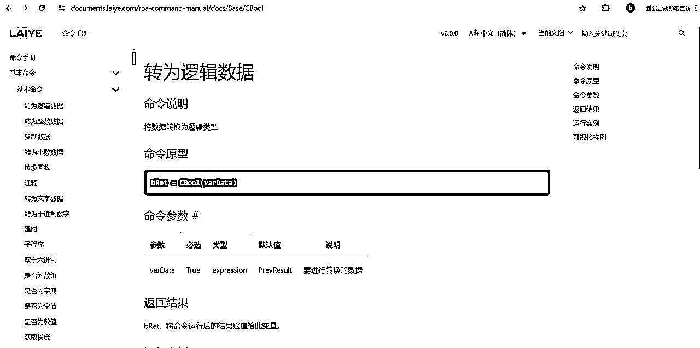

RPA从入门到放弃只需1秒钟，符合大多数人的调性，不知是否戳中你受伤的心灵。

单纯学习一项技能如果不能看到钱，是很难坚持下去的。

与RPA有过一面之缘，有缘再见，再回首已是将近一年，此时对RPA翻牌，我已老了一岁。

## 2.因RPA多赚6位数

去年看到公众号爆文消息后，没有想太多，说干咱就干。

熟悉项目流程后，每天人肉找对标账号，复制对标文章内容到AI仿写，再复制仿写内容到公众号，简单排版，人肉找图插入，再仿写下标题就发布了。

自己经过两个月左右的摸索，用几个个人号测试了几个领域，每个领域都或多或少都拿到了结果，跑通了0-1，最后选择了一个自己熟悉的领域发力。

要发力，再靠人肉肯定做不了几个账号，当时也有一些圈友分享RPA矩阵操作公众号，于是也萌生了通过RPA矩阵操作的念头。

只是因为在网上多看了你一眼，再也没能忘掉你威力。

虽然有了念头，但还是一两周后才开始研究RPA，当时对RPA了解不多，有点畏惧，有点下不去手，担心耽误太多时间误了手上的账号。

最后下定决心研究RPA，选择了影刀RPA，先在B站https://space.bilibili.com/393215006大概看了下官方的视频，然后就开始动手了，而不是先把所有指令挨着看一遍。

20%的指令可以解决大部分流程，遇到更复杂的流程才需要更多剩余的少数指令。

没有花拳绣腿，首战即实战，梳理好公众号爆文AI写作流程后，找到每步流程对应的指令，边做边学。

经过一周左右的时间并不断完善程序，公众号写作机器人就上线了，整个人顿时轻松了许多，有种无所事事的感觉，后面又写了一些采集对标的机器人。

有了RPA的助力，大家应该能想到会发生什么事情，第一篇爆款出现了，这是我当时早上眼睛还没睁开截的图。

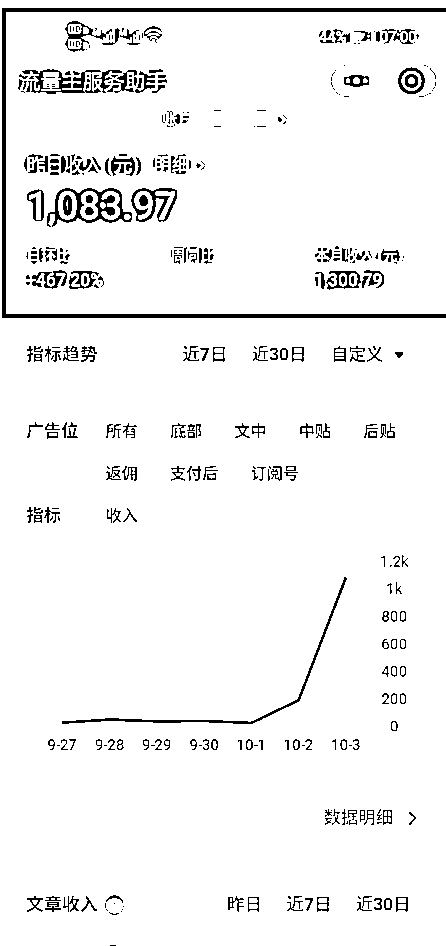

RPA机器人运行顺畅之后，开始逐渐增加公众号爆文账号到20个左右，然后就有了标题的结果：4个月赚了6位数。

现在来看，当时再次翻牌RPA的时间还是晚了，少赚了不少W，公众号爆文那时正处于风口。

## 3.一个月内拿下RPA初中高级

RPA也就这两年开始火一点，但远没有PPT、Excel知名度高，看到有一些人说自己是某某认证工程师，虽然没证不影响咱写机器人，但谁让咱有一颗争强好胜的心。

别人有的证咱也要有，别人没有的证咱还要有。于是在虚荣心的作祟下花了不到1个月拿下影刀初、中、高级RPA技能证书。

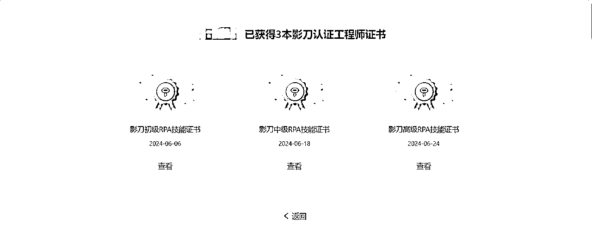

并不是说证书没有作用，考了证之后可以更系统了解厂家的RPA,还可以对某些知识起到查漏补缺的作用。

可能有人会纠结选哪款RPA，不要纠结，从用的人多的厂家里选一款，掌握一款后，其他厂家的RPA都差别不大。

会影刀RPA之后，换一款RPA，我当天就写了一个机器人，毫无压力。

如果你也想考个证在朋友圈秀一下，请点击https://college.yingdao.com/

# 二、RPA的魅力

上面说了那么多我与RPA的故事，RPA到底有什么魅力值得我在这里吧吧吧？

在公众号爆文中用上RPA的我自然知道它有多香，还有哪些地方可以用上RPA提高效率？

RPA的应用场景很多，在电脑和手机上的重复操作都可以通过RPA来完成，办公提效当然也不在话下。

## 1.想学

前段时间圈友咨询我把Excel中1000多条新人打卡积分录入后台系统中，具体流程就是：

1.  登录系统后台

1.  进入用户页面

1.  输入Excel中的用户编号并查询

1.  点击修改，进入用户详细信息页面

1.  修改积分，输入Excel中的积分

1.  填写备注，输入Excel中的备注

1.  确认，提交修改的信息

看到这个需求，我一秒领会，斩钉截铁：简单

具体的表格就是下图，在系统中查询A列用户编号，在系统中修改B、C列信息

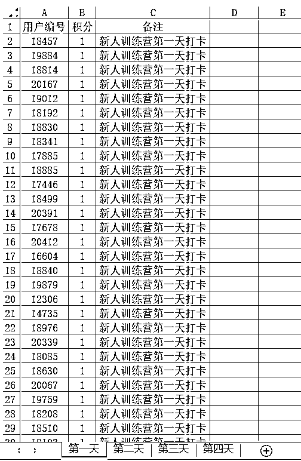

整个流程很简单，我花了1个小时左右写好RPA并测试程序运行正常。

考虑到一些异常情况可能会导致数据录入一半，下次再运行程序时需要人工核对已经录入的信息或修改Excel表格数据，比较麻烦还容易出错。

贴心做了已经录入的信息的判断，程序中断后再次运行时已经录入的信息不会重复录入。

作为RPA开发者必须考虑到所有可能出现的情况，一个宗旨：能不让用户动手就不让用户动手。

1000多条数据如果人肉操作不仅容易出错还非常耗时，时间久了还会两眼冒金星，再严重点会暴躁和同事动手。

RPA的魅力在于它不会出错，不会疲惫，没有感情，不会暴躁，一天24小时它可以工作25小时。

更大的魅力在于，看到RPA机器人动起来后，圈友直呼想学！

## 2.幕后

这么神秘的RPA到底长什么样？在此献出代码，供大家学习参考。

图片中的大部分蓝色部分可以根据自己习惯改成中文，从图中的文字也很容易理解什么意思。

主流程部分：

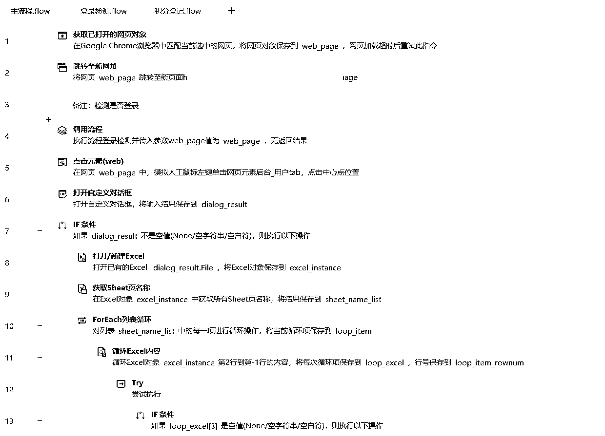

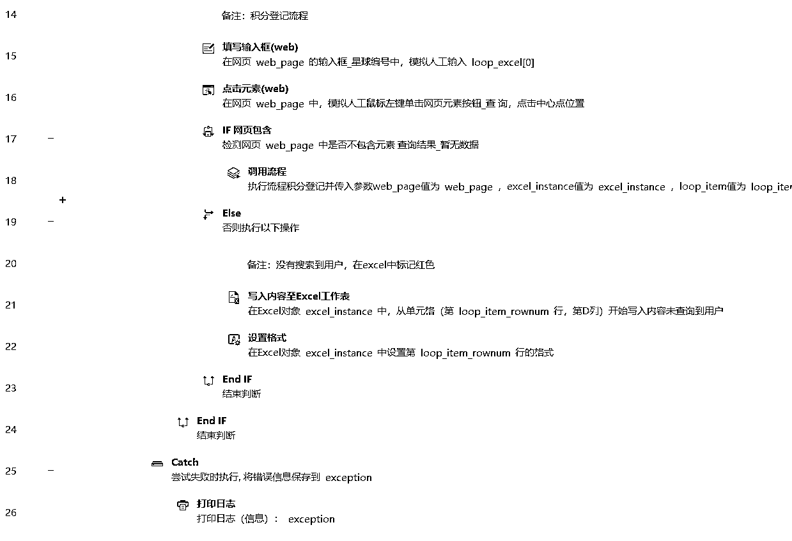

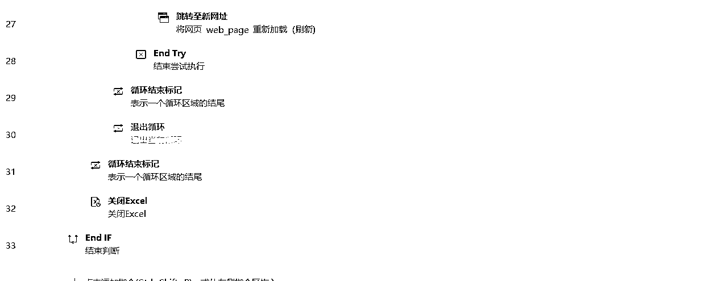

登录检测子流程

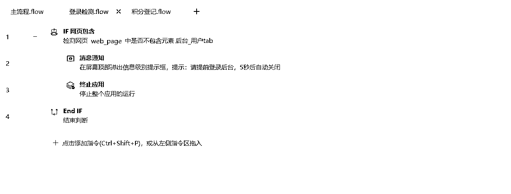

积分登记子流程

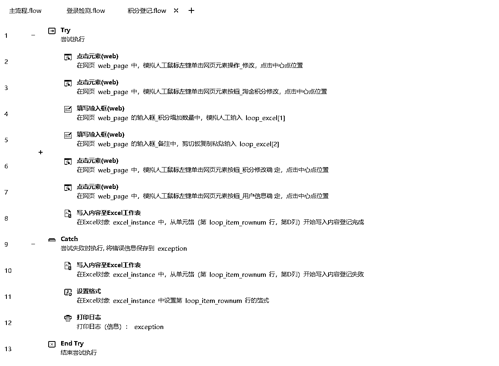

# 三、RPA10倍增效

在圈子里，大家做项目的人数占比稍微高些，在项目中RPA则可以实现10倍提效，一点不夸张。

但RPA不是帮助你从0到1，而是从1到10。

首先要跑通项目闭环，完成从0到1，然后梳理好流程，每一步工作交给RPA来做，24小时运行，你吃香的喝辣的，每天睡到自然醒，它都没有怨言。

## 1.RPA为项目赋能

工欲善其事,必先利其器。

做项目的过程中需要用到各种软件和工具，而软件是需要人手动操作的，RPA则可以代替人来操作软件，这就相当于省了一个人工。

RPA在项目中有哪些具体应用？且听我一一道来。

比如：AI代写，当代写单子多了以后，人手动发送提示词给AI写作，还要人工修改内容，一个人一天不吃不喝的写作数量也是有限的。

如果把AI写作这部分交给RPA来做，让RPA代替人来向AI发送提示词，把写好内容保存到Word或记事本，然后人工再修改，效率就大大提升，收益天花板更高。

再比如：在小红书开店铺卖产品，涉及到选品、找素材、制作笔记等流程，RPA能干的就是通过关键词抓取小红书对标账号相关数据，下载图片、AI改写文案、根据模板改写图片文字、发布作品。

一条龙服务，有了RPA，甩同行几条街。

先看下载小红书账号图片的效果

看到这你可能会问：不是有工具可以实现这个功能吗，为何还要用RPA？

一个项目中涉及到很多流程，不同的流程需要用到不同的软件或工具，个人感觉下了一堆软件电脑有点乱。

以前做项目，我也下载和收集了各种各样的软件，有时候遇到一个特殊需求还找不到现成可用的软件和工具。

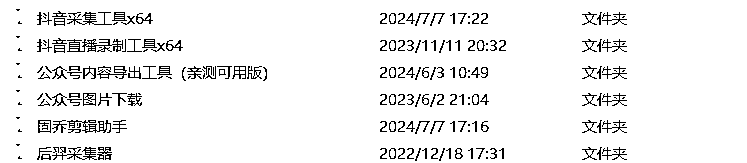

找到了可用的软件，但也不是完全符合需求，使用上还有限制，用几下就要充会员。

现在我就不会下载太多软件了，能让RPA上就让RPA上，RPA搞不定的再交给软件和工具。

就像有了微信小程序谁还去下手机APP，只需打开微信就可以使用了，大部分软件和工具的功能都可以集中到RPA上，RPA就像微信一样就是一个平台。

## 2.安全就是高效

有了RPA就不用下载各种软件，如果仅仅这一个理由还不能打动你选择RPA，我再给一个理由：安全。

软件的优点是速度快，运行后看不到后台的交互动作，如果涉及到数据抓取，速度快了就会触发平台监控，导致无法抓取数据。

下面以下载抖音账号视频为例来展现一下这个问题：

上面的视频中通过【http下载】的方式下载视频，实际并未下载成功，日志中输出了错误。

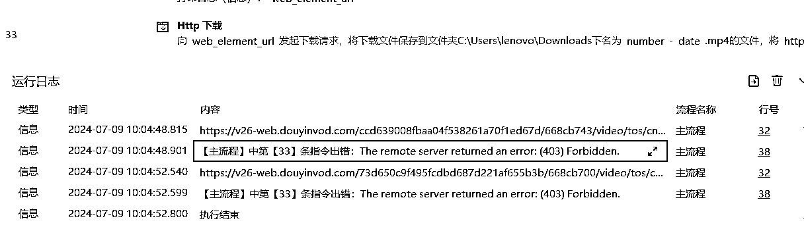

复制视频网址到浏览器果然打不开

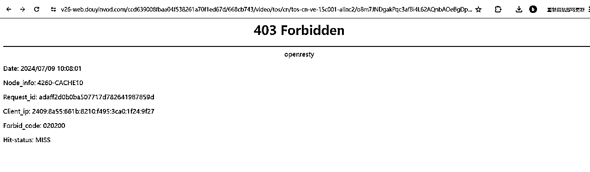

而另外一个视频网址复制到浏览器中可以打开，在日志里同样报403错误。

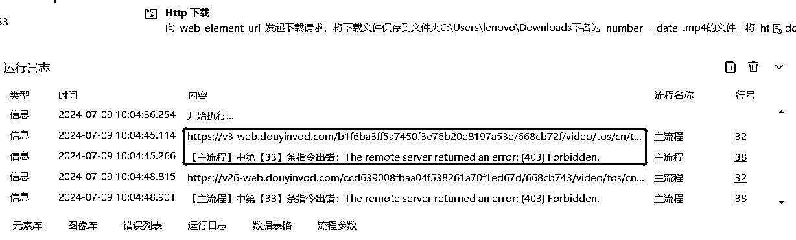

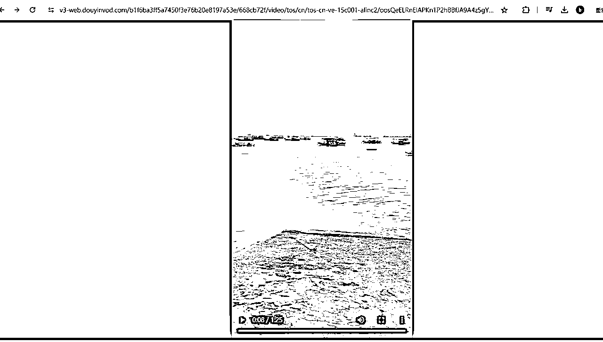

懂点编程的就知道403的意思是禁止访问，这里是抖音做了爬虫限制，我用另一款RPA软件同样无法下载视频。

上面视频中的程序我之前用过是没问题的，可以下载抖音视频，为何现在不行？

RPA的核心就是模拟人工操作，但【http下载】并不算模拟人工，它是通过后台发送请求的方式来下载，RPA也会提供一些类似http下载这种速度较快的指令。

既然通过http下载的方式无法下载抖音，那么专门下载抖音视频的工具大概率也下载不了。

打开之前用过的一个抖音视频下载软件，果然无法下载，因为软件工具下载抖音视频肯定用的是http方式，只要是抖音对http下载的方式做了限制，不管哪个软件都不好使。

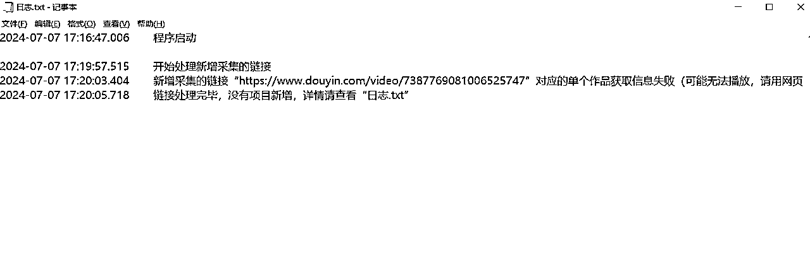

上有政策，下有对策。RPA号称模拟人工操作和最安全的软件，这个问题当然难不倒它。

请看下面视频：

这个视频中换了一种下载抖音视频的方式，把下载动作模拟成人工。

具体步骤(前面步骤就省了)：

1.在浏览器中打开视频网址

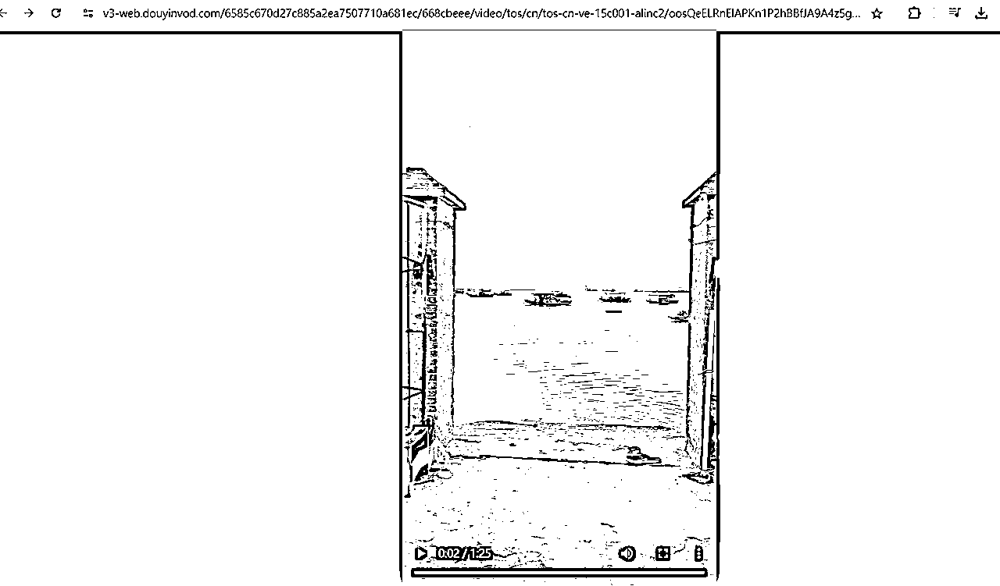

2.在视频上右键

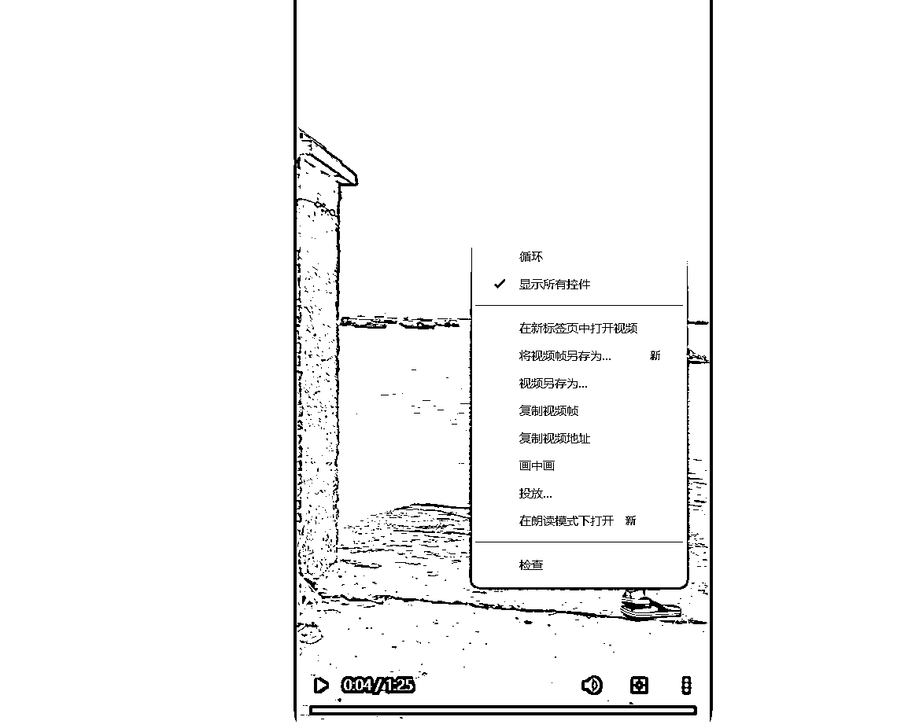

3.连按5下向下键或把鼠标移动到“视频另存为”

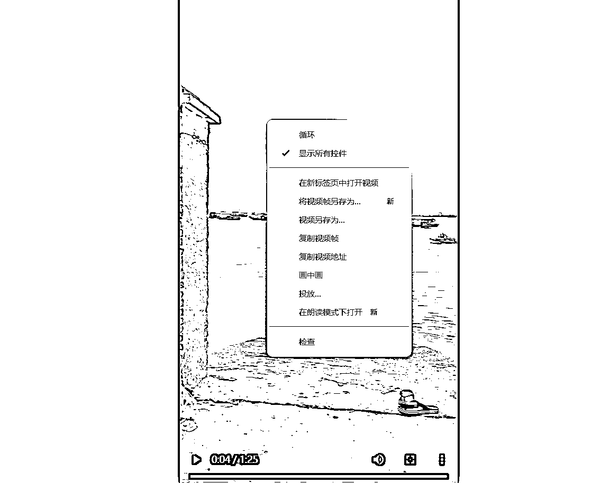

4.点击“视频另存为”或按Enter键

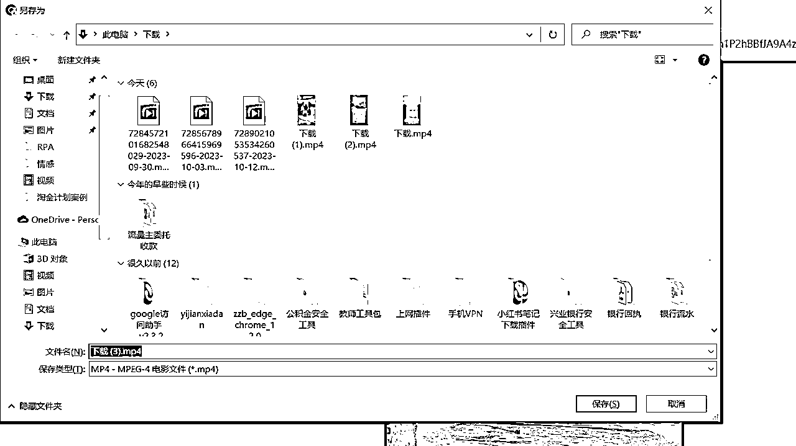

5.点击保存或按Enter键

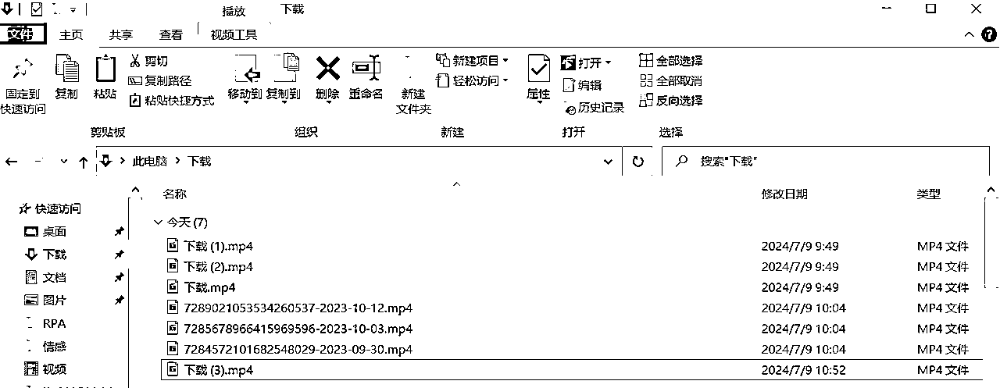

这样视频就下载下来了，如果说你不懂http下载，况且http下载还会被平台检测，这种方式总该懂吧？

RPA的安全就体现在这里，后台请求的方式无法实现的功能，通过模拟人工操作就可以实现。

按这个流程来操作，抖音总不至于不让我下载视频吧？如果非要较真，除非在我这里装个摄像头。

老规矩，献出代码，大家看看上面的步骤在RPA中是怎样实现的：

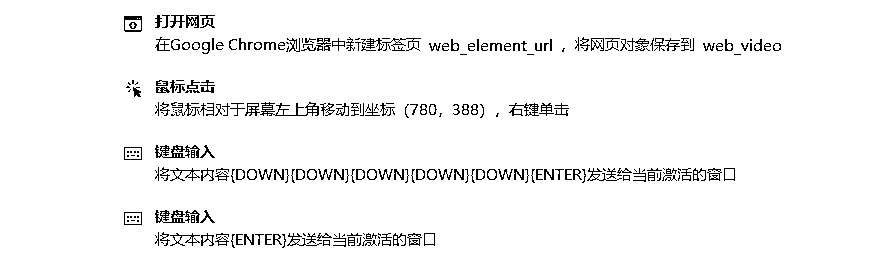

是不是很简单，无需写代码，看图片中的文字就能大概理解什么意思。

## 3.RPA门槛

有了RPA就不用下载各种软件和工具，RPA还非常安全，这么多好处凭什么都让RPA占了？

RPA能解决以上问题，当然还是有点门槛的，这个门槛就是需要自己配置RPA机器人，但也不要被那一点门槛吓到迈不过去腿。

RPA是非技术人员的提效利器，RPA的问世就是为了降低程序开发门槛，让非技术人员也能够写出满足工作需要的机器人。

在RPA软件中找到手动操作流程对应的指令，拖拽并设置参数就可以完成需求，而且大部分参数只需点点鼠标来选择，0代码，无需知道指令背后的逻辑。

我们来看看输入用户名密码后按回车键登录在RPA中如何实现：

1.【拖拽指令】把键盘输入拖到右侧

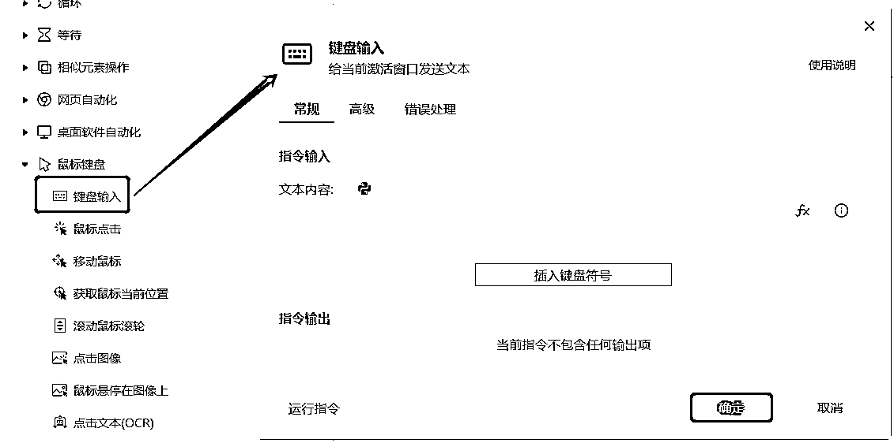

2.【配置参数】点击插入键盘符号->点击Enter->关闭键盘

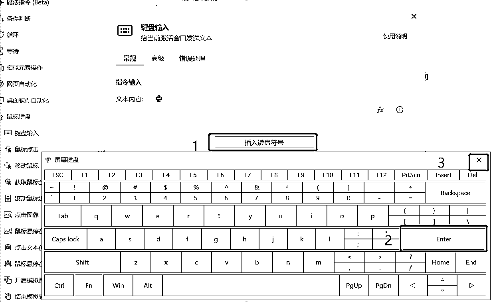

这样RPA就会自动按回车键登录，完全看不到手动写代码的痕迹。

简不简单，你说了算。

# 四、RPA学习路径

如果我说的你有点手痒，想尝试下RPA，请不要走开。

小白学习RPA，刚开始肯定一头雾水，不知从何下手，很容易和我之前一样从入门到放弃只需1秒，我在这里给大家叨叨，尽量少走弯路，早日上手。

## 1.RPA怎么选

RPA是一款PC端软件，软件厂家把一些常用的功能封装起来，用户使用的时候找到相应的指令设置好参数，一个个指令组合起来就实现了完整的需求。

国内外都有RPA软件，国内厂家用的较多的有uibot和影刀RPA。

影刀RPA界面比较友好，适合入门，可以实现网页自动化、桌面软件自动化和手机自动化。

不同RPA功能相差不大，就跟李宁与鸿星尔克的差别差不多。

选择一款RPA要看官方课程是否完善，社区是否活跃、是否更新

官方课程完善有利于快速入门。

社区活跃遇到问题可以在社区里找到答案，还会有官方人员解答问题。

产品不更新说明已经不维护了，一项RPA机器人大工程进行到一半出了问题没法解决，再临时更新RPA厂家成本就大了。

再就是看个人习惯，有人就喜欢某一款RPA，面红耳赤也无法改变，适合自己的就是最好的。

还有不要觉得国外的月亮比中国圆，看到有人问某某功能用国外的uipath怎么实现，国内的好用我就用国内的。

## 2.要不要付费

国内的RPA个人使用不用付费，功能上也能满足需要，如果需要更多的权限和管理功能可以付费试一下。

国外的RPA没研究，感兴趣的可以研究下。

既然不用花钱，还有什么顾虑，赶紧下载试试，先跑起来再说。

## 3.从哪里下手

先大概看下官方的视频课程，然后就可以跟着视频做一些简单案例，做的过程中就会慢慢了解一些常用指令的用法。

以影刀RPA为例，官方B站课程https://space.bilibili.com/393215006有初、中、高级视频，先看看初级视频。

如果想检测一下自己的学习成果，可以在https://college.yingdao.com/考证，这里的视频和B站的视频差不多，里面会有一些题目和实操题。

了解RPA是什么东西之后，也做过几个简单的机器人，想要做稍微复杂一点的机器人时，第一步要梳理业务手动流程，第二步找到每一步流程对应的RPA指令，设置参数就可以了。

才开始不熟悉RPA配置，可以把每一步的流程都画下来，按照流程图走。

遇到问题也可以在官方社区https://www.yingdao.com/community/homePage?from=mainEntrance里搜索答案，也可以在里面提问。

## 4.20%的指令解决80%的问题

千万不要从第1个指令学到最后1个指令，如果你非要这样做，还没学完，前面的就已经忘了。

对小白来说，最常用的就是输入内容、点击相关的指令，入门后有更多指令等着你。

指令是用到的时候再去学，我想打开某一网页：

1.找到打开网页双击或拖拽到右侧

2.不知道怎么用？点击右上角使用说明

3.观看右侧视频和文字说明

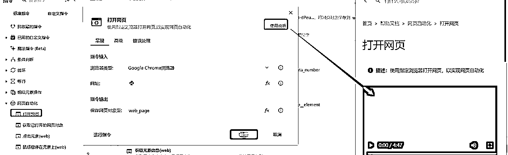

不知道用什么指令，可以搜索关键词，查看使用说明。

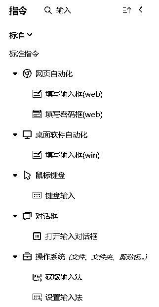

如果你已经不满足于基本的指令，可以看看每个指令分类里面都有什么，就大概知道RPA有什么功能，遇到具体的流程该选择哪个指令。

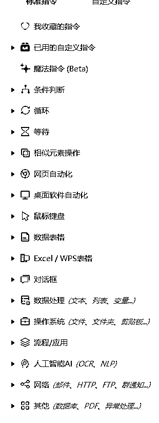

祝君阅后有益。

我是仙剑侠客，专注于RPA应用场景研究和落地，为个人、团队和企业降本增效。