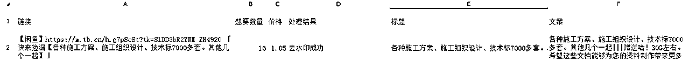
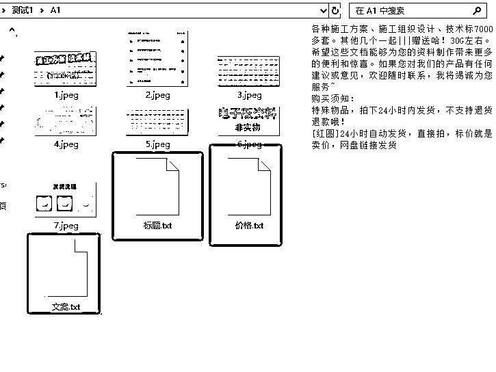
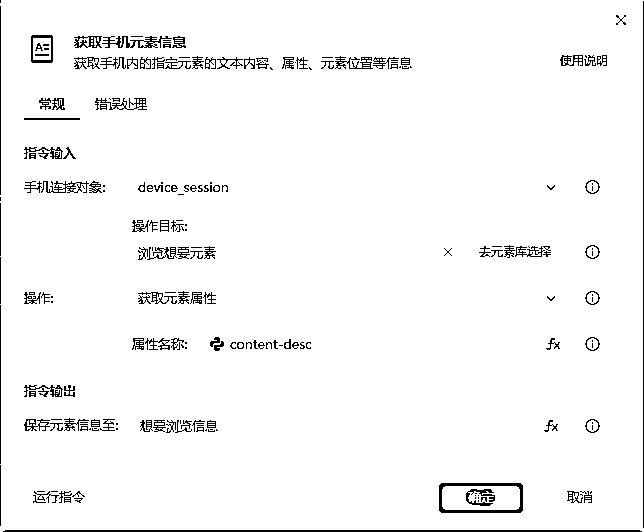

# 用影刀写了一个 闲鱼采集爆款+去水印+上传商品Rpa脚本 有需要的可以直接抄作业

> 来源：[https://riodtlbegu.feishu.cn/docx/JCINdp7czohdI7xbdKLcKlCinDc](https://riodtlbegu.feishu.cn/docx/JCINdp7czohdI7xbdKLcKlCinDc)

最近在测试闲鱼虚拟电商项目

每天找爆款+去水印+上传商品 起码需要2-3个小时

花了半天时间写了这几个脚本

1.采集脚本直接用的影刀的手机自动化

2.去水印用的是微信小程序里面的去水印小程序

【也可以用接口,昨天测试了一下有加密,我搞不来,有别人的接口最好，也可以省非常多的时间】

3.闲鱼上传商品是用的 闲管家 电脑版模拟。

有做虚拟赛道的可以一起交流一下！

这几个都是模拟人工做的,虽然可以帮你省下来时间，但是去水印和上传商品，电脑是动不了的。

## 一.闲鱼爆款采集

主要是输入一些自己所需要采集的领域,然后会自动抓取

#### 1.演示视频:

#### 2.采集格式:

#### 3.抄作业:

## 二. 闲鱼商品去水印+获取标题和文案

#### 1.演示视频

#### 2.处理结果格式

#### 3.抄作业

## 三.闲鱼自动上传商品

1.演示视频

2.抄作业

## 四.总结:

基本都没有难度，需要的就自己试试，不懂的可以一起交流

唯一有难度的就是手机采集商品想要和浏览数

需要使用xpath获取想要和浏览数据

//*[contains(@content-desc, '现价')]

直接抄作业就可以了！