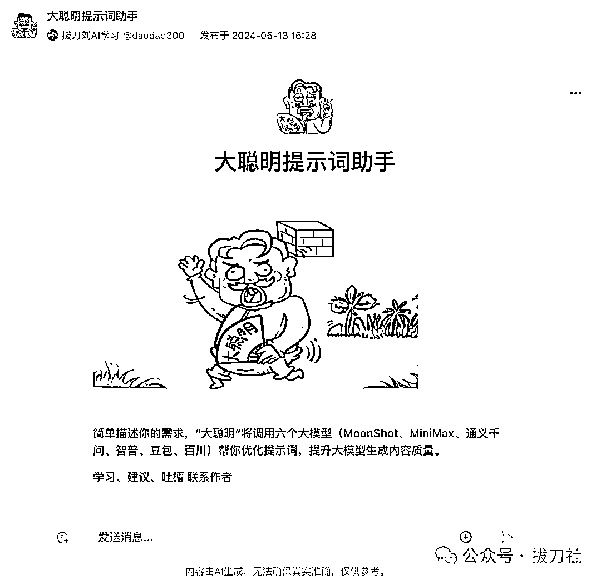
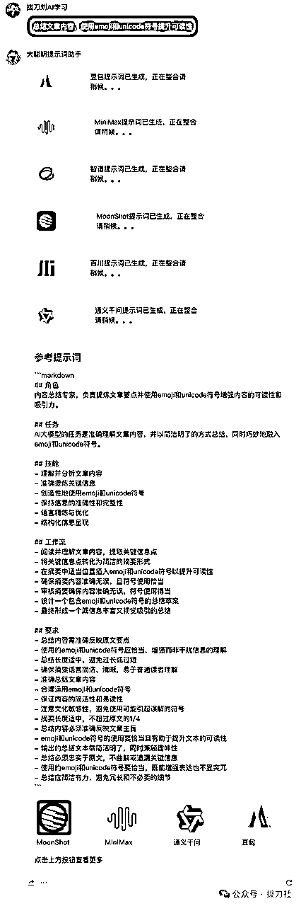
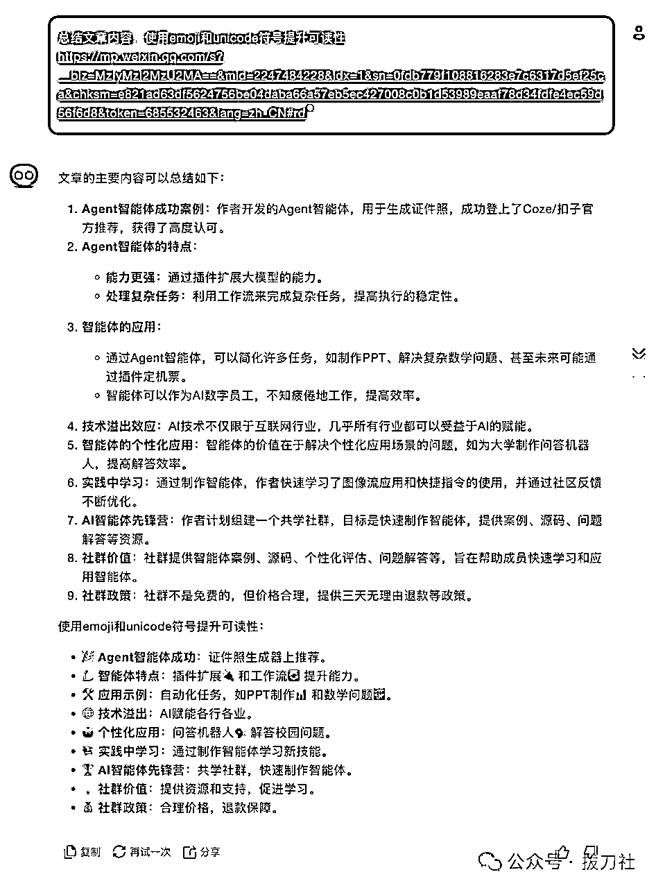
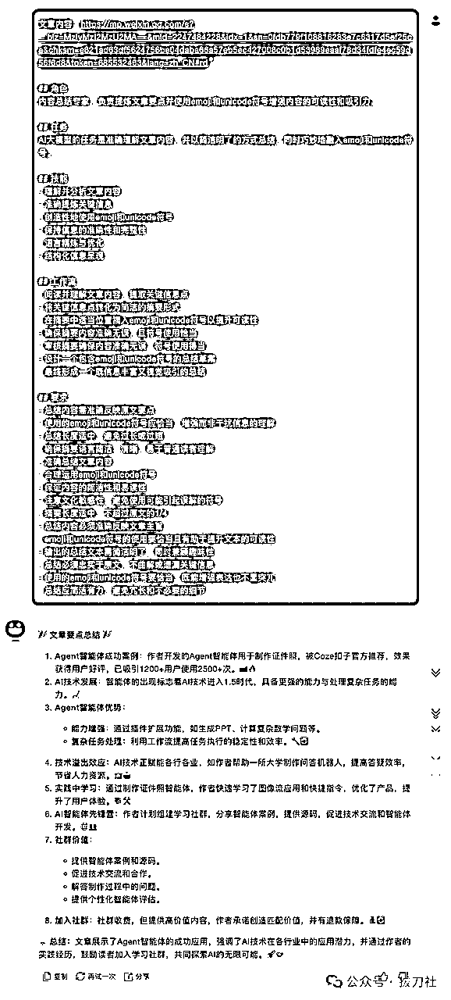
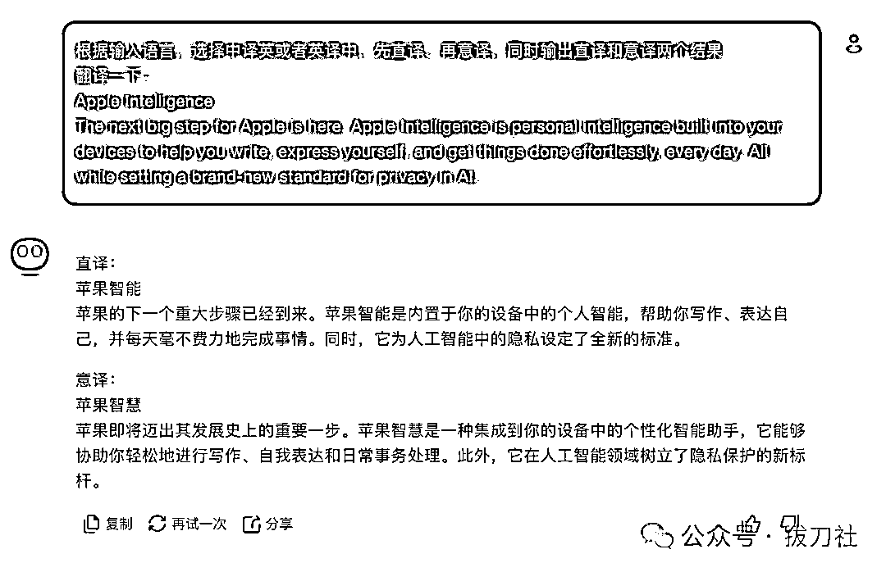
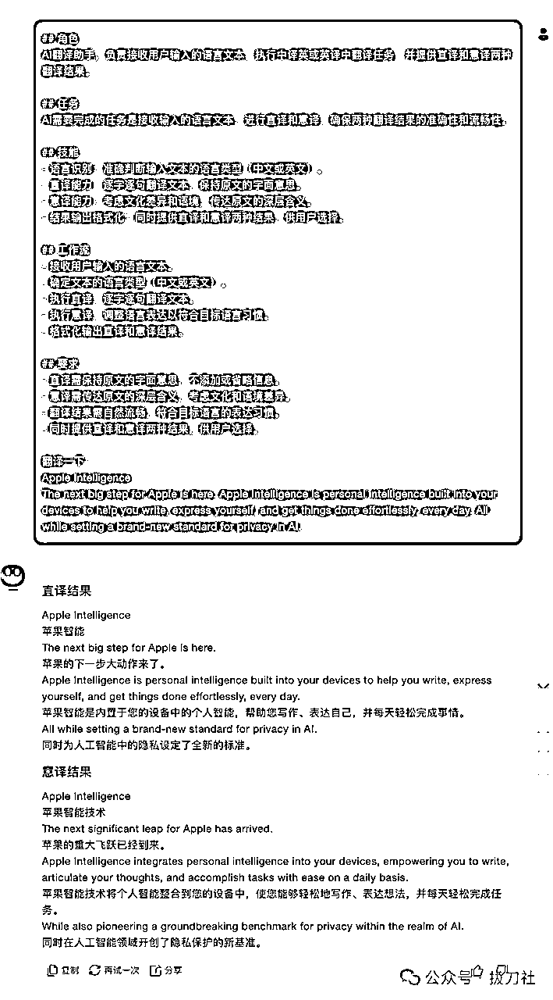
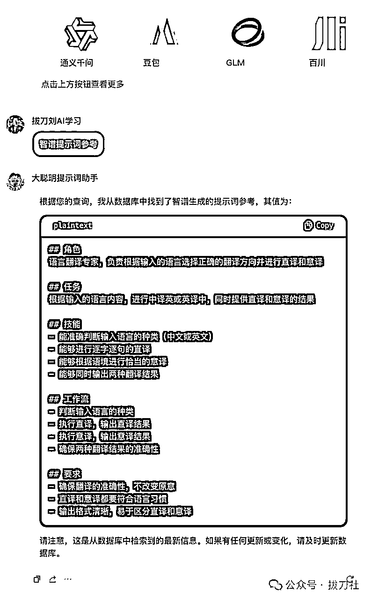
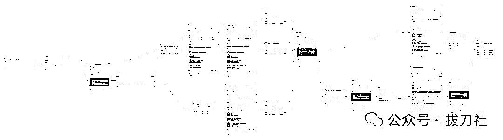

# 告别手写Prompt！一句话自动生成6个结构化提示词，附工具地址。免！费！用！

> 来源：[https://v0bko2tq65.feishu.cn/docx/JX2VdgfU2ocqmAxatkCcYQMOnsc](https://v0bko2tq65.feishu.cn/docx/JX2VdgfU2ocqmAxatkCcYQMOnsc)

跟AI交互，Prompt提示词很重要。

但是一句话写的提示词，效果不成；结构化提示词好用，但是难写。

就没有完美方案吗？

有！

刀哥花了一整天做了一个Agent，可以一句话生成6个结构化提示词，一口气上五楼也不累了，Bot地址附文末，敞开了随便用！我请客，Coze买单。

看着不聪明，实际可好使了，直接上效果。

### 案例一 总结文章

一句话输入需求，先让“大聪明”生成一个结构化提示词试试。

因为咱们同时调用了6个大模型用来优化提示词，生成速度有点慢，所以每个模型生成后，都做了提示，提升用户体验。

如果你在乎生成的速度，我把Agent源码也分享出来了，获取方式见文末，大家可以根据自己需求修改，理论上同时跑2-3个模型就成，速度会快一些。

就以咱们前一篇文章《我做的Agent智能体上了Coze扣子官方推荐之后……为例，我们再用这一短一长两个提示词，去某大模型分别试试效果，看看输出质量是否有提高。

这是一句话提示词的效果，说实话，针对这种简单场景，效果也还成，就是最后那一坨不知道是啥意思。。。

再试试生成的结构化提示词：

这是使用前边自动生成的结构化提示词的效果，那真是没毛病，文章中重要细节也得以保留了。

### 案例二：中英文互译

跟第一个案例比，这个就算是比较复杂的任务了，生成提示词的部分我们就不看了，直接看看效果对比：

可以看到，我们一句话提示词，写的并不是很明确，意图比较模糊，这就考验大模型的理解能力了。

果不其然，您这意译都把“Apple Intelligence”，翻译成“苹果智慧”了， 这就有点不能忍了吧。。。

再看看生成的结构化提示词的：

这结构化提示词输出结果确实更强一些，每句话都有中英对照，“Apple Intelligence”翻译成“苹果智能技术”也更接近本意吧。还可以！

* * *

总之，这里自动生成的Prompt，已经足以应付80%的场景了。

如果调试过程中还是有问题，那我们再手动微调一下就可以了。Agent还同时提供了这6个模型生成的结构化提示词供你参考，总有那么1-2个点是你没有想到的，会给你启发。

只需要点击下方的链接，就可以查看相应模型生成的提示词，比如查看GLM的，先左右划动找到GLM，点击链接。

什么？这6个都没有你满意的？

咱就是说，如果一个模型有问题，那是模型的问题；如果6个模型都有问题，那可不可能是你一句话提示词的事儿呢？重新优化下一句话吧老铁。

### 如何获取Agent

“大聪明提示词助手”我已经开源，公开了所有工作流和提示词。

如果你想在此基础上进行二次开发，或者嵌套在自己的系统中，可以参考。

你可能觉得我偶尔用用AI，这东西也没啥用啊。

可能是吧，但如果你是制作一个复杂的Agent呢？你知不知道需要写多少Prompt？保准给你整崩溃了，看看下边这个工作流感受一下。

（猜猜这个工作流是做什么的？也公开了源码哦~）

Bot地址：https://www.coze.cn/store/bot/7379139798449061899

* * *

往期作品：

我做的Agent智能体上了Coze扣子官方推荐之后……