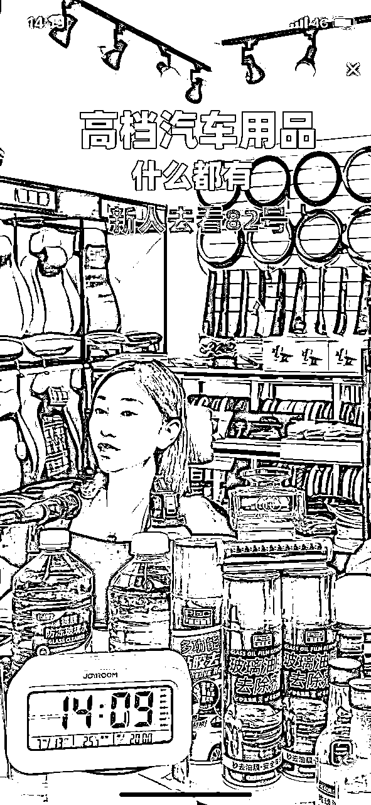

# 2个月，10000个直播间，调研出适合普通人的抖音免费流直播机会

> 来源：[https://u16gtzbrexc.feishu.cn/docx/KVDQd0hxzoo6EFxLGO7cEI9LnpM](https://u16gtzbrexc.feishu.cn/docx/KVDQd0hxzoo6EFxLGO7cEI9LnpM)

大家好，我是千易。上篇文章分享了我去年做的内容型直播间项目的复盘，亦仁大哥又加了精华，感谢！也感谢各位圈友的支持和关注！

很多朋友过来问有没有适合普通人的直播项目，比较简单，容易上手，有红利机会的项目方向。这篇文章给大家分享一个调研报告，这应该是全网唯一的报告。我们花了2个月时间，调研了抖音10000多个直播间的调研总结，其中有1000多个是免费流内容型直播间。希望帮助到大家。

# 底层认知

1、抖音直播带货从20年初到24年5月，四年半的时间，已经非常成熟了。流量成本越来越高，是大部分抖音玩家觉得日子难过的本质原因。今年新起的账号有8成左右都是付费。除了蓝海赛道之外，纯直播电商带货很难干，蓝海类目、内容型直播、IP直播还有机会。

2、抖音直播带货本质上也是一个生意，生意可以用一个公式理解，GMV=流量 * 变现 = 流量 * 产品 * 交付。获取流量，运营流量被称为流量端，产品生产，发货，交付，售后被称为供应端。今年想要两端自营打通的难度非常大，小团队更需要聚焦自己的核心优势，流量端和供应端二选一，有流量能力的优先选择做流量，投入更少，利润更高。供应端就要走量，极致性价比。

3、小团队想要低成本获得高回报，一定要选择的模式就是免费流 + 精选联盟佣金模式。通过运营能力、内容能力、主播能力的结合获取免费流，后端货盘和别人合作，2-3个人一年做几十万利润不是很难。本质是用内容和平台换流量，把换来的流量卖给商家换钱。

4、免费流本质是项目红利机会。想要做免费流，本质是赛道决定的。不同赛道的发展阶段不同，有的已经打的头破血流了，比如学科教育类、滋补品类。有的大家还在玩免费流，比如社保规划，中老年兴趣。想要做免费流，首先得选一个有免费流的赛道。

5、真正挣钱的项目都是自己找出来的。没有人会在项目很赚钱的时候拿出来分享，所以想要找到好的项目，就必须得自己深入行业做调研，这也是我每年做一次大调研的目的。同行才是最好的老师！

# 调研前期操作

1、这个调研报告是今年4-5月份看了10000多个近期卖的好的账号，全部总结到表格里。

2、5月下旬，对这些账号做了数据整理，所以数据和近1个月会有一些出入；

3、6月份的时候，我们把直播间做了录屏整理，并且做了调研分析。

4、具体操作是用蝉妈妈看每一个产品链接，然后点进去看达人数据和账号主页，人工判断账号情况，筛选账号；

5、后期在用蝉妈妈，达人列表进行补充，有一些账号可能带了很多个品，产品的链接经常换，所以不一定能抓取到，就通过达人页面再补充下。

【注意】这样操作的好处是能够很快找到电商带货直播间，缺点是只能找到带货直播间。抖音直播间的其他变现模式账号统计不到，比如纯打赏类，小雪花变现类、小程序推广和APP推广类，小风车引流类不在表中。

# 调研样本选择

1、调研的安排并不是每个类目都一个不落的看了直播间和数据，我们也是根据类目情况做了区分。

2、服装、箱包、鞋帽、家纺类直播间我们并没有每个账号都看，只是看了类目近期起号的部分账号。首先，这些类目退款退货率太高，平均40%，最高70-80%，其次，换品速度太快，不太适合我们的选择逻辑；最后，这类账号大部分都有免费流，因为高退货率纯付费不挣钱。这些类目适合普通人的玩法就是——半无人低价清仓直播间玩法。

3、除了以上类目，其他类目里面基本月销GMV在10W以上的商品链接全部都看了。并且都整理成了表格。其中的数据是4-5月份当时的数据，和现在会有部分差异。

其次，数据主要来自于精选联盟官方渠道，数据准确；精选联盟没有的数据参考的是蝉妈妈数据。

# 调研结论

## 一、总体总结

1、抖音现在的难度比去年大了很多，今年纯直播带货起号的账号基本都有付费，甚至是纯付费。品牌账号基本都是付费了。我们看了10000多个直播间，其中80%以上有付费。前面的网红看其他占10%以上的都有付费。

2、今年纯直播带货账号整体流量都低了，在线几百人的更多，1000人的比去年少了很多。所以，今年在线百人左右的账号都需要拉时长才能拿到更多的流量。

3、今年对货盘的要求更高，性价比也叫“价格力”，没有优质的货盘是打不过同行的，现在精选联盟的很多货盘都已经是性价比很高的货盘了，比找代发利润高，口碑分售后处理的也很好。

4、今年想要快速拿到自然流量，有两个大的方向，一个是低价半无人直播间，一个是内容型直播间，其中内容型直播间再被分为素人直播间，和IP直播间。

5、大盘的整体流量不会有很大增长了，流量已经到顶，现在抖音平台都是存量流量竞争，付费是更容易拿到优质流量的，但是利润也被平台吃了。

6、另外，大盘现在整体的转化率呈下降趋势，尤其是普通素人直播间的转化率降低，纯带货直播间大概在1-4%左右，今年618估计大家也有感受。

7、现在做抖音纯带货直播间，客单价在99以上的直播间，主播能力、运营能力、外加优质货盘，三者缺一不可，我觉得已经不适合个人玩儿了。

8、高客单直播间的发展方向就是内容直播间和IP直播间，外加私域运营。

9、纯带货直播间的客单价在9.9-29.9之间比较容易起号。内容直播间和IP直播间可以在100-300之间，超过300的考虑私域。

10、今年从0-1做一个新项目，起号的周期比去年要长，要给自己3-6个月的打磨时间。项目竞争对手越少，起号的速度越快，概率越高。选项目是关键！

### 重点：

1、普通人适合玩的免费流直播间有三类，第一是低客单半无人直播，第二是内容型直播间，第三IP直播间；

2、有行业IP资源的可以做IP类直播间，流量会更大，转化率更高，对团队要求更高，没有经验、自己本身也不是IP的不建议；

3、中高客单纯带货直播间要在选品、运营能力，主播上面下很大功夫才能做免费流。

接下来按照细分类目分析各个细分赛道的情况！

## 二、低客单半无人直播间

1、适合类目有较高溢价空间的女装、男装、箱包、鞋类，还有本身客单价较低，性价比较高的食品、百货、车品、图书等类目。

2、通过绿幕直播间的搭建，挂上多个低客单爆品，价格低到让消费者觉得是福利；

3、大类目人群广，本身起号比较容易，直播间可以做到上百人在线，可以拉时长出单；

4、产品走精选联盟，产品选择方面也比较广，发货售后不需要管，佣金在10-20%左右，主打极致性价比；

5、可以矩阵运营，半无人多复制账号。

6、其中细分玩法有两种，一种是单场打爆，单场直播GMV能到30-50W，但是基本一两场会死号；

另外一种是平稳直播模式，不会打爆，但是账号生命周期能持续很久。

7、这种类型的直播间，对主播要求低，主要难点在于选品和场景的搭建，强选品或者强吸引人的场景两者必须有其一，才能有流量。

8、自从去年百万粉丝大主播推箱子，快速过款玩法之后，一直有IP类账号做这类直播间；

9、难度不大，适合1-2个人做，团队可以矩阵。

10、难点在于抖音起号打标签，标签不准，直播间没有流量，标签歪了，直播间转化会比较差。

## 三、内容型电商直播间

1、内容型电商直播的范围很广，只要是在直播间有内容呈现，通过内容拉流再转成卖货的直播间都是；

2、内容型直播的特点就是直播间一定会有大篇幅不卖货的阶段，只产出内容，在内容的中间插入产品，实现软营销的作用。

3、而且，这类直播间的天花板比半无人直播要高，女装、箱包、食品、教育、健身等大类目天花板单月1000W，百货、车品、绿植等细分类目天花板单月100W左右；

4、内容型直播间在成长的过程中，也会有可能做出来IP，就是素人开播，到最后积累了一群铁粉，他自己就变成了IP。

5、内容型直播间的难度在于，内容 + 产品 + 主播的匹配，不匹配的话会出现没流量，或者流量起来了无法转化的情况。

6、今年中高客单价的纯免费流直播间基本都是内容型直播间了。

7、一个直播间所需人员在2-3个人，但是对主播和运营的要求较高，有1年以上经验的更容易成功。

8、从抖音的发展情况来说，内容型直播间是未来二三年的大红利机会。

9、产品可以直接走精选联盟，并且可以做中高客单，和品牌产品。利润率在25-50%左右，利润较高；

10、这种模式比较适合素人主播和小团队，而且投入低，利润比较高。

对这个不太了解的可以看我上篇文章：

11、女装类主要以穿搭教程为主，通过讲解穿搭、配色，从而卖货，但是这种得自己做后端，比较复杂；走精选联盟利润率较低在10-20%左右。

12、美妆护肤类，是以护肤教程，或者化妆教程为主，最高GMV单月2000W，中等月GMV100W；这种利润率在50%左右。

13、食品生鲜类，是以吃播、原产地溯源、清仓类、美食教程、农村生活、泛娱乐内容带美食等类型内容为主，具体种类非常多，几乎所有主流的内容玩法在这个类目都能找到，最高单月在1000W以上，中等月几十W，利润率在20-30%左右，客单价较低，容易出量。

14、百货类、汽车用品类、母婴类、数码类、家居建材类、玩具类、家电类、保健品类基本和上面的内容类型是差不多的，这里不做列举，大家可以自行去发现。另外还有一部分内容型直播间是以内容为主，带货不仅仅局限于某一个类目，可以多类目推荐，核心逻辑是匹配人群，下面给大家讲讲。

15、泛娱乐带货直播间很多是从娱乐直播间转过来的，比如唱歌跳舞、PK直播间，也会在直播中带货，由于这种类型的直播间本身标签很泛，所以只能带大类目泛品，比如食品、家居用品、女装、美妆等，根据直播间人群画像匹配产品。属于IP类的属性，素人比较难做。

16、健身减脂也是一个很大的赛道，其中涌现出了多个月GMV在1000W以上的账号，但是整体的竞争比较激烈，不太适合没有经验的入场，有氧健身塑型赛道二三十万粉丝变现都一般。不过其中的细分类目比如瑜伽、八段锦、健身舞、双盘功法等细分类目还有机会。

17、万物皆可知识付费，所以很多知识分享类的直播间，具体类目很多，从驾照考试，升学规划、高考志愿、社保养老、兴趣学习、公司税务、健康养生、国学、玉石鉴别、食品安全、茶叶挑选、家庭教育、英语学习、月嫂培训、向上社交、美术画画、PLC变成、摄影拍照、人脉扩展、销售技巧、废品回收课程、美业教学、职场规划、等等都有非常多的内容可以做成直播间，有的匹配是卖课，有的匹配是卖货，具体得看对标分析。这类内容，我们自己也没有完全找到对标，很多对标都是潜藏在行业内部的，通过商品链接不一定能找到。

18、抖音本身是一个内容娱乐平台，能够支撑抖音长久发展的就是优质的内容，无论是短视频还是直播间都是一样的，免费流的来源一直是给平台提供优质内容，用内容换流量。

19、由于各个行业都有其自身的行业特点和规则，我并不知道各个行业的情况，以上举例仅仅是为了给大家扩展思路，具体哪个赛道能做，得您自己结合自身的优势做出准确的判断。

20、其他找对标的方法！内容类型的直播间远远不止这些。我在具体研究某个类目的时候，会拿出一个新的抖音号养标签，让抖音一直给我推荐同一类目的内容，会发现更多，更新的内容形式和直播间，作为对标。

总结：以上内容类直播间其中肯定有适合你的内容类型和赛道，你可以顺着赛道继续深挖，做更加深入的调研。很多人都喜欢看到一个挣钱的项目迫不及待的进去干，而忽略项目的调研和选择。一个项目是否成功，70%是在调研选择阶段确定的，把80%的时间花在调研上，20%的时间用来决策。毛主席说过，没有调研就没有发言权！

## 四、IP类直播间

内容型直播间的分类比较广，其中就包含了IP类直播间。但是在这里要单独给大家说一下IP类直播间和素人直播间之间的区别，以免大家进入误区。

1、IP类直播间的难度比素人直播间难度大，具体表现在主播本人情况，IP之所以能成为IP是一个复杂的多方位的因素的影响，不仅仅是读稿子就能搞定的。

2、IP直播间这个IP本身一定是具备某些辨识度和特质才成为的IP，比如主播长相、气质、风格、谈吐、专业技能、学历经验、资质背书等都会有影响。比如学科教育类目，跑出来的大IP都是北大的，复旦的都不行。

3、IP直播间孵化的不确定性很强，基本就是九死一生，所以做IP类直播间只有两个模式，第一，直接找已经做出来的IP合作，帮助IP做流量放大；第二，就是做一个MCN机构，不断的筛人。

4、以今年的情况来看，一个IP的起号周期在3-6个月，整体跑通所需的时间比较久，素人内容型直播间基本在1-3个月。

5、内容型直播间复制矩阵比较简单，多主播招聘，背话术然后筛选；IP直播间复制要有资源和IP对接，洽谈合作，过程本身比较漫长，难点也比较多。

6、IP类直播间还有一个显著的特点就是，停留时长和转化率，比同类目一般的账号要高。给大家看一个数据。健身类的IP数据，平均停留15分钟，极速流3000人，平均在线2300，正常直播基本不掉人。

7、IP主播本身可以理解为他有一个真实的身份，比如真的是家庭教育专家，从业十几年，北大毕业，博士后等等，他在这个领域是个大佬。专业技能、行业经验不是一朝一夕能够得到的，这就是素人和IP的区别。

8、给大家看一些IP的案例，你自己感受下其中的区别。

9、素人在考虑复制直播时，不要选择IP作为对标，起来的概率比较小。如果你是深耕某个行业很多年的专业人士，可以考虑试试。

10、内容型直播间也分为真人出镜直播和非真人出镜直播间，对于素人来说，非真人出镜直播间更容易复制成功。

## 五、非电商变现的内容型直播间种类

为了让大家有更多的选择方向，也给大家分享下，内容型直播间除了电商变现以外其他的变现形式，这些类型的直播间，竞争难度可能比带货直播间更加简单，大家调研时也可以往这个方向探索。

1、抖音直播间除了电商以外，第一个变现形式都是打赏，比如很多搞笑娱乐、唱歌、跳舞、聊天、猎奇的直播间很多都是靠打赏的。农村场景一边干活一边聊天的流量很大。

2、第二类是小风车引流，第一种是小风车直接导流到APP，比如直接导流到番茄畅听、懂车帝这样的直播间，

第二种是留客资，导流私域。

3、游戏推广类，这个需要和游戏方或者发行方合作，然后在抖音做推广。和他类似的还有小程序推广，抖音游戏发行人计划。

4、还有一种是小雪花推广，本质和小黄车，小风车一样，只不过用的是第三方服务商的小程序。

# 调研报告怎么用

以上的调研是在我们根据自身的情况做的调研，其中大家应该如何正确使用这份报告，也给大家分享下我的经验。

1、这份报告的首要价值在于给大家总结了我们看到的抖音的现状，从这些类目和账号数据中，证明抖音是越来越难做的，付费占比是越来越高的，仅剩的三类内容，是我们未来发展的大方向，这一点大家可以自行验证。

2、在越来越难的抖音平台上想要做出成绩要充分的调研和分析，结合自身的情况做决定，下场干的时候，有一个合理的心理预期，正常项目跑通0-1都是需要时间的，低客单半无人需要1-3个月，内容型直播间大概2-6个月，有经验的可以缩短摸索时间。所以努力十几天大概率是拿不到结果的，不要三分钟热度。

3、以上我给大家列觉的一些案例都仅仅是举例，大家不能照抄，他能够告诉我们对标在哪些方向，如果你对其中的某个方向感兴趣，需要深入研究这个方向上的对标，同行才是最好的老师，同行才能告诉你最新的情况！

4、有了对标以后，严格按照对标拆解的流程和方法，对直播间进行颗粒化拆解，然后1:1复制直播间；

5、抖音新项目最难的在于起号阶段，起号需要完成精准打标和拉流两步操作，一般的成功率在20-50%左右，也就是起三五个号成一个，所以在起号阶段多备几个号，不断打磨内容，研究细节，只要对标能挣钱，你的方向不错，就能有结果。

6、整个项目研究流程顺序不能错，定赛道，找对标，拆解对标，判断成功率，安排人员，复制场景，实操起号、复盘优化，二次起号，直到成功。

7、另外，非电商类型内容直播间我们没有做调研。大家如果想做这一类的，需要自己做调研数据。另外，抖音里面有非常多的细分赛道和内容，大家可以自己去挖掘。

8、这份报告的目的就是给大家开阔视野，抛砖引玉，帮助大家找到流量红利项目，祝大家今年爆发~

文末彩蛋：抖音内容型直播间直播录屏资料，自行保存哟~

百度网盘链接：https://pan.baidu.com/s/1uI9jRuo79V3Fc_XxqJMtIA

提取码：6688

# 个人介绍

你好，我是千易，9年自媒体人，6年电商人，17年创业做今日头条至今。头条、抖音、视频号、小红书都做过，现在主要做抖音、小红书。连续三次用5W本金赚到100W，操盘过多个项目，现在主要做大健康产业的直播间和短视频带货，有相关资源的伙伴可以链接！