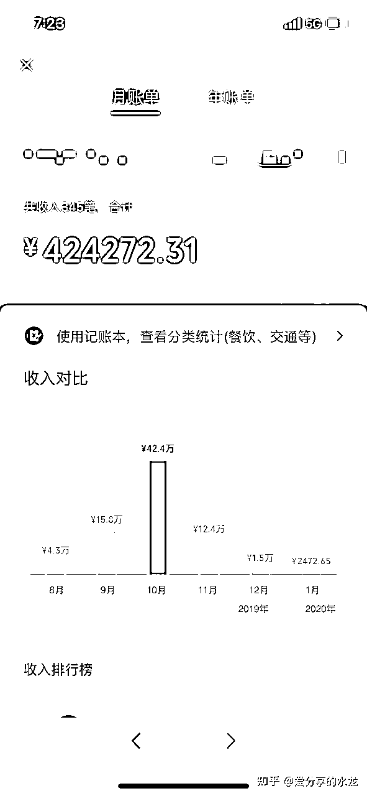
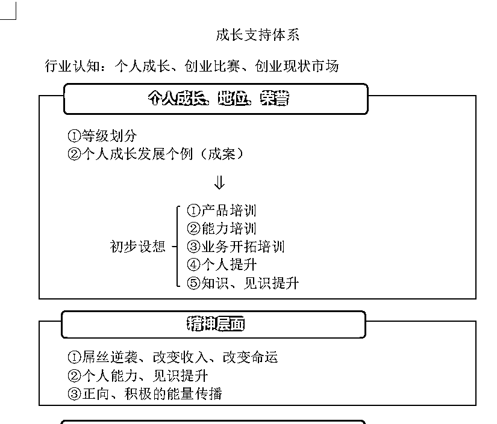
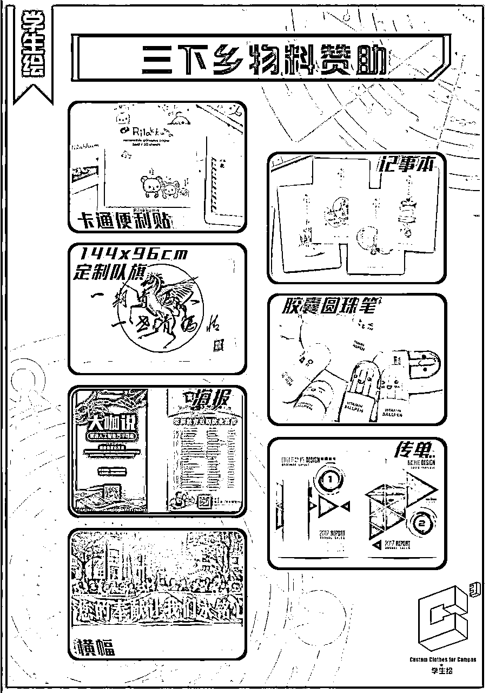
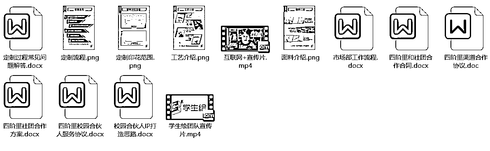
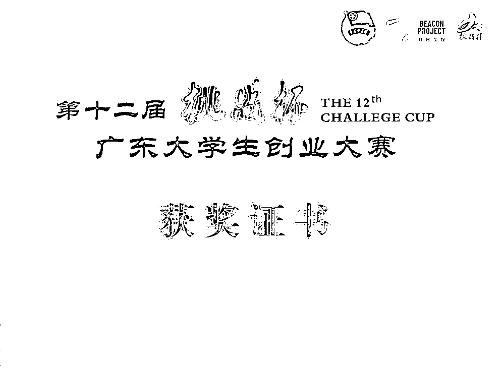
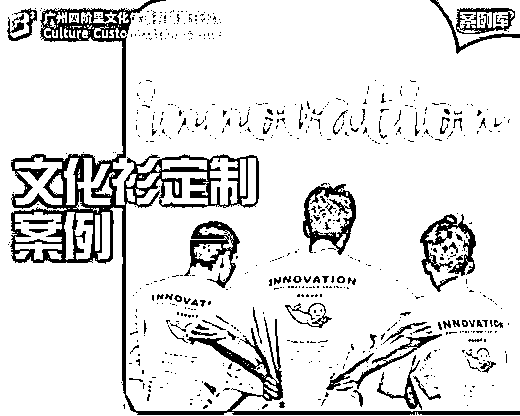
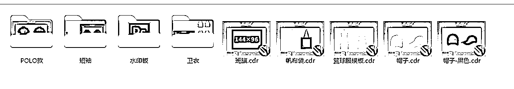

# 文化衫定制项目

> 来源：[https://ie5wfc519n.feishu.cn/docx/ZBCYdKkW5o869ZxwwRGcQFHXn4b](https://ie5wfc519n.feishu.cn/docx/ZBCYdKkW5o869ZxwwRGcQFHXn4b)

我在大二创业，那会带团队做校园文化衫定制项目，赚到了自己在校园的第一个50万+。

我在星球搜索的时候，关于文化衫定制这个项目，很少有全面的介绍，这里我把我自己做过的整个过程，分享出来。

### 一、项目背景

简单介绍一下项目，我在2019年大学创业的时候，带着团队，靠卖文化衫，在半年时间里，营收将近200万，我自己就靠这个项目赚了第一桶金50W+，曾单月收入40W+，毕业以后开始上班工作，业余仍然有很多客户和代理找我定制文化衫，每年的收入也有10W+，这个项目，今天就拆解一下这个文化衫定制项目。

### 二、主要目标客户

1、初高中中学班服

2、大学社团服和班服

3、企业周年庆文化衫，企业日常文化衫

4、奶茶店、小饭店，咖啡店工作服

5、付费社群的社群文化衫、周边等

### 三、利润

1、T恤定制成本在8元-20元，淘宝销售价格在25-55元，单件利润在20-30元，常见的订单数量是30到50件，正常一个订单利润是500元起，偶尔遇到定制上百件的客户，就会赚到更到。

2、卫衣成本是30元-50元，淘宝销售价格在70-100元，单价利润在40-50元，正常一个订单利润是1000元起。

3、客户除了定制文化衫外，一般还会配套定制帆布袋，帽子，裤子相关周边定制，定制越多，赚得越多！

### 四、赚钱思路

#### 1、校园市场的玩法

##### 第一种方式：发展校园代理

代理一般分为两类，一种是0代理费的，只需要将我们的小程序推荐给他们的班长或者负责定制的负责人就可以。

我们是根据件数给学生结算代理费，一般来说，像大一的新生以及高中生，他们会处于对你这个学长学姐的喜欢，就会顺手帮你推荐，推荐了之后，有了佣金之后，就会继续帮你推荐，这种佣金在150元到300元左右一个单子。

对于中学生或者大一新生已经是一笔巨款了，所以我们重点也是发展这种代理，因为我们自己的利润会比较高。

第二种代理，我们称之为校园合伙人，是需要收999元代理费的，然后他的提成是按订单总额比例结算的。

对于这种代理，除了产品本身分润高之外，我们还会邀请他进我们的圈子，帮他打造个人IP（其实主要目的也是培养他的销售能力，更好辅助他去发展下级和拓展客户）

##### 第二种方式：和大学社团合作

大学社团的外联部每年都需要拉赞助的，那一直有一种新生赞助叫【文化衫赞助】。

也就是班服公司可以先给大学社团提供迎新赞助，赞助金额按每件衣服的【6-10元】算，然后这个社团在迎新结束之后，这个社团的文化衫一定要在班服公司这里定制，其实这里就是羊毛出在羊身上，就是我们文化衫有足够的利润空间，可以让利给社团（本质上来说，就是以更低的价格把文化衫卖给了社团，但是对于社团外联部他们又完成社团需要的拉赞助任务）

有些社团可能需要提前打钱给他们，所以如果玩大学社团的，需要一些启动资金（差不多1万就够了），有一些需要赞助他们物资，像海报传单之类，这些都是可以在淘宝或者1688定的，其实花不了多少钱

如果销售能力足够强的，其实可以和外联部长谈新生班服的合作，有些学校的新生班服是学生会就可以统一安排的，我们有次就是把销售总额的百分之20给到某个学生会主席，他就直接把整个学院的班服都搞过来我们这里定制了。

PS：社团客户一般每年都会定制，复购率极高，前提拓展越多，后面就是躺赚的，我现在就是躺赚状态

##### 如何在线上找到各学校学生？

1、在百度上直接搜索高校名单和中学名单，对于每个中学和大学，按城市进行“扫荡”，也就是说有了学校名单之后，在每年的6月份左右，开始用QQ或者抖音混进各个学校的新生群，在新生群里，以学长学姐创业的身份发展新生代理，（记得提前把朋友圈包装好，人设是正能量，有能力，能赚到钱的学长学姐），将有各个学校代理集中到微信上统一管理

2、小红书图文，在小红书上通过高中资料引流或者就直接高薪线上兼职之类的，进行引流

3、购买各种大学生兼职群，新生群、交友群，进行拓展校园代理

PS：代理转客户，客户转代理，这个就是一个闭环，先有代理，再有客户，有了客户，就会代理！

#### 2、社会市场的玩法

企业客户，基本都是靠口碑推荐，文化衫定制，客户要么就是在淘宝定制，要么就是找熟人定制，因为我们的货源就直接是工厂价的，所以在价格和质量上都是有优势的。

开拓客户的关键就在于破圈，多参加一些企业相关的线下交流会，多付费进入一些创业圈子，一般来说创业圈子里，做文化衫的都不多，你只要和他们说，你是源头工厂，基本会找你定制，定制一次之后，一般都会口碑推荐。

像奶茶店，小饭店之类，最重要的是直接认识他们老板，一般来说他们定制量不大，但是每个月都会定制的，一年下来也是一笔客观的收入。

最近也在尝试通过闲鱼和小红书引流创业粉，后续也会用文化衫进行变现。

### 五、做项目的必备条件

#### 一、找好源头供应链、熟悉服装定制相关工艺

1、底衫供应链：T恤、卫衣、马甲、风衣、职业装等

2、印花工厂：常用的丝印、烫画、直喷、刺绣等

PS：文化衫的源头供应链在1688找不到的，一定是要到线下去亲自谈合作的，这类工厂都是年纪比较大的人当家，所以合作前，他们都是要和你见过面的，长期合作之后，是可以月结账的。

文化衫的供应链一般集中在几个地方：

1、广州白云新百佳市场，基本上那里就有全部的底衫了，可以每家对比一下价格。

A区的话是广告衫之类，很多广告衫在校园市场也是通用，其中有几家是专门做班服市场的底衫供应，也就是大部分的淘宝店都是从那里直接进货的。

B区的主要是足球服和篮球服，包括一些简单的印花。

在A区旁边的贯通的话，一般是烫印和刺绣工厂，而像丝网印和全身印工厂一般都不在这个位置，一般得需要自己找。

找这两个工厂的技巧也很简单，一般只需要热情地找店老板，然后甩上几个订单，他就会给你介绍他们的朋友了。

当然，对于这两个工艺的工厂，有时间最好去实地，毕竟不同工厂出品的质量是不一样的。

要去实地，看他们的生产环境，看他们的机器，也要亲自看看是不是真源头。

2、佛山和广州中大布行

这两个地方有很多面料以及各种辅料，像吊牌，包装袋，主要是相对有要求，同时量足够大的客户的问题。

3、潮汕揭阳，江西义乌

这两个地方，主要是制衣厂，一般就是是真正的源头，做文化衫，一般用不上，但可以去了解。

我在创业的时候，就去过线下谈了超过500+工厂，最终合作的，也就10家左右靠谱的厂家。

（文化衫定制这个行业大多数对外都号称自己有工厂，但很多实际上都没有的，很多都是是无货源电商）

这里对于找供应链的话，以我将近四年从业经历分享一下过来人的踩坑经验：

1、能不用全身印，就不要用

校园市场经常会用到数码全身印，但是全身印工厂非常不可控，如果是新人的话，订单量小，到旺季的时候，工厂很容易优先完成他自己手头上的大客户。

那会和工厂谈合作，淡季的时候，答应2到3天一定发货，但到了开学之后，订单量暴增的时候，工厂生产就跟不上。

我那会因为太年轻，被工厂佬说得心动，几乎都采用了全身印工艺，差点被害死。

我们当时一个几百单，一个单子2000元左右，客户天天催，天天骂，搞得我只能在工厂天天盯着发货。

（文化衫一般都是某场活动需要的，如果超过了活动时间，客户除了退款之外，还得投诉，骂你）

这是非常严重的，也就是在旺季的时候，我们差点面临亏钱和损失大量的客户。

我当时立刻，把大量的客户的订单改做烫画和丝印，虽然成本上去了，但是起码货发出去了，然后已经上了全身印工厂的，就去盯着一个个，给人家发货了。

所以，后面要做文化衫的，记得，尽量别做全身印。

2、印花费用别压得太厉害，给足利润，保证质量。

对于工厂佬来说，最怕的就是他们偷工减料了，我之前合作过几个丝印厂，给我打的样品质量和发给客户的质量，天差地别。

直到有一次发生售后以后，我去工厂直接理论，才知道，原来他们的印花费用被同行逼得越来越低，所以不得已用了更次的染料。

后来，我和其中一个供应商深刻交流了这个问题，他也认可了我口碑第一的观点之后，我们后面几乎都是用最好的。

当然，印花成本也上去了，但对于零售的利润来说，印花费，其实不高。

3、底衫一定要自己亲自穿过，试过

我那会在大学里，我去跑校园客户，用的最简单的方法就是，带着一堆衣服，直接和社团或者老师，直接约面对面看衣服。

我自己就像个测评博主一样，把每件衣服给试穿一下，看看着身效果，以及这个衣服的耐穿程度。

在选择底衫，我的建议是sku千万别太多，尤其是做校园生意，一般就两种纯棉，一个高价一低价就可以了。

4、售后不要和供应链计较，自己做好预期管理

做文化衫定制，一般会有破洞，印错之类的问题。

如果衣服数量不多，尽量自己掏钱解决，因为相对于零售端，他们的利润是很小的。

要想走得远，和供应链的关系一定要搞好。

#### 二、开发市场必备步骤

1、一定要提前准备好招募代理需要的相关文案、图片、视频等

我们那会暑假，在学校招募了20个留学校的大学生，以打比赛做项目的名义，给比较低的薪资（一个月底薪800元），招募他们来招募校园代理。

大部分大学生自己是没有商业思维的，所以，一定要给他们保姆式操作文档。

包括如何申请账号，聊天话术之类等等，这样子，他们就可以在学校里按照SOP自动化工作。

一个原则：代理数量越多，开学季转化就越高。

2、一定要提前准备好招募代理推文和班服销售推文

一般来说，中学是7月左右放暑假，所以，我们就是在6月底开始招募校园代理。

我们最常用的方式，就是直接找校园墙投广告，所以，招募代理的推文一定要提前写好。

推文主要突出线上兼职，0代理费，高佣金。

然后班班服销售推文的话，一般是在8月底之前完成，重点是放班服设计图。

一般是突出比较好看的班服和足够优惠。

我们那会卖爆的套餐就是29元可以免费印两个图，38元就全身印，一下子就打爆了市场。

3、营业执照、相关获奖证书等

对于学生而言，权威性是非常重要的。

我们那会能比较便宜地招募到大学生兼职，主要原因就是我们拿了省赛金奖。

所以很多学生，甚至还愿意无偿加入我们团队，一起感受创业。

而对于中学生来说，他们看到你真实的学校，一般都会支持学长创业，然后主动帮你宣传。

5、客户下单案例

一般来说，新的客户，都会问你看一下其他客户的定制案例。

他们在做自己设计的时候，喜欢参考别人的，所以，一定要提前准备好。

#### 三、解决设计问题

#### 1、将当年卖得最好的设计整理成画册供客户选择

淘宝上卖最好的班服200个设计图，一定要提前安排设计师做好源文件，将画册按编号编好，以方便客户选中设计图的时候，可以直接下单

这里给我们的画册仅供参考：

画册可以打印出来，安排校园代理直接给到相关班长或者老师看

#### 2、自学基础的PS，然后在淘宝购买相关班服素材

可以和同行购买相关设计素材，分类整理成图库，你只需要掌握，能将图片做成效果图给客户看就可以了，记得提前准备好相关设计底板

#### 3、解决不了的设计，可以和学设计的同学进行合作，或者闲鱼上直接搜索【画画】的，一般来说一个单子给20到50元设计费就可以了

PS：在和客户谈订单的过程中，如果设计比较复杂，一定要提前收100到200元定金，并且明确告诉客户这个是不退的，这样子，你在闲鱼找设计师作图也是赚钱的，稳赚不赔

### 六、商业模式选择

这里讲一下我所见到的一些同行做文化衫定制的模式的个人见解：

#### 淘宝：

淘宝开店保证金，创过业的都知道，你一个淘宝团队，起码需要安排一个客服，有财务和运营推广人员，这些人员成本底薪＋提成多少钱一个月？

刷单做销量，投流，直通车运营都是很大一笔开销，然后是不是还有同行的竞争，在这种电商平台效率越好的，卖的越好，效率差的没方法很容易死，如果真要做淘宝的话，建议一定要做包裹卡转私域，不然利润很低

#### 抖音：

抖音，首先就是开通店铺橱窗，有一笔保证金，其次抖音卖货是一定要实际办公场地的，如果是个人做抖音的话，要搭建直播场景，需要前期投入一定的资金，且要坚持做直播和短视频。

#### 拼多多：

很多人觉得那我做pdd行不行？

做店群模式，开几个店，货源从1688上批发。如果你觉得可行，那你估计是对pdd没有足够的了解。

第一、pdd有一个对消费者很有利的点叫做仅退款，很多人会故意仅退款，一点就对新手商家很不友好。

第二、说句实话pdd起店确实有流量扶持，很精准的流量，但是过一段时间之后就会推一些垃圾流量，你就得花钱来买流量

第三、pdd是价格战的地方，所以利润会低不少，文化衫定制，哪怕是工厂都不愿意做拼多多的生意的。

#### 小红书

小红书上很好获取文化衫定制的流量，也是要开通小红书电商相关，目前我没有做，但是有同行在小红书做得非常好，而且我在小红书开了好几个文化衫定制小号，也引流不少精准客户，值得投入时间！

#### 个人推荐的模式：

我认为最好的方式是做公域引流到私域，引导客户在私域进行成交，实现高复购率 高利润 低退货率的优势，这也是我认为这个项目可以复制的原因。

通过小红书和抖音以及公众号文章等方式，获取学生粉，沉淀到微信，再通过朋友圈，社群运营，发展为代理，最终在微信小程序成交以及发放佣金。

### 七、最后总结：

1、文化衫定制，不仅只有文化衫，还可以是手机壳，鼠标垫等，都是无货源电商（不需要囤货）

2、文化衫定制有一定的利润空间，且复购率高，值得在私域上做！

3、文化衫定制三个环节：供应链+设计+招代理，跑通了，就可以实现0成本躺赚！

4、现在个性化定制是上升趋势，这个市场越来越大，而且是小众市场，值得研究！