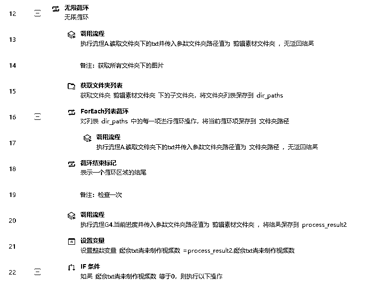
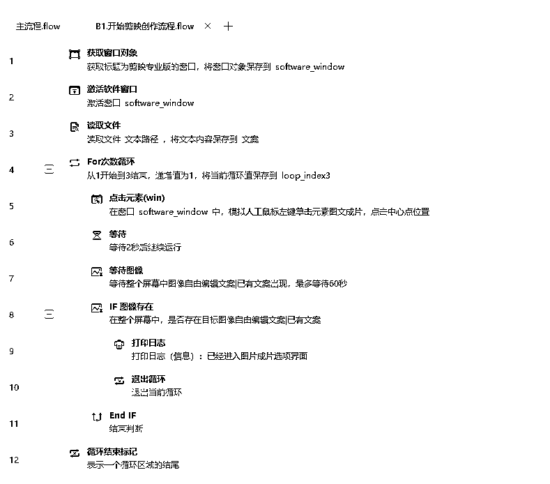
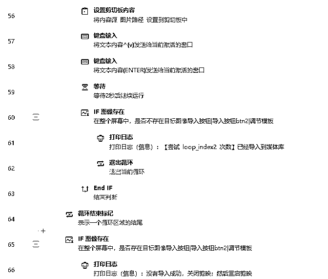
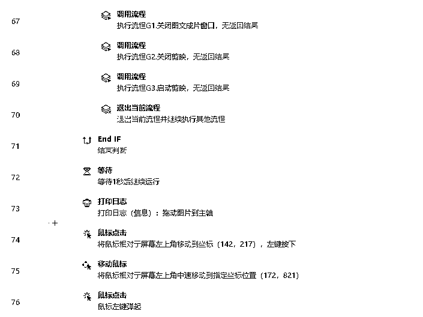
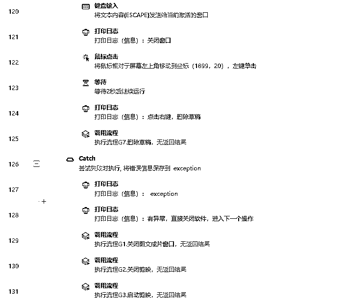
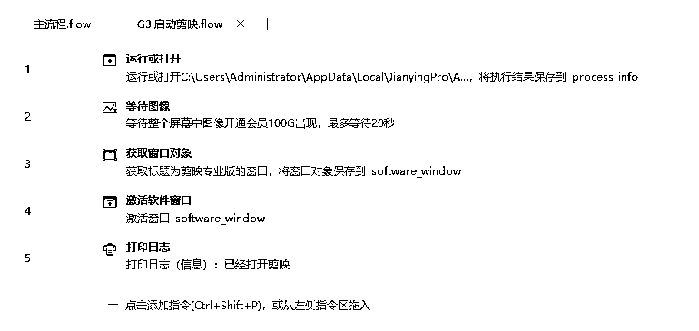
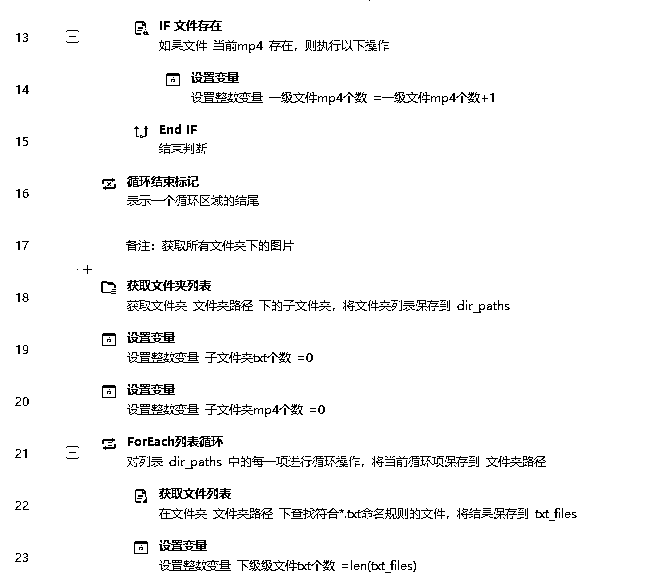
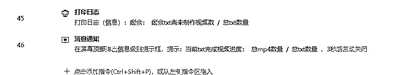
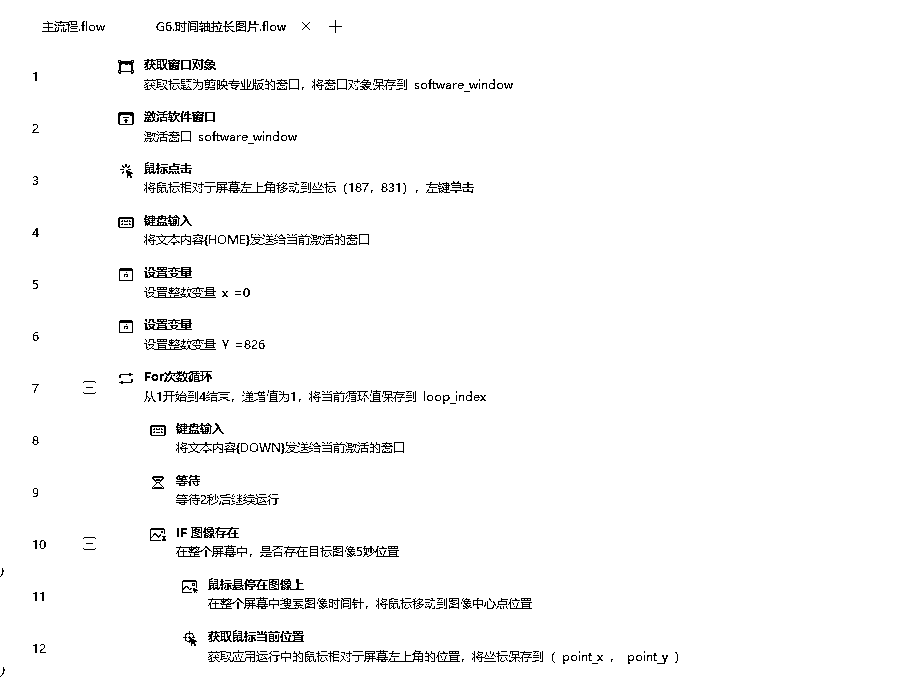
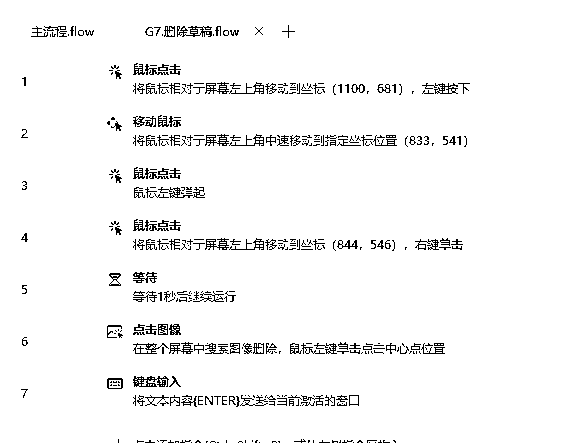

# 剪映图文AI自动创作影刀RPA机器人，智能创作手到擒来

> 来源：[https://kwut14otear.feishu.cn/docx/RzBMdbsyZosL1vxCDRmclw0onOc](https://kwut14otear.feishu.cn/docx/RzBMdbsyZosL1vxCDRmclw0onOc)

一、机器人介绍

名称：剪映图文AI自动创作影刀RPA机器人

作用：

1.批量读取本地文案txt，进行图文成片

2.选择本地封面

3.自动出片

生成效果：

二、准备

软件：影刀RPA软件

官网：www.yingdao.com

三、流程

1.选择素材文件夹

（1）每个txt是文案

（2）每个txt同名称封面图

2.启动影刀

3.启动剪映图文成片

4.选择本地素材

5.导入封面图，拖动至音频一样长度

6.设置导出名称，导出路径

7.完成输出

四、实现代码

主流程

A.读取文件夹下的txt.flow

B1.开始剪映创作流程.flow

G1.关闭图文成片窗口.flow

G2.关闭剪映.flow

G3.启动剪映.flow

G4.当前进度.flow

G6.时间轴拉长图片.flow

G7.删除草稿.flow

