# 《销渣4天突破6w营收：如何发挥优势，从自卑到多次成为高客单月度销冠》

> 来源：[https://lxfgt1wpdnk.feishu.cn/docx/YYQ5dDZSWoStYbx6s2hcZMm8n6b](https://lxfgt1wpdnk.feishu.cn/docx/YYQ5dDZSWoStYbx6s2hcZMm8n6b)

各位小伙伴好啊！我是花花。

毕业于“🇮🇹哈佛”本硕的小镇做题家，外企打工人。虽然做着一份痛不欲生的主业，但好在我有【优势创富教练】这份每日拯救我的事业。

因为自己淋过雨，想为别人撑把伞。做自媒体大半年了，至今帮助过300+个体实现高效自洽创富，累积咨询时常高达150小时+，投入这份事业超过1160+小时，创造了20w+营收。

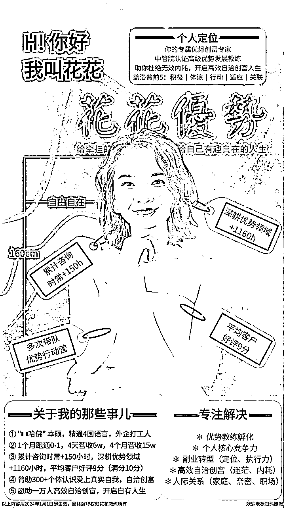

都说商业是最大的慈善。

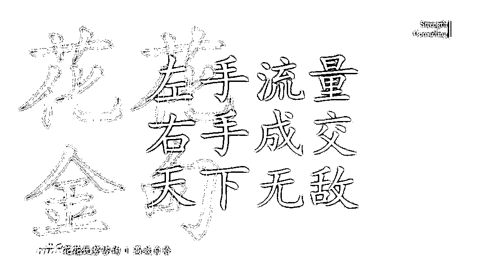

对有些人来说，销售似乎很容易，比如靠谱老师。

但对另一些人来说好像真的是一听都懂，一谈就废。比如初期的我。

作为普通人，引流本就不易，如果还不懂得提升转化能力，那日子确实不好过。毕竟，业绩就是销售的尊严。

今天我们来聊聊我是如何《4天突破6万营收：如何发挥优势，从自卑到多次成为月度销冠》。希望能给大家带来些启发。

只要你能把盖洛普优势理念用到生活和工作中，你会发现正反馈源源不断。发挥自己的优势，找到适合自己的成交方式特别重要。

# 先上目录：

一、产品很好可你就是卖不出去？

二、销冠思维是怎样的？

三、销冠：找到你擅长的销售优势风格吧！

四、四大优势领域的人常见的销售特征

五、怎么解决【我没有xxx才干】的问题？

* * *

# 一、产品很好可你就是卖不出去？

“我这产品这么好，我怎么就卖不出去呢？”

卖产品时的你，像不像初恋时的你？

热情高涨，心跳得扑通扑通的，结果到了关键时刻，人家一句“我再考虑考虑”，把你整得跟掉进冰窟窿似的。

客户犹豫，压价或失踪，再常见不过了。

咱们这圈子里，有的宝子脸皮儿薄，加个微信都得鼓足勇气，发个朋友圈都得琢磨半天，老担心别人会怎么想。

客户一问细节，心里那个慌啊，跟没复习就上考场似的。

忙活半天，最后那业绩，唉，不说也罢。

那此局怎解？

成交不了，原因多了去了：信心不足，产品知识不牢，沟通技巧生疏，目标客户不明确，跟进不到位，情绪波动啊...

这些绊脚石，其实也就是那么回事儿，找准了，一脚踢开！

关键在哪儿？

得明白自己的优势和短板，发挥长处，别让优势的背面成了短板，那可就亏大了。

相信我，咱每个人骨子里都有成为销冠的料。

真正能打动人心的，不是那些花里胡哨的话术，而是你的真诚，你对客户的理解和真心，你提供的额外价值，甚至是你的格局和原则。

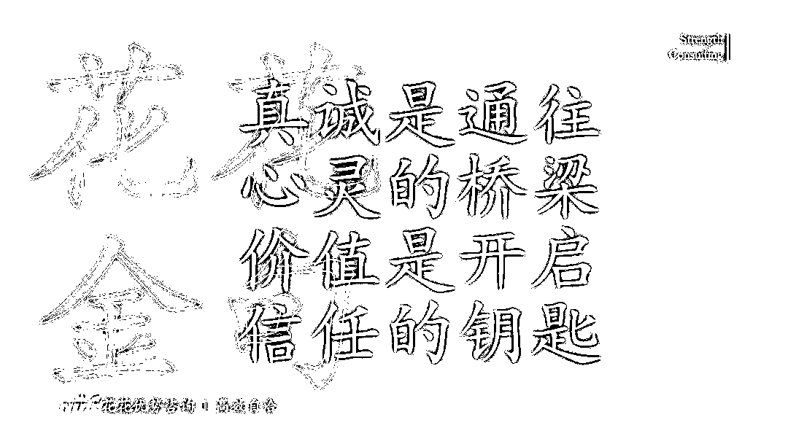

机械地搬弄那些销售技巧之前，得看看适不适合自己，适不适合面前的客户。

事实上，客户是自己成交自己的。

你要做的，就是把事实摆在那儿，让他们看到正确的选项后，让他们自己选。

即便没成交，也留下了好印象。

销售，不只是卖东西，更是心理博弈。

你得成为客户的贴心小棉袄，了解他们的需求，用你的真诚和专业去打动他们，让他们心甘情愿掏腰包。

说白了，就是得用【用户思维】，找到用户的真实痛点

再结合自己“真实且有价值”的一面去建立信任，这样，成交不就是水到渠成的事儿吗？

细节决定成败，这话一点儿不假。

每个沟通的细节都可能是成功的关键。

用好你的优势，管理好弱点，用客户喜欢的且你自洽的方式接触他们。

想成交，70%靠心态，30%靠技巧。

关于心态，掌握了优势理念，就能迅速调整好心态，解决大部分销售难题。

盖洛普有4大优势领域【战略思维、执行力、关系建立和影响力】，每个领域的人都有自己的销售难题。

今儿个，咱们就聊聊怎么利用优势理念，快速有效解决这些问题，走上销冠之路。

没做过盖洛普测评？没事儿，咱一起看看，或许你就能对上号。

有报告的，今儿个的内容，绝对让你受益匪浅。

希望大家听完，能立刻把学到的用起来，立马开单。

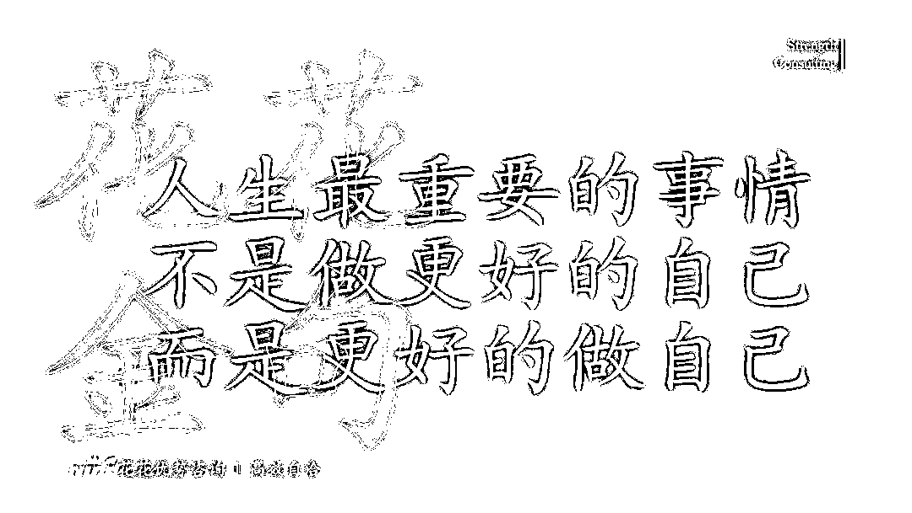

这是我对我每期的L1优势精品小班课学员经常说的。

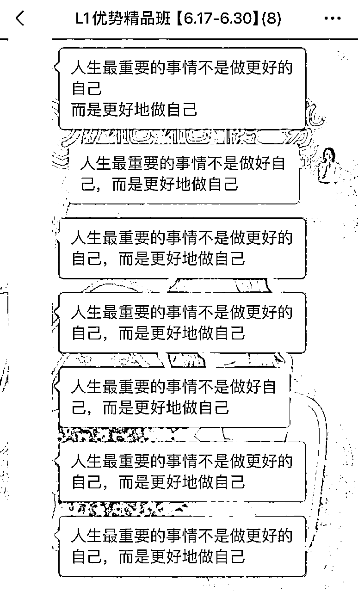

# 二、销冠思维是怎样的？

说起销冠思维，认识梁靠谱老师的人都挺羡慕她的吧？

她拥有的【销冠三件套——取悦、沟通、个别】

听起来就像是销售界的“武林秘籍”，谁不想学个一招半式呢？

但别急，我这就给你揭秘，其实啊，销冠这事儿，并不是非得有那销冠三件套不可。

你看我，就是个活生生的例子。

我呢，一个今年1月才诞生的新手优势教练，平时忙主业和家庭忙得跟陀螺一样

但今年，嘿，我竟然两次成了月度销冠。

秘诀？告诉你，

就是找到自己的优势和销售模式，然后把它发挥到极致。

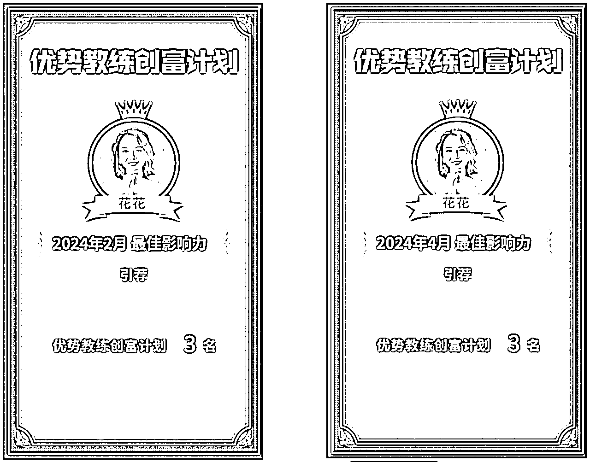

👇这是我的盖洛普优势才干图。

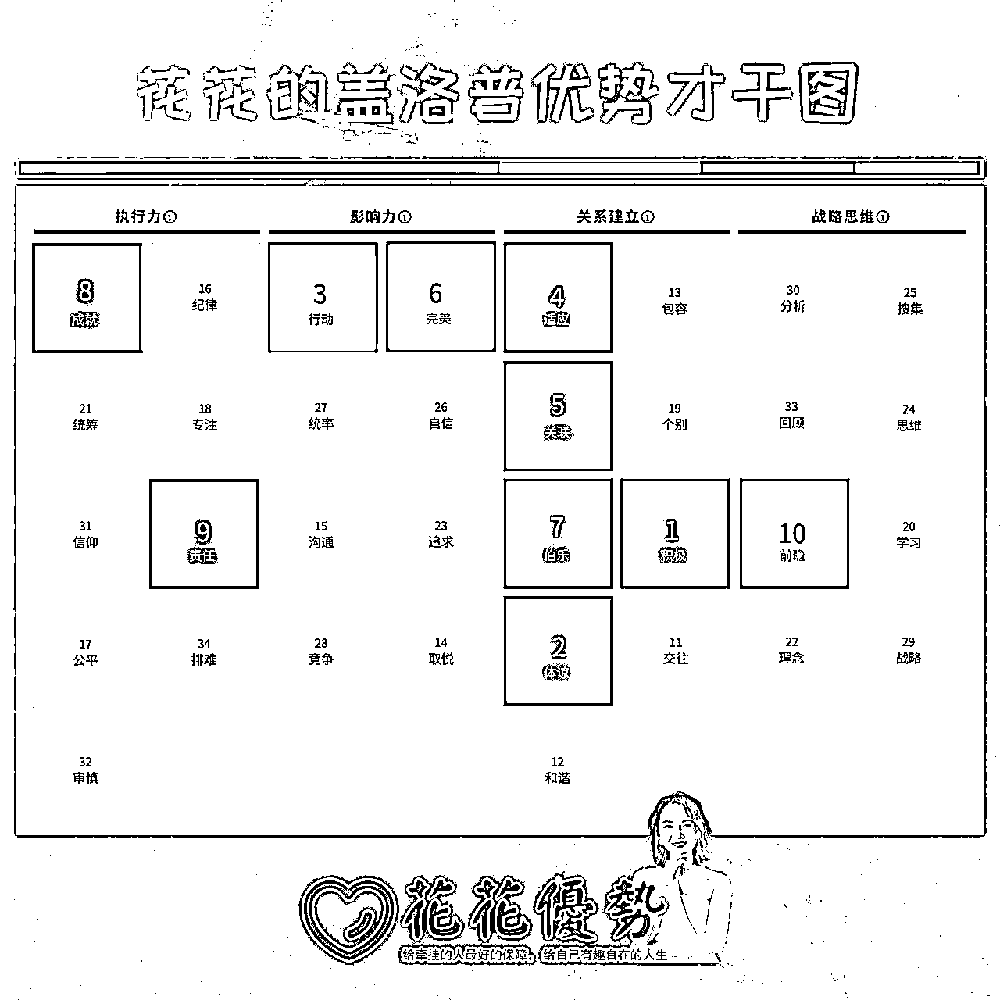

我得承认，一开始我也挺羡慕谱子的，感觉她发个朋友圈就能接单，那影响力，杠杠的。

但后来我自己系统学了盖洛普，明白了一个道理：

得关注自己的才干，而不是老瞅着别人的。

靠谱老师擅长在大舞台上发光发亮，

而我，作为大关系建立，更适合在小范围内释放影响力，1v1的交谈中我更能自洽，散发出独特气场。

从我的优势才干图，大家可以看到我有内耗三件套，也就是前15才干中有【体谅、适应、和谐】这三个才干。

所以我是个极其容易内耗的人，但我学会了自洽，找到了适合自己的商业模式，为认可我的人赋能。

每天实践盖洛普，我就像挖矿一样，不断挖掘最高效的方法，然后不断迭代。

因为我有【成就】才干，我每天都想完成自己给自己的任务，成为更高版本的自己。

【积极、行动】让我真诚开朗，不过度在意别人怎么看，敢于尝试，勇于开干。

【体谅】让我能站在客户的角度想问题，与他们共情

【关联、伯乐、前瞻】则让我相信，每个遇见的人都是缘分。

我想尽可能帮助他们少走弯路，这让我很开心。

当然，成为我的付费用户我会更用心交付，但我也不会过多纠结于那些不识货的人。

我是长期主义者，哪怕今天不成交也不会沮丧，我相信未来会有能量回流，就像蝴蝶效应。

成交本就是双向选择

我能做的就是用心站在客户的角度，用专业知识和技巧，帮他们做出最好的选择。

从心态上，我只需跟随本心，站在客户角度看看如何帮到他们。

也许他们不会成为我的付费用户，但我的某句话或许能点醒他们。

从技巧上，我坚守自己的框架，利用专业知识和谈单技巧看到事物的本质，让客户在对的选项里做选择。

很多人喜欢盯着自己没有的优势才干，无限内耗纠结。

这种思维不转变，内耗不解决，才干弱点不管理好，优势就发挥不出来，很难做出成绩。

而销冠的思维模式，其实就是

从 “我没xxx怎么办？”

转变为 “我有zzz，怎么用它达成我想要的效果？”

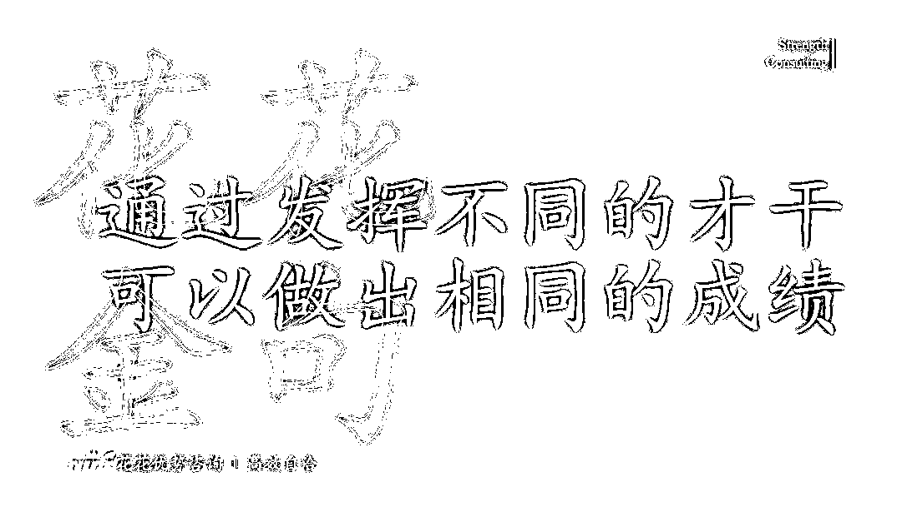

所以别总盯着自己没有的，要多想想怎么用现有的才干去创造业绩。

罗马只有一个，但条条大路通罗马。

找到适合你的路，才是关键。

如果总盯着开跑车的人，而你只有两条腿，时间久了你会觉得自己一文不值，干脆想躺平。

但真正的躺平是有条件的，或许你连躺平的资格都没有。

悄悄告诉你成为销冠的秘诀：

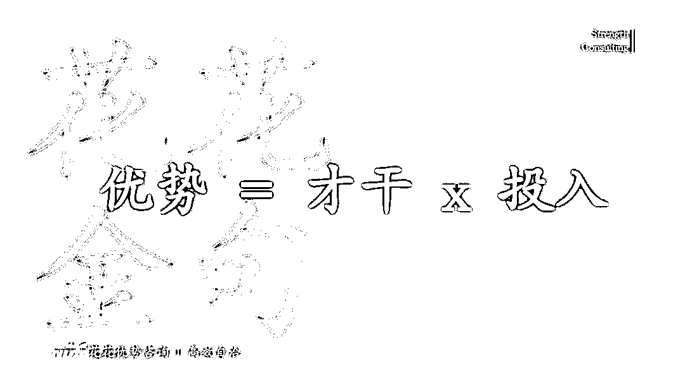

不管你有什么才干组合，只要你认识并管理好自己的才干，找到合适的销售方式，然后不断投入，你就是下一个销冠！

# 三、销冠：找到你擅长的销售优势风格吧！

你不需要被束缚于传统的销售技巧，更重要的是找到适合你的销售优势风格。

销售这事儿，可不就跟咱们做菜一样，得对胃口，还得有特色。你说是不是？

传统销售技巧，那都是老一套了

咱们得找到自个儿的路子，找到那股子劲儿，让销售变得跟呼吸一样自然。

你看啊，每个人就像一道独特的菜，有的辣得带劲，有的甜得入心。

销售技巧也得因人而异，有的招数对别人管用，可你用了可能就是反效果。

所以啊，挑适合自己的，挑自己的客户买账的，这才是王道。

说到产品推广，我的建议是，咱就卖自己用过、觉得好的产品。

你自己都不信的东西，怎么让别人信呢？

特别是刚起步的朋友，专心卖1-2款产品就够够的了，把它们摸透了，这样你说话才有底气，才能用真诚打动人。

好产品有了，怎么卖出去呢？

首先得跟潜在客户搭上线。

怎么搭？

用你最自在的方式，也是你最能坚持的方式。

记住这个公式：

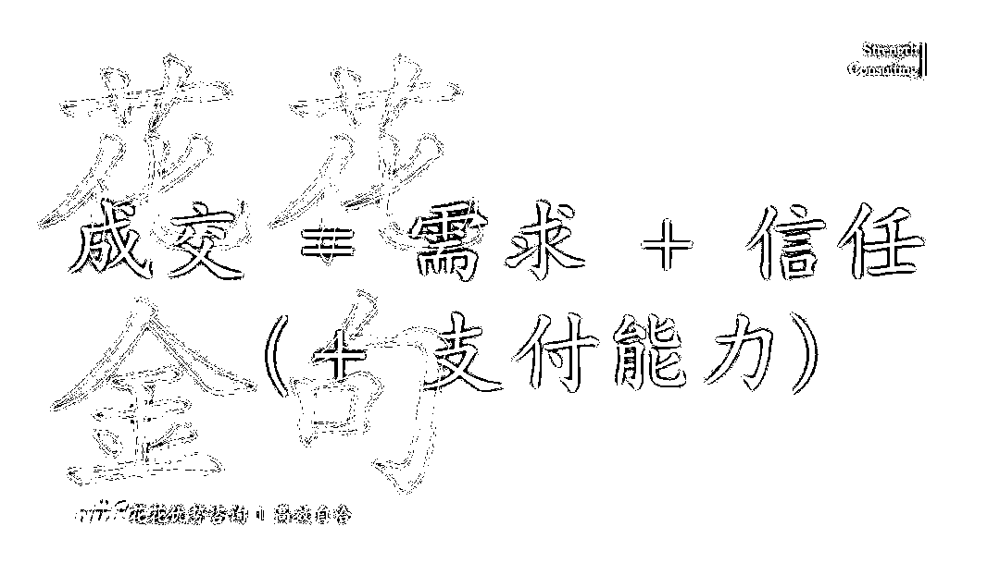

咱能做的，就是提升信任和挖掘需求。

特别是高价产品，信任这东西，得慢慢积累。

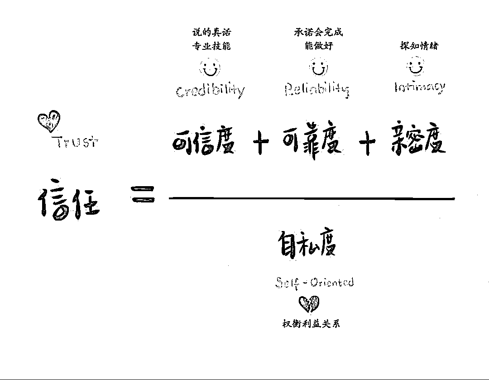

你可能是I人，喜欢安静，连简单社交可能都觉得难。

但别怕，每个人都有自己的社交方式，找到合适你的，用你最自然的方式接触客户，用你的优势去打动客户，单子自然就来了。

盖洛普，不光是个好工具，更是帮你读懂客户的心。

学了盖洛普，你能看透客户那些表面话背后的真实需求。

就像男女分手，男的说的理由，往往不是心里真正想的，你要是不懂这点，就可能一直蒙在鼓里。

总之，理解人性，这是商业、营销、销售的核心。盖洛普能帮你看到本质，帮你提升销售的成功率。

# 四、四大优势领域的人常见的销售特征

不同才干类型的人，在销售成交方面呈现的状态、节奏、卡点、方式，也是完全不同的。

## 4.1 战略思维【绿巨人】：洞察力强但行动迟缓

绿巨人可以说是佛系销售的代表了，洞察力那是杠杠的，就是动起来跟蜗牛爬似的。

他们能轻松一眼看穿问题本质，光是这点就够他们美滋滋的了。

可到了销售这块，他们那股子劲儿就像打了霜的茄子——蔫了。

一点都不积极。

主打【我全都懂，但就是动不起来】

比如我的一位学员，化名【小星】，典型的大战略思维。

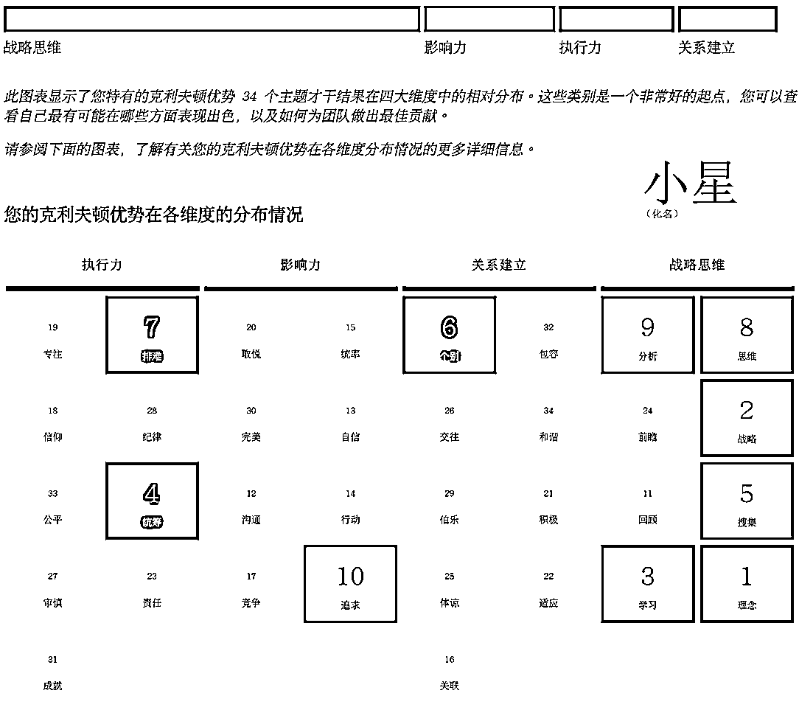

创业好几次，每次都是风风火火，一通操作猛如虎，闭环跑得比谁都顺。

但问题来了，闭环一成，人家那心气儿就跟放了气的气球似的，瘪了。

这卡点啊，困扰ta好几年了。

一小时咨询下来，小星终于开窍了，明白了原来自己就喜欢啃硬骨头，解决那些让人头疼的难题。

业务一旦上轨道，反而提不起劲来了。

哪怕运营成本高得吓人，要让ta去拉新客户，那感觉就像要了命似的。

我就跟ta说，得把优势理念和手头的业务结合，多积累专业知识，给客户整点深度的解决方案。

这样不仅能让ta继续享受挑战的快感，还能把服务做得更加个性化。

有那种洞察力的人，往那一站，专业范儿一出来，客户不得佩服得五体投地？

产品做得对内标准化，对外个性化，那价格还不是水涨船高？

尤其是卖那些复杂的咨询方案，专业形象和战略思维，那是必备的。

当然了，咱们也得留神，别让战略思维的阴影面害了咱们。

比如【前瞻、理念和学习】会让你想太多，过于发散，太超前，客户跟不上思路，

或者光顾着未来，忘了客户眼前的需求，那沟通起来就费劲了，成交也难。

所以啊，【战略思维】突出的人，最好挑那些能让自己专业和洞察力发光发热的产品和商业模式。

这样，优势就能发挥得淋漓尽致，也不至于在销售上碰一鼻子灰。

## 4.2 执行力【紫衣侠】：勤奋可靠但缺乏变通

盖洛普的【执行力】领域跟咱们平时说的“执行力”可不一样。

你是否愿意采取行动往往取决于内在的驱动力。

这种驱动力可以理解为对满足自己前十才干的渴望，不分优势领域。

好，说清楚这点，我们来看看紫衣侠通常适合什么类型的成交呢？

他们天生就是那种“你信我，我准行，我永远不会让你失望”的人。

为啥这么说呢？因为他们身上那股“踏实勤奋负责任”的劲儿，让人一看就觉得靠谱。

他们天生展示出来的“踏实勤奋负责任”形象，能够帮助他们与客户建立起信任，

因此他们在“非常靠谱、使命必达、步骤详细”的成交中拥有一定优势。

这在咱们这个“信任稀缺”的年代，可真是比金子还宝贵！

还记得我👆说过【成交 = 信任 + 需求】吧？

我有一位学员，化名小曼，ta就是大执行力。

👇这是ta的才干图。

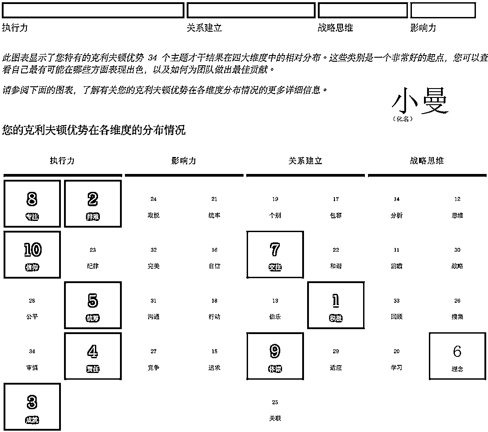

ta是做自媒体项目的，自称I人，社恐。

但是，你猜怎么着？

人家就用好了执行力才干，比如“责任”，吸引了一大帮子付费的铁粉。

为啥呢？

因为大家都觉得，跟着ta，只要执行力到位，收益绝对杠杠的，买房都不是梦！

Ta在项目交付上，总能“事事有回应，件件有落实”，让人心里那叫一个踏实。

ta用【排难和纪律】才干，把项目流程整得井井有条，写成了简单明了的操作手册，新手只要会读中文，那准一看就懂，一学就会。

另外，【成就和专注】让ta目标明确，能持续跟进客户，直到成交。

ta还善于发挥【排难】才干，不断发现客户问题并迅速解决，理解客户所需，迅速行动。

不过，咱们得注意，这执行力领域才干，用好了是宝，用不好就成挑刺儿王了。

过分关注细节，给自己和他人带来压力，自己还跟着焦虑。

所以，关键在于找到平衡，让这股劲儿发挥在刀刃上。

你要是还有“卷王三件套”——成就、专注、完美，那就更棒了。

用这股卷王精神去锻炼自己的成交能力，绝对能大放异彩，业绩杠杠的。

如果不知道自己有什么三件套，可以来找我，我帮你免费看看

最后，给咱们紫衣侠们提个醒，别光顾着低头干活，也得多复盘，

多展示自己的工作，增加曝光率，这样你的努力才能被人看见，享受表达者的红利！

## 4.3 关系建立【蓝精灵】：细腻关怀但难饱受情绪的苦

都说关系建立的人太容易内耗，所以做不好销售。

情感细腻得能滴出水来，可一碰到破冰，就有点儿手足无措了。

不知觉就会过度吸收自己和周围人的情绪，不管好坏。

时间久了不懂了疏导，就会无限内耗

特别是有内耗三件套的人，内耗起来可真是没完没了，怕冲突、敏感得跟啥似的，

别人一有点风吹草动，心里那小鼓就敲个不停。

但是，你千万别小看了咱们这些蓝精灵。发挥好了也能成为耀眼的销冠

就像我们创富的一位学员，小🍊，人家可是从半年2000万的业绩，一跃成了一个月2350万的销冠！

你看看她的盖洛普才干图，原来也是焦虑、迷茫，业绩总不达标，

可学了盖洛普优势和教练技术后，就像打通了任督二脉，业绩噌噌噌就上去了。

不可思议吧？

👇这是她的盖洛普才干图。

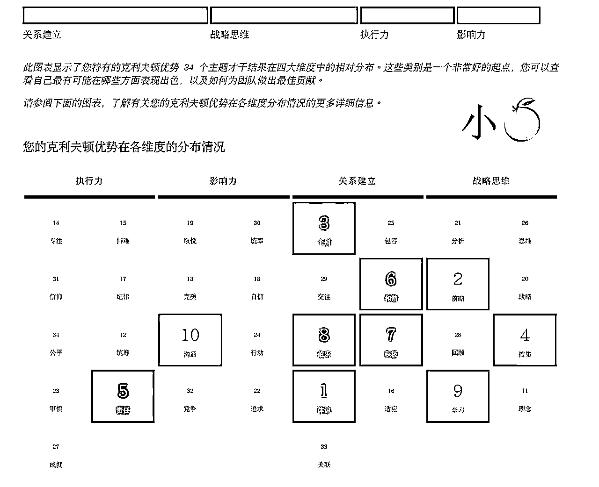

她这变化其实就是受益于销售思维的转变。

原来她卖理财产品，心里那个没底啊，总想着

“这要是亏了，我客户咋办？”

可后来她明白了，这是她的【责任】才干在作祟，她得先从心底里认可这产品，才能把那价值观传递出去。

所以ta通过发挥【积极】，抑制【责任】、【体谅】、【前瞻】的过度发挥，重新建立对产品的认可。

大白话就是，不再想太长远，因为理财期限可以自由选择，可以用短期理财减少风险；

也不要过度担心理财问题，因为大环境无法左右，只能在可预见范围内，帮助客户选择更安全的产品，规避最大风险。

再说客户，原来她老想着跟陌生人打交道，可就是建立不了那种深入的信任。

后来她懂了，这是她的【学习+前瞻+搜集】才干在起作用，她更喜欢跟那些能让她成长的客户交流。

所以通过抑制【体谅】、【和谐】的过度发挥，多发挥【积极】，成功转变思维。

【和谐】【体谅】容易让她内耗，顾忌别人的感受，不想影响友谊，但又觉得理财对他们有好处。

她发现分享只是提供选择，讲清楚利弊，而不是强迫他们。

用【积极】告诉自己这是好事，事情就好推进多了。

如果影响关系，可能就不是好客户，客户是要筛选的。

至于销售风格，原来她老用那一级市场的交流方式，专业是专业，可就是不太接地气，不太适合ta现在需要接触的客户群体。

当前客户（普通员工、教师等）听不懂她的专业用语，也不感兴趣。

后来ta学会了把【沟通】跟关系建立才干结合一起，为客户提供更多情绪价值。

比如用【个别】去识别每个客户的特点，用【沟通】【体谅】让客户觉得咱是真心为他们考虑，不是光想着卖东西。

说到底，产品本身没啥差异化，差异化在于人。

除了专业外，你得发挥你的才干，提供情绪价值，让客户感到舒服，这也是差异化所在，也是成交的关键。

咱们这些蓝精灵，真的，别总怀疑自己，觉得自己社恐，做不好销售。

你看我或小🍊的案例，不就证明了，只要找到适合自己的销售风格和方式，销冠不是梦嘛！

## 4.4 影响力【橙将军】：魅力四射但可能过于强势

很多人认为影响力领域才干靠后，就意味着影响力差，做不了销售或IP。

这其实是个误解。

大多数人之所以觉得自己不适合做销售，更多是因为不了解自己的优势和潜力，导致在销售心态和技巧上出现问题。

影响力才干突出的人确实稀缺，他们往往能在人群中脱颖而出，成为价值中心和流量分发者。

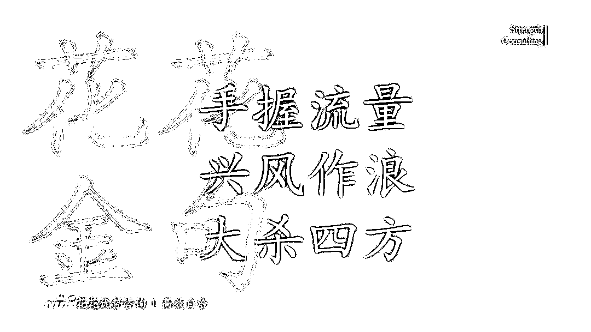

但影响力才干本身也有不同的类型：

软性的如取悦、沟通，硬性的如统率、竞争，还有一些中性的才干。

我们常听到的销冠三件套——沟通、取悦和个别——都是软性的影响力才干（个别是一个关系建立才干）。

那么，有销冠三件套的人就一定会成为销冠吗？

真不一定。

梁靠谱老师就是个大影响力发挥得很好的例子。除了销冠三件套，她还拥有#8统率和#11竞争才干。

👇这是她的才干图。

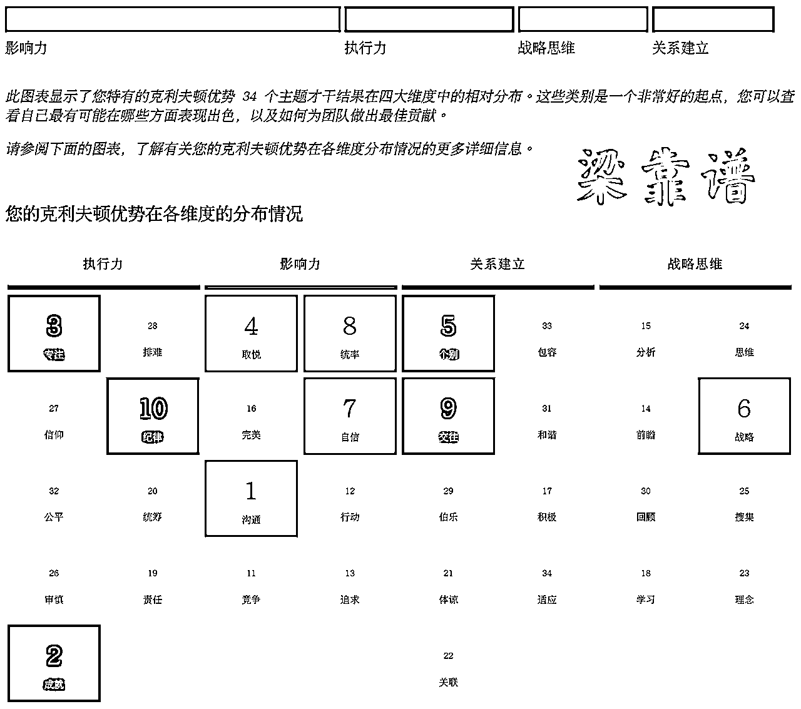

靠谱曾说过：“要发挥影响力，有时需要压制影响力才干”

什么意思呢？

比如有销冠三件套的人需要注意什么？

1.  【沟通】靠前的人热衷于讲话。 如果剥夺了他们表达的机会，他们会觉得比嘎了还难受。 但如果发挥过度，可能就会光说不干，不懂倾听客户需求，变成推销员，忽略客户的真实需求。 客户想听的是买点，而不是你觉得重要的产品卖点。 这类人更容易陷入产品思维的陷阱，无法迁移到销冠所需要的用户思维。

1.  【取悦】靠前的人善于结识新朋友，破冰能力强，招人喜欢，这对搜集新客户很重要。 但如果发挥过度，可能显得浮夸肤浅，影响客户对你的信任。 此外，在维护老客户关系和促进复购时，如果遇到客户认知水平高而自己认知不足的情况，取悦才干也可能不那么有效。

1.  【个别】靠前的人对人的独特性非常敏锐。 如果发挥得好，能识别并理解每位客户的独特需求，为他们提供定制化的服务，提升销售体验。 但如果过于区别对待每个客户，可能会导致效率过低。| 面对大量客户时，如何平衡个性化与效率是个挑战。

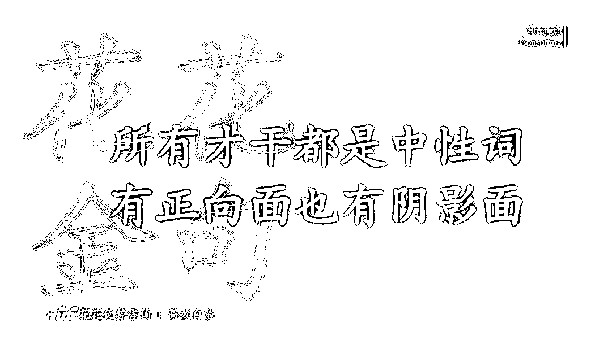

关键在于你是否了解自己的内在渴望和潜力，是否清楚自己的致命弱点，并能管理这些内耗和弱点。

比如想发挥好销冠三件套成为销冠，除了需要足够的行业专业知识，还要控制好沟通和取悦的阴影面，避免看上去过度讨好客户，失去自己的谈单框架。

即使你是大影响力，也需要时间积累知识技能，否则无法靠一张能说会道的嘴让人信服并产生购买。

梁老师变成今天这成功的样子也不是一朝一夕，一帆风顺的。

她刚开始主业工作不久，副业也刚起步时，也是困惑重重。

好在她很早就购买了我的优势导师苏姐的私教课，经过长时间的学习和投入，观察自己在不同场景下的冲突和正反馈事件，调整底层逻辑，最终取得了很大进步。

再次证明了:

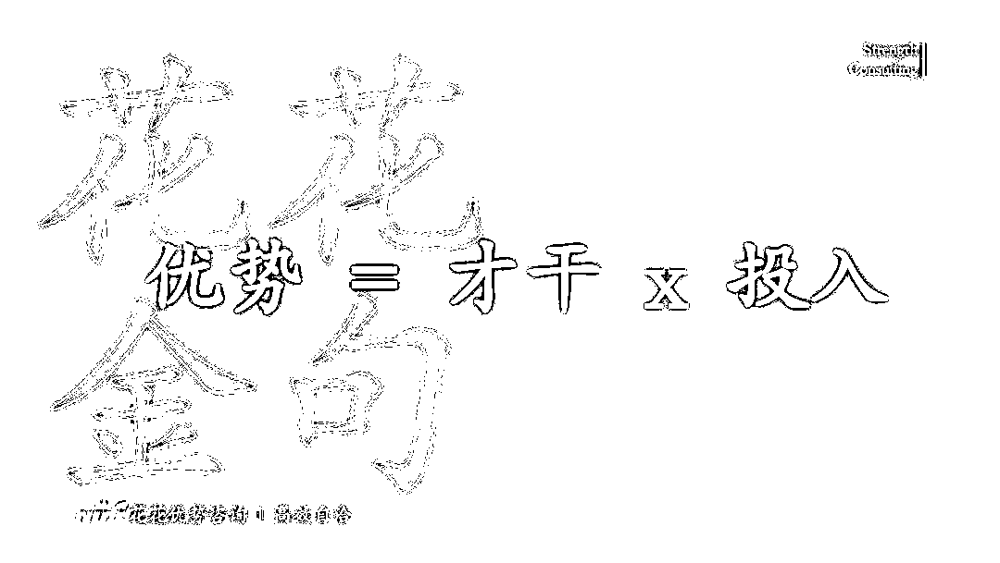

作为销冠的她，现在能很好地用个别识别用户的需求和痛点，用统率定义用户的痛点，用取悦给客户提供情绪价值，再用成就提供专业价值帮助客户解决问题。

就像靠谱说的，成交无非就是问题的解决和情感的愉悦，如果都有，就是持续成交。

现在的梁老师没有了影响力无效的强势，拥有稳定的自我框架的同时，也能适当让出舞台给其他人。

她找到自己的主场，通过直播、社群运营、演讲等一对多的形式释放影响力，变成了人见人爱、花见花开的梁大（当然，她的付费用户对她评价更高，对外她还是很硬的橙将军）。

对于大影响力的人来说，人脉就是钱。

单位时间内能辐射到的人越多，作为流量分发者，他们的商业模式就越优。

这也意味着他们更需要爱惜自己的羽毛，毕竟普通人的口碑一旦有污点，相当于自断前程。

# 五、怎么解决【我没有xxx才干】的问题？

以下是2个简单高效的解决方法，大家记好咯~

## 5.1 优势互补

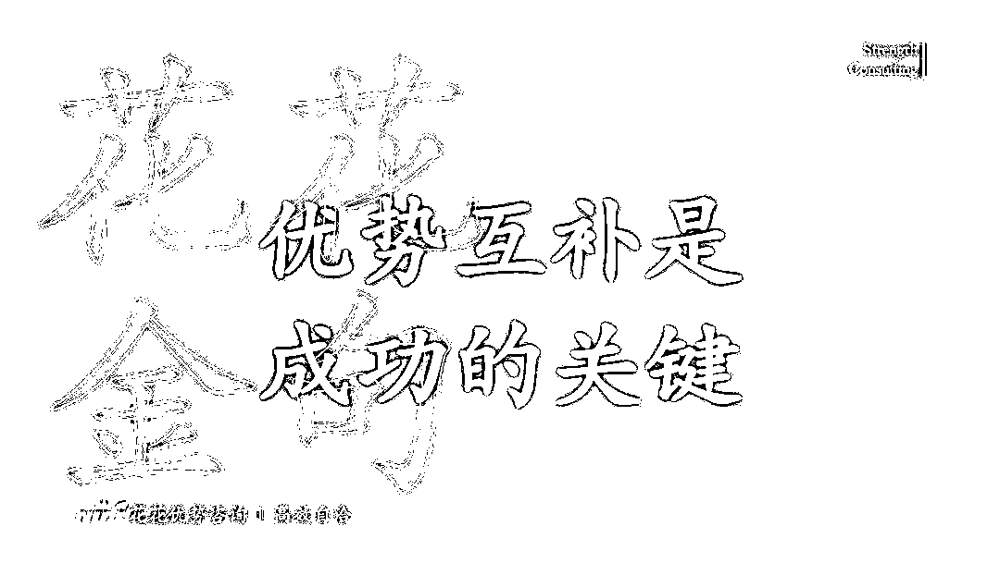

👇这是我的优势导师，苏姐的才干图

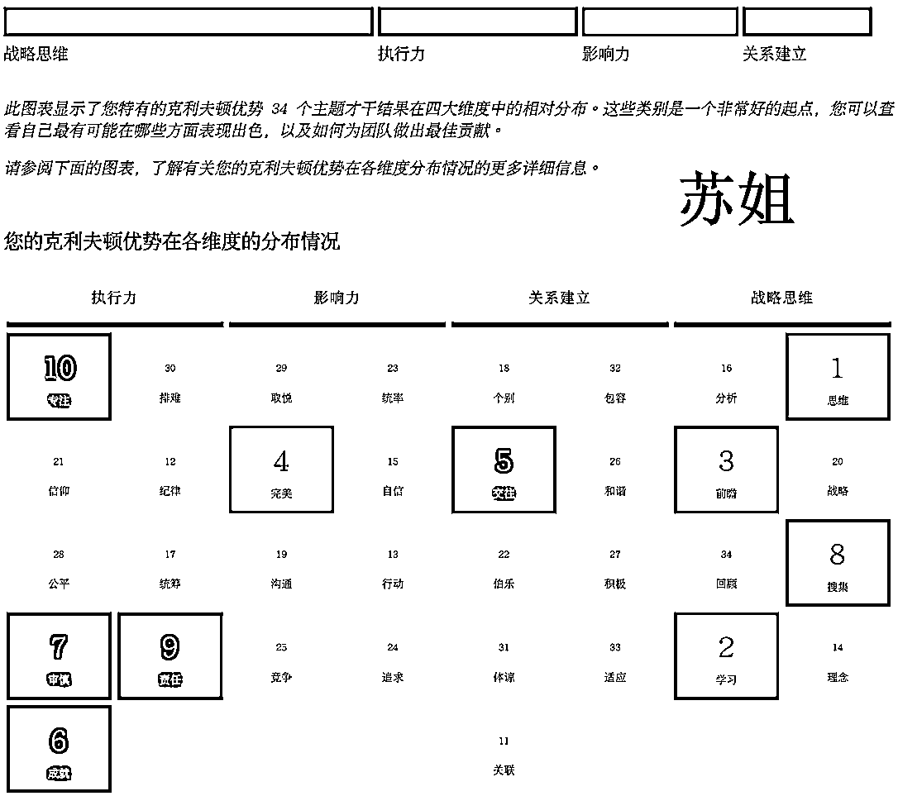

看看我的才干图，和苏姐、靠谱老师相比，我们的优势都互补得恰到好处！

我们不需要擅长所有事情，但你擅长的那件事，一定要做到极致。

你不需要既做产品、又做流量、还要成交和交付。

即使你再厉害，一开始能做到，但你无法长期成为单项冠军。

后期你只需要专注于自己擅长的部分，其他部分通过合作或外包解决，这才是最高效的创业方式。

学会从优势才干的视角看待自己、他人和世界，就像开了天眼，打开了通往新世界的大门。

## 5.2 弱点管理

想要做好销售，除了技能和知识，你还得了解并有效管理自己的致命弱点，不让它们阻碍到你的成功。

我们做副业大多是为了赚钱，是想把一个自己认可的产品卖出去。

然而，如果长期业绩不佳，不仅赚不到钱，还会导致内耗，尤其是我这种有“内耗三件套”的人。

如果不刻意练习才干觉察，稍有不如意就会自我否定，陷入情绪漩涡，无法自拔。

内耗和无法成交的原因有很多，但我们能控制的只有自己。

因此，首先要清楚内耗的来源，管理好弱点，减少阻碍。

否则，就会离销冠越来越远，不断在困境中徘徊。

以下是四大才干领域常见的内耗场景：

*   战略思维：自认为想明白了，但就是不行动。 在信息爆炸的时代，只要打开手机，就能看到别人报喜。 看到自己成果不如别人好，认知高于结果，就会内耗。 有点像孔乙己的长衫，看着别人赚钱，自己却放不下面子，最后内耗，变成高认知的穷人。

*   关系建立：情感细腻敏锐，但总是担心别人怎么看待自己，稍遇阻碍就自我否定，陷入内耗。

*   执行力：只会傻干蛮干，不会表达，觉得自己没啥特点，无法引起别人关注，导致内耗。

*   影响力：渴望得到他人认同，但实力不达标。 想要的得不到，甚至因为天生攻击性强，得罪客户却不知道，无法成为销冠，内耗不断。

才干组合的内在渴望可能会互相冲突，让你没事就戳自己几刀，这也会导致内耗，最终阻碍你做出业绩。

所以关键还是在于清晰认识自己，管理好才干，避免内耗互相打架。

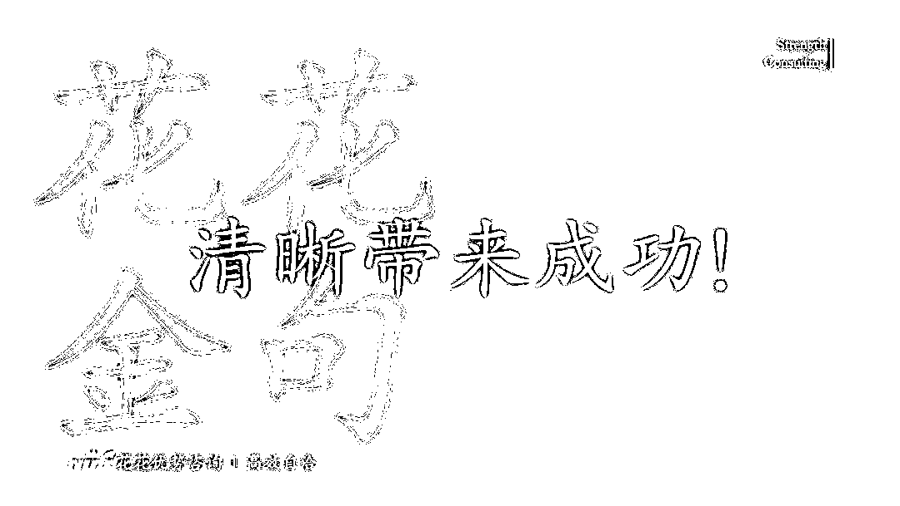

从自知开始，了解自己的才干，发现内耗和互相掣肘的地方，知道这些弱点是如何在你身上起作用的，通常在什么情况下出现。

找到病因，才能对症下药。

但大部分人对自己缺乏觉知，任凭才干自动化驾驶，怎么可能有好的成果？

治病不能治标不治本。

如果你现在内耗严重，或者业绩不错但依然内耗，不知道原因，建议预约一位优势教练做一次咨询。

盖洛普优势的专业度在咨询领域比较高，建议找专业人士帮助你找到真正的病因，然后对症下药。

提升对自身才干的理解，找到告别内耗的方案，从根本上解决问题。

最后，送大家这16字成功口诀：

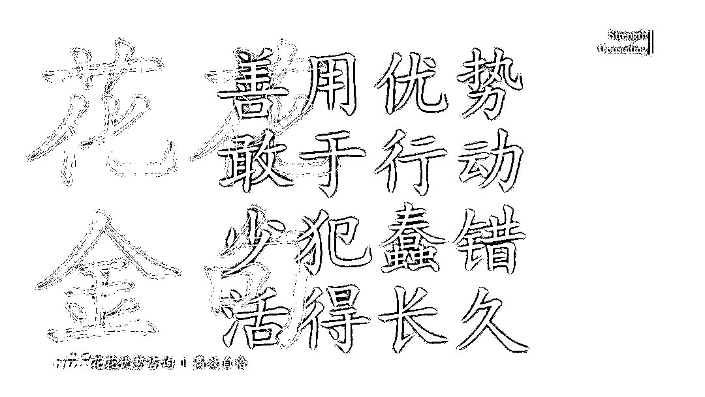

祝大家都能早日【高效自洽创富】！

# 结语

以上就是我今日的全部分享啦，谢谢你的宝贵时间和聆听。

如果这次的分享任何一个部分给了你信心或者启发，在未来给你带来多一些的业绩，我将不甚荣幸。

让我们一起在优势海洋里乘风破浪，赚得盆满钵满，一起成人达己！！！

我是花花，一起高效自洽的工作和生活啊。