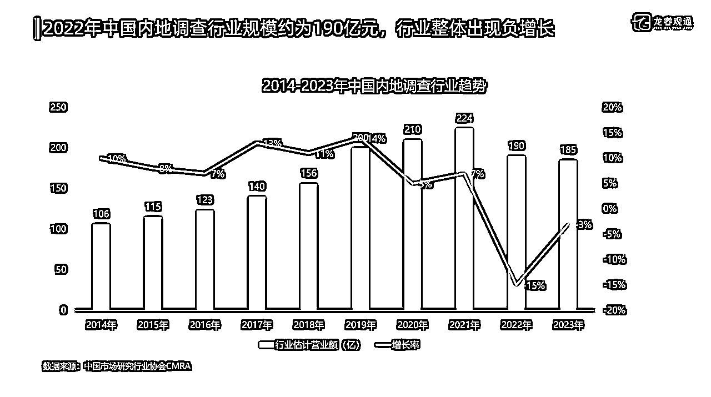
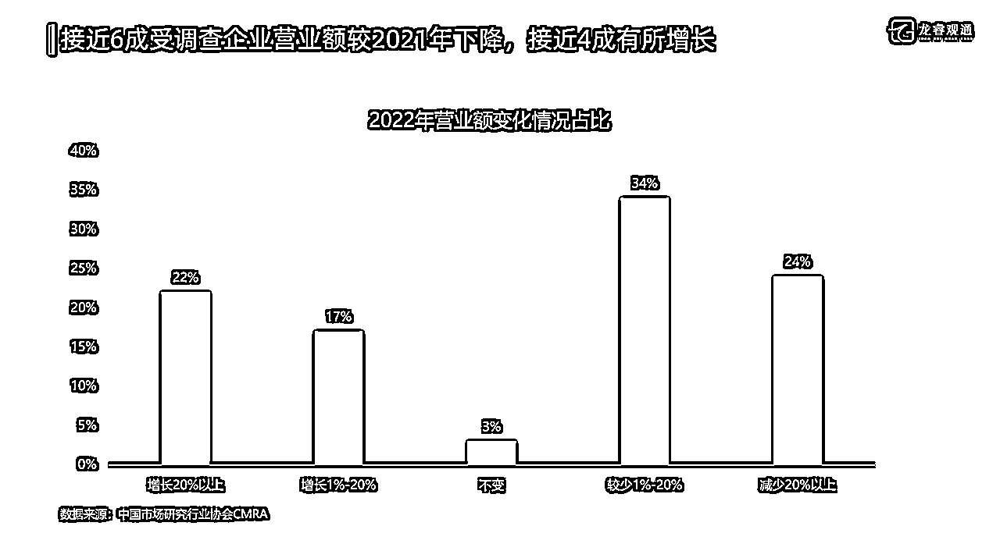

# 从一个自由职业/个体到开一家公司，背后的思考逻辑

> 来源：[https://yzlfc64lat.feishu.cn/docx/LRpGdMDIYoZkLSxMzJNczfFEnMh](https://yzlfc64lat.feishu.cn/docx/LRpGdMDIYoZkLSxMzJNczfFEnMh)

Peron

大家好，我是Peron。我从事市场调研行业（市场与用户研究）十余年，先后在乙方和甲方头部公司工作，并于2023年从某大厂离职，然后成立市场调研工作室、公司，在差不多一年的时间里，我一直在思考一件事：我到底要做一家怎样的公司？

根据中国市场研究协会的数据，中国市场调研公司有几千家，早就供过于求，压根儿就不缺我这一家，如果我还是按照传统思路去做，那么对社会、对行业的价值在哪里？

在经历了一年的摸索实践，现在这个答案逐渐浮出水面，且看下文。

01

未来，哪几类市场调研公司还会活着并且活得很好？

市场调研行业在我国的发展，几乎是伴随着改革开放的全进程。

从20世纪80年代（准确来说自1987年中国社会调查所成立以来）到现在，将近40年的时间，这个行业经历了它的高光时刻，经历了数字化转型的阵痛，如今开始显露疲态。

根据中国市场研究行业协会的数据，2022、2023年中国内地市场调研行业出现负增长，同时行业里最大的公司被曝亏损、裁员并且大力发展外包，这在过去很多年里都是闻所未闻的事情。

但和很多人的观点不一样，在我看来，这种情况的出现并不是市场调研的需求萎缩或者减少了，而是客户需求发生了结构性变化，但供给侧没有做相应地调整，导致供需不匹配。

就拿管理咨询行业来说，我了解到的一家中国本土最大的管理咨询公司，他们2023年单个项目的平均成交金额下降明显，但签约交付的项目数量变多了， 整体业务仍然保持了不错的增长，这种情况其实也适用于市场调研行业。

中国市场研究行业协会CMRA的数据显示，2022年接近58%受调查企业营业额较2021年有所下降，但也有39%的企业有所增长，这更加验证了我的看法。

那客户需求侧发生了哪些变化呢？

一、研究外包需求在减弱，执行外包需求在加强

在市场调研领域，存在着一个由研究型公司和调查执行型公司组成的产业链。研究公司的主要业务来自于甲方客户，而调查执行公司则通常从研究型公司那里获得项目。

当然，近年来，一些调查执行公司也开始建立自己的研究团队，直接对接甲方客户的需求。

在开展一个完整的市场调研项目时，研究公司的职责包括与客户进行深入交流、设计调研方案、分配执行任务、对收集到的数据进行分析，以及撰写并展示调研报告。

与此同时，调查执行公司的角色往往是实施研究公司指派的具体调研任务，通过实地调研来收集市场和用户数据。

随着甲方普遍自建用户研究团队，乙方研究公司的研究经验、能力、人才快速向甲方迁移（流失），甚至出现了甲方（大厂）用户研究团队专业能力碾压乙方研究公司的趋势，研究需求大多都在内部被用户研究团队消化了，这也是甲方用户研究团队的价值根基。

所以，我们能看到甲方客户的需求越来越偏向纯调查执行，例如问卷样本收集，深访、座谈会用户招募等，这类需求的实现甲方客户自己没有这个资源，只能交给乙方做，这是真正的刚需。

这种情况下调查执行公司会一直活着并且活得很不错，但研究公司的价值就存疑了。

为了活下去，很多研究公司转型变成了调查执行公司，原有的研究能力几乎都流失了，这其中包括了不少有一二十年历史的老牌市场研究公司。

只要符合客户需求的变化趋势，这种转型就是有价值的，最怕的就是那种转了好像又没转，接的都是一些调查执行类项目，但仍然没有构建起自己的执行网络，干的还是中间商赚差价的买卖，必不能长久。

二、客户需要更加高效、成本更低的解决方案

随着互联网时代的到来，互联网几乎重塑了大家对于很多行业的认知和判断，电商就是最典型的例子，通过互联网大大提升了成交的效率，同时大大降低了很多产品的销售价格。

甲方客户对于调研行业的需求和预期也是一样的，以前动辄花几十上百万做一个调研项目的情况越来越少了，几万、十几万做一个调研成为了常态。

这中间客户要解决的业务问题其实并没有变化，但他们在不断寻找成本更低、效率更高的解决方案。

1.数字化是一个方向

以前做线下问卷调研，一个样本价格几百块，上千的样本量问卷回收搞不好要个把月；后来线上问卷调研（Online Survey）兴起，把样本单价最低干到几块钱，同时问卷回收周期大大缩短，所以才成为主流的调研方式，哪怕它有着诸多局限性。

以前我们做定性研究，非常依赖访问员（主持人），一个专业的访谈人员或者主持人一场访谈的平均市场价是2000元，如果是座谈会主持人，那么一场的市场价在3000-4000元，成本非常高，而且执行周期长。

现在我们有一些在线平台可以帮助我们做无主持访谈（Unmoderated interview），可以是1对1也可以是1对多，简单来说就是通过平台发布任务与问题，让用户自己在线完成任务、回答问题并记录过程中的反馈（声音、文字、视频），再结合AI技术自动化分析，现在国外无主持访谈技术很成熟了，而且运用很广泛，在国内还处于起步阶段。

以前，我们研究人员要花很多时间来写一份PPT报告，一份报告研究公司的报价在2-3万元甚至更高，对于其中一些连续跟踪监测类的项目（如满意度/NPS/品牌BHT/广告效果评估），这类项目由于其标准化程度比较高，其实是比较适合通过编程技术手段来自动化输出的，价格可以控制在几千元，我们数据团队的Alen老师就能做这一块。

2.（互联网）众包是一个方向

如果说数字化解决方案是通过减少“人”的参与从而降低成本提升效率，那么众包就是在保留“人”这个生产要素下，通过资源的重组来获得同样的效果。

众包指的是一个公司或机构把过去由员工执行的工作任务，以自由自愿的形式外包给非特定的（而且通常是大型的）大众志愿者的做法。

众包（Crowdsourcing）和外包（Outsourcing）是有区别的：

*   在众包模式下，企业面对的是众包平台或者是个人；外包模式下，企业作为发包方，面对的是一个机构，也就是外包公司（承包方）。

*   在众包模式下，仅存在合作关系；在外包模式下，企业作为发包方，与外包公司（承包方）为合作关系，而外包公司与承接这些工作的个人之间为雇佣关系。

*   众包模式除工资外，不涉及或较少涉及社保、医保、公积金等事项，可大大降低用工成本；外包模式下，外包公司需和员工签订劳动合同，涉及到工资、福利、保险等多项支出，同时还需自行组织招聘，并进行后续的人力培训等，由此导致成本较高。

举例来说：

-外包就是现在有个甲方客户A有个调研需求，找B来做。B自己有个市场调研公司，雇了一些研究员，研究员每月发工资。A与B为合作关系，研究员们与B是雇佣关系。这是目前主流的方式，这种方式遇到极大的挑战。

-众包就是甲方客户A有个调研需求，通过B寻找研究团队支持。B上面有很多研究人员/FL，来自全国各地，同时研究人员/FL和A及B都不存在法律上的雇佣关系，更多的是远程协作模式。

很显然，众包很多情况下能做到比外包的成本更低，价格更低，而且因为省去了中间很多的程序（签合同、走供应商流程等），效率更高。

你可能会问，既然研究需求大都内部被消化了，众包还有未来吗？当然有的。

甲方客户中能自建用户研究团队而且成规模的还是少数，这意味着很多中小企业还得依赖外部研究团队支持，但传统的研究公司价格成本仍然过高。

再就是甲方用户研究团队的研究需求在一些情况下会溢出，例如项目周期紧，人力吃紧；又或者把一些不重要的研究任务外包出去从而让团队聚焦在真正核心的工作上。

这都是众包的机会。

三、客户需要更加专业、能真正解决业务问题的解决方案

中国市场研究协会对于调查研究行业有一个判断，那就是由于缺乏大型调查研究和研究的成功经验和案例，目前除去两三家较大的调研公司外，大多数调研公司的影响力和知名度都较低，中国调研行业整体仍处于较低水平阶段。

这意味着什么呢？这意味着大多数研究公司的研究能力、产品/解决方案压根儿上不了台面，要么缺乏自己的理论、研究体系，要么千篇一律同质化。

这种情况下，研究公司很难给甲方客户去赋能，帮助客户更好地决策。

但确实存在一些复杂的研究课题超出了甲方用户研究团队的能力，需要外部赋能，需要“偷师学艺”，那怎么办呢？同样有两个方向。

1.聚焦某个赛道/品类，持续深耕

长期深耕一个赛道/品类的优势在于对于赛道/品类的深刻理解，再结合大量研究实践，就更容易有好的用户洞察，好的策略建议，这都是建立在“人”的基础上、团队的基础上而不是方法技术的基础上。

你可以没有自己的方法论/模型/技术，但你有基于一个赛道/品类的理解，有数据解读能力，那就够了，而且对业务的理解、数据解读能力才真正是研究人员的核心能力。

我就职的第一家研究公司就是聚焦汽车这个赛道的，十来年过去了，从最初的几个人、年营业额一两百万到后来的几百人、年营业额几千万，越做越大；反之那些什么行业/品类都做的研究公司，越做越小，以至于很多都销声匿迹。

上个月和一个研究公司的老板聊，他是从腾讯游戏出来的，然后组建了一个小团队专注于游戏行业市场调研业务，才一年多的时间，我就觉得很好，肯定能做起来，因为这是市场调研行业真正需要的东西。

专业服务业，到最后比拼的还是一个专业，一个什么都做的万金油公司什么都做不精、做不透，只有聚焦一点才能形成竞争优势。

2.聚焦某个需求场景的解决方案，持续深耕

企业的业务需求场景有很多，例如市场机会探索、产品创新、产品上市前评测、产品上市后复盘、品牌营销效果跟踪监测等等。

如果你能专注于其中某一个需求场景提供独家解决方案，那么你也会很有竞争力。

华通明略（MillwardBrown）也就是我的前东家，现在叫凯度（Kantar）,它的解决方案就相对聚焦在营销沟通这个业务需求场景，品牌和广告研究就是它最核心的产品，在这个领域它基本上很难找到对手，而且要价很高。

科罗思咨询集团(CFI Group)，也就是韩依林老师曾经就职的公司，是全球最知名的客户满意度管理咨询公司，这家公司服务的客户数量不多，但每一个都是巨无霸/世界500强，而且很多一合作就是几十年，每一年服务费几千万，在满意度研究这个领域它就是绝对王者。

聚焦某个赛道/品类，持续深耕的研究公司当下也不少了，但聚焦某个需求场景的解决方案，持续深耕的研究公司还非常少，因为这对技术研发能力有较高的要求，无论是MillwardBrown还是CFI，它们都有自己的模型、算法、技术专利，这就是最大的壁垒。

02

我要做一家怎样的公司？

从客户的需求倒推，再加上排除法，很容易回答这个问题了。

一、我不太可能做一家调研执行公司

这并不是说调查执行公司不好，相反调查执行公司才是目前行业里最赚钱的那一批，很多研究公司都是在给调查执行公司打工，回溯十年二十年前更是如此，很多调查执行公司的老板身价都是千万以上。

但我和我的团队都是研究人员出身，我们没有做调查执行相关的经验，也没有这方面的兴趣，所以只能聚焦研究。

二、我不太可能做出来一家数字化解决方案的公司

数字化解决方案的公司想成功有两个核心点，一个是技术，一个是资本，这对于我和我的团队来说都是欠缺的，没那个能力做这件事。

此外，目前市场调研行业已经有很多的数字化解决方案的公司，比如快决策，他们都已经做得很好了，也不需要再多一个类似的公司。

三、互联网众包是我看好的方向

互联网众包相比传统外包成本更低、更加高效，符合当下甲方客户降本增效的需求，而且通过平台建设和管理，甚至能提供比外包更好的服务。

我现在的团队本质就是众包模式，我的核心团队有6-8人，都是全职而且经过我筛选的人，大家都是远程协作，我主要负责需求线索获取、需求沟通，他们负责项目研究设计、项目交付。

我的核心团队，筛选的标准有几条：

1.  在某个赛道/品类或者某类解决方案有比较深的积累、沉淀

1.  5年以上的市场与用户研究经验

1.  不错的学历背景（硕士，211以上）

1.  有乙方头部或者甲方大厂背书

但最核心的标准其实只有一条，就是人要靠谱，这个靠谱体现在交给你的项目你能交付好，交给你的任务你能积极主动完成，而且我不看你说得怎么样，我主要看你做得怎么样。

除了核心团队，还有外围的兼职团队，我把他们按照行业进行了划分，搭配核心团队目前组建了3C手机团队、汽车团队、快消团队、互联网团队，每一个团队都有至少一个核心团队成员带队。

单独看每一个团队配置，基本上都能吊打很多研究公司，因为我通过我自己这个IP、众包这种模式汇聚了一大批资深且优秀的研究人员来针对性提供服务，肯定比很多研究公司里的新人小朋友做交付强得多。

在这里也欢迎更多资深且优秀的伙伴加入到我们的大家庭；欢迎更多甲方客户爸爸来找我们合作，如果你有资质方面的顾虑，我们也有解决方案，完全不用担心。

四、做一家咨询与市场调研相结合的公司

互联网众包本质上要做的是一个平台，通过流量来链接甲方客户需求和乙方研究资源，它更适合服务中小型企业客户。

但甲方大客户需要的未必是成本更低的解决方案，为了能更好地解决问题，甲方大厂是可以为更专业、更好的解决方案买单的，哪怕费用不低。

而且甲方大厂有一套严格的采购体系，对供应商资质有要求，众包这种模式显然无法满足要求，所以我肯定还会做一家正规的、雇佣制的公司。

这个公司我肯定不会自己从0-1打造一个全新的品牌，而是会借助现有公司的资质和品牌，简单来说就是加盟，目前我正在筹备当中，大概7月份会出结果。

在我的规划里，这个公司要把（战略/营销）咨询和调研相结合，真正提供洞察建议而不是数据，要能影响客户组织高层决策、有效促进客户生意增长，你可以理解为是战略用户研究，我们的收费模式向管理咨询行业看齐而不是对标市场研究公司，我们主要切的是咨询这块蛋糕而不是市场调研这块蛋糕。

我们的团队构成会很不一样，是（战略/营销）咨询顾问+市场研究团队的构成，这其实也不是什么新鲜事物，我在华通明略（MillwardBrown）工作时就有和旗下的战略咨询团队Millward Brown Vermeer合作的经历；BCG等战略/管理咨询公司也有自己的市场研究团队，在我看来，这是一种非常好的组合，能很好地解决当下用户研究商业价值薄弱、落地难的问题。