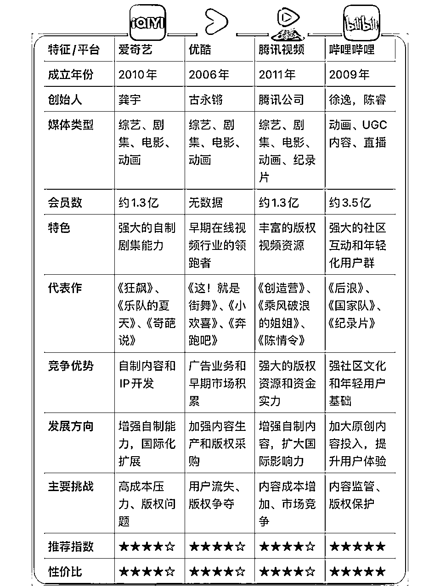
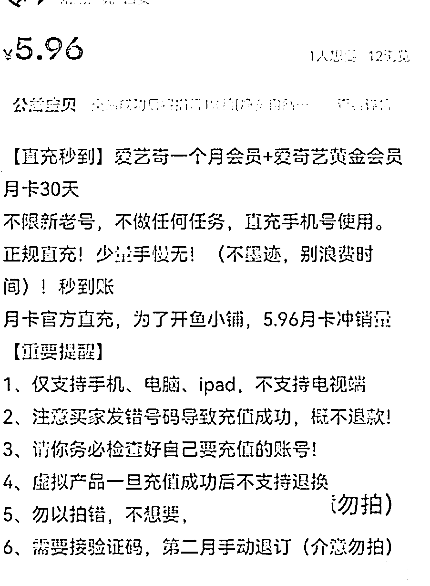
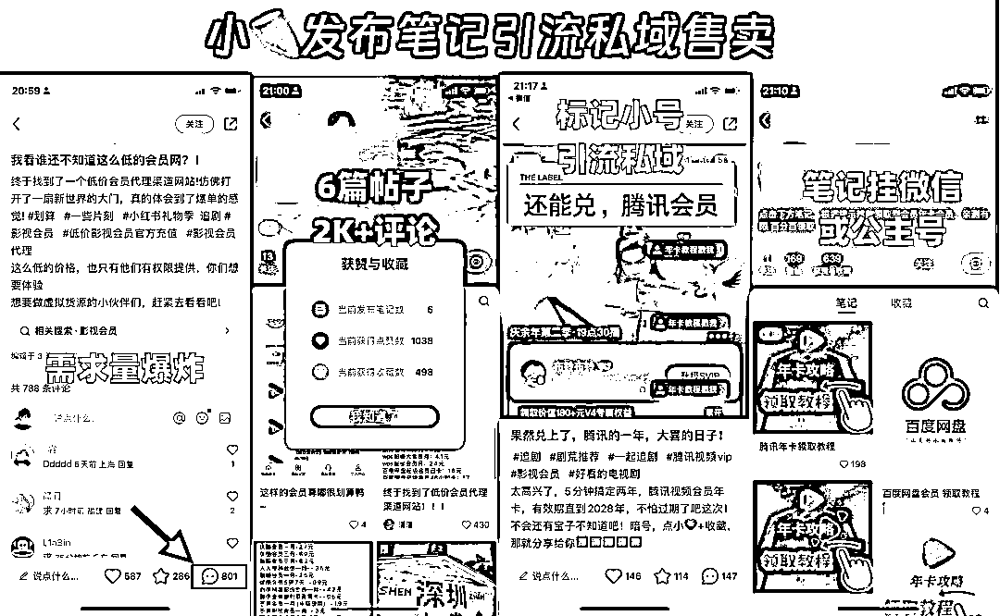

# 项目拆解-影视会员引流项目玩法拆解

> 来源：[https://d1jpewyavi.feishu.cn/docx/LjkqdtWLBoZY7mx4dqtcMfdKnsg](https://d1jpewyavi.feishu.cn/docx/LjkqdtWLBoZY7mx4dqtcMfdKnsg)

引言

身为普通人，依我当拙见：还不足以上升到趋势和行业，我不否认他们所带来的红利，他们能够让你更快/轻松，取得更大的结果/天花板较高

但看得太远未必是件好事，当你处于0-1/1-10的阶段，望着超越自身几十/上百倍的阶段，未必能让你产生望梅止渴的动力

不如找到一些离我们更近的目标/路线，达成和完成相对较容易些，找到些反馈或许更加重要

太过热门且处于蓝海趋势的项目/行业，太卷了（参与人多，玩法也多，免费流变少，审核变严格等）留给个体的机会太少了

得想清楚能撬动的他们的杠杆，也就是大家一直说的壁垒，是团队？资金？技术？知识？时间？

作为个体，我们不一定得去想着怎么打过他们，不输才是生存的根本和依据，找到一条求生之路

与其思考怎么竞争过他们，到不如找到一个避开竞争的方式，找点门缝中的小生意，或比较下沉的生意（缺乏运营/还没被大众开放的）

或许这就是我想写点项目拆解点关键，找点适合自己做的事和自己能做到的事

各位生财圈友你好，我是老旺，最近想着锻炼下商业敏锐度，花了近一周时间做整理和拆解，

这篇文章主要分享：拆解思路和获取到的一些信息，从中能你或许可以收获到几点

*   引流思维玩法

*   变现思路拓展

*   渠道&资料获取方法

*   省钱tips

希望你能从中收获点思路，当然如果你一直是原价充值点，也能帮你省点钱，点击直达⏭️

拆解过程中搜集的一些资料和教程、官方渠道等也都打包好了，便于节省各位的时间，全部都已脱敏（无营销和引流行为），放在片尾了，可放心使用

本文共为5个部分：

*   1、项目介绍

*   2、引流获客

*   3、变现模式

*   4、渠道供应

*   5、总结&资料合集

今天拆解一下：影视会员引流项目

# 一、项目介绍

## 数据案例展示

## 用户痛点

不知道大家平时有没有看剧/电影的习惯，根据网传这是各平台间截止到去年6月份的一个用户月活跃数据表明，随着版权意识的加强和付费内容的普及，越来越多的用户愿意为高质量内容付费。

主流影视平台付费用户也占据较大，但同时，价格敏感的用户群体依然庞大，这就为我们的项目提供了广阔的市场空间。

可见这个蛋糕是多么大，而这些用户也都可以是你的潜在用户，关键点在于你能否找到他们，并让他们知道你可以解决他们的问题

痛点1: 会员太多冲不完

随着短视频不断的洗礼，各种影视混剪/解说/宣发的轰炸，有的人上一秒还在刷短视频，下一秒就跑去爱奇艺/腾讯视频等软件中追剧/刷电影去了

每出一个热门剧/电影，又得去冲个会员要不然就是看不了/广告太多，像最近各大平台的热播剧，数据的热搜指数和探讨指数都是非常高的，说明需求量也大

微博上，词条“庆余年2”，阅读量超过16.5亿；豆瓣上，《庆余年2》成为“2024最值得期待剧集”冠军，参与评分人数超过20万。

爱奇艺在5月初推出的《我的阿勒泰》，集均播放量超过3100万；微博上，“我的阿勒泰”词条，阅读量超过8.4亿。

另一边，优酷也在5月初，上线了剧作《新生》，灯塔专业版显示：其集均播放量接近6000万，超过了《庆余年2》，并出海在奈飞平台上线。

痛点2: 开了会员还不能看全

会员权益的套娃：

“为了看《庆余年2》，买了腾讯视频VIP，发现电视剧每天更新两集，但是我只能看一集，剩下的一集要SVIP才能看。”

即使办了SVIP的会员，知道SVIP能多看一集，结果播到大概30集时，提示我再花15元，就可以直通大结局，套路简直太深了，付费的山头还有下一座。”

而且各大平台官方价格，基本一个月的都在15-20左右，季卡在50-80+左右，年卡在110-160左右，比如爱奇艺的黄金VIP月卡是30，连续包月25，这是官方价格。

就为了一个剧/电影，充值一个会员，性价比又不高一天可能就看完了，剩下的时长也就浪费了

不少人会选择一些渠道的免费观看，但是这种要么广告太多/卡顿/不清晰/水印太多多等问题，比较影响观看体验，对于观看要求稍微较高点的人来说，比如喜欢有弹幕、特效互动等、体验的人来说，一般都会选择直接充值。

而这些人都可以是我们的精准用户，他们觉得的太麻烦了/贵了，我们的需求就来了

基于此我们需要解决用户2大问题，节省花费&节省时间，来帮助他们得到更好的观看体验，解决了他们的需求赚钱也就顺其自然了

* * *

# 二、引流获客

## 📖 小红书

使用工具：

*   去水印获取作品工具：西瓜工具（微信小程序）

*   取作品文案提取工具：配音神器Pro（微信小程序）点击跳转

*   文案修改工具：豆包知道（AI工具）点击跳转

*   拼图&图片制作工具：醒图、美图秀秀、黄油相机

*   视频剪辑工具：剪映

引流方法参考如下⬇️

1、收益/代理渠道

主打省钱攻略/别当冤大头等话题，展示低价购买/收益影视会员的渠道，帮助用户在影视会员上的开销

2、影视资源分享

把最新的影视资源下载/录制下来，保存网盘打包好分享给ta们，帮他们节省时间&花费

像这种目前在小红书&视频号&微信群中引流效果最为明显，主要你的笔记/帖子/链接等被录取/没失效，正常都是有自然流量的，而且这种引流效率很高

3、薅会员教程

影视官方会联合很多平台/公司等出一些联合活动，为双方产品进行导流（用户增长），而你可以把这个做成攻略写成教程，分享给大家

4、追剧影视群

如果你是一个影视爱好者，也可以采用影视群招募的方式，吸引影视爱好者来，群内也可以分享些追剧攻略、剧荒合集、影视资源分享、影视交流探讨等，这个考验你的群运营能力

5、细分影视资源合集

整理某个/某系列的剧情/电影，最好是一些国内不好找但比较热门的剧/电影，比如：韩剧/美剧/经典老剧等，可以关注些热搜指数和平台内容的竞争指数，用户获取难度越高的且探讨热点较高的，引流效果越明显

6、影视软件

分享观影心得/终于可以白嫖xx等，可以免广告/高清/影视全等给用户进行种草，找你领取下载渠道

7、求助探讨帖

针对比较热门的剧情/影视需求，发布求助和探讨帖进行互动，为了更好的解决/发布我建立个群/我已经解决了，进群/私信我发你合集

8、评论区截流

这种容易被举报/拉黑，可以尝试去一些热门的求助和探讨相关话题的帖子下进行留言，账号需要细微包装下专业的人设

9、线下推广

线下推广可以把你的业务打印成易拉宝/传单/贴纸卡片等形式，进行发放，如果你的利润不错，也可以和外卖柜/电影院/影视城/学生储物柜等生活娱乐场所进行合作，获取一个可以宣传等位置/渠道

## 🎵 抖音

录屏/拍摄手机展示低价购买过程，引导评论区&主页，引流至粉丝群/公众号/小号，导流至微信

备忘录标明各会员价格，抖音发表时添加动态表情包和添加BGM，引导评论区&去主页，进粉丝群/关注公众号/小号主页，导流至微信

提前录制好领取全过程，声音可采用剪映处理，作品引导评论区&去主页，进粉丝群/关注公众号/小号主页，导流至微信

这个适用于有橱窗的/该类目下的抖店，利用直播切片引流至直播间/挂车售卖

直播间搭建教程：直达链接⏭️

## 💨 快手

领取教程轮播图+BMG+主页引流至微信

图片可去小红书、微博、公众号、淘宝闲鱼等平台上获取，用去水印工具下载去重下即可

账号可以批量进行注册，可去万能宝/交易平台，获取手机号注册信息

图片可去除后，分类进行打包，使用RAP/发布工具，进行批量发布引流

这类APP资源已放置尾部，点击直达⏭️

拼图工具可使用：美图秀秀、醒图、黄油相机等

## ✏️ 公众号

这类文章大多都是非原创的，可以使用美编编排助手等编排工具实现快速搬运

至于如何快速搬运非原创文章，可以使用美编工具快速搬运

下载链接：https://www.mbian.com/

获取搬运教程：

## 🐠 闲鱼

### 实操步骤

1、账号准备

首先，我们需要准备闲鱼账号。每个人可以注册三个闲鱼账号，这为我们提供了更多的销售渠道。

注册时，可以使用已有的支付宝账号进行绑定，新号老号均可。为了提高账号权重，建议遵循“一机一卡一网一IP”的原则，即每个账号使用独立的设备和网络环境。

2、账号设置与优化

注册完成后，需要对闲鱼账号进行基本设置，包括昵称、简介和头像等。

为了提升账号的专业度和可信度，我们可以参考同行的设置方式，进行模仿和优化。同时，在闲鱼平台搜索“爱奇艺”、“腾讯”或“优酷”等关键词，可以找到大量同行，观察他们的价格、销售方式等，为我们的销售策略提供参考。

3、充值渠道准备

本项目的核心在于以极低成本提供影视会员服务。因此，我们需要找到可靠的充值渠道，确保能够以零点零一元的价格为用户开通影视会员。这一环节需要与合作伙伴进行对接，确保充值渠道的稳定性和安全性。

4、发布与推广

准备好账号和充值渠道后，我们就可以在闲鱼平台上发布商品了。发布时，需要注意标题、描述和图片的吸引力，以吸引更多的用户点击和购买。同时，我们也可以在淘宝、拼多多等其他电商平台发布商品，扩大销售渠道。

同时也要关注市场动态和竞争对手的情况，及时调整策略，确保项目的持续盈利。

### 实操案例：

1.  素材搜集：

*   在拼多多搜索腾讯视频、优酷、爱奇艺等视频平台的月卡。

*   保存图片，注意避免带有平台水印。

1.  文案准备：

*   参考并修改同行文案，保持内容的吸引力和原创性。

1.  发布作品：

*   每天定时发布作品，间隔约1小时。

*   确保作品擦亮，以增加曝光率。

1.  商品管理：

*   一旦商品售出，立即重新上架，保持商品的持续供应。

1.  平台操作演示：

*   使用手机操作，以咸鱼平台为例，搜索并选择同行商品。

*   截图并去除水印，准备2-3张图片。

1.  文案编辑与发布：

*   复制并修改同行文案，添加关键词以优化搜索。

*   发布到咸鱼平台，设置价格和分类。

1.  商品上架与销售：

*   设置原价和销售价格，选择包邮方式。

*   发布商品，等待顾客购买。

1.  顾客服务：

*   顾客购买后，提供充值入口，指导顾客完成充值。

## 🤵 线下

*   作图工具：搞定设计

可以使用搞定设计做一张图，去打印店进行打印，卡片、易拉宝、传单等方式均可

除了以上的展示的引流方式还有更多，你也可以可以通过一些第三方数据平台，根据行业关键词筛选出更多的用户需求，进行铺关键词和作品

通过文档、网盘、资料、朋友圈等方式进行裂变，对应渠道下留个钩子即可，你也可以参考我这个文章，制作属于你自己的钩子，给用户一个加你的理由，至于能否留住就看你的承接和运营方式了

当然对于引流，出现违规是很正常的，账号也是可以进行购买的，如果想引流更加安全一些可以考虑开通企业号/借助营销工具等方式降低引流风险这种除了在小红书&公众号号引流外，也可做成动态视频/文章，进行其他平台的分发，资料也可做成合集进行裂变

解决了流量怎么来，一起看看这些流量可以通过哪些方式进行变现呢？

* * *

# 三、 变现方法

通过影视分享而来的用户大多是大学生、上班族、宝妈等时间相对较充裕点的人群

对于这类人群他们除了有娱乐的需求以外，也会有考研、出国留学、副业、旅游等需求变现方式的话这里分了2个类型，形式分为to C和to B

## To- C

### 1、公域直接售卖

通过开店挂橱窗进行直播&短视频带货，比如以下几个平台闲鱼平台，如果是共享号，可以使用阿奇索采用自动发货，直冲的需要充当下客服

小红书笔记挂车，笔记制作难度不高，去货架电商拿图，文案简单介绍下即可

抖音真人直播售卖，通过绿幕+obs设置直播间，这种直播间都是回答用户问题为主，无需过多讲解和解说

目前公域对于虚拟资料直接售卖这一方面卡的比较严，会经常限流&违规甚至封号的危险，要有封号的心理准备，把账号当中消耗品

### 2、私域电商

引流私域的话变现方式会多很多，可通过标记小号/修改简介/收藏引流笔记/建立合集/粉丝群等方式进行导流至私域

可通过群/朋友圈的运营售卖更多除影视相关的产品，帮助用户省钱提供攻略和最新资源

提供生活一体化的优惠活动/服务，如支付宝赏金码、打车、外卖、电影票、购物优惠券等，用户省钱，你和商家也都有得赚，三方共赢

也可顺带售卖符合大学生+上班族需求的商品，如女生的：化妆品、穿戴甲、饰品、服饰等

如果想避免变成广告群、信息不要发送过于频繁，避免造成打扰想提高用户活跃高就需要提供适当的探讨话题、内容分享、也可定期组织商品团购、活动分享等

可做成一个小程序进行统一收纳进去，这类小程序目前市面上也早已有，可以考虑接一个或者重新找人做一个

### 3、网盘拉新

这个变现用户的感知最小，因为很多用户都不知道，你还能通过这个赚钱用户通过你分享的网盘链接，如果是新用户注册成功基本在5-10元左右，对方转存以及开会员你都是有收益的，用于分享影视资源以及学习资料课程等效果最明显

可以直接找一些做网推项目的工作室/代理商，对接/走他们的渠道，佣金相对会好点，这个也是根据你拉的人人数来定义的

### 4、账号共享

这类需求较多，一个账号可以出售3-5人，可通过卡劵平台/优惠活动购买或者兑换会员，通过拼团等方式进行出租

售卖商品， 年卡/月卡/周卡，可采用直播间/短视频/笔记挂车直接进行售卖，共享出租，，一个号共享2-3个人，

#### 共享账号获取方法：

*   同行交流群，可以多加一些同行交流群，也有不少专门做回收的

*   卡劵平台，也可以找一些劵商平台进行发布回收任务

### 5、APP拉新

比较常见的就是快手/抖音极速版这些，发布免费领会员，用户做完任务，找你领取会员/红包

推广佣金⬇️一个新用户20-100之间不等，加入拉新较强团队，佣金可能会更高些

除了传统的推广方式，如朋友圈分享、群发消息等，结合线下推广，如在社区、学校、商场等地方设置推广摊位，也能取得不错的效果。

或者是比较传统的玩法：送鸡蛋。有很多专业团队是这么玩的。拉一车鸡蛋，找个小区门口，免费送鸡蛋，但需要下载一个app，就能领免费鸡蛋。

一个团队，挨个县城扫街，规模化流程化操作，效果非常好。但随着更多人使用此方法，这个群体已经被拉新玩家们扫荡了几遍，很难再出成绩了，玩法就被淘汰了。

今天分享的就是利用用户白嫖的想法，帮你做拉新

1、在各大平台发布低价免费会员领取视频，可以是百度会员，夸克会员等等都可以。同一个视频可以连续发，量大取胜，总有一个流量会爆，浏览量上去哪怕5%的转化率，成交人数也不得了

2、引导意向用户“三连”领取--留言、关注、私信，操作如下

3、关注的用户发送操作文档

文档内容大致如下:

百度网盘和快手极速版联合推出的这个专属活动。

按照下面步骤操作就能免费领取一年网盘会员。

1，保存活动专属码。

2，下载快手极速版。

3，登录，扫码。

4，如果成功了，会自动弹出窗口：

这样就可以把想要低价会员的用户，无形中变成快手极速版的新用户。这里说下快手极速版拉新的收益

按照快手极速版的拉新政策，成功推荐一名新用户注册并完成指定任务，即可获得57元的奖励。

如果每天能成功推荐5-14名新用户，那么日收益就能达到300-800元。这样的收益对于很多人来说是非常诱人的。

像网盘类会员年度会员会便宜些，也可回收一些88VIP的网盘会员，赠送给用户，避免成虚假宣传了

#### 拉新渠道方法步骤：

*   抖音极速版：下载并注册登陆--点击搜索🔍推广合伙人--开启推广--去邀请

*   快手极速版：下载并注册登陆--去赚钱--邀请得现金

*   爱奇艺极速版：下载并注册登陆--赚钱--限时邀请任务--邀请好友

更多网推APP可找一些网推工作室/团队进行合作，生财里也有不少做这个的，这个暂不做推荐

### 6、流量卡推广

追剧用户多少都有流量不够用的需求，通常在线下营业厅是办理不到的,线下办理的号卡大家都知道,一般都是几十上百的月租,只有几十G流量,非常不划算。

像这种流量卡，月租低,流量多,也是正规卡，线上即可办理开户并激活，给用户提供方便的同时也能有笔佣金，单张卡佣金在50-200不等

#### 购买渠道&代理渠道

可以去一些知名号商官网联系获取购买渠道&代理，如果你没法辨别是否安全&靠谱可私信我，给你推荐

#### 操作教程

流量卡全渠道实战技巧教程：https://docs.qq.com/doc/DWU9MaEhSYlRPZXF3

* * *

以上变现模式也都是可以进行结合的，公域发布引流笔记，用户添加获取影视网盘资源--进群影视攻略群/省钱攻略群/考研攻略群/旅游攻略群等找好合作方/渠道，根据用户画像，筛选适合他们的相应群，善于利用文档整理合集，朋友圈可以包装专业人设，不定时分享专业知识&发放福利，控制好广告比例

## To- B

## 7、卖粉&代运营

简单来说就是卖流量，可以提供导群/微信/公众号等方式，提前设定好承接方式/口令/自助领取的方式，可以考虑一些电商/旅游/考研/生活服务等公司进行合作，

具体报价可以根据自身需求&对方提供的进行谈判根据导流的方式和要求价格也会有所不同，也可以去在生财资源对接中发帖或去官网中寻找做该项目的圈友进行合作

这里是一些网上公开的回答，仅供参考

## 8、课程/服务

针对需要大学生/上班族等娱乐群体的商家，提供教学课程/服务，帮助他们解决流量/销售的问题，卖课/资料/代运营等方式都可以，可以自身情况进行挖掘/招募，什么价格对应什么服务/权益，提前讲清楚表明

*   课程定位&设计：借鉴同行&找GPT工具辅助

*   课程制作：借鉴同行、项目经验&项目案例&常见问答等

*   课程海报：搞定设计、PS、figma等

*   课程销售&载体平台：小鹅通、荔枝、微课等

*   课程处理：剪影、PR、AE、AU等

## 9、虚拟商品-卡劵代理

可以采用批量出售/采用代理的方式进行合作，目前市面上的发卡代理价在50-1000之间不等

一手代理个体一般是做不了的，通常官方只针对一定规模/营收的公司/团队开放，有具体的要求指标，审核制的

最好的方式，就是做一手代理下面的分销商，当然千万不要做分销商的代理，容易被判定一些，注意判断分销的层级，要不然容易碰线

卖会员就好好卖会员，话费，水电燃气费，建议别碰，容易涉嫌洗钱。会员太卷，赚不到什么钱，所以打折充值话费水电燃气费的很多，不暴雷就没事，否则不仅全部要吐出来，还得留案底，为了赚那点钱去犯法，就得不偿失了。

除了以上变现方法，你如果想放大也可以进行找视频代发进行合作，找兼职帮你引流，找代理帮你宣传你的网站/你的渠道，找同行合作导流/联合变现等，变现方法应该还挺多没被开发的，就看这个路径怎么缩短和顺滑点了，用户买单起来也更近舒适

* * *

# 四、供应渠道&白嫖方法

1、发卡网平台

发卡网平台就是一个很常见的视频会员批发平台，里面有各种视频平台的会员商品，并且不止可以批发，且还支持一件买。对于新人合作商来说非常的友好。

而且他的合作商门槛也很低，一般几百块钱就能够搞定，成为合作商后就可以在发卡网自助批发买，然后放到销售平台上卖，非常的方便快捷。

2、二手交易平台

二手交易平台不仅是一个销售平台，它也是一个可以批发会员商品的平台。因为上面不只有专业卖家在销售会员商品，还有很多个人散户也在卖自己用不到的会员商品。因为会员商品作为虚拟商品。

经常会在各种活动上作为奖励，所以就会有很多个人散户获得奖励后，在自己用不到的情况下放到二手市场上折价变现，因此就有很多撸货大佬批量的买这些低价会员商品，然后再放到自己店铺上加价卖出去

也可以进行回收♻️会员，比如88VIP的渠道的会员，进行倒卖倒卖，发布引流出售和回收的帖子即可，出和收的需求都不少

3、活动倒卖

拆分除了发卡网外，目前最火的活动就是联合会员了，各大电商平台都纷纷与视频平台合作，推出联合会员，用户只要达到平台要求即可低价开通联合会员。联合会员中有众多平台的会员权益，也包括了视频会员，由于可以单独拆开使用，于是就有很多撸货大佬收这种会员拿去加价出售。

还有一种常见的就是积分活动了，比如信用卡积分，很多视频平台都会与信用卡合作，因此信用卡的积分奖励有很多都是视频会员，所以有很多人就大批量的收这种兑换的会员权益，然后放到闲鱼加价出售。

关于如何低价找会员&白嫖资源，我也放在片尾资料包里了

## 官方推广渠道：

### 1、爱奇艺官方推广加入渠道：

官方公众号：i盟主中心-我要赚钱--售卡赚钱--分享赚钱

官方直达链接：点击跳转⏭️

### 2、腾讯会员一级代理商渠道：

申请渠道⏭️：腾讯视频VIP代理商，审核要求较高，不支持个体成为代理商

## 💰 官方折扣优惠渠道

### 1、官方优惠渠道

### 2、联合优惠渠道-腾讯&京东

168腾讯VIP年卡+京东PLUS年卡，活动地址⏭️ 点击跳转

### 3、联通PLSU会员-腾讯&联通

99元/年，需每个月进行领取

跳转口令：CNCC#手厅新人最高礼遇，百元礼包等您来拿￥D2E785B376719076￥

### 4、移动随心选-腾讯&移动

前1年，每个月9元，需要每月进行领取，进入移动app，权益超市中，无分享链接

### 5、更多低价渠道合集

*   芒果TV活动合集：点击跳转

*   爱奇艺会员中心：点击跳转

*   腾讯VIP活动合集：点击跳转

打开对应app的会员中心，都可以查看到所有合作/联合的活动

## 🌟 白嫖会员教程合集：

🌟免费白嫖各大影视会员教程：

🌟做任务领取年卡范本：

# 五、相关资料总结

## 总结：

如果你想做好这个项目，需要你具备以下几点：

*   对影视兴趣较大，关注影视资讯的热点（什么剧火什么引流效果就好）

*   获取更加优质的供应渠道，可以是代理商，也可以是羊毛党、建立自己的网站/小程序平台

*   如果想做大，有共赢思维，打造生态做整合，让用户可选择更多，让卖家赚的开心

## 思路拓展

这类人群相对较泛，单品变现价值可能没有那么高，但是人群相对较多，需求量也较大，围绕这类人群做生态或许整体商业价值就会好很多

你是大学生

可以通过分享影视资/低价渠道添加--售卖会员/拼团---添加社群----分享收获更多白嫖/省钱案例---售卖渠道/回收---分享副业小案例---提供兼职/陪跑项目---关注朋友圈/公众号---不定时赠送/抽取红包/礼物奖励----分享你的考研心得/历程---售卖考研资料&服务

大学生吃喝玩乐一体化社群

社群权益：

1、吃喝玩乐专属折扣（权益平台）

2、学长学姐每周分享学习&考研心得等（引流裂变）

3、定期发放福利（如考研辅导资料、英语课、专场老师分享）

4、产品分销专属权限（渠道/合作产品/自研）

5、搞钱项目免费带做（分佣制）

6、提供兼职渠道机会（合作/打招兼职平台）

7、出国留学专属渠道（合作）

......

你是上班族

通过影视资源/低价渠道--售卖会员/提供分销渠道--关注朋友圈/公众号---分享搞钱/成长心得/历程---售卖知识库/模版/进阶资料&一对一咨询服务--添加专业社群---分享项目思路&搞钱案例---提供代运营&课程

上班族职场进阶俱乐部

社群权益：

1、每周分享副业赚钱项目思路&案例（引流裂变）

2、定期直播分享&答疑（促活）

3、提供相关知识库&资料包&咨询服务（用户筛选）

4、技能培训&代运营(提供素材、剪辑、产品、运营等分批制)-变现

5、提供职场兼职/就业（合作/招聘平台）/创业机会(阿米巴项目/人力资源)

......

当然这个链路漏斗，可与你业务/个人情况进行结合考虑，可以展开更多想象，可借助网站小程序/公众号等实现自动化&半自动化

## 🎯 对标账号合集：

引流私域售卖案例：影视会员充值售卖案例

免费领影视会员做App拉新案例：免费领影视会员做App拉新

会员共享案例：会员出租共享

影视代理案例：影视代理

影视软件&网站案例：软件&网站分享

影视交流群案例：交流群

影视求助帖：求助帖

✍️ 相关话题：

小红书网盘资源话题合集

追剧神器App

剧荒话题合集

薅羊毛话题合集

宅家追剧

腾讯会员话题合集

选择大于努力话题合集

轻资产创业话题合集

影视会员代理话题

🔍 搜索热词：

腾讯视频VIP、爱奇艺会员、芒果Tv会员、优酷会员、影视会员、全网会员、XXX年卡会员、会员年卡、影视资源、高清电影、XXX电视剧最新集、免费领会员、电视剧合集、XXX会员怎么领取、影视会员低价渠道、免费看剧、看剧APP、追剧软件、安卓追剧神器、看剧资源、会员充值、会员怎么便宜买

## 💦 渠道获取方法

1、如何获取靠谱会员资源-网盘链接：https://pan.quark.cn/s/32c1469d86a5

2、可通过收购88VIP进行倒卖，以及回收会员进行出售

莫贪低价，报价越低，完全低于市场价的，要格外小心，其中必有诈。

还有其他的渠道，我就不一一说了，你可以按照我提供的思路，慢慢地去寻找，挖掘。

## 📺 影视资源获取渠道

👉自助搜资源：点击跳转⏭️

👉自助搜资源：http://z.kkkob.com/app/index.html?name

👉资源网站合集：https://www.iiice.cn/#/

👉影视资源站：http://lsf2.470c.com/

👉影视破解App：链接：https://pan.quark.cn/s/55b2d172a2cd

## 🙋 如何开店：

### 1、小红书开店教程

网盘链接：https://pan.quark.cn/s/eb763cf2b426

### 2、视频号小店开店教程&入口

网站：https://channels.weixin.qq.com/shop/ssr/applyments/storeOpeningGuidelines

### 3、抖音小店开店教程&入口

网站：https://fxg.jinritemai.com/enter?btm_ppre=a0.b0.c0.d0&btm_pre=a1032.b72953.c6917.d80091&btm_show_id=1d112c5a-2d3c-42c4-b9f5-95857fd4516b

### 4、淘宝小店开店教程

网盘链接：https://pan.quark.cn/s/c713d483b80c

### 5、拼多多开店教程&入口

网站：https://ims.pinduoduo.com/entryFlow

### 6、闲鱼开店教程&入口

网站：https://ishop.taobao.com/openshop/tb_open_shop_landing.htm?spm=2007.1000261.1997563208.1.660534f1eQVqYA&page=process-pc&check=false

## 💻 直播间搭建方法：

### 01 货源

由于大部分直播间挂载的商品都来源于不同的店铺，所以大家可以在精选联盟中找到“视频会员”这款商品。

已经开通了橱窗后，点击“选品广场”，在搜索栏中输入“视频会员”，紧接着页面会出现许多商品的条目，但值得注意的是，排名靠前的商品价格与直充差不多，我们直接略过就好。

在腾讯视频上直冲会员一年为258元，但在选品广场上却有很多170元左右的年会员，不仅如此，下面还标注了8%的佣金率，如此看来，它就是一个不错的选择目标。

大家在选择商品的时候需要考虑到3点：

（1） 价格低：高性价比可以促成更多的订单

（2） 佣金高：能够保证自己的收益

（3） 发货快：确保商品质量

视频会员属于抖店的定向邀约产品，但凡能够上架视频会员，其背后注册抖店的都是一个具有一定销售资质的公司，唯有通过了抖音的审核，才能挂载这类商品。

### 2 搭建直播间

1.准备一张绿色的幕布和可以直播的电脑

2.调试电脑端

（1） 在电脑上下载“直播伴侣”APP，打开后点击“常规模式”中“横屏”按钮，把画面的比例调整至竖屏。

（2） 点击中间的“添加直播画面”,选择“摄像头”，拖动人像调整至合适的位置。

（3） 点击“基础功能”版块的“绿幕大屏”，选择“全屏幕填充”，现在就可以自由选择背景板了。

（4） 选择好背景之后搜索商品的id或者链接，背景板上会出现对应的商品图片和价格，输入模板名称和品牌名，然后保存，就可以使用了。

（5） 若想添加其他的商品，可以采用类似的办法制作，然后把商品单独截下来保存，在常规模式的下面添加素材，再把图片添加在背景板上。

（6） 在“巨量百应”主页的左下角点击“橱窗管理”可以进入到后台，这样可以看到商品的id，大家还可以在“直播管理”中设置“直播商品计划”，把想要带货的商品添加进去。

（7） 如果实在是觉得上述操作步骤困难，大家也可以在淘宝购买定制背景板服务，你只需要把你的诉求告诉客服，一张二三十元就搞定了。

### 3 开播

（1） 准备一部手机，与观众实时互动。

（2） 直播话术：大家有想要购买的会员可以点击下方的小黄车进行选择，也可以打在公屏上，主播教你怎么买最合适，其目的就是增加互动，维护好评论区用户，告诉大家下单购买的方式，做好转化。

（3） 多观看同类型的直播间，慢慢就能找到直播的节奏。

## ——— 完结 ———

感谢你的时间，恭喜你看完了，一起生财有术，也欢迎在评论区一起探讨下你们所看好的小生意或模式，得空我收集整理下继续拆解下一篇，本文拆解均来自网上公开资料&个人看法，如有出路欢迎指正

注意：本文仅作项目资料分享，不提供任何收益保障，课程文案均来自教程作者，如遇充值环节或绑定支付账户或输入支付密码之类的异常步骤，建议停止操作！风险自辩！

说明：项目教程，软件，程序等版权归原作者所有,只负责搜集整理，本人不承担任何技术及版权问题。所有资源都来源于网络收集修改或者交换! 如果侵犯了您的权益,请及时告知我们,我将即刻删除下架处理!