# 亲子研学赛道，跑通百万模型的复盘

> 来源：[https://pghe992qie.feishu.cn/docx/Mzm0dyT91oTeFkxVNl2cjpsQnwe](https://pghe992qie.feishu.cn/docx/Mzm0dyT91oTeFkxVNl2cjpsQnwe)

大家好，我是星城，担任过3次生财小红书航海，也是之前龙珠俱乐部和现在航海家成员。最近忙于做项目，很久没来分享了，生财对我的帮助很大，虽在潜水，实际做项目时常遇到卡壳就会搜关键词，找人找答案。

我感觉还是要多出来分享，是一种感恩，是一种社群精神，也因为每次分享完都能结识到志同道合的朋友，最直接是对业务上来说提升了好几个档次，可以聊不同的打法，降本提效。所以我想着2024年下半年立个目标，接下来多写点帖子，多分享。

回归到正题，今天和大家分享一下最近很热门的类目——亲子研学项目。

我们团队做过很多项目，教育、四六级、同城社交、公考、绘本、志愿填报、创业粉等等，可以说任何项目都存在“起号率”的问题，也就是说，可能每一个项目盘子我起10个号，实际上能给我带来流量的是4~6个号左右。

但目前亲子这个赛道，基本每一个号都可以给我带来流量（线索），快的话上午发完下午流量进来就可以直接转换成交了，而且重点是个人号比企业号更好起，企业号是需要600元成本的，个人号不用，所以成本是非常低的。

虽然说现在小红书及各大平台都在鼓励“投放”，但还是有个别类目自然流好过投放的流量，而且也挺好起号的。这次就先讲亲子研学赛道，后面再和大家分享其他。

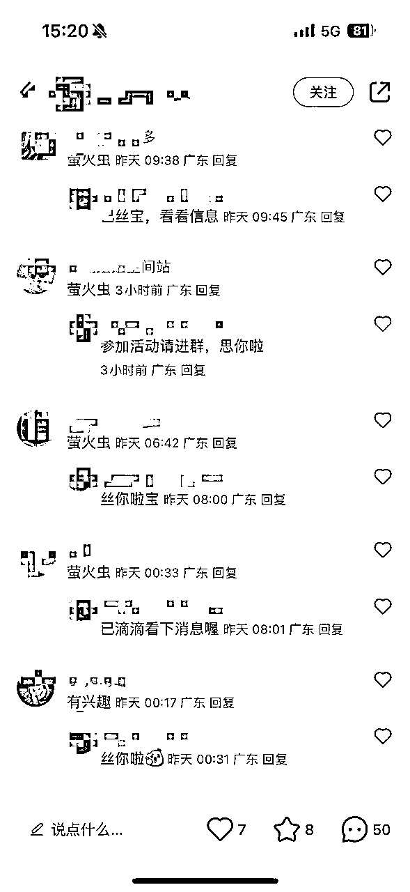

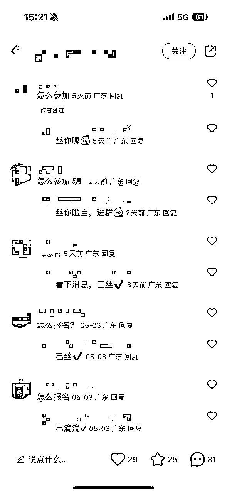

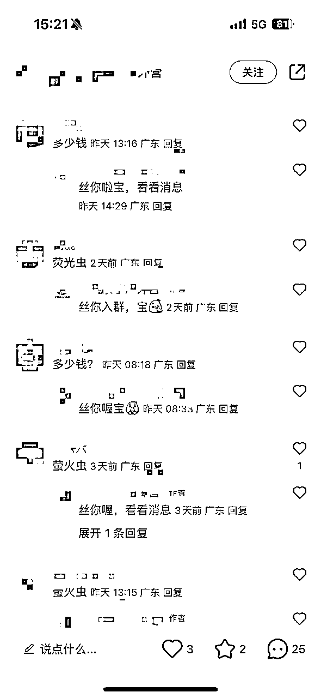

## 一、背景

结论先行，我们闭环路径就是：

小红书发图文笔记——矩阵多号发布——引流进群聊——再用小号在群里发微信号（引流&钩子）——微信承接私聊——直接发快团团报名链接——报名成功

背景：

团队教学老师，本身前几年就开培训机构，专门做线下研学，PBL&STEAM类型的教学，加盟过系统体系课程，也自己研发课程。属于传统的获客方式，通过派发传单或开设门店，等客资流量进店。后期越做越乏力，索性关店。保留一些忠实客资在群，形成复购的小生意，收入是有的，但这么做做不大。

后面发现小红书拥有种草基因的平台，而且现在很多家长周末也苦恼怎么带娃。搜了下小红书同城亲子研学相关的流量，发现非常爆，所以就想试试看看，能不能把这个赛道给跑通。

## 二、走了点弯路

基于上述背景，我们想着是在不改变原先教学老师的节奏下，拓宽一个渠道来获客。比如周六日他本身就要在原先的群里接龙发车“博物馆”、“夜观昆虫”、“温室植物”等主题活动，我们做到流量扩充作用。

但我们发布小红书笔记后，发现流量低的可怜。

主要分析：

1.  对标账号没做这方面选题，而这些关键词的搜索量也低

1.  市场可能并不需要这类活动，这类活动不受欢迎

1.  爆款应该是重复的，如果流量没有”可复制性“，那么意味着不好”起号“

所以我们就换了个思路，还是要按照小红书的方法论来起号，会更加合适。

之前更多是产品思维，现在要先解决流量，还是得用回流量思维——如何快速在小红书起号。

小红书起号的方式“”

找对标——模仿对标的（模板、选题），然后再组合拼凑成自己的模板。

※而如何“找”模板和如何“模仿”模板，就是成功起号的最重要因素。

## 二、如何找对标模板&模仿像素级模板？

### 如何找对标模板：

1.  搜索栏输入关键词，操作多次后系统就会推荐最热的帖子给你

1.  在小红书首页栏看推荐页，一般看2页，一页四个格子，能上推荐页的都是被系统默认推荐的

1.  在笔记最后面看话题栏，点击话题栏搜索相关笔记内容，一般第一步你做好，后面话题栏点开都是你想要的笔记。

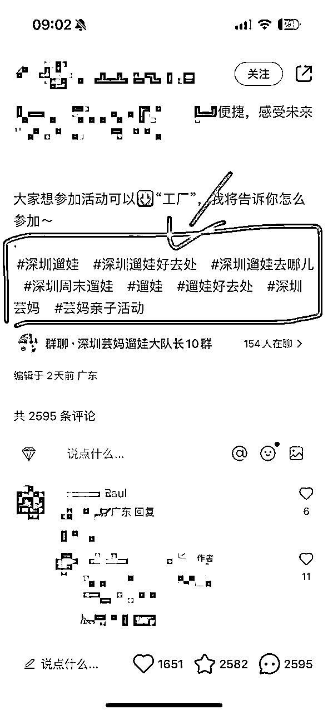

### 对标模板的标准：

1、时间越接近越好，3天内，当然如果你找到24小时内就更好。

2、笔记帖子评论区是”怎么报名“，”怎么参加“这类帖子转换率很高

3、内容作图简单，用美图秀秀随机拼一些宫格就可以的

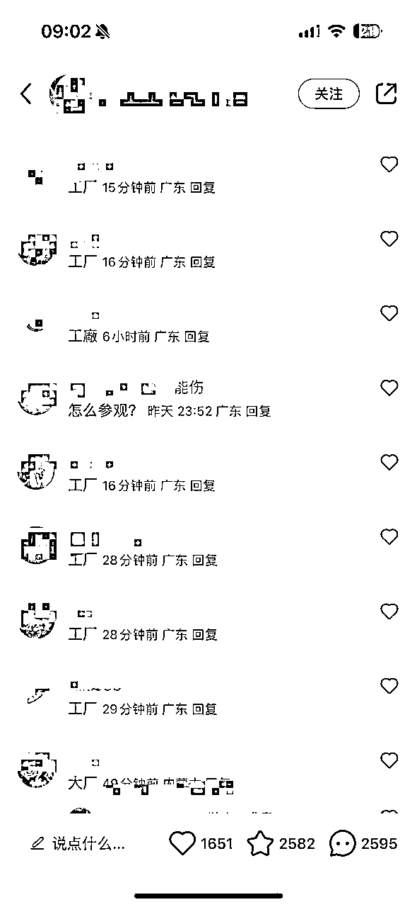

### 模仿像素级模板：

1、可以找2~4篇爆款笔记，分别提取他们的爆款元素：排版风格、图片标题、正文标题、图片素材、正文写作风格。

2、进行组合，A笔记提取排版风格+B笔记提取图片标题+C笔记提取正文标题+D笔记提取图片素材....以此类推。如果你会写文案和有经验，就不需要这么多排列组合，一般组合2个就差不多

3、正文部分，用kimi进行仿写，并让他写出小红书风格。官网链接：https://kimi.moonshot.cn/，后续稍微修改就可以发正文。

4、千万不要一模一样去抄，这样就会违规抄袭。而是要提取每个笔记的爆款要素，组合起来，就不存在系统提示抄袭搬运。

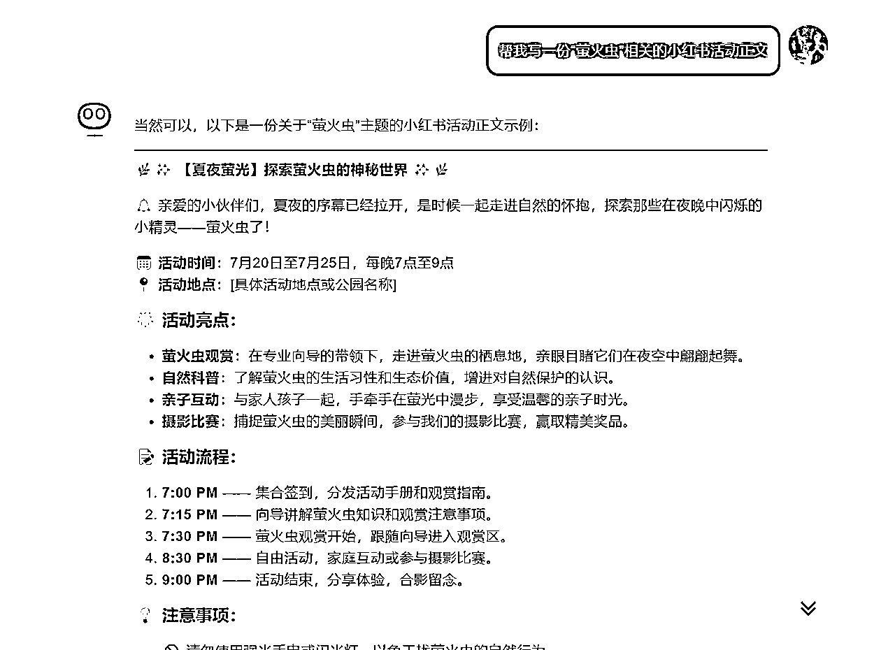

kimi也可以用组合技能，提问不同的方式，得到的答案再综合下，又是一篇新的笔记，比如：

*   ”萤火虫活动对亲子游玩有什么好处？“

*   ”为什么亲子要玩萤火虫活动？“

*   ”亲子萤火虫活动有什么亮点？“

*   ”萤火虫活动适合什么人群游玩“

反正不断去提问，把这些答案综合下，插入到写作框架里面，就是一篇新的正文内容了。

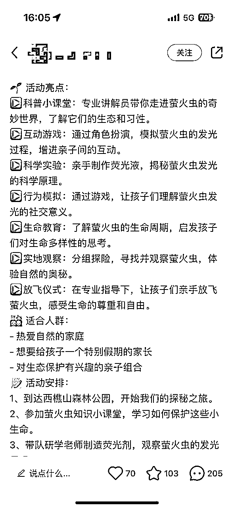

## 三、霸屏矩阵关键词

通过以上的步骤，我们可以做到“霸屏关键词”。

就是用户在搜索相关活动的时候，我们的排名是靠前的。虽然每个手机搜出来的展示界面会有所不一样，但我们试过多台手机去搜相关关键词，一个界面4个宫格，我们就占3~4个笔记都是我们的，往下拉，也会看到我们其他账号的笔记。

就好比如你是用户/消费者，你想去小红书搜相关活动，你也会货比三家，你加几个好友问问，结果你加来加去，其实背后的团队都是我们，你自然就会在我们这边下单。

这个策略也有运营相关专业的名字：关键词霸屏、蓝海关键词。

我们转换率也很高，可以看到我们的笔记，都是用户主动去搜。搜出来的意味着他们是带”需求动机“，而不是无聊在小红书上刷到的（兴趣动机），兴趣动机只是感兴趣，搜索出来的流量加到微信，我们直接问几句甩报名方式，就直接报名了。

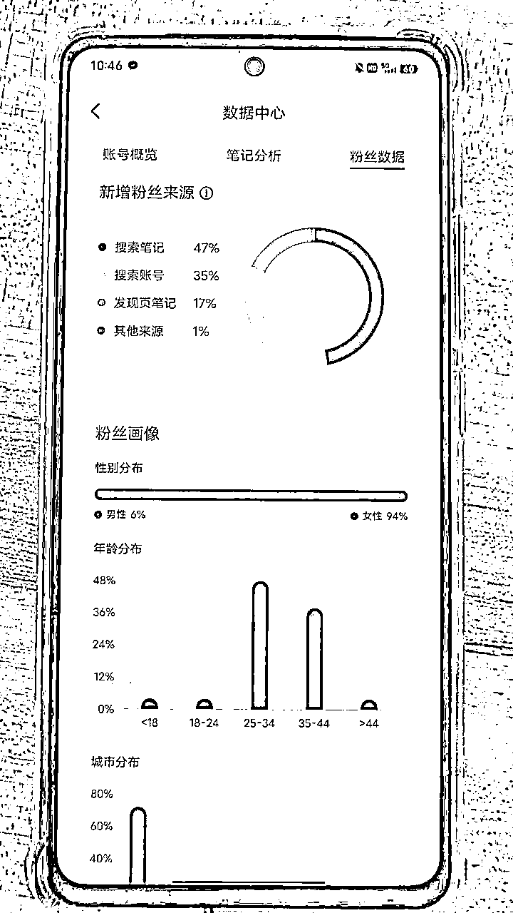

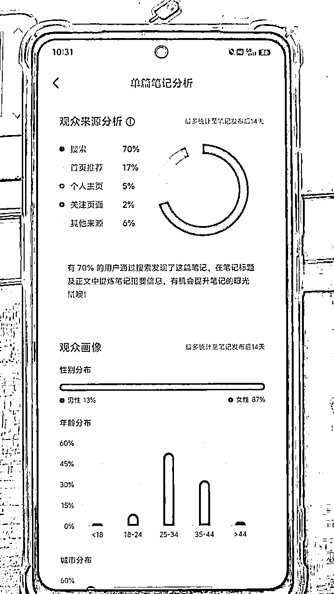

后面我们也可以做到多个话题栏的推荐，就是点击话题，4个笔记我们我们至少2个也是上榜的，意味着权重很高。因为我们做本地流量，小红书标签尽量就去打本地相关的话题标签，这样来的流量就是同城的。

## 四、前期的准备工作

企业号我们也有试，一个开口可以跑到14左右，价格其实还行，但企业号带来的转换率反而没那么稳定，可能就和上述说过的，企业号的放量更多是曝光量，这种属于”兴趣动机“。最近也还在磨这个，所以先个人号为主，布局更多的关键词。个人号还是有一些操作细节的，这里讲一下：

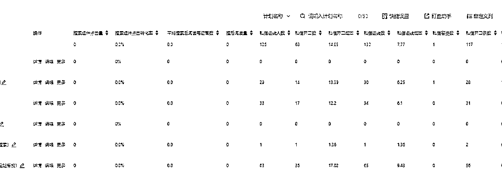

1、一机一卡一号。

老生常谈了。不要问能不能一机两卡，能不能多个wifi链等问题，因为我没都没去试其他的，这种小事前期准备工作很简单，就不用刻意去试其他动作，我们只总结有效果的动作，大家就按照这个要求来做就最好了。

2、先刷3天，模拟人工操作。

虽然有些攻略说不用养，但我们还是坚持养了，因为有做数据对比，的确养过的号更好。特别是一些很早之前注册过，放一边的号，养号周期更久，权重就更高。

3、开始不需要发干货攻略等，直接发引流帖的对标模版即可。

这样的流量来的更精准，更加快。因为引流模板评论区的回复就会能算法的提升。小红书CES评分=点赞数×1分+收藏数×1分+评论数×4分+转发数×4分+关注数×8分，你的笔记评论数越多，你的权重就越高，自然你的曝光就越多。

4、引流方式有很多，个人号最稳定的引流方式就是建群聊。

4.1笔记热度爆起来，就直接群聊绑定笔记，并在“评论区置顶”群邀请码。

4.2群聊建后，用小号在“群公告欢迎语”留下微信的方式，微信号注意不要超过8位，不要搞太复杂。

微信号这边的准备工作：

1、微信养号，平时上下班坐车，买早餐等，都去刷，然后每天去“腾讯公益”捐款

2、新号（一周）内不要接超过5~20人。

3、用快团团去承接，用户加到微信之后，直接问怎么买。后续我们复购群，也是通过快团团直接群里接龙。

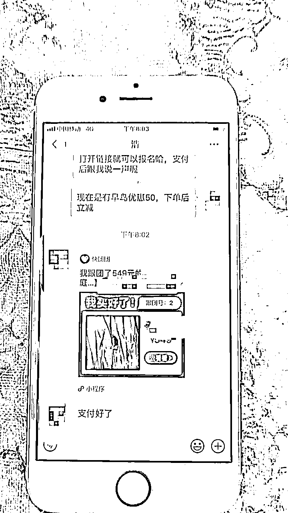

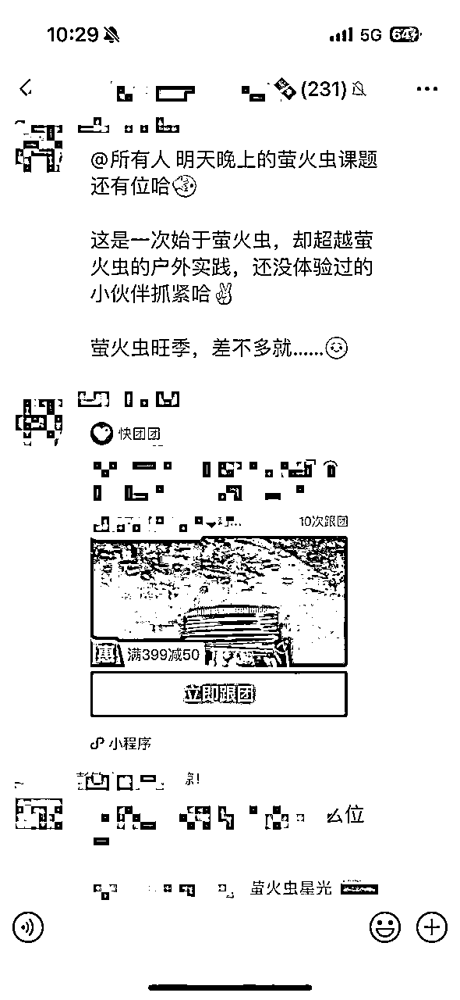

后面我们快团团还上了首页栏，也有用户直接通过快团团平台下单，非小红书渠道进入。这里的量较小，但也延伸出新的思考：快团团的下单更像是电商平台直接付款，后期也会往这个方向去研究。

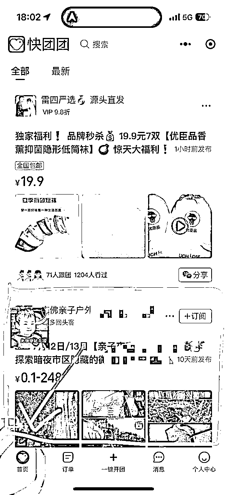

## 五、两个转折点：

其实一开始我们做得也并不顺利，也摸索了一段时间不出成绩。有两段转折点，我认为非常重要，复盘一下。

### 第一个转折点：

当时我们找到了这款对标笔记：

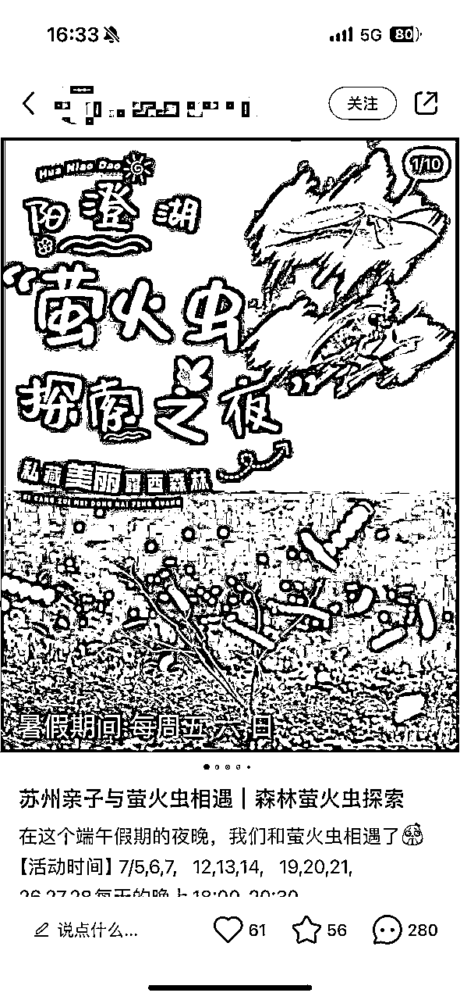

当时没截图，现在翻看，这篇笔记已经进行二次编辑了，没办法看原来的正文。不过当时我们想提取的元素还是在，有一定的规律。

1.  当时这篇笔记评论区很多人问怎么参加，怎么咨询之类的，

1.  发现这篇笔记是48小时内发布的

1.  笔记封面直接写活动时间

1.  直接告诉别人，是来参加活动的，不是来科普萤火虫有什么好玩的，所以评论区都是直接会问答”怎么参加“。

我们就提取这几个关键要素，自己做了一份和它差不多的笔记:

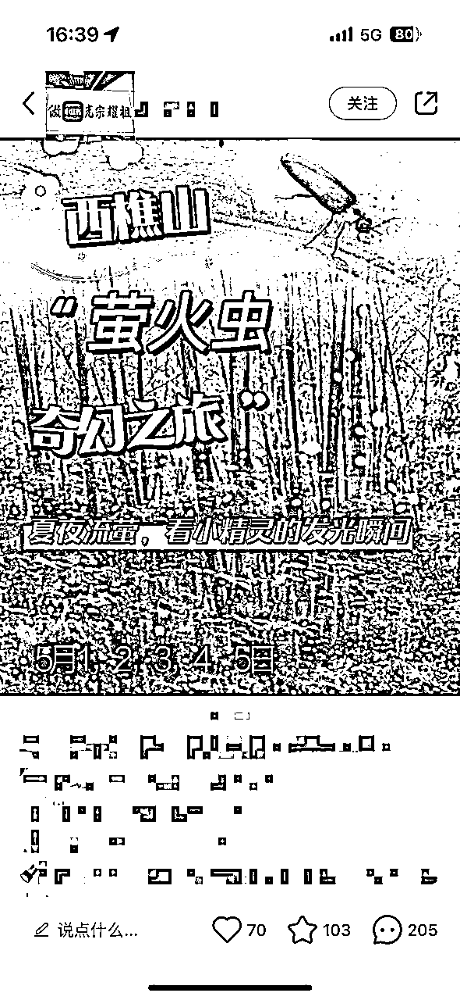

从封面上看，我和大家说明下对比：

（左边是对标笔记——右边是自己的笔记）

*   ”阳澄湖“——西樵山 （地点）

*   ”萤火虫“——萤火虫 （活动名字）

*   ”探索之夜“——奇妙之旅 （修饰词，用kimi编一段近义词）

*   ”私藏美丽露西森林“—— 夏夜流萤，看小精灵的发光瞬间（模仿其他笔记或kimi仿写）

*   ”活动时间”在左下角——活动时间在左下角

所以你看，对标笔记写什么，我们就跟着写什么。

*   它的图层是两宫格拼凑，我们也是两宫格拼凑；

*   它上面是萤火虫，我们也是萤火虫；

*   它下面是发光的森林，我们也是发光的森林。

这才叫做像素级模仿，这才叫做有效的对标模仿。

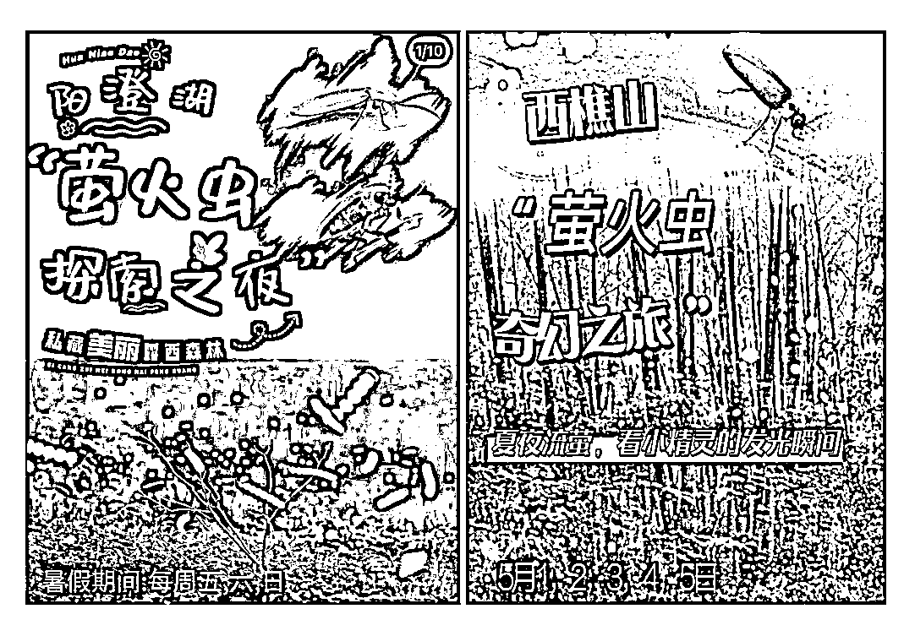

后面的结果就是，发完马上就有人咨询，笔记热度越来越高。我们就把这个模板套路继续发到其他号上，也一样有热度，就可以矩阵复制，新号老号都可以。

的确，我们不是最早的模板，但我们肯定是最多的模板，毕竟矩阵思维的玩法，不是人人都会，用互联网思维真的吊打传统机构。我们就不断写这个关键词，不断去蹭热度，做到关键词霸屏。

要记住“爆款是可以重复的，重复的爆款是可以不断地重复爆的”。

### 第二个转折点：

流量我们是不愁了，找到了可复制的模板和规律。但我们目前的研学老师就一个，一个人精力有限，再怎么开班，这个数据都是可以算的出来的。所以我们就想着，能不能跟研学社进行合作，我们负责流量，有专门成熟的后端团队，这样各司其职。

很快，我们就迎来了小旺季，端午节划龙舟。一开始谈判是不顺利的，毕竟我们这种属于“草台班子”，我们也无法保证给多少量，就先打算尝试下。

就是因为这个小小尝试，我们发现，这条路是行得通的。如果要自己再去搭后端的产品和老师，我们属于初创，其实是不好请老师的，而且准备功夫要花很多，不是说简单招个老师这么容易。

合作，把这个市场做大，最简单。

再根据对这个市场的调研，很多成熟的机构，是想让家长在这里产生多次的研学消费，而不是只报名一次。甚至有些机构第一次可以不赚钱，把价格压得超低。而这类活动的好处是，只要你后端是靠谱的，后期再复购的概率是很高的，家长每周六日也烦恼着应该带孩子去哪里玩。

我们调研市面上有很多不一样的主题：参观大众汽车、参观牛奶店、摘草莓、特斯拉博物馆、探秘航天宇航员、星巴克小咖啡师等等。

所以成熟的机构，其实背后是很多主题的，而这些主题，大概率也是不同渠道之间的合作。

而我们目前团队的好处是什么呢？找到可复制的模板+矩阵思维去打，很快，我们就把龙舟这个活动给做起来了，甚至做到了古村团队加班加点。古村的其他渠道，所有加起来都没我们那么多，工作人员非常欢迎我们，都在说忙着数钱呢！

但其实，我们就一个运营负责引流。正如最近一直流传的那句话:世界就是草台班子。我们也觉得非常惊讶，流量可以来这么多，激活了一整条度假村。

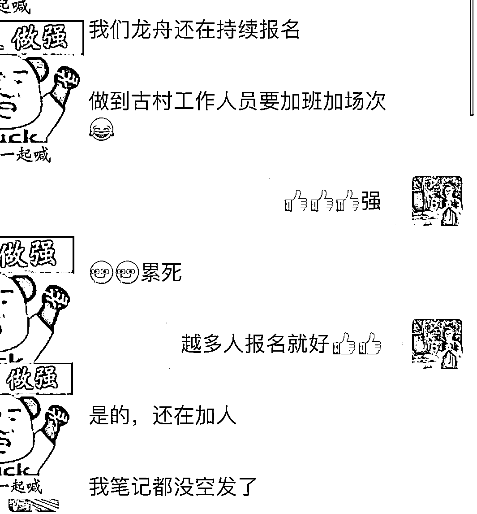

也是因为这个决策，我们的流量是“有效流量”，什么意思呢？

之前我们做其他活动，因为老师不够，加上为了服务体验，我们一个班是限制人数的，所有很多人是报名不了。而这次不一样，我们小红书上的主题就是划龙舟，来咨询就加微信，加微信就成交，安排的档期随时直接发车，成交的黄金法则72小时，来了就可以直接发车！

也是通过这两个转折点，我们收入可以达到8~12w/月，算是跑通了百万项目的盘子了。1个运营+1个老师，目前准备放大，知道还会遇到其他困难，也希望有好的点子圈友可以多多交流。接下来就是暑假档，我们相信会再持续一波小红利，把业务往上推~

## 六：项目风险与困难

看完我上面的分享，是不是觉得很“上头”？其实任何项目都不可能一帆风顺的，我说一下这个项目的一些风险和困难。

1、如果你的产品并非是主流热门的，你的笔记可能就是没热度的。

这个是我们最早踩过的坑。我们想延续之前本身成熟的课程去做，包括后面研发新课程，“本以为”这样的活动对学生更好玩，但市场不接受，发帖子就是没流量。所以前期，我认为要以“流量思维”来做这件事会更好，而不是“产品思维”。

2、研学产品很多属于季节性，流量会有所波动。在热点季节做内容曝光，流量会很大，比如5~6月的萤火虫，端午节，父亲节、母亲节等等呢个这些选题，但过后就要重新再换个包装或换课程内容，对团队的课程组合能力要求会大。

3、你的竞争力来自于后端的产品整合，但如果产品都属于外包的情况下，服务/课程质量，会影响到你本身品牌的口碑性。如果用自己的研发的课程，就会面临刚刚“1”所说的问题，如果按照流量来做课，就要尽快，因为“2”说过，会有季节性。这两关你都解决的情况下，你再和那些本身有很多课程内容的机构再去竞争

4、目前市面上单节课收费的标准在150~250，而我们走高端一点，卖250~400，卖的还可以。这个市场很多机构第一次是不赚钱，甚至亏钱都有可能，就是为了第一次消费后产生信任感，后面有更多课程组合的推荐，再复购。但前期小团队，更建议先赚钱，因为我们定位后面是走自己的课程，走中高端路线的。

5、虽然起号率挺高，但也容易违规废号。不过没关系，废了重新起，多搞起来，所以不要怕废号，要有这样的心态意识。

6、研学项目基本都是户外为主，如果遇到下雨天气，基本就要延期或退款，算账的时候不能算全部档期都满额。

## 总结&感谢：

为什么分享这篇出来，前面说过，一方面是越分享越幸运，分享就能引到志同道合的人，交流后我们的模式会再次突破（我发现我每次突破原先的局面模式，都是不断和别人交流产生新的点子）。另外一方面，因为这个类目更多是同城流量，不存在内卷竞争，我认为大家做好自己的城市，吃住这方面的流量，做好产品和服务，这个类目的复购是非常大的，当你手握好几台手机的私域价值时，外部环境再怎么变化，都不影响你的收入。

而且这类家长人群，雪球（需求）是越滚越大的，手握这方面的流量，真的是可以兴风作浪了！

好拉，再次感谢生财有术这个平台，太幸运遇见啦~沉浸了一段时间，还是要多分享，多走出来，越分享越幸运！！！我们这个盘子还属于野蛮生长中，如果有正在做的朋友，也欢迎随时交流，我们还是有很多优化空间和不成熟的操作，希望能互相分享玩法技巧，与时间做朋友，与同行做朋友，一起做大做强，加油加油~

————

之前写过关于小红书的帖子，我放出来，方便大家翻看:

*   小红书日引流200+，简单粗暴！从博主玩法迭代矩阵玩法2.0版

*   零投放从0开始，小红书2个月8万粉丝的实操经验分享

(点击标题可直接跳转）