# 灰豚数据小红书使用教程及玩法

> 来源：[https://u604y5x4sg.feishu.cn/docx/Cdfedd59hoceCJxKIpDcKTOanqb](https://u604y5x4sg.feishu.cn/docx/Cdfedd59hoceCJxKIpDcKTOanqb)

你好，我是哆元，希望能像哆啦A梦的异次元百宝袋一样，总能给你惊喜！

做自媒体的朋友应该都知道有这些数据平台，比如蝉妈妈、新红、千瓜，灰豚。

我是一直在用灰豚这个平台的，很好用，也有知名度，不是什么三流平台，但是发现很多朋友是没有利用好这个工具的。

圈里也没有相关的教程，那哆元就码一个使用玩法教程。

## 1.使用教程

这里首推电脑版使用，电脑打开灰豚数据官网 https://xhs.huitun.com 进入红薯版，为了方便演示，这里我是领取了15天的个人版会员，圈友可以找我dybbd8免费领取，因为我和灰豚有合作。

这里我们主要讲几个功能

### 达人查找

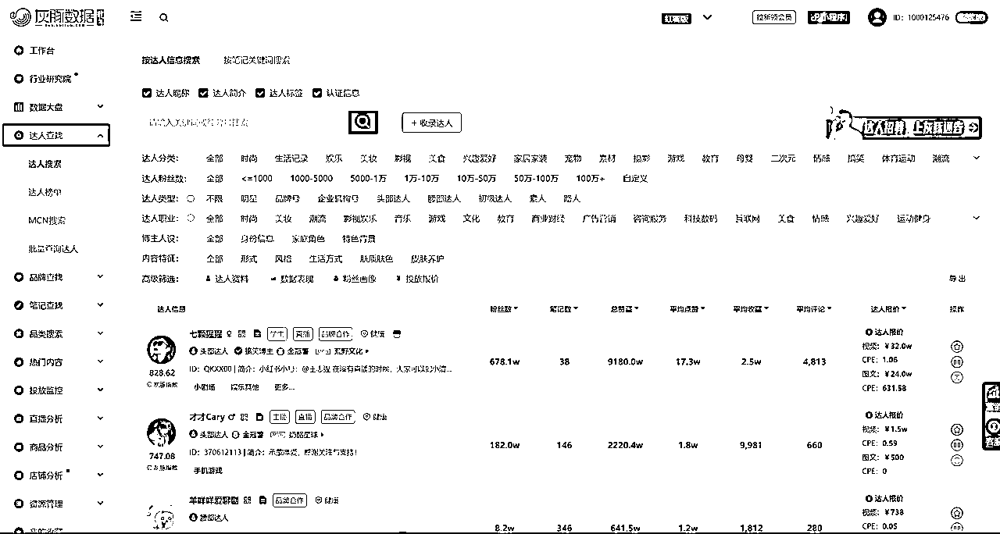

这个功能可以查找想分析的达人，比如随便看一个账号

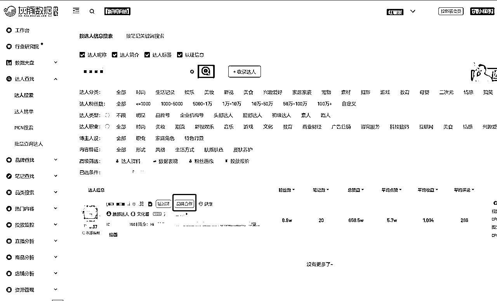

这里注意，我们最开始看到的数据，不一定就是实时的，他可能是前一天的或者早上的，所以粉丝数量以及其他的数据可能会有一点点出入，但是基本不影响。

我们可以看到有个“品牌合作”的标识，这是因为这个号入驻了蒲公英（这是小红书接广告平台）。

也可以看到是和哪个 MCN 公司合作的。

我们点进去

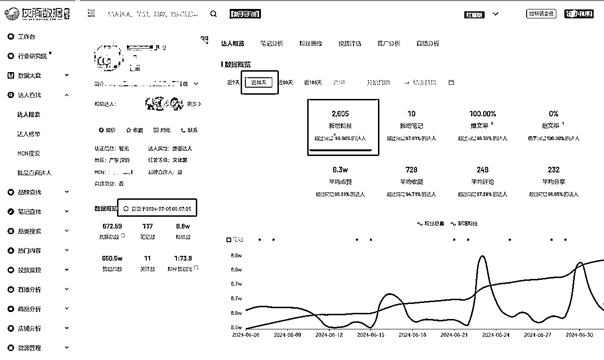

可以看到左边可以刷新最新数据，注意，灰豚会员等级不一样，刷新的次数也会不一样。

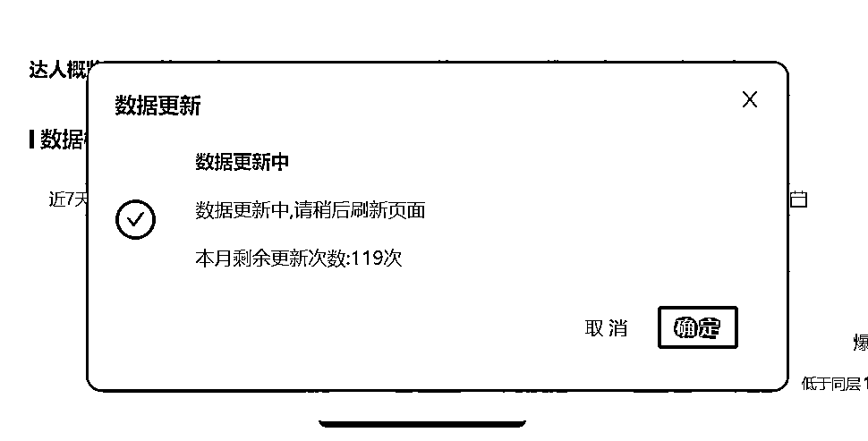

然后可以看多少天内的数据情况，可以看笔记分析、粉丝画像、投放评估等

这里我们看一下笔记分析

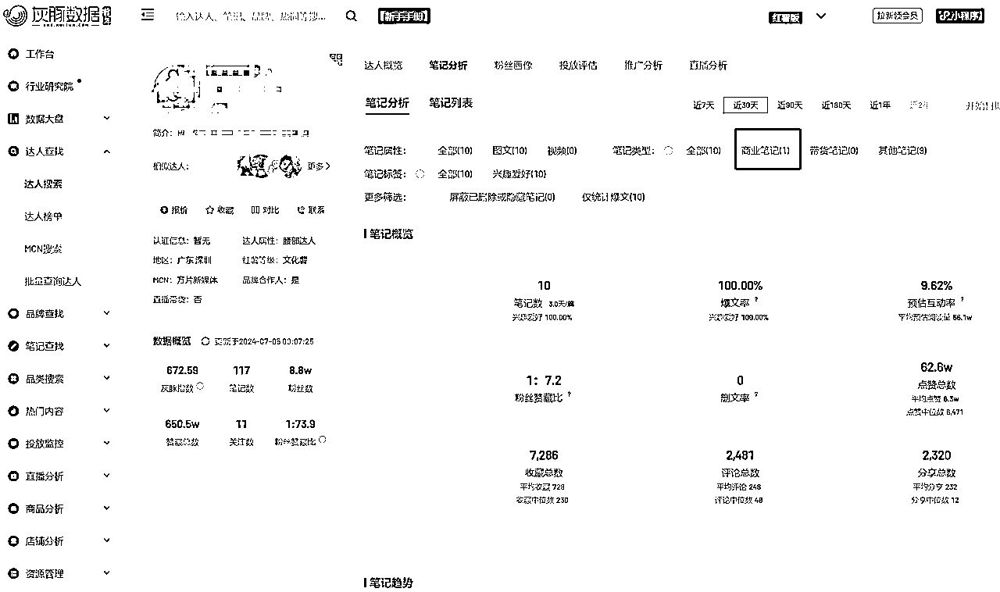

这里能看到博主接广情况，不过这一点，我们最好通过小红书平台去看笔记的内容，这样能够更准确看出笔记是否接广，因为有的广告是没有走蒲公英平台的。

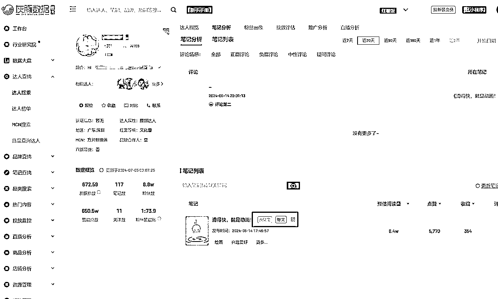

往下翻能看到接广品牌的数据。

我们来到达人榜单，这里可以看到涨粉榜、商业推广榜等

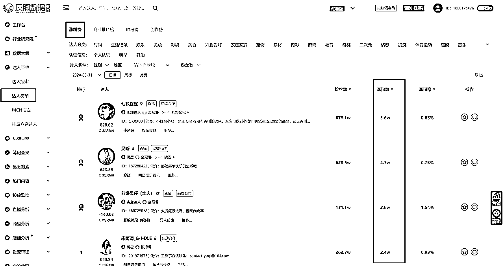

能够发现有哪些突然火爆的账号博主异常值。

### 笔记查找

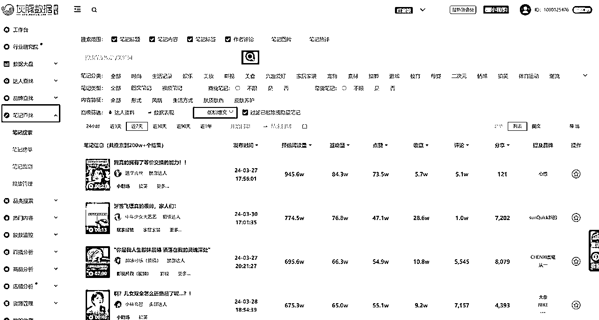

笔记查找是一个比较热门的功能，这里我们能点击低粉爆文，找到粉丝少但是出现爆款笔记的账号。

这个地方是找对标账号的方法。

并且你可以选择你自己的赛道后，点击达人资料和数据表现，去自定义筛选。

然后可以导出为表格去进一步分析。

### 热门内容

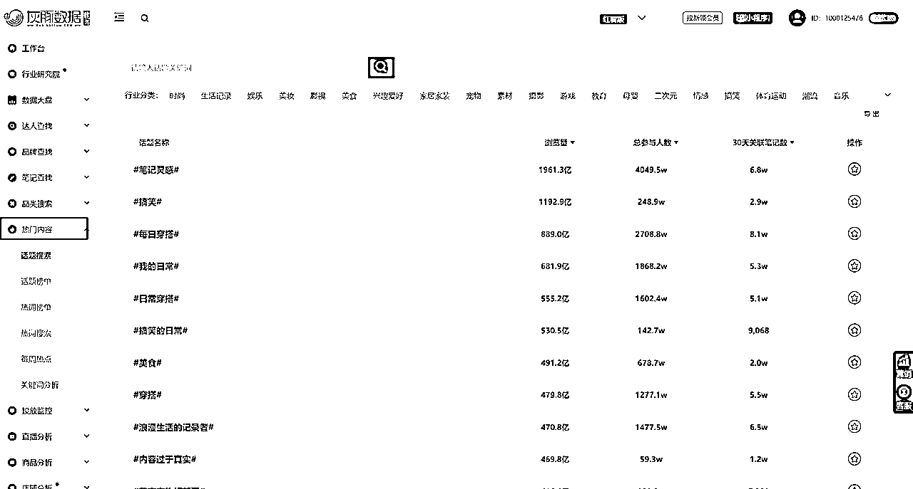

来到热门内容，这里是看到当下话题热门情况的

比如我们输入一个宠物

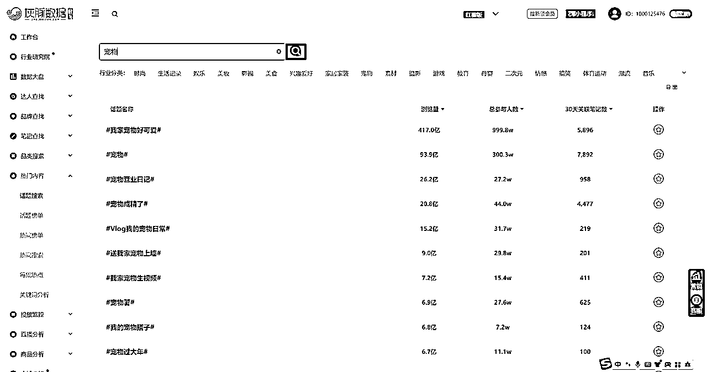

这些话题是比较热门的

那么我们在输出内容的时候，可以有意识的在笔记中添加前几个比较热门的关键词

然后热词榜单

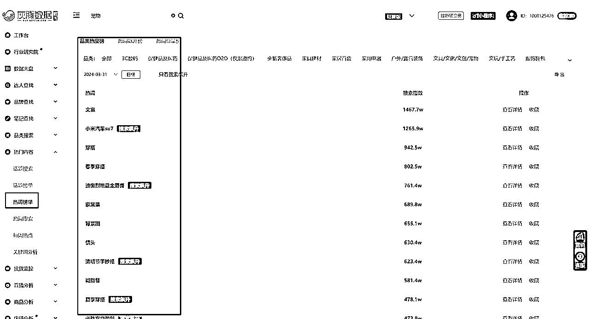

就能够知道当下哪些关键词是大家关注度比较高的，进而去蹭流量。

## 2.进阶玩法

那么我们用这个工具，能不能有其他玩法呢，这里哆元就来介绍两个玩法。

### 找行业起号互动笔记

前期起号，我们拿互动笔记是比较容易拉升账号权重的。

那么就需要找各行业的互动玩法。

你可以小红书平台搜索最热，但是有个缺点是，小红书不能筛选评论数量，那么搜索最热笔记，就会出现很多点赞收藏高而评论没有什么的笔记，这不是我们想要的。

互动笔记的评论肯定不低，所以利用灰豚数据的笔记搜索功能，搜索关键词，找近90天或者1年的低粉爆款。

比如装修的

我们输入装修，也可以直接在笔记分类找到装修，然后选择低粉爆款，选择近90天的，然后一定要调整评论为降序，这样就会按照评论数量最多的开始排序了

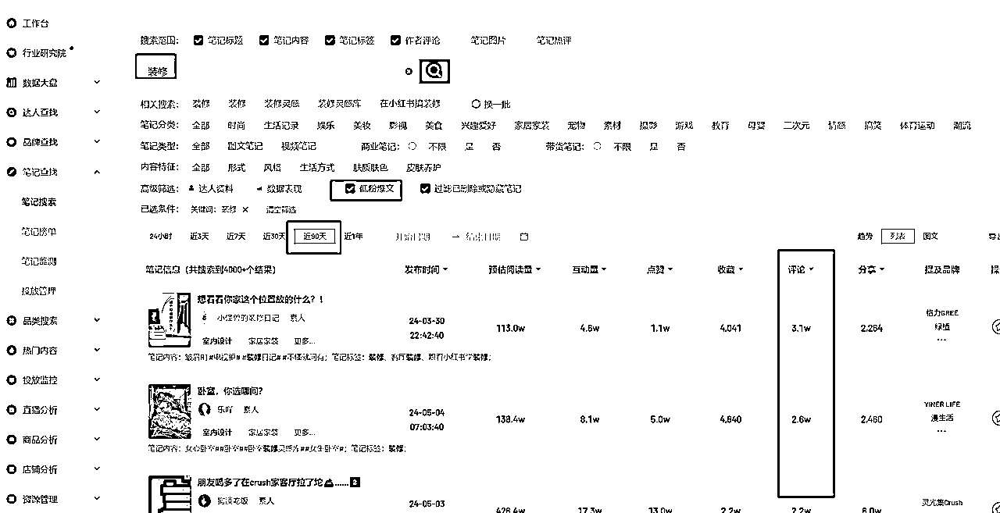

把视图调成列表，这样一眼就看得到封面情况。

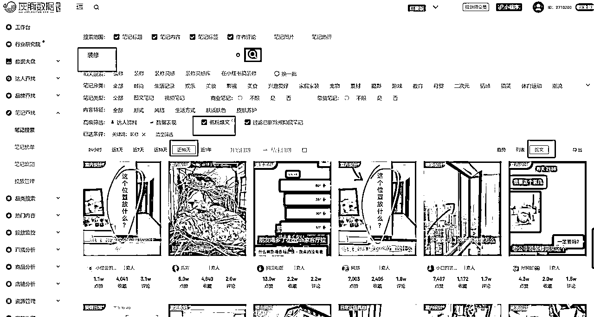

比如摄影的

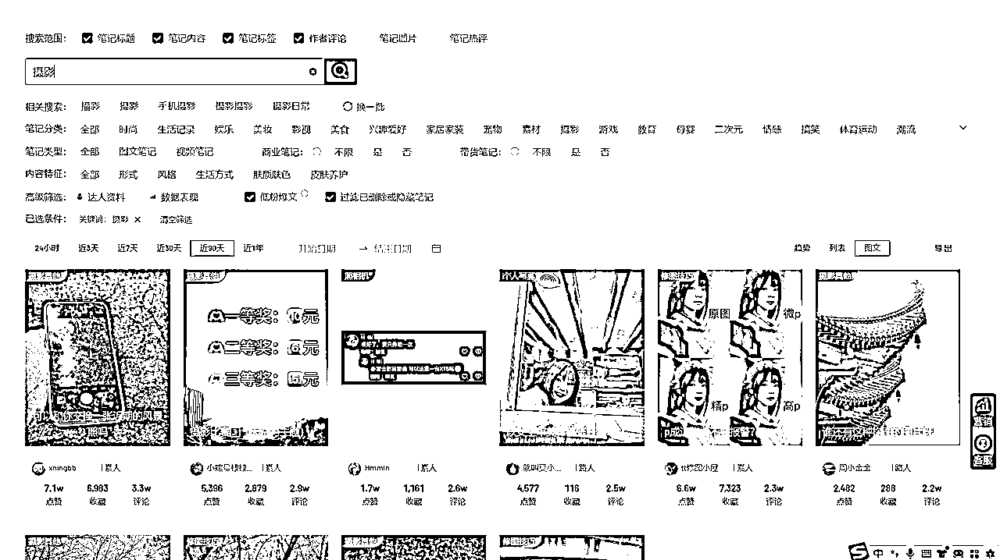

比如糕点

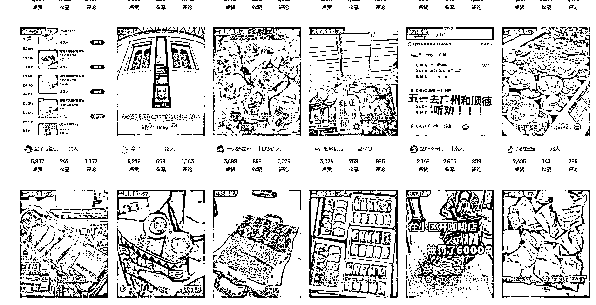

比如医美的

比如国学八字的

比如减肥的

等等，搜索你想要的关键词就好，如果数量不多，就把时间周期拉长。

### 实时低粉爆文榜单

找对标抄对标是我们前期要做的事情，那么抄的对标选择低粉的最好，粉丝高的参考意义不大，时间太长的也不参考，人家19年小红书那时候很容易涨粉的时候就在做了。

所以我们可以来到这个实时低粉爆文榜单来看一下自己领域的实时爆款，及时跟进。

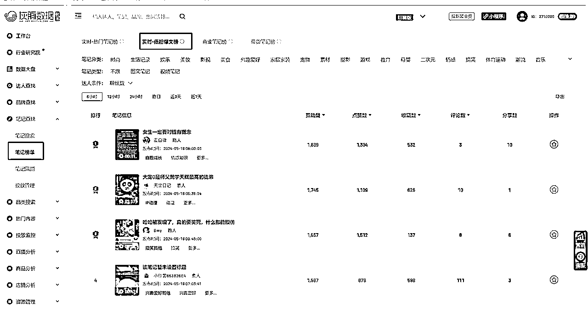

时间可以选6小时，但是数量会很少，就拉高时长。

同样你也可以在笔记搜索那里找低粉爆款。

## 3.总结功能

### 找对标

我们可以通过搜索达人，选择粉丝数量收集对标，我们也可以通过笔记低粉爆款收集对标

### 分析对标

我们可以分析一个账号的总体情况，他是否有接广告，接广告的笔记数量情况

### 找互动笔记

通过笔记搜索里找关键词的互动笔记，评论多的。

## 4.依托灰豚可以做的项目

### 小红书知识付费

通过灰豚数据的榜单，可以做“小红书昨天涨粉最快的3个人”或者“小红书上周涨粉最快的选题”等等。

然后引流私域卖课、看号、培训、ip孵化、陪跑、代运营等等

### 垂类博主知识付费

你也可以做某个领域的内容。

比如这三个赛道。

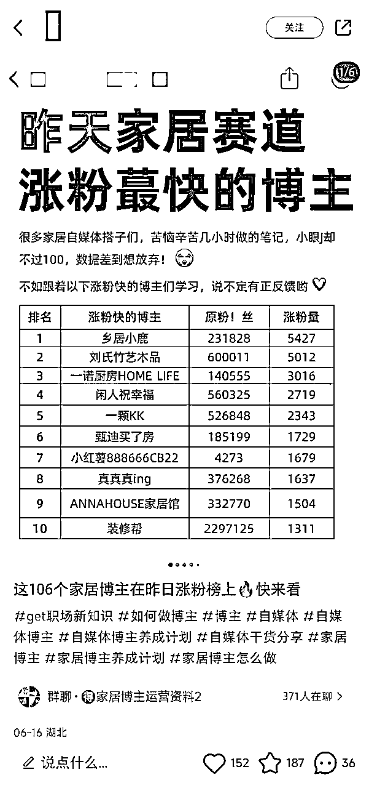

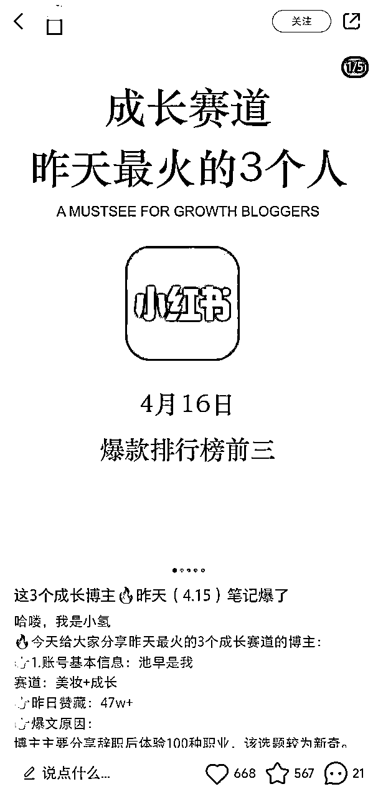

好啦，以上就是关于灰豚数据的相关常用功能和玩法，还有很多都可以开发，感兴趣的朋友可以去领取个15天会员多研究一下。不知道怎么领取就可以找我领取。

我是哆元，专注小红书运营、AI提示词、AI写小红书，可以交个朋友