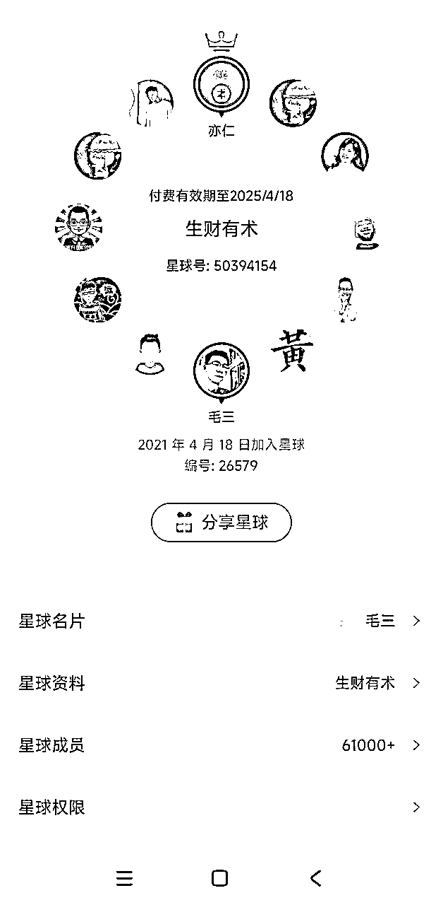
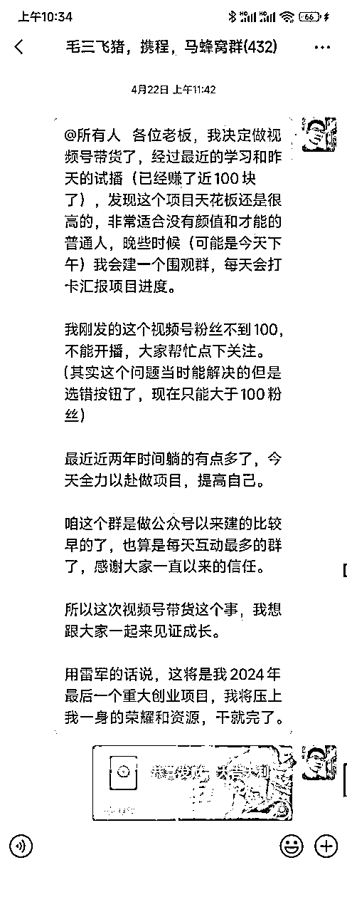
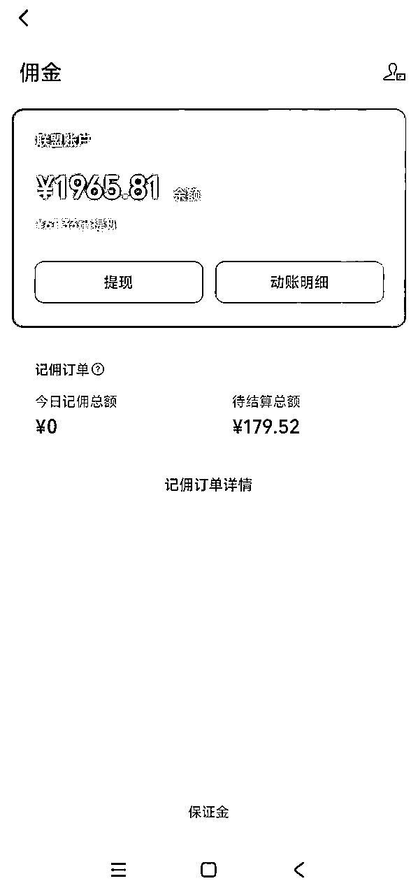
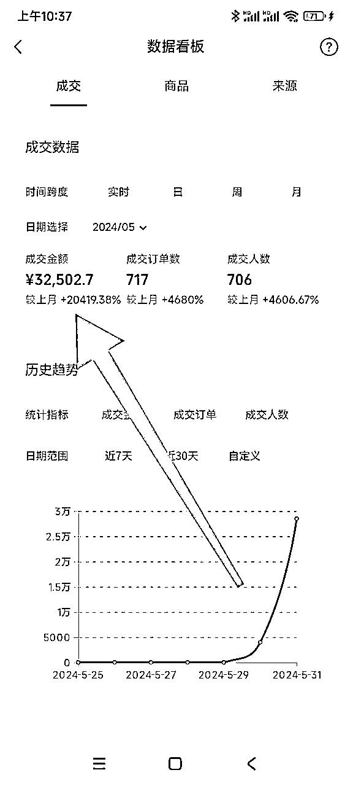
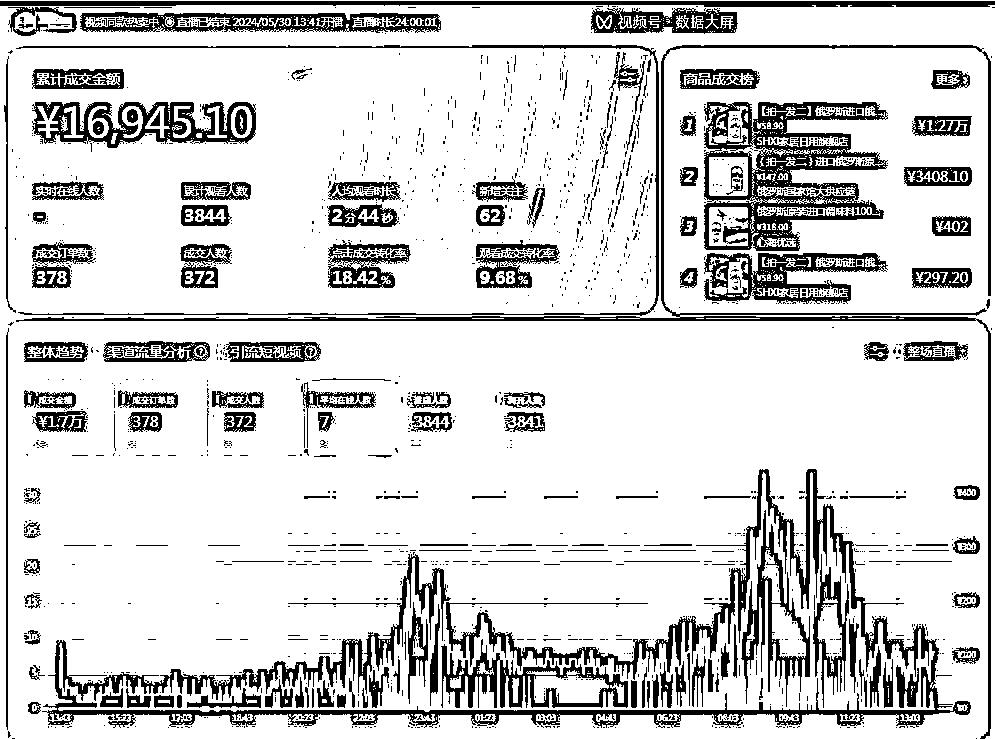
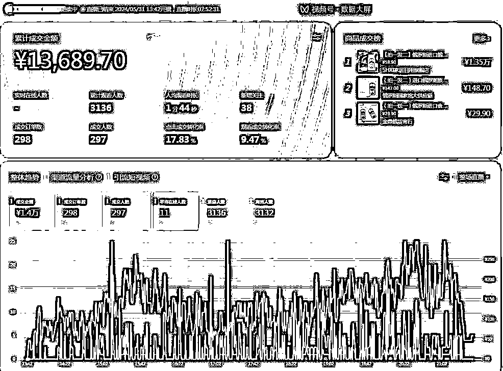
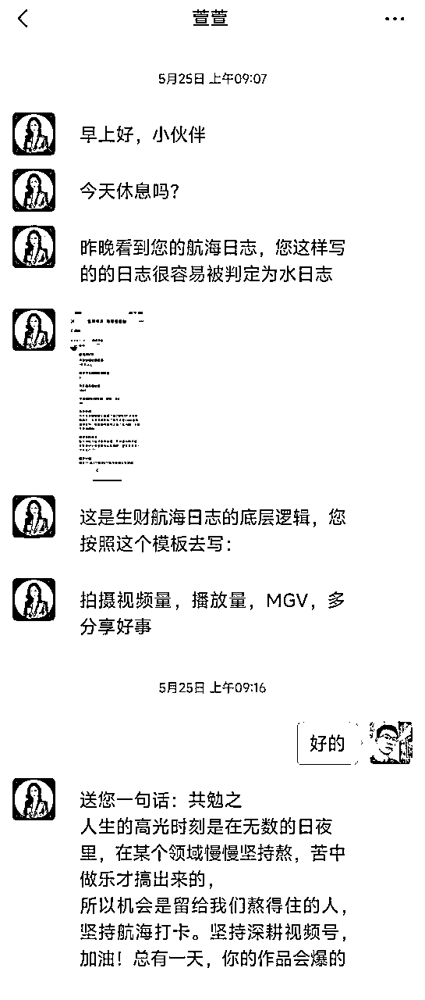

# 视频号口播带货航海日入过万总结

> 来源：[https://lkc94rsmcp.feishu.cn/docx/NX80dV4eloBqWpx9r6ucU3R8nfh](https://lkc94rsmcp.feishu.cn/docx/NX80dV4eloBqWpx9r6ucU3R8nfh)

# 

大家好，我是毛三，80后大叔，自由职业一枚。2021年4月18日经朋友介绍加入生财有术，已经三年多了。这三年里邀请了一些朋友加入生财，也参加了好多次的航海，基本每次都能拿到不错的结果。印象最深的还是自己参加的第一期航海，@花爷组织的自媒体IP航海。通过那次航海我迈出了收钱的第一步，成立的自己的付费社群，为后来的自由职业打下了结实的基础，如果没有那次的航海我肯定还在苦逼的给老板卖命。生财谈钱不伤感情的社群，名副其实！

其实视频号带货项目今年初，陆续就在关注中，也看了不少生财关于视频号带货的帖子，自己摸索着，同时也下定决心2024年一定要在视频号带货项目中分得一杯羹。

4月22日在自己的几个社群立下flag 2024年大干视频号带货。

机缘巧合5月生财刚好出了视频号带货长航海，赶紧第一批报名参加。经过一期的航海，总GMV35000+，总佣金15000+，航海结束到目前为止还在继续操作视频号带货项目，目前总佣金23000多。国际惯例先晒图再分享。

这是当时缺货，走线上结算的一小部分佣金，绝大多数佣金都是线下结算的。

最爆的一条视频，一天半的GMV

生财有术的航海是普通人能接触到的，交付最好的训练营，没有之一。不管从哪个维度都是，航海手册、百问百答、直播答疑、高手领航，志愿者、教练等等。

由于航海开始前做了准备，视频号实名认证和100粉丝都完成了，航海开始就迫不及待开始按照航海手册操作了。每天拍视频、剪视频、发视频，连续十几天时间0变现，当时真的快坚持不下去了，但是航海已经开始超过一周了，999的押金也退不了，只能硬着头皮继续干。

终于在5月30日下午有个视频有了大量播放，自己人还在外边玩没有直播条件，只能联系代播，下午1点30开始直播，直播两个小时一单没出，由于我人在外边玩没电脑用手机剪辑了3个视频，找个网吧传了上去，补的视频和爆的那条视频都有流量，但是一直还是不出单，一直到晚上7点才出了两单，连代播的工资都不够，群里有人说这样播下去赔钱，我也想着下播算了，但是视频的播放量和点赞一直在不停地涨，疯狂拍视频、剪视频不就是为了卖货吗？有点不舍得下播，就这样一直坚持着播。

晚上10点后慢慢的直播间开始进人了GMV突破了1000，就有点信心了终于不赔钱了，安排代播继续直播，我自己剪视频，补视频，盯着数据。由于代播半夜换播的时候还得我来操作，所以基本一夜没睡，到31号早上10点的时候GMV到了11000，继续直播，信心十足了。视频流量很好，直播间进人也可以，也就没在补视频了。一直播到31号下午1点40刚好24小时，系统强制下播了，24小时GMV如下图，加上橱窗客户自己点击购买的，17000多的GMV。

系统断播后马上开播，因为流量很好不想耽误一分钟时间，继续直播，后面就比较顺了，也不太兴奋了，平常心对待，一直播到晚上9点多，账号提示视频违规限流7天，然后就及时下播了。其实提示违规后应该继续播，因为视频已经有大量用户转发点赞，还有点尾巴流量在进，估计还能卖一些，到此总GMV32000+

通过此次航海毛三在这里就不分享视频号带货技术部分了，不管是生财帖子还是航海手册已经有非常多非常好的分享了，再次感谢各位前辈。我主要说下我这次航海的心态，希望能给你以后做项目带来一些帮助。

上面说了我自己立下flag 今年一定要干视频号，才报的航海，但是经过近半个月的实际操作没有出任何成绩的我差点放弃了，还好志愿者@萱萱 把我从悬崖边拉了回来，才有了5月30、31的视频大爆热卖32000多。在此非常感谢认真负责的志愿者，航海期间沟通非常多，我只截图一张。

5月25日志愿者萱萱从打卡日志发现我没有用心做，给我发了上面一段话（她真的非常有心，每个人的日志她都会认真看）。

我以前也做过不少的项目，大多也都拿到了结果，这里我提下视频号带货带给我的挫败感在哪里，是什么让我快坚持不下去的。就是你辛苦熬夜拍摄，剪辑的视频发上去不但不赚钱反而还会发生账号限流7天，如果几个账号都是选择一样的文案可能都会限流，后来看航海手册才知道是选择的文案太过于激进。

我思考了很多，既然已经下定决心2024年大干视频号了，航海这么好的学习机会，几百人一起的实操机会，为啥不再坚持下。今天很残酷，明天更残酷，后天很美好。不是要给大家打鸡血，我当时就是这样安慰和说服自己的。

我发了社群，发了朋友圈立下了誓言，吹下了牛逼，如果自己就这样放弃了当别人再问起视频号的事情我将如何解答。再一个视频的拍摄和剪辑基本都是在家里边完成了，为此买了拍摄支架，灯光，各种服饰道具还花钱开了剪映会员。几个账号的粉丝不够100也是花钱解决的。

我女儿11岁了，她每天能看到我在家里忙视频号带货的这些事情。我也希望给她做个榜样，当她有些事情坚持不下去的时候我能够有资格去开导她。

最后我想说的是，做一个项目大多数人不可能从头到尾一直处于亢奋状态，当状态不好的时候适当的调整下，苟一下，但是不要下牌桌。拿志愿者@萱萱 送我的话做为结尾，人生的高光时刻是在无数的日夜里，在某个领域慢慢坚持熬，苦中做乐才搞出来的，所以机会是留给我们熬得住的人。