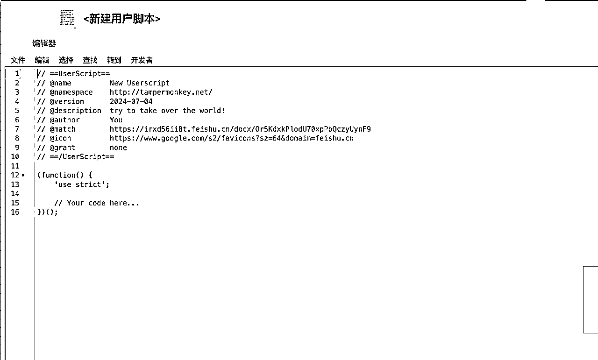
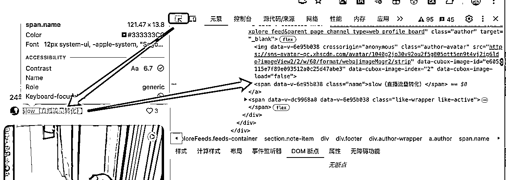

# 分享6月小红书航海期间手搓的一些实用小工具

> 来源：[https://irxd56ii8t.feishu.cn/docx/Or5KdxkPlodU70xpPbQczyUynF9](https://irxd56ii8t.feishu.cn/docx/Or5KdxkPlodU70xpPbQczyUynF9)

大家好啊~我是香君。是今年刚加入生财的圈友。

当然这一次五月的航海是我第一次的航海，这一次虽然跑通了闭环，但是没有拿到大结果有点遗憾。不过凡事要从多个角度去看，这一次虽然结果在我看来有一点点小。但是过程中，也拓展了思路，围绕航海手册，设计了几个比较实用的小工具，尤其是mac用户有福了（我就是mac端用户，教练分享的那些小工具大多是针对win端的，没有办法，mac用户只能自己边跑流程边手搓了）。好啦，话不多说，我现在就开始给大家做分享啦~

写在前面

本次分享主要是给大家分享以下我的思路，以及提供相对应的代码。所有代码都需要有pyhton环境才可以跑通，不知道怎么安装python和相关的集成开发环境的圈友，可以参考5月的AI编程航海的手册，里面有非常详细的安装流程

# 一、思路和想法

说实话，这是我第一次接触电商这个业务板块。我认为我也很庆幸，我先选择了小红书电商作为我首次电商的探索和尝试。因为之前，小红书和大大小小其他平台，我也都所有接触，因此我对小红书也有着自己的一些不成熟的看法，在我看来它有以下几个特征：

1、它的算法推荐周期比较长，这一点非常的磨人心态

2、它有固定的玩法和格式，让复制和矩阵的收益能被进一步放大

3、它的用户画像偏高线城市的年轻人群，这对选品的难度产生了比较高的要求。

拿到这一个开放性命题之后。我先按照航海手册的内容总结归纳了一些关键性的动作。看看那些是可以通过技术手段进行赋能释放人力的。经过分析，我发现以下流程可以进行标准化流程，通过技术赋能，达到释放人力的效果的：

1、爆款笔记采集：

*   这一块可以通过浏览器中间的油猴插件，通过写Js脚本的方式进行采集

2、视频笔记制作：

*   爆款的分镜裁切，可以通过python的脚本实现

*   奇杰老师剪辑法需要的5秒垫片素材剪辑

3、图文笔记：

*   图文笔记这一块，主要要明白怎么去重。听教练的意思图文最好的一个去重手段之一就是制作live图，目前我的live图生成手段有三种：

*   如果素材够多的话，可以直接从视频中裁切

*   如果没有视频，只有图像素材的话，可以放到可灵AI里面进行图片生成视频

*   如果生成不成功的话，就会用到我调试好的python脚本，用随机抖动和位移来模拟镜头的“呼吸感”

OK，捋明白思路，接下来我们就开始搞代码

# 二、代码实操部分

## 1、爆款笔记采集

声明：本软件仅模拟手动操作，获取的所有数据，均为公开数据，不对小红书进行任何突破或修改。

因此本软件不会构成封号等危害，禁止利用软件进行任何非法目的的使用。

因小红书限制读取频率，尽量慢点刷网页，以免造成小红书风控。（如果真的风控，关掉光猫等待几分钟再重启即可，届时我们的IP地址会更新）

由于这个东西比较敏感，我将会把操作步骤给大家公开出来，同时教大家用AI写一下这个代码，并把prompt给到大家。

### ①下载油猴插件

这个插件非常的强大，能在浏览器实现大量的神级操作比如说可以免视频网站广告，百度文库可以免会员查看等等等。可以扩展的功能玩法很多，大家可以下载之后自行体会感受。地址如下：https://www.tampermonkey.net/

### ②用GPT搞代码

需要一个比较实用的prompt，我改了半天，这个版本是能复现我的代码的。只需要把这个prompt喂给gpt即可。他就会帮你输出代码

```
Prompt如下：
我需要一个Tampermonkey脚本，它可以在小红书网页上采集笔记的作者、标题、点赞数、详情页URL、全文内容、粉丝数和发布时间，并在页面左中侧显示一个采集计数器，包含一个刷新功能来清除已采集的数据并重新开始。请帮我生成一个能实现这个效果的完整的JavaScript代码。具体需求如下：

1.数据采集：
•采集每个笔记的以下信息：
•作者
•标题
•点赞数
•详情页UR
•全文内容
•粉丝数
•发布时间
需要用到的选择器为：
1.笔记项选择器：.note-item
2.标题选择器：a.title span
3.作者选择器：.author .name
4.点赞数选择器：.like-wrapper .count
5.详细页面 URL 选择器：a.cover
6.作者主页链接选择器：a.author
7.粉丝数量选择器：span.count
8.发布内容选择器：#detail-desc
9.发布时间选择器：span.date
2.计数器：
•在页面左中侧显示一个浮动的采集计数器。
•计数器显示当前已采集的数据条数。
•计数器包含一个“复制按钮”，点击后可以将所有采集到的数据复制到剪切板上，方便后续粘贴到excel中
•计数器包含一个“刷新”按钮，点击后清除已采集的数据并重新开始。
3.数据输出：
•将采集到的数据格式化为适合粘贴到Excel中的形式，每种数据类型在单独的列中正确对齐。
•数据输出到计数器中的文本区域，方便复制。
4.界面设计：
•计数器界面简洁，使用白色背景和黑色边框。
5.技术要求：
•使用jQuery来简化DOM操作。
•使用MutationObserver来监听DOM变化并实时采集数据。
```

③搞油猴插件里头：

a、点击管理面板


b、点一下这个加号


c、把你从gpt那弄来的代码覆盖即可，点击文件菜单保存



### ③采集器测试

大概率应该不会出现问题，少部分情况下gpt抽风，可能会跑不出数。这时候你就需要打开浏览器的开发者模式，点击元素，点击最左边那个小方块箭头，然后点选gpt需要改的网页元素，一点点测试喂给他



当然，如果你最后真的搞不定，欢迎跟我沟通，我把代码直接提供给大家

经过调试和美化，完全版的采集器是长这样的（名字比较中二昂~哈哈哈哈）


点复制，粘贴到excel里面就能看数据了

## 2、爆款的分镜裁切

由于保有量相对win来说比较少，mac这块的封装好的实用小工具会比较少。所以作为苦逼的mac用户，很多事情就得需要自己解决，好在代码不太难，今天也免费提供给大家。

### ①安装必要环境

这个代码需要依赖两个工具scenedetect和ffmpeg

scenedetect：用于检测视频场景变化。（识别镜头变化）

ffmpeg：一个强大的多媒体处理工具，用于处理视频和音频。

具体安装方法：

下面是如何在Windows和macOS上安装ffmpeg和scenedetect的详细步骤：

#### a、Windows

1.  安装 scenedetect

打开命令提示符（Cmd）并运行：

```
pip install scenedetect
```

1.  安装 ffmpeg

*   访问 FFmpeg官网。

*   在“Get packages & executable files”部分选择“Windows builds from gyan.dev”。

*   下载适合你的Windows版本的FFmpeg压缩包（通常是ffmpeg-release-full.zip）。

*   解压缩下载的文件，将解压后的文件夹重命名为ffmpeg。

*   将ffmpeg文件夹移动到你希望保存的位置，例如 C:\ffmpeg。

*   添加FFmpeg到系统路径：

1.  右键点击“此电脑”或“我的电脑”，选择“属性”。

1.  点击“高级系统设置”，然后点击“环境变量”。

1.  在“系统变量”部分，找到并选择“Path”变量，然后点击“编辑”。

1.  点击“新建”，添加C:\ffmpeg\bin（这是FFmpeg的可执行文件所在的目录）。

1.  点击“确定”保存更改。

验证安装：

打开命令提示符并运行以下命令，确保FFmpeg正确安装并且在路径中：

```
ffmpeg -version
```

#### b、macOS

1.  安装 scenedetect

打开终端并运行：

```
pip install scenedetect
```

1.  安装 ffmpeg

*   使用Homebrew安装FFmpeg。如果你还没有安装Homebrew，先运行以下命令安装Homebrew：

```
/bin/bash -c "$(curl -fsSL https://raw.githubusercontent.com/Homebrew/install/HEAD/install.sh)"
```

*   安装FFmpeg：

```
brew install ffmpeg
```

验证安装：

打开终端并运行以下命令，确保FFmpeg正确安装：

```
ffmpeg -version
```

### ②部署代码并运行

怎么至于粘贴到哪儿，怎么跑代码，咱们的航海手册里面有明确的动作拆解，我就不做描述了直接把代码给到大家

```
import os
import sys
from scenedetect import VideoManager, SceneManager
from scenedetect.detectors import ContentDetector
import subprocess

def split_video(input_file, output_folder):
    video_manager = VideoManager([input_file])
    scene_manager = SceneManager()
    scene_manager.add_detector(ContentDetector())

    base_name = os.path.splitext(os.path.basename(input_file))[0]
    output_subfolder = os.path.join(output_folder, base_name)
    os.makedirs(output_subfolder, exist_ok=True)

    try:
        video_manager.start()
        scene_manager.detect_scenes(frame_source=video_manager)

        scene_list = scene_manager.get_scene_list()
        scene_list_csv = os.path.join(output_subfolder, f"{base_name}-Scenes.csv")

        with open(scene_list_csv, 'w') as f:
            f.write("Scene Number, Start Time, End Time\n")
            for i, scene in enumerate(scene_list):
                f.write(f"{i + 1}, {scene[0].get_timecode()}, {scene[1].get_timecode()}\n")

        for i, scene in enumerate(scene_list):
            start_time = scene[0].get_seconds()
            end_time = scene[1].get_seconds()
            output_clip = os.path.join(output_subfolder, f"clip_{i + 1}.mp4")

            command = [
                'ffmpeg', '-y', '-i', input_file,
                '-ss', str(start_time), '-to', str(end_time),
                '-c:v', 'libx264', '-crf', '18', '-preset', 'fast',
                '-c:a', 'aac', '-b:a', '128k', output_clip
            ]
            subprocess.run(command, stdout=subprocess.PIPE, stderr=subprocess.PIPE)
    finally:
        video_manager.release()

def process_videos(input_folder, output_folder):
    if not os.path.exists(input_folder):
        print(f"Input folder {input_folder} does not exist")
        return

    os.makedirs(output_folder, exist_ok=True)

    for filename in os.listdir(input_folder):
        input_file = os.path.join(input_folder, filename)
        if os.path.isfile(input_file) and filename.lower().endswith(('.mp4', '.mov', '.mkv', '.avi')):
            split_video(input_file, output_folder)

if __name__ == "__main__":
    input_folder = "/填你放素材的地址"
    output_folder = "/填你输出切片的地址"
    process_videos(input_folder, output_folder)
    print("已经全部剪辑完成!")
```

## 3、奇杰老师剪辑法需要的5秒垫片素材剪辑

通过分析奇杰老师的拼配剪辑法，发现他仅仅对素材剪辑有要求，将一段素材裁切成一大堆5秒的片段。除非特殊情况，否则素材一定会有不够五秒的部分在结尾。为了保证素材的充分利用，我们的代码将设置成从前往后裁切5秒和从后往前裁切5秒，让一段素材能够被重复利用两遍，代码如下：

```
import os
import ffmpeg

# 用户名和基础路径
user_name = "你的用户名"
base_path = f'你的文件地址'

# 创建输入和输出文件夹
input_folder = os.path.join(base_path, 'video_input')
output_folder = os.path.join(base_path, 'video_output')

# 创建输出文件夹及其子文件夹
os.makedirs(output_folder, exist_ok=True)
forward_folder = os.path.join(output_folder, 'forward')
backward_folder = os.path.join(output_folder, 'backward')
os.makedirs(forward_folder, exist_ok=True)
os.makedirs(backward_folder, exist_ok=True)

def cut_video(input_path, output_dir, direction='forward'):
    # 获取视频信息
    probe = ffmpeg.probe(input_path)
    video_stream = next((stream for stream in probe['streams'] if stream['codec_type'] == 'video'), None)
    duration = float(video_stream['duration'])

    if direction == 'forward':
        # 从前往后裁切，从1秒开始
        start = 1
        while start + 5 <= duration:
            output_path = os.path.join(output_dir, f"{os.path.splitext(os.path.basename(input_path))[0]}_start_{int(start)}.mp4")
            (
                ffmpeg
                .input(input_path, ss=start, t=5)
                .output(output_path)
                .run(overwrite_output=True)
            )
            start += 5
    elif direction == 'backward':
        # 从后往前裁切，裁掉最后1秒
        end = duration - 1
        while end - 5 >= 1:
            output_path = os.path.join(output_dir, f"{os.path.splitext(os.path.basename(input_path))[0]}_end_{int(end)}.mp4")
            (
                ffmpeg
                .input(input_path, ss=end - 5, t=5)
                .output(output_path)
                .run(overwrite_output=True)
            )
            end -= 5

def process_videos():
    for filename in os.listdir(input_folder):
        if filename.endswith(('.mp4', '.mov', '.avi', '.mkv')):
            input_path = os.path.join(input_folder, filename)
            cut_video(input_path, forward_folder, 'forward')
            cut_video(input_path, backward_folder, 'backward')

if __name__ == "__main__":
    process_videos()
```

## 4、图文笔记live图制作

*   目前我的live图生成手段有三种：

*   如果素材够多的话，可以直接从视频中裁切（这个大家都会，就不多做赘述）

*   如果没有视频，只有图像素材的话，可以放到可灵AI里面进行图片生成视频（这个可以参考我前两天在星球发的风向标）

【示意视频】

*   如果生成不成功的话，就会用到我调试好的python脚本，用随机抖动和位移来模拟镜头的“呼吸感”（今天的文档我们主要来讲这种操作模式）

【示意视频】

### 什么是呼吸感？

如果一个相片直接通过缩放来形成一个视频的话整体的视频观感会显得特别的呆板。这时候加入一些随机的位移+缩放，会显得整体更加的自然，更像是人手拍出来的画面。比如说上面的视频，就是我用随机位移制作出来的图像生成的视频。虽然还有些许的生硬，但是已经看起来更像是一个正常人手拍出来的画面，这会极大的提升观看者观感。

### 代码实现的是什么功能？

① 随机决定视频是缩小图像或者是放大图像；

② 加入小幅的随机位移模拟手抖；

③加入随机的曲线位移，模仿手部移动 ；

④生成一个5秒的视频方便后续放到美图秀秀里面搞成live图

有了这四条规则，我们就能成功的搞出如下代码

```
import cv2
import os
import random
import numpy as np

def ease_in_out_quad(t):
    if t < 0.5:
        return 2 * t * t
    else:
        return -1 + (4 - 2 * t) * t

def ease_in_out_sine(t):
    return -(np.cos(np.pi * t) - 1) / 2

def generate_random_curve_points(start_point, end_point, num_points=10):
    points = [start_point]
    for _ in range(num_points - 2):
        mid_x = random.uniform(start_point[0], end_point[0])
        mid_y = random.uniform(start_point[1], end_point[1])
        points.append((mid_x, mid_y))
    points.append(end_point)
    return points

def bezier_curve(points, t):
    n = len(points) - 1
    x = sum([binomial_coeff(n, i) * (1 - t) ** (n - i) * t ** i * points[i][0] for i in range(n + 1)])
    y = sum([binomial_coeff(n, i) * (1 - t) ** (n - i) * t ** i * points[i][1] for i in range(n + 1)])
    return x, y

def binomial_coeff(n, k):
    if k > n - k:
        k = n - k
    c = 1
    for i in range(k):
        c = c * (n - i) // (i + 1)
    return c

def zoom_effect(image_folder, output_folder, duration=5, fps=30):
    # 确保输出文件夹存在
    if not os.path.exists(output_folder):
        os.makedirs(output_folder)

    total_frames = duration * fps

    for filename in os.listdir(image_folder):
        if filename.lower().endswith(('.png', '.jpg', '.jpeg')):
            image_path = os.path.join(image_folder, filename)
            img = cv2.imread(image_path)
            height, width = img.shape[:2]
            video_path = os.path.join(output_folder, os.path.splitext(filename)[0] + ".mp4")

            fourcc = cv2.VideoWriter_fourcc(*'mp4v')
            video = cv2.VideoWriter(video_path, fourcc, fps, (width, height))

            zoom_in = random.choice([True, False])
            print(f"Processing {filename} - Zoom {'In' if zoom_in else 'Out'}")

            jitter_dx, jitter_dy = 0, 0
            move_start = (0, 0)
            move_end = (random.uniform(-50, 50), random.uniform(-50, 50))
            move_curve_points = generate_random_curve_points(move_start, move_end)

            for frame in range(total_frames):
                t = frame / total_frames
                scale_t = ease_in_out_sine(t)
                scale = 1.0 + 0.5 * scale_t if zoom_in else 1.5 - 0.5 * scale_t

                new_height, new_width = int(height * scale), int(width * scale)
                resized_img = cv2.resize(img, (new_width, new_height))

                if frame % 5 == 0:
                    jitter_dx = random.uniform(-2, 2)
                    jitter_dy = random.uniform(-2, 2)

                move_smooth_x, move_smooth_y = bezier_curve(move_curve_points, t)

                start_x = int((new_width - width) // 2 + jitter_dx + move_smooth_x)
                start_y = int((new_height - height) // 2 + jitter_dy + move_smooth_y)
                end_x = start_x + width
                end_y = start_y + height

                start_x = max(0, min(start_x, new_width - width))
                start_y = max(0, min(start_y, new_height - height))
                end_x = start_x + width
                end_y = start_y + height

                cropped_img = resized_img[start_y:end_y, start_x:end_x]
                video.write(cropped_img)

            video.release()
            print(f"Saved video to {video_path}")

if __name__ == "__main__":
    image_folder = "你的输入地址"
    output_folder = "你的输出地址"
    zoom_effect(image_folder, output_folder)
```

# 三、总结和感想

首先我很庆幸这次6月航海我报了AI编程和小红书电商两条船，他们对我来说价值都非常的大：

## 小红书电商：

之前，小红书和大大小小其他平台，我也都所有接触，因此我对小红书也有着自己的一些不成熟的看法，在我看来它有以下几个特征：

1、它的算法推荐周期比较长，这一点非常的磨人心态

2、它有固定的玩法和格式，让复制和矩阵的收益能被进一步放大

3、它的用户画像偏高线城市的年轻人群，这对选品的难度产生了比较高的要求。

由于他的长周期，玩法固定，能释放更多的人力在裁切、剪辑、做图等方面。这也倒逼我做出了一个又一个的小产品来适配本次航海，有了这些工具使我极大地提升了产出内容的效率

## AI编程：

这条船是我这一次，特别惊喜的一条船。讲真，作为一个前互联网大厂的运营，是有一点编程的基础的，但是并不太多。通过21天细心教练的悉心教导拆解，让我明白了AI赋能的可怕，他能让很多非常棒的想法直接落地。上述提到的所有代码，百分之八九十都是由AI帮我完成的，再由我自己修改，徒手做工具的速度快了，产能的提升也变的更快了，拿到结果的概率也就会变得更高。

由衷的再次感谢这两条船上的教练、志愿者和群里面互相交流沟通的圈友，这段时间我自己的提升我真的肉眼可见。

前两天，在看书的时候看到了一句话：如果你从未失败，只能证明你玩的还不够高级。送给所有能有耐心看到这里的圈友，不要害怕失败或者没有结果，干就完了，过程和沉淀才是最重要的