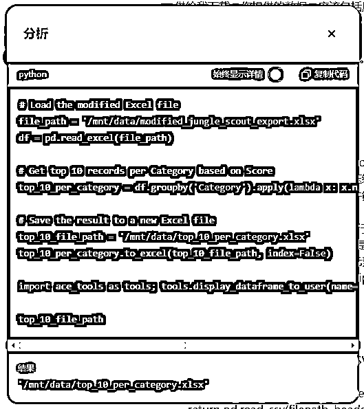
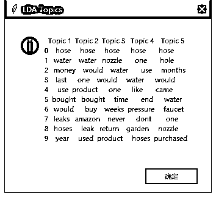

# 怎样通过ChatGPT编程开发价值百万的亚马逊选品分析工具？

> 来源：[https://kxgiimtbac.feishu.cn/docx/PAqGd8jJEoGITvxSmBqcjH9Jnhe](https://kxgiimtbac.feishu.cn/docx/PAqGd8jJEoGITvxSmBqcjH9Jnhe)

如果你没有任何编程基础，有没有什么办法可以不亲自编程，甚至不亲自调试，就能让ChatGPT帮你开发出一个个Python工具？

就在Code Interpreter（后来改名为Advanced Data Analysis）诞生一周年之际，我想起了这个当时十分重磅但在生财却讨论不多的功能。Code Interpreter问世之后，我和身边几位朋友测试后都深感震惊，它不仅能编写代码、分析数据、操作文件、处理图像等等，而且还能自动在一个ChatGPT分配的一个临时环境中自动编写Python代码执行任务，更让我们吃惊是，它在执行任务遇到错误之后还会自动修改代码并重新执行，试图通过各种方案尝试解决问题。这有点像在模拟我们人执行一个任务一样，也许Code Interpreter和同在去年7月份发布的Custom Instructions是ChatGPT未来实现自动化执行任务的前奏。

那么，我们可以怎样利用Code Interpreter来编程开发产品呢？既然Code Interpreter具有自行编写代码、运行代码和调试代码来解决某个特定任务的能力，我们是否可以先让ChatGPT调用Code Interpreter尝试解决某一个它能完成的任务？任务执行完成后，意味着ChatGPT已经编写好一个在临时环境中能正常执行任务的Python程序，我们是否可以让ChatGPT学习这个Python的执行方案来编写出我们需要的代码，再在我们的本地电脑上执行数据量更大或者更加复杂的同类任务？

带着这些疑问，我在AI编程航海的最后阶段开始了新的探索。在此之前的航海前两周，我根据教练的指引和圈友的分享，做了许多ChatGPT编写Python工具的测试，并把这些实践过程整理成一篇文章分享在生财中：

怎样通过ChatGPT编写Python爬虫工具，生财AI编程航海带给我们的潜在机会？

在开始讲述Code Interpreter编程之前，先给大家致歉，因为本文的标题有标题党之嫌。AI编程只是开发产品的一种未必最高效的方式，本文通过AI编程开发出来的产品也只是一些未经市场调研的工具，都不足以作为能让你我赚到百万的理由。那我为什么给文章选择这样的标题呢？因为本文的其中一个案例，也是我这次重新探索Code Interpreter编程的缘由，来自于B站一位Up主的视频：

价值百万美金！ChatGPT亚马逊Amazon选品

Up主详细演示了他怎样通过ChatGPT Code Interpreter分析从JungleScout导出的数据，最终筛选出194个蓝海产品的过程。

作为一位有一点编程基础、对Code Interpreter有一点使用经验的人，我可以很负责任地告诉大家，Up主的整个数据分析筛选过程不需要使用ChatGPT也一样可以完成，甚至如果你对Excel熟悉，直接操作Excel也一样可以完成。然而，AI确实极大地降低了分析门槛、提高了分析效率。这个视频最大的价值并不在AI做数据分析，而在Up主的选品思路。鉴于我和这位Up主有很深的交集，我早已见识过他的亚马逊蓝海选品思路给他带来远超百万的收益。

今天，我将给大家讲讲怎样把这位Up主通过Code Interpreter分析数据筛选蓝海产品的思路，通过ChatGPT轻松编写成一个可以复用的Python选品工具。本文，我们将通过以下几个方面展开：

*   Code Interpreter能为我们做哪些事情？

*   小试牛刀：编写图片转PDF小工具

*   尝试攻坚：解决圈友复制Excel中图片的问题

*   寻求突破：编写亚马逊蓝海选品工具

*   更上一层：编写亚马逊竞品分析工具

*   Code Interpreter编程存在的局限

# Code Interpreter能为我们做哪些事情？

使用过Code Interpreter人都知道，Code Interpreter擅长做数据分析，也能处理图片，甚至生成视频。今天，既然我们希望把Code Interpreter完成某些特定任务的过程变成我们希望开发的工具，我们先来了解一下Code Interpreter究竟能为我们做哪些事情。我就这个问题咨询了ChatGPT，ChatGPT做了详细的回复：


Code Interpreter能够广泛应用于数据科学、机器学习、自动化、文本处理等多个领域，帮助用户高效地完成各类编程和数据分析任务。

Code Interpreter每次执行的时候，都会自动生成Python程序来完成指定任务。OpenAI为什么选择Python而不是C++、Java、PHP等其它语言，这本身就是很值得我们好好思考的问题，也更加坚定了我这次参加AI编程航海时学习和实践通过AI进行Python编程的决心。我同样就Code Interpreter为什么使用Python来执行任务的问题咨询了ChatGPT，ChatGPT做了详细的回复：


了解了Code Interpreter的能力后，我们基本上可以确定Code Interpreter能够帮助我们执行数据分析、图像处理、文件操作、数学计算、生成图表等，接下来，我们将给大家讲述怎样把Code Interpreter处理文件和数据分析的过程开发成小工具。

# 小试牛刀：编写图片转PDF小工具

想要通过Code Interpreter执行特定的任务，我们可以在GPT4或者GPT4o对话过程中，提示ChatGPT“调用Code Interpreter在环境中执行...”，也可以在带有“代码解译器和数据分析”功能的GPTs中实现。

我们先来尝试一个小案例，让Code Interpreter帮我们把一组图片转成PDF文件，再把Code Interpreter执行过程中使用的Python代码改写成我们需要的小工具。我选择的是一个带有“代码解译器和数据分析”功能的GPTs：

Advanced Data Analysis

我们先给这个GPTs指定一个任务：“请你做扮演一名资深的软件工程师，熟悉Python语言。请把附件中的所有图片转成一个存在这些图片的PDF文件，并提供下载链接。”


这个GPTs很快自行编写好Python程序并在临时环境中执行，帮我们把9张图片转成一个PDF文件：


大家注意看看，ChatGPT生成PDF时，在“Download PDF”链接的右侧“[›­­_]”中附上了执行这个任务的Python程序及其执行结果：


这个代码引入了FPDF库和os库，并在临时环境中执行，成功完成把图片转为PDF的任务。

上一篇文章《怎样通过ChatGPT编写Python爬虫工具，生财AI编程航海带给我们的潜在机会？》中，我提到“指定代码：让ChatGPT学习与项目相关的参考代码，再在它学习的代码基础上做开发”的思路，可以让ChatGPT编写出更加符合我们需求的代码。同理，我们同样可以让ChatGPT学习Code Interpreter已经成功执行的代码，再根据这段代码改写出可以在电脑本地执行的程序并增加用户界面：


经测试，程序执行后可以实现把我们选定的图片转成PDF的功能。我们再让ChatGPT给代码做一些优化，包括选择PDF保存路径，保存文件的名称：


还包括加大界面窗口的宽度、显示出选择的图片的列表：


最终，ChatGPT帮我们生成了一个完整的Python程序：

```
import os
from tkinter import Tk, filedialog, Button, Label, Listbox, Scrollbar, SINGLE, END
from fpdf import FPDF
from datetime import datetime

def select_images():
    global image_paths
    image_paths = filedialog.askopenfilenames(
        title="选择图片文件",
        filetypes=[("Image Files", "*.jpeg;*.jpg;*.png")]
    )
    image_listbox.delete(0, END)  # 清除当前列表
    for path in image_paths:
        image_listbox.insert(END, path)  # 在列表框中添加路径
    image_label.config(text=f"已选择 {len(image_paths)} 张图片")

def select_save_path():
    global save_directory
    save_directory = filedialog.askdirectory(
        title="选择保存PDF文件的目录"
    )
    if save_directory:
        save_label.config(text=f"PDF 将保存至: {save_directory}")
        save_button.config(state="normal")

def save_pdf():
    current_time = datetime.now().strftime("%Y%m%d_%H%M%S")
    pdf_name = f"Convert_PDF_{current_time}.pdf"
    pdf_path = os.path.join(save_directory, pdf_name)
    create_pdf(image_paths, pdf_path)
    status_label.config(text=f"PDF 已保存至: {pdf_path}")

def create_pdf(image_paths, output_path):
    pdf = FPDF()
    for image_path in image_paths:
        pdf.add_page()
        pdf.image(image_path, x=10, y=10, w=190)
    pdf.output(output_path)

# 创建主窗口
root = Tk()
root.title("图片转PDF")
root.geometry("800x600")  # 设置窗口大小

# 选择图片按钮
select_button = Button(root, text="选择图片", command=select_images)
select_button.pack(pady=10)

# 显示已选择的图片数量
image_label = Label(root, text="未选择图片")
image_label.pack(pady=5)

# 图片列表框和滚动条
scrollbar = Scrollbar(root)
scrollbar.pack(side="right", fill="y")
image_listbox = Listbox(root, selectmode=SINGLE, yscrollcommand=scrollbar.set, width=100)
image_listbox.pack(pady=5)
scrollbar.config(command=image_listbox.yview)

# 选择保存路径按钮
path_button = Button(root, text="选择保存路径", command=select_save_path)
path_button.pack(pady=10)

# 显示保存路径
save_label = Label(root, text="未选择保存路径")
save_label.pack(pady=5)

# 保存PDF按钮
save_button = Button(root, text="图片转PDF", command=save_pdf, state="disabled")
save_button.pack(pady=10)

# 显示状态信息
status_label = Label(root, text="")
status_label.pack(pady=5)

# 运行主循环
root.mainloop()
```

测试功能正常后（执行过程中如提示缺少相应的Python库，可把报错信息复制给ChatGPT，再根据ChatGPT提供的指令安装相应的Python库即可），我们在命令行窗口中执行：pyinstaller -F -w image2pdf.py，把Python程序封装成exe文件，最终实现把图片转成PDF文件的小工具：


# 尝试攻坚：解决圈友复制Excel中图片的问题

上周日晚上，我看到航海群中圈友遇到了一个复制Excel表中图片到另一个Excel表的问题：


刚好这几天我在思考能否把Code Interpreter执行任务时生成的代码改写成我们需要Python代码，我想到

Code Interpreter本身可能就具备解决Excel文件操作和数据处理的能力。于是，我开始尝试通过Code Interpreter来解决圈友的这个问题。

这里有一点需要注意：Code Interpreter执行任务时使用的是ChatGPT临时分配的一个虚拟环境，不仅有容量限制，还有超时限制，如果你试图通过Code Interpreter完成数据量很大或者计算量复杂的任务，它大概率不能很好地完成任务。因此，在通过Code Interpreter编程时有个思路：在让Code Interpreter执行任务时，先让他执行数据量和计算量较小的任务，再把执行完成后的Python代码通过ChatGPT改写成可以本地电脑运行的程序，再在本地电脑执行更大数据量和更高计算量的同类任务。

这一次，我们选择另一个带有“代码解译器和数据分析”功能的GPTs：

Excel GPT

当然，你也可以直接使用GPT4或者GPT4o，在对话中过程中，提示ChatGPT“调用Code Interpreter在环境中执行...”

我们先准备一个数据量很小的Excel文件“data.xlsx”，文件中只保留2张图片（按上面提到的小数据量的原则）：


接着，我们给这个GPTs指定一个任务：“请你先识别附件data.xlsx中的所有图片，然后把每张图片复制到名为output.xlsx的Excel文件的D列对应单元格中，复制后，在保留每张图片原像素和宽高比例的情况下缩小图片的显示高度至100px高度，同时把图片所在单元格高度修改为100px高度。”


很快，ChatGPT调用Code Interpreter执行这个任务并生成一个新的Excel文件：


打开一看，我们发现图片复制后所在行和原来的文件不一致：


我们把这个问题反馈给ChatGPT：


很快，ChatGPT重新调用Code Interpreter完成这个任务。这一次，图片的位置和我们的预期一致：


我们可以点击“Download PDF”链接的右侧“[›­­_]”，查看执行这个任务的Python程序及其执行结果：


我们发现这部分代码并不包括复制Excel中图片到另一个Excel的整个完整过程。这一次，我们尝试让ChatGPT重新输出它刚刚执行任务的完整代码：


接着，我们同样让ChatGPT学习Code Interpreter已经成功执行的代码，再根据这段代码改写出可以在电脑本地执行的程序并增加用户界面：


经测试，程序执行后可以实现把Excel文件中图片复制到另一个Excel指定列的功能，但是存在一些小问题，比如复制后的图片尺寸没有设置好、分辨率变低，再比如在执行程序的代码所在目录生成了临时图片，再比如执行后出现报错信息等。我们通过对话让ChatGPT修复这些问题，最终，ChatGPT帮我们生成了一个完整的Python程序：

```
import openpyxl
from openpyxl.drawing.image import Image as ExcelImage
from PIL import Image
import io
import os
from tkinter import Tk, filedialog, Button, Label, Entry, StringVar

# Function to get new size while maintaining aspect ratio
def get_resized_dimensions(original_width, original_height, target_height):
    aspect_ratio = original_width / original_height
    new_height = target_height
    new_width = int(new_height * aspect_ratio)
    return new_width, new_height

def process_images(input_file_path, output_file_path):
    # Load the workbook and the first sheet
    wb = openpyxl.load_workbook(input_file_path)
    ws = wb.active

    # Create a new workbook for the output
    output_wb = openpyxl.Workbook()
    output_ws = output_wb.active

    # Process each image in the worksheet and place it in the same row in the output workbook
    for img in ws._images:
        # Get the row number where the image is located
        row = img.anchor._from.row + 1  # Anchor is 0-based index, so adding 1 to make it 1-based

        # Get original image data
        img_bytes = io.BytesIO(img._data())
        img_bytes.seek(0)
        pil_img = Image.open(img_bytes)

        # Get original dimensions
        original_width, original_height = pil_img.size

        # Get new dimensions
        new_width, new_height = get_resized_dimensions(original_width, original_height, 100)

        # Insert the original image into the output workbook with resized dimensions
        img_bytes.seek(0)  # Reset buffer to start
        excel_img = ExcelImage(img_bytes)
        excel_img.width = new_width
        excel_img.height = new_height
        output_ws.add_image(excel_img, f'D{row}')
        output_ws.row_dimensions[row].height = 100  # Set row height to 100px

    # Save the output workbook
    output_wb.save(output_file_path)

def select_input_file():
    input_file_path = filedialog.askopenfilename(filetypes=[("Excel files", "*.xlsx;*.xls")])
    input_file_var.set(input_file_path)
    output_file_var.set(os.path.splitext(input_file_path)[0] + "_output.xlsx")

def select_output_file():
    output_file_path = filedialog.asksaveasfilename(defaultextension=".xlsx", filetypes=[("Excel files", "*.xlsx;*.xls")])
    output_file_var.set(output_file_path)

def organize_images():
    input_file_path = input_file_var.get()
    output_file_path = output_file_var.get()
    if input_file_path and output_file_path:
        process_images(input_file_path, output_file_path)
        result_label.config(text="图片整理完成！", fg="green")
    else:
        result_label.config(text="请先选择文件路径。", fg="red")

# Set up the main application window
root = Tk()
root.title("Excel 图片整理")

input_file_var = StringVar()
output_file_var = StringVar()

Label(root, text="选择需要处理的Excel文件:").grid(row=0, column=0, padx=10, pady=10)
Entry(root, textvariable=input_file_var, width=50).grid(row=0, column=1, padx=10, pady=10)
Button(root, text="选择文件", command=select_input_file).grid(row=0, column=2, padx=10, pady=10)

Label(root, text="保存输出的Excel文件路径:").grid(row=1, column=0, padx=10, pady=10)
Entry(root, textvariable=output_file_var, width=50).grid(row=1, column=1, padx=10, pady=10)
Button(root, text="选择路径", command=select_output_file).grid(row=1, column=2, padx=10, pady=10)

Button(root, text="整理图片", command=organize_images).grid(row=2, column=1, padx=10, pady=20)
result_label = Label(root, text="")
result_label.grid(row=3, column=1, padx=10, pady=10)

root.mainloop()
```

测试功能正常后（执行过程中如提示缺少相应的Python库，可把报错信息复制给ChatGPT，再根据ChatGPT提供的指令安装相应的Python库即可），我们在命令行窗口中执行：pyinstaller -F -w excel_move_image.py，把Python程序封装成exe文件：


我们通过这个exe文件在我们的本地电脑执行，选择圈友提供的源文件，最终可以把这个数据量更大的Excel文件中图片复制到另一个Excel指定列：


# 寻求突破：编写亚马逊蓝海选品工具

完成上述的两个测试之后，我开始着手尝试把前面提到的Up主的视频选品思路通过ChatGPT编程开发成一个选品工具。

我们先回顾一下这个视频中的选品流程：

价值百万美金！ChatGPT亚马逊Amazon选品

*   首先，参考Up主的设定，从JungleScout导出37份csv格式的Excel文件，并把这些文件放在一个zip格式的压缩包中；

*   接着，通过Code Interpreter自行编写Python代码，执行解压压缩包并合并37个csv文件的任务，得到一份有3700条记录的csv文件；

*   再接着，根据Up主对选品条件的设定，通过Code Interpreter自行编写Python代码，计算产品得分；

*   最后，通过Code Interpreter自行编写Python代码，执行数据筛选任务，最终得到我们想要194个潜力蓝海产品。

稍微有点编程经验就可以看出，这个选品流程实际上是一个执行程序完成任务的流程，没有涉及任何AI语义分析，或者说，不需要使用ChatGPT，一样可以通过编写程序或者操作Excel完成这个选品的流程。因此，我们完全可以把这个流程开发成一个后续可以复用的选品软件。

参考前面的例子，我们同样可以让Code Interpreter帮我们完成这个合并文件、计算产品得分和筛选产品的流程，再把Code Interpreter执行过程中使用的Python代码改写成我们需要的选品工具。我选择的仍然是带有“代码解译器和数据分析”功能的GPTs：

Advanced Data Analysis

为了确保Code Interpreter成功完成我们的任务，我们先缩小数据量，从37个csv文件中随便挑选3个文件（每个文件有100条产品记录），重新打包成一个zip文件：


然后按照Up主使用的指令执行，完成合并文件、计算产品得分和筛选产品的任务：


过程中，ChatGPT自行编写了3段Python程序（点击“[›­­_]”可以查看）：


合并文件


计算产品得分



筛选蓝海产品

我们分别复制这3段代码，让ChatGPT学习这些代码，再根据这些代码改写出可以在电脑本地执行合并文件、计算产品得分和筛选产品的整个流程的程序，并增加用户界面：


经测试，程序执行后可以实现合并文件、计算产品得分和筛选产品的完整流程。最终，ChatGPT帮我们生成了一个完整的Python程序：

```
import pandas as pd
import zipfile
import os
import tkinter as tk
from tkinter import filedialog, messagebox

def read_csv_with_offset(filepath, header_row=2):
    return pd.read_csv(filepath, header=header_row)

def process_files(zip_path, save_path):
    # Extract CSV files from zip
    with zipfile.ZipFile(zip_path, 'r') as zip_ref:
        zip_ref.extractall('/mnt/data/extracted_files/')

    extracted_files = []
    for root, _, files in os.walk('/mnt/data/extracted_files/'):
        for file in files:
            if file.endswith('.csv'):
                extracted_files.append(os.path.join(root, file))

    # Load and concatenate all CSV files
    dataframes = []
    for file in extracted_files:
        df = read_csv_with_offset(file)
        dataframes.append(df)

    combined_df = pd.concat(dataframes, ignore_index=True)

    # Calculate product score
    weight_rating = 0.4
    weight_lqs = 0.2
    weight_reviews = 0.3
    weight_sales = 0.1

    combined_df['Rating'] = pd.to_numeric(combined_df['Rating'], errors='coerce')
    combined_df['LQS'] = pd.to_numeric(combined_df['LQS'], errors='coerce')
    combined_df['Reviews'] = pd.to_numeric(combined_df['Reviews'], errors='coerce')
    combined_df['Est. Monthly Sales'] = pd.to_numeric(combined_df['Est. Monthly Sales'].str.replace(',', ''), errors='coerce')

    combined_df['Rating'].fillna(combined_df['Rating'].max(), inplace=True)
    combined_df['LQS'].fillna(combined_df['LQS'].max(), inplace=True)
    combined_df['Reviews'].fillna(combined_df['Reviews'].max(), inplace=True)
    combined_df['Est. Monthly Sales'].fillna(0, inplace=True)

    combined_df['Rating_Score'] = (combined_df['Rating'].max() - combined_df['Rating']) / (combined_df['Rating'].max() - combined_df['Rating'].min())
    combined_df['LQS_Score'] = (combined_df['LQS'].max() - combined_df['LQS']) / (combined_df['LQS'].max() - combined_df['LQS'].min())
    combined_df['Reviews_Score'] = (combined_df['Reviews'].max() - combined_df['Reviews']) / (combined_df['Reviews'].max() - combined_df['Reviews'].min())
    combined_df['Sales_Score'] = combined_df['Est. Monthly Sales'] / 10000

    combined_df['Score'] = (combined_df['Rating_Score'] * weight_rating +
                            combined_df['LQS_Score'] * weight_lqs +
                            combined_df['Reviews_Score'] * weight_reviews +
                            combined_df['Sales_Score'] * weight_sales)

    # Get top 10 records per Category based on Score
    top_10_per_category = combined_df.groupby('Category').apply(lambda x: x.nlargest(10, 'Score')).reset_index(drop=True)

    # Save the result to an Excel file
    top_10_per_category.to_excel(save_path, index=False)
    messagebox.showinfo("Success", "The top 10 products per category have been saved successfully!")

def select_zip_file():
    zip_path = filedialog.askopenfilename(filetypes=[("Zip files", "*.zip")])
    if zip_path:
        zip_entry.delete(0, tk.END)
        zip_entry.insert(0, zip_path)

def select_save_path():
    save_path = filedialog.asksaveasfilename(defaultextension=".xlsx", filetypes=[("Excel files", "*.xlsx")])
    if save_path:
        save_entry.delete(0, tk.END)
        save_entry.insert(0, save_path)

def on_calculate():
    zip_path = zip_entry.get()
    save_path = save_entry.get()
    if not zip_path or not save_path:
        messagebox.showwarning("Input Error", "Please select both the zip file and save path.")
        return
    process_files(zip_path, save_path)

# Create GUI
root = tk.Tk()
root.title("Blue Ocean Product Selector")

tk.Label(root, text="Select Zip File:").grid(row=0, column=0, padx=10, pady=10)
zip_entry = tk.Entry(root, width=50)
zip_entry.grid(row=0, column=1, padx=10, pady=10)
tk.Button(root, text="Browse", command=select_zip_file).grid(row=0, column=2, padx=10, pady=10)

tk.Label(root, text="Save Path:").grid(row=1, column=0, padx=10, pady=10)
save_entry = tk.Entry(root, width=50)
save_entry.grid(row=1, column=1, padx=10, pady=10)
tk.Button(root, text="Browse", command=select_save_path).grid(row=1, column=2, padx=10, pady=10)

tk.Button(root, text="Calculate Blue Ocean Products", command=on_calculate).grid(row=2, column=0, columnspan=3, pady=20)

root.mainloop()
```

测试功能正常后（执行过程中如提示缺少相应的Python库，可把报错信息复制给ChatGPT，再根据ChatGPT提供的指令安装相应的Python库即可），我们在命令行窗口中执行：pyinstaller -F -w amazon_data.py，把Python程序封装成exe文件：


为了验证这个选品工具，我特意找这位Up主拿了他当时从JungleScout导出的37个数据文件：


我们通过这个exe文件在我们的本地电脑执行，选择含有37个csv文件的zip文件，最终可以把这个数据量更大的zip文件中的csv文件进行合并，然后计算产品得分并筛选出194个潜力蓝海产品：


这个结果和Up主在视频中展示的一致：


我们可以继续和ChatGPT对话，给这个选品工具增加更多灵活的功能，包括校验文件格式、选择筛选指标、设定指标权重等，这样，我们就可以得到Up主视频中声称的价值百万的选品工具。

当然，作为一名跨境电商卖家，我还是要负责任地告诉大家，筛选出这些产品并不意味着能够赚到百万，大家要结合自己的资金、供应链和团队情况，还要分析竞品背后的品牌实力，甚至还要根据亚马逊的最新态势微调自己的选品策略，再根据适合自己的策略来开发选品工具。

# 更上一层：编写亚马逊竞品分析工具

这位Up主除了上面这个选品视频之外，还发布了其他AI赋能亚马逊的视频，其中一个分析竞品reviews来找到产品改善建议的视频也非常值得我们关注：

很可能整个亚马逊行业格局都会改变（用ChatGPT分析亚马逊的竞争对手）

经过认真分析，我发现这个视频的竞品分析思路也同样可以通过ChatGPT编程开发成一个亚马逊竞品分析工具。

我选择的仍然是带有“代码解译器和数据分析”功能的GPTs：

Advanced Data Analysis

我们同样让ChatGPT按照Up主的分析流程，通过Code Interpreter完成数据清洗、文本分词、词频统计、N-gram分析、LDA主题建模、生成词云图等整个流程，再把每个环节中使用的Python代码复制给ChatGPT学习，然后改写成可以在电脑本地执行数据清洗、文本分词、词频统计、N-gram分析、LDA主题建模、生成词云图等整个流程的程序并增加用户界面。

过程中，由于整个流程线条过长，遇到了一些报错，但最终都通过与ChatGPT对话得以解决。另外，由于想把这个流程做成工具，并没有连接任何AI接口，因此，我有意回避了情感分析和词频分析等语义分析环节，也就是说，工具执行得出的结果需要根据经验做判断或者另行发给ChatGPT做进一步分析。

最终，我们得到了一个初步的亚马逊竞品分析工具：





# Code Interpreter编程存在的局限

既然我们可以预先让Code Interpreter完成我们的指定任务，再根据其完成任务使用的Python代码改写出可以在我们本地电脑运行的Python程序，那么，我们是否可以通过这种方式完成任何我们想要的任务呢？

答案是否定的！Code Interpreter本身就存在一些局限性：

首先，我们前面提到过，Code Interpreter执行任务时使用的是ChatGPT临时分配的一个虚拟环境，不仅有容量限制，还有超时限制，如果你试图通过Code Interpreter完成数据量很大或者计算量复杂的任务，它大概率不能很好地完成任务。

其次，Code Interpreter本身也有能力边界，它可以很好地做数据分析、文件操作、图像处理、数学计算等等，但仍然有许多它无法完成的任务，比如我尝试让它直接在虚拟环境中编写爬虫程序并执行爬取网页的任务，它并不能完成，它输出了可以给我复制到本地电脑使用的Python爬虫程序，但它无法在虚拟环境直接完成爬取任务。

再次，如果你的任务流程较长，Code Interpreter需要多次分析和执行才完成你的任务，你在把这些流程的代码进行整合的时候，过程中可能容易出现报错，需要根据实际情况，通过与ChatGPT进一步对话和协作来完成你的完整需求。

最后，Code Interpreter执行过程中，用户上传的或者它生成的文件都在临时环境中，一小段时间后，环境会被释放，放在里边的文件和临时文件也都会丢失。

本文通过Code Interpreter编程来开发Python工具，更多地是给大家提供一个探讨的思路，大家在编程开发中，要根据实际情况灵活选择最适合自己的编程方式。

文末，祝大家生财有术！