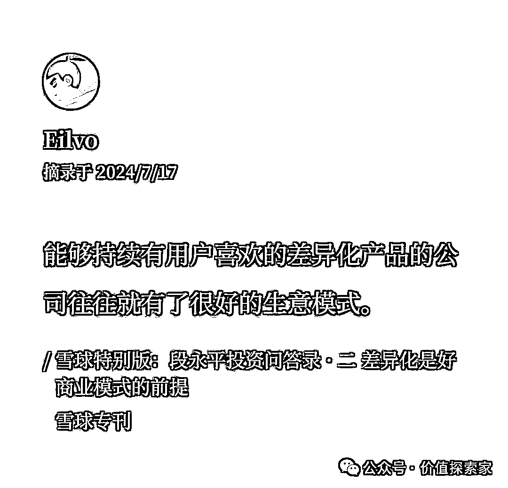
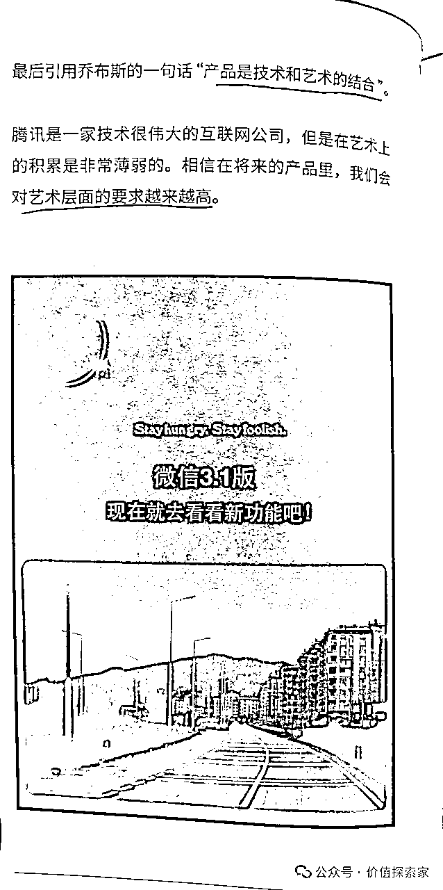

# 为什么产品定价不能太低？这篇万字定价哲学值得所有想当老板的朋友读一读【深度解读】

> 来源：[https://px2plxqbceo.feishu.cn/docx/PmrudEqfIoEPTFxsQV2cyEDwnRd](https://px2plxqbceo.feishu.cn/docx/PmrudEqfIoEPTFxsQV2cyEDwnRd)

大家好，我是浩哥Eilvo，开过咖啡店、当过程序员、做过外贸销售，一个对商业十分感兴趣的、崇尚终身学习的、爱折腾爱分享的00后。

今天跟大家分享一下我对于产品定价的一些看法与思考。

这篇文章结合了我的个人经历、思考以及读了小马宋老师的《营销笔记》后的一些心得，全文13000字，希望能抛砖引玉，给大家一些有价值的启发。

以下观点不一定正确，仅代表个人观点，如有不妥，欢迎指正。

前不久，我跟一家做灯饰、照明相关产品的企业老板聊天。

他提到，他们公司之前有个业务员，跟客户谈单的时候，客户稍微压一压价，就将产品以近乎成本价的售价卖出去。可能这位员工也急于成交，想着利润少点就少点，总比没了这个客户好。老板对员工这个行为甚是苦恼。

先针对这件事本身去分析，为什么碰到客户压价的时候，宁愿不做这个单子，也不能把价格定得太低呢？

一来，客户可能会觉得你十分不靠谱。因为他只是随便压压价，你就能把价格瞬间压下去，让他觉得你的定价十分随意，从而降低客户对你的信任度。而成交本质上靠的是信任，没有信任又谈何成交呢？

二来，客户可能觉得这个不是底价，价格还能再压。因为客户压价压的太轻松了，谁不想再继续压一压，看看有没有更低的价格？

三来，客户可能觉得你的产品报价虚高。进而怀疑你的成本是否极低，产品质量是否可靠。关于这个，外贸行业有个说法，接待美国客户要开一些低调点的面包车，不要让客户觉得你很赚钱，这会让对方觉得你的产品利润很高，给他的价格不是底价。

所以，做生意，懂得洞察、揣摩用户心理很重要，是一门体现综合能力的技术活。

上面这个故事只是一个引子。

下面再从其他一些角度说一说产品定价为什么不能太低。

1/

从选品角度分析，做低客单产品容易把自己耗死。

一般这类产品没什么溢价能力，没什么壁垒，容易陷入无止境的价格战，例如塑料包装相关制品，基本上都是拼哪个厂家能提供的价格更低。

产品利润少，自己付出的精力多，投入产出比（ROI）低。

为什么说低客单产品需要付出更多的精力？

跟大家分享一段朋友的经历。

这个朋友是做电商的，之前是做低客单产品，他说，做低客单产品，假设一件产品赚3块钱，哪怕爆单了，出一百单，你也只能赚个300块。赚得不多还不算什么，与此同时，你还需要服务好100位顾客。

而且，一般这类产品的客户，要求也比较苛刻挑剔，很容易产生客诉，真的是吃力不讨好。

但如果你做高客单产品，一单利润是300块，哪怕你只出一单，一单的利润就足以抗衡低客单100单的利润，而且只需要服务好这一位顾客即可，相当巴适！

选择低客单产品的大多是对价格敏感的客户，而对价格敏感的客户质量，相对于能接受高客单的客户会低一些。

定价是一个筛选客户群体的过程。

高客单帮你筛选优质用户，节省时间精力的同时，还能获取更高的收益。

假设你想做企业老板或者有钱人的生意，那定价就不能太低。

一个典型的例子是，劳力士手表早年宁可错失100w的大订单也坚持不降价，这需要很强的战略定力。

我们一般坚持“只筛选不改变”原则，毕竟筛选适合自己的客户远比改变客户的消费习惯要容易得多。

有了更高的利润，才能提供更好的服务，才有好的口碑，带来复购，从而形成良好的正向循环。

当然，低价也不是毫无用处，可以作为引流品，充当引流作用。

生活中这样的案例并不少。比如瑞幸的每周9.9咖啡活动，麦当劳的“1+1”套餐，还有知识付费赛道利用阶梯定价方式筛选目标客户等等。

比较典型的例子就是短视频领域的一个大IP“大蓝”，通过99块的流量课对目标客户进行初筛，然后往上还有好几万、甚至几十万的私教课、私董会等等，后者才是真正拿来赚钱的产品。

甚至，澳门的du场，像永利、美高梅等，免费提供各式小吃，也是一种引流手段，不过最近听说要取消了，因为政府担心这会抢了其他中小企业的生意，影响中小企业的生存，这是题外话了。

除了引流作用以外，通过定期打折、给消费者让利，还可以促活，盘活、维系老客户资源，增加顾客粘性。

2/

定价太低，用户会下意识觉得你的质量可能不太行，哪怕事实并非如此。

这是一种很正常的心理。俗话说，“一分钱一分货”。看起来差不多的两款产品，一款贵一点，另一款便宜一点，大多数人可能就会认为，贵的那款质量好一些，便宜的那款质量差一些。毕竟“羊毛出在羊身上”。

像名创优品早期，门店开在广州市花都区的旺街，价格很便宜，想主打性价比。但是顾客认为，这家店开在街边，东西还这么便宜，肯定是假货，就不敢买了。毕竟看起来这么有格调的产品，一般都卖的很贵，不是吗？

后来，名创优品经过最小可行产品（MVP）测试优化，发现将价格带从原来的39元调整至49元，销量反而上升了。

因此，定价并非越低越好。

事实上，并非“贵的就一定是好的，便宜的就一定不好”，这不是绝对的。

因为价格是由多种因素决定的，包括稀缺性（供需关系）、品牌溢价、生产成本（物料成本、社会必要劳动时间）等。

你说稀缺的东西就一定是好东西吗？

不一定。

举个生活中的例子，桂花鱼，一般酒楼里面卖上百块一斤，一般是一些有钱人在一些重要场合例如婚宴啥的用来撑场子用的。

哪怕是直接从原产地的农场养殖户进货，也要三四十块一斤，跟日常市场终端零售价十几块一斤的家常鱼相比，价格不是一般的贵。

但你说这种鱼好吃吗？每个人口味不一样，但我个人认为不好吃，至少是不值这个价位的。

这种鱼的特点是肉质比较紧实，但是味道不够鲜美，也不够健康（这种鱼比较容易生病，养殖户经常需要下不少药物）。要说比它好吃、便宜还健康的鱼，多了去了。

那它为什么价格还卖这么贵呢？

第一，相对稀缺。这种鱼比较难养，导致市场上的养殖户相对较少。

第二，养殖成本高。这种鱼是肉食动物，专吃小鱼，而不是普通饲料，而且很能吃，经常出现吃太饱撑死的情况。

当然，虽然客观事实是“贵的不一定是最好的”，但大众的心理就会认为“贵的就是最好的”，所以这里再次强调一下，懂得洞察大众心理、迎合大众心理非常重要。

这时，可能就会有小伙伴问，那定价就不能低吗？

当然不是，世事无绝对。

只要在合适的时机与场景下，也是可以以低定价出售的。

那么，通过什么手段进行低定价出售比较合适呢？浩哥在这里给出几个思路。

第一，不要一开始就给出底价，可以先亮出一个高价，再以活动促销、优惠打折的方式给客户。同时，可以告诉消费者，虽然我们价格低，但是是通过降低利润或者提高店铺效率的方式，而非降低产品质量的方式进行降价的。

或者可以跟客户说，我跟经理商量一下，看你是新客户的份上，同意给你打多少折的优惠，希望能以相对实惠的价格促成第一次成交，从而后续有机会形成长期的合作伙伴。

总之不要让对方觉得砍价太轻松。

轻易得来的一般都不会懂得珍惜，反而还可能引发客户对产品质量的质疑。

在日常生活中，其实这种现象很常见。

一件产品的标价上，通常是标一个很高的原价，然后划掉，再标一个折扣了许多的售价，让人觉得现在买这件产品十分划算。

这在商业上被称作“价格锚定”现象。

价格只是一种感知。有研究表明，当一个顾客在看到真实的产品价格之前，你随便让他看到一个足够大的价格数字，他都会受到这个价格的影响。

现实中其实有很多这样的例子。

例如，当你去买衣服的时候，尽管你的预算一开始只有500块，但是当服务员向你报出的第一个价格是1000块时，你的心理预期就会迅速提升，后来当你听到服务员说最近搞促销活动，可以用800块买到这件超美瘦身裙的时候，你心里就会觉得十分激动，觉得自己占了便宜，恨不得马上买下它。

同样的现象，还可能发生在应聘时跟面试官聊薪水的时候，或者去餐厅吃饭在菜单上看到比较贵的某几道菜的时候。这里不一一展开，感兴趣的可以去读一读小马宋老师的《营销笔记》，里面讲得十分详细。

第二，定价可以只是看起来低。

什么叫看起来低呢？

就是最低价只提供最基础的丐版服务，其他的服务顾客可以按需增加。

这样有几个好处。

一来，可以抬高客单价，增加利润，价格覆盖人群广，有需求的可以增加一些配置，没需求的可以低配。

二来，可以让顾客知道贵是贵在哪里，每一分钱花在什么地方。

三来，如果是在电商平台上，起价低也可以吸引流量。

之前有个澳大利亚的顾客很生气地跟我说，阿里巴巴上很多“价格欺诈”现象，很多产品看起来很便宜，但是最终报价却相差很大。

我笑了笑说，这不是欺诈，是中国市场太内卷了，都喜欢把价格标低，吸引你点进去后，再通过叠加各项配置服务再把价格拉高。而且，这其实也是商业世界的正常现象，通过进行价格拆分，降低价格数字本身的视觉冲击力。同时，可以尽可能地让自己的价格覆盖更多的人群，从而实现个性化定价，即有钱人可以选多点配置和服务。像日常生活中买车时的选配天窗、自动挡、倒车雷达或者倒车镜自动折叠等各种配置服务，也是如此。

第三，定价不一定是真的低，只要是超预期的价格就可以，其实就是常说的性价比。

举个例子，车厘子平时一般要40多一斤，而且市场上这个价位的车厘子，还不一定新鲜、好吃，60多一斤的也有。

前段时间我跟家人去逛山姆超市，90两斤的车厘子，平均下来45一斤，也就跟普通市场价差不多，但是它是从华盛顿新鲜采摘空运过来的，而且吃起来很新鲜很脆甜。说实话，这个价位的车厘子，价格并不算低，但是给我的综合体验很棒，甚至感觉比之前吃过的60一斤的还要好吃，完全超预期的体验，就让人觉得性价比很高。对比这个体验，这个价格已经相当划算了。

第四，选择靠谱的商业背书。

例如大的商圈，就是很有力的背书。商圈一般租金等各方面成本都很高，准入门槛高，顾客看到你能在商圈开店，就觉得你这家店很靠谱、有实力，哪怕你的定价比较低，他们也只会觉得这家店性价比高，而不会认为你卖假货。

名创优品早期选择开在街边店，经历了接连十家店的经营失败后，总结出一个结论：把店开在商场里面才是对的。

除了选择大商圈，还可以在选址时尽可能地靠近一些知名品牌。

你仔细观察一下就会发现，基本上有星巴克的商圈，都会有喜茶、奈雪，背后也是这个道理。

所谓“近朱者赤，近墨者黑”，假如一个人身边的朋友全都是很优秀、很积极向上的，那么这个人也不会差到哪里去。

放到人身上的道理，放到商业世界中同样是适用的。

除此以外，还可以进行品牌联名、明星代言等，就不一一展开了。

3/

定价太低，有可能覆盖不了自己的经营成本，导致资金链条断裂。

同时，用价格战卷死同行是“自杀行为”。

降价应该是提高效率降低成本后的降价，而不是成本固定情况下的自降利润。

例如特斯拉通过“一体化压铸”技术降低生产成本后进行降价，以及蜜雪冰城通过不断扩店降低生产成本后得以实现低价销售还能维系合理的利润。

有朋友可能会问，蜜雪冰城不断扩店不是会增加生产成本吗，怎么是降低成本呢？

其实很容易理解，同样的一套供应链体系，总成本基本上是恒定的，在同样的总成本前提下，生产1万个产品跟生产10万个产品，每一件产品的平均成本是不一样的，后者的平均成本必定是低于前者的，同时随着产品生产量的不断提高，这一平均成本还会不断被摊薄，以至于最终可以忽略不计。这是从物料生产的角度分析。

如果从仓储运输的角度来看，同样一个仓储中心，同样一次配送，店铺密度越高，辐射到的店铺也就越多，原本一个仓储中心，或者一次配送，只能满足100家店铺的需求，现在可以满足1000家，因此每一次的仓储运输成本也会被摊薄。

而特斯拉的降价可以用经验曲线原理来解释。

这是大名鼎鼎的波士顿咨询公司在1960年提出的结论，即产量越大，经验则越丰富，生产成本也就越低。

特斯拉具有典型的数码产品特征，它的成本会随着时间和技术的发展大幅下降，而性能则会大幅提升。这个其实很好理解，如果拿一百年前生产一台相机跟现在生产一台相机的成本进行比较，肯定是后者要低很多倍，因为现在的科技发达很多，而科技的发展也是跟产品的规模产量不断扩大密不可分。

与其同时，有了一定的规模，在原材料采购端也有着不少成本优势，这也是名创优品老板叶国富后期坚持“要么不开店，要开十家一起开”的原因。

有了一定规模以后，还可以通过在当地建设自动化生产工厂来进一步提高生产效率，降低成本，像雷军在自媒体平台上介绍的小米手机的全自动智能生产车间。

这时候可能又有人搬出小米、蜜雪冰城、瑞幸咖啡等例子，说他们定价也很低啊，为什么他们不会资金链断裂，反倒还能做起来？

原因可能有以下几点：

第一，上面提到的成本优势。除了规模扩大后带来的成本优势，还有就是小米早期主要是通过小米自己的在线商城销售，没有线下代理商，不需要考虑渠道费用，而且，哪怕小米手机在硬件上没有太多的利润，它还有App预装费用、流量入口费、广告费等持续性的多种收入。

第二，他们亏得起。以小米为例，由于雷军的背书，小米当初获得了大量投资，资本愿意牺牲早期的利润来快速抢占市场份额，所以小米前期亏得起，没有太大的盈利压力。

第三，预测未来成本。像瑞幸团队，他们肯定是算过一笔账的，这个价格，要开多少家店才能赚钱，或者说，未来要开多少家店，才能把成本压缩，实现这个定价，只要这个逻辑能走通，就可以提前使用这个定价，然后不断跑马圈地、开店扩张就可以了。

第四，你说小米的价格很低吗？也不见得。但是小米很擅长堆料营销，以我的小米11为例，列出一堆硬核配置：哈曼卡顿扬声器、1亿像素计算摄影、2k屏、骁龙最新的芯片等等，然后给出一个超预期的价格。你说这些配置对你来说很有用吗？也不是，用起来其实没有太明显的感知，但是至少，你列出一堆东西，再给出一个相对低的价格，就能让消费者觉得很划算，性价比很高，这是把消费者心理拿捏透了。

还有瑞幸经常宣传的金奖咖啡豆和世界大师团队，你说喝起来真的有世界级的口感吗？也并没有，比它做的好的街边小店一抓一大把。但他们这么做的目的，其实就是为了告诉消费者，我们虽然便宜，但用的都是上乘的原材料和顶级的团队。最终就是为了让消费者感受到性价比，让消费者在消费感知上超预期。

第五，便宜的只是引流款，其他款式还是赚钱的。像瑞幸的每周9块9咖啡，麦当劳的工作日10元早餐、13块的“1+1套餐”等等。

所谓“兵无常势，水无常形；能因敌变化而取胜者，谓之神”，商场如战场，没有固定的打法套路，不要看到别人定价低，就盲目去模仿，要结合自身的实际情况以及市场的形势变化，“因地制宜”，选择合适的发展策略。

4/

定价高点没关系，只要告诉顾客这部分的溢价是体现在什么品质和服务上，贵是贵在哪里，只要贵的合理、有价值，消费者就能够接受。

举个例子，我们卖一件衣服，当顾客跟你说觉得价格高的时候，你可以跟他说，我们也有便宜的，但是质量是不一样的，这一件使用的是加拿大进口羊毛，十分保暖，质量十分好，这时候顾客听了，就会觉得，价格是贵了点，但也不是割韭菜，贵有贵的道理。顾客知道贵在哪里后，哪怕定价高一些也是可以接受的。

要理解消费者心理，站在消费者的角度上思考问题。

要增加顾客的获得感，让顾客知道，原来自己花的这笔钱，可以得到这么多服务和体验，要让顾客觉得自己花的钱物超所值，钱花的开心。

像最近去广州参加曹大的线下见面会，住的一家酒店，400多，送免费停车、免费自助早餐和下午茶，免费饮料等等，就感觉获得感很强，服务很贴心、很周到。

但其实你说增加这些服务的成本很高吗，并不高。

所谓免费下午茶，其实就是一些炸薯条、面包、果汁、水果而已，免费饮料其实就是几个盒装的廉价饮料。

还有蜜雪冰城，5块一大杯冰鲜柠檬水，真的是很大一杯，看起来很划算，但其实就是水+糖浆+柠檬，柠檬也只有两片而已，成本极低。

知识付费我觉得也是如此。周末听涛哥分享，涛哥有句话说得挺好。

知识付费就是卖海报，内容只是售后。

确实是这样。通过海报吸引人，告诉你加入以后能学到什么，提前让你感知获得感，而人性就是，容易高估自己的执行力（像我读书的时候，每次放假都以为自己会好好学习，带好多书回去，结果都是原封不动带回学校），于是就选择了付费加入。

5/

要去了解同类产品在市场上的普遍定价，自己定价时才能更加合理，面对客户压价才更有底气。

有些人只是习惯性压价，试探对方的底线。例如在外贸市场上，印度阿三就特别喜欢讲价。

那么，如果你知道市场价就是这样，自己的价格甚至比市场价还要低，而对方还要压价，那你就可以很有底气地拒绝对方。

所谓“知己知彼，方能百战不殆”，就是这个道理。

6/

定价策略，往往能反映出企业的战略定位，代表着差异化思维。

举个例子，拼多多和京东，二者的定价相差很大。

京东定价高，倒逼产品质量高、服务好，同时，京东是以自营产品起家的，是京东的发展根基，这意味着，京东自己是消费者最大的信任主体，也是最大的风险承担者，因此，在品控上，它必须要做的比别人更好。

哪怕只是一双3.99元的拖鞋产品，在上架之前，它都经历过重重严格的筛选与质检，包括对拖鞋是否防滑、重量不能超过多少克、软料还是硬料、成本预算、颜色色差度等各种参数的控制，如果不符合这套“标准”的，在初筛阶段就会被淘汰。

最终这款产品，在京喜自营的月均销量是20-30万双。

质量好，形成口碑，占领用户心智，用户就觉得，哎，你家的东西就是质量好，买大件、买家电、买数码产品，来你这买，放心。

拼多多就不一样了，它的定价，就决定了它的用户群体是对产品价格敏感、但对产品质量相对不太敏感的。

但是，这里还要额外说明一下，这里不是说有钱的、对价格不敏感的人就不会用拼多多，不是这样的。

对价格不敏感的人群，也会根据自己的具体生活场景、生活需求来选择性价比最高的采购渠道，例如买电脑、手机这些重要的电子产品，可能会优先考虑京东，如果买一些对质量要求不高或者质量试错成本较低（比较便宜，哪怕买回来的产品质量不好，损失也是在可控范围内）的普通生活用品，例如纸巾、毛巾啥的，就可能会选择拼多多。

所以，不同的定价策略，就决定了京东与拼多多的服务人群画像是不一样的，也就产生了差异化，各自都能在这个市场上分一杯羹。

段永平认为，差异化是好商业模式的前提。

所谓差异化，就是用户需要但其他竞争对手满足不了的某些东西。

没有差异化的存量市场，最终的结局只能是打价格战，把蛋糕越做越小。

段永平曾举过航空公司的例子，航空公司的差异化非常小，消费者对航空公司的关注点主要集中在其安全性，如果其安全性得不到保障，那么消费者的关注点就会迁移至从a点到b点的成本上。服务态度方面也会有一点差异，但不大，除非某家公司的服务特别差。因此，这个行业的价格竞争异常激烈。

差异化程度越低的行业，就越难赚到钱。

而定价则是实现差异化的重要一环，由此可见合理的定价策略的重要性。

关于京东的商业模式，感兴趣的小伙伴，推荐读一读刘润老师的这篇文章：京东的三板斧，写得非常、非常好。

关于拼多多的商业模式，可以读一读这三篇文章：

拼多多最牛的，从来都不是便宜

淘宝、京东、拼多多...5种赚钱模型，5种赚钱思路

揭秘拼多多：市值超越阿里，它是怎么做到的？

什么样的定价，就吸引什么样的消费群体。

前段时间Manner员工打人那件事不是很火吗？为什么顾客会如此关注它的出餐效率呢？

本质上还是因为，Manner主打平价精品咖啡，定位一般在20-25这个区间，价格相对其他精品咖啡品牌而言较低，性价比相对较高。

同时，由于定价不高，为了腾出利润空间，它就得从其他方面节省成本，它的店铺都是以小店为主，主打外带，这个就跟星巴克主打“第三空间”、走高端商务路线截然不同，需要外带咖啡的顾客，大部分都是赶时间的，而不是慢悠悠地坐那享受咖啡。

因此，这就注定了，Manner吸引过来的客群，是对价格敏感、对出餐时效有要求的，而星巴克吸引过来的客群，则是截然相反。

想要更多了解Manner、星巴克等咖啡行业商业模式的小伙伴，推荐读一读李翔老师的这篇文章：Manner真正的问题，以及推荐黄海老师的播客：#98 咖啡战争2024。

7/

定价，代表着品牌形象。

中国市场一向很卷，连宝马、星巴克等国外知名高端品牌最近都被卷进价格战了，宝马等豪华车的压力主要来自国内新能源汽车新势力的崛起，星巴克的压力则来自于瑞幸。

宝马3系据说某些门店30w就可以提，星巴克则通过各种线上平台暗暗发放优惠券。

但最近传出消息，各自的负责人都说要拒绝打价格战，说要需要保持价格稳定来维持品牌地位与价值。

是的，要保持高端形象，就必须要保持价格稳定，保持较高的定价。

去买LV、买劳力士等奢侈品的，大多数是为了彰显自己身份的，如果他们的定价跌到跟其他普通同类产品的价格差不多，试问谁还会去追求他们呢？

因此，溢价能力、议价能力，往往也能体现一个品牌的实力。真正有实力的品牌，有着极强的溢价与议价能力，价格越高，可能销量不跌反增。

8/

定价，除了包含产品价值，还包含产品本身能带来的情绪价值。

定价高的产品，不一定是产品质量方面能做得比同类其他产品好很多倍，可能只是好一点点，更多的是其提供的情绪价值。这也是品牌溢价出现的原因之一。

一个名气大的品牌，能为消费者提供很多情绪上的满足感，包括面子、虚荣心、做生意所需要的派头和气场、社交送礼等等。

平时送酒给别人，最起码也要送马爹利、人头马、轩尼诗吧，送烟的话，最起码也要中华吧，送这些知名的大牌产品，能让对方感受到你对他的重视与尊重，哪怕它的实用价值可能一般。而不知名的产品，哪怕质量再好，其提供的更多只是实用价值，而并非情绪价值。但溢价高的，往往是能提供高情绪价值而非高实用价值的产品。

还有市面上99的入门课、999的高阶课、9999的私董会，你说他们的课程内容会相差很大吗？

说不准用的还是同一套课程，所谓私董会，更多的也是给你带来情绪价值吧，让你觉得进去了好像就能学到很多别人学不到的东西，别人享受不到的服务。

当然这里我并非否认私董会的价值，这是另一码事，如果里面能给你带来高价值的信息或者人脉，那其实也是有价值的。

又例如一些奢侈品，LV、劳力士、BBA车子，也是更多的是提供情绪价值。

甚至包括乔布斯、张小龙，做产品的时候，也把产品的情绪价值考虑在内。

下图为张小龙的《微信背后的产品观》一书。

乔布斯说，“产品是技术和艺术的结合”，这里的“艺术”，在我看来，也是一种情绪价值。

是的，消费者不仅仅是会为产品本身的实用价值买单，也会为其情绪价值买单。

9/

最后，分享一些定价技巧。

三年前我还在读大学的时候，由于个人对咖啡行业比较了解与感兴趣，同时，发现当时校内咖啡需求较大，而学校周边的咖啡店数量少、溢价高、质量一般，性价比较低，对学生群体相当不友好。

于是我就利用快团团平台从0打造了一家线上咖啡店，进货、运营、产品研发、定价、制作等一条龙都是自己做。

最终的口碑、转化率和复购率都十分不错，得到许多校友的喜爱与认可。

怎么证明这一点呢？

当时由于没有合适的场地，只能在宿舍里面制作，且只有浩哥我一个人负责产品制作，用的只是一台普通的家用咖啡机，生产力和效率都十分有限，学业也比较繁忙，基本上只能每天早上下课后中午回到宿舍才能接单，每天只是中午的一个小时开放群接龙接单，选在这个时间其实考虑到很多因素，包括舍友的休息时间（磨豆机、咖啡机声音都很大）、下午的咖啡需求相对比较大以及我自己的时间安排等等。

但虽然只是仅仅一个小时的接单，基本上也是每天8-10单以上，做得我手忙脚乱的。

而且，自始至终，我只在本宿舍楼的大群里宣传过，但最后的结果是，距离较远的其他宿舍楼的校友都特意走过来自取。

下面是当时的一些图。

这是当时在宿舍简单搭建场景拍的宣传图。

这是当时的订单截图。

这是当时的部分顾客返评，居然还有顾客跟我说比瑞幸的好喝，当时看到这句话后可把我乐坏了。

这是当时做的营业记录，记录了一些基本的账务、营业数据，以及自己的经营心得，一直留存至今。可以看得出来，当时我确实是很用心地想去做好这个项目的。

现在回忆起来，当时真的是睡觉都在想怎么改良产品、怎么运营、怎么营销等等，虽然看起来很苦，但实际上每一天都过得很快乐、很充实，这就是热爱的力量。

这是我当时发的一条朋友圈。

看到这里，可能有朋友会问，你这个项目当时做得风生水起，那么后续怎么样了呢？

当时确实是做得很不错，还孵化运营了一个三四百人规模的私域微信群。当时我十分看好咖啡行业这个新蓝海。

是的，蓝海，你没看错。

这在当时，2021年的时候，咖啡赛道还是个蓝海。

关于这个，我在奶茶赛道这么卷，还能开奶茶店吗?这篇文章里也提到过。

Manner、M stand也是那一年开始才起来的，各大资本重注咖啡赛道也是这两年的事情而已。

当时我还打算找合作伙伴一起在校外投资开店，并招聘校内骑手对接校内配送服务，但最终由于学业繁忙，项目就中道崩殂了，最终把技术、社群、运营方法等转让给了一个师妹，自己拿一定的分成和转让费用。

对于这篇文章来说，上面这段经历其实是题外话了。

啰嗦了这么多，只是想说明，对于定价这块，我还是略微有一些心得的，借此机会，在这里给大家分享一下。

同时，也算是给下面的讲解做一些基本的背景介绍吧。

至于咖啡店这块的详细运营经历，下次有机会再另外写篇文章分享给大家。

一，趣味性定价。

小马宋老师在《营销笔记》中举了这么一个例子，2012年的伦敦奥运会开幕式门票最低价是20.12英镑，最高价是2012英镑，这就是一种趣味性定价。

因为巧妙的定价营销，伦敦奥运会的门票收入比预期收入还要增加了75%，而且比前三届奥运会收入总和还要高。

我当时在经营咖啡店的时候，也用到这种方法，当然，那时候还没机会读到小马宋老师这本著作。

当时我采用的是“xx.88”这种定价结构，一方面觉得这种定价方式很有意思，“8”这个数字也象征着发财、幸运，比较吉利，迎合了国人对它的喜庆理解。另一方面，也考虑到消费者的普遍心理，觉得6.88就是6块钱，7.01就是7块钱。哪怕二者只相差1毛钱，但是给消费者的感知是不一样的。

二，设置价格诱饵。

前文说到“价格锚定”，即当一个顾客在看到真实的产品价格之前，你随便让他看到一个足够大的价格数字，他都会受到这个价格的影响。

这种现象在日常生活中十分常见，尤其是在APP会员付费页。

下图一是QQ音乐的绿钻付费页面，最后的那个“1个月18元”就是一个价格诱饵，目的是让前两个选择看起来更划算，诱导消费者去选择前两个。

下图二是微信读书付费会员页，同理，那个30块一个月的月卡也是一个价格诱饵，明眼人都能看出来，买年卡更划算。

除了APP付费场景，还有直播带货场景，也存在这种现象。

一些主播带货时，就会拿出京东上的现价来比较，从而凸显自己的产品很便宜，折扣力度大，这时候，京东上的价格就是一种价格诱饵。

在具体的商业实践中，我们也可以巧妙运用这种方法。

在产品列表中，增加一些高客单的产品作为价格诱饵，那么相比之下，其它想要主推的常规品就显得没那么贵了。

当然，不一定是用自家的产品作为价格诱饵，也可以用别家的产品作诱饵。

三，分层定价

产品矩阵中，既要有价格大众普遍能接受的产品，也要有客单价稍高、满足少部分付费能力强的客户的产品。

你想主推的爆款产品应当是大众价格，这样才更容易推广，单点爆破。而一些相对少众的、只为了满足少部分人群的产品，定价则可以高一些。

这样的好处是，高低客单的产品都有，既有平价的引流款，也有高端的利润款，而且能够覆盖到更多的用户群体。

当时我的产品矩阵是“经典高性价比款+高端款”，经典高性价比款是11.88块的飘香拿铁，这款产品是最经典的，口味也是最适合大众的，因此当时对这款产品的定位是主推的招牌产品，目标是要将它打造成一款爆品，实现单点爆破，以点带面，类似于霸王茶姬的“伯牙绝弦”。

这款产品可以少赚点钱，但是一定要充当起能引发口碑传播、引流的作用。

高端款则是15.88的耶加雪菲拿铁（这个价位相对于当时我的所有产品而言已经是高价了，而且我的目标是要提供高性价比的、适合学生群体的咖啡，因此在能够覆盖到成本的前提下，定价都是坚持不超过20元），以及仅在每周三、周五限量供应的豆香拿铁与燕麦拿铁（复刻星巴克的产品），耶加雪菲拿铁用的是90多一磅的耶加雪菲SOE精品豆，成本极高，豆香拿铁与燕麦拿铁用的也都是星巴克同款的原材料制作（维记和Oatly），因此定价高也是很自然的事情。

耶加雪菲拿铁的灵感其实来源于当时瑞幸推出的新品--耶加雪菲拿铁（俗称“小黑杯”），当时喝过以后觉得不错，而且SOE豆子与黑色的杯子也很符合高端的调性，因此就打算复刻这一产品。

豆香拿铁与燕麦拿铁也是当时我十分喜欢的星巴克产品（星巴克好像叫“豆奶拿铁”），可惜星巴克的豆奶拿铁现在已经下架绝版了。

基本上，我做的产品，首先是我自己喜欢喝的，我才会去做，上市后如果得到顾客的喜欢，才会考虑大力推广。

四，堆料营销

把自己产品的特色、亮点全部列出来，再给出一个超预期的价格，凸显产品的性价比。

像下图中，我把我家咖啡的亮点全部列出来，新鲜现磨、进口奶源、提神醒脑、味道正宗、价格亲民、精美包装等等，最后再给出一个超预期的价格---6.88一杯280ml的拿铁。

卖点足够多，价格足够诱惑，这难道不是降维打击吗？

五，巧妙利用“价格歧视”。

“价格歧视”这一概念，我在一碟肠粉引发的商业思考这篇文章中提到过。

这里再稍微解释一下：所谓价格歧视，就是商家针对同样的产品对不同的人按不同的价格收费。

在日常生活中，你有没有遇到过这样一种情况，很长时间没去某家店消费，突然某一天，这家店突然送一张优惠券来诱惑你到店消费，这就是针对长时间未消费的“失活用户”的一种“价格歧视”，向弱粘性客群收取更低的价格。

以及之前传出的美团大数据杀熟，是针对高消群体的“价格歧视”，向支付能力强的群体收取更高的价格。

我在经营咖啡店的时候，用到的是会员折扣、双杯折扣，这是针对长期消费的高频顾客、单次购买量大的顾客的“价格歧视”。

有了优惠券，就会心痒痒地想去消费，这是人之常情。

除此以外，针对多次复购的老顾客，每次推出新品，我都会邀请他们试喝，以示对老顾客的尊重，同时吸纳他们的建议，进一步改善产品。

遇到特殊的节日，我也会寻找一个契机去降价促销，目的是促进老顾客消费，增加用户粘性，培养用户忠诚度。

六，先低价进行冷启动，积蓄势能、获得市场认可后再提高价格。

有人说，价格“高转低”比较容易，“低转高”比较难。

确实如此。

但某些情况下，“低转高”也有“低转高”的好处。

在前期没有任何品牌势能、口碑和用户积累的前提下，进行冷启动是非常难的。

这时候，先低价吸引顾客，进行需求验证、产品品质验证，积累客户和口碑，也是不错的办法。

有了最开始的客户，客户之间就会自发进行口碑传播，同时，前文讲到的经验曲线原理也再次派上用场了。前期有了一定数量的客户后，我做的咖啡杯量也多了起来，那时候我记得最多的时候一个月做了上百杯咖啡，在这个过程中，我的技术、产品的配方也不断得到提高和改良，从而提高了出品质量，降低了包括时间在内的各项成本。

后来，我把价格从一开始的6.88提高到12.88，销量也没有受到明显影响。

10/

总结一下。

这篇文章主要介绍了产品的定价为什么不能太低：

第一，做低客单产品容易把自己耗死，高投入低回报，投入产出不成正比。

第二，定价太低，用户可能会下意识认为你偷工减料、质量不可靠。

第三，定价太低，有可能无法覆盖经营成本，导致资金链断裂。

同时，还分享了抬高定价的方法与思路，以及合理的定价策略的重要意义，它象征着企业的战略定位、差异化与品牌形象。

还提到了定价的本质，定价不仅仅包含产品价值，还包含情绪价值。

最后，给大家分享了我们应该如何定价，分享了一些比较实用的定价策略。

看似简单的生意，其实也需要很多商业思维。

定价其实是营销的一部分，定价与营销是不分家的。

但是，定价和营销手段只是锦上添花，本质上还是需要过硬的产品和服务质量作支撑。

* * *

好了，以上就是本次分享的全部内容了。

非常感谢你能这么捧场、如此耐心地读到这里，希望我的分享能带给你些许启发和帮助。

我是浩哥Eilvo，开过咖啡店、当过程序员、做过外贸销售，一个对商业十分感兴趣的、崇尚终身学习的、爱折腾爱分享的00后。

公众号「价值探索家」，专注分享个人思考与商业认知。

VX：eilvo888，欢迎链接，添加请备注来意。

PS：上周末参加了曹大的广州线下见面会，这是我第一次参加生财的线下活动，收获满满！

确实是“线上聊千遍，不如线下见一面”。

线下的氛围真是太好了，嘉宾们的分享真是太干了。

涛哥真是帅炸了，如果你跟我说他才25岁我都信。

很多问题，线上问大佬，别人不一定有时间回你。

但是线下问，别人一般还是愿意分享的，而且，线下一般几句话就能把一个问题解释清楚。

线下还是有着很多线上无法比拟的优势的。

给未来的自己立个flag:只要能参加的线下见面会，都尽量参加！

同时鼓励没有参加过线下活动的小伙伴都积极大胆参加！大家一起生财有术！

