# 十问AI搜索

> 来源：[https://superhuang.feishu.cn/docx/JSild8OJLo85IyxQrGacSZ8wn2d](https://superhuang.feishu.cn/docx/JSild8OJLo85IyxQrGacSZ8wn2d)

前言：AI搜索是一个AI领域最可能出现Killer App（杀手级应用）的方向，目前热度极高，基于此，我过去写了多篇产品分析，这篇是找了十个其中比较关键的问题，和大家做一次探讨。

前段时间，我组织了一次AI搜索的线下闭门会：

与会的同学包括了：360AI搜索、某大厂搜索、Gemini、ThinkAny、万知、Repotify、Miku、荣耀，基本占据了国内AI搜索的半壁江山吧，从中得到了很多的收获和思考，结合最近专门找了小邵深夜聊了一次（没办法，太卷），快速的整理出了本篇文章，提出了一些问题，也做了一些思考。

# 01 AI搜索最大的壁垒在于数据

闭门会有一个小伙伴在某个大厂做搜索，他给出的洞察第一点就是：

没有数据的话都是白扯Shit!

外壳做得再好、交互做的再好，用户一问，出来的内容渣渣！

这也是内容型产品做自己AI搜索的巨大优势：微信读书的AI问书、知乎&抖音&小红书等产品的AI搜索、腾讯元宝整合了公众号的数据。

我最近使用了小红书的达芬奇AI搜索，效果出奇的惊人：

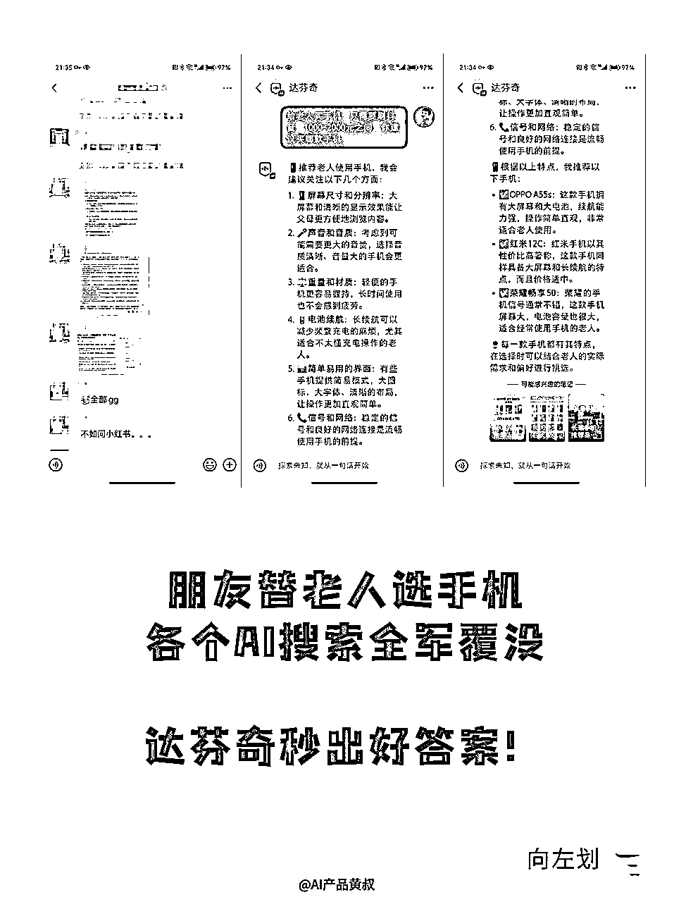

为什么呢？小红书在旅游、美食、美妆、宠物、健身等等品类上，有全网最优质的内容，只要在它优质内容的垂域里搜索，自然也最容易得到优质的答案！

当然这也带来了国内过去这么多年百度逐渐没落的老问题：数据被分散在各个App内。

# 02 索引库必备么？

结论：做通用AI搜索不必，但垂直搜索必备！

很多AI搜索依赖Google或者Bing的API来获得检索结果，为何呢？

这是因为Google和Bing自建了非常强大的搜索引擎，其中包含了强大的索引库，可以较好的保证搜索结果的质量，以及提供了不错的排序。

此时依靠这些传统搜索引擎，已经能解决95%的问题了！

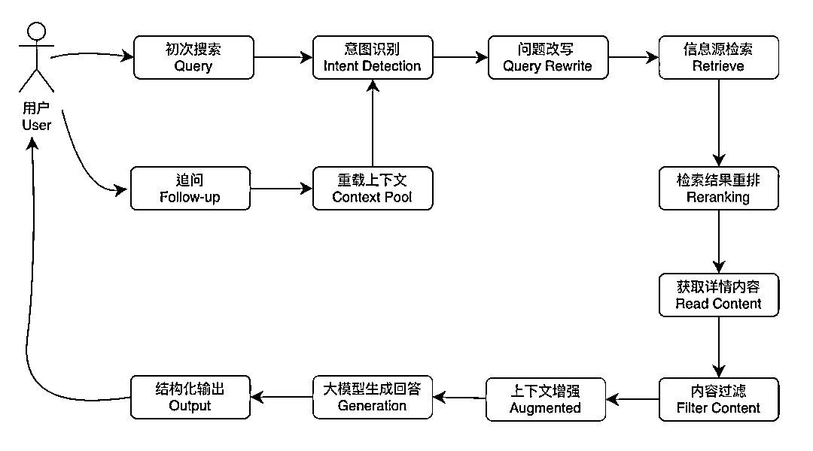

（以上是公众号 艾逗笔 在《我做了一个AI搜索引擎》一文内的流程图）

自建索引库的关键点在于：

假如你自建了索引库，能不能在检索结果重排时，保证你加入了自建索引库的召回结果后，比只从Google API获得的返回结果更好！

想象一下，你是一名园丁，你的任务是培育出最美丽的花朵。Google和Bing的API就像是大型的花卉市场，这里汇集了来自世界各地的花卉，种类繁多，大多数情况下，你可以直接从市场上购买花朵，满足你的园艺需求。

如果你决定自己建立一个私人花园，也就是自建索引库的比喻，你将面临一些挑战和机遇。你的私人花园可能不会立即拥有市场上所有的花卉种类，但你可以通过精心挑选和培育，种植出一些市场上不常见的独特品种。

这里面很关键的一点是：自建索引库是否能拥有足够多的高质量信源，保证每一次检索我们都能有比Google API返回的结果更高质量权重的URL插进来，那么最后再Reranking一下，这样AI搜索给出的答案质量就高。

但是这对于创业公司要求就很高，我们在和360VP聊AI搜索时，梁志辉就指出，索引库的建立和维护成本很高，爬5000万的网页，大概需要一两百万RMB。并且对于通用搜索引擎，5000万这看似很多的网页其实也只是洒洒水。

并且除了钱之外，更难的是，通用搜索引擎基本都索引了千亿级别的网站，360花了10年的时间，每年爬100亿的量级才能完成积累，并且这些网页还会面临过时等各种问题。

方汉也说：

我们公司做这个事情是因为我们原来在海外做 Opera News 这个新闻推荐产品的时候，从 16 年开始就自建了一个比较小的一个搜索引擎，我们当时每天大概索引 5, 000 万个新闻网站，我们整个 AI 搜索的引擎团队是一脉相承的，也就是说我们做这个搜索引擎的集群已经做了有七八年了。

但是不做索引库，就需要持续的给Google和Bing交API费用，“这个成本远比你的推理成本要高，而且推理成本在迅速地下降。”

所以上面的结论就是如果你要做通用AI搜索，就别考虑自建索引库了，不管是资源的消耗还是时间的投入，都极其困难。靠第三方提供的API快速的把商业模式跑通，可能才是王道。

当然这是大多数人不看好创业公司做通用AI搜索的一个主要原因。

那垂直搜索呢？这里进行到第二点：优质索引库！

索引库分很多种，刚才说的是一个最大的索引库，要在里面去捞到合适的内容，其实效率还是比较低的。可以在这个大库上面会有优质索引库，更优质、质量更好、更权威的内容会在里面，这样的优质索引库对于垂直AI搜索就会很有帮助。

因为前面第一章节也说了，AI搜索最大的关键点是数据！你知道这个垂直品类的优质内容和信息或者数据在哪里的话，是不是就能让AI搜索的结果质量更高了？

这是为何Perplexity在一开始从Academic启动，也是锚定垂类也方便去提前构建垂直索引库，保证初始的AI搜索效果非常优质。

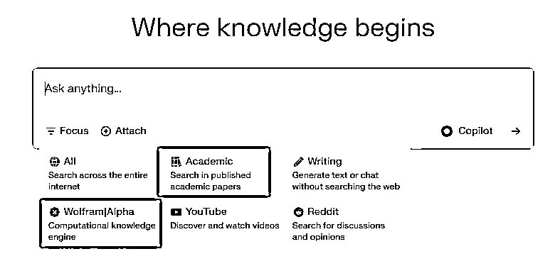

打个比喻来帮助大家理解索引库是否必备：

我们设想一个各种菜系都提供的餐馆，思考一下，你增加了一个菜品的供货渠道，能让餐馆有更多客人吗？这个就离得有点远了。

但如果你只做大阪和牛烧鸟，找到了一个精品货源，对于用户的口碑可能就会有很大的帮助。

# 03 垂类更方便于AI搜索初创公司切入

结合前两点，我们可以发现，不管是由于AI搜索最大的壁垒在于数据，还是索引库这一点，给到创业者的选择都是先从垂直切入会是更好的一种方式。

额外还有两点：

1.  有利于用户口碑和心智的建立；

1.  垂类更好整合进用户的工作流。

秘塔之所以被口口相传，有一点是科技工作者，或者是学生，查询资料时，可以快速获得海量的结构化信息，我猜想秘塔本身索引库也会在这些用户群体关注的内容品类上做更多覆盖，保证AI生成的内容质量。

前阵子秘塔又上线了播客搜索，这也是秘塔的用户群体喜闻乐见的：

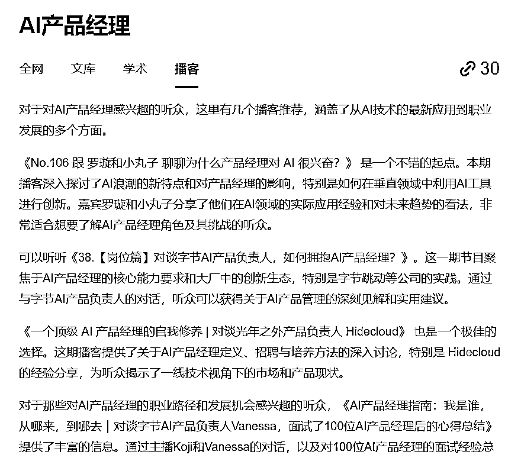

Repotify则更加具体，聚焦在财报研报等炒股投资人群的需求方向上：

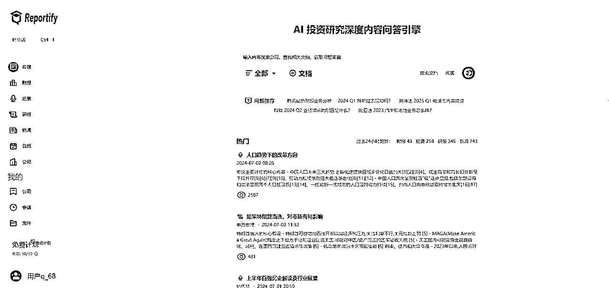

有时我自己查询一些企业的财报、电话会信息，也会打开使用。

再比如Devv，可以指定信息源，连接到指定的Github仓库来进行搜索：

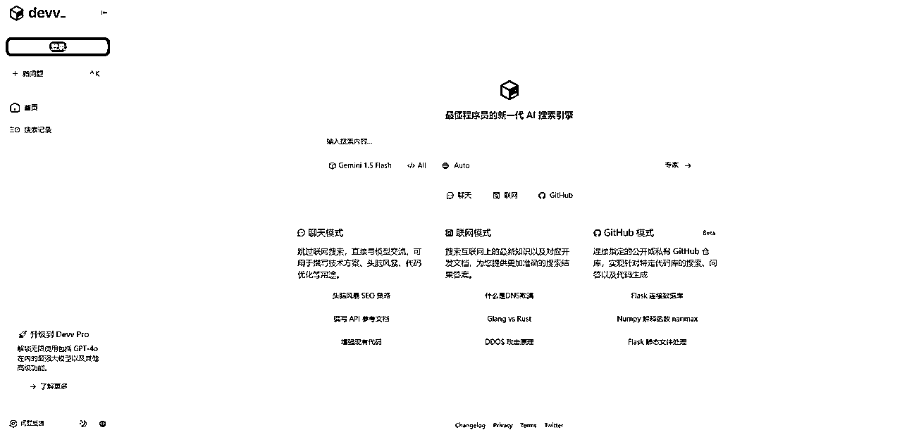

这种深入就是心智的建立：知道这款AI搜索产品能解决自己的问题！

对应的，垂直AI搜索也知道很多信息源在哪里，包括还有一些独到的用户需求能够更好地满足。

# 04 用户习惯的惯性对于AI搜索的意义？

结论：非常重要！

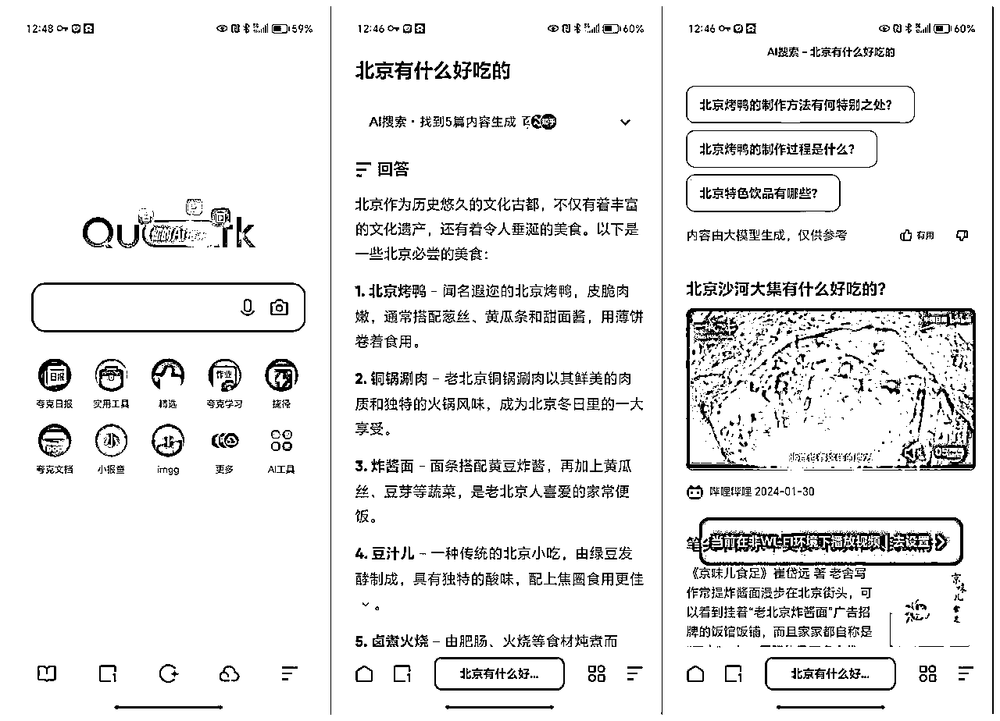

上图是夸克浏览器最近全面更新的AI搜索。

如果你是夸克的用户，会不会天然的就体验到了AI搜索呢？

我们设想一下，即使是过去百度最鼎盛的时期，依然有大量的用户不会去用它，为什么？还有其他的产品会占据用户的习惯呀，比如说搜狗和360的三级火箭里面，就会用浏览器来满足用户的搜索需求，你百度做的比Google更好也不可能抢走那批用户。

通用AI搜索很难做的一点是，用户习惯很难迁移，他用惯了夸克浏览器，就会继续用夸克的AI搜索，并且各家大厂包括Google都已经很坚决的推进AI搜索的情况下，你很难做的远超出Google去让用户转过来用你的，或者说，在Google全量上AI搜索之前，只会留出很短的时间窗口。

# 05 模型微调是必备的么？

结论：当前阶段非常有价值！

为什么呢？搜索是一个用户需求很泛化的场景，用户会问各种各样的问题，比如说：

黄河有多长？这种问题简短回答就行了

怎么哄小孩睡觉？这种问题可能需要给你个手把手的教程

所以搜索依赖的大模型能力需要在不同分支下，具备不同的回答能力。

360AI搜索已经把query的意图识别分类做到了4000多种，每一种需求配对应的Prompt。工作做得已经相当精细了，但梁志辉告诉我，这仍然只是很粗颗粒度的匹配。

我们在之前的AI搜索文章内也有提及。

你会好奇的是，为何360要做这么多Prompt工程，似乎也没说到微调的事情呀。

是的，这就是不同的解决方案。

Prompt也好，微调也罢，是对模型做不同力度的劝导！

目前阶段大模型对于指令的跟随效果不是特别优秀，所以当前阶段下，微调非常有价值。

# 06 AI搜索+Agent会逐渐盛行？

结论：大模型提供信息，Agent提供服务

未来大概率会演变成AI搜索是平台，上面的Agent是一个个的服务。

目前的Agent更多是用Prompt调教的，对于垂直的能力深度还是非常有限的，如果未来能做到AI搜索和AI Agent之间的紧密配合，就很厉害了。

换个思路，思考下微信平台里的小程序。微信提供基础的服务/信息，小程序提供各种垂直的服务。

进阶的一种形态是：Multi-Agent

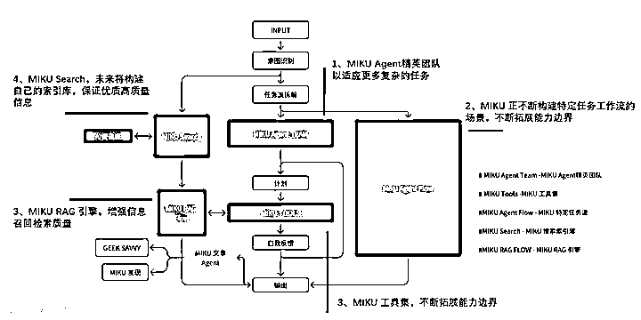

Miku AI搜索就很典型是一个基于Agent框架开发的AI搜索，吴恩达在AI Ascent 2024大会上指出：“基于GPT-3.5构建的AI智能体工作流在实际应用中表现比GPT-4更好”

除此之外，ThinkAny的创始人idoubi也考虑后续增加工作流Workflow，就是Multi-Agents，你可以认为前端是AI搜索，去检索信息，然后进入到用户自定义的Multi-Agnets里，最后经过智能体们的处理，获得用户自己想要的信息：

可以理解为AI搜索+Coze。

# 07 AI搜索生成内容，AI小红书会来么？

结论：是一个明确的趋势

我们在《拳打Google，脚踢Perplexity，Genspark要做美女给你打好饭还喂进嘴！的新物种》一文里，也提到了Sparkpage这套逻辑：

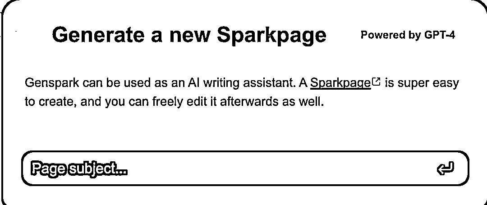

AI可以先生成一次结果，用户再在此基础上进行修改，相当于AI+人共同生成一个网页。

包括Perplexity也做了一样的Page能力。

从某种角度来说，这种逻辑是直接和人类创作者PK，是AI搜索+人去PK人类创作者。

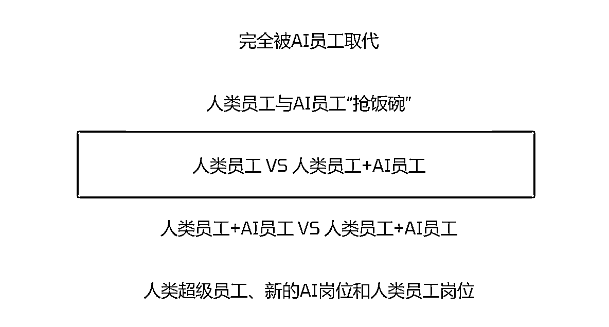

参考即刻@余一 的普通人的AI使用说明书，相当于中间那一层。

其实AI搜索走到这一步非常自然，就像我们理解各大厂和各大模型厂的效率工具都会加入搜索能力一样，只要理解搜索是为了后续效率工具获取信息，就可以很丝滑的get到这一点。

也就容易理解小红书很担心类似的产品：未来如果是AI+人也能生成高质量的内容，并且形成自己的社区生态，那必然和小红书是带来竞争关系。

# 08 AI SEO会逐渐形成共识？

上面这一点，其实衍生出一个结论：AI SEO马上就会成为共识

新的产品如何获得流量，已经开始逐步变成大家关注的话题了，那AI搜索也同样会面临这个困境，我们在Genspark一文里，提到了Genspark通过Agent生成Sparkpage的内容质量“很高”，这样的内容可以被Google收录，从而获得源源不断的流量：Come

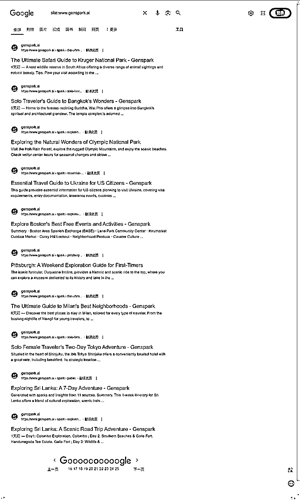

类似的流量获取机制，Perplexity已经深深受益了：

大多数 Perplexity 页面在 12 - 24 小时内继续出现在 Google 搜索结果中。

有趣的是，自 Perplexity 页面推出以来，公司域名的关键词可见度增加了 84.63%。

根据 Semrush 数据，在 5 月 30 日至 6 月 19 日期间，Perplexity 网站在 Google 搜索结果中的有机关键词数量从 24,839 增加到 45,864。

此外，网站出现在 Google SERP 特征中的次数增加了 49.09%。SERP 特征包括特色摘要和 AI 概述。

还需要记住的是，Google 并不介意这些页面充满了 AI 生成的内容。它关心的是内容的价值和创建这些内容所付出的努力。

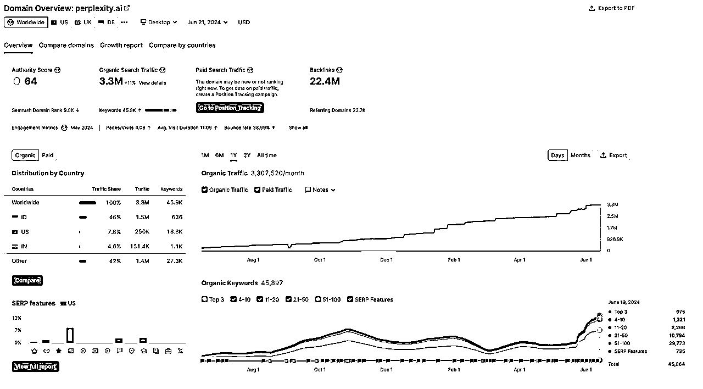

包括，Perplexity的Page页面都能出现在Google的AI Overview里面了：

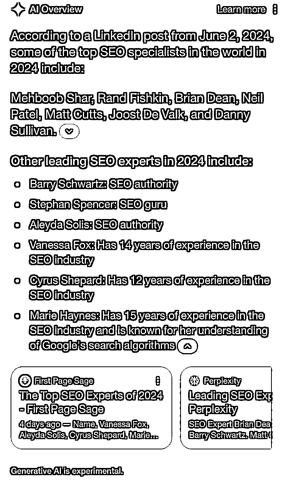

同样的，360AI搜索也通过每天晚上定时跑任务，并且通过更高优先级的方式插入到360搜索的索引内，用AI生成网页的方式，既满足了用户的长尾Query，又给AI搜索本身带去了流量。

AI搜索本身就是非常好的内容生成框架，结合AI SEO从传统搜索引擎吸取流量，也是前期快速成长的好方式。

# 09 有人说Sparkpage的内容质量一般，重要么？

结论：可能并不重要

沿着上面的思路，我们可以尝试去思考一个点：

不是所有问题都要直达终点

答案可以是一个过程，是一个中间态，这依然有很大的价值。

直白点说，Sparkpage能给到你一些启发，帮助你去优化自己的攻略/购买决策，已经很有效了。如果未来更多用户基于它去生成高质量的人+AI共创的内容，那真的就是AI小红书。

换个角度：

传统搜索里，Top10%的Query占据了95%以上的流量。这意味着AI搜索有一定的可能性把用户最关注的答案生成好！

# 10 AI搜索是一种退化？

结论：搜索从10个链接到1个答案是进化，但从视频到文字是退化

这是闭门会的一位小伙伴说的，传统搜索是菜市场，AI搜索是送外卖，但是，从视频到文字是退化！

相信你也会思考，为何AI搜索大部分都是文字结果的呢？Oh

我们来看看一些可能性：

这里面广义的AI搜索可以包含，并且可以实现的扩展能力有：

输入变得更加丰富和自由：

Query多模态：从只能文字+语音转文字输入，到Circle to Search、智能镜头，图片、视频输入等等

360AI搜索App已经上线了AI图片识别搜索能力：

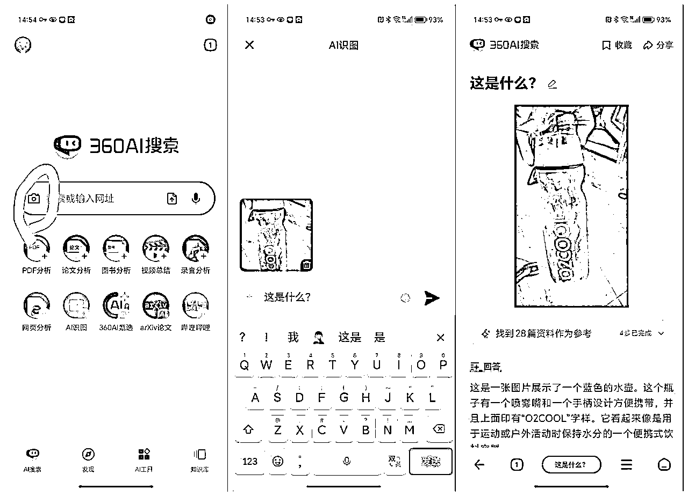

Google的Take a video，微软的Copilot陪你一起玩，在技术层面已经开始进入到了视频交互层面了，这是非常大的一个跨越。不难想象的是，一旦这类能力进一步整合到随身的硬件上，会有多么大的体验提升。

输出也会更多元：

1.  信息整合：AI OverView（链接、图片、POI、邮件、文档等），典型的可见产品为Genspark的Sparkpage；Perplexity和Tako信息卡片合作，使得输出内容可以支持图标，还有秘塔AI搜索可以直接把生成的结果信息生成PPT；

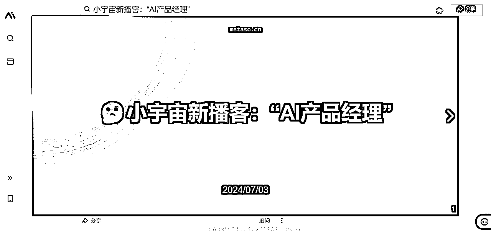

（秘塔AI搜索实现：Search Query to PPT）

1.  服务整合：Planning、Agent、Prompt-pic-Shopping等等

两者的边界同时在扩充，并且都可以更深度的理解用户的意图，这会让AI搜索可满足的用户需求，从过去仅仅提供信息/内容整理，扩充到工作生活学习的方方面面。

最近的一步，AI搜索更应该是把答案组织成用户更喜欢的载体，这可能是图文混排，或者包含视频，这涉及到的是信息的组织，Genspark的Sparkpage就非常典型，我们之前画过结构图：

所以，目前看只能生成文字的AI搜索，在局部确实是退化的。

# 总结

这篇文章，是一个阶段性的思考，期间有大量的使用AI搜索完成日常信息的搜集，有大量和行业从业者的沟通交流，这里感谢参与其中的各位。

接下来，我会继续关注AI搜索，这个市场上最快达成共识的方向，也会约见更多AI行业的从业者，线下约CoffeeChat，并且把思考笔记写在小红书（脱敏并取得对方同意），欢迎大家关注：

所以如果你是AI方向的从业者，欢迎和我约，我的微信是：lookforward，添加请备注“AI产品黄叔”，以及通过后麻烦发一个自我介绍。

# 参考

我做了一个 AI 搜索引擎

https://mp.weixin.qq.com/s/25eXZi1QgGYIPpXeDzkQrg

余一 普通人的AI使用说明书

https://gamma.app/docs/AI-Dev-9y7n4vslcp2bol2?mode=doc