# 如何从0-1，0成本月入3W＋？玩转小红书资料号我是如何做到的

> 来源：[https://w9qs13d2em.feishu.cn/docx/Q6yadJxJ2oAqTyxK0hjc0r7AnBp](https://w9qs13d2em.feishu.cn/docx/Q6yadJxJ2oAqTyxK0hjc0r7AnBp)

# 一、经历

大家好，我是阿超，22年大学毕业后，通过校招做了一年多销售，后来认识了星城哥（贵人＋1），也是星城大佬带我加入的生财（贵圈＋1）。生财当时给我的第一印象真的感觉怎么有这么优秀的地方，我竟然这么晚才发现😭，作为好奇心满满的小白，刚开始就对着精华帖一顿狂啃，慢慢发现还有很多教小白如何使用生财的文章，真的超级友好，我天！超级感谢亦仁大佬搭建的平台～

在生财熏陶了一年多，23下半年裸辞后接触了小红书小学资料项目，相关关键词下的文章基本都学习了好几遍，后来就又读到星城哥的文章，感觉自己缺一个大佬指路，就决定付费学习，没想到第一个月就直接起飞了，7天左右爆了第一个作品，当天上午就变现580米，后来就反复迭代，目前就全职做小学资料相关项目。

下面是一些自己的小小成绩，厚着脸给大家晒一下嘿嘿~

流量情况：

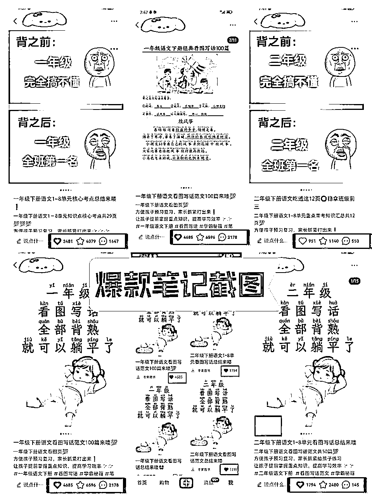

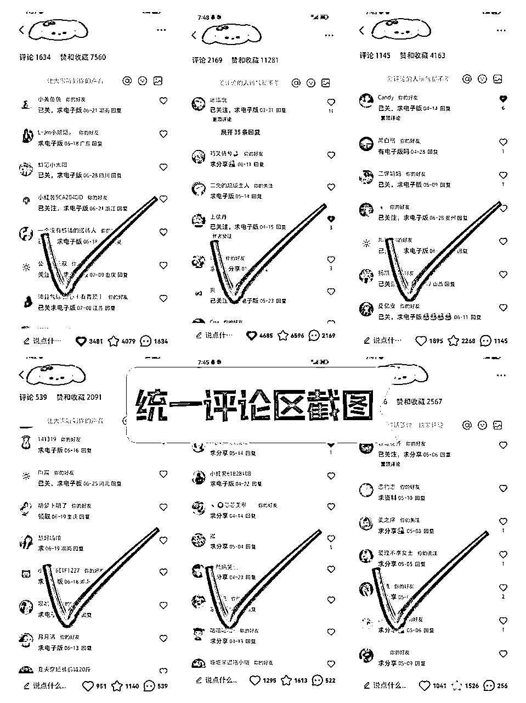

微信和收款情况：

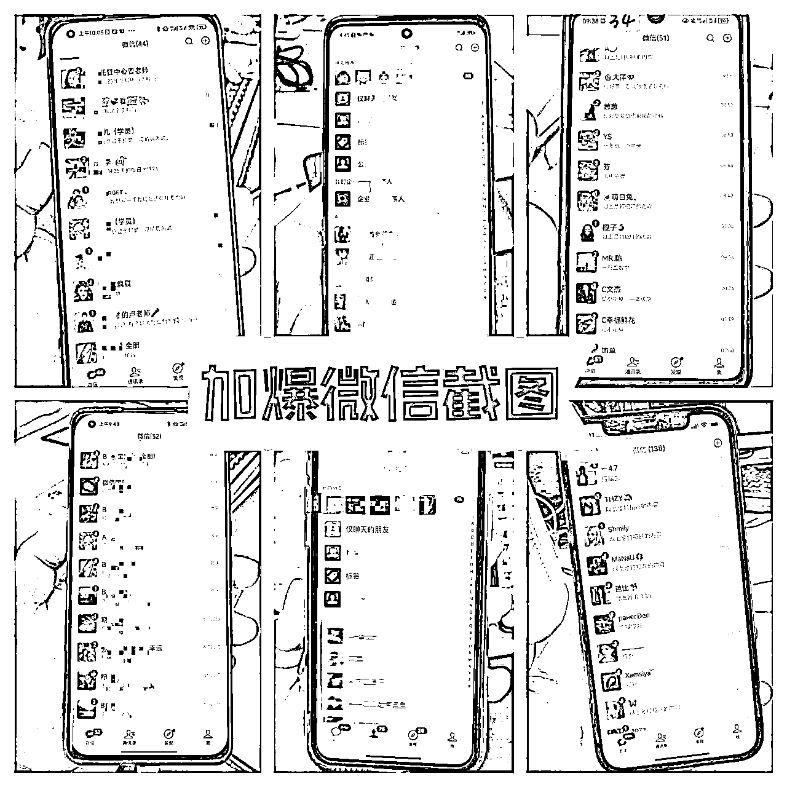

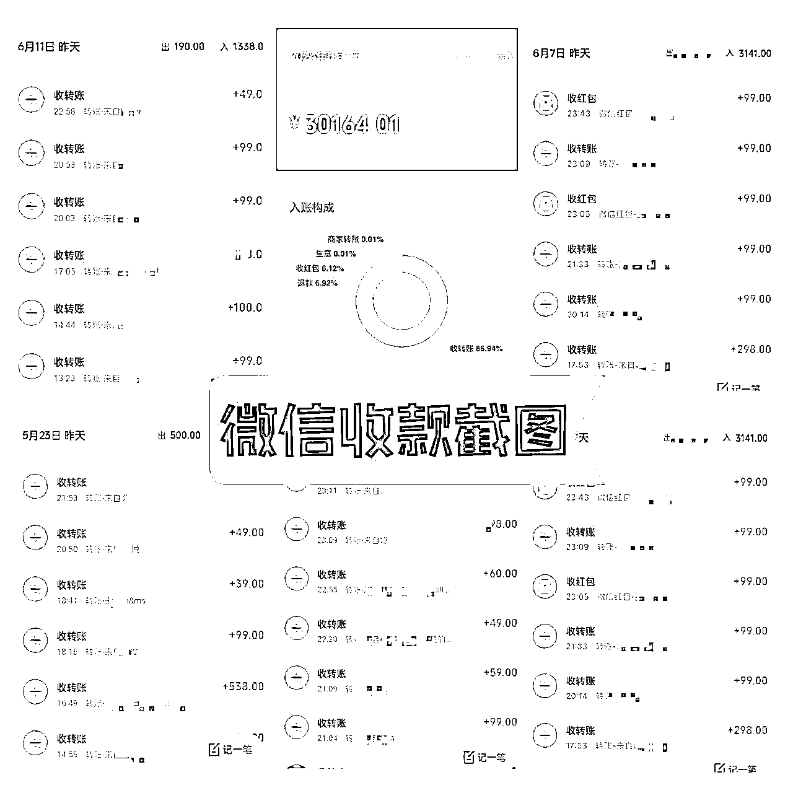

# 二、项目优势and劣势

## ①项目优势

虚拟资料几乎0成本，收益天花板高，身边朋友靠这个项目基本都能月入过万，月入5万、8万的也大有人在；而且这个群体每年都有更新，每年都有新的小学生，大家每年都需要新一年的教辅资料；可以一直做，需求大、有复购（换学期的时候大概有20%~40%家长，直接选择加入下个学期会员群，妥妥的被动收入）；因为家长都引流到了微信，好友数也是在滚雪球式的增长，就可以二次/多次变现。

## ②项目劣势

小学资料最主要的不稳定因素就是有明显的淡旺季之分。期末、期中、开学这些时间点都是家长最着急的时候，喜欢给孩子找资料复习预习，也容易变现，比如这个时候一天引流100人的话，淡季的时候可能30人都不到甚至更少，不过这个问题可以通过增加变现形式解决。

# 三、实操SOP

## ①、前期准备：

1.  设备：两个新手机＋两个新手机号，一个手机对应一个新手机号，手机可以去闲鱼买一个200-500左右的就行（尽量不要买华为安卓机，有的刷机会坏掉）。手机卡可以在公众号/知乎搜流量卡，月租19~29元的会推荐一大堆，自由选择就好（能打电话，不要买成纯流量卡）。

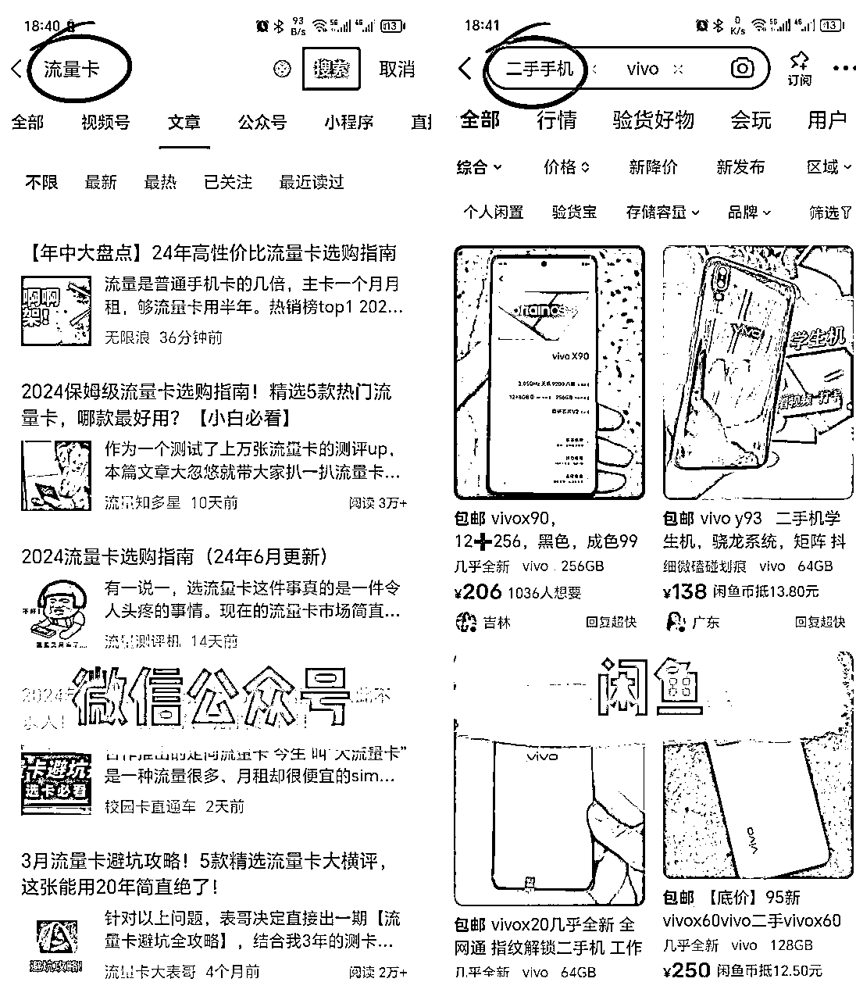

1.  手机恢复出厂设置，不要连接wifi，只用数据流量，防止小红书后台检测同一网络下多台设备登录，有封号的风险。

1.  新手建议准备好5-7天作品，再注册账号开始养号，防止笔记没起色就没信心断更等等（对有惰性的小伙伴很有用）。

## ②、养号

1.  基础设置

*   名称：简洁明了，不需要多文艺，例如自己定位是一年级资料分享，可以对应：XX老师一年级

*   头像：小红书搜索：女老师真人ai头像，选择一个贴近真人的图片去水印就行。

*   简介：直接模仿万粉以上的账号简介，稍微变动一点。例如：感谢小红书平台，每天分享一年级优质资料。

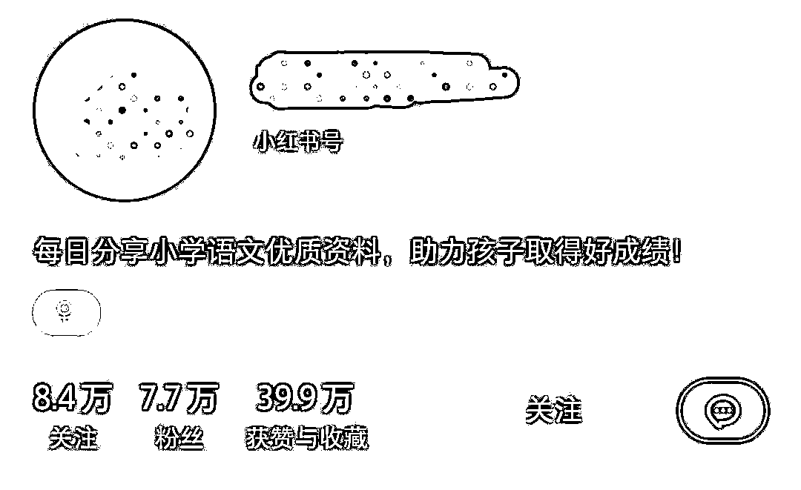

*   设置：小红书→我的→设置→隐私设置→把收藏/关注/粉丝全部隐藏。

1.  7天养号法

*   前7天每天刷同行视频/挂相关直播1个小时，保持活跃度就行，不用太纠结。

*   前3天每天发一篇作品，后4天每天发两篇作品。

*   7天内只发作品，除了有爆款100赞以上的情况，不要进行任何形式的引流和互动！！！

## ③、素材获取

【核心】：爆款是重复的，重点要学会找到合适的爆款/异常值。

1.  利用对标笔记的题材

*   先直接搜索自己要做的对标关键词，让小红书推荐机制认为你喜欢这一类的笔记，例如你要做二年级上册语文相关笔记，那就直接搜索“二年级上册语文”，然后对推荐的相关作品有选择性的点赞，收藏，多刷一会，然后再直接手动去小红书首页下拉刷作品，左上角第一个一般就都是二年级上册相关笔记了，然后再进行筛选

*   筛选条件：48h以内新发布的笔记/笔记点赞数＞账号粉丝数/账号粉丝数低于1000粉/一周内起的新号/多篇封面一致

（找不到就继续找，尽量不要放宽条件）

1.  根据题材寻找优质文件

*   提前搞几个文件库，花两天时间处理好分类。例如，可以直接从小红书加20个同行微信，先找同行买一个学期的，大约29-49元，看看群文件如何，筛选出符合条件的同行：①更新频率高，最好两天一更新，②总资料数量，1000＋文件以上，可能学期开始量会少点，③无水印，带水印有版权风险，④资料质量高。挑出符合条件的最好的3个资料库，再找对应同行，补款大约60左右进1-6年级全册群，这样就可以作为自己的基础资料库了，再把基础资料库资料整理分类到自己会员群里，保持更新频率就好了。

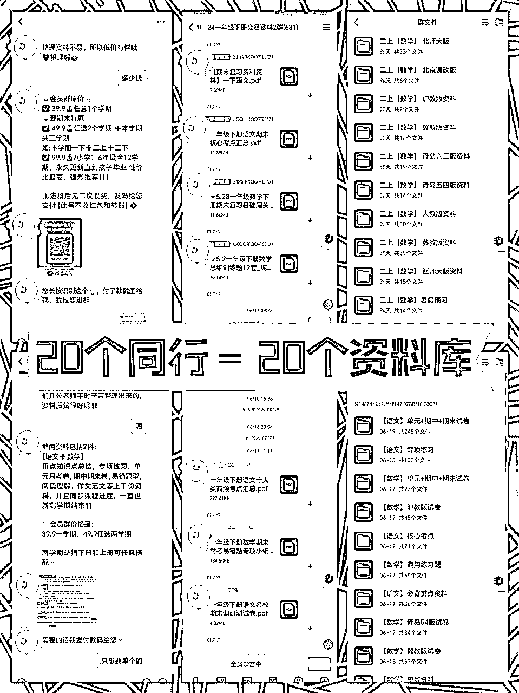

*   然后根据自己收藏好的对标笔记题材，例如，对标题材是：二年级上册语文1-8单元重点知识汇总，那我们就可以去文件库搜对应关键词寻找。因为同行文件库大多都是重复的，可能会找到一模一样的文件，或者两三个其他类型的二年级上册语文1-8单元重点知识汇总。根据网感筛选好优质文件备用，前期没网感就肉眼比对就好，不用太纠结，先做。

## ④、文件翻新

1.  字体：

*   字体识别-下载-安装，利用电脑上的字体识别网站，找到对应的爆款字体，安装到电脑上，或者直接开个WPS会员，里面找相似的字体。

*   把文件字体改为爆款字体，合适字体大小。

1.  页面布局：

*   页面布局-窄，窄边距会显的页面满满的，家长感觉很有获得感。

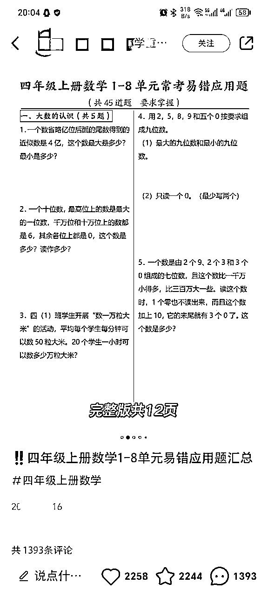

*   字间距-行间距-段落间距调节合适。

*   分栏的应用，例如期末易错应用题60道等段落相似的文件，可以多用分栏功能。

1.  字体颜色：（以下为示例，爆款颜色可能会有变动，可根据对标进行总结）

*   常见爆款字体主色：黑色、红色、蓝色、青色

*   常见爆款字体背景：标黄、标绿、红字标黄、红字标绿

注：前期字体和排版尽量模仿对标笔记，有能力做爆款之后再总结。

## ⑤、图片处理

1.  封面处理（推荐黄油相机）

*   可以把对标封面去水印后拿来修改，用美图秀秀抹除所有文字部分，再用黄油相机加上相似文字，可额外加小贴纸去重。

*   通过黄油相机草稿箱可以保存封面，随时修改/下载

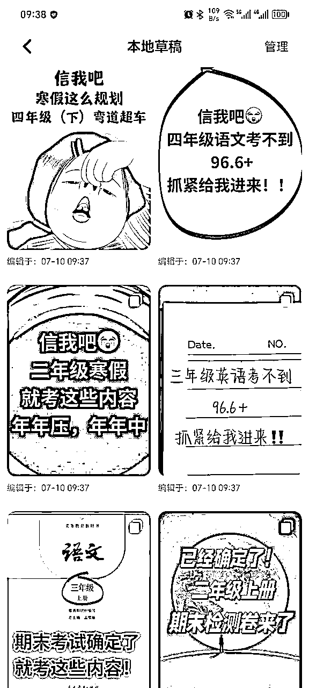

1.  内容图处理（推荐美图秀秀/创客贴/稿定设计）

*   以美图秀秀为例，可以给提前导出好的内容图，加边框/背景/滤镜/贴纸，简洁、搭配好看。

## ⑥、标题文案

1.  标题，可以在搜集对标的过程中对爆款标题进行分类收集，一般同一时段最🔥的标题很多都是大同小异的，然后自己可以根据收集的标题把头尾重新拆分组合，形成自己的新标题，我给大家收集了一些爆款标题，并进行了分类，小伙伴们可以对比一下。

1.一天一页，老师发的

二年级期末前刷起来，一天一页真好用🔥

老师发的；期末一天一页真的很好用啊✌

一年级老师发的，1-8单元八大考点默写单

老师发的；期末一天一页真的好用啊✌

老师发的；一天一页期末稳上98➕

老师发的；一天一页期末真的有进步呀✌

一年级老师刚发的，1-8单元基础知识默写单

老师发的：二年级数学期末‼️不愁了🔥

2.……吃透……稳上

一年级语文期末吃透这13页（纸）稳上98➕

一下语文吃透这8张纸稳上98+❗️🔥

二年级下册语文吃透这12页㊙️稳拿班级前三

3.……吃透……反超

一下语文期末吃透这12张纸，反超❗️

三年级语文下册期末吃透这12页✌反超

二年级下册语文死磕这16页纸，反超🔥

三年级语文下册吃透这12页，✌期末反超

1.  文案，一般两到三行就够了，把标题重复/扩充一遍，再加上委婉的小钩子，例如：一年级上册期中复习常考易错题60道‼️完整🉑打茚💯

## ⑦、爆款底层逻辑

【核心】：爆款都是重复的，我们一直多发笔记也是为了测出爆款，然后一个重复怼这个爆款，吃完这个爆款的流量后再测下一个爆款。

1.  爆款打造是模仿别人爆款的过程：先做到100%相似再去重到80%相似。

1.  爆款复制是微调自己爆款的过程：通过修改文件以及组合新的边框/背景/滤镜/贴纸，对原来笔记做去重后重新发布。

## ⑧、引流

1.  提前建3-5个小红书群，群名模仿对标账号的，不要自己想，容易违规，群名例如：家长👀这里↓。

1.  笔记置顶评论引导家长加关注和评论。小红书CES评分=点赞数×1分+收藏数×1分+评论数×4分+转发数×4分+关注数×8分，重点是关注和评论，互动越多笔记流量也会更多。

1.  及时回关拉群、回复评论、私信。一般回复越及时转化率越高，因为小红书不像微信，微信有新消息我们会特意点开看，小红书消息不及时别人可能就看不到了，很影响转化率。

1.  可以用小号在群内引导家长加微信，模仿对标账号的引导形式即可。切记大号不要在群内做任何发言！切记大号不要在群内做任何发言！切记大号不要在群内做任何发言！（重要的事情说三遍）

## ⑨、变现

1.  变现形式

*   资料会员群：一般分为39元学期群、59元学年群、99元1-6年级全册、自定义超级会员。超级会员可以定义高级一点，和普通资料会员区分开。例如：①会员时限上，普通会员每用完一学期会清退，超级会员为永久权限；②会员服务上，超级会员可以在普通会员的基础上增加额外服务，例如免费赠送语文数学视频课、中英文动画片、特色课程等。③价位上：超级会员可以根据服务的不同，定价在199-599之间。

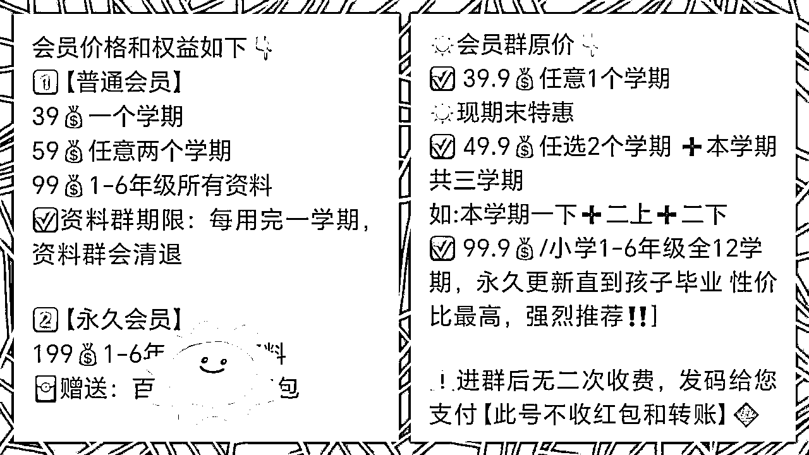

*   网课直播课代理，比如抖音小红书学习博主课程，可以联系代卖，一套几千的网课佣金都大几百。或者找有资源的同行拿，不建议打包别人的网课直接卖，会有版权©风险。

*   寒假班暑假班代理，客单价不高，但利润和出单量还可以。

*   收学员，如果做的比较熟了，就可以自己出课程卖，或者收学员培养，教别人如何拿流量，如何变现。

*   因为收的都是宝妈粉，适合小学生家长这类人群的周边产品，都是可以尝试的，例如快团团/淘宝客卖学习用品也是可以的。

1.  话术

你好，我是XXX，很高兴认识你，请问需要几年级的资料呢？

我们的资料是进会员群下载，每天各年级都有专门的老师负责编辑整理2024学年最新资料❤️❤️❤️

群内资料包括：重点考点内容，知识点整理，期中期末试卷，单元检测卷，专项训练资料，易错题型，作文范文等，进群后

资料随便下载打印，我们会持续更新的👍

整理资料不易，所以低价有偿哦♥️望理解😊

☀️会员群原价👇🏻

✅ 39.9💰任意1个学期

☀️现期末特惠

✅ 49.9💰任选2个学期 ➕本学期共三学期

如:本学期一下➕二上➕二下

✅ 99.9💰/小学1-6年级全12学期，永久更新直到孩子毕业 性价比最高，强烈推荐‼️]

⚠️进群后无二次收费，发码给您支付【此号不收红包和转账】

✅（收款码）

您长按识别这个👆🏻，付了款截图给我，我拉您进群

拉人进群后告诉别人怎么找资料就好了，可以学习同行的视频/图片进行制作。

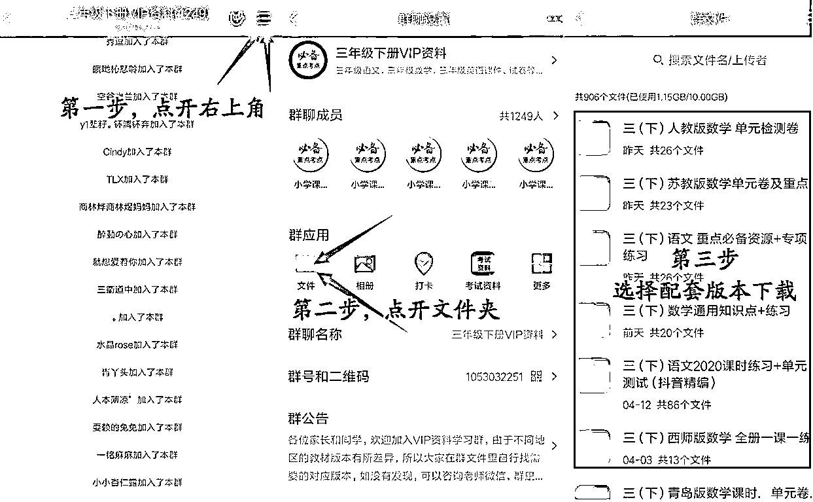

话术不固定，可以多加几个同行，学习别人怎么聊的，来总结适合自己的话术。

# 四、总结

小学资料在小红书和抖音等平台都是可以玩的，抖音自然流目前还比较好搞（后面大家反馈好的话可以出一期针对抖音的小学资料玩法），建议抖音和小红书一起搞，不过玩法不太一样，学会一个平台的玩法，有些技能也是可以直接横向迁移到另一个平台的，马上9月份又开学啦，想试试水的圈友可以抓住这波流量哟～

上述玩法适合小白实现0~1，小红书想要放大，实现稳定收益，根据平台风向后期还是需要投聚光比较合适，付费流符合平台利益，也更加长远。正常在开学季单粉变现在15-20米左右，后端多次转化做好的话，还会更高。聚光单人开口成本大约在3~5米，想快速拿量的话6~8米就可以飞起来。

# 五、结尾

最后再次感谢亦仁大佬提供那么好的平台，感谢杨涛老师、星城老师对文章内容的指导，让我有机会在生财分享自己的小结果，希望各位生财的小伙伴在2024一起生财有术~

哈哈哈😊，第一次写长文，欢迎圈友评论区提提意见哟～