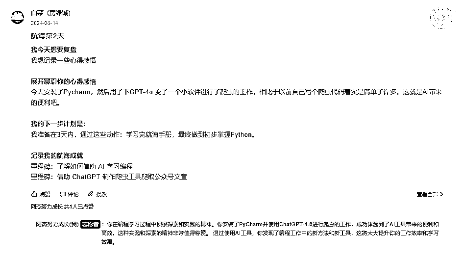

# 24年6月 AI编程(爬虫)航海 - 志愿者复盘

> 来源：[https://hqhhkfm2ink.feishu.cn/docx/BMGRd8TuioOfLDxykwUcdug8nxj](https://hqhhkfm2ink.feishu.cn/docx/BMGRd8TuioOfLDxykwUcdug8nxj)

# 1、自我介绍

大家好，我是阿杰，目前担任Java程序员，专注于后端开发工作。作为一个热爱编程和技术分享的从业者，我一直希望能够在技术领域有所突破和贡献。这次，我有幸第一次在生财有术担任志愿者，负责「AI编程（爬虫）」航海项目的支持工作。

选择这个项目并非偶然。因为我从事程序员相关的工作，对AI和编程有着浓厚的兴趣。

我希望通过这次志愿者工作，不仅能够帮助更多的圈友掌握AI编程技能，也能从中收获新的知识和宝贵的实践经验。

在志愿者期间，我得到了领队Rice的高度认可和夸奖，这不仅是对我工作的肯定，也极大地鼓舞了我继续努力的信心。在这里，我想分享一些自己的心得和体会，希望能够对大家有所帮助，让更多志愿者和船员在生财有术的平台上共同成长。

# 2、成绩

本期航海，我所带领的小组中，总参与航海人数 31 人，最终上岸 31人，上岸率 100%

其中，2 位船员实现满勤，成为行动的巨人

1 位船员打卡 15+ 次，解锁了“航海王者”称号

所有船员打卡 12+ 次，成功上岸～

我自己也完成了21天满勤，成为行动的巨人。

# 3、为什么选择当志愿者

## 3.1 转换视角

我是去年加入的生财有术社群，从那时起，我没有错过任何一期航海活动，但都是以船员的身份参与。今年续费时，我下定决心不再仅仅做一个船员，而是要主动承担更多责任，成为一名志愿者，贡献自己的力量。

## 3.2 做志愿者想要收获什么？

当然，仅凭一腔热血是不够的，任何事情都需要一个与之匹配的正反馈。以下是我希望通过志愿者工作收获的几点：

1.  锻炼利他的心态 生财有术社群有一条重要的价值观：真诚利他。亦仁曾说过：“保持真诚，保持利他。这一条原则，让我在过去十几年里持续受益。”我希望通过志愿者工作，培养利他的心态，用现有的技术和资源帮助他人，也期待未来在我需要帮助时，能得到他人的回报。

1.  链接新朋友 作为船员时，我与志愿者有过最多的交流。平时在社群中发言较少，是一个“生财小透明”，平常社交圈子也比较窄。我希望通过志愿者这个身份，认识更多志同道合的圈友。这也是我选择AI编程航海的原因之一。

1.  学习如何运营社群 刚开始时，我在预备群看到有人说现在不允许拉小群了，感到有些失望。但后来得知，只要能够给船员带来更多价值，并向生财报备，拉小群是可以的。这让我看到了在运营社群方面的学习机会。

1.  获得术值 最后但同样重要的是术值。术值可以兑换生财门票。今年的目标是，即使没有在副业上赚到钱，也要通过志愿者工作获得足够的术值，换取下一期的生财门票！

# 4\. 前期准备

## 4.1 报名准备

1.  选择感兴趣的航船 首先要争取报名自己喜欢且感兴趣的航船项目。在航海过程中，与船员一起学习、成长和交流。例如，我对AI非常感兴趣，所以这次选择了AI编程和ChatGPT的航船项目。

1.  志愿者带头打卡 个人认为，打卡是记录和复盘的重要工具。通过每日打卡，志愿者和船员可以详细记录自己的学习成长和航海中的好事，便于日后复盘和反思。这种持续的记录不仅帮助我们深入了解自己的进步与不足，还能通过复盘总结经验，找到改进的方法。而且志愿者带头打卡不仅是一种榜样的力量，同时能够激励大家每天坚持记录，形成一种积极的打卡氛围，促进整个小组的共同成长。

1.  兴趣驱动 选择自己喜欢的航船项目，会让打卡更有动力和热情。

## 4.2 开船准备

这次的AI编程是第一次开船，没有往期的航海手册，但有航线图可以参考。

从航线图中，我了解到本次航海需要准备的工具，对航海内容有了大概的了解。提前带船员们进行预习，例如安装Python和开发工具。

为了大家能在航海中有个好的体验，出于程序员的专业出身，给大家提供了一些快速入门和起跑的知识，不仅能够增进大家对航海的兴趣，也快速的增进了船员之间的联系。

这样我也能快速的让船员们知道，我是可以帮他们解决问题的，后面也确实有船员主动来找我解决问题。

## 4.3 创建一个AI志愿者【阿杰】

为了更好地支持航海活动，提高工作效率和信息准确性，特创建了一个AI志愿者【阿杰】来辅助工作。借助AI工具，可以更高效地处理大量重复性任务，提供建议，确保信息传达的一致性和准确性。

步骤：

1.  下载志愿者手册（这个文档是支持下载的哈）：

*   将志愿者手册喂给GPT。

*   这里可以选择其他的AI工具，这个功能在我们国产的大部分AI对话工具中都支持，例如KIMI。

1.  利用AI工具：

*   使用AI工具进行辅助工作，如解答常见问题，提供技术支持和建议等。

*   这不仅能提高工作效率，还能确保信息的准确性和一致性。

通过创建和使用AI志愿者，能够大幅度减少人工处理的时间和精力，提高了信息处理的速度和准确性。

在实际操作过程中，AI志愿者可以快速响应船员的提问，提供准确的技术支持，并能记录和跟踪项目进度。

# 5、航海过程

## 5.1 帮助船员解决问题后，鼓励趁热打铁，写好事记录日志

在帮助船员解决问题后，及时鼓励他们趁热打铁，将成功的经验和所学知识记录下来。能够帮助船员更好地消化和吸收新知识。

## 5.2 拉小组群

建立小组群的目的是为了提升信息传递的效率，加强船员之间的互动和联系，并及时解决船员在航海过程中遇到的问题。

通过小组群，也可以更好地和船员同步小组整体的打卡情况并激励船员坚持打卡，从而提高整体的打卡率和活动参与度。

### 5.2.1 方便消息实时同步通知

通过小组群，可以实时同步通知所有船员，确保信息传递高效、及时。

### 5.2.2 催打卡和同步打卡情况

通过小组群每天催打卡和同步打卡情况，旨在确保所有船员能够及时完成每日打卡任务，保持小组的整体打卡进度和参与度。同时，通过分享好事记录，可以激励船员们持续参与，增强凝聚力和互动性。

### 5.2.3 分享小技巧

通过在小组群中分享自己平常使用的小技巧，为船员提供实用的工具和方法，帮助他们更高效地完成任务。毕竟AI编程属于技能型的航海项目，AI也是我们航海用来提效的工具。

### 5.2.4 夸奖船员

航海大群非常庞大，每天都会发生许多好事，不可能所有人的好事都能在大家面前展现出来。通过小组群这样的小集体公开表扬优秀船员，可以激励其他成员向他们学习，努力提高自己的表现，从而激发积极性和参与度，形成积极向上的小组氛围。

特别是下面这位第一次参加航海，我组里的榜一大哥。

后来他跟我一起实现了21次打卡，获得“行动的巨人称号”，最后排在航海个人榜第二名。

遥想我第一次参加航海的时候都是勉强完成12次打卡的。

### 5.2.5 组内互动（花式催打卡）

这个方法还是在志愿者群里学到的，哈哈。我觉得采用有趣和创新的方式进行催打卡，可以让船员们感受到活动的趣味性，而不仅仅是任务的压力，从而提高他们的参与热情和打卡频率。

此外，这种方式从外面看还有一种迷惑性，效果类似于 “[微信红包]恭喜发财，大吉大利”，不知道大家有没有被这样的 '红包' 诱惑过。

## 5.3 提醒船员打卡

在提醒打卡方面，我采取了逐步优化的措施：

1.  初期逐一提醒：前三天，通过逐一对没有及时打卡的船员私聊提醒，确保每位船员能及时适应打卡要求。

1.  反馈收集与优化：第四天，我收集了所有船员关于打卡提醒频率的反馈。大部分船员表示不需要每天提醒，只需在小组群中统一提醒即可。减少不必要的提醒频率，使提醒更加高效，并适应个体需求。

1.  关键时期重点关注：对于连续三天未打卡的船员，立即私聊提醒，避免遗忘打卡。特别是在最后几天的冲刺阶段，进行更频繁的提醒，确保所有人都能按时完成打卡任务。

### 5.3.1 新船员的催打卡话术【供参考】

【船员昵称】你好呀，我是航海志愿者【你的昵称】。欢迎第一次参加航海，看到你还没有打卡，可能是遇到什么问题了吗？打卡是我们航海中的重要一环，我可以帮助你了解打卡的流程或者解决遇到的问题哦。我们一起努力，争取在航海中取得好成绩！期待你的回复~

### 5.3.2 老船员的催打卡话术【供参考】

【船员昵称】你好呀，我是航海志愿者【你的昵称】。看到你参加【航海次数】次航海，经验丰富！不过这次还没看到你的打卡记录，是遇到什么困难了吗？我可以帮你解决问题，或者我们可以约个时间语音沟通，一起完成打卡。期待你的回复哦~

### 5.3.3 为什么区别对待？

目的是根据船员的不同参与经验，提供更有针对性和个性化的支持和提醒。这样可以提高船员的参与感和责任感。

首先，新船员可能不熟悉打卡流程和要求，采用欢迎和引导的语气，可以帮助他们更快地适应活动，并解决他们在初期可能遇到的问题。而老船员已经有了一定的参与经验，采用更加直接和鼓励的语气，可以有效地提醒他们继续保持打卡习惯，同时提供必要的帮助。

## 5.4 查看所有的船员日志，适当互动，点赞&评论

查看所有船员的日志，适当互动，点赞和评论，旨在鼓励船员持续参与和分享，增强他们的成就感和积极性。同时，这也可以及时了解每个船员的进展和困难，提供必要的支持和帮助。（看看有没有水日志的船员）

之前我在做小红书的时候，创作了一些鸡汤类的作品。有些网友会在我的作品评论区分享他们最近遇到的事情和心情，我一一鼓励了他们。他们给了我很多正反馈，有的说心情好了一些，有的感谢我，还有的果断关注了我，哈哈。

## 5.5 处理水日志

中间遇到水日志的船员，立刻进行纠正，目的是帮助船员理解日志的本质——记录和复盘。这不仅能提升日志的质量，还能让船员更好地反思和总结，从而在航海下场实操中不断改进和提高。

看到船员做出改变并取得结果后，立刻主动给予积极的反馈和鼓励，可以激发他们的积极性。这不仅让船员在得到认可的同时，更加愿意认真记录和复盘。

从那以后，这位船员一直到上岸都不需要我再去提醒他了。

## 5.6 最后的冲刺时刻

对于还没有上岸的船员，采取每日催打卡的机制。

【船员昵称】船员，这边看到你已经打卡【打卡次数】啦，再打卡【剩余次数】就成功上岸啦！

* * *

对于快要上岸和已经上岸的船员，鼓励他们冲刺更高的目标，如航海王者和行动的巨人。

【船员昵称】船员，我来提醒你今天的打卡了，这边看到你已打卡【打卡次数】，再打卡【剩余次数】我们就可以上岸啦，而且还有余力冲刺一下航海王者哦！

这里主要是确保还没有上岸的船员能够及时完成打卡任务，同时激励已经上岸的船员继续努力。虽然我在填写志愿者报名表时，目标写的是90%，但是如果有机会冲刺100%，为什么不去拼一把呢？

# 6、回顾

其实刚开始被选为志愿者的时候，我也不知道自己能否胜任这份工作。不过，在与领队和其他志愿者的交流以及实操过程中，我发现做志愿者好像也没有那么难。特别是看到有船员本来计划在这21天的航海之旅中划水度过，但因为我的行动而改变了想法。我开始意识到，每个人都可以通过自己的努力和行动，影响和激励身边的人。

这位船员在这次航海也实现了21次满打卡，获得了“行动的巨人”的称号。

## 6.1 收获

1.  运营技巧：本次航海收获了一些运营社群的技巧和整体流程，如果以后做社群运营，我觉得这是一个很好的经验。

1.  编程与记录：虽然我并不是一名Python程序员，但在航海期间，我每天都记录自己的学习笔记。未来，我或许可以制作自己的航海手册，并作为一个产品出售出去，哈哈。

1.  社交圈扩展：在航海期间，我认识了很多从事各行各业的圈友，并与他们互相交流了经验。例如，我向他们传授了编程经验，有的圈友则向我传授了Web3的经验，咦，这好像就像我开头说的，培养利他的心态，用现有的技术和资源帮助他人，也期待未来在我需要帮助时，能得到他人的回报。没想到反馈这么快就来了，哈哈。

## 6.2 反思

尽管收获颇丰，但在反思中，我也发现了一些需要改进的地方：

1.  时间管理：虽然在项目管理中有所提升，但在繁忙的工作和志愿者任务之间，有时感到时间不够用。我需要更加合理地安排时间，提高效率，以更好地平衡工作和志愿者活动。

1.  工具使用：我可以更加充分地利用一些辅助工具，例如易歪歪，来提升工作效率。这些工具能够帮助我更好地管理信息和进行高效沟通。

1.  团队互动：我觉得在这方面我还可以做得更好。通过加强与其他志愿者的合作，可以共享经验和资源，提升做志愿者期间的工作效率和效果。