# 关于互联网搞钱，我说一个很猛的赚钱偏方！

> 来源：[https://xqulkwki4ye.feishu.cn/docx/Sj4adzHsdoCyeOxAE26cDKYnnXR](https://xqulkwki4ye.feishu.cn/docx/Sj4adzHsdoCyeOxAE26cDKYnnXR)

我在生财写文章做分享的时间不多，截止到目前，一共写过两次，全部是精华帖：

我的互联网搞钱思维分享：我是意外挖掘出日入1000的小项目变现复盘https://wx.zsxq.com/dweb2/index/topic_detail/411284481815828

我是如何用10个中老年种子用户，打通《小程序流量主自动裂变终极玩法》

https://wx.zsxq.com/dweb2/index/topic_detail/188111288514842

这两三年大环境不好，大家都是知道的，不只是你们手里没钱，像我的朋友圈，以及身边的很多老板都破产了。

原来开百万豪车的人，现在骑共享电驴：

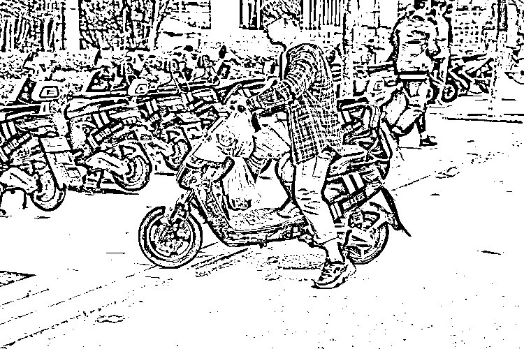

原来住别墅的老板，现在租房子住：

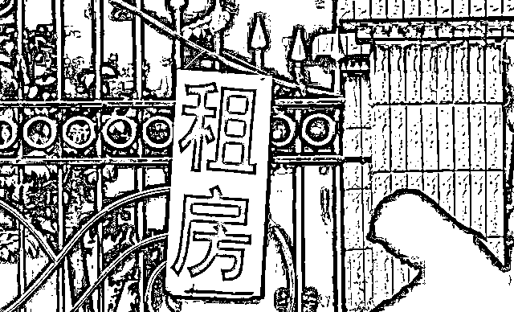

说实话，这也是没办法的事儿，这几年很多被市场所淘汰的企业都是那些重复度过高，门槛又低的，换句话说呢，就是这些企业的盈利模式太过于简单，比如那些低端一点儿的制造业，与建材建筑相关的企业等等，他们无非就是赚个差价，以前还可以大富大贵，而现在整体经济在下行，整个链条上都没有钱可赚，就连王思聪的女人问她要孩子的抚养费，都说先撑过今年再说：

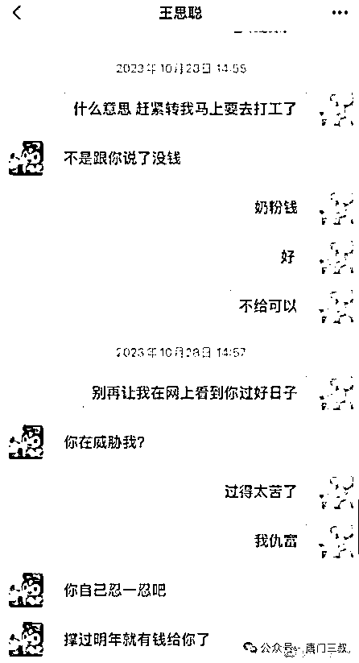

所以说，整个链条上从头部到尾部，都在勒紧裤腰带，那作为散兵游勇的普罗大众是站在整个链条的末端的人群，当然也是最惨最倒霉的，比如，利润率一下降你连工资都发不起，撑不了几个月就得马上倒闭。

然后呢，最近几年一夜暴富的新闻又总是发生在你摸不透，看不清的互联网，就比如说这个最近大火的郭有才：

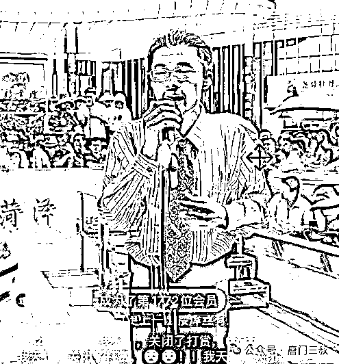

其实很多大哥大姐们并不明白，为什么有人在互联网上火了之后，就会有钱呢，这个钱从哪里来的，是谁给的钱？

这就属于互联网的线上经济范畴了，说白了呢就是一种影响力的经济模式，谁的影响力大谁就会有源源不断的广告商找他打广告，这个就和明星代言差不多是一个意思，但互联网上的人火了之后，我们且不看广告费，就是他的每一个普普通通的粉丝，每天给他打赏的这个数字加起来，将会是一个普通人一生也无法触及到的天花板和高度。

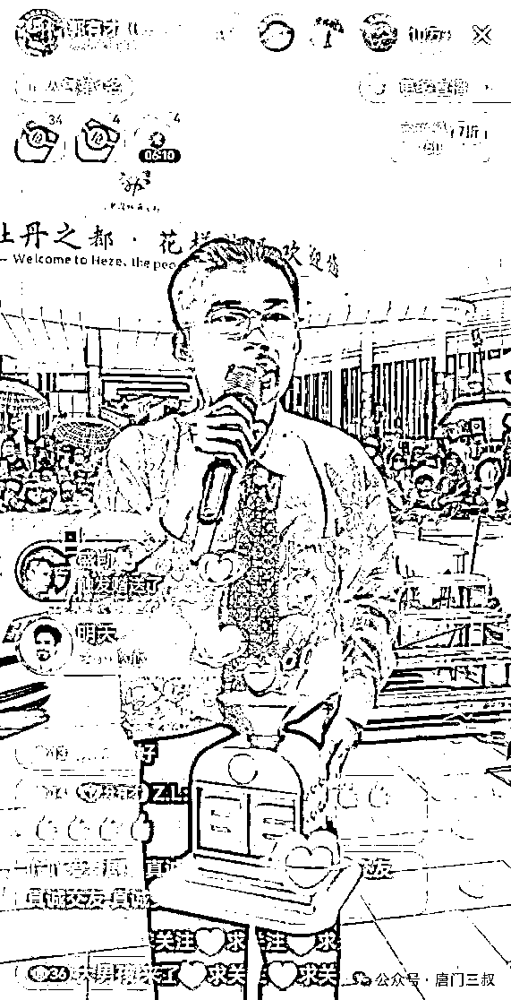

而像这样的盈利模式，你很难一句话去把它说明白，但我仍然希望你能理解，正是因为这样才能让一个人在经济下行的大环境下，时时刻刻的，依旧保持着赚钱的状态。

反过来讲，如果你现在做的事情太过于简单了，自然而然的就会有许多人一看就明白，普通人都能看的明白竞争力就会很大，竞争一大，你搞我一下，我就捅你一刀，最后形成恶性竞争，谁也别想好过。

所以，现在能赚钱的生意，一定是去做别人看不透的事情，然后狠狠的在里面潜伏，深耕一段时间，这样你赚到钱之后，别人既看着眼馋，但是呢，他又不知道该怎么模仿你，一时半会他也进不来，搞不明白，更别谈取代你，所以呢，他也只能眼巴巴的看着你大把大把的捞，这叫什么：对，闷声发大财！

所以啊，在线下做实体生意也好，在线上搞项目也罢，一定要去讲究一个原则，去做那些长期利他主义的事儿，去深耕那些别人看不透，不愿意去做的赛道或项目。

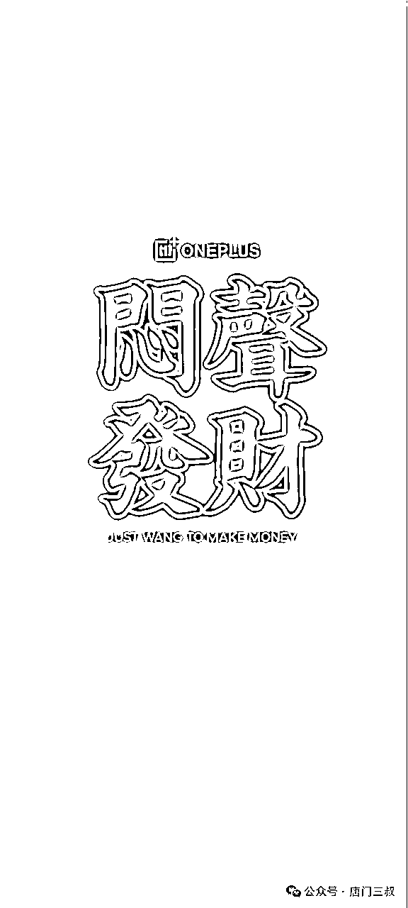

最近天气越来越热，有几个以前的好朋友前段时间的某个晚上，约我一起喝酒吃夜宵的时候问我，说你现在怎么不上班也能活的这么好，我跟他说我在做私域IP和视频号带货捞钱，人家哥几个一听捞钱，当时两眼就放光，借着酒劲儿说带带我呗....

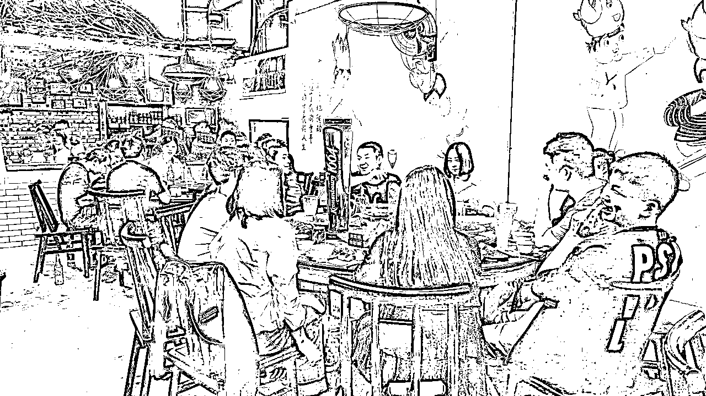

我说可以啊，你先拿出10万块本金来，人家一听要10万的本金，就开始打退堂鼓，然后又说，我现在就是没有钱啊，有钱还让你带干吗，还有没有别的什么好路子不，就是那种不用啥本钱也能干的？

我就给他看了我唐门三叔的这个公众号，你看哈，就我这个唐门三叔这个号，每天就写写文章，一年也能赚个几十万，但是你能坚持两百天，天天写作吗？他沉思了几秒说，能，但是要有保底，要不然谁干哪？我说，没有保底，也没有人管你死活，爱干不干，我的话说到这儿，人家一听就知道没戏了，以后再也不问我赚钱的事儿了，但是呢之后再见面说话就开始阴阳怪气的：

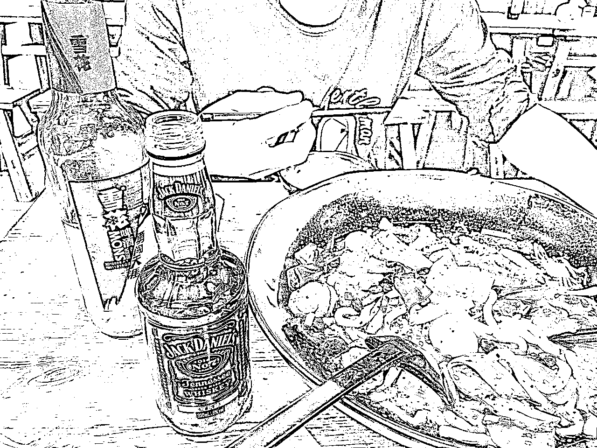

其实呢，我也理解，阴阳怪气也不过是一种想要得到却又得不到的情绪上的宣泄，我表面上听着不开心，很烦，但是，我心里呢，早就乐开了花，因为我知道，我和他们之间隔着一条长长的护城河，看的到，但是却摸不到，这条护城河就是=长期主义。

2022年，我在我的中视频的学员群里带了一批人去做私域IP，99.99%的人都没有坚持下来，两年过去了，现在还在天天找项目被割韭菜；最后只有3个徒弟坚持做下来了，其中一个徒弟现在每个月的收入比我都TM高。

2023年，我又带了一批人做私域IP，写公众号文章建立私域模型，有5个人坚持下来了，剩下的99.99%的人退费的退费，平移的平移，他们把我骂的狗血淋头，一无事处，我也忍了，因为坚持下来的几个人，他们现在活的风生水起，自由自在。

刚才一直在找一个聊天记录，没有找到，却发现自己这两年也写了很多的文章，光素材就干到了1100+张，文章也有266篇：

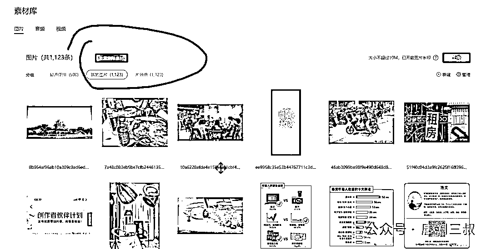

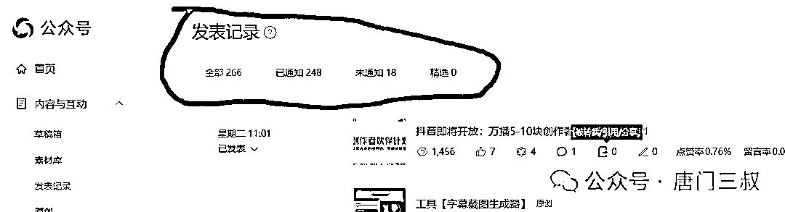

就按每篇文章的平均时间：从选题、构思到出稿发布，每篇文章2.5小时计算吧，：

266篇*2.5小时/篇=665个小时，再除以24小时每天的话，等于27.7天。

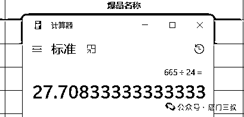

你知道这是什么概念吗，就是说，我公众号上的这些文章，不包括那些已经删除的和没有发表的，你全部写下来，所花费的时间，需要28天的时间，真的是很要命，很要命，28天什么什么概念呢，也就是说，你要把我微信公众号上的文章全部写出来，你要一个月的时间，不吃不喝，不出去，不上厕所，。。。。。。。一直不停的在写啊，想啊，发啊。。。。

这是什么？

这就是长期主义！

我知道每个人的时间和精力都是有限的，而且人和人之间能力上其实差别不大，你如果想要干一件大事儿，这个无关乎你的能力，学历，而是得必须要有长期深耕和付出的打算，如果你在干一件大事儿前，要想按天，或按小时看结果，那我告诉你，这和打工又有什么区别呢？

就连世界首富们他们计算的也只是日间价值，而不是看的每个小时产生的价值，要论小时价值，最贴合的工作，莫过于工厂的计时或计件工了，这个你只要认真干，会有人给你把帐算的明明白白的。

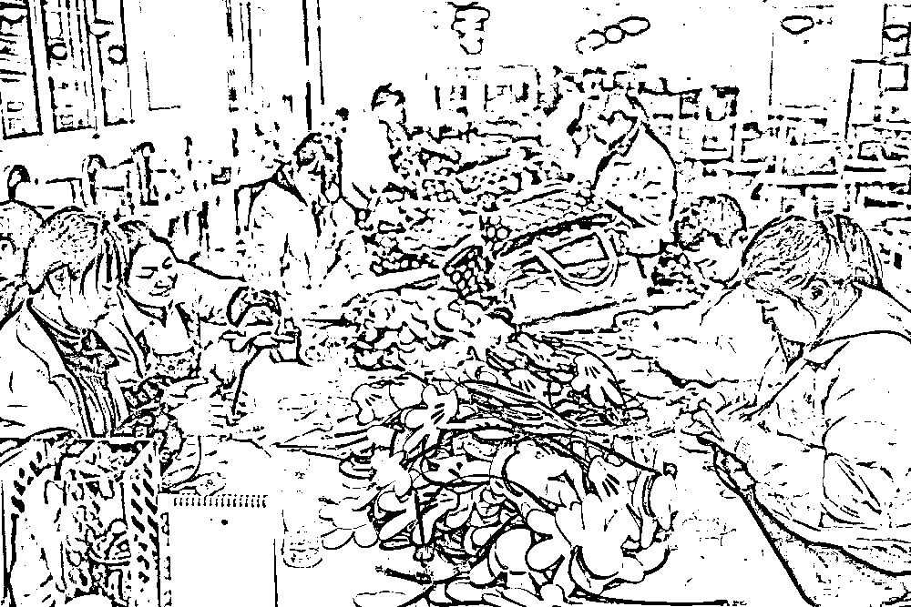

所以，今天，我给你提供的一个很猛的赚钱偏方，就是：

让你去专心的做一种，一般人都不想做，或不愿做的事情，然后呢，你还愿意把这件事坚持做很多年，只有这样才能减少竞争，永远处于一个安稳的位置，最重要的是，你做的这件事儿，还能让一般人望而却步，同时，又不会嫉妒甚至猜疑你，因为你做的事儿就算摆在他们的面前，他们也没办法抄，没办法学，就算让他们使下三滥的手段也没有用，必竟损人也不利已，所以说，慢慢的，接触的越久，人们越是对你心服口服。

如果一件事儿，你愿意深耕，一直坚持做一年，两年，三年，甚至是五年，十年的时间，人身上的所有细胞都更新换代了一遍，但是，两年后的你，和现在的你，已经完全是两个不同的人，而愿意坚持做一件事儿，愿意做三年，五年的你，也早已经跳出普通人的行列，彻底告别过去的生活阶层，成为别人眼中的成功者，当然，要做到这一步非常不容易，可，没有人知道的是，这件事儿最大的难度，就在于：如何开始

可能很多人，只想着说，我都没有饭吃，怎么坚持一年，三年，五年呢？

如果你会有这样的疑问，建议你通过思考来解决这个现实的问题。

其实，当初能影响我做唐门三叔这个IP，最早的人是桂花女王燕：

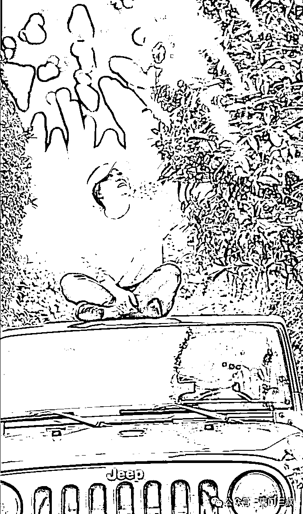

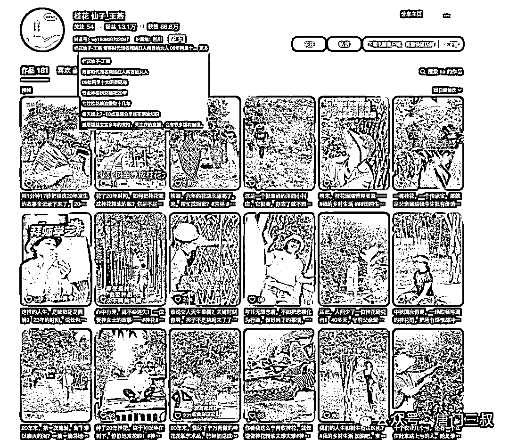

一个中年大姐，一个为了丈夫背负千万负债的人，她，一个女人，为了还清负债，坚持了十年种桂花不赚钱，十年之后的第一年，就在还清了所有负债之后，还赚了将近小一千万，我当时最大的感慨就是，一个女人，一个柔弱的女人，内心得是多么的坚强，十年不赚钱，十年如一日的在做着同一件事情，，，十年之后，一战成名。当然，要做到这样，需要一个强大的内心支撑，同样，她也是赶上了阿里巴巴为中小企业赋能的红利，这点无可厚非，所以，一个人要想赚大钱，除了要有强大的内心支撑之外，一定是要学会借势和顺势而为的。

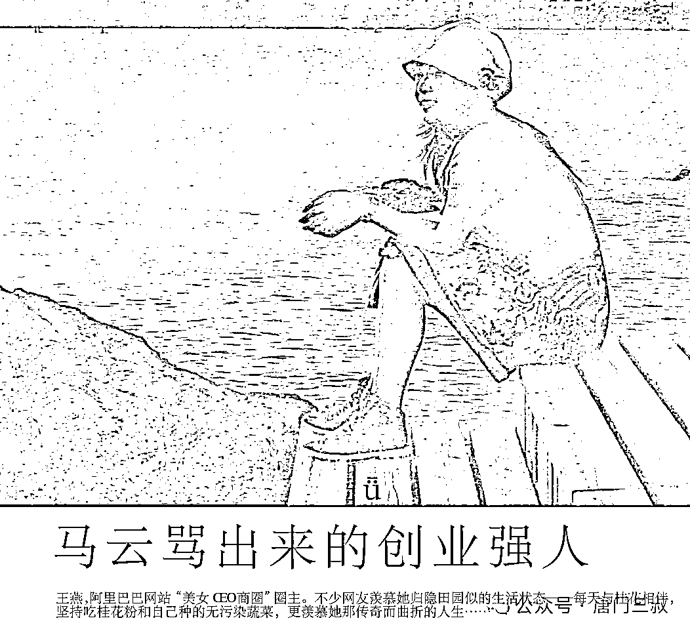

回过头来，再看看咱们身边的那些人，基本上都不认同什么长期主义，只想等人喂饭，或者白嫖，在互联网搞钱的路上，恨不得拿到的每一分都是快钱，但是当你坚持做了一段时间的长期主义的事情之后，你也会慢慢发现，你身边绝大部分的人，都是你的陌路人：

因为你心里装的全部是未来，而他们呢，则只会惦记今天的所出所得；

你想的是未来应该如何如何，而他们想的则是马上就能怎么怎么。

所以，经过这十多年的沉淀，据我个人所知，凡是长期主义者，搞的久了，到后来身边几乎是没有什么朋友的，不是没有人支持你，当然家人除外，就那些所谓的朋友，能跟着你一起赚钱的时候，一天到晚亲热的不行，一个一个哥，一三五烧烤啤酒，二四六西餐佳肴和小妞：

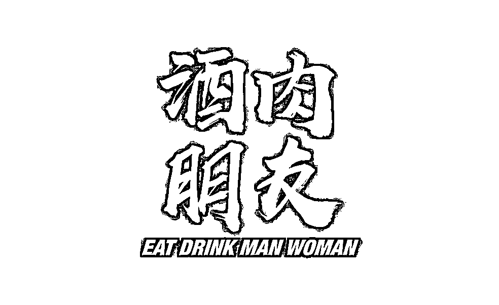

而当你做的某个项目失败了的时候，他们会搂着你的脖子说，没事哥，亏就亏了，把投资的钱转成借条就行，也算给大家一个交待，年轻，重感情，讲义气的我，心想也是，必竟大家都是十几年的兄弟，签就签了，签了之后，他们会告诉你，签这个就是为了让大家放心，所有人都知道你现在没有钱，以后慢慢赚了再还呗，这个是签字的时候，说的话，第二个月，还不是第二年，你就收到了法院关于投资借款的起诉官司，一年诉状，就是你那十几年的兄弟朋友亲手把你给卖了，卖给了所谓的江湖情义，这个时候，你才发现，你所看重的情义，在他们眼里一文不值，不仅如此，几个人，几场官司，三五年你别想安稳了，不搞死你，人家绝不罢休，为什么，因为人家认为，他们的钱亏了，你的钱，还在啊，，，，看你这里没啥希望了，也等不了你几年后再还，就开始搞你的家人，妻子孩子子，父母亲戚，没完没了的找关系查了一遍又一遍，发现缺实没有存款啊，那就开搞你家人的车子，房子，公积金，一切能搞的东西，全部来一遍，就这样，一场好心好意，有情有义的，有责任有担当的签字行为，变成了促使你家破人亡的导火索。

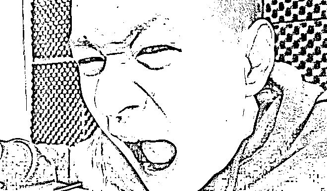

真的是，应了那句老话，看看，要是这一辈子不遇到点坎，还真不知道，你的身边藏了一群人不像人，鬼不像鬼的东西，这还是个人吗，看看一个个狰狞的，熟悉的面孔！！！

所以啊，人生不患点难，还真的是很难遇到真心的朋友，所以，我们这些长期主义者，在坚持做着一件事儿的同时，也是在净化自己的社交圈，理解和信任你的人，会一直和你站在一边，不理解的你的人，三五个月或者是三五年，就自己熬不住，露出狐狸尾巴了，为什么会有这样的人或事呢，我想大概率是因为，他们想把你当成他们自己的提款机吧：

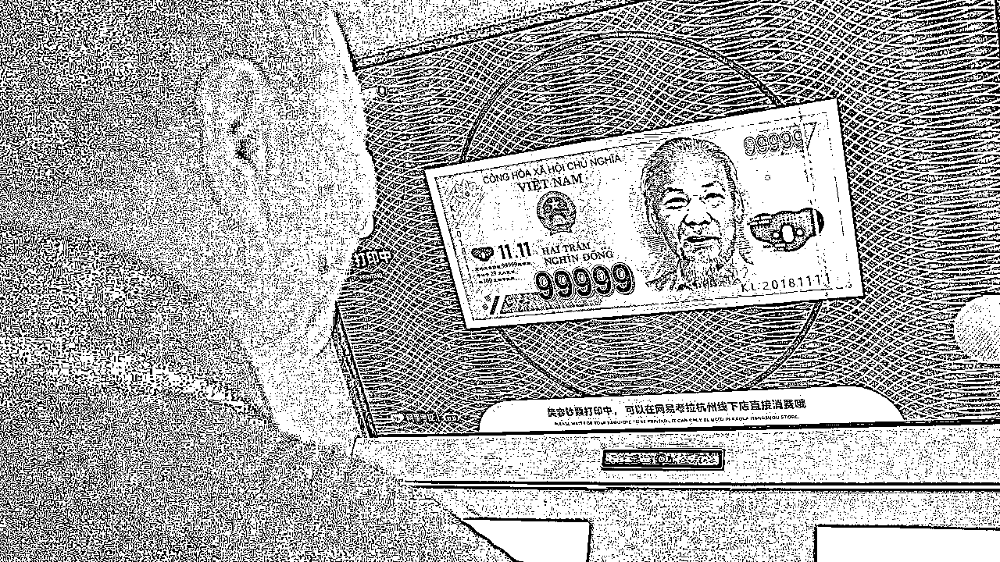

当发现有一天，你不能为他们赚钱了，会毫不犹豫的选择牺牲掉你，再去寻找下一个替死鬼。

呼~~

以上，仅代表我唐门三叔本人的肺腑之言！！！

所以呢，一个人段位高与不高，不是看他曾经有没有风光过，而是要看他能不能一直风光下去！

所以呢，一个不管大环境怎么样都能赚到的钱的人，我相信，他靠的一定不是跟风和投机取巧，也一定不是耍的小聪明，我更愿意相信，他靠的是能够持续在一个赛道一个领域，下了死功夫，做了大量别人看不到的工作和付出，对，这个就叫做深耕。

所以，最后，不仅事儿干成了，人也打磨好了，方方面面都配得上自己的结局，这就叫：外在财富配的上内心的认知。

所以，当你细心的看过从古至今那些真正被传承为经典的故事，讲的从来都不是事儿，而是人！

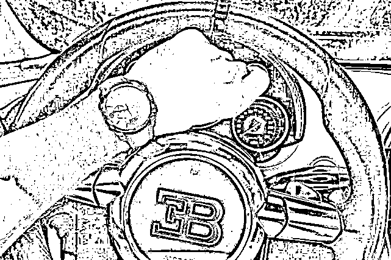

因为人，一开始一定是失败的，然后坚持，每天进步一点点，主人公呢，在其中得到成长，变得坚强，最后成功才会如约而至，所以说，一个人的成功，绝对不是偶然的，如果一个故事从头讲到尾，主人公也没发生什么变化，反而事情还成功了，这种叫做骗术，而不是成功故事，因为骗术中最核心的点就是，你不用怎么努力，就能一夜暴富。

换句话说，很多人呢，做事儿总是看重方法和门路，却总是忽略自己的成长和蜕变，这怎么行呢？

你若一直停在原地，不想迈出任何一步，难不成，你还指望着成功的好事儿，会自己主动找上门来吗

所以说，做成事儿的根本，还是因为你自己变强了，然后才有了好的结果，至于具体是什么事情让你变强的，我相信，每个故事里都有不同的答案。

但，最终的结局一定是：殊途同归

请记住：

你越狠，才能越活的清醒，因为人间清醒，才知道自己的方向在哪儿，才会知道自己想要的是什么，只有这样，你才会不断的蜕变，不断的进步，直到你变成了那个，你自己最喜欢的人，你也就成功了！

好吧，我说完了，感觉对你有用的话，关注一下。