# 可复制的小红书店铺爆款玩法分享

> 来源：[https://go6xq64elg.feishu.cn/docx/R8QxdmG8uouGxFxWdwIc4iebnnb](https://go6xq64elg.feishu.cn/docx/R8QxdmG8uouGxFxWdwIc4iebnnb)

大家好，我是曜文，又来和大家分享实战干货了！

小红书店铺这个项目我从去年3月份开始做到今年七月份开了200+的矩阵店铺，从最开始的一键成片到混剪再到实拍，可以说是门槛非常低的一个项目，而且他的爆发力强，主要通过笔记流量来带动销量，而且我从去年到现在靠的基本都是自然流的玩法能做到每个月都能在百万以上的销售额，利润率基本也在50%以上

因为小红书的用户人群质量是真的高，并且官方也在鼓励商家做高品质高价的产品

今天就来和大家分享这一两个月的小红书店铺爆款玩法，可以说是有手就能做，拼的就是一个执行力。

我会从几个方面给大家拆解并且给出相应的案例给大家参考，希望能给大家带来一定思路或者能够帮助大家在做小红书的路上一点启发

# 一、起号逻辑

小红书想要快速起号必须要知道起号的逻辑

一个是账号标签一个是账号的人群，而且我们也需要知道小红书平台的笔记权重分计算才能在起号的时候拿到不错的流量，让精准的人群来给我们的账号打上标签，那么你的账号有了人群标签之后，你后续发的每一条笔记都能拿到不错的数据

小红书有一个CES 评分 = 点赞数 x 1 分 + 收藏数 x 1 分 + 评论数 x 4 分 + 转发数 x 4 分 + 关注数 x 8 分

所以，我们在起号的时候可以用互动来拉升自己的账号数据和人群垂直度，来实现后续我们发的笔记平台给我们推送给精准的用户人群

比如：

我的用户人群是大学生我可以这样发

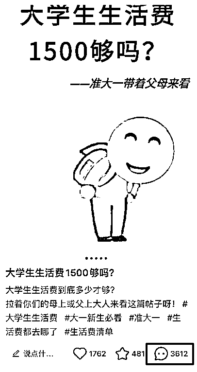

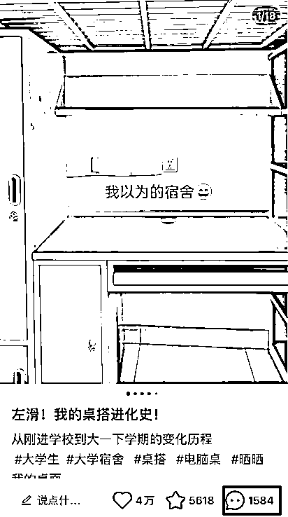

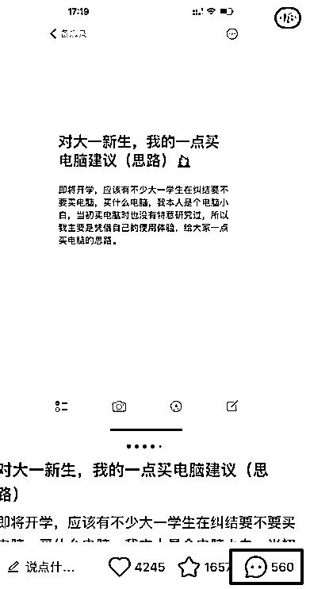

我的用户人群是上班族我可以这样发

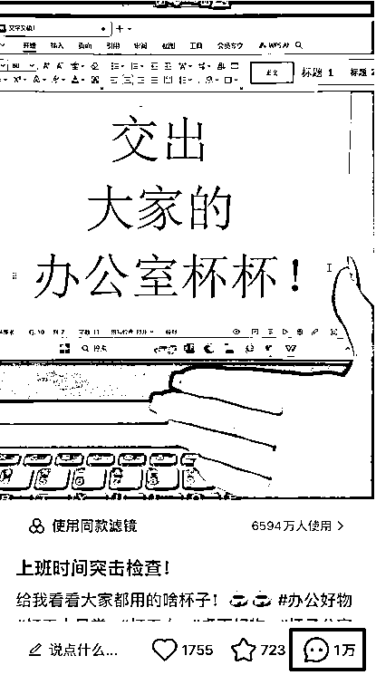

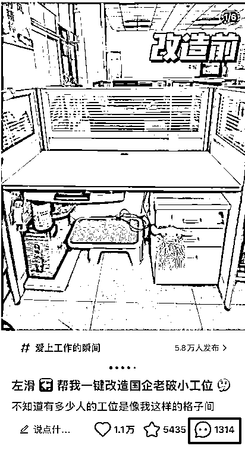

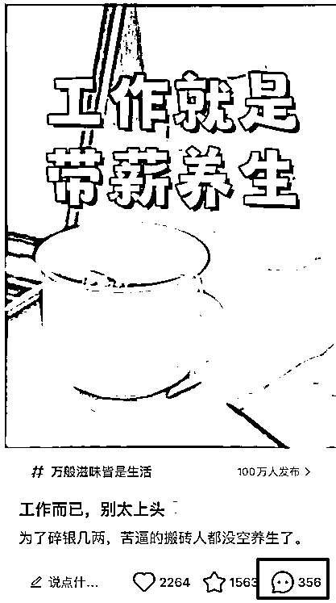

我的用户人群是宝妈我可以这样发

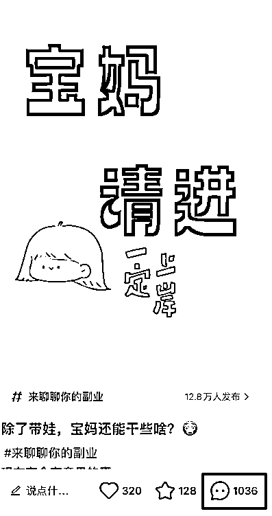

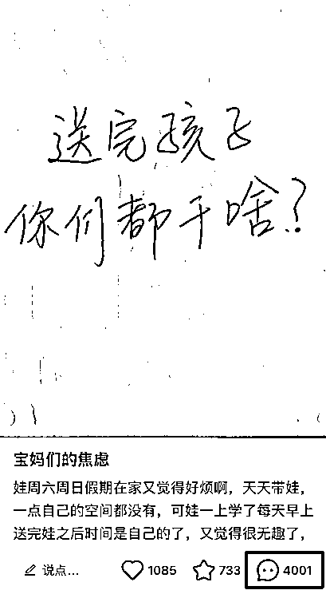

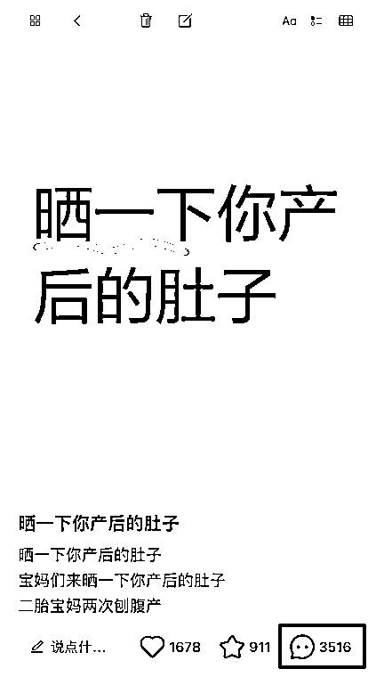

等等...你可以根据你产品相关的用户人群你找到相关的爆款互动贴去拉高我们账号的基础权重只要账号没问题的情况下有70%的几率会跑出几万十几万的小眼睛，小眼睛高了之后我们下一条去发产品带货贴的数据基本都会在一千以上，甚至直接出单。

账号有了基础的权重和标签之后我们怎么快速的去找到爆款并且实现能在一个月内爆单呢？

接着往下看，我们来理一下爆款的逻辑

# 二、爆款逻辑

要知道小红书一直有一个不变的逻辑就是爆过的内容还会再爆，怎么理解理解爆过的内容还会再爆呢，因为小红书的推流是有周期的不存在一篇笔记一直会推流，短则一周内长则两三个月，怎么去判断呢？

一个是从对标的爆款来判断周期

一个是从产品的销量来判断周期

对标的账号点赞评论数不涨了基本就是不怎么快速推流了，会出现后续被挖出来再爆一次，也会有长尾流量带动增长

产品的销量不快速增长了证明对方的笔记快速流量已经过了会出现销量的缓慢增长或者不增长因为小红书店铺的销量基本都是来自于笔记带动

那么如何去判断自己赛道的周期呢？

一个最简单的办法就是检测和每天的观察数据，一旦抓住周期就能做什么爆什么获取非常大的自然流量

再回到爆款产品来，也是一样的，小红书商城的销量也是一样，基本爆过的产品都还会在爆，只不过是店铺不同，如果你细心的观察数据你会发现，A店铺如果出了5000单不再增长，B店铺就会把A店铺的销量给吃掉，这个逻辑其实和笔记推流是一样的，还有一个点就是要理解产品的使用周期，如果是消耗品，或刚需品，用户用完就肯定还会再买。

那么我们如何快速的去抓住爆款并且复制爆款来拿到小红书的推流呢？

我们可以通过商城的销量来观察这个产品是否爆过然后来进行选品

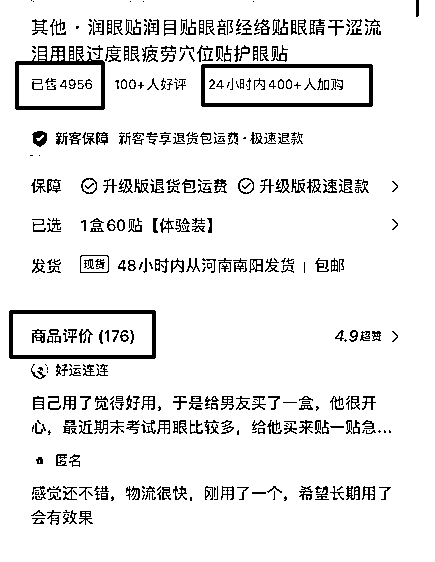

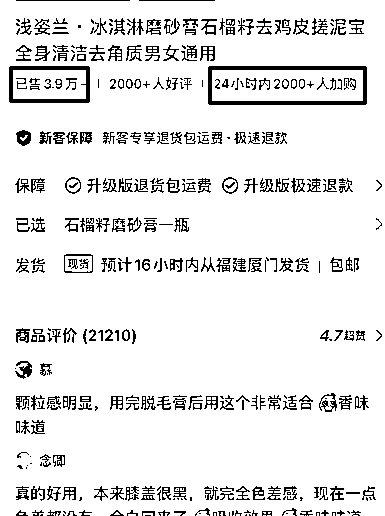

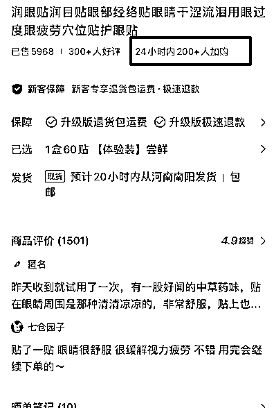

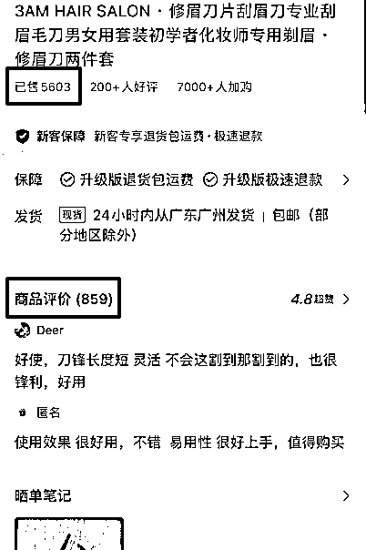

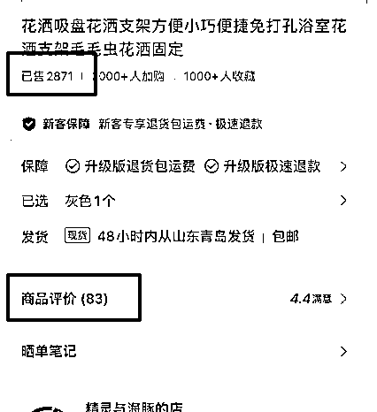

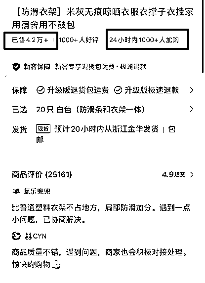

主要数据观察有三个维度：

1、产品销量证明这个品卖爆过笔记爆过

2、24小时加购数量证明这个品的笔记正在被推送

3、商品评价这个品卖的多评价少可能是近期正在爆用户还没收货评价

通过以上三个维度，在结合我们起号的逻辑去找到适合自己账号人群的产品进行笔记的制作和爆款的搜集可以进行混剪或进行原创。

# 三、内容质量

如果你是混剪的内容质量一定要高不然很容违规或者出现14天的限流笔记无法发送

怎么理解为内容质量高呢？

1、视频必须是高清的而且没有瑕疵比如：画中画没处理好，视频有很多贴纸，素材模糊等等都会影响流量

2、笔记是否按照爆款的1:1进行制作，包括封面、标题、内容，这里指的1:1不是抄而是在爆款模版上面微调

如果符合就可以批量的产出笔记，怎么理解为批量的产出笔记呢？

我们来看几个案例：

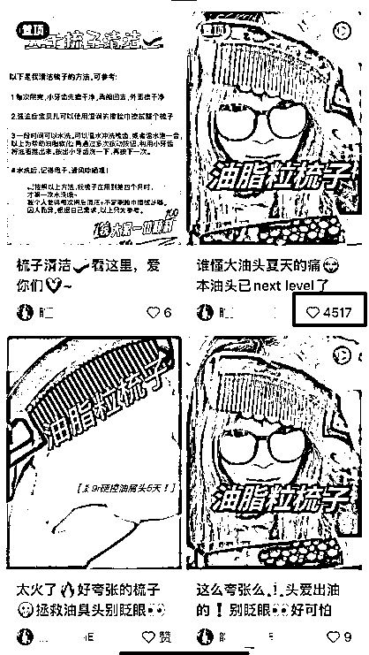

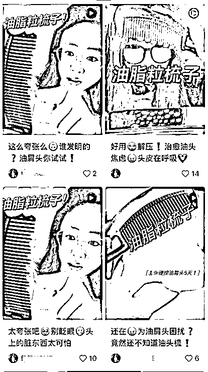

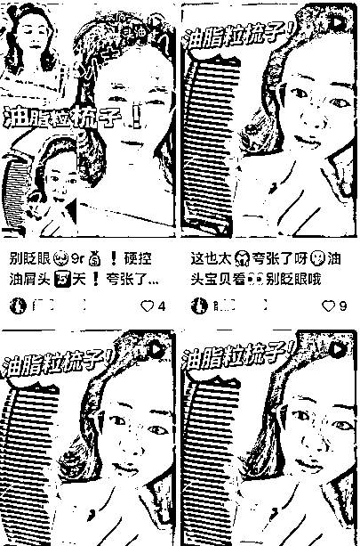

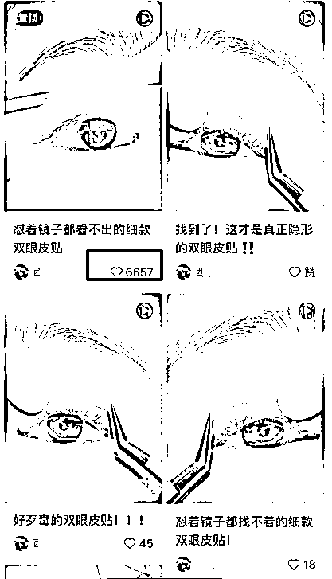

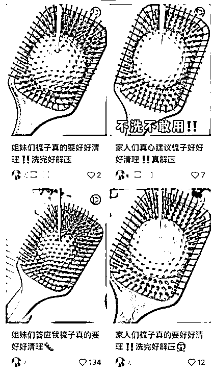

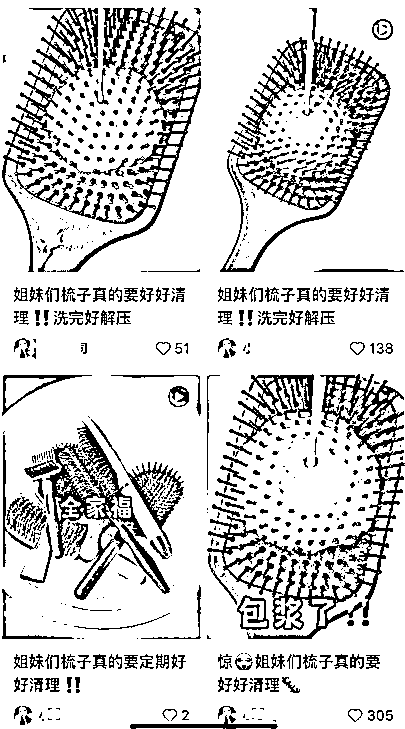

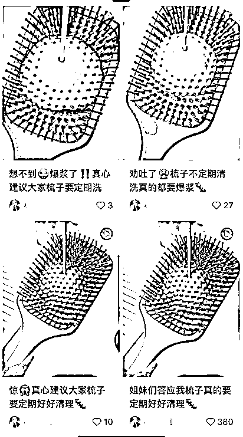

从上面几个案例我们可以得出

所用的封面基本就3-5个爆款封面

所用的标题基本都是类似稍微修改

基本都有点赞，都有出现爆款销量都在3000+以上

而这个爆款周期基本都是在一个月内，符合小红书的属性爆过的内容还会再爆

值得注意的是：

你可能会发了50篇才出现一个爆款

你可能会因为内容质量疏忽而出现违规

你可能会因为笔记涉及敏感词而被限流

所以，我们需要做的是把控好每一步，素材的质量，标题的质量，内容的质量，并且规避掉平台一些功效型或者裸露型的内容，只要笔记数据每篇都在500+或者1000+那么这个店铺是有很大的几率出现爆款，因为账号本身就有一定的权重再加上持续的输出必出爆款！

所以，只要理解小红书的逻辑再通过对标去分析到周期起号的速度非常快，而且小红书开店几乎没什么成本矩阵操作起来提升爆款，相当于你发笔记平台就给你送钱

# 四、操作总结

通过以上的逻辑我们再来梳理一遍以便于更好实操

首先是定位人群拉升账号的权重和互动让自己的账号获得更多推流

然后是跟爆品做爆款内容做到1:1的参考并且在爆款上面做优化抓住爆品的周期

最重要的是把控内容质量，只要不违规笔记数据持续上涨就有大概率出现爆款

最离不开的就是执行力，从找到爆款产品到搜集爆款做好内容记录就可以直接上手实操

趁着小红书店铺还是处于一个非常缺内容没有严打剪辑的时候可以上手实战一波拿到结果

并且此操作玩法非常简单，几乎没门槛，只要按照上面的步骤并且理解逻辑就能直接开干

以上，都是无保留的实战分享，如果你通过本文章拿到结果记得回来点赞哦~