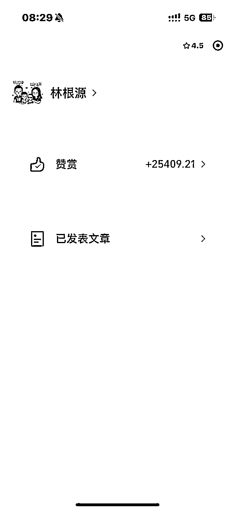

# 写作赛道，如何使用「算账思维」精准地评估产出？

> 来源：[https://oee5lr7gsk.feishu.cn/docx/RCM3dItXaoh6DOxDgJNcw0Gpn1e](https://oee5lr7gsk.feishu.cn/docx/RCM3dItXaoh6DOxDgJNcw0Gpn1e)

全文共：2,590 字

预计阅读时间：3.15 分钟

圈友们好，我是根源

也是这一次生财思维航海的教练

这篇文章的背景，源自于这次的生财思维航海

当聊到『算帐思维』时，有一位船员提出了这样的问题。

船员提到了：

如果开一个奶茶店，我确实能用算帐思维计算成本、产出、....。

但如果我的项目是写作，我应该把算帐思维应用上我的项目？

我觉得对于「算账思维」的这部分解释

是一个更细致更全面地诠释

算账思维的核心，一定不是只看「钱」，

因为「钱」只是其中一个结果，如果只看「钱」，就容易把项目看得片面

这个过程中应该要更全面的评估的是

自己有什么，能调动多少资源，哪些资源可以帮我创收……

在这篇文章中，我有非常细致的说明

如果你也正想透过写作变现

希望这些经验或方法，能帮到正在看文章的圈友

很欢迎看完文章后

能一起讨论。

* * *

# 「算账思维」的核心，不只是算「钱」

其实，算帐思维，有时候算的不一定是钱

还有时间、还有你手上拥有多少筹码

就以你的情况来说

我不会这么快的计算每一篇文章写好后，可以有多少产出比。

因为，这样的思考太片面

有时候，你会发现小明写的文章，跟小源写的文章相比，明明小源写的更好

但为什么小明的赞赏更多，阅读数更高？

因为小明，他在互联网的声望比小源要高太多了

就算小明抄的是小源的，多数人都会直接认定，肯定是小源抄小明的文章

* * *

# 算账思维第一步：你拥有什么？

这时候要算的第一笔帐

就应该是你除了写文章之外，还做了些什么？

你除了文章之外，还有什么是辅助这个文章，可以变现的渠道？

最直接的就是：你是否有课？

我就谈我的例子

2022年初，我第一次更新公众号，当时，明白老师跟我说必须要更新公众号

我当时写公众号，根本就不是为了变现

因为我知道，我在互联网上根本没有任何的『踪迹』

也就是，別人根本不知道，我到底是个有能力的人，又或者是，我就是个骗子。

那什么叫做『踪迹』？

类似这些：

小红书粉丝量

视频号关注人数

公众号关注人数

有多少篇十万加的文章

生财的精华帖有几篇

有多少付费的微信群，能否证明

............

如果谈一些更大的，就是某个平台的多数会员能不能听到这名字就说：“这老师不错。”

这些都属于你的互联网『踪迹』

那你的『踪迹』是什么？绝对不能只有文章。

假设你单纯只是写文章，你会发现初期根本就得不到关注，甚至埋头苦干写两年，依旧不会得到关注

因为，你第一笔要算的帐，是除了写文章之外，你还拥有些什么？

就像2022年，我拥有：

1、一个关注不到100人的，新创立的公众号

2、有一堂131.4元的付费沟通课（大概400人左右）

3、我用了一年的时间，让我的通讯录里面，增加了将近700人的生财好友

4、我认识明白老师、陈雪、刺猬、涛哥、靠谱、大周、西门......跟这些人的关系都挺好

...........

* * *

# 算账思维第二步：你能调动多少资源？

这是我当时算的帐，这笔账当算清楚之后，我就能知道

当我要推一个东西，能获得多少协助

我用一年的时间，认真地盘活我手边拥有的这些东西，可以帮我自己创造点什么

这时候，我都还没计算可能获得多少营收

因为我知道得有些好的数据

这些是一个大多数人可以查询到的数据，这也是我上面提到的『踪迹』。

两年半的时间，我第一年文章写的最勤劳，

但是到了目前我一共也才写了379篇原创，赞赏大概两万多，总用户根本不到5000人。

我第一年，其实公众号的关注人数才3000人不到

但是第一年，我算过透过公众号对我付费的总金额，已经超过100w以上。

也就是，我公众号的目的只有一个

让我在互联网上可以有拿查询到的『踪迹』

因为我不只有文章，我还有自己的课，我还有上过课的学员.......

* * *

# 算账思维第三步：手边哪些资源可以帮我创收？

所以，目前对于你的问题来说

要算的帐，不是『钱』的帐，而是你手边拥有哪些东西能帮你创收

*   是否有自己的课

*   是否有推荐的老师，你能帮他cps

*   是否有正在卖的产品

*   是否有想进行的项目

*   .........

这些都是第一阶段，你必须要算出的帐

当这些算出来后，才进入到第二阶段，你要如何，可以盘活手上的这些资源

就假设你有自己的课，你写一篇文章之后，有多少人阅读、得到多少转化。

以及，同样一篇文章，你除了发公众号之外，会不会发到其他平台

就类似小红书

就类似视频号

就类似你自己的私域群里面

……

也就是，

1.  第一笔要算的帐是，你拥有什么

1.  第二笔要算的帐是，你能调动多少资源

1.  第三笔要算的帐是，你才能大概的算出，我有的、加上我能调动的能为我带来哪些产值

这才是算帐思维的应用，因为算帐，不能只算名面上的『赚多少钱』。

收入的背后，都来自很多复杂的系统

当这些小系统，每个都很完善的时候，你才能开始拥有稳定的收入。

* * *

# 尾声的过去历史介绍

我是根源，同时也是第四期的生财圈友

一个有 2w+ 实战案例的心理咨询师

12年线下销售、团队管理经验。

2022 年开始转型线上，做一些知识付费的项目。

过去曾发表过几篇文章

都能看到这，代表你对文章的喜爱

肯定有一定的程度！

也欢迎阅读过去我写过的历史文章。

2021年的文章（精华x1）

1.  精华《直觉式萨克斯 透过社群成功变现146万》 https://t.zsxq.com/116B1bcYc

1.  《73项被动收入打造》 https://t.zsxq.com/11EHjTH0P

1.  《杭州夜话02场，夜话官复盘》 https://t.zsxq.com/19IkX4UMl

1.  《年入百万，团队从20人到4万人》 https://t.zsxq.com/19JYt77hL

1.  《主题：如何更有效的链接见面会认识的圈友》 https://t.zsxq.com/19VY2LWg4

2022年的文章

1.  《互联网小白，第 1 次做线上产品，7 天赚回 10 倍门票》 https://t.zsxq.com/11ooZZbM7

1.  《把捣乱分子『逆势』转成爱用者的好方式》 https://t.zsxq.com/19lipLhJ5

1.  《 好的内容，是目前依旧没退旧流行的变现方式 》 https://t.zsxq.com/19BLMAYw1

1.  《明白老师的一个启发，让我从100天日耕的过程赚了30W+》 https://t.zsxq.com/19BgNoxfi

2023年的文章（精华x6）

1.  《私域的意义不是管理，而是经营》 https://t.zsxq.com/19WEsfSq1

1.  精华《9年传统行业 1 年时间，从一无所有，到年入 200 万》 https://t.zsxq.com/10nmEr1cA

1.  精华《25个提高微信成交率的小技巧》 https://t.zsxq.com/11AgRW24F

1.  精华《35 个让私域收入翻 3 倍的技巧》 https://t.zsxq.com/11FmV2aqZ

1.  精华《续篇 - 25个提高微信成交率的小技巧（26 - 50）》 https://t.zsxq.com/13yRbmUwo

1.  《 私域话题：涨价之后，如何回复以及留住客户？》 https://t.zsxq.com/11UJk9HxQ

1.  精华《成为自由职业者的20个必备特质 》 https://t.zsxq.com/14XTxhh15

1.  《 36个让私域成交率翻倍的实战指南！ 》 https://t.zsxq.com/17zSrYzvk

1.  精华《产品线有引流体系，如何通过沟通促成升单？》 https://t.zsxq.com/17ocUJEFA

1.  《知识付费赛道，如何透过处理『反对问题』，增加用户粘性和复购率？》 https://t.zsxq.com/181fSc5rv

2024年的文章（精华x3）

1.  精华《第一次尝试「问答群形式」的公域往私域转化，7天变现11万》 https://t.zsxq.com/18gBXlWxE

1.  《 线上新手，我是如何用一套固定流程，累计成交 300 万高价产品？ 》 https://t.zsxq.com/18IWgDiXo

1.  精华《 私域话题-如何在客户咨询过程中，透过三个步骤提高2倍成交率？ 》 https://t.zsxq.com/196Ad34aR

1.  《私域的十倍增长话题：不同信任程度的客户，如何提升成交率？》 https://t.zsxq.com/YKHGT

1.  精华《 为什么都是做副业，我能第一年就达到七位数？ 》 https://t.zsxq.com/APodD

多亏加入了生财有术

让我少走了很多弯路。

也积累了一些经验、心得

如果圈友有什么需要探讨的

欢迎加我微信「 AF54094 」交流~

▲

也能扫码撩我~