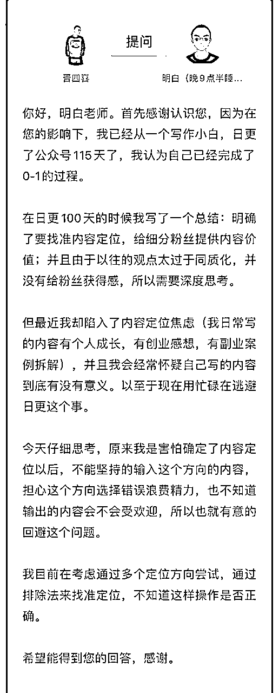

# 参加航海实战，如何让自己每天都有正反馈？

> 来源：[https://pznme756ly.feishu.cn/docx/RFIHdJehho0AKDxtE75cXvBrn7c](https://pznme756ly.feishu.cn/docx/RFIHdJehho0AKDxtE75cXvBrn7c)

大家好，我是明白。

前几天在一个百问百答的直播活动上，有同学问了一个问题 ——“我参加了好几个生财航海，流程都跑通了，但收益很少，我就不想再做了，如何调整心态”？

我们大部分人原来都是在职场上班。

而职场上班的收入模式是，我每天按时去公司打卡做事，每个月就会有固定的工资，非常的稳定。

所以我们做副业，或者说在互联网赚钱的时候，也会有一个思维惯性：我每天付出同样的时间，也能够获得固定的收入。

但这个不太可能。

因为副业和职场上班它是完全不同的系统，最大的区别就在于收入的不确定性。

在职场上班，假设每月工资2万块，相当于我每天去上班就能获得近1000块的收入。

但副业可能是，

第 1 个月，收入是 0。

第 2 个月，收入是 0。

第 3 个月，收入是 0。

第 4 个月，收入是 10。

第 5 个月，收入是 50。

第 6 个月，收入是 200。

第 7 个月，收入是 2000。

……

第 13 个月，收入是 10000。

第 20 个月，收入是 20000。

用一句话来总结的话，就是 ——

做副业前期你大概率赚不到钱，但如果你能坚持做下去，后期你会获得一个比较大的增长。这个就是复利效应。

就比如我写公众号，前半年 1 年左右，基本都赚不到什么钱。

但我还依然会写，因为我知道这是一件对的事情，这个过程中我积累的能力、知识、思维、影响力、用户信任，它一定会让我在未来某一天，获得大的收益。

后来文章越写越好，被大佬转发、推荐，无论是卖自己的产品，还是推荐其他的产品，效果都不错。2021 年 418 当晚，一夜就收入近 20 万。具体可以看这篇 https://t.zsxq.com/19SqL7McC

为什么在互联网赚钱比较难，就是因为它有不确定性，所以很多人做一个月，发现没赚到钱，或者收益很少，就不想做了。

那为什么有的人可以持续能赚到钱呢？因为他做一个月后，他继续在做，再做一个月他还继续在做，他没有因为做一个月就赚不到钱，他就不做了。

所以做副业，前期一两个月，甚至半年，甚至一年，没赚到钱，或者赚钱比较少，这个太正常了。

如果一个人没有这个耐心去熬，那就不太适合做副业。

* * *

那有没有什么方法，可以让一个人在收益比较少的情况下，依然可以有动力去持续行动？

当然有，就是我们不能单纯把，我跑完一次航海，我赚到钱了，这个叫做收益。我没赚到钱就没收益。

用这样的思维，即便坚持一年，硬熬一年，收益方面也不太会有大的改善。

因为你没有积累。

没有积累，就不可能到那个一年之后突然爆发的那个阶段。

就好像，为什么我们经常听说，有人活到 60 岁了还没有成长，因为他把每一天都重复的过，所以活到 60 岁，和 20 岁没什么区别。

所以如果你想要让副业有一个大的增长，关注点就一定不能只放在，今天我参加完活动，我能赚到多少钱。

你就不能用上班时候的思维，来对待副业，如果这样的话，就会让你就是很纠结：啊，我都做了一次航海了，怎么还没有赚到 1 万块？我都参加了两次航海了，怎么还没有2万块？

这会让你在做每一天的过程中都会内耗：今天我的视频能不能爆？今天我能不能赚到钱？今天能不能变现？

这种思维，一定会让自己每一天就会焦虑，就会恐慌。就没有心思去思考，要达到这些结果，我要去做哪些事情，学哪些知识、方法，看哪些航海文档。

相反，我们每一次航海，甚至每一天的活动参加下来，我们都要去认真复盘 ——

我在航海的过程中学到了哪些东西 ——

*   我积累了哪些知识？

*   我有哪些能力变的更强了？

*   我积累了哪些更好的方法？

*   我学会了哪些更好的商业模式？

*   我学会了哪些没听过的商业思维？

*   我的情绪管理有没有变得更好？

*   我有没有认识新朋友？

*   ……

如果你能每天写出在航海活动里，学到哪 5 个东西。

你每天都积累 5 个，一年下来你能积累 1000 多个成长。

那第二年你做项目，一定会比第一年提高 3 倍成功概率。

这个其实就是，让自己从内找到正反馈。

也不止是在做副业，比如读书、写作、锻炼、成长过程中，这也是一个人能坚持做好一件事的核心。

* * *

前段时间有个同学提问说，日更了 40 多天，一直没有正反馈，该该怎么办？

这让我想到，之前在星球了，也有一个问题 ——

概括一下 ——

日更了 115 天，效果不好。想继续写，但不知道内容是否会受欢迎，担心方向错误，浪费精力。

这个问题的核心是：没有收到正反馈，所以不确定要不要继续。

其实不止写作，在其他一些事情上，也有不少同学问过我这个问题，比如 ——

*   读书，读了一段时间，没有正反馈。所以，就不想读了。

*   分析赚钱案例，研究了一段时间，没有正反馈。所以，就停止了。

*   做副业，尝试一个项目，做了一段时间，没有正反馈。所以，就放弃了。

我们好像进入一个死循环：

任何一件有价值、稍微有门槛的事情，都需要专注一段时间，才能获得结果。但因为没有及时的正反馈，我们就不大可能长时间专注。

于是，做一件事，没正反馈，放弃。换第二件事，没正反馈，放弃。换第三件事，没正反馈，放弃。……

更严重的是 ——

每件事情都浅尝辄止。既没有物质上的收益，也没有知识、能力上的积累。

时间越长，我们对自己就越没有信心，慢慢变成习得性无助，觉得自己天生啥也干不好，焦虑、担忧、无助，感觉人生一片迷茫。

如果你也有这样的困扰，今天的文章，或许能给你一点启发。

# 1 你期待的正反馈是啥？

上面那个死循环，问题出在哪里？

很明显：缺乏正反馈。

因为没有正反馈，所以我们没动力持续做，也就没法专注，进而做不好，得不到结果。

那我们先来思考一个问题 ——

你在做一件事时，无论是读书、写作、尝试赚钱项目，你心里期待的正反馈是什么？

可能大部分人，期待的正反馈都是 ——

*   写作 —— 涨粉，赞赏，高阅读，接广告赚钱。

*   读书 —— 赚钱

*   做项目 —— 赚钱

你可以停下来，闭上眼睛问问自己，是这样吗？

如果是，那我们继续。

# 2 一个不合理的正反馈

我们读书、写作、做项目时，都期待短时间内，能得到正反馈：赚钱。

如果得不到，我们就觉得没动力，想要放弃。

但你是否认真、深入思考过一个问题：自己想要的这个正反馈，合理吗？

如果它不合理的，那它大概率不可能实现。

一个残酷的真相：短时间赚到钱这件事情，的确不合理。

为啥？

因为 ——

赚钱是一个结果，是我们做成一件事的结果。

我们想要赚钱，一定是把某件事情做好，然后会得到赚钱这个结果。

而做好一件事情，核心在于知识 + 能力。

知识、能力都够，那事情大概率能做好，钱肯定就能赚到。

反之，知识、能力不够，事情大概率做不好，钱肯定就赚不到。

而知识和能力的提升，只要一条路径：熟能生巧。

也就是，我们必须花大量时间，多次重复学习、思考、练习，才能让自己的知识、能力提升。

当我们做一件不熟悉的事情时，相关的知识、能力，必然是不够的。那肯定没法短时间做好这件事，自然就没法获得我们想要的那个「正反馈」。

当然，有同学可能会举出一些反例：那个谁谁，以前也没做过 XX，一上手就涨了 5 万粉，或者赚了 2 万块钱。

这里谈个例没意义，因为我们不知道别人以前有什么积累、资源，也许他在其他行业，已经是顶尖专家了，具备了一种洞察事物底层逻辑、跨界触类旁通的能力。所以，他做新领域，不是从 0 开始，而是从50、甚至70、80、90开始。

我们看个例，都只能看到表面，没法看到背后。

所以，如果你在自己领域，没有达到前 20% 的水平。在新领域，也没有足够的积累。那就绝不可能短时间获得正反馈。

我突然想到李笑来老师这句话：一切都是积累，速成绝无可能。

这是一个客观事实。

好像又进入一个死循环 ——

知识、能力不够，做事情，就没法快速获得正反馈（赚钱）。

没有正反馈，我们就没有动力持续，那知识、能力就没法精进。

换下一件事情，知识、能力还是不够，还是没有正反馈。

……

无解了吗？

但我们又能看到，有一类人，他们做一件事，一开始的知识、能力也不够，短期也没有得到赚钱的正反馈，但他们却能持续做下去，知识、能力不断提高，最终获得正反馈。

他们为啥能做到呢？

因为他们知道另一个真相 ——

最好的正反馈，从不来自外界，而是在自身。

# 3 如何让自己每天都有正反馈？

这类人，他们不需要正反馈，也能每天充满热情的做下去。

这种状态，还有另一个说法：自驱力。

他们心里想的，不是如何赚钱，而是如何能让自己变成一个更好的自己。

听起来很鸡汤，是不？

对，这就是他们期待的正反馈

有了这个期待，他们的思考、行为，都会完全不一样，所以他们每天、甚至每时每刻，都能获得正反馈。

还是拿读书、写作、做副业项目这 3 来举例。

## （1）读书

有同学说，读书要获得正反馈，太难了。那些知识、理论，无法直接操作，变成钱。还需要思考、练习，谁能坚持到最后啊。

但在我里，读书这件事本身，就能带来正反馈，比如 ——

*   一个经济学知识，让我对商业世界认识更清了。

*   一个逻辑思维公式，帮我能更好的处理问题。

*   一个哲学小故事，让我对生命有了更深的理解。

*   一个心理学原理，让我的人际关系变得更好。

*   一个医学案例，让我知道能更好的照顾自己的身体。

*   一个励志人物，帮我激发内心的斗志。

任何一本书，任何一页纸，任何一篇文章，任何一个朋友圈，任何一个帖子，……

只要我愿意去思考，它就能让我在某个方面，变得更好。

这就是最大的正反馈。

## （2）写作

有同学说，写作要获得正反馈，太难了。

一开始写的不好，阅读不高，也没人赞赏，更没人转发，赚钱就更远不可及了，这谁能坚持下来啊。

但在我眼里，写作这件事本身，就能带来正反馈，比如 ——

我学到一个知识，想把它分享出来。发现写的时候，自己糊里糊涂。于是，不得不查更多资料，做更多深入思考。终于，文章写出来了，自己也把这个知识搞懂了。

我碰到一件事，让自己很生气，情绪快要爆炸。于是，把这件事的来龙去脉写下来。发生了什么？为什么让自己生气？自己的生气合理吗？接下来要做什么？要一直生气下去吗？写完后，从旁观者角度，看到了自己的一些思维盲区，和不好的地方。于是，对自己认识更清了，下一次就不容易生气了。

我遇到一件困难，解决掉后，把它写出来，既复盘了自己，又给别人提供了帮助。下一次遇到类似的问题，就能轻松应对。

*   为了不断写作，不得不逼自己多读书。

*   为了写清楚，不得不逼自己深入思考。

*   文章阅读低，锻炼了自己的耐心。

*   很累很苦，锻炼了自己的毅力。

*   被别人冷嘲热讽，锻炼了自己的心性。

*   ……

任何一篇文章，任何一个朋友圈，任何一个帖子，任何一次微信聊天，……

只要我愿意去思考，它就能让我在某个方面，变得更好。

这就是最大的正反馈。

## （3）做副业项目

有同学说，做副业项目要获得正反馈，太难了。知识不够、能力不够、资源不够、经验不够，啥都不够，怎么可能把事情做好呢？

但在我眼里，做副业项目这件事本身，就能带来正反馈，比如 ——

我尝试一个项目，在探索过程中，不断思考，这件事情为啥能赚钱？满足了什么用户需求？还有哪些事情，和这个类似？好像 XX 书里讲过这个，我去看下。噢，原来这个知识，可以用在这里呀。

为啥同样一个问题，高手想的，和我想的不一样？他是用什么方式思考问题的？为什么用这种方式？他从哪里学到的？读了啥书？嗯，研究一下，这就是秘籍。

为啥同样一件事，高手做出来，和我的就不一样？他到底是咋做的？他练了多久？怎么练的？请教一下，这就是高手的成长路径。

*   这句文案为啥这么写？

*   这个广告这么low，为啥还一直看到？

*   这个产品流量怎么来的？

*   这个东西免费，它怎么赚钱？

*   ……

任何一个项目，任何一个问题，任何一个困难，……

只要我愿意去思考，它就能让我在某个方面，变得更好。

这就是最大的正反馈。

有同学说，你说的这 3 个例子的正反馈，太虚了，它还是没法帮我赚到钱啊。

这话没错。

但这句话的方向，一开始就错了。

回到第 2 点讲的，赚钱是一个结果，是我们做成一件事的结果。

我们想要的正反馈（赚钱），是一个果，而不是因。

因果因果，种因才能得果。

不种因，只想果，那咋可能？

如果赚钱是果，那因是啥？是做成事。是知识、能力足够。是持续不断学习。是让自己变成一个更好的自己。

因种好了，果自然就会出现。

那个想要快速获得赚钱结果的正反馈，其实一开始就是不合理的。一个错的期待，必然只会不如人意。

所以，当你还在纠结，读书、写作、做副业项目，没有正反馈时，记住这句话 ——

最好的正反馈，从不来自外界，而是在自身。

# 4 不一样的正反馈

如果你去问一些赚到钱的高手：你在做一件事时，无论是读书、写作、尝试赚钱项目，心里期待的正反馈是什么？

他们可能会说 ——

*   读书 —— 增长知识、见识……

*   写作 —— 提高思考能力、表达能力……

*   尝试赚钱项目 —— 提升能力、经验……

因为他们知道，什么是因，什么是果。

他们知道，事物发展的客观规律，

所以，他们始终想的是：如何能让自己变成一个更好的自己。

于是，工作、生活、人际交往中，每天、每时、每刻，他们能收到正反馈。

最终，他们也必然能获得，那个大家都想要的正反馈。这个不是鸡汤，这是逻辑。

祝大家每天都能收到正反馈~

* * *

# 小尾巴：历史介绍~

我是明白，生财有术 8 期老圈友，星球编号 20。

程序员出身，目前自己创业，做一个成长社群《日新月异俱乐部》

以下是我在生财的历史 25 篇精华帖合集

也代表我的一个成长轨迹，

如果有兴趣，点击链接直达 ——

2024年（x1）

1.  《详解：写作和赚钱的 4 个关系！看完你一定会忍不住想开始写！》 https://t.zsxq.com/192OLDlds

1.  《7 年生财拉新 1100 +，我只做对了一件事》https://t.zsxq.com/19SqL7McC

1.  《当思考成为习惯，赚钱会更容易》https://t.zsxq.com/19vgy7kcp

(这个还没得精华，但我觉得写的很好哈哈，是赚钱最重要的一个环节）

2023年（x1）

1.  《身体残疾卧床 3 年，我在人生最低谷加入生财有术，有哪些成长？》 https://t.zsxq.com/19KWDvzz0

2021年（x3）

1.  《复盘 | 亦仁 3 年前的帖子，帮我每月被动收入 1 万块》 https://t.zsxq.com/19jaotwbv

1.  《嘉宾问答|“想去更好的公司，我该如何利用好时间？”》 https://t.zsxq.com/1952Q3a92

1.  《2883 人向朋友介绍生财有术时，说的最多是 16 个词！》 https://t.zsxq.com/19MYWwvCl

2020年（x6）

1.  《产品想要获得更大收益，应该不断向用户的真实需求靠近》 https://t.zsxq.com/19kQ7NILy

1.  《 我的2019：普通人如何培养自己的用户视角？》 https://t.zsxq.com/19fyFdZRL

1.  《如何通过分析成功案例，帮自己建立赚钱清单》 https://t.zsxq.com/19FNjtIjB

1.  《思路详解：如何为某个细分领域用户提供产品，并赚钱》 https://t.zsxq.com/19qoI1QQB

1.  《学习和赚钱是什么关系？》 https://t.zsxq.com/19uQcuMzJ

1.  《5000 字深度拆解 | Manchuan 公众号 2 个月涨粉百万，普通人如何复制？》 https://t.zsxq.com/19cD1keUB

2019年（x8）

1.  《在生财有术，普通人如何从 0 到 1，培养赚钱思维》 https://t.zsxq.com/19rA0kWrD

1.  《生财有术第 3 期，我是如果做到邀请 245 个用户的？》 https://t.zsxq.com/1968tlTAx

1.  《公众号和抖音之间的赚钱机会》 https://t.zsxq.com/19OfzDckK

1.  《可复制，零门槛 | 如何借别人的流量，打造一个稳定的被动收入系统》 https://t.zsxq.com/19sVRn6Yx

1.  《做自己擅长的事，把技能树打通，然后再去赚钱》 https://t.zsxq.com/19evWC1Xl

1.  《信息整合：一个可复用，低门槛的成熟商业模式》 https://t.zsxq.com/192zoSooT

1.  《产品名字，只有一个目的：降低用户认知成本》 https://t.zsxq.com/19QUBrDOT

1.  《数据是需求的抽象化 | 帮你快速找到 100 个赚钱思路 》 https://t.zsxq.com/19QrIpsuC

2018年（x3）

1.  《分享一下，抓取其他微信号的方式，而且是精准粉》 https://t.zsxq.com/19sKQT9bF

1.  《如何几乎零成本做到1w多付费学员？》 https://t.zsxq.com/198XWAGhV

1.  《36 个小而美赚钱项目之一：蛋黄酥白皮书》 https://t.zsxq.com/19G4PKUXr

2017年（x2）

1.  《一个零成本，为公众号增粉，并高转化率为付费社群，进而再次付费转化加入小密圈的案例》 https://t.zsxq.com/19WJ8NILt

1.  《一款软件，webscraper，帮助非技术领域的朋友，做到爬虫可以做的事情》 https://t.zsxq.com/19RSl40n5