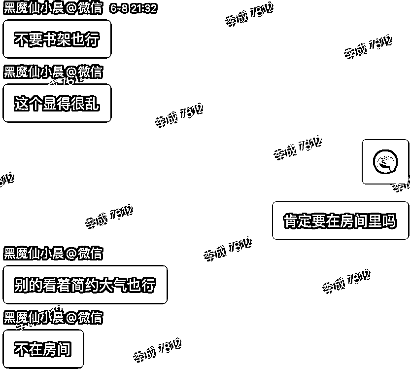
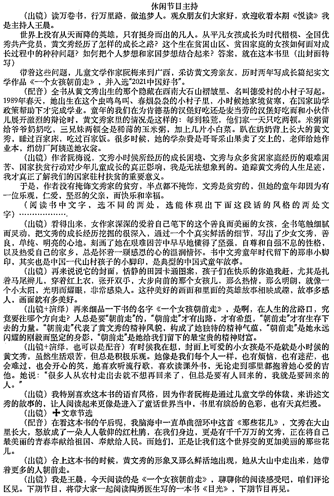
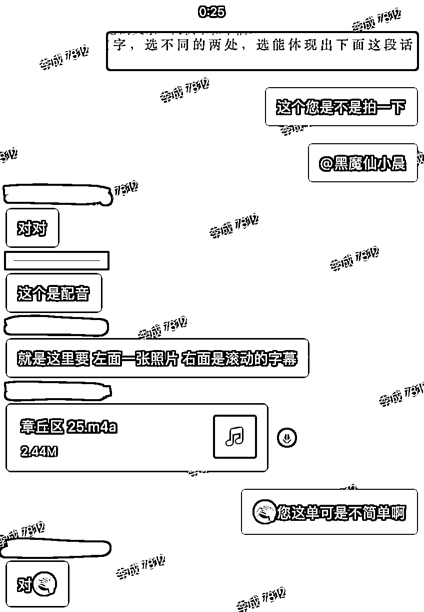

# 剪辑新手｜剪映接单｜长期可做变现率高！亲测有效

> 来源：[https://uilrwnzy0o.feishu.cn/docx/Rcxrd3qZUo6KvZxIWPtcrEqqnqf](https://uilrwnzy0o.feishu.cn/docx/Rcxrd3qZUo6KvZxIWPtcrEqqnqf)

# ❓为什么写这个帖子

1.  加入星球快一年了很少发帖，但是我喜欢体验边界，所以想看看能不能摸到精华

1.  作为10年的剪辑老油条，发现很多剪辑新手，学完剪辑接不到单，于是卧底了新手剪辑师的接单群，发现了学到什么程度可以接到单的边界，算是给剪辑新手打开了变现的一扇门

1.  生财的剪辑特训没有了，当不了剪辑教练好无聊啊

# 🎯剪辑新手接单｜必问的10个问题

1.  学到什么程度可以接单

1.  基础操作——知道有什么功能，怎么使用，怎么组合使用等。大部分人这部分应该都没问题了

1.  会找素材——有的单子有文案没素材，只要你能找得到匹配的图片或视频即可（注意版权问题）

1.  素材拼接——有文案有素材，根据客户的素材，通过剪辑（基础操作）对应上文案即可

（所以我觉得剪辑新手变现真的没那么难）

1.  去哪找新手能接的单子

小红书上推荐接单渠道的，都说八戒、威客，要么就是boss直聘的兼职，说到自己就说有长期的客户之类的

我就推荐电商平台（淘宝、京东、拼多多）的兼职剪辑：

优点：量大，长期稳定，0投入，正反馈多，快速积攒接单经验与谈单技巧，佣金跟着级别晋升

缺点：单价低

1.  怎么进群（不用太纠结顺序）

1.  找个剪辑的店铺随便找谁问，“您这儿需不需要兼职”

1.  给你一个对接人的联系方式，可能直接聊也可能加微聊

1.  “之前做过什么类型的视频”，你就发发发，把觉得好的有代表性的发他

1.  没问题了让你填写个人信息

1.  拍下押金（有的退有的不退10-50不等）

1.  等拉群，现在基本都微信或企微，qq的也有（有的巨慢，但我没碰到不拉群的）

1.  剪辑新手群到手佣金范围

几块到几百不等，初级群单价大多在几十

1.  派单信息长啥样

*   视频时长：一般指成片的时长，如果没有要求差不多即可

*   制作要求：客户需求概述

*   是否提供素材：素材齐全制作难度小很多

*   时间：deadline

*   佣金：最终到手金额

1.  剪辑新手接单群，单子难易的比例组成

捡钱单5%、初级单55%、进阶单技巧单40%

你们能解决的就是前两个

1.  初级群vs高级群区别

初级群：单价低、未必能抢到、人多

高级群：优先派单、单价高

1.  剪辑师晋升方式

有的是根据接单数量；有的是接单数量+金额

1.  结款方式

一般是按月，根据填表内容结账：

姓名/银行卡（支付宝）账号/花名/派单客服/订单号/客户账号。。。

1.  如何提高接单概率

加入生财以前我进接单群，天天守着，生怕错过一条捡钱单

加入生财以后批量思维帮我打开了新世界，一猛子扎进好几个群，从被动等单到主动挑单子，从店铺是爷到我是爷，。。。小爷吧

# 📚知识点涉及最多的单子长什么样

印象里好像用了2天，头一天弄的挺晚，第二天起个大早儿

难点：要求偏高

1.  就滚动字幕背景这个事儿，对方就纠结了好久，我找背景素材找了不下3个，找素材又不是做素材，所以不可能找到她想象中一模一样的

解决：她实在希望跟原来的素材一样。我让她去要原来的背景，不然该耽误交稿时间了。然后我就继续往下做了

1.  找大量的素材

她只有棚拍的口播，其他画面都需要找素材或者制作

解决：找素材不难，就是耗时间。

1.  格式转换

棚拍是avi格式，当时不能直接导入

解决：转格式。理论上转一次就损耗一次画质，所以我很少转。但其实只要肉眼看不出来，就可以转，况且这单我的目的只是导入不是压缩

1.  扣像

一般的扣像剪映就能解决，这一单拍摄专业打光专业，剪映扣的不专业

解决：先后又换了fcpx和pr，pr效果最好最简单

1.  滚动字幕

剪映不好控制

解决：fcpx更友好一些

1.  点名要当事人本人的素材

解决：我相信我找到了全网90%她的素材，能用的都用上了，电视台的节目这个可能会牵扯版权问题，所以必须要跟客户说明，这里她知道遮台标就说明懂得都懂，估计也不是在电视台播放。

1.  极限拉扯

总结：其实这单跟客户配合的真的挺好的，她说什么效果我直接做，虽然很麻烦但是反馈很快，而且我的建议客户也能理解。

我接单子很少有付完尾款后再改的，一方面我自己对片子有一定要求；另一方面跟客户做好节点沟通。

# 😫接单失败的复盘

目标：幼师想给班里老师和孩子编排的歌舞做个视频

要求：无

事情原委：

1.  做片子之前反复确认过想做成什么样的，有没有对标。客户回复看着做就行

1.  我根据素材提出了可能会出现什么情况，建议重录，客户表示没关系。

1.  提前确认了老师或者孩子有没有顺序，回复没有。做完以后又调整顺序

1.  做的过程中也给客户看了效果，最后客户觉得不行。这个时候拿来一个对标视频

1.  我说可以改，但是素材需要重新录一下。客户不会，我又教她怎么拍可以达到这种效果

说实在的这单我是真的早就不想接了，但是店铺的规定就是不能说做不了，所以我用毕生所学把客户所有的疑问全都解决了，最后客户实在找不出理由了不回复了。我估计是觉得嫌贵，但我相信她想要的效果一般新手剪辑做不了，能做也懒得接。最后店铺问怎么回事儿，我说明情况，店铺也没辙，因为谁来都是这样，而且不会有人像我这么耐心。

# 💪一稿过的单子长什么样

6段素材将近12分钟

剪辑思路：

实际口述跟稿子多少有点出入，挑表现力好的用。

美食博主剪辑：爆点前置、画面丰富、节奏紧凑、适当调色

分析：博主语速平缓，表现力不浮夸

爆点前置：开头用颜色饱满的美食成品画面，配博主语音，没有太大吸引力。这个画面这个表情还有点儿特点，背后用花字+特效辅助放大爽感

画面丰富：丰富不代表混乱，空镜少的情况，通过花字吸引注意力偷时长

节奏紧凑：短视频表现力的重要程度其实要大于文案，在表现力不足，以及空镜拍摄简单的情况下，强行匹配快节奏更别扭，所以这单的节奏只能在速度上稍稍比之前提一点，只能是跟自己比好一些，不代表市面上的快节奏。

适当调色：一般做到一级调色即可。大多数美食视频就往色泽饱满方向调就行

呼吁行动：如果博主要求可以加个字幕，但是有的人并不喜欢。

建议：如果你想长期合作，博主又是IP方向，可以建议调调表现力，拍摄上有点意思，有点意思的前提还需要个脚本。

# 💰捡钱单长啥样

这不用分析啥了吧

# 💬想说的话

我想说的是，有的人接单注重效率，同时接两单三单，能交稿即可。因为我最开始是在电视台做剪辑，所以我的剪辑风格是那种为每个片子负责，做一个是一个替客户考虑的接单风格。谁让我盖洛普排名第3的是体谅呢。这要搁我以前的认知，还得给她补上片头片尾呢，还不能看出剪辑点呢。。。

其实新手剪辑对接单感兴趣的真的可以试试，这是个长期可做的副业。初级接单群技术上大多都很简单，但可能稍微麻烦一些，好在做一单就有一单的佣金。如果你希望通过大量正反馈，打牢拍摄剪辑基础，顺便还想赚点钱，就可以来试试。而且随着技能、认知的提升，还可以通过公域平台放大