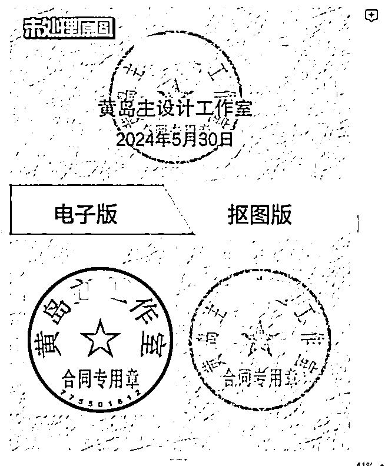

# 小红书店铺虚拟项目玩法，软件赛道每天变现100-200，一条龙实操保姆式分享给你

> 来源：[https://o0yvn3o31a.feishu.cn/docx/Ri5Pdmd0Eo6XA6xk06VcxjNrnLe](https://o0yvn3o31a.feishu.cn/docx/Ri5Pdmd0Eo6XA6xk06VcxjNrnLe)

大家好，我是黄岛主！

最近在小红书上操作了一个不错的虚拟电商项目，主要是开店去卖一些软件工具，每天能大概变现个100-200左右的收益。目前操作流程已经全部跑通，很适合各类的软件工具，除了有版权之外，基本上刚需版权弱的一些软件工具都适合在小红书上去做。当然了，你有原创的软件更好，因为我们也尝试着去把一些出单比较好的产品进行重写并贴标去卖，效果也还算不错的！

简单截图点店铺数据图：

备注：还有一部分都是微信私域付款的，凑吧凑吧100-200左右

我来简单的介绍下这个项目：这个项目很简单，主要是注册小红书账号，在小红书上开店铺，在店铺上传软件工具等上品，再去发笔记去做种草或者搜索或者热门等引流购买，然后自动发货给客户，最后也就是简单售后服务等。

那么，我们主要卖这几个产品【电子章下载工具】【B站视频下载器】【QQ音乐转换MP3工具】【potplayer播放工具】，这三个在小红书上算是比较刚需的，尤其是做旧的电子章下载工具。而且，这类工具溢价空间高，比如电子章工具，自己做和远程代做，收费价格是不一样的。就跟你清理 电脑C盘，给你软件和远程代清理是不一样的收费标准！

看似很简单的小红书店铺卖虚拟产品，实则很多玩法和细节，就比如售后服务这块，可能会遇到一些不懂软件安装或使用的，那么你就得去远程或者开语音教他。当然，还有很多操作地方的细节，下面的内容我也会讲到。

那么，今天这篇文章属于我们实操复盘了，会从账号注册、开店操作、上架操作、笔记操作、发布操作、自动发货等多个方面给大家讲解。看完后，也可以自己去操作不同的软件工具！因为这个有太多的工具可以做的了。当然，有感兴趣的圈友都可以一起交流哈！

关于项目操作的内容，下面我们具体的来看下：

### 一、小红书账号注册

小红书注册还是很简单的，有手机号和手机设备就可以去注册，流程包含这些：

1、手机里下载小红书APP

2、选择手机号登录

3、输入手机号，获取验证码，勾选已阅读并同意

4、然后点击登录

这里不详细说明了，这个大家都会注册，但是有几个细节要点，我简单说下：

1、一机一号一ip：单独一台手机，一张手机卡，用流量注册哈，需要流量卡渠道也可以找我推。只要你保证注册的是新号就行了。

2、注册时，生日选择大概1个月内的。因为小红书生日当天会发一张生日流量券，有效期半个月，这个到时候有利于发笔记的时候使用！

3、小红书注册需要选择年龄：30出头就行了；爱好什么的，随便选就行了。

4、先不用修改小红书名字，也不写简介。建议发了3篇笔记后，再改名字和写简介，不要一上来就改哈。

5、我是建议大家新开账号，或者把老账号注销掉变成新账号，不要用发过其他内容的老账号来做这个项目。

第一点：老账号如果长期发一个领域的内容，标签已经定死了，换个赛道不容易热门

第二点：你的老账号可能长期没发布，账号权重流失严重，再发就不热门了

所以：空白新号，你从0-1去做会更顺畅，不会有那么多的烦心事

关于注销方法无限注册小红书新号的方法，我也说下：

0、打开小红书，找到我→点击左上角三条杠→左下角设置→账号与安全→能看到设置的界面

1、找到绑定信息，绑定自己的qq或微信都可以，这个每次注销之前都要操作一遍

注意：除了QQ，还有苹果ID，微信、微博，都可以绑定，注销后用绑定的这些账号去登录就行了。

2、绑定号之后，再去点击最下面的 注销账号，注销的时候会让你先验证身份，验证下即可

注销原因：其他原因

3、注销之后，然后用你绑定的qq或微信 去登录小红书

4、登录后，可以到设置界面 去解绑QQ，而下次注销前重复绑定QQ即可。完了之后，再去绑定自己注销前使用的那个手机号。

5、绑定好手机号，完了之后，就是新号了。

6、手机的通讯录，最好添加10个认识人的手机号，打开之后，默认发现好友，这个是模拟正常用户注册哈，如果本来有就不要考虑这个。（APP允许访问通讯录就可以）（手机设置里设置允许访问通讯录）

### 二、小红书养号方案

说真的，有时候我们不养号，账户注册完直接发布笔记，有适合觉得养不养发完都是一样的效果。但是我建议哈，你可以边养号边发笔记，这样至少账号是活跃的，如果你只发笔记而不去看其他人的笔记或不去活动，平台会检测出你的账号活跃度质量的。

所以，你要养号的时候，你定位好软件工具，比如你做的是电子章工具，那么你平时就去刷这类工具的笔记，没事点赞、关注、评论等，其实也就是模拟正常人去刷笔记这样。

那么，我们把账号注册完成以及养号完成后，就开始开店和做笔记内容了，这个很简单，下面我们详细看哈！

### 三、小红书开店操作

店铺数量建议

一个网线，可以带3-4个店铺，没问题！如果你放大，就正常开店就行，前期基本上都是一个店铺测试！

开店地址

这个链接是直达的，https://customer.xiaohongshu.com/login?service=https://ark.xiaohongshu.com/

打开之后，手机号登录 选择个人入驻即可

开店建议

我们可以开个人店或个体店，前期先个人店铺

保证金建议

保证金是1000，但是这个可以先不交

不交的情况是：不能提现，但是我们可以等提现的时候交保证金

开店步骤

1、打开开店直达的网址，打开之后，手机号登录 选择个人入驻

https://customer.xiaohongshu.com/login?service=https://ark.xiaohongshu.com/

2、选择个人身份入，点击立即入驻

3、填写相关资料和刷脸

这里要注意：

第1点：昵称 会匹配小红书的昵称，如果和其他昵称一样，会提示让你更改，这个时候你改小红书的昵称，然后退登后在重新填写资料确认下一步

第2点：会让你选类目，这个时候选择我们给的虚拟类目 [艺术潮玩、艺术品及周边、艺术定制、虚拟定制]

第3点：这两个必须完成的资料要填写好【地址设置】、【店铺信息完成】：

第4点：经营类型，这个，勾选类型3或类型4都可以，任选一：

第5点：物流模版 里的地址可以填写真实的，但不是你的地址：

4、最后填写完成，会提示你审核中，然后没一分钟就审核完善，刷新下 可以进到后台

5、绑定下银行卡和微信或支付宝收款

先绑定银行卡，才能申请微信支付，审核过才能用

银行卡直达链接：https://ark.xiaohongshu.com/app-merchant/card-manage/home

微信开通直达链接：https://ark.xiaohongshu.com/app-merchant/third-settle/regist/wechat/apply

支付宝开通直达链接：https://ark.xiaohongshu.com/app-merchant/third-settle/regist/alipay/apply

注意，主营类目 ，填写默认的 零售批发 就行了

绑卡的时候这个选择短信验证：

其他的也没啥，然后就开好了，很简单没啥难度的，就是比淘宝复杂点！

### 四、小红书上架操作

产品选择

具体这几个品为主：

1、电子印章生成器

2、网易QQ音乐转MP3

3、B站视频下载

4、potplayer播放工具

确定完了，就看下面的步骤了！

类目建议

类目我们选择：艺术潮玩、艺术品及周边、艺术定制、虚拟定制

上架方式

这里我们采取手动上架哈，因为手动上架我觉得比搬运更好一些！

图片制作

这里先把主图制作好，方便我们后期用到哈！

主图尺寸800*800，详情图尺寸800*不限制，基本上跟淘宝一样，如果你做过淘宝，这个很容易操作！

1、主图制作

第一种方式，自己做

自己做，就是正常跟淘宝一样了，做主图套图即可

第二种方式，用哈士奇插件下载小红书或者淘宝上的同行图片，一般淘宝的都是1:1的图片

这是哈士奇安装地址：https://hsq.dangxun.com/安装浏览器就行了

淘宝下载演示：

小红书店铺的主图，需要从手机端转发到微信，然后微信里打开链接，然后用哈士奇下载

2、详情图制作

跟主图下载方式是一样的哈

图片做好了，就可以看下面的上传步骤了

上传步骤

后台直达地址：https://ark.xiaohongshu.com/app-system/home?from=ark-login

具体上传步骤如下：

1、左侧找到商品，点击发布商品

2、填写标题，30个字符，可以淘宝、拼多多、小红书等店铺内复制人家的标题，别带违规词，具体违规词我在整理出来。

3、上传主图，这个需要1:1或者3:4的主图

点击上传图片，先进到图片空间，创建主图和详情图的文件夹，这样分类好，不会很乱

然后点击上传图片，然后选择图片即可上传

图片不要超过3M哈

4、以上的，我操作了个完整，来看下，这里我换了个工具演示

填写信息

注意了：没 红星的 不要填写 只填写带红星的属性

1、标题第一步的时候自动填写好了，不需要动了

2、其他属性，看图设置，跟这个一样就行了

3、价格填写

这个价格填写，可以按照对标的价格设置，如果对标有打折价格，可以先按照打折价格设置（就是按照对方打折后的价格填写我们的一口价），具体打折的方法我在研究。

这个位置也是设置SKU的，点击批量填写：

4、上传主图，默认是7张，可以全上完，也可以五张，这个可以套图上传，也可以把产品图截图上传，自己编辑好

5、详情图上传，可以套图上传，也可以把产品图截图上传

6、服务信息设置

强调下：把这些设置好，因为是虚拟，一定要选无物流发货，开店的时候会涉及到模板，去怎么设置物流模板，是否预售，非预售，发货时间选24小时，系统默认非偏远地区包邮模板，要选成全国包邮模板，开售时间选直接上架，选手工上架都可以，支持七天无理由退货不要选。

7、然后点击提交商品

8、等待审核产品就行了

注意事项

1、标题和图片里不要带【软件】2个字，这个到时候会出现各种原因，如果有圈友做了，到时候出现了在交流

2、哈士奇下载出的主图和详情图可以直接用，但是不要带人家的水印，可以去水印（直接套进美图秀秀里消除笔就可以）或者水印多的话可以自己制作模仿

强调：如果直接复制淘宝商家的主图详情，一定要看看有没有水印，你有水印就不用，审核一遍没水再用。

到此，上架完成，我们再看下一步的操作！

### 五、小红书笔记操作

内容撰写

笔记的内容，核心点：找同行，找对标，谁做的好抄谁，对标笔记点赞至少100以上，评论也需要50以上（越多越好）然后AI改写之后复制到小红书排版就可以。

内容我们选择AI，用这个讯飞AI工具 https://xinghuo.xfyun.cn/

具体做法看下：

1、内容找对标、找同行，直接抄别人的，可以电脑端上复制文版，也用可以龙猫工具大师、抓猫图+提取，这个是APP，自己搜下然后下载安装。比如抓图猫+，看图！

2、用讯飞星火修改，这把文案复制进来，点助手中心，找到小红书种草文案助手，让它帮我洗稿，洗稿之后直接拿来用，或者稍微修改就可以，复制到小红书需要排版，加一些换行、空格就ok。

文案的前面要加上这个：帮我洗稿：带上内容

AI生成之后，记得查下敏感词：

A.句易网（要关注公众号）：http://www.ju1.cn/

B.零克查词（要填资料）：https://www.lingkechaci.com/

把敏感词去替换下哈，已经要查询下的！

3、来看下写标题的方法，直接讯飞后台搜索 标题 ，找到小红书标题

找到爆款笔记的标题，然后在小红书标题助手里 输入标题，自动给你整三个，每次输入都不一样哈

图片制作

软件工具类的图片制作思路：抄爆款的图片，然后自己模仿制作！制作几张图，都可以看对标，或者3-5张 都行

一定要注意：不能抄袭，容易被举报，如果开店铺了，就必须走原创路线！

具体图文步骤如下：

打开创客贴网站：https://www.chuangkit.com/designtools，手机号登录注册一下账号，点击电子左边工具栏里的创建设计，自定义设计，把尺寸大小输入一下，可以看下面这张全网短视频平台的尺寸参考。

然后把下载好的背景图片拉进去，调整到合适的位置，左边工具栏点素材，添加文字，抠图版和电子版，点击素材，找到形状，有很多形状，喜欢哪个直接放哪个，放两个，把颜色分别调一下，然后添加一个三角形进去，放到中间位置。

再添加文字，点击文字，添加文字输入，电子版和抠图版，调整字体大小放到合适的位置，上面再添加文字未处理原图，有很多文章效果，可以自己选一个，拉到左上角，字体要改一下不是会员的，然后在上面再放个印章，输入logo，点击文字添加，比如黄岛主设计办公室，调整字体大小，再复制一层出来写一下日期，2024年6月25日，字体直接用黑体。

图片做好之后，想图章在字上面的话，可以点击图章鼠标右键上移一层，图章就跑到字的上面了，图片制作完之后右上角下载，原图无压缩下载，图片制作好之后，发布的时候标题、话题要参考同行稍微改写一下。

图片传输

图片做完了，要传输到手机上发布，这个时候，可以用下面的方法去传输

如果电脑做视频想传输手机的看下：

第一种方法：苹果手机的话，在手机和电脑上都下载爱思助手，然后用数据线连接起来，传的时候手机和电脑都要把爱思助手打开才会传过来。

第二种方法：就是QQ传输，QQ同时在线，点击我的设备里有 或搜索 我的

第三种方法：更简单，如果你网盘开过会员，可以电脑上传，手机原画下载即可。（如果不能下载，请重新安装最新的百度网盘APP，在尝试下！）

### 六、小红书笔记发布

发布篇数

1、早中晚各一篇

时间段可以这样：早上7点一个、中午11点一个、下午4点一个

另外，我们要看下起号和没起号的篇数建议：

2、没有起号的2至3篇，必须的

3、已经起号的，基本一天1至2篇，大部分情况下是一篇，

总结：建议大家全部做到一天三篇

发布流程

笔记内容和图片准备好之后，可以按照下面的去发布！

标题：讯飞AI生成的，笔记操作里讲方法了

封面：自己做图，不要搬运，如果搬运违规了，号就废了，我们做店铺的笔记图片要原创

描述：讯飞AI生成的，笔记操作里讲方法了

标签：参考同行对标的，直接复制来

最后发布即可！

发布频率说下：

这里我说下，你做哪个工具或者多个工具，你要坚持每天更新笔记，目前小红书只要坚持更新，每天都会有询单或成交。不要断更笔记，一定要注意了！

### 七、小红书自动发货操作

前期不赚钱，可以手动发挥，或者用免费几天的阿奇索自动发货工具，因为购买也要几十块钱的成本，如果不赚钱就会亏损一点！

这个是直达服务市场的链接：https://ark.xiaohongshu.com/app-seller/service-home

前往服务市场，搜阿奇索，自动出来

点击后，前往获取，如下图

我这是开过的了，没有免费的周期，但是你可以看下大体价格！

基本上，刚开的店铺，去买阿奇索是有七天免费试用，七天过后30块钱一个月！

然后购买了就行！

购买之后，阿奇索平台需绑定一个91卡券平台后才能正常使用，所以你需要去注册91卡券，点立即绑定，可以起一个名字，或者用手机号也可以！

阿奇索操作也很简单：

首先下载自动发货助手，打开阿奇索有商品设置，手动发货，发货参数助手下载，点助手下载，点同意，点下载，点更多信息，点人员运行，然后小红书需要去店铺里去设置邮箱。

最后登录上自动发货后台，助手设置可以查询订单，包括发货日志：

然后添加你要自动发货的那个产品就行了！

这个其实很简单，有问题可以交流的！

### 八、操作经验复盘分享

1、关于客户遇到问题的处理

软件需要给客户解决问题，这样好处就是和客户有沟通的机会，客户满意，可以让客户点关注，让客户给好评。这个很重要，都是客户真实的评论，和刷的好评还是有区别的。因为聊天记录，解决问题等等，就是自然真实的好评。好评提升店铺的权重，获得更多的曝光，也会让客户放心的下单。

具体解决问题过程中，一定要有耐心，帮客户解决问题。即使客户要申请退款，也不要烦躁，先答应，然后帮客户解决问题。因为这个客户的问题不解决，下次遇到这个问题，还是不会解决。解决了，下次遇到类似的很容易搞定。

分享两个客户，一个客户我给她解决问题，她是自己不懂看错了，说我软件不行，要退款。我同意了，没和客户杠，给她退后，我还在给她解决问题。后来问题解决，客户自己意识到了，然后不好意思，又重新拍了一单没退。

还有个客户，远程帮她解决，教她使用过程中，给她便捷的方法还帮她调试好，尽可能让她自己操作简单。这个客户拍的9.9，远程是29.9，我啥也没说，就给她远程。解决后，她自己又拍了19.9。如果这个客户在解决问题之前要价加钱，她肯定感觉不爽的，然后就退了。刚开始的时候，不能把赚钱看的太重，重要的是把口碑和权重做起来，后面就不愁没成交，眼光要看远。

2、提前了解工具的使用等情况，自己先去用下看看

刚开始做的时候遇到很多问题，比如软件怎么用，啥的都不懂，所以我建议你们先去了解下软件工具这个赛道，先提前弄懂你要卖的软件，不然出单后不知道怎么去售后服务！

就是自己先安装试用测试下，软件到底有没有问题，运行是否稳定，功能是否都能用。因为我选的很多解锁会员的手机软件，但是我在自己手机安装发现，很多功能是用不了的。

如果想省事，去同行那边采购，可以省去很多麻烦，但自己也要熟悉软件。客户购买的时候，一般都要咨询下，问些问题。买了之后，在安装和使用过程中也会遇到问题咨询。小红书女性用户偏多，电脑小白，啥都不懂，教程看不懂，远程示范操作几次才能学会。这个过程特别耗时间，不像卖课程那么方便省事。

3、发布的一些实操经验

如果有品出单，然后第二天这个单子一定要优先写笔记发布，趁热打铁，有可能会出现爆品。而有些品感觉很实用不错，即使写笔记也很难出单。

4、做图的一些实操经验

目前都是参考对标的主图去做，其实之前一到做图就头痛，现在不怕了，因为习惯了哈。另外文案一定要参考同行，然后ai修改就可以。这样做刚开始可以跑通项目，但是要做爆款笔记，还是有点难度的。

目前都是几千的小眼睛，虽然出单，仍然没出现爆款。笔记暂时没出爆款。所以后来发现先，出爆款其实有点困难，但是不影响每天出单。所以目前每天100-200左右的变现徘徊！

5、如果客户要退款，就给他退，防止投诉

小红书的用户质量还是不错的，退款的很少有，除非那种不得不退的，如果你不给退款肯定会被投诉，店铺分数会下降。说真的，白嫖的很少有，基本上遇不到！

### 九、小红书软件工具类的选品

可以去淘宝选品，基本上我们都是淘宝选品，选销量不错的，然后去小红书搜索分析，看看销量如何，如果销量不错，笔记热门度不错，而且店铺商品5-10个左右，就可以去测试下看看。基本上一个品的笔记发七天看看是否出单即可。

这里就不详细说了，按照上述的选软件工具没问题的，而且选品是个大工程，后期在一点点分享给大家吧！

简单说说这些类型的小工具，都可以测试，要分析看刚需如何（都是网页端，也可以制作成软件模式）：

疯狂星期四文案生成器http://t.cn/A6CAwfi3

辞职信生成器http://t.cn/A6K7CObS

二维码生成器http://t.cn/RcUVEd1

LOGO生成器http://t.cn/RBleAEV

装13生成器http://t.cn/A6hg1WfQ

EVA标题生成器http://t.cn/A6aX6DOn

记仇表情包生成器http://t.cn/AiOgFEAC

自动剧本生成器http://t.cn/A65XPS0G

摩斯密码生成&翻译器http://t.cn/EvfElat

文字删除线生成器http://t.cn/R9MLP7M

中二称号生成器http://t.cn/A6MYY7mu

申论生成器http://t.cn/A6SjCMQ2

电子包浆图生成器http://t.cn/A6XGTcCS

下划线字体生成器http://t.cn/Ex05SmN

废话文学生成器http://t.cn/A6660mNj

热搜生成器http://t.cn/A6JYcuW2

抽象话生成器http://t.cn/A6MgIAC9

抖动字体生成器http://t.cn/R9C0Tmu

谐音梗生成器http://t.cn/RVooL8n

像素画生成器http://t.cn/A6AaYxRE

表情包文字DIY生成器http://t.cn/REnYN8W

颜文字生成器http://t.cn/R4ScOGq

格子图案生成器http://t.cn/hGBPEk

摸头生成器http://t.cn/A64SPhcx

备注：以上仅仅是为了参考哈！

### 写在最后：

差不多写到这里，有需要操作的可以跟我一起交流，还有很多赛道都适合小红书店铺变现哈。当然，可能工具分享出来就泛滥了，但是不影响大家去做其他类型的工具，关于选品其实也很简单。后期我在更新到这个文档里吧，先这样！