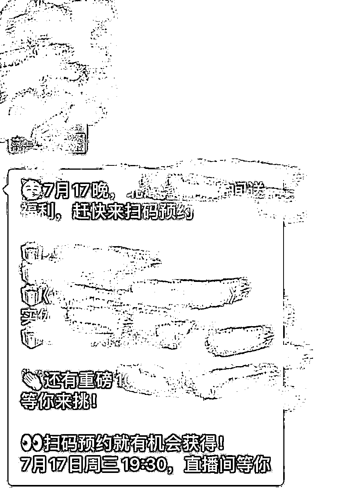

# 私域+知识付费话题：如何通过增加合理的触达次数，提升2倍以上成交率？

> 来源：[https://oee5lr7gsk.feishu.cn/docx/Rt70d1mVBoG9ePxH8x7cC4ZVnQb](https://oee5lr7gsk.feishu.cn/docx/Rt70d1mVBoG9ePxH8x7cC4ZVnQb)

全文共：9,671 字

预计阅读时间：9.43 分钟

圈友们好，我是根源

目前已经在知识付费、以及私域运营的赛道深耕两年半

这一年多，跟明白老师还有陈雪美女一起做俱乐部（日新月异俱乐部）

成绩都还稳定，年度基本都能维持七位数的利润

会员的净成长跟复购率，数据也都挺好

这次想分享的的主题是私域的二次转化

如何通过增加触达次数提升复购率

这是一个我非常喜欢的主题

我知道很多圈友都有在做知识付费

在用户第一次付费之后，大家最关心的问题一定是

如何能更有效的，让用户能够再继续购买更高单价的产品？

刚好最近一个学员的提问案例

我想就着这个案例，跟各位分享下我自己的看法和做法。

希望这些经验或方法，能帮到正在看文章的圈友

很欢迎看完文章后

能一起讨论。

* * *

# 『公域』跟『私域』最大的区别在于运营思路的不同

我想对于私域二次转化这件事情，应该是大多数人都在烦恼的，

### 如何可以更有效的让第一次付款过的人，

### 过个五天、十天或者过个两个月能够再继续购买更高单价的产品？

前天有个学员问我，他就说：

老师，现在我每天引流进来的学员很多，但我发现处理不过来，

有没有什么更高效的方法或者是什么样的软件，

可以让我更好的去经营这些好友？

我就可以节省更多的时间，提高更多的效率。也能更好地做二次转化

我一直觉得『公域』跟『私域』是两个截然不同的运营逻辑。

* * *

## 公域的运营追求的是效率

公域更像是发公告，也就是我先透过一定的影片、一定的图文，

然后让用户可以因为这样加到我好友。

但是，加到好友之后就一定是私域吗？我觉得不是。

如果加到好友之后，你依旧是用固定的内容，或者是固定的快捷语，或者是固定的公告，

来让他们可以对你有更好的印象。这依旧是一个公域的运营方式。

也就是一个人加入到你的微信通讯录之后，还不能够代表这个人就一定是你私域的人。

因为『公域』跟『私域』最大的区别在于运营的思路是不一样的。

公域的运营思路就类似于

我今天把一个人拉到了我的微信群，如果他因为小红书的某个图文加到我的微信群，

那微信群可能有100人，在我看来，这个微信群都不能算是我的私域。

虽然，这个用户已经从小红书进到我的微信通讯录。

因为很多人在运营微信群的时候，可能只是用固定的课程内容，

或者是时间到了发公告，或者是发一些以前可能我曾经发过的的某一个课件，

在这个微信群是免费的情况之下，这些举动都只能算是公域的某一种操作模式。

那这种方式是否能够把公域引流来的人，

因为我的运营转而变成我私域的名单，并且会愿意为我做第一次付费？

我认为其实还是可以的。

但是，成交率跟过去相比就会低非常非常的多。

以前可能这么做，群转化率都可以到15%或者20%，甚至高一点可以到30%，

但是现在如果用同样的方法，转化率可能就会低到只剩3%-5%。

就类似这样的讯息，发这则讯息的平台，是一个我很喜欢并且付过四位数金额的平台，但收到这样的消息，我确实很感谢平台方用这种方式提醒我。

但次数只要多，我根本连看都不会想看，只会觉得烦躁，因为这种格式一看就知道是群发，或者是机器人操作，体验感会非常的不好。

但平台这么做，不就是为了增加转化吗？

既然想增加转化，动作都要做了，为什么不能更贴心一些，这其实是个很值得讨论的问题。

当然，针对这个话题我的看法不一定准确，因为我目前的项目规模，会员人数也只在两千人以内，就是个非常小的团队。

如果哪天不小心扩大，我是否也会犯同样的错，又或者是这样的方式才是最好的大规模的运营方式，我也不知道。

但就目前来说，我其实并不喜欢被这样对待，尤其我是个已经付过费的用户，这是一种感觉问题。

* * *

## 私域运营的关键是增加跟用户的交情

如果真的要谈到私域，私域的终点在于：

我能不能够私下跟这个人可以产生更多的交情。

因为这个时代的内容太多了，如果说今天我把那些人引流到我的第一次的免费群，

假设我没有让这个群能够出现很特殊的运营方式，或者是可以让他们感觉眼睛为之一亮的内容。

又或者是我无法做出很特别的设计图片。

其实对于这些用户来说。

我就只是再一次的加入了另一个免费群，反正这个东西也是免费的，所以他们也不会珍惜。

也就是当我想做二次转化之前的第一次转化，有一件事很重要，

就是我如何可以跟进群的每一个人，或者是进入到通讯录的每一个人，有更好的私下交流。

### 我对于私域的定义就是——私人聊天。

我如何可以把这个人跟他在一对一的过程，可以有很不错的关系维护，

这个时候当他愿意在私下跟我多聊几句的时候，这个才是我的私域真正的有初步的建立。

* * *

# 私域的触达，就是创造再次聊天或者建立关系的场景

在私域转化里面，我有一个名词叫『触达率』。

这触达率就是我会用什么样的事情，或者用什么样的事件

增加我跟这一个新好友私下能够再次聊天或者再次建立关系的场景。

就类似某一个可能免费打卡营结束之后，我会给每个学员发结业证书，

那通常结业证书可能有以下的几种方式去做发放。

⭕️第一种

可能是把这个群的所有人的头像做成一张头像墙的结业图片，

我把这个图在群里面发，然后跟所有人说，这个是我们这次的结业证书，

那欢迎你如果说觉得喜欢的话，可以把这张图发到你的朋友圈，可以去帮我们做一点推广。

⭕️第二种

可能是给他一个网址，那个网站点进去之后，

他可以直接生成属于他的头像的结业证书。

⭕️第三种

这个方法也是，我个人比较常用、并且我也一定会这么做的方法。

我会私下的一个一个把结业证书发给每一个人，

这个群有200人，那我就发200张，这个群有100人，我就发100张。

我会私下的每一个发，然后，我在发的时候，我不会有固定的话术。

当然图是一样，图是同一张图，那个图可能同时会有他的头像，会有他的名字，

然后我在内容编辑上，我不会复制贴上，我会重新的用跟他聊天的方法。

在发毕业证书的过程，跟他聊天。

我自己的原则是：

我不会让他感觉是群发或者是复制贴上的方式在给他发毕业证书，我会让他感觉到我真的在跟他闲聊，并且很认真的想谢谢他。

就类似：

小明

你好啊，

我是这一次的社群的讲师，

那特别来找你是因为

我这一次的活动的七天

很谢谢你很认真的把七天都参与完

所以我是要来

私下给你发毕业证书这段话

我可能会拆成三段发，我不会一次性的发。

因为当我一次性的发，太长的语言，会让对方感觉我是不是在群发，

又或者是我是不是又用了复制贴上。

这个举动看似很浪费时间，但这个举动有一个好处

我能够透过一次的机会，一次非常合理的机会，跟这个群里面的人再一次的有链接。

让他知道就正因为这个事件，我去找他聊天，给他发毕业证书再合理不过了，

这么合理的理由就会让他看到之后会愿意给我回，会愿意给我回复。

* * *

# 每一次触达的目的，是为了让用户感受到重视感

因为私域还有一个重点，那重点就是

### 要让对方感觉到我是专门为他服务的，

### 而不是我只是顺便服务他，这是一种体验感。

就是私域只要体验感不好，这个人他就对你不会有印象，也不会深刻，

所以，这个触达率最大的点在于：

我如何能够增加一些很合理的理由，然后让对方感觉到我是很在乎他的，我是非常认真服务他的，我对他是很不一样的感觉。

如果创造的好，就有机会可以因为触达率的增加，就让我的转化率也可以同时提升。

又或者是我的课程基本上都是用飞书直播，那飞书直播完，

如果说有人当天没有上课，那他会点回放，他只要点回放，我的每一次的直播都一定要重新申请。

就是如果他当天在课堂上，他可以不用申请，他可以随时回看，

但如果说他当天不在，他就得再一次的申请，然后我必须在后台点确认，

这个其实也是另外一种触达率的方式。

因为他只要点申请，我就得确认，也就是，我能够知道这个学员什么时间点申请上课，

那他只要申请之后，我可能在点确认完的那一刻，我就会私下的跟他聊天。

我就说

谢谢你那么认真的补课

如果是早上，我就会说：

一早上你这么勤奋

就大家都在上班

但是你却有时间可以把这个课补完

谢谢你的认真

那我已经给你点完确认了

你可以去确认一下

你可以去查看一下

那如果说他是中午申请，我就会说：

真难得！

这个下午的时间不午休

竟然选择补课

把课认真的上完

这些都是让我有多了一个机会，多了一个非常合理的理由，

可以私下再找他多聊一次，这时候我就再一次的增加一次的触达率。

那我就可以跟对方聊个三五句，聊个五六句，当触达率的次数越多，就代表我跟这个人的关系一定会越深。

同时也会让他感觉，

我被这个老师特殊的对待，或者我被某一个工作人员特殊的对待，

当这种特殊对待的感觉加深的时候，他就会对我们的印象更好。

他就会发现：

哎，你们好像跟其他的交付的团队不太一样，

你们真的很认真的去关心每一位学员，或者每一位学生。

所以，这个触达率的目的就是要让对方感觉到我们真的很认真的在乎他。

也就是合理的触达次数，只要越多，就可以让对方能够得到一种很特别的感觉，叫情绪价值。

只要情绪价值越高，他对我们的印象就会越好。

当我要再次转化他的时候，他就会越有机会同意。

如果他的能力范围是可以的，他就会有更大的机会再次购买我的二次或者三次的产品，

就算这个金额高，他都会愿意考虑，愿意认真的考虑。

* * *

# 私域增加成交率的关键是，增加合理触达的次数

那这时候我就会思考，

### 有哪一些举动可以增加触达率，可以合理的增加触达率？

⭕️可能发毕业证书。

⭕️可能是在群里面会有打卡。

然后打卡我们内部会有统计，

有一些学员打卡特别认真的，我们14天打卡有人全勤。

有人完成了13天，有人完成了十二天，他完成率可能高达80%以上，

那我可能觉得特别为了他做一张不同的证书，然后私下再去触达他。

又或者是当天打卡，有人字数写的特别多，我会私下跟他讲说：

哎，我发现你打卡特别的认真。

这些其实都是一个增加触达率的方法。

⭕️又或者是我在群里发红包，有人的红包领的特别多，或者是有人红包领的特别少，

假设这个红包是100块十包，平均每个人都领到这个十几块，唯独有一个人只领到了一块，

那我可能就会私下了跟这个一块的人讲，这个刚看到你的红包领的特别少，

我再给你私下发个九块去补十块，让你的感觉更好一点。

这个也是一种触达率。

所以，如果说可以让触达率增加的越多，我就可以跟这个人产生更多的私下交情。

私下交情只要越多，就代表我跟他的信任感就会越高。

信任感越高，我接下来要再一次的成交更高金额的产品的可能性就越大。

但是在私下触达的过程，有个事情千万不能犯，

就是私下触达的过程，你依旧复制贴上某一个很大一段的内容给他。

这个对他来讲，就像是我再一次的私下给他做群发，这会让客户的感觉非常非常的不好。

所以，一定要区分重要内容跟聊天的方式，

只要是重要内容都得用聊天的方法，让聊天的过程可以一步一步的。

让他感觉我是真人在跟他聊天。

所以，在私下触达的过程，尽量不要给自己设定什么SOP，也不要给自己设定什么固定话术，

因为当固定话术设计得不好，他就会觉得怎么又是个机器人，所以他不太回复你也是很正常的。

在私下触达的过程，也可以去测这个人对于群的活跃度跟对于讲师的认同度有多高，

在边测的过程，再看他们回复内容跟回复字数的比例，

就能够知道这个人他有没有机会可以在第二次产品的时候再次的复购。

* * *

# 私域的经营要考虑的都不是效率，而是如何增加信任

也就是我们在做私域转化的时候，只要脑袋中开始出现了----

我想省时间，我想省略一些步骤的这种想法。

那这个就完全丧失了私域的价值，同时更丧失了私域的意义。

想想，我们耗费了大把时间跟金钱，终于把一个全新的人请到我的通讯录里面，结果我却随随便便的对待他。

就很像我追了一年终于追到的女朋友，在一起后每天除了说早安晚安、就没其他互动，这种感觉是非常有怪异的。

因为，我们认真的把私域运营做的更加的完善，更加的贴心一些，

最大的点在于我们才可以去收到更高单价的东西。

就你要想今天我们想给一个人付高单价的产品，肯定是我更信任他，

肯定是这个人对我很不一样，也肯定是这个人在服务我的时候，我发现他对我特别的贴心。

我发现这两年的知识付费跟这两年多之前的知识付费有一个很不一样的地方，

感觉好像愿意为知识付费的人数其实已经慢慢在萎缩了。

但我发现不是，人数依旧很多，依旧很多人会愿意为了知识付费买单、付钱，

但是就因为他们更想要的是，我不希望买到的只有知识，

我想买到的是能不能够有更好的人，更正确的人服务，更体贴的人来教我这个知识可以怎么使用，

也就是陪伴会大过于输出。

当然你的输出的内容要是做的不好，那肯定没人要。

也就是，内容做的好已经是本分内该做的事情。

但是我在把内容做好的前提之下，我必须得给出大量的时间陪伴，

我才能够让这个客户，或者是这个学员，他手边原本就有一笔钱了，他才能付给我。

因为，假设我谈销售，同样谈销售的课件，我们去小红书，到百度，到视频号，我们随时可以查到一大堆类似这样子的主题。

但是，这么多的主题，基本上我都能够做到免费获取，那甚至我去买本书，我也可以学销售，

但是为什么那个人要把钱交给你，让你教他销售呢？

很大的原因就在于，

原来我今天我跟你学销售，我发现我不只能够得到知识，我还可以得到更深度的陪伴，

当然你可以把价格提高，我觉得这个时候就是在相对高一点的预算之内。

客户真正考虑的就已经不是我到底有没有能力付这笔钱，而是你目前的服务方式到底值不值得，让我可以超出自己预算范围之内，然后把这笔钱付给你。

也就是客户想的都不是我不要付这笔钱，我没有能力付这笔钱，

客户想的是到底你值不值得，只要你值得让我付这笔钱，我想尽办法都会把这笔钱弄出来给你。

所以，这是我认为这个年代的知识付费跟两年多之前知识付费最大的区别。

* * *

# 私域触达的方法（延伸）

补充一下，前面提到的触达率的方式，我一般会有以下几种，我觉得挺不错的私域触达方法。

## 第一种：逐个私发毕业证

第一种就是发证书，在结业的时候特别给每一位发一张这次的证书，

可能是纪念，可能是证明什么什么都好。

那你开场就类似：

小明，你在吗？

或者是

小明早安啊

今天特别发信息找你

是因为我们这次已经正式的结营啦

然后这时候，我会习惯性先等对方回应

对方有回应我才继续往下说，对方要没有回应，我就会停止。

因为在那种群发的感觉是，我不管对方回不回，我先把我的内容发完再说，

也就是，等着对方是否有回应，这个事情非常的关键。

* * *

## 第二种：设计打卡小任务/作业，私下反馈

第二种方法就是在群里面去设计一些小任务，

可能是打卡，可能是写作业，可能是其他的方式。

那如果说，他的作业写的不错，就可以把他的作业截图。

然后私下去跟他说：

小明

我特别想跟你说

你的作业我看的印象非常的深刻

我觉得你写的特别的好

所以

就想跟你说一下

就是这段内容

我看的其实我挺有感觉的

我发现你怎么可以把上课的内容

运用在作业上

写的这么的贴切跟完整

这是第二种我也会用的方法。

* * *

## 第三种：开设课程权限，增加触达次数

那第三种就是，如果说有那种线上课，

我都会建议那些课程，尽量去做到有限制才能够去阅读的一个设定。

就像飞书我就习惯会设限制，如果说你要看这个内容，你必须得申请权限，

对方如果不点申请，那他就没法看见。

这个动作感觉麻烦，就是好像别人看这个课还得私下跟我说一声，还得点个确认，

然后我还得等我有空再申请，但是这个麻烦他真不能省。

因为当这个课变成是我随时点开，随时都可以看的时候，

就代表获取这个东西会变得非常的容易，那他就不会珍惜。

但如果我让这个获取的过程增加一个限制性，他就会发现，这个社群挺严谨的。

他们连这样子的课都设定了这样子的机制，然后当对方申请课的时候，你就可以私下跟他说：

谢谢你

特别在这时间把课程做一个申请

谢谢你的认真

谢谢你愿意复习

然后我已经点好确认啦

你现在已经可以去观看了

那如果说有什么是课程上你不懂的

你也可以告诉我

那这时候，如果说有做笔记或者是上课的一些重点，

在跟他聊天的过程，还可以顺便发一张图跟他说：

那你看完之后，

大概过两三个小时

我可以给你发一个

就是我自己对于这个课程内容

整理的一个重点

然后就可以发给他看，所以这也是一个触达的方式。

* * *

## 第四种：对打卡率高的学员进行回访

那再有就是群里的打卡率高的学员进行回访。

因为这个群如果设打卡作业，那我一定会在请工作人员做统计，

统计这个完成率有多少，那我一般都对完成率在70%以上的学员，跟他做点回访。

就类似于：

哎 很谢谢你这次的打卡

这么认真

你的达成率高达70%

已经是这个群里面

算最优秀最认真的一个群体

所以

我在我们这次统计完之后

我们有一个更特别的证书要送你

那如果预算足够，你可以送礼物，可以特别准备一份礼物。

但如果预算可能没有那么多，或者是这个群的价格本来就没有那么高，

那你可以发一个很小的红包，或者是可以特别为他做一张证书。

这也是一个这个触达，并且让他感觉到有获得感的方式。

* * *

## 第五种：随机选定学员，赠送小礼物

再来就是可以准备一些可能特定的小礼物，然后，可以随机抽样，可能固定抽群里面的10%的人。

如果说这个群100个人，可以随机抽十个，可以准备十本书，或者是社群有一些周边，

你就把这档礼物送给他们，就私下跟他说：

特别的想找你

是因为我们这一次

我们希望能够找到一些我们群的会员

或者是群的学员

能够给课程一些反馈

那这个如果写完反馈的话

大概可能要花两分钟的时间

写完之后

我们会有一份小礼物送给你

那这礼物是……

因为这个写反馈的人我们是随机抽取的，

所以，

抽到其实也挺幸运的

那我不知道

你愿不愿意为我们写一段课程的反馈

或者是

你能不能够给我们一些

这个社群怎么做可以变得更好的建议

然后跟对方要地址，把这个写上。

这些大概是我平时比较习惯使用的触达方法，我觉得也挺好用的。

因为这些方式它都非常的合理。

就现在的聊天，最怕的就是我们没有任何的理由就想去找他，

然后想跟他要到一些什么资讯，希望他给出什么样子的回复。

但如果这个理由够合适，然后我们在聊天的过程也不会让对方感觉到不舒服，

我们真的不只是因为我要你再继续复购而去服务你，

而是因为谢谢你信任我，愿意透过小红书，透过什么什么地方进到我们的群，

又或者是很谢谢你因为信任我们，所以给我们付过多少钱，

所以我认真服务你本来就是应该的。

这个过程就是慢慢的累积并且增加信任感的过程，当信任感达到一定的程度，

就是我们可以去判断对方在回复的时候，假设我可能打三段话，

对方会不会回个一两段话，又或者是我如果打字超过200字，

对方回的字数会不会超过个100字或者150字。

它有个比例，最怕的就是我不管打什么，

我可能打三四句话，对方就说收到；

打个五六句话，对方说好的；

打个七八句话，对方就说，没问题；

如果是这样，那就代表可能你的打字的内容，他不太喜欢，

可能他刚好有事，又或者是他就不太喜欢这么被打扰。

那有遇到这样子的情况就可以先放下，可以换下一个能够比较回复积极的人。

* * *

# 私域触达的三个注意点

## 不要一开场就说正事

然后在私下触达他们的时候，有一个原则就是

一种叫我要找到一个理由去跟他聊天的时候，我一定不会直接说正事。

就像我要发一个结业证书，我一定不会一开场我就给他发结业证书，然后才讲话，不会的。

我一定会说：

hello，小明，下午好，你在吗？

就有个事情想要跟你说

他如果没有回，我就不继续打下一段话，他只要回说：

怎么啦，有事吗？

我可能就会接着说：

我们的这一次的课程正式结束啦

那想着因为你的打卡

这次特别的特别的好

然后全勤特别的高

所以这个证书是我特别要私下给你发的。

这个角色，要么讲师来做，要么就是在群里面的很活跃的工作人员来做，这是最好的方式。

因为学员会认为，这些人是重要的，这些人是说话有话语权的。

这时候发的效果才会有，发的效果才会好。

刚刚说的一点是，我想去找他说一些事情的时候，必须得先打个招呼，

打个两三句的招呼，他没有回，我们就先不发，他回了再说。

* * *

## 不要一直说

第二点就是呢，切忌一次打太多的话，他就算回了之后。

如果说我发了三段话，每一段话可能平均三行，如果我发完他也都没回，我就先等着。

我一定不会一次性的把我要说的话全部一次性的说完，因为这会让他感觉到有压力的。

想象一个场景，今天你付费到了某一个群，结果，你忙了一整天，

晚上发现这个群里面的这个讲师，给你发了40条这个文字内容，你会有什么感觉？

你只会觉得有压力。

你只会觉得说想干嘛，这是想转化我是吧，这个想要再继续让我付钱是吧，感觉一定不好。

所以，过程一定要记得，就是私域的聊天是有对话性的，绝对不是一次性的。

我们就是用聊天的方法，可能我三句他一句，我五句他四句，

类似这样的方法，我们边聊边说，边聊边把你要说的东西慢慢的说出去。

多花点时间没有关系，因为这时间如果不花就没法成交高单价，

所以，这个是两个我觉得比较需要注意的，当然我们也可以在聊天里，一开始对方回了之后就看到说

哎

我可能会耽误你个三到五分钟

那你看觉得可行吗？

如果说可以的话，

我就有些事想跟你讲

只要说三五分钟可以，那我就尽量在三五分钟之内搞定这件事。

* * *

## 触达的时间不宜过长

也就是我们所有的触达率，在进行某一些事情的时候，时间绝对不能太长。

除非不小心聊开了，对方也愿意跟继续跟你聊，那就继续聊，

但如果对方明显感觉到他在忙，或者是他说：

哦，那没问题，但我可能只有三分钟。

正事先做完之后，我们再思考着，要不要继续聊下去。

就我们可以根据实际的场景，随时去改变。

所以，这流程就是先开场打招呼，然后等待他回应。

他一回应之后，你就跟他说，

我找你的事情

是因为……

那我应该会耽误你大概三到五分钟

不知道你现在有没有空

这段话最重要，一定要等他讲讲「那我可以」、「我有空」。

你才去讲你准备要干什么，你为什么找他，

找一个很合理的理由，跟他讲这个理由之后呢，然后再跟他说感谢。

再去闲聊的他一点最近的生活，朋友圈最新的前三篇，前五篇，聊个三四句。

但是，尽量在五分钟之内把这个事情搞定，

那如果说你聊五分钟，发现他好像还想继续聊下去，那就多聊几句。

可是，切记时间一定不能太长，不能原本想着三到五分钟，一聊聊半小时，这是大忌。

因为你不是只找他聊一天，你会跟他聊个三五天。

可能这是七天的打卡营，你可以把这个30分钟的聊天拆成每天十分钟，聊三天。

这个意义感就不一样，因为当第二天他依旧愿意跟你聊的时候，

就代表说，他对你的信任感是不错的。

所以，这个很关键，就是不要一次性的把那个量快速的就聊完，

我们可以分散到一周里面的三天四天，这个绝对会比一次聊一个小时要来的更有效果。

* * *

# 尾声的过去历史介绍

我是根源，同时也是第四期的生财圈友

一个有 2w+ 实战案例的心理咨询师

12年线下销售、团队管理经验。

2022 年开始转型线上，做一些知识付费的项目。

过去曾发表过几篇文章

都能看到这，代表你对文章的喜爱

肯定有一定的程度！

也欢迎阅读过去我写过的历史文章。

2021年的文章（精华x1）

1.  精华《直觉式萨克斯 透过社群成功变现146万》 https://t.zsxq.com/116B1bcYc

1.  《73项被动收入打造》 https://t.zsxq.com/11EHjTH0P

1.  《杭州夜话02场，夜话官复盘》 https://t.zsxq.com/19IkX4UMl

1.  《年入百万，团队从20人到4万人》 https://t.zsxq.com/19JYt77hL

1.  《主题：如何更有效的链接见面会认识的圈友》 https://t.zsxq.com/19VY2LWg4

2022年的文章

1.  《互联网小白，第 1 次做线上产品，7 天赚回 10 倍门票》 https://t.zsxq.com/11ooZZbM7

1.  《把捣乱分子『逆势』转成爱用者的好方式》 https://t.zsxq.com/19lipLhJ5

1.  《 好的内容，是目前依旧没退旧流行的变现方式 》 https://t.zsxq.com/19BLMAYw1

1.  《明白老师的一个启发，让我从100天日耕的过程赚了30W+》 https://t.zsxq.com/19BgNoxfi

2023年的文章（精华x6）

1.  《私域的意义不是管理，而是经营》 https://t.zsxq.com/19WEsfSq1

1.  精华《9年传统行业 1 年时间，从一无所有，到年入 200 万》 https://t.zsxq.com/10nmEr1cA

1.  精华《25个提高微信成交率的小技巧》 https://t.zsxq.com/11AgRW24F

1.  精华《35 个让私域收入翻 3 倍的技巧》 https://t.zsxq.com/11FmV2aqZ

1.  精华《续篇 - 25个提高微信成交率的小技巧（26 - 50）》 https://t.zsxq.com/13yRbmUwo

1.  《 私域话题：涨价之后，如何回复以及留住客户？》 https://t.zsxq.com/11UJk9HxQ

1.  精华《成为自由职业者的20个必备特质 》 https://t.zsxq.com/14XTxhh15

1.  《 36个让私域成交率翻倍的实战指南！ 》 https://t.zsxq.com/17zSrYzvk

1.  精华《产品线有引流体系，如何通过沟通促成升单？》 https://t.zsxq.com/17ocUJEFA

1.  《知识付费赛道，如何透过处理『反对问题』，增加用户粘性和复购率？》 https://t.zsxq.com/181fSc5rv

2024年的文章（精华x3）

1.  精华《第一次尝试「问答群形式」的公域往私域转化，7天变现11万》 https://t.zsxq.com/18gBXlWxE

1.  《 线上新手，我是如何用一套固定流程，累计成交 300 万高价产品？ 》 https://t.zsxq.com/18IWgDiXo

1.  精华《 私域话题-如何在客户咨询过程中，透过三个步骤提高2倍成交率？ 》 https://t.zsxq.com/196Ad34aR

1.  《私域的十倍增长话题：不同信任程度的客户，如何提升成交率？》 https://t.zsxq.com/YKHGT

1.  精华《 为什么都是做副业，我能第一年就达到七位数？ 》 https://t.zsxq.com/APodD

1.  《 写作赛道，如何使用「算账思维」精准地评估产出？》 https://t.zsxq.com/ymcEE

1.  《 主题：私域+知识付费话题：如何通过增加合理的触达次数，提升2倍以上成交率？》 https://t.zsxq.com/uqU9P

多亏加入了生财有术

让我少走了很多弯路。

也积累了一些经验、心得

如果圈友有什么需要探讨的

欢迎加我微信「 AF54094 」交流~

▲

也能扫码撩我~