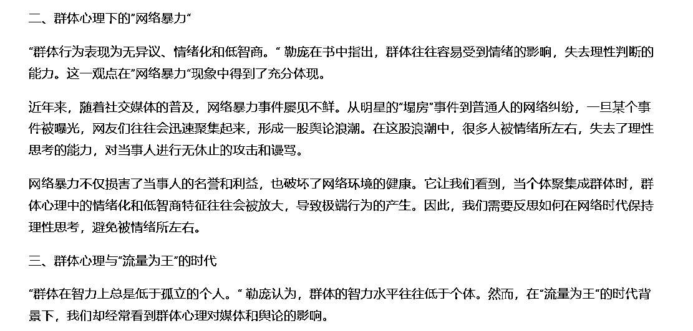
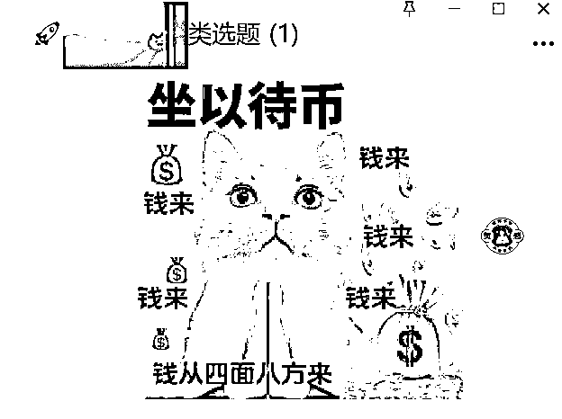

# 公众号新手首次航海冲出百万爆文，单篇收益6000+，单账号变现5位数，纯手搓&AI辅助手搓都能爆，我做对了什么？

> 来源：[https://yxy2hhcyyby.feishu.cn/docx/RxTKd79OTo3kBdx3x5Xcfztfncf](https://yxy2hhcyyby.feishu.cn/docx/RxTKd79OTo3kBdx3x5Xcfztfncf)

生财圈友好！

我是开卷，985写作硕士，6年文案，生财二年级生，公众号项目纯新手。

加入生财一年，从去年的生财首次航海第一到今年的公众号航海第二，我做过小红书电商、小红书个人IP、抖音图文带货、抖音直播和多多视频，赚到过一些小钱，但大部分惨淡收场。

当我怀疑自己是不是不适合搞钱时，痛定思痛，梳理了过往的经历，也找到了最强销冠@梁靠谱 做了咨询，决定无论如何要再做一次账号。

这次尝试，我放弃了别人说什么赚钱，我就做什么的思路，而是结合之前做头条半个月出过300W爆款，小红书图文做过万粉号和多个千粉号，抖音图文新手一周涨粉破千的经历，暂时放弃视频和直播，全力聚焦在我擅长的写作上，因此选择了当下火热的公众号爆文。

24年6月公众号航海，我运营两个账号，其中主账号文章100%入池，最高单篇阅读110w+，还有2篇50W+， 2篇20W+， 2篇10W+，其他大部分在阅读量在万次左右，单篇文章最高收益6000+，单账号航海号期间变现5位数。

这次航海，我所有文章都是手搓，由于去年体验AI的经历都不太理想，公众号项目期间也没时间摸索AI，所以航海期都没有上科技，而且个人觉得账号不多的时候，上科技和RPA，有种高射炮打蚊子的感觉。

但是航海末期，明显感受到长期纯手搓，时间和脑力都很受限，所以航海结束之后，我用国内AI工具优化了爆文写作SOP，一周也出了好几篇爆款，目前纯手搓（SOP-1.0）和AI辅助手搓（SOP-2.0）的数据差距不大。

本次复盘我会把两种写作方式都分享给圈友，和我一样接触公众号项目不久的新手朋友可以根据自己所处的阶段多多尝试。

本次复盘帖总结了从准备报名公众号航海到完成国内AI辅助写文的全部经验，内容分为三部分：

1.  新手入门纯手搓也能出爆款：如何如何又快又好地写好公众号爆文（开卷的公众号爆文SOP-1.0版）

1.  多篇爆款之后AI+手搓：熟悉套路的人如何提效解放生产力（开卷的公众号爆文SOP-2.0版）

1.  新手做公众号爆文：哪些坑千万别踩？哪些好习惯可以提升效率？

以下是全文目录，方便圈友按需阅读：

1.  百万爆款复盘：新手纯手搓的6大核心要点（开卷的公众号爆文SOP-1.0版）

1.  选题定生死：好选题的3大特点

1.  点击率＞70%，秘诀全在标题

1.  半小时搞定爆文，好结构是大功臣

1.  巧妙填充正文，读者欲罢不能

1.  运营细节把握好，爆文收益少不了

1.  搞定数据复盘，批量复制爆款

1.  多账号运营：AI辅助手搓（开卷的公众号爆文SOP-2.0版）

1.  国内AI工具实测，选择适合你的写作助理

1.  从鸡肋到效率加倍，新手如何用AI？

1.  爆款框架+AI辅助+手动优化=爆款制造机

1.  避坑&提效小Tips

1.  三大天坑，不看错万

1.  提效减压，三管齐下

全文共13723字，全部读完预计需32min，暂时没有时间的圈友可以攒起来慢慢读。

* * *

# 百万爆款复盘：新手纯手搓的6大核心要点（开卷的公众号爆文SOP-1.0版）

这部分，是我做这个项目最初版的SOP，从选题、标题、结构、正文、运营细节、数据分析6个方面展开分析，参考这种模式，你也可以建立自己的写作流程，把有效的项目经验复制和放大，完成第一篇爆款和无数篇爆款。

## 选题定生死：好选题的3大特点

我正式做项目之前，通读了三次航海手册，并且整理了更符合自己思维模式的思维导图。明明说选题，为什么要提航海手册呢？

因为大部分选题方法，在航海手册里写过了。航海群里很多人问选题方法，如果你也想问，建议再去读一读航海手册。

我虽然是第一次参加公众号航海，但之前参加过其他的航海拿到过小成绩，所以知道生财的航海手册的含金量很高。因此，我做了两个动作：

① 细读航海手册

开船前两天，我把上期航海的手册通读了两遍，对整个项目和重点细节有了认知。

本期的手册开放之后，我又把这次的航海手册通读了一次，看看有没有调整和升级。

相当于，航海手册我通读了3次，对整体重点有了感知，把握了重点，就不会在细节上纠缠，这也是我在做项目时没有很费劲的原因之一。

②整理思维导图

因为每个人的理解方式不一样，我整理思维导图就是用更符合自己思维模式的方式，把项目再顺一次。

虽然直到航海结束也还没有全部整理完，但是前期的整理，让我的输出没有什么卡点。

下次被卡住，再去手册找答案的时候，接着整理其他的，先做，在路上找答案。

有了这张思维导图，对项目有了整体认知，找选题的方向更明确，因为常见的找选题方法，都在航海手册里。

这里补充一下，我能做到入池率100%，在选题上另外注意的细节点。

刚开始，我找过多个公众号的多种选题，时间精力有限时，需要明确哪些更值得做，更有机会做出爆款，这个问题困扰了我好几天。

综合下来，我发现，能大概率保证入池和阅读量较高的选题，有三大特点：

### 选题之中，一定要有异常

“狗咬人不是新闻，人咬狗才是新闻。”

有异常属性的选题，本身具有新闻属性，自带流量密码，写好了，阅读就会很可观。

比如，“做博主月入五万，我却想回去上班了”

可能你会说，这和开幕雷击里的金钱元素有关，但是我也观察过，有金钱元素的不一定会爆，但是我写的方向，凡有异常元素，内容有看点，正文还不错的，都爆了，这就是异常的魅力。

后来，我发现，我的百万爆款，也有人仿写，但是数据都不怎么样，为什么呢？就是这些作者，把其中最重要的异常改掉了，文章就“顺拐”了，有看点的文章，变成了廉价的鸡汤。

看看这几个标题，你觉得哪个选题会爆：

1.  寒心！男人被狗连咬三次，竟无一人敢帮！

1.  震惊！男人被狗连咬三次，居然在大街上做出这种事……

1.  怒了！男人被狗连咬三次，竟被狗主人要求赔偿五千块……

就不说答案了，大家看选题看多了，可以自己琢磨琢磨。

### 差不多的选题中，有3篇以上10W+的，爆的概率更大

我突破百万的爆款，就是看到多个账号都出了10W+，后面的50W+、20W+和10W+文章的选题，也都是至少有3篇爆款文章。

我有一个选题，当时只能找到两篇10W+文章，但是因为我非常感兴趣，还是写了，最后这篇文章阅读量就在5W左右，有点遗憾。

为什么要以10W+爆文为目标？

同样的时间，我们写1篇10W+相当于两篇5W+，单位时间产出效率更高，这也是手搓的朋友注重文章质量也能实现弯道超车的方式。

### 选题不一定要高大上，更重要的是要让读者有话可说

这种规律，是抖音、小红书、公众号的共性。

头部玩家的百万爆款可能源自博主独到的观点，普通人的百万爆款可能就是他关注到了一个让大家都能各抒己见的话题。

比如：

刚过一本线十几分，是选择普通一本学校还是好一点的二本学校？

只有三百万，买市中心的老破小，还是郊区的大平层？

这些见仁见智且大众关心的话题，讨论热度比较高的时候，很容易出爆款。

我的公众号航海项目跑得比较顺畅，很大一部分原因是我在项目初期把80%的时间花在选题上。

说到找选题，就有一种常见问题：数据网站的会员是不是必需品？

对我而言，至少在新手期，它不是。

因为不管是抖音、小红书、公众号还是其他平台，新人入场做内容，第一步就是要熟悉平台的内容生态。

如果我不去亲自刷一下这些文章，没有办法知道哪些好，哪些不够好，哪些很糟糕。

数据网站的便捷在于你可以快速找到数据好的内容，但是它的缺点也在此，因为好坏是相对的，新人如果只看“数据好”的内容，是无法辨认它的相对优势在哪里的，更无法确认它是偶发的爆款，是账号的权重高，还是真正有价值的内容。

所以，公众号打基础的阶段，我的内容全部是手搓的，选题也全部是手刷的（最后的小技巧，会放我日常刷选题的方式）。因为这是新人到任何平台，眼光稍微长远一点点，都必须要做的事情。我也相信，这是准备深耕内容的人，必须具备的基础能力。

未来我会不会用数据平台呢？可能会。因为一旦我现在明显感觉到，如果纯手刷选题，手写文章，即使全职做，一个人运营5个账号，脑力值和精力值就已经到了极限。如果想更轻松地运营更多账号，在对平台内容有了真切的理解之后，确实需要外部助力辅助扩大规模、提升效率。

## 点击率＞70%，秘诀全在标题

如果说做自媒体就是选题定生死，那么标题在很大程度上决定了打开率。

我的主账号，爆款点击率在70%以上，而配图大部分是通用的免费图片，所以点击率70%的核心点，全在标题。

我对爆款标题有两种处理方式：直接沿用或者根据经验改写。

### 直接沿用

很多人对直接用别人的标题有精神洁癖，如果你也这样，可以想想：

咱们小时候是不是都写过命题作文？你选到好的选题，如果对方的标题还不错，你就把它当做是你要写的命题作文，同样的爆款话题，发表自己的观点就行。

小红书有些经典爆款选题，比如：

*   一个普通女孩的十年

*   99年自媒体一年，一个人赚了30W

*   我发现，不上班的出路比你想象的多

各个平台，甚至各个领域都很经典的爆款选题。我们去写这些选题，并不是谁抄谁，就像没有人规定鲁迅写了《纪念刘和珍君》，别人就不能再写《纪念刘和珍君》，只要我们不去抄袭或者洗稿鲁迅的文章，每个人都可以写《记念刘和珍君》。

### 根据经验改写

前面说的是，“如果你觉得对方的标题还不错”，可能新手最难判断的是：什么样的标题还不错？我之前做小红书，发现有朋友把好好的爆款标题改得平平无奇，因为她觉得“这是我原创的，和别人不一样”。

没错，标题可以原创，但是原创一定要加入自己的思考。

比如，我会想：标题里面有没有“开幕雷击七要素”里的至少两个要素。

如果我发现一个选题还不错，但是标题还有优化的空间，我会按照【开幕雷击的元素+爆款标题的套路】去改写标题。

当然，这里的经验，来自多刷对标，不光是公众号的对标，抖音和小红书这个方向的爆款也都可以多刷。

这里也有一个常见问题：既然选题定生死，那标题无所谓，只要内容好就行了，真的是这样吗？

你面前站着两个女生，一个从头发丝精致到脚后跟，一个头发毛躁邋里邋遢，你会先去和谁搭讪？一样的道理，是不是？

标题和封面是我们的门面，就像一个人的外表，而选题，是一个人的灵魂。相信有一句话你也很熟悉：没有人有义务透过你平庸的外表，看到你精致的灵魂。

好的标题和配图的威力，大家如果刷过小红书，一定见识过，精致和高级，本就是一种魅力。

## 半小时搞定爆文，好结构是大功臣

之所以提结构，因为这是我手搓半小时能完成一篇文章的关键，也是选择手搓的朋友们想要提升效率，可以去琢磨的捷径。

仿写爆文之前，你可以去看看，你的这个方向的文章，是不是都有明显的结构。

我找到的对标里，如果是观点文，大部分是总-分-总，或者总-分，如果是故事文，大部分是起因-经过-结果，有些还在最后加一点点总结点评。

古人说“成竹在胸”，就是你在动笔之前，一定要知道你要写的文章有哪几块内容。这样写起来，非常丝滑，不用写一点，想一点，像挤牙膏一样。

如果大家没有思考过文章结构，建议你写之前一定要去仔细拆解爆款。大部分文章的结构，我们中学时代都已经学习过，你只要把它拆解出来，形成自己的写作SOP，写什么都会非常高效。

## 巧妙填充正文，读者欲罢不能

文章有了结构，就像大树有了树干，接下来就是填充枝叶，这样，大树才会有生机，也会更漂亮。正文填充就是这个环节。

正文部分，我一般会填充两种内容：案例和金句。

### 填充案例

填充案例，能让文章更具可读性，没有人喜欢听人讲道理，但没有人排斥故事。

如果是没有什么积累的新手，案例可以参考对标账号的推文，比如3篇对标文章里面提到了6个案例，你根据自己的观点选择其中不同公众号的2个案例，按照自己的语言习惯和思维方式重写，就可以是你的“举例论证”。

当然，如果你本身就有这方面的积累，有更好的案例，能写出差异化，当然更好。

如果没有积累也想刻意写出差异化，或者你的观点和对标完全不一样，你也可以提炼出你想要表达的核心关键词，在搜一搜里面搜索热门文章的举例，也能写出很不错的文章。

### 填充金句

金句的特点是高度凝练，用寥寥数语表达丰富的内涵，容易引发共鸣，很多时候还会有名人效应，也是自带流量buff。

观点文的开头和结尾，故事文的点评部分，都非常建议加入金句点题。金句部分划线的人会非常多，甚至有人会把你引用的金句复制黏贴在评论区，这就是帮读者说出他们想说的话，为他们的评论提供方便。

我找金句最常用的网站是“深言达意”，直接在“找句”里输入关键词，比如“成长”，就会弹出很多金句，选择适合你文章的就行。

链接直达：https://www.shenyandayi.com/wantQuotesResult?lang=zh&query=%E6%88%90%E9%95%BF&mode=1&category=2001

## 运营细节把握好，爆文收益少不了

前面的流程走完了，一篇文章的基础工作就做完了。

如果突然出了爆款，或者数据还不错的文章，想成为爆款，想赚更多的钱，还有两个小细节要注意。

### 评论区要不要开？

我所有文章都开了评论，因为很多时候，文章的热度都是靠评论顶上去的。

但是注意，如果你开了评论，一定要主动维护评论区。不一定要每条都回复，但是有人身攻击、辱骂他人、敏感色彩、不当言论等等所有你觉得奇怪和不合适的评论，要第一时间删除。

我的百万爆款流量涨得最猛那天，几乎半小时看一次手机，都是在处理评论区，因为你是公众号的创作者，对评论区氛围维护有一定的责任。

至于自动精选要不要开，就见仁见智。自动精选开了，读者留言的积极性可能更高，因为很多人发一条被精选了，就会多次发，但是这也就意味着你要花更多时间维护评论区。

我目前采用的方式是留言自动精选只开三小时左右试试水：如果没什么评论，就不用管；如果留言涨得快，就把它关掉，一定程度上能减少无意义的留言，不惯着喷子，以免评论区被喷没了。

### 赞赏要不要开？

这个我也是分情况的，如果是积极正向的文章，我就开赞赏，如果是消极/焦虑或者是痛点型的文章，就关掉。

因为我这个赛道里，如果是正能量的文章，赞赏的金额比较高，消极一点的文章，赞赏的金额比较低，而且戳人痛点的文章开赞赏，感觉就像你扇了别人一巴掌，还要别人请你喝奶茶。

不要舍不得关掉赞赏，因为如果赞赏金额低，还不如露出底部广告位。

## 搞定数据复盘，批量复制爆款

对文章的数据有预判，也能帮助我们对选题和细节把控有更直观的感受，这样循环几轮，项目就会进入正循环。

因为是公众号新手，我在数据分析上没有很强的经验，目前数据分析的方式就是多看，看多了之后，可以根据我的文章的点赞量反推阅读量，公众号所有文章的点赞和阅读比例整体比较稳定。

数据分析对我而言最重要的作用是，通过不同选题的数据分析，能预估下个选题的流量能到哪个量级，能选到50W+的，就尽量不选10W+的，能选到100W+的，就尽量不选50W+的。

这样就能解决前面说过的选择难题：如果找到了30个选题，但是一个账号每周只有7次通知所有人的机会，选哪7个选题能让收益最大化？

不过目前样本数据比较少，而且也只是综合的粗略预估，方法也是只可意会，不可言传，所以没办法说的很清楚，可能也只对我自己有用。

圈友有时间可以摸索自己的公众号的数据规律，个人感觉这种规律对选题的帮助比数据网站更有针对性。

## 小结

选题+标题+正文+评论区维护的这样一套操作下来，就能快速搞定文章写作和发布，加上数据分析和复盘，就能用有限的选题搞定更大的收益。

这六个点，就是我日常爆文写作的SOP，做每个动作之前，给自己一点心理暗示，整个流程跑起来就非常顺畅且超级有动力，分享给你：

1.  找选题——文章进度60%

1.  定标题——文章进度80%

1.  选框架——文章进度90%

1.  填细节——文章进度100%

1.  运营优化——文章收益+50%

1.  数据复盘——文章收益最大化

如果你能理解这套流程，那么下面升级版的AI+手搓，对你来说就非常简单，因为它是在这个的基础上的微调。

（恭喜你，爆款近在眼前啦！）

* * *

# 多账号运营：AI辅助手搓（开卷的公众号爆文SOP-2.0版）

作为一个对文字有点洁癖，对文章内容有点要求的人，我在23年初被各种AI狠狠伤害过，之后很长的一段时间，都没有研究AI。直到今年上半年，国内AI工具也越来越丰富，体验度更友好，我才开始重新摸索。

到目前为止，我没怎么用国外AI工具，所以不聊需要魔法的版本，只是结合写文案的实际使用场景，说说如果把国内AI工具当做写作小助理，我们的写作流程可以怎么优化。

因为任何项目做得越久，你会越感觉到人的脑力值真的非常珍贵，让人脑用在关键点上，用AI去帮我们完成60分就OK的部分，你能出成绩，也能好好休息，然后用你珍贵的脑力赚到更多收益，能极大提升幸福感。

具体来说，就是用这种方式，1200字的公众号文章，我可能只需要写300字左右，就像手机内存占用从100%变成了25%，不会卡机不会发烫，咱们的脑子也一样。

来，先以观点文为例直观感受一下，我的爆文写作SOP-1.0和SOP-2.0的区别：

|  | 纯手搓（开卷的爆文写作SOP-1.0） | AI辅助手搓（开卷的爆文写作SOP-1.0） |
| 找选题 | 10分钟 | 10分钟 |
| 拆结构 | 3分钟 | 3分钟 |
|  | 写开头-3分钟 | AI写初稿-3分钟 |
|  | 写3个分论点-15分钟 | 手动改稿-5-10分钟 |
|  | 写结尾-3分钟 | / |
|  | 找金句润色-6分钟 | / |
| 整体体验 | 半小时疯狂纯手搓（不含找选题且脑子被掏空） | 半小时搞定AI辅助手搓（含选题且还能完善细节） |

## 国内AI工具实测，选择适合你的写作助理

工欲善其事，必先利其器。

AI辅助手搓之前，选到合适的AI工具很重要，因为没有批量做号，所以先没用魔法，这里结合我的日常使用习惯给圈友推荐3个目前比较常用的平替：

提前说明：不是拉踩，是个人使用习惯及写作状态的实际体验，如果有问题，你说的都对。

### 文心一言

这是国内第一个我觉得比较能接受并且真正常用的工具，今年上半年用到目前还比较满意。

个人感觉文心一言的特点是：适合对语言比较讲究的文本，遣词造句比较专业但又不是机械堆砌辞藻。

在比较文艺、精致的语言表达上，它相较于其他网站的优势非常明显。

刚开始我是让它辅助我写文学评论和书评，一开始只指望它给我思路参考，实际用的时候发现它的语言也很不错，就一直在用，现在涉及稍微深度/专业一点的内容，我会首选文心一言。

举个例子：

用简单的提示词让AI写《乌合之众》拆书稿，在没有投喂什么资料的情况下，我测试了几个工具，只有文心一言写得比较像话。（下图是24年3月左右测试的文心一言）

个人感觉，文心一言用于写书评类文章，或者你的读者/客户是“文化人”，或者你的文章偏向于比较专业的术语而非大白话的时候，非常好用。

### Kimi

5月左右发现很多人在推荐用Kimi写公众号/头条号，我也测试了一段时间，说实话，有用，但并不像很多推荐者说的那样非常惊艳。

即使用了很多人分享的提示词，但是没有get到Kimi的优势点在哪里，我现在用Kimi主要是两种情况：

①外出时处理简单问题，Kimi的APP界面比较友好

②其他AI感觉绕进去了，用Kimi临时过渡一下，因为它的文本处理速度比较快，如果能忍受AI味比较重，套话和废话比较多的话，它也还是可以用

感受一下24年6月的Kimi和3月的文心一言对《乌合之众》拆书稿这个需求的区别：

可以看出Kimi的废话和套话真的比较多，而且处理信息确实有点机械，所以它可以用，但对我而言不是非用不可。

### 橙篇

这是我在公众号航海末期才发现的工具，和文心一言比语言，可能没有优势，但是相较于Kimi，它的表达真的“成熟”很多。

这篇复盘文下面所有的AI工具演示，用的都是橙篇，目前用下来，个人感觉它的优势在于：

1.  可以基本按要求产出长文本

1.  长文本内部兜着圈子说废话的情况比较少

1.  对常见的AI辅助写文的各种需求响应度比较高

附上搜索广告页面，这个可能是橙篇官方挖掘的它的优势↓

虽然没有试过克劳德，但是感觉橙篇对于目前半自动写大白话类的文章，已经够了。这里就不展开举例，下面说的AI辅助，用的都是橙篇。

## 从鸡肋到效率加倍，新手如何用AI？

目前的国内AI，不要指望一次搞定，或者做甩手掌柜，因为我之前就是这种心态，觉得AI没一个能用的。

但是AI是不是彻底没用呢？并不是。

我现在用AI，主要有三种方式：找金句、拆结构、打草稿。（以下都以橙篇为例展示）

### 找金句

前面说的填充金句，除了找句子网站，还可以直接用AI完成。

比如：想找一些关于“勇敢”的名人名言，直接让AI给你找，它会直接分好类给你，分门别类，可以帮助节省筛选金句的时间（做文案类的账号，体验感非常好）

还有一种情况，记得某个名人说过某个主题相关的名言，但是记不清了，可以让AI直接给你找：

比如，我想找张爱玲说过的关于“爱情”的名言，鲁迅说过的关于“人性”的名言，交给AI

（做名人名言类的账号，体验感也非常好）

### 拆结构

如果你是纯新手，不知道怎么拆结构，或者在拆文，也想扩充思路，可以直接让AI给你一些方向建议。

如果你想拆一篇具体的文章，可以接着提问：

要求AI按照它给你的建议，给提仿写文章提供思路，并提供范文

下图左边是提问，下图右边是AI针对这篇文章给出的具体仿写建议

写文章没有思路或者没有框架意识，可以让AI帮你搭框架。

当然，也要注意识别AI的思路是否合理（有时候问多了，AI的答案越来越离谱了，别被带偏了）。

### 打草稿

有了框架，就可以让AI帮你写初稿。

至于具体怎么写，在下一部分的【爆款框架+AI辅助+手动优化=爆款制造机】展开，这样圈友可以看清楚全流程。

## 爆款框架+AI辅助+手动优化=爆款制造机

举个例子，如果我要以“赚钱”为关键词写爆文，接下来的动作就是四步：

### 找选题（10分钟）

比如，通过赚钱这个关键词，我找到这个选题：赚钱就是每天持续不断练习这3种本事

### 拆框架（3分钟）

提炼核心框架和观点，如果对标文章是总-分-总结构，就明确自己要写的三个分论点是什么，这就是你对这个选题本质的理解。

这里如果实在不会拆，也可以按照前面的操作，让AI帮你完成拆框架的步骤。

### AI写初稿（3分钟）

有了对文章的整体认知，上网找一些提示词模板，对AI发出你的指令，比如：

假如你是一名资深公众号运营者，现在需要写一篇“赚钱就是每天持续不断练习这3种本事”的公众号推文，请围绕职场群体想要提升赚钱能力的需求，结合商业思维和创业心法，以“提升赚钱认知、找到优质项目、持续试错复盘”为核心点，写一篇适合在公众号推送的文章，要求符合公众号读者的阅读习惯，削弱AI味，符合人类的阅读和表达逻辑，适当引用网络热梗和名言金句，使文章触动人心，引发思考

来试试上面的要求发给橙篇，会出现什么：

↑这样，大概十几秒，一篇文章的雏形就有了，接下来就是按照你的需求和习惯微调。

微调的这一步，你可以让AI再试试。提示词就不展示了，因为每个人对文章调整的需求不同，可以找找常见的提示词，按照你对文章的要求改一下具体要求，扔给AI就OK了。

改到你觉得AI改的有点离谱的时候，选择你觉得最好的那个版本，就可以当做文章初稿。

### 手动调整细节（5-10分钟）

初稿完成，剩下的就是花5-10分钟改稿。

手动改稿的“必杀技”是读文章。

没错，刚开始的时候，默读或者出声读都行。因为如果只是看文字，因为你从小到大看惯了很多书面语，看AI写的文章，很可能看不出什么问题，但是读出来就完全不一样，一旦你读到卡住或者读得别扭，这就是需要修改的地方。（习惯这个流程后，你就不需要真的读了，一眼扫过去觉得别扭的地方，直接改。）

怎么改呢？如果你有自己的风格，用自己的写作习惯来改（没有固定风格的不要硬拗，不如写大白话），如果没有写作风格，平时怎么和朋友说话，就怎么改。

举个例子：

AI写的第一句都像演讲稿的开场白，我一般都会直接删除。

至于开头怎么切入，你可以参考对标形成自己的习惯，用小故事或者金句或者带入场景都行，这里就不具体修改。

一旦涉及正式内容，我就开始改AI 的表述方式：把比较官方的表达，改得口语化/接地气一些。

其他可能要改的地方，就是案例和金句，可以手动改，也可以用前面提到的AI辅助。

等你熟悉这个流程，基本上两遍就改完了，千字左右的文章，熟练的时候，三五分钟改完一遍是很轻松的。

## 总结

再来复习一下，以观点文为例，纯手搓和AI辅助手搓，有什么区别：

|  | 纯手搓 | AI辅助手搓 |
| 找选题 | 10分钟 | 10分钟 |
| 拆结构 | 3分钟 | 3分钟 |
|  | 写开头-3分钟 | AI写初稿-3分钟 |
|  | 写3个分论点-15分钟 | 手动改稿-5-10分钟 |
|  | 写结尾-3分钟 |  |
|  | 找金句润色-6分钟 |  |
| 整体体验 | 半小时完成纯手搓（不含找选题且脑子被掏空） | 半小时搞定AI辅助手搓（含选题且还能完善细节） |

这样，我们就可以把脑子飞速运转的半小时，变成轻松愉快的半小时。以前我写一篇文章，要关门关音乐关微信聊天框，现在写一篇文章，我甚至还能边写边听播客。

只要你对想写的文章有概念，并且搞定一套能让自己满意的提示词，能简单修改过于官方的表达，这篇文章就写完了。

摸透这个过程，会把我们从哭唧唧的搬砖人，变成画龙点睛、点石成金的人。

之前纠结要不要用AI，主要是担心AI写出来的没有人味，会减少推荐，但是按照这个流程实操下来，AI辅助手搓，和我纯手搓的数据差异没有明显区别。

所以，要想真正地去AI味，不是当甩手掌柜，而是让AI完成基础工作，让我们真正享受有价值和有意义的工作。

聪明的朋友已经知道了，AI辅助手搓的前提是，你要对你要写什么样的文章心里有数，也就是至少要清楚前面说过的文章结构是怎么回事，你是写故事文还是观点文，你要用你的深情还是搞笑打动读者……

这些是AI无法替代的，你只有用自己聪明的大脑想清楚这些框架问题，AI才能更好地帮助你。这些也是我们用上AI之后，还可以花时间去提升细节、增加收益的方式。

（恭喜你，可以提速了！）

* * *

# 避坑&提效小Tips

## 三大天坑，不看错万

### 新手错失4位数，原因居然是……

新手做这个项目，第一步应该是什么？

个人觉得，不是选赛道，不是找对标，也不是通读航海手册，而是，当你确定要做这个项目并且看到航海手册上的开通流量主的时候，一定立刻马上想办法开流量主，不管用什么方式。

22年我做头条，爆过一个300W+的头条，当时收益只有六百多块。因为我那篇头条跑了一百多万的流量时还没开通收益权限，也就是说，三百多万的流量，我浪费了三分之一，非常可惜。

不敢想，如果是一百多万的流量，放到现在的公众号，错过的收益怎么也得4位数了……

所以这次我非常重视开通收益，后来才知道，不同方式开通流量主，等待时间长短可能不同，新手一定要把控好时间，不要等文章突然爆了，还没开通流量主，看着白花花的钱溜走，就非常可惜。

### 为什么日更一个月还没入池？

除了主账号，我还运营了另一个账号，期间还用朋友的账号测试过，我发现，有些账号迟迟起不来，是有原因的。

有一个朋友的号，我发了一周，都没什么动静，然后突然发现她的粉丝，大部分是中老年，而我选的是“强者思维”之类的选题，选题数据本身不错，但是对已经准备退休的中老年而言，真的没什么吸引力，后来把选题改成中老年相关的，数据就慢慢起来了。

所以，数据起不来，第一步先看看自己的粉丝，看看选题是不是和人群匹配。

我有个测试号，刚开始测试的时候，数据时好时坏，而且一直没入池。后来主账号出了爆款，开始复盘数据，才意识到，或许选题太宽泛了。

比如，如果想做读书博主，今天读《认知觉醒》，明天读《苏东坡传》，后天读《孙子兵法》，大后天读《乔布斯传》……很有可能发了一个月都起不来。

因为《认知觉醒》的主要读者可能是新职场人，大概25岁左右，《苏东坡传》的读者可能是高校学者或者文化领域爱好者，大概是35岁左右，《孙子兵法》的读者可能是公司高层甚至创业者，大概是30岁左右，《乔布斯传》的读者可能是一腔热血的大学生，大概是在18岁左右……

在这期间，我也看过很多公众号作者说写了半年也没入池，点进去账号一看，今天发美食，明天发读书，后天发追剧，看起来生活很丰富，实际上让读者没有长期关注她的理由。

无论你是否能写出足够好的文章，新手刚开始写作没有明确的目标，会让系统不知道怎么给你推送，用抖音和小红书的逻辑就是无法打上账号标签。这样的写作，就是自己为难自己，变相提高入池难度。

所以，如果你的选题选得还不错，内容也基本上也符合爆文逻辑，但是账号迟迟没有正反馈，一定要去检查你的选题和用户是否匹配，以及选题方向是否垂直，不要给普通小学生讲高数，也不要要求自己十项全能。

### 想赚钱必须有的两大狠人心态

做这个项目，会有两种常见的吐槽：

1.  关于评论区：评论区怎么什么人都有！

1.  关于单价：好不容易入池了，单价怎么这么低！

这里给新手圈友两个建议：

1.  关于评论区：评论越狠，收益越稳！

不管哪个平台，评论本身没有好坏，所有的评论都是在免费地助推文章。我之前做抖音和小红书，无脑评论把账号弄得乌烟瘴气，笔记冲没了，也没拿到一分钱，只有满满的怨气，而在公众号，你至少还可以拿到收益。

文章一旦爆了，就是会吸引各种各样的人，我曾经也会因为文章的好评开心半天，也会因为负面评论心里闹腾。但是，如果没有正面和负面的声音，你可能写得再好，也不会有人看到，更不会有任何创造收益的机会。

与其被喜悦冲昏头脑，或者无限地纠结内耗，不如趁热打铁再写一篇，拿到手的收益比三天就忘了的情绪更实际。

1.  关于文章收益：坚持做，就是捡钱！

旱的旱死，涝的涝死。有人还在纠结怎么入池，也有人感叹文章好不容易入池了，收益太低了。

如果你也这样想，可能你还没有意识到：直到现在，还有很多人在写5元/篇的文章，一篇文章300-500字。

也就是说，很多新手写1000字，实际收益在10-20块钱左右。

但是，千字以上，在微信，你只要开通了流量主，就有至少3个广告位，可以持续赚广告费。

我们来算一笔账：

小白A，写千字20的稿子，一周七篇，总收益140元。除了要到处找资源才能稳定接单，还要按照编辑要求改稿。

小白B，写千字左右的爆文，想写多少写多少。一周如果写7篇，只要赚够了140块，其他收益都相当于捡钱，上不封顶。

时间越长，差异越大。

跑通项目之后，每天单账号赚140都轻轻松松。一天的工作量能赚一周的收益，甚至不止。

更不用说做抖音和小红书，很多人可能爆款出了一堆，但是0变现。

没有对比就没有伤害。这样看来，公众号爆文收益，真的低吗？你要实在不想做了，没关系，这个捡钱的项目，就让想捡的人捡吧。

## 提效减压，三管齐下

### 找选题好累？因为你不会玩手机！

前面说过了找选题的方法和标准，但是实际找选题时还有一个头疼的事情：一本正经地找选题，又是搜一搜又是数据网站又是飞书存档，还要不停切换，麻烦死了，根本坚持不了半小时！

但是，如果你把这个流程换成刷手机-转发-集中整理，流程就会顺畅很多。

怎么做呢？首先，在自己的手机上建几个选题收集群，比如这样，按照大类建自己的选题群：

然后，平时刷手机，看到有合适的，直接转发到群里，定期集中整理，这样就不会导致玩手机的时候不想分心整理选题，开始整理的时候又找不到好选题了。

有了这样的分类选题群，你只需要玩手机就行了，随时都在玩手机，也随时都在找选题。

这样刷出来的选题，集中整理之后，就能直接排进排期表了，而不是刷手机-整理-刷手机-整理-刷手机……等到不知道多久后做选题排期表又把选题全部打开看一遍……

两种方式都试过了，体验感完全不一样，试过你就知道了。

### 配图排版抓狂？试试项目流程分离！

你做这个项目是不是也有过这样的体验：好不容易把文章写完了，又在配图上卡住了，好不容易找到图了，排版又崩了……更不用说有时候在网络不稳定的时候发布文章，网打不开，图片加载不出来，做完一步再做下一步要刷新半小时，简直原地爆炸……

开卷想到要优化工作流程的初衷是：我写文章只要半小时，找图+排版+发布，居然也要半小时，这也太浪费时间了吧！有没有更快速的方式呢？必然有！

思路和前面找选题的思路差不多，把多个流程A-B-C-D分解，一段时间只搞定一类流程。

比如每天上午10点，集中找图片，如果我的选题都是强者思维相关，那么搜索“自信”“风景”“动物”，就能找出很多相关图片，如果我写情感文，那么搜索“伤心”“发怒”“争吵”，提前把图片保存下来。这样提前准备，要用的时候直接在我的图片库里随便选。如果你是AI生图，也可以集中一段时间批量生成一周甚至半个月的图片。

集中找图节省时间的原因是，你每次搜索一个关键词，前面看到的很多图片是一样的。

假设我们1秒钟看一张图：

如果是每次写文章单独找图，那么第一次搜开心，花10秒找到第一张图，第二次搜开心，花20秒找到第2张图，第三次搜开心，花30秒第三张图。也就是说，用这种方法，我们60秒，只找了3张图。

如果是集中找图，那么搜开心，60秒，能找到6张图。

你需要找的图片越多，集中找图节省的时间越多。

同理，排版也可以这样。比如每天下午1-2点，集中排版，每次排好5篇文章，然后同步到草稿箱，可以定时的先定时，其他的文章需要发布的时候点发布就行。这样比你每次临时找模板、配色、排版、同步、发布，真的能节省很多时间。

### 越做越焦虑？都是自找的！

项目起步期，有两种很常见的焦虑，为什么说很常见呢？因为我在之前的抖音和小红书航海项目中也见过，甚至自己也有过一模一样的焦虑。

1.  对标太少了很焦虑？

说实话，虽然我看了三遍航海手册，但是第一天找对标的时候，我找了一下午，才找到一个对标，多少有点着急。

后来，我去猛刷这个账号，根据平台推荐顺藤摸瓜也找到了其他账号，刷的越多，平台推荐的也越多，直到后来平台推荐的内容多得看不过来了。

当然，这个时候，也会出现一个问题：平台推荐越多，越容易看花眼，就不知道做什么好，也容易跑偏。

这个时候我就会思考不同账号的目标人群和推送策略，发现有些账号不适合对标，也是认真梳理才发现，我最早找到的那个账号，也是整个航海期间，价值最大的一个。

所以，对标账号少，并不是什么问题，少而精准，反而能集中注意力，也是好事。

1.  把心理阻力降到最低

我之前做过小红书，做过抖音，也做过一些其他的平台，凡是有成绩的，都是猛猛冲出来的。

之前听有些大佬说，公众号航海这个项目就是先发100篇，总有爆的时候。

虽然不知道发100篇有没有结果，但是做小红书的经验告诉我，新手没发够30篇，对数据没有真实的感知。

所以我刚开始做这个项目的策略是以“发文章”为目标，而不是以“写好文章”为目标，因为平台不同、受众不同、角度不同，“好文章”的标准就可能略有差异。

我相信，刚开始做项目，就是保持空杯心态，写得多了，数据好了，对选题、行文、数据的好坏判断也都来了。

如果刚做项目，就想着“不是10W+的文章没有意义”、“没有赚钱的文章都是浪费时间”、“没有正反馈的选题都是白费力气”，我估计一周都坚持不了，而这些心态，是我之前做其他项目的时候，多少有一些的。后来我才明白，对于小白，有些看似没有意义的行为，行动本身本身就是意义。

（恭喜你，常见问题都了解啦！）

* * *

好啦，以上就是这个项目的新手复盘，希望对圈友有启发。

公众号航海末期回顾这次经历，真的很庆幸听了最强销冠@梁靠谱 女士的建议，如果不是靠谱给我方向和信心，我估计还在随波逐流地做项目，这次的公众号航海尝试的成功，也对我个人优势和变现路径有了更清晰的认知。

最后，感谢生财一年以来的各种体验，感谢靠谱的陪伴和指点，感谢醒醒教练在个人优势航海的赋能，感谢一路以来的各种航海搭子，感谢公众号航海期间实力和情绪价值拉满的教练们，也感谢各位非常捧场的航海小伙伴！祝大家，见微光，走远路，发大财！

我相信，每个真正喜欢写作和优质内容的朋友，都会写出属于自己的10W+、100W+、1000W+！

祝猛猛搞流量的朋友们，都能哐哐赚大钱！

谢谢大家的时间，一起加油！下次公众号航海见！