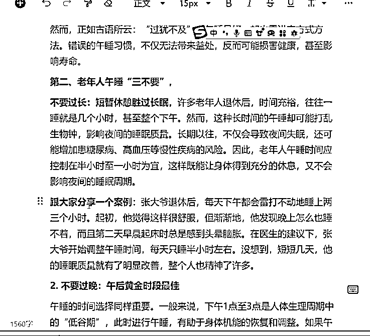
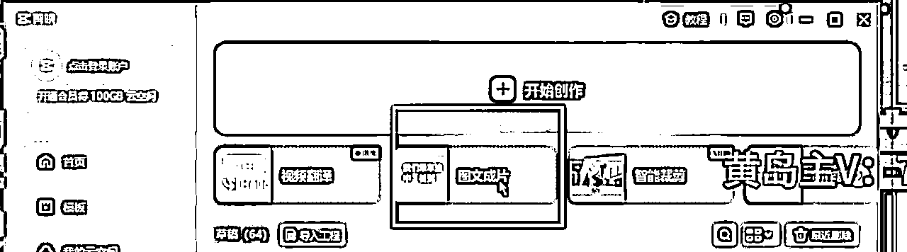
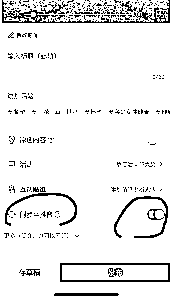

# 拆解西瓜视频中老年赛道变现项目，单价50-100+可矩阵，一条龙实操玩法分享给你

> 来源：[https://o0yvn3o31a.feishu.cn/docx/SJXnd2G3Eo2cv3xWMOKcsawBngg](https://o0yvn3o31a.feishu.cn/docx/SJXnd2G3Eo2cv3xWMOKcsawBngg)

大家好，我是黄岛主！

今天拆解的这个项目是西瓜视频副业变现项目，说通俗点就是头条的中视频撸收益项目！这个项目单人就可以批量操作，且仅用10分钟就可以制作出一条纯原创的视频，重点是操作的时候不用写文案，然后工具就用剪映就行，基本上属于无脑操作，如果第一次看到这个项目的会颠覆你对做视频的认知！

关于收益方面，基本上单号平均每天几十块钱不等，如果遇到爆款能收益到几百不等，这个只能说是平均下来的哈。如果你对这个副业项目感兴趣，可以看完我拆解的自己尝试操作看看，因为这个项目我们也是因为好奇并花了698买来的，然后看完之后拆解了出来，但从别人账号数据上来看，效果还是不错的。

这是收益图大概数据，看完拆解之后动力必须十足的去干：

看下视频案例：

目前我们跑通的效果：

废话不多说，下面我说下我们拆解的这个项目的组成：项目介绍、操作流程、注意事项，主要包含这几个，内容会有些长，但都是我们拆解的实操步骤，请耐心看完！

# 一、项目介绍

上述的视频案例应该看完了哈，可以看到这个视频内容特别简单，虽然你会觉得视频很长，但这个视频制作还是很简单的，我相信你看一遍案例会点视频剪辑，都可以自学成才。当然了，很多细节我还是要拆解下的。

那么我来说下，这个视频的目标人群是中老年群体，而在西瓜看视频的人大多数是中年群体，所以这个项目在西瓜视频上操作是最好的选择，而且这类视频领域流量特别大，每个视频基本都是几万播放量，重点是门槛真的很低。

你通过案例可以看到，视频发布的时候封面直接用固定的封面图片，或者在视频里面随机选择一张，就是说联封面只做都省掉了。再看下文案标题更简单，不需要自己写直接去找对标同行的，或者近期比较热门的都可以。文案更不用说了，基本上是用AI软件去生成的。可以说，完全解放了自己的思考能力了！

还有一点好处，这种视频做完之后，可以同步发，在西瓜、好看视频、百家号都可以，能做收益的平台太多了，但我们主推的是西瓜视频，目前这个视频的中老年人粉丝群体是最多的了，当然我们不是欺骗老年人，我们只是为老年人提供一些便民知识而已。

来，看下这个账号的数据，多少还能爆个几万的：

# 二、找对标账号

想要做这个项目，需要先找对标账号，方法也很简单：

先打开西瓜视频，找一些同行去看一下，比如小明说天下，播放量都很高的，3小时之前的作品播放量就已经达到7000多，整体都在好几千，甚至好几万，粉丝不是很多，在右边推荐里面都有很多同行，可以直接去参考一下，就是简单的一张背景图片或者视频，加上大字号的字体，背景音乐都没有配上。

# 三、文案AI生成

这个文案是傻瓜式操作的，基本上都是复制同行的放到文心一言里生成（https://yiyan.baidu.com/welcome）这个是付费的，淘宝有卖几天的激活码可以用着，或者自己开个会员就行了，也可以用其他免费的AI工具，我这也有可以推荐给大家。

AI的指令是：

请你作为一个资深的知识丰富的分享博主,请根据今日头条网站里的相关联的内容，生成一篇的原创文章，有以下要求：

1.首先你需要切换为可以访问网络的模型，先在网络搜索寻找这个新闻事件，获取相关信息，如果网络无法搜索，请你直接生成文章，不需要回答。

2.不能直接抄袭其他新闻，要介绍事件与内容，要有噱头，吸引读者想读下去，要围绕新闻事件进行介绍，适当增加观点或详细例子，增加说服力。

3.最后要对文章进行反问式总结，要让用户有共鸣。

4.严格避免使用任何形式的承接词和过渡词汇。这不仅包括常见的“综上所述”、“总而言之”、“首先”和“同时”，还包括“然而”、“但是”以及其他任何可能被用来引导或总结的词汇。请确保文章的每一段落都能直接进入讨论主题，而不是通过引入或过渡性短语来构建内容。尤其在文章的最后一部分，直接陈述您的观点或结论，避免使用可能导致总结或过渡的词汇和短语,不需要小标题。

5.加上你自己的观点，内容要有深度和观点，能够引起读者的兴趣，围绕社会问题展开，文章内容必须原创，不得抄袭或侵犯他人版权，可以参考相关社会讨论类文章进行创作，但不能直接复制。

6.所有的文章必须依据事实撰写，不能改编，造谣。

7.不能用花里胡哨的修饰词填充文章，文章通俗易懂，言简意赅，朗朗上口。

8.文章不能出现任何英文单词，确保严格保证文章字数在2000字以上，我需要你把整篇文章分为N次生成，严格控制文章每次生成的字数，每次生成的文章字数不能低于2000字，不能重复每次生成的内容，不需要回答，直接开始生成文章，生成完新闻稿的每段以后，不能询问我是否继续生成，我发任意的指令后即可继续生成你的后半部分文章，全文不需要说明信息来源以及参考资料 ------ 标题：午睡竟能影响寿命？老年人最好看看，午睡三不要，

请根据上述的内容帮我写一篇1500字的现实案例，要求情节生动，贴合主题，让人能够产生共鸣和讨论。

这里有个细节，就是通过大模型输出，一般情况只能输出1500字，所以我们可以通过继续指令让它继续输出，大概输出4500~5000字左右就行了。

来看下图：

注意：生成的内容只要不违规，符合标题内容就行，最后可以通过几篇文章合成一篇5000字文章。这个可以多参考对标视频的内容就知道了。

下面这个是文章例文参考：

晚年健康幸福秘诀，别让最后十年在病床上度过，早看早享福！

在人生的长河中，晚年如同金秋的果实，满载着岁月的沉淀与智慧的芬芳。然而，对于许多人而言，这段本应享受天伦之乐、安享晚年的时光，却常常被疾病的阴霾所笼罩。医院的长廊、冰冷的医疗器械，似乎成了晚年生活的代名词。但，这真的是我们想要的晚年吗？答案显然是否定的。今天，就让我们一起探索晚年健康幸福的秘诀，让生命的最后十年乃至更久，都充满阳光与欢笑。

一、预防为先，健康管理从日常做起

晚年健康的基石，在于预防。许多老年疾病，如心血管疾病、糖尿病、骨质疏松等，都是长期不良生活习惯累积的结果。因此，从年轻时就应树立健康意识，坚持合理饮食、规律作息、适量运动。到了晚年，这些习惯更应成为生活的常态。

*   饮食篇：均衡膳食，少油少盐，多吃蔬菜水果，补充足够的蛋白质和维生素。适量摄入粗粮，促进肠道蠕动，预防便秘。同时，避免暴饮暴食，保持七分饱，让身体轻松无负担。

*   运动篇：根据自身情况，选择适合的运动方式。散步、太极拳、瑜伽等都是不错的选择，既能锻炼身体，又能陶冶情操。运动不仅能增强体质，还能有效预防多种老年疾病，提升生活质量。

*   心理篇：保持积极乐观的心态，是晚年健康的另一大法宝。学会释放压力，与家人朋友多交流，参加社区活动，丰富自己的精神生活。心理健康与身体健康相辅相成，共同构筑起晚年幸福的防线。

二、定期体检，早发现早治疗

随着年龄的增长，身体机能逐渐衰退，各种疾病也悄然来袭。因此，定期体检显得尤为重要。通过体检，可以及时发现身体的异常情况，做到早发现、早治疗，避免病情恶化。

*   基础检查：血压、血糖、血脂、心电图等是每次体检的必查项目。这些指标能够反映身体的基本健康状况，为医生提供诊断依据。

*   专项检查：根据个人情况，选择适合的专项检查。如骨密度检查，对于预防骨质疏松具有重要意义；而肿瘤标志物筛查，则能帮助我们及早发现癌症的蛛丝马迹。

*   随访复查：对于已经确诊的疾病，一定要按照医生的建议进行随访复查。这不仅能及时了解病情变化，还能根据实际情况调整治疗方案，确保治疗效果。

三、积极应对，与疾病共舞

尽管我们努力预防，但疾病有时仍会不期而至。面对疾病，我们应保持冷静，积极应对，与疾病共舞，而不是被它击垮。

*   正视疾病：首先，要正视自己的病情，不逃避、不恐慌。只有了解疾病，才能更好地战胜它。

*   科学治疗：遵循医生的指导，进行科学治疗。不要轻信偏方、秘方，以免延误病情。同时，保持良好的心态，相信自己能够战胜疾病。

*   调整生活方式：根据病情调整生活方式，如调整饮食、增加运动等。这些改变看似微小，却能在长期中发挥重要作用，促进病情的好转。

四、家庭支持，温暖心灵的港湾

晚年生活的幸福与否，很大程度上取决于家庭的支持与关爱。一个温馨和睦的家庭环境，是晚年健康幸福的重要保障。

*   陪伴与沟通：子女应多陪伴父母，倾听他们的心声，了解他们的需求。在陪伴中增进感情，在沟通中解决问题。

*   尊重与理解：随着年龄的增长，父母的身体和思维可能不如从前。此时，我们更应给予他们更多的尊重和理解，而不是指责和抱怨。

*   共同活动：组织家庭活动，如旅游、聚餐、看电影等，让父母感受到家庭的温暖和欢乐。这些活动不仅能丰富他们的精神生活，还能增进家庭成员之间的感情。

五、社会关怀，构建老年友好型社会

除了家庭的支持外，社会的关怀同样重要。构建一个老年友好型社会，让每一位老年人都能享受到应有的尊重和关爱。

*   完善养老服务体系：政府应加大对养老服务的投入力度，完善养老服务体系。建设更多的养老院、日间照料中心等养老设施，为老年人提供全方位的养老服务。

*   弘扬尊老敬老风尚：在全社会范围内弘扬尊老敬老的风尚，让每个人都认识到老年人的价值和贡献。通过举办各种尊老敬老活动，增强社会对老年人的关注和关爱。

*   推动医疗改革：深化医疗改革，提高医疗保障水平。降低老年人就医门槛和费用负担，让他们能够享受到更加便捷、高效的医疗服务。

结语：晚年健康幸福并非遥不可及的梦想，而是需要我们共同努力去实现的目标。通过预防为先、定期体检、积极应对疾病、家庭支持以及社会关怀等多方面的努力，我们完全有能力让生命的最后十年乃至更久都充满阳光与欢笑。别让最后十年在病床上度过，早看早享福！让我们携手共创一个充满爱与关怀的晚年生活，让每一位老年人都能够优雅地老去，享受人生的每一个美好瞬间。

# 四、视频制作流程

我们把文案生成、配音生成、视频制作等，完整的给大家拆解演示下：

1、文案

文案可以用AI生成，有很多同行，可以自己去找一下，标题可以拿过来用，打开文心一言，或者有其他AI软件也可以用，打开之后，把准备好的那段话输进去了，标题换一下，点击发送。

生成出来的文案算是伪原创，所以不需要再去改，直接可以给他生成音频，发布视频，就是原创，如果说它生成到一半停止了，可以给他发送继续两个字，就会继续生成，直接生成完就不需要再发，新建一个文档，把内容粘贴进去稍微修改一下。

2、配音

正常的话2000个字左右就可以，不需要太长，五、六分钟就没什么问题，复制一下内容，打开微信，去搜索微信小程序，配音软件有很多，比如魔音工坊，配音家、配音神器，给大家推荐南瓜配音，有的是不需要收费的，有的是需要收费的，可以自己去看一下，点击有男生。

看一下喜欢用哪个，仔细去听一下，普通的读起来不会太有情感，选择一个，直接把改好的文章粘贴进去。把语速、语调调一下，默认的情绪可以写成平静，或者纪录片，有很多配音的小程序，自己去微信里面搜一下就可以，不做过多的讲解，找到你喜欢的，合适的男生的配音就行，配音完之后保存。

3、剪辑制作

点开剪映，点击图文成片，点击自由编辑文案，然后把文案粘贴进去，把这个文案给它复制进去，点击生成视频，再去百度找一张风景的图片。

找一些比较花的，不要找一些太单调的，找一些比较看起来很有诗意的，选一个作为封面图片，选好之后就不要再改了，把自动生成好的字幕和音频删掉，把配好的音频放进去，然后右键分离音频删掉。

然后把风景图片放上去，生成好的素材删减一下，把里面卡通的，不合适的都删掉，有别人logo的也不要，大概筛选一下，把图片删掉，太乱了也不要，可以适当的把图片拉长一些，或者去素材库里搜索一些关键词，视频也可以放进去，视频素材有音频的关掉声音，背景音乐随便调一个，可加可不加。

接下来添加字幕，文本，智能字幕识别，调个颜色、样式，字体一定要大，因为是针对老年人群体的，一定要调大，开通30秒放这几句话。

在最后面的写上点关注，如果不知道话题怎么写，也可以让文心一言生成，给他一个标题，让他安装这个生成就可以了，想用哪个就直接用。

选中字体，把字体调一下，用系统字体就可以，要比较醒目的颜色，调一下样式，字幕太长了可以分成两段，设置一个开头，再添加文档、新建，添加，输入标题，标题参考同行怎么写的，放在前20秒左右，调到最大，选择一张好看的作为开头封面，后期不需要动。

把配音的音量调大，调到10左右，一个视频就做好了，可以添加上自己的水印，左上角或者右下角都行，满屏飘起来也行，拉到和视频对齐，颜色要调一下，然后把透明度调低一点，视频最后再加一个点关注的贴纸。

搜索贴纸关注，随便找一个添加，给他拉到最后，大概30秒，放在右下角或者放在中间都行，一个视频就做好了，做好之后导出，去西瓜视频里面去发布就可以了，导出的时候1080P，码率推荐，帧率60。

差不多这样就制作完成了，基本上很简单，看完就可以去操作看看了！

# 五、视频发布方法

发布这块没有太大的要求，基本上都是早上7~9点之间的时候发布视频，因为这个时候大家起床后吃完早餐，车上都会看手机的。

然后就是中午11点半到一点半时间，也属于吃饭时间，基本上很多人都会去刷一刷手机，流量会大一点。

那么到下午5点到晚上9点，这个时间段是整体活跃度最高的时候，也是流量最大的时候。

我建议的就是，你三个时间段都发布下，然后通过24小时后观测一下数据，找到适合的黄金时间去发布视频是最佳的。

发布完之后，要去做好视频互动，因为新人做号，账号的曝光率不高，一定要主动刷存在感，主动去点赞、评论，分享别人视频，在评论区混脸熟，在视频播放完毕再去点赞视频，否则容易被判定为机械号，评论风格可以独特、吸引人，别人看到评论会点击主页去看视频，实现双方账号的互利共赢。

发布差不多是这样的，有问题在一起交流！

# 五、中视频过计划方法

这个放到最后讲了，因为我是建议大家买号去做这个项目，不然过计划的成本太高了，但是我可以给大家一些过计划拍视频的建议：

1、去西瓜视频APP，顶部搜索框里，搜索：“中视频伙伴计划入口”，点击红圆圈里的，进入后加入中视频任务。（现在就可以领取了，后面再发视频）

2、加完会提示，让你发3个视频，并达标17000播放量，这个时候我们要去做播放量17000的任务了。

我们现在需要做三个视频，一天内 分三个时间段发完三个视频，具体视频模式下面看下：

需要三年级以上的应用题讲解：说白了，就是把题目通过讲解的方式做出来拍出来。一定要找复杂的题目去录制，录制时长2-3分钟以上，越复杂越好，太简单的不行，过的几率低。

怎么找题目：百度下“6（3-6年级）年级应用题”找题目，需要A4纸打印出来，看下视频案例：

拍摄好的视频去西瓜发布，发布的时候一定要同步到抖音，不要单独去发抖音，而是发西瓜的时候同步到抖音！

发布之后，需要投抖加做播放量，看下方法：

这个需要成本了，所有我推荐买号，可以看下生财里谁卖的吗？

我们需要一天内 分三个时间段发完三个视频，发完之后，针对其中一个视频去投抖加，默认投放就行。

投的细节看下：

可以三个视频里，去选择两个视频投放，也就是两个视频 投98元，然后看下哪个视频播放量跑的好？

然后去选择那个播放量好的视频，继续投68元

98投完会显示一个68的，前提是30的用户专享不要用

总结：也就是98+98+68=264元！ 不懂的问我就行了！

完了之后，看是否审核通过中视频计划！

# 六、细节注意事项

1、视频，视频尺寸必须是16:9的横屏，视频竖是没有收益的，视频时长一定要大于5分钟，西瓜视频少于一分钟没有收益，不能有黑边，有黑边的话也没有收益，还可能降权，画质清晰一定要达到1080P，还会有流量的扶持，发布的时候记得标注原创才有收益，发布文章勾选广告才会有收益。

2、视频加热度，及时回复用户评论，主动与自己视频的评论去互动，系统会认为该作者活跃度高，从而给到流量复制，主动分享自己的视频，加一句走心的评论，同时转发该评论@一下，冲视频能够再增加一些播放量。

3、当前讲的这个视频模式是过不了中视频的，但是过中视频的账号可以发布这种类型的视频，你可以去选择买中视频号，也可以自己去过中视频好。

4、单价可能会浮动，只要去做，不要三天打鱼两天晒网，肯定会有结果。

5、最好实名发布，不实名不能从头条端发布，可以看看其他的领域，比如生活和老年人，涉及老年人生活的领域，这方面不容易违规，单价也是有高有低，可以先从账号找相关内容，多点击相关内容，平台自然会推荐这些领域给你。

# 写在最后：

好的，我是黄岛主，目前这个项目差不多拆解到这里，如果你对这个副业项目感兴趣，可以看完就去执行，不用去买别人的课程，直接看完开干就行了，基本上我拆解的都是比较全面的，虽然会得罪人！那么有问题可以和我一起交流哈！