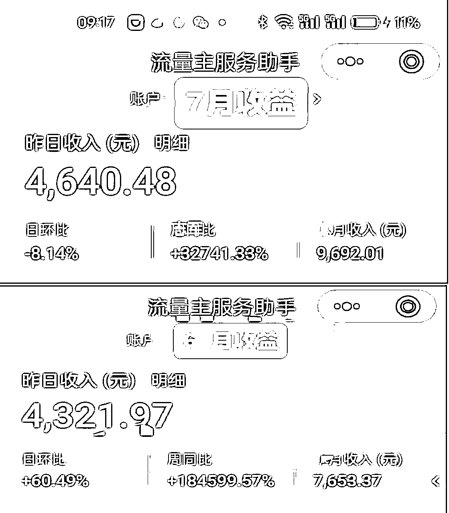
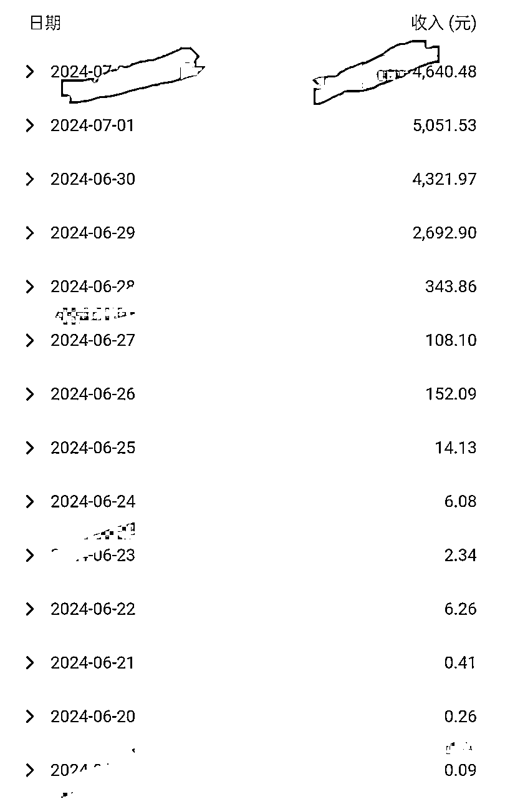
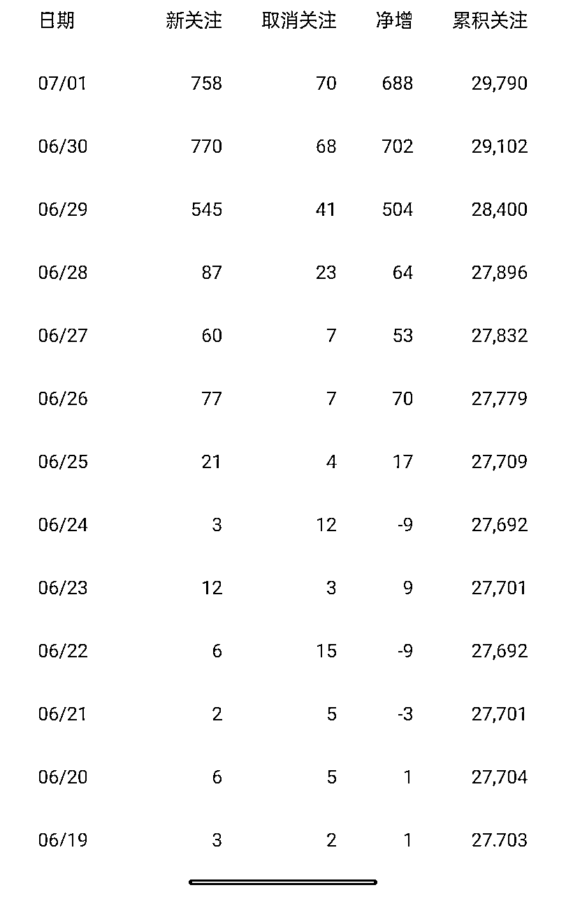
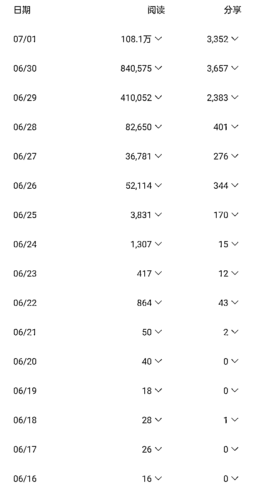
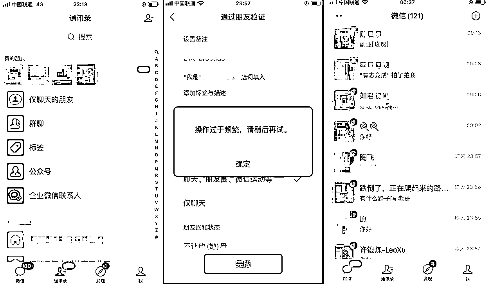
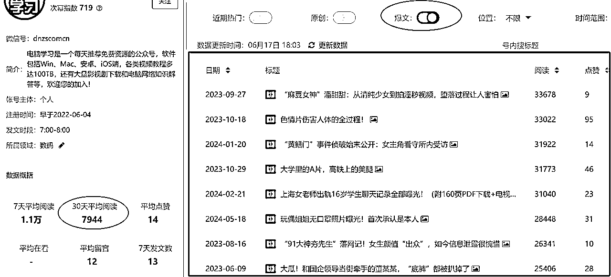
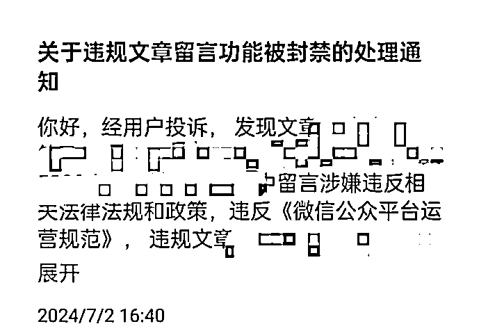
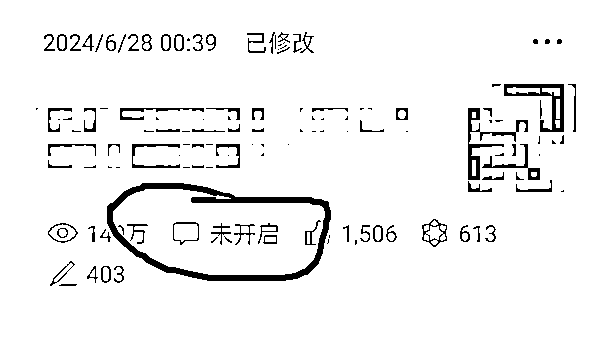

# 公众号爆文航海，21天阅读量350 万+，收益 1.7W+， 涨粉2000+，私域好友新增1600+，我做对了什么？

> 来源：[https://x5onxbfqfb.feishu.cn/docx/TCuudOqSdohXtnxLWQNcWWq9nqd](https://x5onxbfqfb.feishu.cn/docx/TCuudOqSdohXtnxLWQNcWWq9nqd)

### 1、前言

圈友们好，我是刘志军，程序员、技术自媒体，现在是自由职业

6月的爆文航海接近尾声了，在@Y024 Y哥的建议下写个航海好事，于是就有了这篇文章。

### 2、成绩

截止目前（7 月 2 日），航海期间 21 天总阅读量超过 300万+，两篇百万加阅读量，最高一篇 143 万， 总收益1.7W+， 公众号涨粉2000+， 微信私域新增好友1600+，数据还在增长

每日收益明细

粉丝增长数据

每日阅读量

私域用了2个号来承接，大号加了600人后用了小号去加，每天大概能通过四五百个好友后就开始提示操作频繁。

### 3、过程

这次航海差点儿就没报上，好在点开了鱼丸的私信赶上了末班车，这次公众号爆文航海计划是用两个号来发，一个IP号，一个小号（2 万多粉， 断更3个月），原来是用来分享编程技术相关内容，这次就专门拿来做爆文了。

本着先把押金赚回来的原则，所以必须好好打卡，好好发文， 和大家一样，前7天基本没什么水花，几乎所有阅读量都来自于粉丝

最开始发文几天很少去关注阅读量，每天的动作就是找选题，找素材，拼内容，发文。直到26号，发现后台有十几条留言，顺便瞅了一眼阅读量，感觉这个号有推荐流量进来了。

剩下的事情就是去找符合大众口味的低粉爆文来发。

先尝试了手搓，写了一篇互联网名人相关的帖子，10万+，然后把自己最常用的GPT切换到猫哥教练推荐的Cluade，用Claude写了一篇技术文，阅读量只有1万多，我知道这个跟Claude没关系，而是选题问题，技术文受众有限，阅读量天花板就在那里。

后面又切换到互联网科技领域的大众化选题，找到合适的选题后，结合兔子鱼教练的口述写法（我认为其实这就是费曼学习法的一种变体），把别人的爆文按照自己的理解换种方式写出来，再配上一些图片素材，最后也获得不错的推荐，后面基本都是采用这种手法，自己编不出内容的时候，用Claude帮我编，然后换成我的口述方法输出，因此系统也很难分辨是不是AI文。

#### 3.1 什么样的爆文会重复爆

爆过的内容还会重复爆，这条经验大家都知道，但是自己去执行的时候却发现不灵了，即使是跟原文一模一样的标题也爆不了，找什么样的爆文选题成了大家做爆文一个分水岭。

因为内容不管你是手写还是用AI去模仿原文写，一篇70分的文章都比较容易做到的，而选题好坏真正决定了你的阅读量上限。

如果爆过的内容大家都去模仿而且都能爆的话，那可能是天上掉馅饼了。之所以你的文章不能爆，可能是这个选题已经被太多人模仿，或者你找的根本不是低粉爆文，当然有时候还需要一点点运气

关于低粉爆文的判断，我也有自己的看法，并不一定是新注册的号或者粉丝少的号才叫低粉爆文，那些有十几万粉丝甚至几十万粉丝的账号，他们也会出爆款， 判断的一个关键因素是看这个账号有没有“异常值”出现，比如一个号平时阅读量就是1万左右，突然有一篇有四五万或者10万+的文章，那么这个就是异常值，这个你用次幂是能快速筛选出来的。

比如下面这个号，粉丝量级在20万以上，他的月平均阅读是8000左右，通过“爆文”筛选出阅读量最高的文章，那些高出平均阅读量好几倍的文章，就是异常值。

这种有异常值的爆文模仿的人越少，你能先于别人找到模仿少的爆款选题，你的内容有信息增量，重复爆的概率就越大，你就会先吃到肉，所以最终考验的还是大家的信息搜集能力。

通过这种方式筛选出来的文章，甚至你写的阅读量远远超出对标原文，比如我写的那篇收益8000多的百万+爆文，原文4万多阅读，而且他这个账号的平均阅读量只有1万左右。

#### 3.2如何把用户导到私域

虽然是写爆文，除了赚个流量费之外，如果还能导到私域就可以赚多份收益

那如何提高这个私域的转化呢？

因为这类爆文本身是没有人设的，很少有读者会因为你这个账号背后的人来加你好友，所以光是留一个微信号转化不了多少私域，即便是加微信送资料效果也不是特别好

所以，我改变了一下策略，放的钩子是加微信进副业交流群，因为副业是刚需，特别是当下这个环境，加群的话，大家都奔着可以在群里获得一些信息差的目的来加，所以微信被加爆，目前已经有 1600 多人加了微信

这里还有一个技巧，就是如果你的微信号提示添加好友频繁或者加满了，你是有一次修改微信二维码图片机会的，因为我的大号快加满了，于是通过替换二维码用小号去承接了这些流量。

此外，好友一定要在当天通过，否则留在隔天他都忘记是从什么渠道加你的，对你的印象分为0，很容易直接被删除好友，为了增加点信任值，可以免费送一份资料

如果不想一个个手动验证通过好友的话，也可以把验证开关关掉，自动添加为好友

但是刚加过来的好友变现能力一般，陌生人的信任值还需要不断触达价值才能提升。不过免费的流量不要白不要，先加了再说，后面慢慢转化。

#### 3.3 到底是手写还是 AI 写

到底是手写还是 AI 写？其实没有绝对的标准，我是两者都有在用，有时候是纯AI，有时候是AI辅助，有时候纯手写，如果想批量 AI 无疑是首选，如果想走精品路线，优先手写，手写还能锻炼你的写作能力

#### 3.4 如何进行评论管理

如果你的号有留言功能，那么对于推荐算法来说，这是一个很重要的变量，一方面能把文章整体的完读率拉上来，另一方面能把文章的互动率拉上来，其他变量一样的条件下，留言多的文章在赛马机制中一定会胜出获得下一阶段的流量推荐

对于评论管理，最好是手动去精选，特别是入了池的文章评论非常多的时候，不要因为精选麻烦而改为自动

因为林子大了什么评论都有，难免有极端份子留言人身攻击甚至是反动信息，这样的评论非常危险，只要被举报评论区就封了，我有两篇爆文虽然都是手动精选评论，但是最后还是被封了评论功能，因为有人在评论区挑起了民族对立， 虽然这样的评论最开始是神助攻，能引来更多人评论，但后面评论区不可收拾，开始互相攻击，尽管我没有把这些二级留言发出来，但还是被举报了，所以正确的做法应该把整条评论全部删除

虽然没了留言，但是这里从侧面也验证一个问题，评论被封掉了不直接影响文章推荐，该推荐还是有推荐，因为还可以通过点赞、在看等互动数据来支撑。

### 4、总结

关于这次爆文航海，其实所有的经验，生财的前辈已经总结非常完善了，关于如何选择领域、找对标、找爆文、如何使用AI工具等都有非常详尽的介绍，具体操作直接看生财航海手册就能解决80%的问题。

这里分享我的一些个人理解

1、坚持写，只要不下牌桌你就有机会，前面一点水花也没有，是大概率事件，能坚持下来不断优化就能把推荐概率一点一点提升上去。

2、成功的捷径是抄，抄成功案例

想打造爆款，就不能自嗨式写作，或者一条道走到黑，需要看别人写什么选题容易爆，挑爆过的话题写，你的成功概率就是比别人高，善于利用工具也很关键，比如我找爆款选题都会优先去次幂扫一眼低粉爆文，看看那个选题适合自己写

3、降低预期，减少焦虑，动作才不会变形

期望太高失望越大，成功本身就是概率游戏，即便所有动作都做了，在某个时间段内还是无法获得理想结果，唯有降低预期，只管努力，减少内耗，等着运气到来

### 5、感谢

特别感谢热心肠的 @兔子鱼 教练，你的鞭策让我有了更多的分享欲望，群里有问题都是在第一时间给大家解答。

感谢@猫哥 教练每次直播都是毫无保留地把干货全部分享了出来，教程都是直接喂嘴里的那种。

张波教练的两次直播也有看，讲得很详细。还有领队@Y024 Y哥，每天像大管家一样忙前忙后服务船员，还要感谢志愿者每天贴心的提醒服务。

感谢老马的鼓励

最后感谢亦仁和团队提供了生财这个优秀的圈子和航海项目，让我有机会链接到这么多优秀老师

### 6、致圈友

我是2020年加入的生财，但是大部分时间我在圈子里都只是个看客，没有真正参与进来，2024年打开生财的频率明显增加，时常去刷精华帖，看风向标，自己也开始尝试主动分享，还中标过一次。

如果我没有参与这次爆文航海，我大概率也不会日更爆文，更不会有这次航海的结果，真是应了那句话，你把时间花在哪里，哪里就会给你回报。

看见、相信、快速学会、不内耗，是你能赚到钱的正确姿势，别人在生财能赚到钱，相信我可以，你一定也可以。

以上对你有收获的话，请给我一个小小的点赞吧😄