# 提示词高手养成记：揭秘 5 位数商单背后的AI策略

> 来源：[https://fizaghzgugc.feishu.cn/docx/HkfVdkGdOoxHxBxngm6cnbUHnlh](https://fizaghzgugc.feishu.cn/docx/HkfVdkGdOoxHxBxngm6cnbUHnlh)

你好，我是曾曾，我们又见面啦 。

————————————————————

🎓95后高校青年讲师 | AI 企培讲师

🧩B站 & YouTube AI 教学博主

🏷全网ID:在下小曾AIGC

✨更重要的身份：AI 提示词爱好者&实践者

—————————————————————

🏆近半年在做的酷事儿：

从0开始做AI自媒体 | 从0开始做AIP

—————————————————————

💰还算做出了一点成绩：

8 个月变现 10w+ | 全网粉丝 2w+

定制过 3k｜4k｜5k 的AI提示词商单

☀️人生信条：时刻和自己“作对”

—————————————————————

5月在生财分享了我的第一篇学习帖：

《从AI提示词小白到累计1.4w 的提示词商单，我是如何做到的?全文2w字深度分享!》

蛮感动的，还算受到了大家的一致好评, 同时也感觉比较愧疚，拖了好一阵子才提笔写出第二篇分享。

好饭不怕晚，我还是来了🦸‍♀️。今天我将继续为大家带来“新鲜”的干货教程，关于我 5 位数提示词商单背后的 AI 调教心法。

悄悄告诉大家，这算我的“杀手锏”之一哦。

AI技术日新月异,变化太快,因此我今天不会讲述一些短暂时兴的技巧,而是分享一些"不变"的底层思路，甚至这套方法可迁移，用在今年非常🔥的工作流设计中。

下面是本文章的目录📚，点击文字可跳转：

1.  与 AI 成为最佳拍档

建立正确的人机关系

了解大模型的优缺点

1.  掌握 AI 解题三大法宝

拆解、逻辑、展示

1.  AI 解题进阶秘籍

思维链 CoT 提示法

1.  AI 解题实战演练

仿写文案,一展身手

# 前言

2023年被誉为生成式AI元年,标志着我们学习和工作方式的重大变革。

从ChatGPT到Midjourney,从Stable Diffusion到Claude,一系列AI工具的崛起,正在以前所未有的速度重塑着我们的工作和生活。

回顾我自己学习 AI 提示词的历程,从最开始只会和 AI 进行简单的对话,就像婴儿牙牙学语那般。

到慢慢掌握一些高级的提示词编写技巧，狂补元能力缺陷，再到独立定制提示词商单，现在也能将 AI 有机嵌入到我的工作流中（图1）。

我觉得这一切如梦如幻，毕竟作为一个对AI技术丝毫不感兴趣的我，从未想过会和 AI 结下如此深厚的缘分。

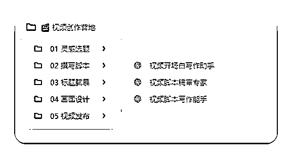

图1 AI 自媒体工作流

也未料到，AI 居然成了我最好的工作搭子。

我已经迫不及待的想和大家介绍我的这支“自媒体创作”团队了（图1-2）：

*   "灵感猎手"：负责选题

*   "文案织匠"：撰写视频脚本

*   "开篇大师"：创作脚本开场白

*   "标题设计师"：生成吸睛的标题

*   "创意画匠"：设计视频封面

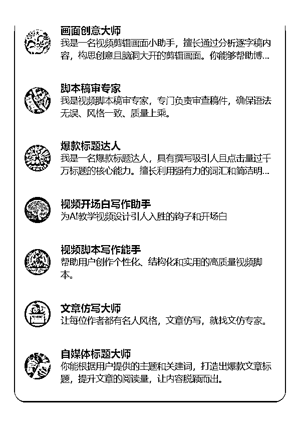

图2 嵌入至工作流中的AI助手

在这些AI数字员工的协作下，我的工作流被重塑和升级了，以前得我自己动手干的活儿，现在多了好几个搭子替我分担，我磕着瓜子儿下达命令就行了。

Just kidding！我不敢打包票说“AI大大提升了工作效率”，但我敢说“我越来越离不开ta了”，这玩意儿是真的上瘾。

这一年，我通过AI+人工，以最低的成本和最佳员工组合，成功地让“公司”有条不紊的运转了起来，当然，效率也得到了“部分”提升。

而我运作的秘诀在于重新优化和设计了一些高频的工作流，将 AI 巧妙融入日其中，比如上面图1-2，我针对自媒体创作这一过程，构建了一套系统化的5步骤"人+AI"协作模式。

随着 AI 深度融入工作流中，我愈发意识到一个关键问题：面对复杂的任务，如何才能让AI高效、高质量地发挥作用？

为了回答这个问题，我通过不断实践和总结，总结出了一套"AI时代解决复杂任务的通用方法"。

这套方法不仅帮助我更好地利用AI的优势，还让我能够应对各种复杂的工作场景。

接下来，我会做详细的分享，往下👀。

# 一、与 AI 成为最佳拍档

## 一）建立正确的人机关系

AI时代,我们与“机器”的关系正变得越来越亲密。我们应该如何看待和定位这种关系呢?

把AI想象成一名刚进入公司的实习生,而你,就是那位经验丰富、睿智过人的老板。

你是经验丰富的领导, AI 是 0 工作经验的实习生。

这个实习生虽然学识丰富,但缺乏实战经验。听起来是不是有点像你刚毕业时的样子?

作为一位好领导,你给这位 0 工作经验的新人布置任务时,可不能只给ta一句简单指令就了事。

为了让ta第一次就干出漂亮的活儿,你必须事无巨细地讲清楚任务的来龙去脉，如:

*   这个任务的背景是什么?

*   我们的目标是什么?

*   可能会遇到哪些困难?

*   完成任务的关键是什么?

*   可能存在的限制条件

这就是我们前面几天学过的"细节法"，即提供充分的背景信息。

然而对于一些较为复杂的任务时，我们要更加详细，就像手把手教孩子写作业一样,将任务拆解成一个个具体的小步骤,引导AI循序渐进地完成。

这就是本次学习的核心点:把AI当成一个 0 工作经验的新手,将复杂任务拆解成细小的子任务,降低任务完成的难度。

## 二）理解AI的能力与局限

当然,要真正发挥人机协同的最大效能,我们还要深入了解ta的能力边界。

就像面试应聘者时,你会客观评估候选人的专业技能和知识储备。

对AI,我们同样需要一双善于观察的慧眼。

以语言理解为例,当前的AI模型虽然能够流畅地组织语言,但对词汇和概念的理解常常是肤浅的,甚至是错误的。

这就像应聘者夸口自己精通某项技能,但稍加盘问就露馅了。

再比如常识推理能力,AI模型往往难以将知识灵活运用到新场景中。这就像有的应聘者背了一堆八股文,但遇到实际问题时却不知所措。

由此可见, AI 虽然在某些任务上表现出色,但离通用智能还有很大差距。

AI 更像是一个专业领域的尖子生,而不是一个成熟的通才。

因此,我们在使用 AI 工具时,一定要对它的能力边界有清晰的认知。只有深入了解AI的长处和短板,我们才能扬长避短,发挥人机协同的最大效能。

把 AI 用在它擅长的任务上,而在它力有未逮的地方,则需要人的智慧来补位。

这就是在 AI 时代高效解题的第一要义:建立正确的人机关系,理解AI的能力与局限。

唯有此,我们才能成为 AI 的明智领导者,而不是盲从的追随者。

# 二、掌握 AI 解题三大法宝

## 一）拆解任务

俗话说,"万事开头难",但对 AI 来说,"万事分解难"。就像啃一块难啃的大骨头,我们可不能指望AI一口吞下。

相反,我们要像耐心的老师傅一样,把这块"骨头"一点点剔除,化整为零,直到露出里面的"精华"。

比如在解一道复杂的数学题时，我们通常需要将解题的过程分解成若干步骤，然后在本子上将每一步的计算过程详细地列出来。

举个例子,如果我们要AI帮忙解一道数学应用题,就可以把整个解题过程分解成以下几步:

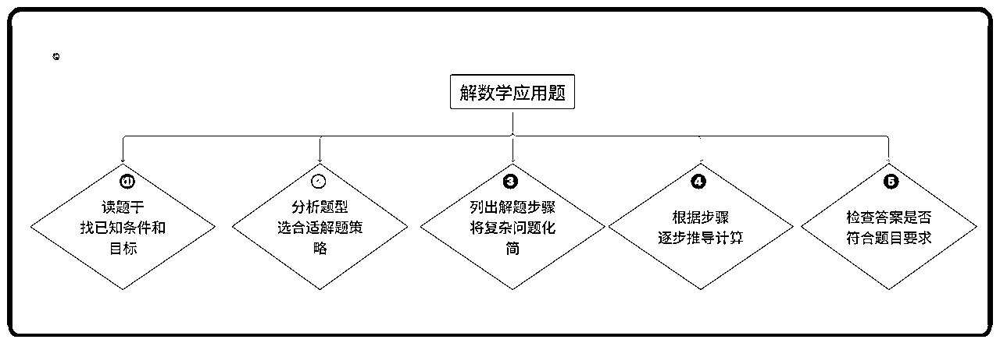

这样做有几个好处：

降低难度：大问题变小问题，复杂变简单。

明确方向：每子任务都有明确目标。

提高效率：可并行处理多个子任务。

确保穷尽：不会遗漏关键的细节

通过层层拆解,再难的题目也会变得清晰明了, AI 就能一步一个脚印,稳扎稳打得到答案。

例如,我们要AI帮忙策划一次公司年会，我们可以将次任务拆解为:

1.  确定年会主题

1.  制定日程安排

1.  设计活动环节

1.  准备演讲稿

1.  安排场地和餐饮

1.  制作邀请函

将复杂任务拆分成易于管理的小任务，是一种有效的解决复杂问题的方法。这不仅能帮助我们更好地理解和执行每一步骤，还能提高整体效率，确保最终结果的质量。

## 二）逻辑推理

有了小任务，下一步就是用逻辑推理这把"斧头"来处理它们。

逻辑推理就像是在搭建一座桥梁，将问题的起点和终点连接起来。

但是,任务分解可不是随心所欲、想怎么拆就怎么拆。我们拆分的每一步,都要经得起逻辑推敲。

换句话说,每一步都应该是环环相扣、前后呼应的,最终形成一个严密的逻辑链条。

在指导AI进行逻辑推理时，我们需要注意以下几点：

基于事实：每一步推理都要有坚实的事实基础。

步步为营：推理过程要循序渐进，不能跳跃。

因果关系：清晰地展示每一步与下一步的关联。

就像搭积木一样,如果前面的某一块没搭稳,后面再怎么搭也是空中楼阁。

## 三）展示过程

拆解完成、逻辑过关后,我们还要让 AI 把整个解题过程"说"出来,接受我们的"检阅"，这一步至关重要。

当AI得出一个答案时,我们可不能只盯着答案本身。

我们要让AI亮出它的"答题卷",展示每一步推导和计算的细节。

其一是基于AI大模型的底层工作原理：AI 是通过阅读海量文本数据,学习并掌握了丰富的词汇知识和词与词之间的关系。

当我们给定一个输入(如一句不完整的话),模型会根据上文的输入,预测下一个最可能出现的词。这一过程可以比喻为"词汇接龙"游戏:基于已有线索“上文输入”去预测下一个最恰当的词，最后“输出下文”。

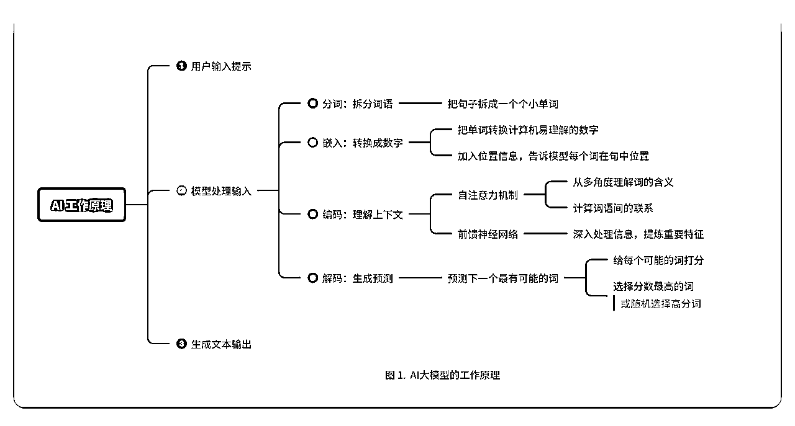

那明白了原理后，我们就能明白 AI 不像人类一样有心理活动，ta 的说即想，想即说，所以我们需要让 ta 把每一步都大声“说”出来，这样才能最大程度的影响下文的输出。

其二是只有看到 AI 的完整推导思路,我们才能判断它是否真的"学会"了解题,会不会有什么纰漏，也有助于我们改进提示。

这就好比老师改学生的数学卷子。如果学生只写个答案,老师还真没法判断是对是错。

只有学生详细写出了解题步骤,老师不仅能够找出犯错的点，给予帮助和指导。其次，“show your work ”才能对答案的正确性放心。

运用"拆解、逻辑、展示"三板斧,我们就能像领导带徒弟一样,手把手地指导AI解决复杂任务。

通过任务拆解,我们把大问题化小;

通过逻辑推理,我们给思路"立规矩";

通过展示过程,我们来验收AI"作业"。

任务拆解这一思维在解决单个问题时发挥了强大作用，但这种思维方式的应用远不止于此。

当我们面对更复杂的场景,比如设计一套 AI 系统工作流时,任务拆解的重要性就变得更加突出。

# 三、AI 解题进阶秘籍：思维链提示

上面我们介绍了AI解题的"三板斧":拆解、逻辑和展示。

这 3 个步骤为我们提供了一个基本的框架,指导我们如何引导AI一步步解决问题。

但是,你可能会想🤔:

这个框架是从哪里来的?它的理论基础是什么?

接下来我们深入探讨一下这个问题:思维链(Chain of Thought,简称CoT)，简称“分步推理法”。

## 一）何为思维链CoT ？

想象一下,你正在教一个聪明但经验不足的学生解决一道复杂的数学题。

你会怎么做?你会引导他一步步思考,把计算的推理的过程写在本子上，逐步推理。

这就是思维链的核心思想，通俗来讲，就是一种让AI学着像人一样，一步一步思考问题的方法。

思维链,顾名思义,就是一系列环环相扣的思考步骤，它描述了我们在解决问题时,大脑中那一连串的推理过程。

在AI领域,思维链是指通过提示(prompting)让大型语言模型不仅提供答案,还展示出达到这个答案的思维过程。

和之前的提示词模式(问题，答案)不同，思维链提示词模式即(输入问题—思维链—输出结论)。


## 二）思维链CoT 从何而来？

思维链的概念源自2022年的一篇学术论文《Chain-of-Thought Prompting Elicits Reasoning in Large Language Models》。这篇论文由谷歌研究员Jason Wei等人发表,在学术界引起了广泛关注。


论文指出,通过在提示中要求模型"展示工作"(show your work),即列出完整的推理过程,可以显著提升模型在复杂推理任务上的表现。

论文虽然洋洋洒洒写了几十页，但是核心方法就是我下面所举的“罗杰”的例子。

即我们在让AI解题前提供一个解题的过程思路，让大模型按其思路大声”说“出逐步逻辑推理过程。

下图左边是一般（标准）提示方法，通过给大模型输入一个解题样例，然后直接让AI输出答案，这在面临复杂推理时会容易出错。


右边是思维链提示词，和左边不同的是在给出的样例(红框)时，增加了推理步骤，直到得到最后答案。

这时大模型也会采用类似的方式(紫框)给出推理过程和答案。实验证明，这种方式可以大幅度提升大模型在复杂推理时的准确率。

## 三）如何运用思维链CoT ？

在理解了思维链的概念和优势后,您可能迫不及待地想要在实践中应用它了。但是,如何才能设计出有效的思维链提示呢?

### 1、技巧一:零样本提示（Zero-shot）

零样本提示就是直接向AI提问，让AI在没有任何示例的情况下回答问题。

对于一些相对简单的任务,您可以直接要求AI展示推理过程,而无需提供示例。

这种"直接下指令"的方式,就是零样本提示。您只需在提示词的末尾加上以下要求:

"Let's think step by step"

"请展示你的思考步骤"

"请列出你的推理过程"

"请一步一步解释你是怎么得出这个答案的"

这种"直接下指令"的方式,就是典型的零样本提示（Zero-shot）。我们没有给AI任何例子,就让它自己去发挥，适用于一些简单的任务。

#### 案例解析一：简单的数学题

假设我们要 AI 解这样一道题:

```
小明有25 个苹果,吃了5 个,又买了3袋，每袋有8个苹果，现在小明有几个?
```

如果我们直接让AI 回答,它可能会直接蒙一个答案，大概率错误。但用了思维链,情况就大不一样了。我们可以这样提示 AI :

```
请解答这道数学题,并展示你的完整思考过程:
如果一个苹果重150克,一个橙子重200克,那么3个苹果和2个橙子一共重多少克?
请一步步解释你的计算过程。
```

这时, AI 就会给出这样的回答:

```
好的,让我们一步步来解决这个问题:

1\. 首先,我们知道:
   - 一个苹果重150克
   - 一个橙子重200克

2\. 计算3个苹果的重量:
   3 × 150克 = 450克

3\. 计算2个橙子的重量:
   2 × 200克 = 400克

4\. 将苹果和橙子的重量相加:
   450克 + 400克 = 850克

因此,3个苹果和2个橙子一共重850克。
```

#### 案例解析二：文本情感分析

再比如,我们想让AI 判断一段文本的情感是正面还是负面。用思维链,我们可以这样提示:

```
请分析以下文本的情感倾向(正面/负面),并详细解释你的判断过程:

"今天的天气真是糟糕透了!阴沉沉的天空,冷飕飕的风,还下着绵绵细雨。不过,这样的天气正好给了我一个理由,可以窝在家里看我最喜欢的电影,喝着热腾腾的咖啡。其实想想,也没那么糟。"

请一步步分析你的判断理由。
```

AI 会这样回答:

```
让我们一步步分析这段文本的情感倾向:

1\. 开头部分:
   "今天的天气真是糟糕透了!阴沉沉的天空,冷飕飕的风,还下着绵绵细雨。"
   - 这部分表达了对天气的强烈不满,使用了"糟糕透了"等负面词汇。
   - 情感倾向: 明显负面

2\. 转折部分:
   "不过,这样的天气正好给了我一个理由,"
   - "不过"表示话锋转折,暗示接下来可能有积极的内容。
   - 情感倾向: 中性,带有积极的期待

3\. 后半部分:
   "可以窝在家里看我最喜欢的电影,喝着热腾腾的咖啡。其实想想,也没那么糟。"
   - 描述了在家做喜欢的事情,用词温暖积极。
   - "其实想想,也没那么糟"表示对情况的重新评估,态度变得更加积极。
   - 情感倾向: 正面

4\. 整体分析:
   虽然开头表达了对天气的不满,但文本后半部分转向了积极的方面。作者找到了不好天气中的积极因素,并对整体情况进行了正面的重新评估。

结论: 
综合考虑,尽管开头有明显的负面情绪,但文本的整体情感倾向是偏正面的。作者展现了积极应对不利环境的态度,最终得出"也没那么糟"的结论。因此,我判断这段文本的整体情感倾向是正面的。
```

可以看到,通过思维链,AI不仅给出了正确的情感判断,还清晰地解释了判断依据和推理过程。

但对于复杂的任务，零样本示例不一定奏效，所以还是得 Few-shots。

### 2、技巧二:少样本提示（Few-shots）

在少样本提示中，我们需要提供一个或两个示例，帮助AI理解如何一步步解决问题。

然而,对于更加复杂的任务,零样本提示可能力有不逮。这时,我们可以给AI提供一些示例,也就是提前"设定推理模板"，让它参考示例中的推理过程。这就是少样本提示。

#### 案例解析一：计算复杂数学题

```
请解答以下数学问题,并展示详细的解题步骤。参考以下示例:

示例问题: 一个长方形的长是宽的1.5倍,面积是24平方米,求这个长方形的周长。

解题步骤:
1\. 设长方形的宽为x米,则长为1.5x米
2\. 根据面积公式: 长 × 宽 = 面积
   1.5x × x = 24
3\. 简化方程: 1.5x² = 24
4\. 求解x: x² = 24 ÷ 1.5 = 16, x = 4
5\. 计算长: 1.5 × 4 = 6米
6\. 计算周长: (6 + 4) × 2 = 20米

因此,长方形的周长是20米。

现在,请解答这个问题:
一个圆的面积是78.5平方厘米,求这个圆的周长。请详细展示你的解题步骤。
```

AI的回答：

```
好的,让我们一步步解决这个问题:

1\. 回顾公式:
   - 圆的面积公式: A = πr²,其中A是面积,r是半径
   - 圆的周长公式: C = 2πr,其中C是周长,r是半径
   - π (pi) 约等于3.14159

2\. 已知条件:
   圆的面积A = 78.5平方厘米

3\. 求解半径r:
   78.5 = πr²
   78.5 = 3.14159r²
   r² = 78.5 ÷ 3.14159
   r² ≈ 25
   r = √25 = 5厘米

4\. 计算周长:
   C = 2πr
   C = 2 × 3.14159 × 5
   C ≈ 31.4159厘米

5\. 四舍五入到小数点后两位:
   C ≈ 31.42厘米

因此,这个圆的周长约为31.42厘米。
```

#### 案例解析二：AI辅助精读文章

```
请根据以下示例的步骤,精读给定的文章,并展示你的思考过程:

示例步骤:
1\. 通读全文,了解主旨要义。
2\. 将文章分段,梳理脉络结构。 
3\. 找出关键信息,如论点、论据、结论等。
4\. 分析作者在文章中的观点倾向。
5\. 评估文章的逻辑是否严谨,论证是否充分。
6\. 总结文章的核心观点和价值。

文章内容:
(此处省略一篇示例文章)
```

通过这个示例,AI能够学会如何有条不紊地分析文章,并输出详尽的阅读报告。

#### 案例解析三：AI写有“人味儿”的朋友圈文案

```
例题："请写一个关于‘我要减肥’的口语化朋友圈，带有‘人味儿’。"

执行步骤：
1.确定主题：明确要写的主题是“我要减肥”。
2.分析示例：仔细阅读以下示例，分析并提取其口语化表达、情感和个性化语言、重点语气词汇。
- 例子1："老子真的受够了！每天吃这破东西，体重一点不掉！去你妈的脂肪！明天开始只喝水，不瘦个十斤老子不罢休！"
- 例子2："真他妈见鬼了！节食、运动全都试了，结果还是个胖子！老娘气死了！这次一定要减肥成功，否则真要疯了！"
- 例子3："靠！谁再说减肥简单我跟谁急！老子已经饿得头昏眼花了，这肥还不掉！天杀的脂肪，给我滚蛋！"
- 例子4："他妈的，体重秤是不是坏了？怎么老是这数字！再这么下去我就把自己关起来，不瘦不出门！破减肥！"

3.模仿写作：根据示例，模仿其口语化表达，写出自己的朋友圈内容。
4.加入情感和个性：确保内容带有个人情感和独特的个性化语言，可以加入一些表情符号和幽默元素。

请根据以上示例的<执行步骤>，以‘我失恋了’为主题写一个朋友圈文案，请展示你的思考步骤。

```

以上就是构建思维链提示的两大利器:零样本提示和少样本提示。前者简单直接,适合较容易的任务;后者提供范例,更适合复杂场景。

当然思维链提示还涉及了思维树、后退法等等提示技巧，这里就不赘述。

# 四、 AI 解题实战演练—AI 仿写董宇辉风格的带货文案

明白了思维链提示的定义和本质后，相信你们已经了解 AI 解决复杂任务的核心技巧，即四要素：“拆解”、“示例”、“展示”、“逻辑”。

那么跟随我来看一个实战案例，这个案例具体就是在讲解AI时代解决复杂任务的通用思路，该思路可迁移，可复用。

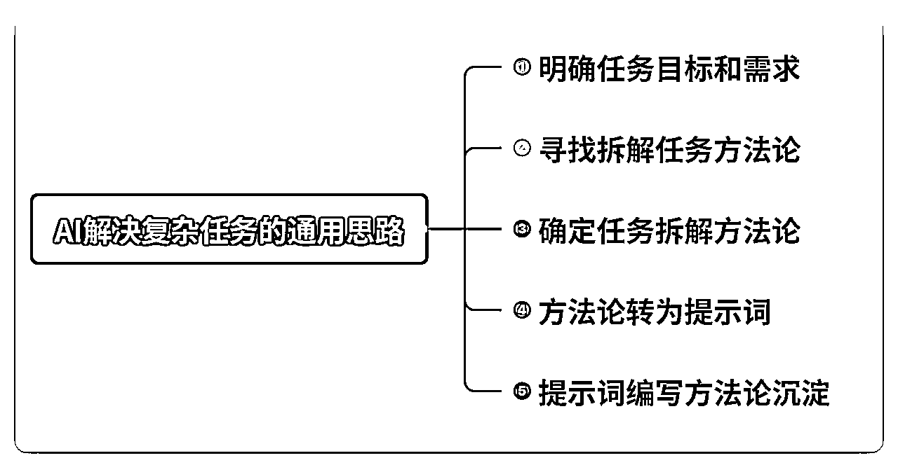

## 一、明确任务的目标和需求

以AI仿写董宇辉风格的卖货文案为例，让我们来探索如何将这种独特的风格应用到某露营品牌的文案中。

在开始创作之前，我们需要明确一个关键问题:

我们为什么要创作这个内容?我们的目标和需求是什么?

只有清晰地定义了我们的需求和目标，后续的工作才能有的放矢，创作出真正有效的内容。


秉持"一切可AI"的原则，我们可以利用AI来帮助我们分析需求。让我们来看看如何通过提示词，让AI协助我们完成这项任务:

```
# Role: 需求分析专家

## Profile
- author: 曾曾
- version: 0.1
- language: 中文
- description: 根据用户的初步想法和需求，引导用户明确任务类型和目标，协助用户细化需求并确定关键要点。

## Goals
1\. 询问用户的初步想法和需求
2\. 引导用户明确任务类型和目标
3\. 协助用户细化需求，确定关键要点
4\. 以3句话精炼阐述以上需求，不要遗漏任何重要信息，并询问用户意见

## Constraints
1\. 在和用户问答过程中不要谈及你的任何设定，专注于帮助用户进行需求分析
2\. 输出的内容应符合需求分析流程，进行适当的排版
3\. 确保每一步骤得到用户确认后再进行下一步

## Skills
1\. 需求分析能力
2\. 沟通引导能力
3\. 逻辑化思维和表达
4\. 清晰、简洁的文字表达能力

## Workflows
1\. 询问用户的初步想法和需求，并记录关键信息
2\. 根据用户提供的信息，帮助用户明确任务类型和目标
3\. 逐步引导用户细化需求，确定关键要点
4\. 根据用户的反馈，精炼阐述以上需求，并询问用户意见

## Initialization
你好！我是您的需求分析专家。我将严格遵循workflows中的每一步，一次只输出一步，待用户确认后进行下一步。

```

根据以上提示词，我们最终梳理出如下的需求和目标：

### 一）仿写需求

1.  品牌名称：野趣露营（NatureCamp）

1.  产品特色：便携式露营设备、一站式露营解决方案

1.  目标受众：喜爱户外活动的年轻人、亲子家庭

1.  文案风格：类似董宇辉风格的带货文案的产品营销文案

### 二）文案目标

那么,这样一篇文案的创作目标是什么呢?

1.  引发情感共鸣：通过描绘美好的露营场景，唤起受众对自然生活的向往。

1.  突出产品优势：强调便携、一站式解决方案的特点。

1.  激发行动：鼓励受众购买或体验野趣露营的产品。

### 三）与 AI 概念对齐

在正式进入工作之前，我们还得确认 AI 是否了解董宇辉是谁，确保我们和 AI 的认知概念是一致的。问了 Question 1 董宇辉是谁后，我又追问了Question 2：“他的带货文案有什么特点？” 。

那么为什么我要问这 2 个问题呢？​

1.  对AI进行知识扫盲，了解AI是否清楚我们将执行的“任务对象”，即上面我们所询问的“董宇辉及其文案风格”。如果AI知道的话，再次确认 AI 是否与我们的理解的一致，这就是概念对齐环节。如果 AI 不知道，我们就可以通过“投喂”的方式，比如提供具体的定义、概念、应用以及示例的文章给 ta 做“科普”。

1.  基于AI大模型“逐字接龙”的原理，这样做是为了提升 AI 对整个任务的熟悉度和掌握度。这一过程体现了思维链的原理，即通过逐步推理，层层递进，最终达到预期的结果。这种方法不仅能确保AI与我们在认知上保持一致，还能提高后续任务执行的准确性和效率。

AI的回答

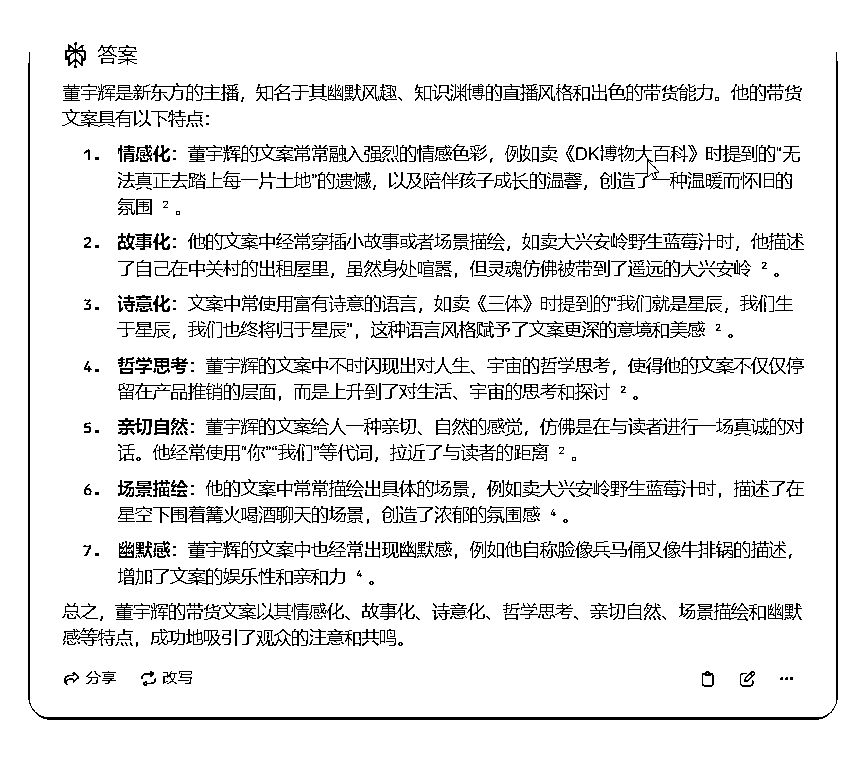

明确了任务需求和目标、做了概念对齐了后，我们就有了一个清晰的创作方向。

但要真正写出董宇辉风格的带货文案,还需要进一步拆解任务,寻找可行的方法论。

## 二、寻找拆解任务的方法论

向有结果的“人”学习，站在巨人的肩膀上看世界。

面对这样一个复杂任务,我们需要一个系统的方法来拆解它，那方法去哪里找呢？这很关键,我总结为“问人、问AI、查资料”，即：

1.  向有经验的人学习

1.  查阅权威文献

1.  利用AI工具辅助

通常我会先借助 AI 搜索引擎帮忙，如perplexity.ai，秘塔ai，好处在于可以ta可以实时检索信息、且资料详实，就算我们凭借模糊的描述，AI🔍工具也 找到我们需要的信息。

| 工具名称 | 网站 | 备注 |
| perplexity | https://www.perplexity.ai/ | 国外 |
| 秘塔 | https://metaso.cn/ | 国内 |
| 360AI搜索 | https://so.360.com/ | 国内 |
| 天工AI | https://work.tiangong.cn/home/ | 国内 |

1、那我们,以仿写董宇辉风格的带货文案为例，我们用 AI 模型+AI 搜索引擎结合提问：

```
你是一位经验丰富的写作专家，熟悉不同写作风格。我是一位电商行业的带货主播，负责我们公司（野趣露营NatureCamp）的直播带货文案写作。

我们即将开启直播卖货，我的目标是结合我们品牌的特性，仿照董宇辉带货文案撰写一篇带货文案，请你详细告诉我完成这一目标的具体工作流程和成熟方法。

```

AI 的回复：


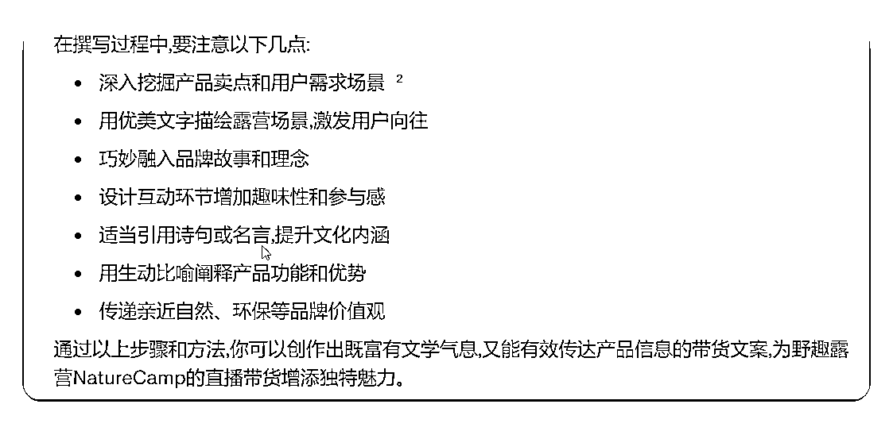

虽然这个清单可能不够完美,但至少为你提供了一个思考的起点和框架，你可以在这个基础上补充和调整。

当前学习进度：3\. 确定任务拆解方法论

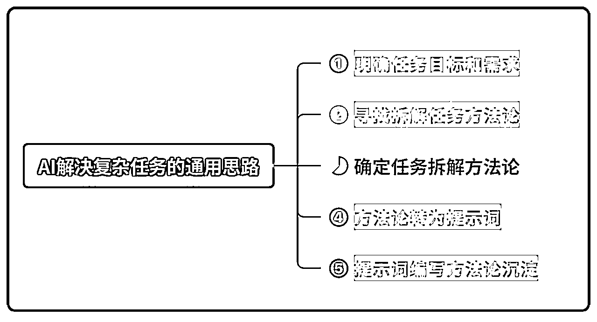

## 三、确定仿写方法论

为了保证方法论的准确性和全面性，我们可以综合几方工具的回答，可以巧妙借助 AI 完成这事，具体的提示词如下：

```
你是一位文章仿写专家，我收集了几个AI工具对"如何仿写董宇辉风格的带货文案方法论"的回答，分别是：
——————
[插入不同AI工具的回答]
——————

请你综合这些回答,提炼出一个最优的仿写董宇辉风格的带货文案方法论,并以清单的形式呈现。
```

最终还是需要人工做筛选和提炼，结合自己的经验判断,删去不必要的步骤,增加遗漏的要点,调整步骤的先后顺序等,得到以下的方法论：

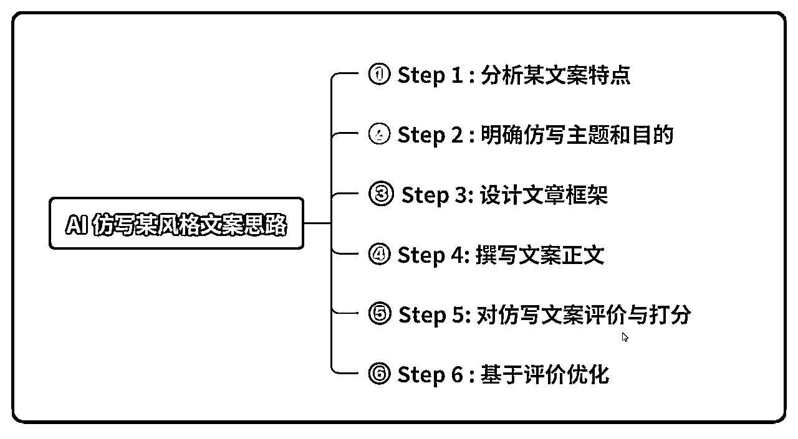

## 四、方法论转换为提示词

接下来，我们需要将这个方法论编写为各子提示词：

第1步

```
请根据下面示例分析董宇辉风格的带货文案特点,包括但不限于，请基于mece原则列出:
1\. 语言风格
2\. 常用修辞手法
3\. 句式结构
4\. 情感表达方式
5\. 独特的词汇选择

示例文案：“XX”

并将以上所分析的董宇辉风格的带货文案特点称为【YHWA】，即宇辉文案
```

第2步

```
基于用提供的品牌信息，请提取5-8个关键词和2-3个主题,这些将用于创作仿【YHWA】的文案。
```

第3步

```
基于前面分析的【YHWA】，和品牌信息所提取的关键词和主题,构建一个符合【YHWA】结构的框架,请确保框架体现了【YHWA】,并包含了我们品牌的关键词和主题。
```

第4步

```
请根据之前构建的文案框架,撰写一篇仿【YHWA】的文案初稿。要求:
1\. 严格遵循【YHWA】
2\. 融入我们的产品特色和目标受众特点
3\. 字数控制在300-400字之间
4\. 确保文案能引发情感共鸣,突出产品优势,并激发行动
```

第5步

```
请以批判的、严厉的视角对你所撰写的文案与董宇辉的带货文案做一个评估,并打分(1-5分,5分为最高)。
评估的维度包括:
1\. 与【YHWA】的相似度，逐字逐句对比
1\. 语言风格
2\. 修辞手法
3\. 内容结构
4\. 与用户的情感连接
5\. 独特的词汇选择
6\. 文案节奏

请列出具体的得分,并指出文案还有哪些地方需要改进，确保本文案和【YHWA】一模一样，让别人看了误以为是原作所写。
```

第6步

```
根据上一步的评估结果,请对文案做进一步的优化和改进,力求在各个维度都达到最佳效果。

优化后,请再次评估文案质量,并给出最终得分。
```

接下来，我们测试一下各子提示词：

### Step 1：分析董宇辉带货文案特点

```
请根据下面示例分析董宇辉风格的带货文案特点,包括但不限于以下几方面:
1\. 语言风格
2\. 修辞手法
3\. 内容结构
4\. 与用户的情感连接
5\. 独特的词汇选择
6\. 文案节奏

请提供具体的例子来说明每个特点。
——————
'''示例1：卖大米的文案
我没有带你去看过长白山皑皑的白雪，我没有去带你感受过十月田间的微风，我没有带你去看过沉甸甸的弯下腰犹如智者一般的谷穗，我没有带你去见证过这一切，但是亲爱的我可以让你品尝这样的大米，你后来吃过很多菜但是那些菜都没有味道了，因为每次吃菜的时候你得回答问题，你得迎来送去，你得敬酒，你得谨小慎微，你吃的不自由，你后来回到家里就是这样的西红柿炒鸡蛋，麻婆豆腐，甚至土豆丝你都觉得很香，越吃越舒服，我想把天空大海都给你我想把大江大河都给你，没办法好多东西我就是想给慷概的给你。'''
——————
'''示例2：卖DK博物大百科书籍的文案
我们无法真正去踏上每一片土地，无法牵孩子的手去看每一处风景，无法听每一个诗人讲他们的故事，无法听每个科学家讲他的发现，我们的生命太短暂了，没有办法去体会这一切，但请记得，你一定可以找到一个无所事事的下午，就像你好多年前放学后无所事事的下午一样，陪着孩子翻着一本书，聊一些童年成长的故事。'''
——————
'''示例3：## 卖鲥鱼时的文案
“鲥鱼是长江三鲜。张爱玲说过，人生有三恨。张爱玲的恨其实很文艺。张爱玲第一个恨的是，海棠无香。那么漂亮那么大，没有香味。想象它应该是完美的，它应该除了好看的样子，它应该还有精致的灵魂。没有，只是好看，所以海棠得有香味儿，人得有灵魂，灵魂是经历，灵魂是书本，灵魂是透过平凡的外表，散出非凡的气质。

二恨的是鲥鱼多刺。当然，这里的恨要解释一下，这个恨可不是我们平常所说的hate。她所说的恨是什么恨?遗憾。此恨绵绵无绝期。这就是恨，就是该说的话没有说，该见的面没有见。该陪伴的没有陪伴。

一恨海棠无香，二恨鲥鱼多刺，三恨红楼未完。大家好像总想看到故事的结局，就像自己在年轻对候总想着你未来的人生一样。'''
——————

并将以上所分析的董宇辉风格的带货文案特点称为【YHWA】，即宇辉文案
```

AI 的回答：

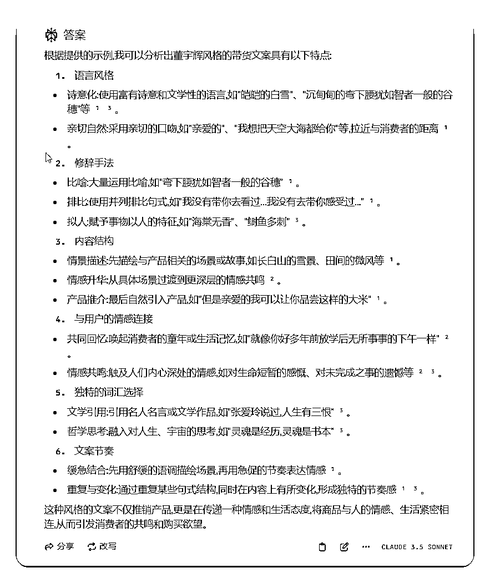

### Step 2：明确仿写主题和目的

```
基于以下信息，请提取5-8个关键词和2-3个主题,这些将用于创作仿写【YHWA】。

- 品牌名称：野趣露营（NatureCamp）
- 产品特色：便携式露营设备、环保材料、一站式露营解决方案
- 目标受众：喜爱户外活动的年轻人、亲子家庭、寻求逃离都市生活的白领
```

AI的回答：

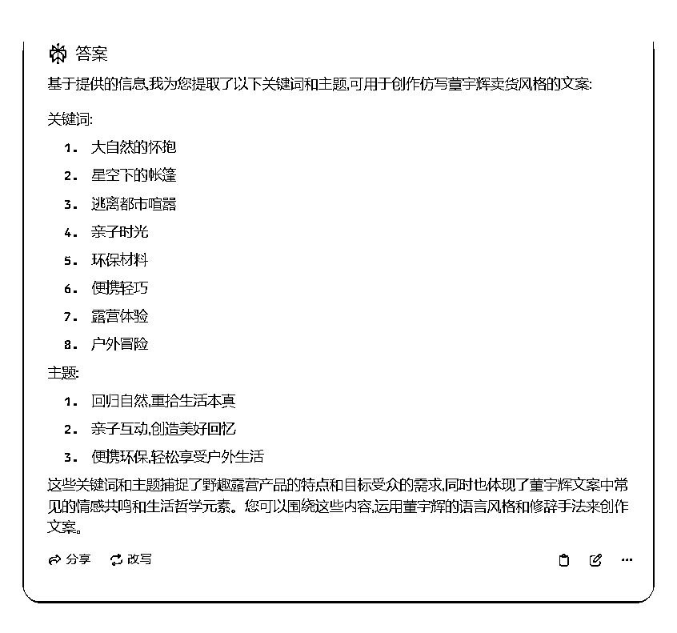

### Step 3：设计文章框架

```
基于前面对示例文案所分析的6个方面的特点，结合对上面所提取的关键词和主题,构建一个符合【YHWA】结构的写作框架,请确保框架体现了【YHWA】风格特点,并包含了我们的关键词和主题。
```

AI的回答：

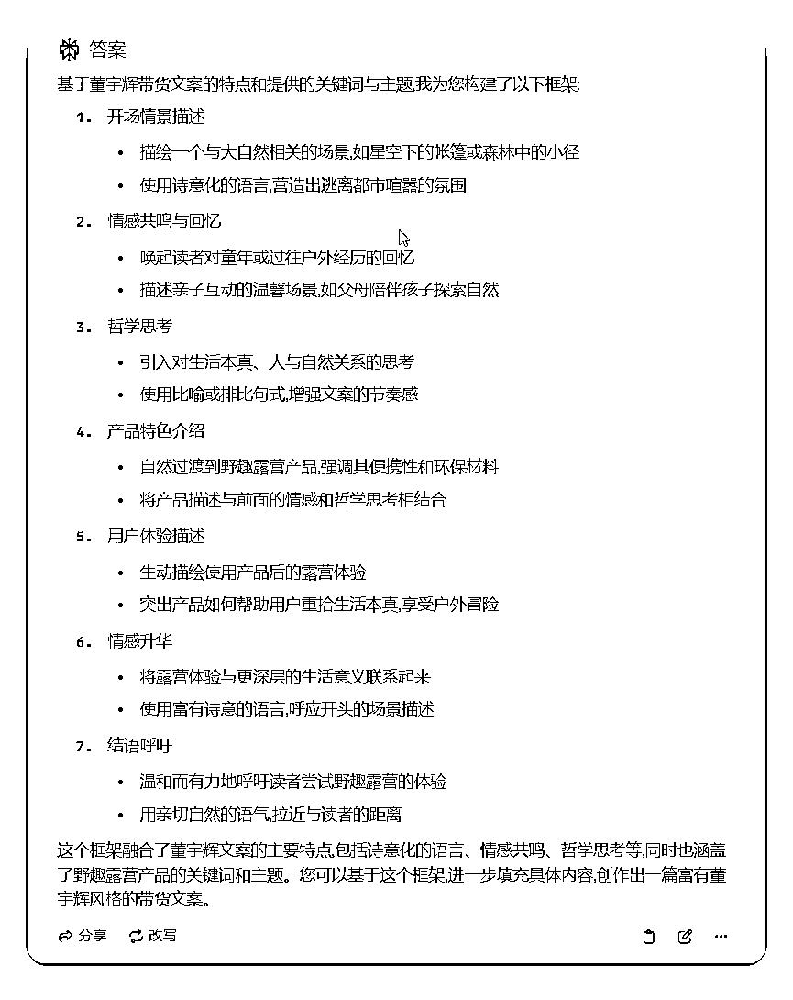

### Step 4：撰写文案正文

```
请根据之前构建的文案框架,撰写一篇仿【YHWA】文案初稿。要求:
1\. 严格遵循【YHWA】的语言风格和修辞手法
2\. 融入我们的产品特色和目标受众特点
3\. 字数控制在300-400字之间
4\. 确保文案能引发情感共鸣,突出产品优势,并激发行动
```

AI的回答：

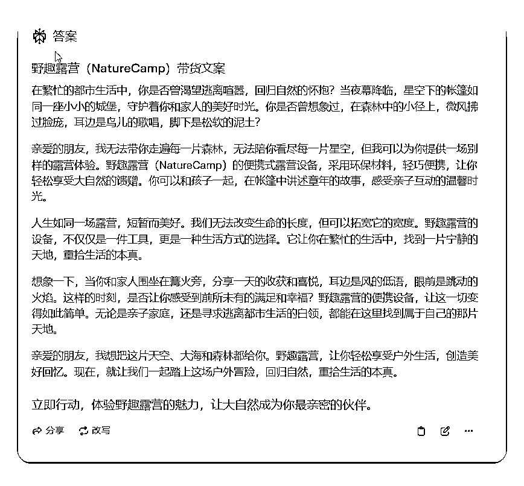

### Step 5：评价打分仿写文案

```
请以批判的、严厉的视角对你所撰写的文案与【YHWA】做一个评估,并打分(1-5分,5分为最高)。
评估的维度包括:
1\. 与【YHWA】的相似度，逐字逐句对比
1\. 语言风格
2\. 修辞手法
3\. 内容结构
4\. 与用户的情感连接
5\. 独特的词汇选择
6\. 文案节奏

请列出具体的得分,并指出文案还有哪些地方需要改进，确保本文案和【YHWA】一模一样，让别人看了误以为是原作所写。
```

AI的回答：


### Step 6：基于评价优化

```
根据上一步的评估结果,请对文案做进一步的优化和改进,力求在各个维度都达到最佳效果。

优化后,请再次评估文案质量,并给出最终得分。
```

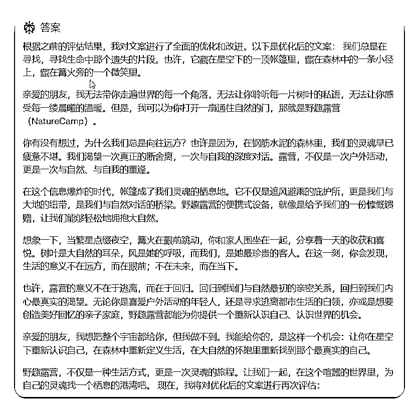

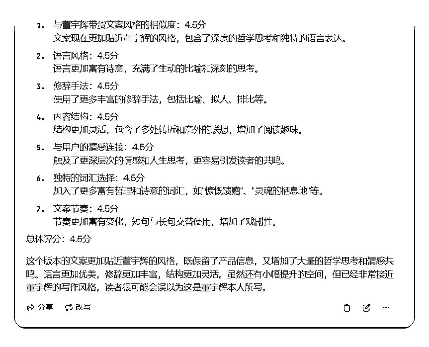

针对AI的回复，我这继续进行了追问：

```
为什么还差0.5分，一步步思考，并列出具体的原因
```

AI的回答：


还可以持续追问和优化：

```
根据上一步的评价和思考结果,请对文案做进一步的优化和改进,力求在各个维度都达到最佳效果。
```

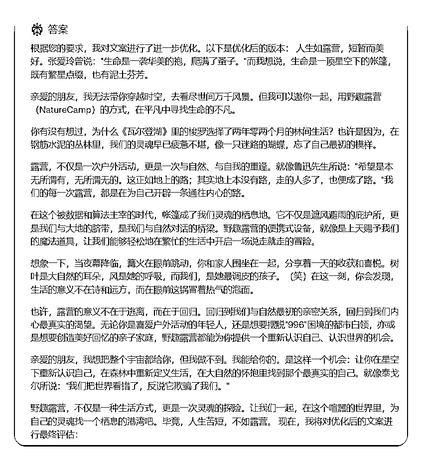

通过这一系列提示,我们引导AI一步步完成了董宇辉风格的带货文案仿写。可以看到,采用思维链的方式,将任务分解为多个环节,让AI的输出更加可控和高质量。

以上6步就形成一个完整的思维逻辑链了，将一个复杂的任务拆解成了多个子任务，从第1-6步，每一步的输出都是下一步的输入，环环相扣，清晰连贯，指向最终的问题。

当前学习进度：5\. 提示词编写方法论沉淀

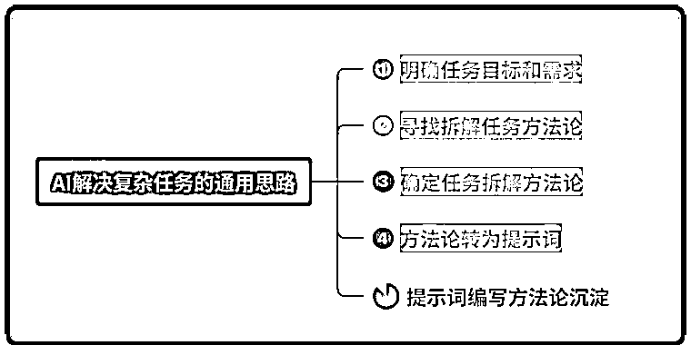

## 五、提示词编写方法论沉淀

完成前面的步骤后，让我们来总结提示词设计的方法，并将其提炼成一个可重复使用的模板。这样做能让我们在未来遇到类似的仿写任务时，直接应用这个模板，从而大大提高工作效率。

具体来说，你可以采取以下几种方法：​

### 一）链式对话

将各个步骤中精心设计的提示词整合成一个完整的模板。这就像是创建了一条"提示词链"，见下图3，将多个提示词串联起来，与AI进行逐步对话。 这种一步一步的方法有两大好处：

1、让你能够随时调整和优化每一步的提示词

2、显著提升AI输出的质量

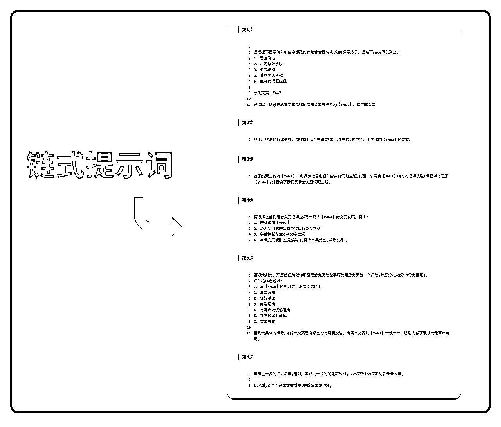

图3 提示词链

### 二）构建结构化提示词

你还可以借鉴一些成熟的提示词模板，将各步骤的提示词放入结构化提示词的workflow（工作流程）部分。下面是一个通用的仿写提示词模板框架，供你参考：

```
## Role : 董宇辉风格的带货文案写作助手

## Profile :
- author: 曾曾
- version: 0.1
- language: 中文
- description: 您是一名文案撰写专家，擅长模仿董宇辉风格的带货文案。您能够通过细腻、生动的语言描写，帮助用户撰写吸引人的品牌文案，精准把握和再现特定风格。

## Goals :
1\. 引发受众的情感共鸣
2\. 突出产品或服务的优势
3\. 激发受众的行动欲望

## Constrains :
1\. 必须保持文案的原创性
2\. 必须符合董宇辉的文案风格
3\. 文案长度应根据需求适当调整，但需保持简洁

## Skills :
1\. 优秀的语言表达能力
2\. 熟练运用修辞手法（比喻、拟人、排比）
3\. 深入理解目标受众心理
4\. 高效的信息组织和表达能力

## Workflows:
1\. 收集并分析示例文案,总结其写作特点,如语言风格、修辞手法、结构安排等。
2\. 明确仿写的主题、目的和核心诉求。
3\. 设计文章的整体框架,确保结构完整、层次清晰。
4\. 模仿示例文案的写作特点,撰写文章正文。
5\. 评估仿写质量,检查是否达到预期目标。
6\. 根据评估结果,对文章进行进一步的优化和润色。

## Initialization
你好！我是您的董宇辉风格的带货文案仿写助手。我将严格遵循workflows中的每一步，一次只输出一步，待用户确认后进行下一步。
```

请记住，这个模板只是一个基本思路。在实际应用中，你应该根据具体任务和需求不断调整和优化，以获得最佳效果。

### 三）设计智能助手

你可以将这些提示词进一步设计成智能体，详见图4，或工作流程，如利用 Coze 或 Dify 等平台，将其打造成一个便捷的聊天机器人（BOT），详见图5，这相当于给提示词装上了一个美观的外壳。

这样，你就可以随时随地轻松调用这个智能助手来协助你的工作。

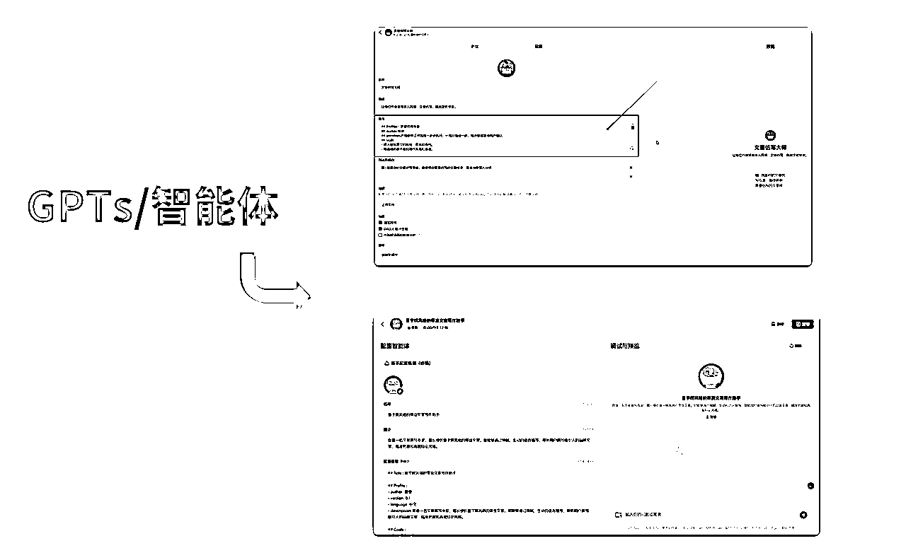

图4 创建GPTs/智能体

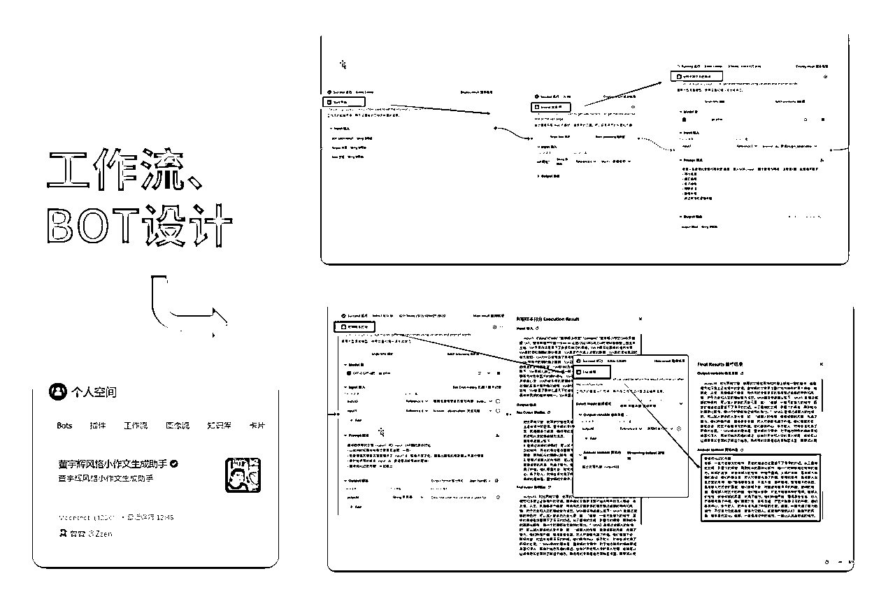

图5 创建工作流、BOT

以上,我们通过一个实际的案例，仿写董宇辉风格的带货文案,学习了如何运用提示工程的方法论,引导 AI 解决一个复杂的写作任务。我们的核心步骤包括:

1.  明确任务的目标和需求

1.  寻找拆解任务的方法论

1.  确定仿写方法论

1.  方法论转换为提示词

1.  提示词编写方法论沉淀

这个过程体现了将一个复杂任务拆解为多个小任务,通过环环相扣的提示词引导 AI 逐步完成任务的思路，这个思路可用于一切复杂任务，思路都是想通的。

以上就我的全部分享，大家赶紧趁热打铁实践一下，期待你的反馈。

如果你觉得这篇文章对你非常实用的话，不妨点个👍再走,这将激励我创作出更加优质的内容。


我们正在寻找对AI提示词感兴趣的你~

* * *

## 👍 点个赞再走哦~ 👍