# AI写作的春天来了--知网AI智能写作平台上线

> 来源：[https://lxkvj39q93t.feishu.cn/docx/TYNUd1gnQod6HaxltZVcfUI3nRf](https://lxkvj39q93t.feishu.cn/docx/TYNUd1gnQod6HaxltZVcfUI3nRf)

# 个人介绍

大家好，我是佳文，中医学学士、深圳大学工商管理硕士（MBA）

GPT 提效航海教练、广东省人工智能训练师考评员

深圳健康管理师考试、全媒体运营师等多个考试命题人

现在是个小创业者，努力生存中

24年主业务：人社部人工智能训练师培训考试

一、如何选题

二、

# 产品功能介绍

近日，中国知网上线了知网AI智能写作平台

功能令人震惊的强大

与其他AI最大的区别就是无脑输出长文功能及标准的引用知网文献功能

对比了同样可以引用文献的秘塔，全文的完整性和连贯性上了一个大台阶

对比了同样可以输出论文的GPT，引用的文献不是“凭空创造”的

现在产品正在内测中，申请通过可以7天免积分使用，后续再使用就要消耗积分了

积分可以通过两种方式获得

1、氪金

2、邀请/被邀请送500积分

注册链接：点击此处，注册领取500积分

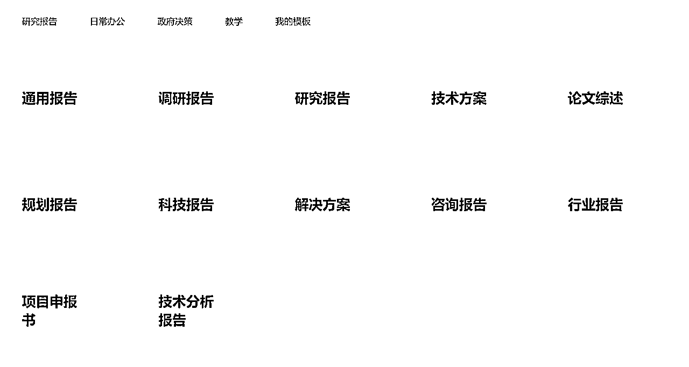

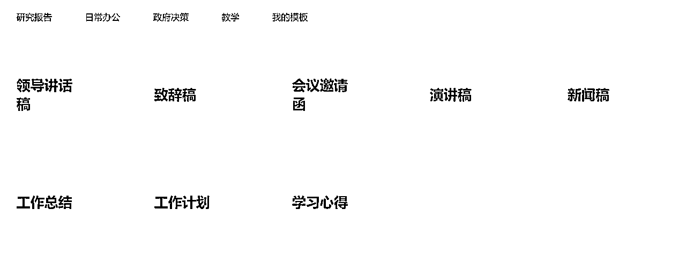

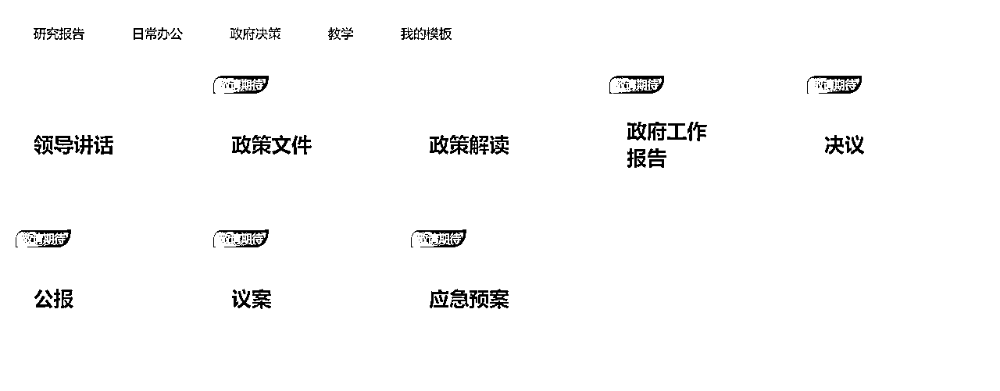

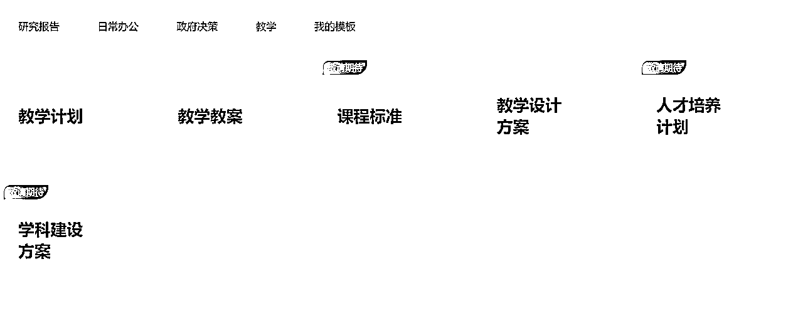

# 使用流程详解

下面以科技报告为例，展示下知网AI写作的流程及功能

## 第一步，新建文档，并敲定选题

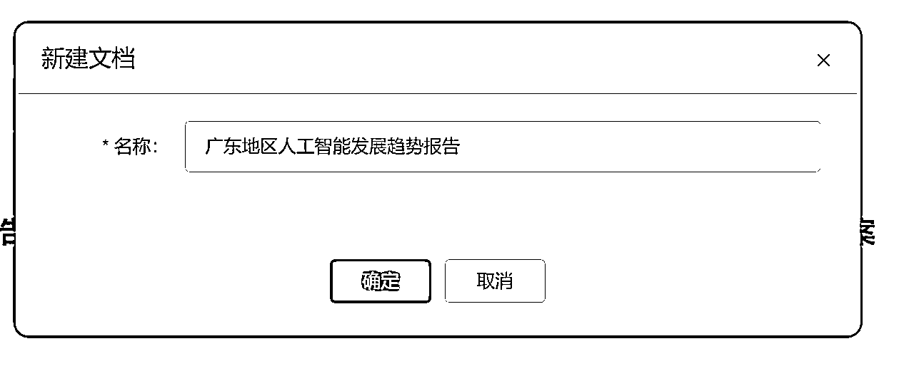

## 第二步，进入写作页面

看到的是一个空白的word，右侧会有AI生成

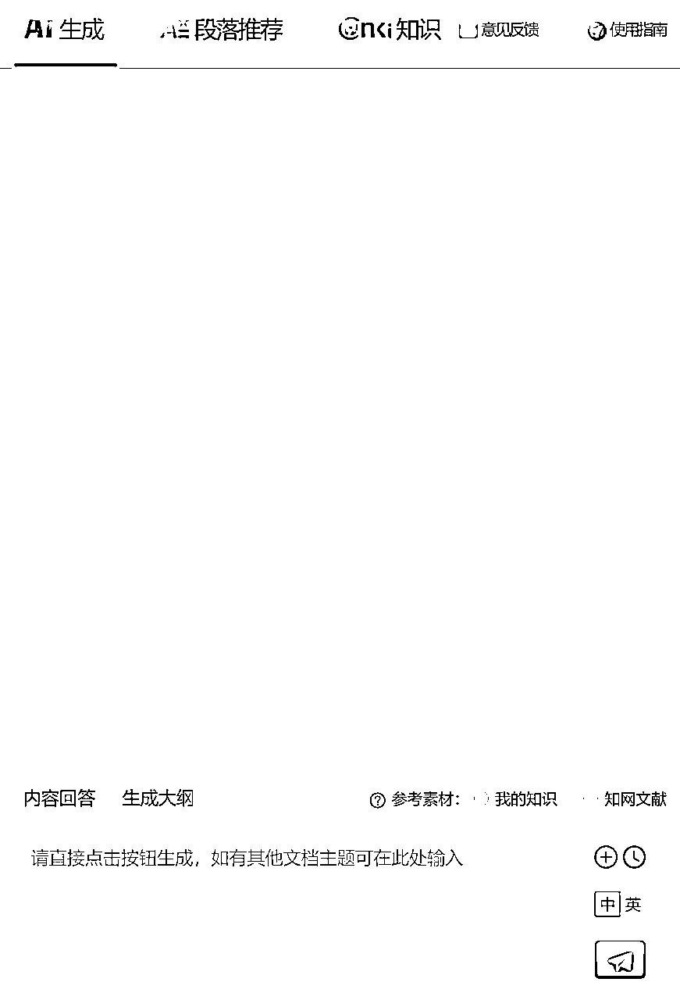

## 第三步，选择引用生成大纲

在下方，可以选取我的知识库，也可以直接参考知网文献进行相关引用

这里只选择知网文献进行引用，生成大纲

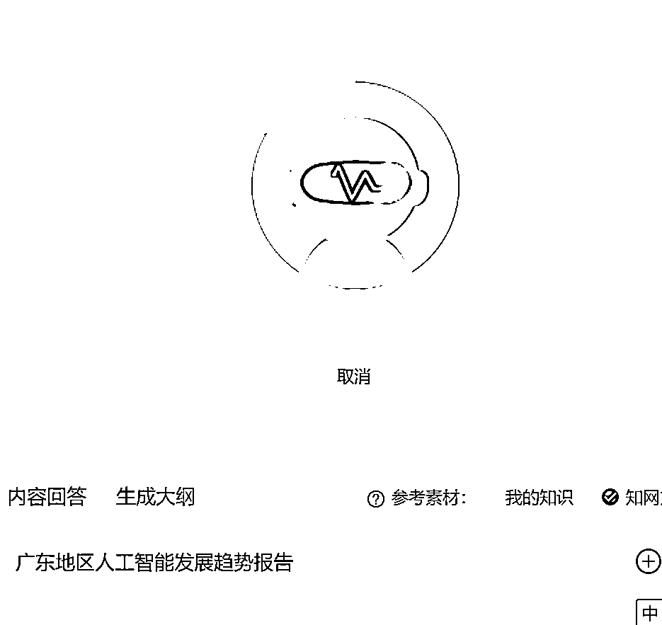

## 第四步，生成概述

生成完大纲的时候会让你选择是否要继续生成概述

喝杯水的功夫，概述生成完了，恐怖如斯

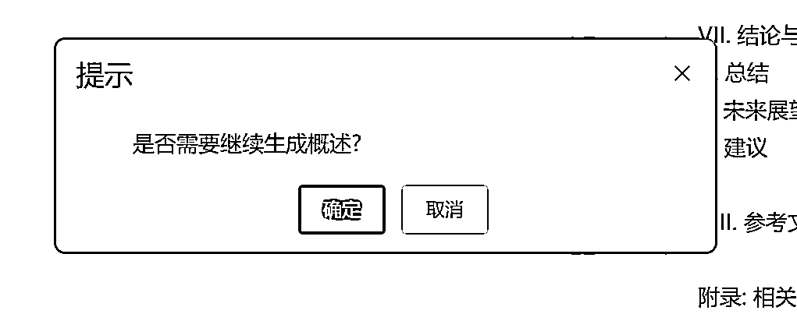

## 第五步，生成全文

马上跳出了新窗口，是否要立即生成全文

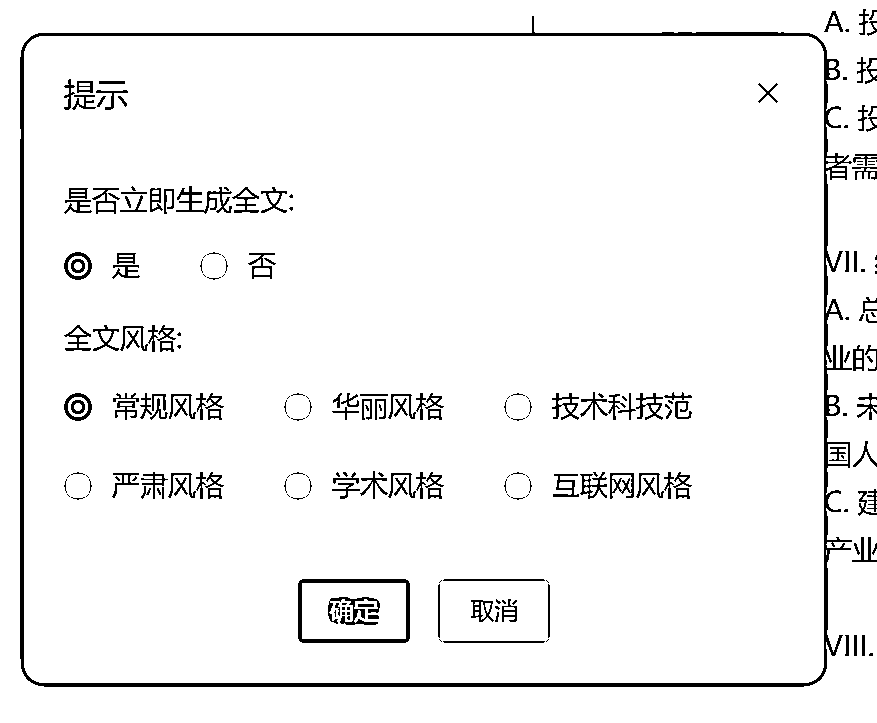

竟然还可以选择风格，666

这里根据主题，选个技术科技范的风格来生成

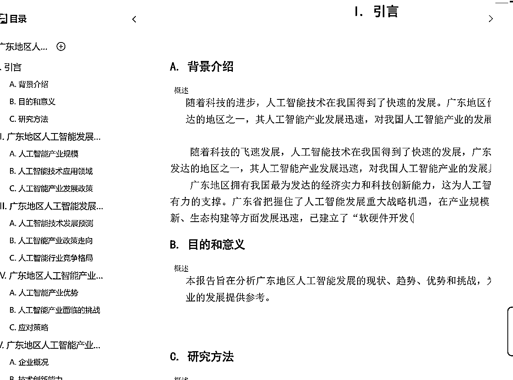

唰唰唰的开始写了

## 第六步，导出

写完导出的时候还可以自动排版，这里就简单的默认排版了

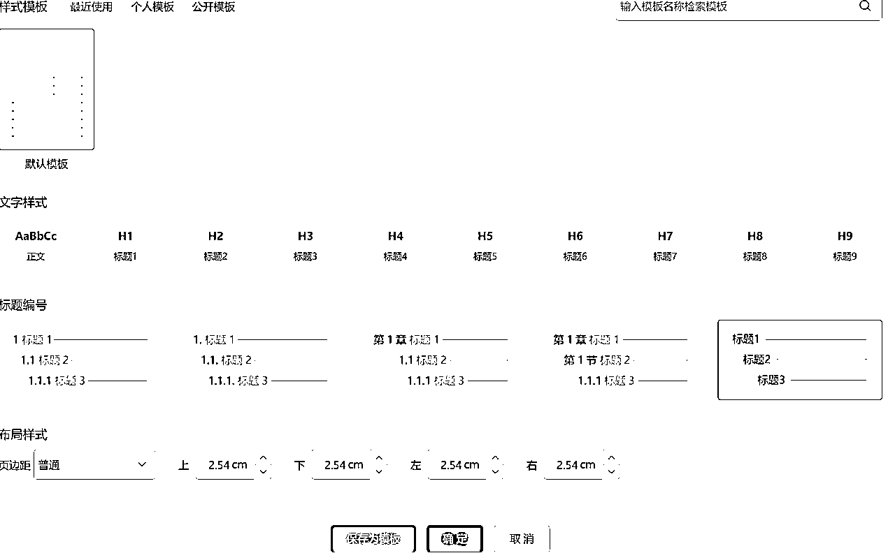

全文共计八章，16037 字，耗时11分钟

没有经过手工调整，没有修正，只是写了个选题（选题也可以用知网AI生成）

正文如下，有耐心的宝子可以看一下

# 生成结果展示

## 报告

再写几个别的吧~整体的操作是差不多的，多了一些选择性的内容

## 新闻稿：（AI生成）

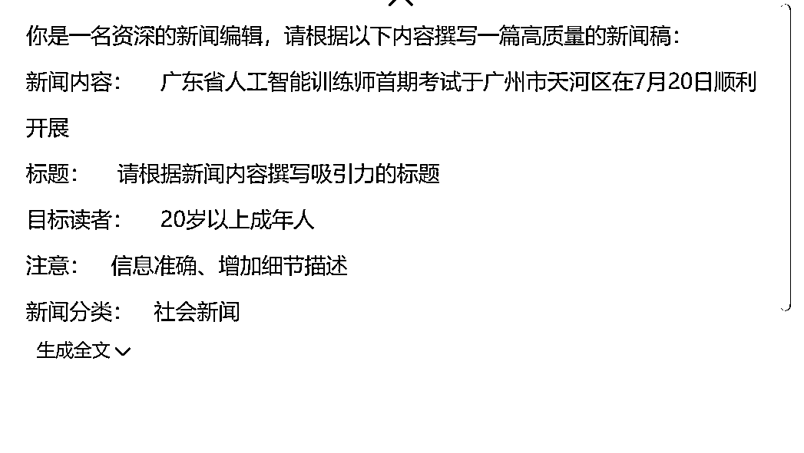

## 学习心得

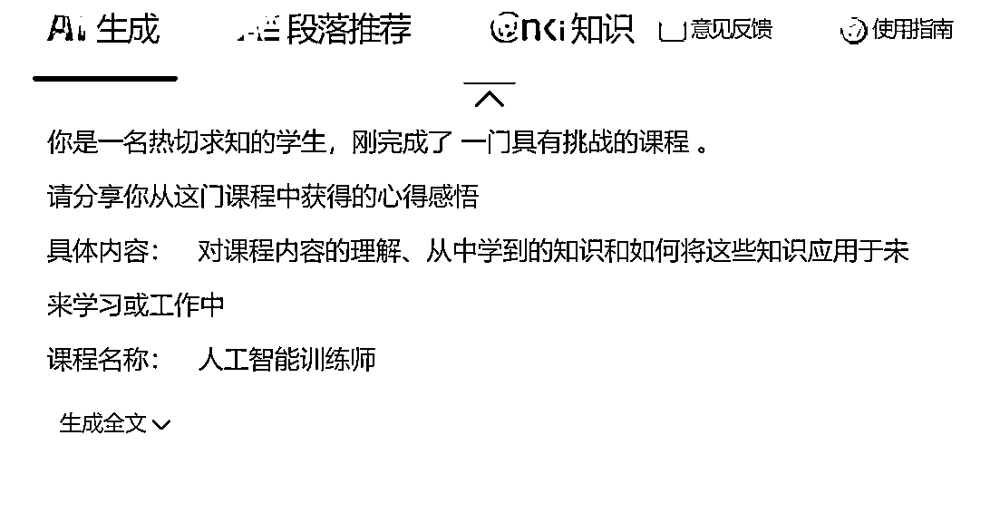

## 工作计划

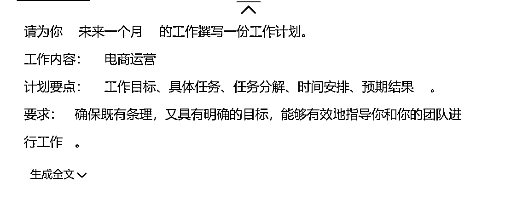

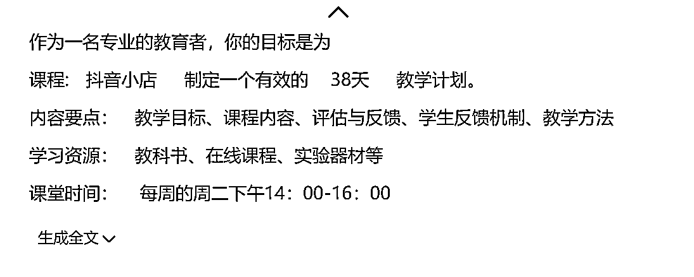

## 培训计划

然后就会发现，虽然知网没有明说，有上限，但在内测期（免积分期）还是会规定可薅羊毛的次数

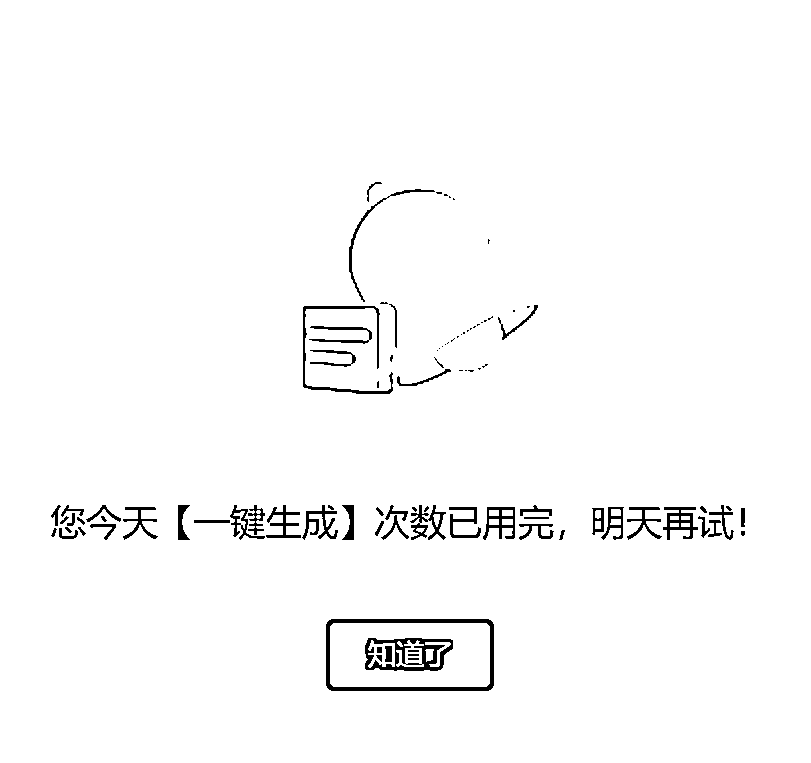

点击此处，注册领取500积分

# 预估可变现的方式介绍

说的不对的地方欢迎在下方评论区指正

## 1、做学科建设

从学科规划，到教案，再到课堂准备，再到每节课的发言稿，都可以直接AI完成了

教培行业的入行门槛再次降低

## 2、协助做课

只要有主题，就可以快速的建立课程大纲，再结合AIPPT等工具，做出一门课也就是分分钟的事情

## 3、代写

此处不再展开说明，知网的AI降低了AI代写的门槛，提高了AI代写的效率

可接单更容易了

## 4、代注册，卖账号

无论哪个平台，只要是内测期，帐号都能卖钱，比如之前可灵，淘宝一直维持在50元/帐号的价格

## 5、做针对性的培训（欢迎引用，但如果你引用了我的内容一定要告知我，谢谢）

结合现有的AI培训，把它作为一个不错的工具来用

## 6、做公考小红书引流

能写公文诶~卖公文模板！

最后，祝大家将AI学起来，用起来，玩起来

为自己工作提效，能有更多的时间做更有意义的事情~

知网AI注册链接：点击此处，注册领取500积分