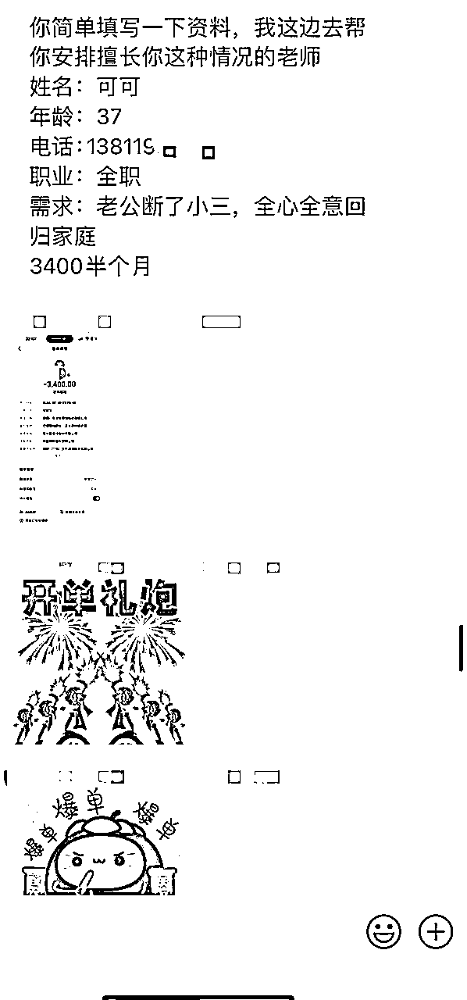
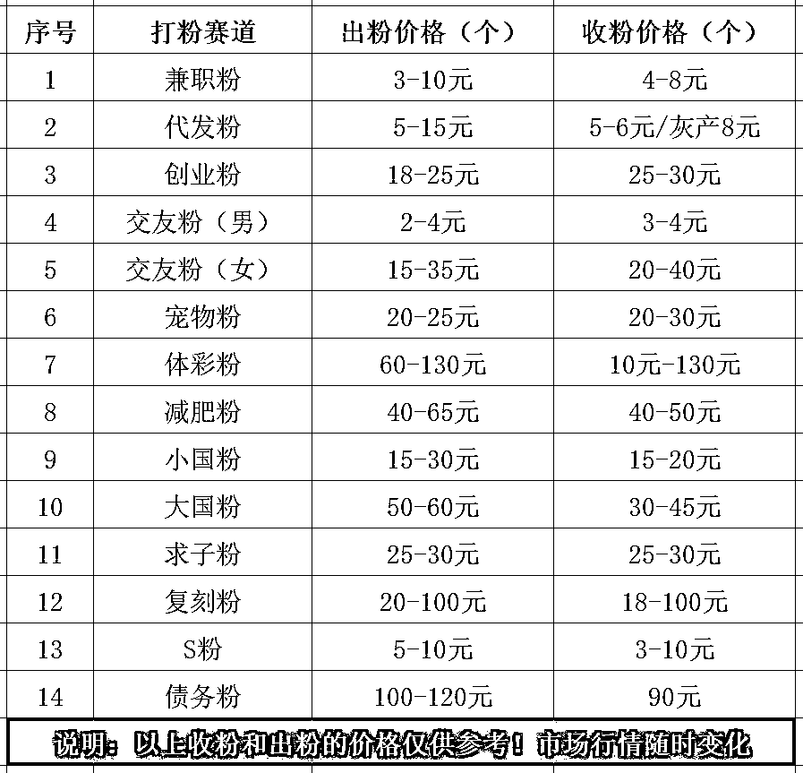

# 我是如何通过小红书打粉日赚千元的全套流程

> 来源：[https://si7o8nqh3o3.feishu.cn/docx/WfHKdSEbOoiY1OxYtVxctB0Bn1f](https://si7o8nqh3o3.feishu.cn/docx/WfHKdSEbOoiY1OxYtVxctB0Bn1f)

📚 做任何项目都应该是小闭环、正反馈。

# 一、内容大纲

1.  《了解小红书打粉行业》

1.  《打粉最重要的四大因素》

1.  《3天如何快速养号》

1.  《如何快速正确找对标》

1.  《如何快速制作作品》

1.  《如何正确发布作品》

1.  《如何安全有效导流》

1.  《如何快速变现》

1.  《最小MVP流程》

# 二、《了解小红书打粉行业》

大家好，我是千韭，韭菜的韭，今天分享的是我怎么通过小红书打粉来做到日赚千元的，这是我自己用打粉方法成功跑通的项目，做的是情感赛道，只要按照流程去执行，绝对没问题。另外我收集了全行业的打粉爆款SOP模板，有需要可以找我要，看看有没有你的行业，纯免费分享。

后续也会持续的更新，因为我自己也一直在用小红书打粉，所以对于小红书的政策改变，玩法更新等，都会及时进行研究，这套方法是适用全行业的。

接下来我们正式进入分享，打粉指的是通过在小红书平台上，发布爆款作品，并且留下钩子让客户添加微信为目的，目前主流的都是以领取资料、免费咨询、服务等噱头来吸引客户，从而让客户添加微信进行后续的转化变现。

### 四大主流打粉方式

#### （1）稳定输出型打粉

目前大部分企业机构也都在用这种方式打粉，因为这种打粉方式在获客方面更持久、更稳定，但缺点也很明显，就是需要通过长时间的作品更新，才能起到获客的效果，当然，我是推荐大家在打粉方式上要雨露均沾，爆力废号型打粉和稳定输出型打粉都要同步进行，这样在数据上会更稳当。

* * *

#### （2）暴力废号型打粉

目前废号打粉是个人玩家最为常见的打粉方式，它的优点在于能够快速获取大量的客户，但缺点同样明显，就是容易被平台封禁，该打粉方式需要通过购买大量的小红书账号，用矩阵的方式进行爆款模板的铺设，通过平台赛马机制跑出爆款作品，同样推荐大家也要把废号打粉方式进行完全掌握。

* * *

#### （3）代发合作型打粉

代发指的是通过别人的小红书账号，来发自己的爆款作品！目前市面上有专门的团队提供代发服务、均价在5元-10元每篇，也有人专门出售这类代发粉，均价在3元-5元每个。你自己也可以通过稳定输出打粉或者暴力废号打粉的方式，在小红书平台上获取这些代发粉，组建自己的代发团队，代发的价格每篇由自己确定，在组建的时候，要分长期代发粉和临时代发粉。

所谓长期代发粉，就是让对方把小红书的账号，修改成自己所要求的账号，然后通过稳定输出型打粉方法，进行长期更新获客，但这里需要注意的是，有部分代发粉会偷偷卖账号的粉给其他商家。

而临时代发粉，则通过暴力废号型打粉方式，进行爆款模板的铺设来获客，这类代发的账号容易被封禁，所以需要长期持续的招募。

* * *

#### （4）疯狂截留型打粉

这类打粉方式是通过在别人的作品里，进行发评论引导，或者私信意向度高的用户，小红书平台每个账号，每天仅有10次私信的机会，所以这里需要学会辨别真实用户，还是同行账号，另外A种B收也是属于疯狂截留型打粉，所谓的A种B收最容易理解的就是，假如代发粉发的贴子爆了，而你就需要在作品下进行评论，再通过评论回复的方式，将评论置顶在前面，还有一种方式就是，直接让代发粉手动将你的评论进行置顶。

* * *

### 四种打粉变现方式

#### （1）出售粉丝变现

出售粉丝指的是向机构或个人出售粉丝，市面上有专门收购各种粉的人，他们有的是中介、有的是机构，收粉的标准和价格会根据行业、要求不同而不同，一般是以数量为单位进行结算，每个行业的单价都不同，这里列举一些市场上的标准价格仅供参考。

* * *

#### （2）机构合作变现

和机构合作一般分两种模式，有按照数量结算的、也有按照分成结算的，这里以情感行业举例，按照数量结算一般是每个有效粉的价格在20元-40元区间，需符合有效粉的标准才计数，这里所谓的有效、指的是机构给出有效粉的标准，而分成结算的方式则是按机构成交来算，一般分成在每单20-40%，这些都要自行和机构沟通确认，和机构合作也有很多注意事项，比如签署合作合同、如何规避吃单、骗单等行为。

* * *

#### （3）自产自销变现

一般最常见的就是通过，自己在小红书上打创业粉，然后加微信卖资料、卖课程、卖项目等变现方式，目前主流的知识付费均属于这种模式，可以搭建自己的个人IP，持续不断地给自己的粉丝，提供价值变现，但这种变现方式，需要具备一定的能力，已经属于个人IP范涛了，这类变现方式可持续变现，因为当下会给你付费购买知识的人，大概率五年后依旧愿意付费。

* * *

#### （4）售卖坑位变现

售卖坑位也有两种方式，第一种是你的账号发布的作品爆流了，可以和收粉商或者机构谈好价格，用A种B收的模式来评论区接资源，第二种方式就是作品爆流后，直接让收粉商或者机构把账号登过去，自己管理私信和评论，这两种方式都是不确保资源量的，价格需自行和对方谈。

* * *

# 三、《打粉最重要的四大因素》

小红书打粉有四个最重要的因素，每个因素都是环环相扣，只要在一个因素上出现了问题，都会导致打粉失败，这四个因素分别是手机、网络、账号、模板，接下来我们针对这四个因素一一进行讲解。

### 手机设备

#### （1）苹果手机

一般打粉前期只有两三台的话，可以考虑选购苹果8以上的型号，在操作和性能上都比较顺畅丝滑，而且刷机也很方便，可以用爱思助手很快就能够解决刷机的问题，选购方面可以在淘宝、拼多多、闲鱼、转转上面购买，一般价格在450-500元区间，但需尽量避免购买到工作室机。

* * *

#### （2）安卓手机

安卓手机适合量大的玩家，因为市面上有很多针对安卓，开发的黑科技软件，像批量养号、批量评论、批量私信等，安卓部分老机型容易被平台风控，所以建议选购红米或小米10以上机型，选购渠道和苹果手机一样，但安卓买到工作室机的概率会更大，一般价格在450-550元区间，买回来后需要进行一次深度的刷机，可以用线刷大师来解决，如果自己不会刷，可以到线下手机维修店花钱解决。

* * *

### 宽带网络

#### （1）4G网络手机卡

这种卡就是大家平常在营业厅办理的手机卡，一般情况下，每个人都可以分别在三大营业厅（移动、联通、电信），各办理5张手机卡，采用的搭配方式是1张主卡拖2张副卡，而副卡只要每张额外支付10元的卡费，即可共享主卡的流量，当然，你也可以找当地的业务员进行办理，都是一样的。

* * *

#### （2）软路由

软路由目前是工作室的最终归宿，它能够很好的规避IP重复、聚集等问题，可以在拼多多上购买一个软路由盒子，大概价格在300元-500元区间，然后在你买软路由盒子的商家里购买IP、每条IP的价格大概在20-50元/每月，尽量购买那种独享IP，可以有效避免不良商家重复售卖同IP的情况，有优点就会存在缺点，缺点就是前期投入上比较贵。

* * *

#### （3）流量卡

流量卡一般就是全国跳的卡，这种卡有利也有弊，利方面就是能够通过切换IP来规避IP聚集的问题，弊方面就是能切换的IP不会有很多，这类卡首次购买需10元卡费，需额外充值15元30G流量，后续只需要每个月缴纳15元月租即可长期使用，每次充值都是以30天为期。

* * *

#### （4）本地宽带

本地宽带一般不太建议用来做小红书打粉，一方面是因为成本上会更贵，另外一方面是也会存在IP聚集的问题，之前了解到有人通过联通、电信、移动分别购买了多条宽，速度上肯定是没话说，至于效果上相对还是没有软路由更实用。

* * *

### 平台账号

#### （1）营业厅卡

这类卡养号容易出恭喜、或过推广，目前是出号概率最大的一种号卡，因为这类卡的权重出生就比较高，具体什么原因也不详，总的来说每个人都必须要办些营业厅手机卡来做，这样能够更快、更容易拿到结果。

* * *

#### （2）厅卡号

这类厅卡号，相对来说和第一种营业厅手机卡的区别不是很大，同样是让人在营业厅里办的卡，每个号的价格在5-20元区间，但这种卡也有弊端，真正的厅卡号不容易买到，有些不良商家，拿接码号当厅卡号来卖，另外就是有一定的概率存在账号会被人改掉的情况，但是这种概率很小很小！可以忽略。

* * *

#### （3）地推号

地推号指的是一些地推团队，在比较偏远的地方利用礼品、奖品等方式来让中老年人注册小红书账号，这类号不是经常有，一般可以在百度帖吧里的地推吧找到这类源头资源，价格和厅卡号相差不多，每个号也是5-20元区间，当然！前提是能买到真的地推号。

* * *

#### （4）国内号

国内号分老号和新号，而新号则比较便宜，每个号的价格在2-6元区间，一般用来打私信截留或者发评论截留的比较多，很多工作室用软件批量操作的，用的就是这类号，主要是成本低、但效果不佳。

而老号主要体现在注册时间上，有些注册时间可达几年，正常来说这类账号的权重会很高，但很多老号之前都被人用来做过广告、要么就违规过，想要买到真正的国内老号比较难，价格一般在10-30元区间。

* * *

#### （5）香港号

这类号由香港那边的手机号码注册的，也分新号和老号，这类号声称可以拿号直接登录即可发帖、发评论、发私信，不需要养号为宣传噱头，其实很少能达到这种效果，至少测试以来，不养号基本发帖不能过推广，发私信和评论也很容易被系统吞掉，买这类号需自行测试鉴别，价格分别在10-20元区间。

* * *

#### （6）美国号

这类号由国外的手机号码注册的号，同样也分新号和老号，一般新手玩家不建议购买这类号，因为它需要梯子、或者结合比特浏览器的模式来玩，操作起来相对较为复杂，后期可考虑尝试！价格分别在10-30元区间。

* * *

### 爆款模板

模板很重要！无论是稳定输出型模板、还是暴力废号型的模板，都很重要，大家要充分的理解“低粉爆款”这个概念，平常要多刷小红书，把自己的账号刷成自己行业的垂直内容，这样就能够时刻的关注到行业内，最新最热的爆款模板，平台也要学会随手积累素材的习惯，建立自己的爆款素材库！

* * *

#### （1）稳定输出型模板

这类模板可以通过关注各大机构账号，行业头部博主来进行模板的获取，也需要把账号的垂直刷成稳定输出型，经常把意向度高的模板进行点赞、评论、收藏的话，时间久了你打开小红书平台，给你呈现的内容大部分都是这类模板了。

* * *

#### （2）暴力废号型模板

这类模板是最容易找到的，直接在小红书平台搜索相关关键词，进行内容筛选为最热，找时间在30天内，点赞量高于1000次的，模板类型符合暴力废号型的，点进去查看作品评论，看评论内容是否都是需求用户，如果是就可以进行模仿。

* * *

# 四、《3天如何快速养号》

### 养号是玄学还是常规

很多小红书博主都说养号是玄学，没有意义！养不养都一个样，那真的是这样吗？其实不然，经过大量的测试发现，养号是打粉的常规操作，无论你在什么平台上买的号，无论买的是什么号，我都建议你先养号，因为养号能够增加账号的成功率、以及权重，养过的号和没有养过的号还是存在一定的差别。

新注册的号虽然没有违规，但是权重都相对比较低，养号是为了模拟正常用户的使用行为，提高账号的活跃度，和加分项，获得后期作品更多的推荐量。

平台了解我们的过程，是通过我们在账号上的行为来判断的，所以我们在搜索某个行业的关键词，刷某个行业的内容，系统就会自动的给账号打上相应的标签，使得后面打开小红书平台，系统就会推送你经常关注的内容给你，而这就是我们想要的，证明系统已经把我们的账号进行了初步归类。

模拟正常用户使用小红书，也同样在告诉平台，我们不是机器号，我们是正常的用户，避免被系统误判为营销号或者僵尸号，这种情况很常见，一般新账号上来就发广告、到处发私信和评论的，很容易就会被系统判定为营销号，那么在后续的运营中，会存在低权重、低曝光的情况，甚至是直接把账号进行降权处理。

* * *

### 新注册号的起号流程

请大家严格按照起号的要求来执行，养号是每位小伙伴的必修课，每天花1-2小时来刷小红书，收藏、点赞、关注、评论都需要做，一般新号要做三天的养号行为，后面会介绍每天的养号流程和标准。

* * *

#### （1）小红书账号注册

拿到新号先不要急着修改资料，而是先刷首页的发现，大概刷10个作品左右，期间每个作品都要完整的看完，确保完播率，然后再点首页的附近，会弹出是否开通定位，选不要即可，然后继续刷15分钟-30分钟的作品，期间刷到的任何作品都不点赞、不关注、不评论、不转发，刷完就可以了。

* * *

#### （2）首次修改账号资料

这是第一次修改资料，一定要把账号修改成素人生活号，头像可以选择风景、或者路人的头像，名字自行取，但不要和行业相关，就素人名称即可，城市尽可能选择和IP属地相同，年龄设置在25-35岁之间，在隐私设置里设置在线状态为关闭状态，在隐藏设置里把关注与粉丝列表的选项打开，隐藏关注和粉丝列表。

* * *

### 如何刷账号垂直度

打开小红书平台，首页上方最右边有个放大镜，点击后在搜索框中输入行业关键词，这里以情感行业为案例，会以“分手挽回”“情感修复”“婚姻挽回”等热门相关关键词进行搜索，就会出来行业相关的作品，我们打开第一个作品开始，模拟正常用户往下观看作品。

如果你想偷懒的话，可以在上方右侧的筛选选项中把笔记类型改成视频，这样你就可以打开第一个视频，把手机放在旁边，大概2-3分钟后翻下一个视频。每刷2-3个作品就要点赞/评论/收藏/关注，具体怎么分配看自己，但每天的硬性指标是要完成最低20个关注和20个评论，总的时长大概在1-2小时，可以把时间分为早上、中午、下午、晚上。

* * *

### 如何增加基础粉丝

在刷作品的时候，主动在作品里评论，而且评论必须是那种能让人私信你的内容，比如情感行业的评论就是，“我想要复合，教教我”“怎样才能挽回，帮帮我”等等，这样就会有很多人关注你，初始的粉丝量就会蹭蹭往上涨，效果立竿见影。

* * *

### 结束养号的标准

重复“账号垂直定位”流程3天左右的时间，账号粉丝在20粉以上，如果三天没有达到这个数量，那就是你偷懒没有发够评论，要么就是发的评论内容不正确，账号关注在60个以上。

其次打开小红书后，系统给你推荐的作品都是行业相关内容，大概10条当中有6条即可，接下来就可以进入发作品的阶段了。

* * *

### 二次修改账号资料

完成了养号流程，接下来要把自己的账号再次修改资料，名称7天内只能够修改一次，所以暂时不着急修改，而简介7天内可以修改三次，所以我们需要先把头像、背景、简介等信息修改成行业相关的内容，但不要放违规内容，最好的修改方法就是找多位自己的同行账号，看人家是如何设置的，直接借鉴对方的内容进行修改最安全。

* * *

### 资料修改案例参考

以情感行业为例：

（1）xxx机构/xxx老师（告诉用户我是谁）

（2）国家二级心理咨询师（我很专业）

（3）帮助500+情侣复合（我拿到结果）

（4）两性情感 | 分手挽回 | 情感分析（我能为你带来什么）

* * *

# 五、《如何快速正确找对标》

### 如何找稳定输出型对标

稳定输出型的对标最直接的办法，就是通过搜索精准关键词进行寻找，这里以情感行业为例，搜索“婚姻挽回”“情感挽回”、会出来一堆的作品，那如何筛选稳定输出型的对标呢，初步从封面上去判断，最简单的判断方法就是封面上的内容较为正规，看上去就很正式，这类大概率就是稳定输出型的对标了，点进对方的账号查看更多的作品，看其他作品是否点赞量也很高，如果是的话，可以用Excel表格将其记录下来，方便后续跟进。

* * *

### 如何找暴力废号型对标

这类对标应该是最好找的了，直接在养号期间，把账号刷成行业垂直状态，就可以刷出一堆废号型的对标作品，但是这类对标一般都是找作品，而不是找账号，因为这类账号死的快，所以找到作品直接下载，然后对着作品进行临摹创作，切记不要照抄！

* * *

### 如何拆分对标各项数据

当你找到对标账号以后，需要对账号进行拆解，为什么要拆解呢？因为能够最快速的了解到，行业当下最容易火的内容，最适合的下钩子方法，转化率最高的话术，当你拆解到了一定数量后，基本你就掌握了该行业在小红书的秘密了。

#### （1）作品封面的重要性

以情感行业为例，通过在小红书平台里搜索“情感挽回”，并且进行筛选“最热”，出来后第一篇是算法推送为最热的作品，点赞量将近有1700次，这篇作品之所以能够爆，和封面图的关系很大，重点突出了“想要重归于好”“28天”“分手后怎么挽回”这些字样！那么对于有这类需求的人群会停留，在小红书这种双侧信息流模式的浏览风格下，作品被往下滑走的概率是非常大的，所以吸睛的封面是提高小眼睛量的重要环节。

封面做的好 = 小眼睛量就高

* * *

#### （2）作品内容的阅读性

当封面点击进来后，内容能否留住用户，留的住用户才能够产生后续的动作，例如点赞、收藏、评论、转发，所以内容也是非常重要的，当你找到对标作品后，内容不建议直接照抄，而是通过GPT或者百度的文心一言进行仿写，仿写后建议自己阅读一遍，看是否存在需要微调的地方。

文心一言指令：请对照以上的内容进行仿写，不改变原本内容的含义，但内容重复率不要超过50%，内容用词要生动且通俗易懂，不要用一些不常用、不常见的词句。

并且检查内容是否包含以下违禁词，如包含请替换，如不包含请忽略。

算命替换成蒜命

塔罗替换成塔锣

复合替换成腹合

电话替换成電話

联系替换成聯系

* * *

#### （3）作品评论区的布局

目前作品评论区也是一个很重要的点，不管作品有没有开始爆，都可以适当的，找一些水军来引导评论区的舆论方向，一般一条评论价格在0.5元-1元区间，比如上述图中，你想让大家都在评论区里发“接““求带”“买了”等，那么最好的办法就是先让水军，或者自己的小号在评论区里发，后续就会有很多人跟着发这样的评论。

* * *

# 六、《如何快速制作作品》

## 收集行业爆款作品

在制作作品之前，我们需要先收集近期行业的爆款作品，并且要一次性收集齐50篇，如果你想对行业有更深层次的了解，建议你收集齐100篇，用Excel表格进行统计，做这个的目的是为了培养网感，另外一个原因是让你了解行业的爆款选题方向，也方便解决后续内容更新的问题。

* * *

## 快速制作爆款封面

小红书是双屏瀑布流的方式进行展现的，目前依旧是以图文为主，所以这里也是以快速制作爆款内容的方式，来教大家，制作爆款内容的工具没要求，这里演示用的是可画免费版工具。

打开可画网页版（www.canva.cn）选择合适的封面，这里以情感行业的作品为案例，如下图：

对的，你没有看错！这就是一比一的复制，爆款的作品之所以爆，肯定是有它爆的原因，它已经经过平台和用户的筛选，所以我们要做的就是复制，那么爆的概率会很大，当然爆款是赛马机制，不是说发了就一定会爆，另外复制的时候可以调整下内容的顺序，或者改掉一些不重要的字。

* * *

## 如何快速制作内容

内容和封面的制作方式是一致的，直接在可画工具里，点封面上方的+号进行复制模板即可，然后用微信截图识别文字的功能（Alt + A）点击文字识别即可把内容抠出来，内容方面可以完全复制，也可以适当修改，这个看你自己，在做之前可以先用小红书违禁词检测（https://xh.newrank.cn/analysis/forbiddenWords），有些违禁词同行能发，但是你不行，一方面是账号权重问题，另外一方面就是运气问题。

* * *

# 七、《如何正确发布作品》

## 发布作品时标题如何填

小红书双屏瀑布流作品展示中，一个是展示封面图，而另外一个就是标题，所以标题的填写除了要吸引人，而且还要融合SEO，在输入”背叛的婚姻如何挽回“这个关键词的时候，你会发现，每输入一个字、下拉搜索结果就会变动，而这些词即是我们的选题方向，也是我们标题布局的方向，我们需要把关键词融入发布标题中，后续只要有相关需求的人搜索该关键词，或相关词，我们的作品大概率会被展示出来。

* * *

## 发布作品时简介如何写

作品简介中也可以融入一次关键词，另外也需要参考对标作品，是否将图文中的内容以文字的形式放进简介中，如果是的话，那么我们照着做就行了，只是额外再融入关键词即可，这样是做的目的是为了增加该关键词的出现频率，有一定的权重值。

* * *

## 发布作品时话题怎么加

发布话题的时候，首先参考对标作品的话题填的是什么，照着抄就行，如果对标作品没有放话题，那查看系统是否有推荐的话题，选择和自己内容相关的即可，如果系统也没有推荐，那么就自行填入五个左右的相关话题。

* * *

## 发布作品时时间怎么选

1.  午休高峰：11点

1.  下班高峰：16点

1.  睡前高峰：20点

1.  有个别行业可能会存在时段不同，可自行测试

1.  每天发布的作品建议在1-2个

* * *

# 八、《如何安全有效导流》

## 作品评论区置顶

小红书导流的方法一直在变，不断的和平台在斗智斗勇，而评论区导流这个方法变得比较少，当作品爆了以后，评论区有两种导流方法，第一种就是发评论内容引导私信，然后将该条评论进行置顶，如果是代发的贴子，那可以通过A种B收的方式来进行，不过需要通过水军将评论的点赞和评论都打上去，这样就可以排在前面，另外一种就是引导进群聊，两种方式都可以交替使用。

* * *

## 私信导流

1.  在聊天的过程中不要直接说敏感字眼（微信、私信、钱）等

1.  可以主动私信评论的客户、私信前可以先尝试进行关注对方、点赞对方，间隔10分钟左右再来私信对方，如果对方回关你，那么发私信就不会有任何问题，但如果对方没有回关的情况下，那么私信只能够给对方发一条信息，其次也需控制频率、否则会给系统屏蔽，俗称吞私信。

1.  在私信导流的时候，尽量是和用户索要微信号，自己不要发、避免遇到同行举报

## 群聊导流

群聊导流是目前较为常用的方法，搭配评论区的方法使用，可以实现全自动，不过细节上需要注意的是，尽量建群和发消息、发作品的账号能分割开，避免有人投诉把群封了后，连带把发作品的账号也处罚了，另外就是在群名、群聊、群置顶内容的时候，需要不断的测试修改、比如某些字词放不上去，就变着法子不断更换字词，直到把你想要的内容放上去为止。

* * *

# 九、《如何快速变现》

## 如何找收粉的渠道

收粉的渠道有很多，最常见的就是行业微信群，差不多一个入群门槛大概在29-99元区间，只要你进去一个以后，后续会有一堆人加你，并且他们自己也经营这类微信群，这类群无论是出粉，还是收粉，都要留个心眼，因为骗子实在是太多了，出粉的给假粉，收粉的不结账。

其次也要看你做的是什么行业，有些行业直接可以通过淘宝、抖音、小红书等平台主动询问对方是否收粉，也有的人会主动找到你，私信告诉你是否出粉，当然前提是你的账号流量爆了，这些人才会找到你。

最稳当的办法就是直接找机构合作，线下线上都可以去谈，并且还可以签合同。

* * *

## 如何找合作的机构

找机构合作有两种办法，一种是线下沟通、另外一种是通过线上沟通，大家可能不知道很多招聘平台，其实不是单纯的招聘，有很多都是找合作的，比如以情感为例，很多情感公司是在招聘渠道运营经理或者总监，然后薪资也很高，那么大部分都不是真正想招，而是想找合作分成的。

一般多聊几个公司，就能大概了解到行业合作分成的比例，前期不需要签署任何的合同，但如果每天的量开始慢慢大起来，那么一起要签署合同以及拟定标准，包括一些禁止事项，比如偷单、骗单等。

* * *

## 如何自己打粉变现

如果自己能解决后端转化的话，这块是很暴利的，但得自己有产品、有渠道。一般常见的像FK、小国、兼职、创业等赛道，都可以自己解决后端，只不过需要花费很大的精力，而且还要确保整个交易链条不出错。

前期是不建议大家去费精力去搞这块，最重要还是把引流的问题给解决掉，只要有流量、有资源，做什么都容易、变现的问题是最简单的事情。

* * *

# 十、《最小MVP流程》

## 购买和办理手机及营业厅卡

首先你能看到这里，应该是对小红书打粉有一定的了解了，那么接下来要动起来，学完只是理论、实践才是真理。

我的建议是能够买3台或以上的手机，因为机器越多，成功的概率就越高，并且去营业厅办理三张及以上的手机卡，月租选最便宜的，但需要有流量，流量最好是20G以上，用1张主卡绑定2张副卡的模式办理，你营业厅直接和工作人员说，她就会给你推荐卡了。

手机的话就在淘宝或者拼多多里买红米9或者10，如果时间比较充裕，也可以自己在闲鱼或者转转上面收，买好以后拿回来记得先刷机，在百度搜索“安卓手机双清”、照着操作即可。

## 确认和调研赛道

如果你自己没有合适的产品，那么首先要先解决赛道的问题，这里推荐的赛道分别有资料、护肤、美妆、创业、兼职、祛痘、小国、初高中教育、减肥、交友、男科、情感挽回、医美健康、逾期负债等，几乎适用于全部行业。

结合自己的实际情况进行选择，前期不要去管后端变现的问题，即使浪费掉资源都无所谓，你的首要目标就是打出粉，你只要知道这个赛道能变现即可。

## 收集和制作作品

确定好赛道后，那么接下来就是收集对标账号和作品，收集齐100篇行业爆款作品，用Excel表格把它记录下来，然后花时间去拆分它，一定要完成20篇的拆解，分析它的封面亮点在哪里，为什么会爆？分析它的内容触动点在哪里，是什么原因大家会喜欢？同样把它用Excel表格记录下来，这两步一定要做，而且还要认认真真的做，这样你才有网感，这样你才能够快速了解行业。

有一定熟悉感觉后，接下来就用可画工具去一比一制作作品吧，先一次性做够10篇，如果你是一天一更的话，那你一台机器就可以解决10天的更新量了，具体做多少篇你自己衡量。

## 发布作品

发布作品一般建议是中午和晚上，这个要看你的行业，最好的办法就是看你的对标账号，统计10个账号的发布时间，你大概就能找出最合适的更新时间段了，这里建议最好的每日两更，而且是稳定的持续输出，坚持每天发布是最有力的说服。

## 设置导流流程

作品发布后，前期会存在几种情况，第一就是小眼睛很少，那么你要检查下，看看能不能过推广，在创作中心里的薯条推广，查看你发布的作品是否出现在那里，如果出现证明这条内容没问题，如果没出现，那么证明内容不行，如果你连续发了两天，一条都没有过推广，那么你就要排查你的手机是否干净！你的IP是否干净。

如果没有出现以上的问题，那么前期小眼睛在100-500区间，都属于正常范围，不用过度关注，持续更新即可。

提前创建好群聊、设置好群聊的引导信息，然后就用A种B收的方式在作品评论区留言，并且将其置顶即可。

## 变现

只要你能够从小红书里引流到微信的用户超过10个，那么你就可以开始考虑变现的问题了，找机构合作或者找个人合作都随你自己，手里有筹码、有案例，你就可以和对方讨价还价。