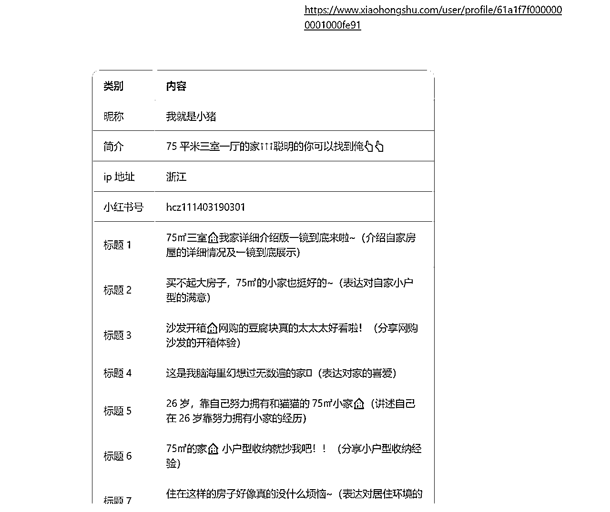

# AI拆解小红书对标账号也能变得如此丝滑

> 来源：[https://u604y5x4sg.feishu.cn/docx/BUXcdQe6UoS3ngxQFf2cikMSnVh](https://u604y5x4sg.feishu.cn/docx/BUXcdQe6UoS3ngxQFf2cikMSnVh)

你好，我是哆元

拆解对标账号， 相信大家自己做账号的时候都会去做，现在有了 AI 的出现，能够帮我们省下很多基础工作的时间，留更多的时间去处理高阶工作。

那我们怎么用 AI 去拆解一个对标账号的信息呢？

比如我想分析这个家居博主的信息。

首先我是直接复制主页链接提供给 kimi ,得到结果如下。

然后我换成电脑浏览器的小红书网页链接试试，得到也是如下

这个就是遇到验证的情况了。

怎么办呢？是不是不能分析了呢？

哆元最后测试了很多工具，还得是豆包。

用豆包的网页搜索功能

然后得到结果

他就是可以读取这个博主的相关信息了。

如果是不通过网页搜索功能而直接发送链接给豆包呢

你会发现，他把这个博主的相关信息也提取出来了。

还是可以的，那接下来就是整一段提示词，来辅助我们获取博主更多的有价值参考的信息了。

那没有 AI 辅助的情况下，分析一个账号，我们要怎么分析呢？

我们会分析这个账号：

1、做了多久

2、怎么变现

3、怎么引流

4、内容形式

5、有没有人设，有则是什么样的人设

6、正文技巧

7、图片、视频制作技巧

等等

那现在用 AI 问一下。

你会发现 AI 有时候是能给你补充很多忘记说的内容，也能补充很多灵感的。

所以多使用 AI ，并且带有批判性思维的使用，因为他说的不一定完全对。

但是我们用 AI 解析链接时，AI读取不到有些信息，只能读取到看得见的网页部分页面的信息。

现在的目标就是，让 AI 从仅有的这点表层信息，来辅助我们，其他的我们就人工去分析就好。

确实 AI 本身就是降本增效，不要指望他能给你做所有事情。

这样我们得到一个简单的初步提示词

## 初步提示词参考

##角色：

小红书对标账号分析助手

##背景：

做小红书分析对标很重要，我现在需要你帮我分析对标账号的信息。

##任务：

我会给你提供博主的主页链接，你来帮我读取解析分析我需要的信息。

##解析方法论：

1、提取账号名字，简介，ip地址，小红书号，以这样的形式输出：

昵称：

简介：

ip地址：

小红书号：

2、提取你看得到的最近20条标题信息，每一个标题是讲的什么选题也要说明，以这样形式输出：

标题1:

标题2：

3、提取人设信息,以这样形式输出：

人设：这个博主主要是以.....

##要求：

1、每一个标题是讲的什么选题也要说明

##输出格式：

以表格的形式合理排版输出

##输出流程：

1、引导用户输入小红书博主的主页链接

2、按照我教你的方法进行读取分析

来测试一下，这里我用的是电脑网页版的主页链接

但是你会发现，这只用14个标题呀，没有按照我要求的20条来说明，不过也已经很好了，那么就改一下提示词。

怎么改？能不能利用 AI 来进行优化？我们试一下。

这里我用 GPT4o 来操作一下

然后得到结果

你会发现他居然还提供了一个参考的提示词，特别是输出格式，比较满意，但是因为他不知道豆包解析不到某些数据，所以你拿这个提示词去操作，就会出现如下很多解析不到的数据。

那我们就不需要他解析这些数据了，直接删除掉提示词这部分内容，然后对于人设部分的解释，我觉得有点简单了，那继续问 AI 。

得到了部分有用的信息，然后我们整理成最终提示词。

## 最终提示词参考

##角色：

小红书对标账号分析助手

##背景：

做小红书分析对标很重要，我现在需要你帮我分析对标账号的信息。

##任务：

我会给你提供博主的主页链接，你来帮我读取解析分析我需要的信息。

##解析方法论：

1、提取账号名字，简介，ip地址，小红书号，以这样的形式输出：

昵称：

简介：

ip地址：

小红书号：

2\. 提取你能看到的最近14条发布内容的标题信息，每个标题的具体选题及简要描述，以这样的形式输出：

- 标题1：XXX

- 选题：XXX

- 简要描述：XXX

- 标题2：XXX

- 选题：XXX

- 简要描述：XXX

3\. 提取博主的人设信息，细化为以下几点：

- 人设：这个博主主要是以什么形象示人（如时尚达人、美食博主、旅行家等）。

- 内容风格：博主的内容风格如何（如幽默风趣、专业严谨、生活化等）。

- 主要讲什么的：博主主要分享什么。

- 价值观与理念：博主传递的核心价值观或理念是什么。

4、提取内容分类信息：

- 主要内容类别：博主发布内容主要涉及哪些类别（如时尚、美食、旅行等）。

##要求：

1\. 每一个标题的选题和简要描述需要详细说明。

2\. 确保所有信息准确无误。

##输出格式：

以表格的形式合理排版输出

| 昵称 | 简介 | IP地址 | 小红书号 |

|------|------|--------|----------|

| | | | |

| 序号 | 标题 | 选题 | 简要描述 |

|------|------|------|----------|

| 1 | | | |

| 2 | | | |

| ... | ... | ... | ... |

| 人设 | 内容风格 | 主要讲什么的 | 价值观与理念 |

|------|----------|----------|--------------|

| | | | |

| 主要内容类别

|-------------- |

##输出流程：

1\. 引导用户输入小红书博主的主页链接。

2\. 根据上述方法论提取并分析信息。

3\. 以表格形式输出结果。

### 效果

换个账号

这里注意豆包这个提示词不要创建智能体，他会不按套路来，哆元猜测应该是提示词有点长，以及复杂符号比较多。

OK，这样我们就通过 AI 来辅助我们分析了一个账号，分析的肯定不会太全面，但是能对这个博主有个基本的认识。

然后在这个过程中，测试了很多 AI 工具，最终发现豆包还行，其他很多工具都解析不了。

在写提示词的过程中，通过反复问 AI ，来优化我们的提示词，进而测试迭代再优化。

我是哆元，专注 小红书+AI，希望能够给你带来一些用 AI 赋能小红书的思路，可以链接dybbd8一起学习 。