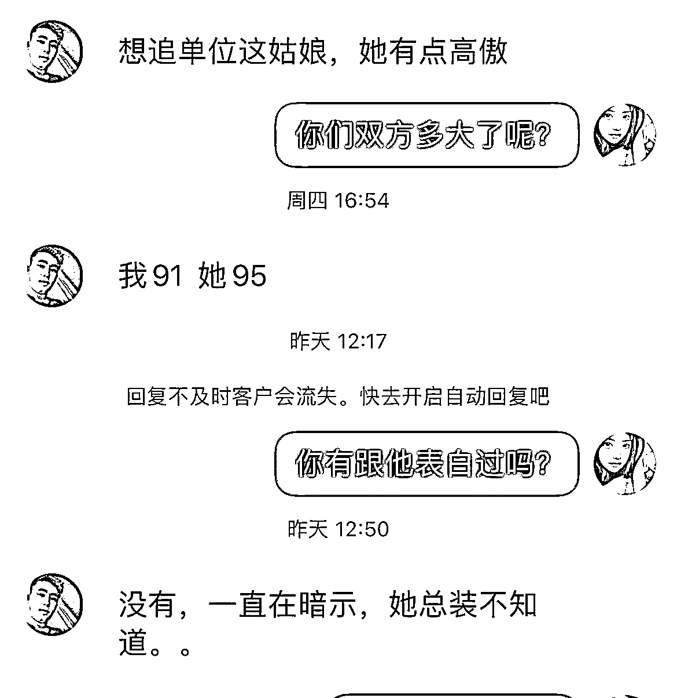
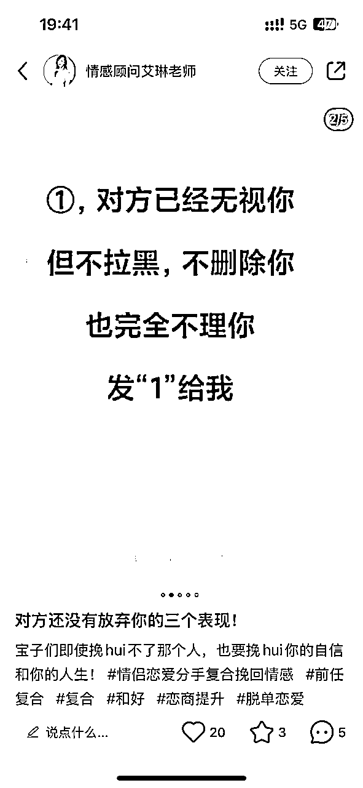
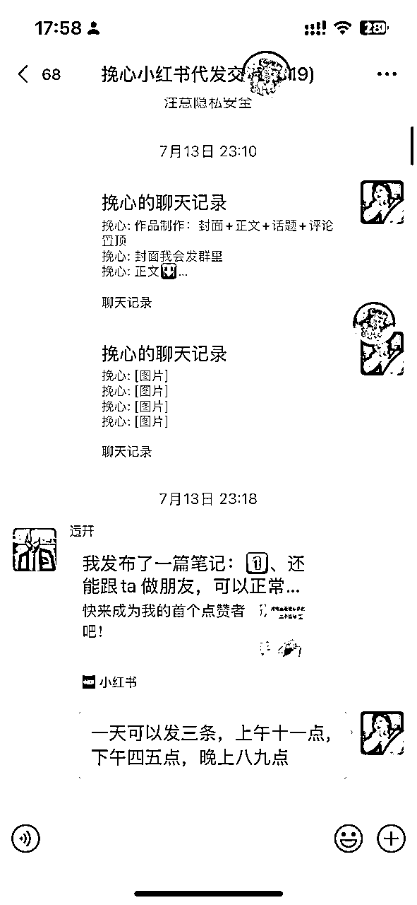

# 小红书矩阵自热情感粉引流，单月变现5w+打法拆解

> 来源：[https://p9z0j9usen.feishu.cn/docx/VfwIdXkBMoTKNSxX2rec1ZNPnmh](https://p9z0j9usen.feishu.cn/docx/VfwIdXkBMoTKNSxX2rec1ZNPnmh)

圈友们大家好，我是挽心。

又和大家见面了。大家也都知道我一直都在从事婚恋流量变现，之前给大家分享过抖音的玩法，原文链接： 。吸引了很多圈友了解和入局这个行业。今年3.15过后，抖音的审核变得更严格，同质化内容也越来越多。

抖音的图文矩阵基本上封了一批又一批，虽然游戏混剪也一直在做，但投产比一直不高。所以，我们决定开始转战小红书。

在小红书上摸索了一段时间后，我们终于找到了适合的玩法和策略，成功实现了单月5万+的变现，并且每月稳定引流1000+精准用户，单人每日打粉稳定30+。

这次，我将和大家分享我在小红书上如何进行婚恋粉引流和变现的全流程攻略。希望能给大家一些新的思路和启发。

# ✅成果展示

## 1、账号数据

在小红书上，我们通过不断优化内容和策略，达到了以下的成果：单月单人6设备打粉900+。单价50变现金额4.5w。

## 2、变现金额

# ✨婚恋粉流量变现是什么

这个在之前的文章里面讲过，所以就直接拿过来，这次主要是将小红书的玩法，在这里就不过多赘述。

## 1、婚恋粉定义

简单来说，婚恋粉指的有恋爱挽回、婚姻修复、脱单追求等需求的精准用户。

①恋爱挽回

②婚姻修复

③脱单

## 2、变现逻辑

通过抖音、小红书等平台发布情感类作品，吸引需求用户找你咨询，然后你将需求用户推到情感咨询师的微信上，次日结算。情感流量出售的单价一般是在40—100左右，根据数量，质量，类型来定价。

## 3、优势

### 3.1 婚恋粉优势：

① 情感需求强烈：婚恋粉往往处于感情困扰或婚恋问题中，对情感指导、咨询等有强烈的需求。

② 互动性高：这类用户喜欢分享和互动，愿意在评论区、私信中与博主交流，增加了内容的互动率和曝光率。

③ 转化率高：由于情感需求的迫切性，婚恋粉的意愿较高，只要内容和服务能够触达和打动他们，转化率相对较高。

### 3.2 项目优势

①不需要很高的资质和很高的粉丝基础，不用拍摄视频，也不需要开直播，只需要准备几个账号就能做。

②没有繁琐的售后服务，不需要像传统电商一样对接售后退换货。也不需要像虚拟课程一样整理资料，引流转化。只需要做纯引流的工作，不需要自己花时间去转化。几乎就是零成本创业。

③适合多群体下场：无论你是学生、教师、上班族、宝妈、副业党.....都可以做情感粉引流，把情感粉引流当做副业可以有一份稳定的副业收入，或者像我一样，当做主业，既可以自己做流量赚够比主业多的钱，也是开一个流量工作室，放大复利。

# 一、小红书前期——基建

小红书的用户付费能力和付费意识都很强，日活跃用户达到了2-3亿，主要集中在年轻女性群体上，用户精准且付费能力出色。不过，小红书的管控非常严格，几乎是所有平台中风控最严的。如果你能把小红书运作得得心应手，那么其他平台的操作就会变得轻松许多。

在小红书上进行有效的婚恋粉引流，四个要素是关键：账号、网络、设备和模板。账号、网络、设备是我们做小红书必须要注意的基础建设，统称为小红书基建，如果基建没有做好，再好的模版也会出现0播或者不加热的情况。下面我将详细介绍这四个要素的作用和最佳实践。

## 1、账号

账号是小红书自热的核心要素之一。选择和管理账号时，需要注意以下几点：

1.  账号来源

*   三网厅：可以通过自己的身份证办理运营商的号卡，推荐使用流量卡或非流量卡。

*   号商/号卡网站：可以在号商或号卡网站购买新号，一般价格在3~6元，新号适合长期使用；老号价格在10元以上，适合短期高强度使用。

*   卡网：这上面不太方便放

1.  账号选择

*   三网厅卡：最适合自热使用，号码在自己手中，稳定性和可靠性更高。

*   号商/号卡网站：适合打截流使用，价格较便宜，但新号需要先养号提高权重。

*   接码平台：适合短期使用，但稳定性较差。

1.  建议：选择三网厅的厅卡，最好使用13、15、18开头的老号段，不连WIFI。

## 2、网络

网络是保障小红书自热效果的重要因素。以下是常用的网络方式：

1.  三网厅卡流量：适合设备少的情况，稳定可靠。

1.  全国跳IP流量卡：每开一次飞行模式会切换一个IP，适合中等数量的设备。

1.  软路由：可以配置多个WIFI，每个WIFI可以设置不同的代理IP，适合设备较多的情况。

1.  建议：设备少时使用厅卡，设备多时使用软路由。最好一机一卡一IP，注意IP的质量和网络的稳定性。

1.  注意：

*   平台检测的是对外的网络IP地址，而不是本地网络IP地址。

*   一机一卡一账号时，即使IP属地相同，也不会被检测到。

## 3 、设备

设备的管理和维护对于账号的稳定性至关重要：

1.  设备清理

*   如果设备上连续封过多个账号（一般3~5个），需要双清刷机并修改串码（安卓手机）。

*   苹果手机可以直接在设置中还原，或使用爱思助手刷机。

1.  接收验证码问题

*   在使用苹果手机接收验证码时，可能会出现“发送验证码失败”的问题，需要检查网络和账号设置。

1.  设备扩展方案

*   可以使用模拟器、云手机、虚拟机、分身软件等来扩展设备数量，但需注意IP的处理。

*   建议：尽量保持一机一卡一账号一IP的最佳实践。

1.  注意：设备问题常导致内容加热失败，因此需要定期维护和检查设备的状态。

通过合理管理账号、网络和设备，可以有效提升在小红书上的婚恋粉引流效果，实现稳定的流量增长和高效的转化。

## 4 、基建自测

在操作过程中，可以通过以下方法自测基础建设是否正常：

1.  账号自测

*   发随拍：发布一张随拍图片（如外景），检查是否能过推广。如果随拍都无法加热，说明账号存在问题，需要更换账号。

1.  IP自测

*   换IP测试：使用不同IP测试自测是否有效，可以使用全国跳IP流量卡或其他方式更换IP。检查是否能够正常过推广。如果换IP后问题解决，则可能是IP环境不干净。

1.  设备自测

*   设备清理：对设备进行双清或刷机操作，确保设备状态正常。如果刷机后问题解决，则可能是设备问题。

1.  模板自测

*   测试不同模板：如果随拍能够过推广，但其他模板无法加热，可能是模板存在问题。尝试使用高权重老号或养号解决问题。

通过这些步骤，可以确保账号、网络、设备以及模板的基础建设都达到优化效果，从而提升在小红书上的运营表现。

# 二、小红书中期——养号+模板

## 1、养号

号是指模拟真人使用小红书一样去操作，很多人都说养号需要3~7天，三网厅的卡注册的账号养一周，基本都出恭喜。

其实也就几个步骤：搜索、阅读、点赞、收藏、评论、关注。

首先先去搜索栏搜索自己这个赛道的关键词；搜索出来的内容进行阅读，图文或视频均可，至少要看2/3；选择自己喜欢的内容可以点赞和收藏，每天点赞>10、收藏>10；同时在这个过程中也要去评论区评论；每天关注2-3个粉丝量在1w以上的相关博主。

一天养2-3次，一次30分钟以上。

## 2、模板

模板从字面意思上来说是很好理解的，就是我们平时套内容的框架。一个好的模板设计应简洁明了，便于快速制作和调整，减少重复劳动。

自热模版就是同行操作的答案，你只需要抄他的模版能过推广，大概率你也有流量，然后热了之后再考虑下钩子，这是自热的一个逻辑。

起号成功后就一样形式的模板一直输出

### 如何制作一个爆款的模板

以我们做的婚恋挽回为例，关键词：“分手挽回”“婚姻修复”，给大家分享几个测出来的几个模板

模版一 封面图片＋话题+评论区文案置顶

模版二 封面图片＋内页图片+话题

模版三 封面图片＋正文+话题

我们只需要更换图片即可，图片构成元素就是三个。

背景+标题+贴纸，我们可以通过醒图或者稿定设计轻易的制作出模板来。后续只要更换贴纸就可以。

*   模板很重要，模板一定是要反复打磨的。不一样的赛道，模板的逻辑也所不同。有的产品属性触碰的违规字词，钩子，图片等会出现多种多样的违规提示。解决方法：一一排除法。说我标题违规，那哪些标题不能写，或者直接不写标题；说我正文互动风险（图片里，或者正文里，或者评论区）；说我导流等。

*   模板触达用户决策，且符合多数人画像的，模板要多数人看的懂，不要你自己看得懂

*   红薯图片检查逻辑是以图识文字，不要以为你发个几篇就觉得测出来，红薯图文检测逻辑自认为是随机扫，扫到了打下来，可能是一个字词，一个产品。

*   新号和老号的轻度违规词 把控也不一样。一定是模板要能来粉的，批量不出粉说明模板没打磨好

# 三、小红书后期——筛粉+引流

## 1、筛粉

情感流量的单价比常规的高一些，所以一般后端会有一定的要求，拿常规要求举例：

类型：分手挽回、婚姻修复、婚姻挽回、脱单追求

年纪：23-46岁

意愿：确定想要挽回感情

时间：分手（离婚）一年以内

备注：抑郁症、极端、暴力等都是不要的

所以我们一般会用三个问题来筛粉

确认意愿和类型：是分手了想要复合吗?/是想修复婚姻吗？/是想追求对方吗？

确认年纪：你们双方多大了呀？

确认时间：你们分手多久了？/你们离婚多久了？/你们认识多久了？

让用户添加微信：\/细聊可以吗？我来帮你？

咨询师微信:*****

结尾：好了这里说下网名，备注一下方便通过

备注：一般不会发送微信这种敏感词，谐音字也不会发。要网名是为了方便核对结算

## 2 、常见引流方式

因为这个粉其他的打粉模式不太一样，加的微信也是变动的，比如改小红书号，群聊、@小号等等都是用不了的，所以给大家分享一些适合打情感粉的引流方式。

### a、专辑引流

直接创建一个新专辑，名字改成微信号。再用小号发一张钩子图片，收藏，可以直接分享。

### b、表情包/图片引流

### c、单独拉群引流

①创建群聊

②邀请用户进群

群聊发微信不容易别屏蔽，但是想对于直接引流来说不会被限制

# 四、踩坑和建议

新人起号切忌急躁，要保持冷静和耐心。不要-开始就大量投入精力和资源，而是应该逐步摸索，找到适合自己的方法和策略。

做矩阵本来就是废号流，保持良好心态很重要。

自热基建，清理设备、更新账号、优化网络和调整模板都不能偷懒。记得定期重置系统，使用可靠的流量卡和软路由，测试优化模板，确保内容有吸引力。细节决定成败，认真对待每一步操作才能取得好结果。

注意不要用力过猛，避免一次性发布过多内容或过于频繁的互动。这样反而被检测和屏蔽，要学会从失败中吸取教训，调整自己的策略和方向。不害怕犯错，因为每一次的失败都是一次宝贵的经验。

有一个稳定的后端比什么都重要，能避免很多争议和扯皮，在合作之前最好谈好价格和要求。

我们要做离钱近的事情，而不是围绕着赚钱兜兜转转，自我感动！

# 五、其他玩法

## 1、平台选择：

情感流量不光小红书可以做，抖音视频号也都可以做

## 

## 2、流量变现：

*   销售流量：对接给情感公司，直接销售给需求方。

*   自我转化：在小红书或抖音上进行情感相关内容创作，直接将流量转到私域，自己通过情感咨询服务或产品转化

## 3、内容发布：

*   自我矩阵发布：通过自己搭建的矩阵账号发布内容，实现引流和变现。

*   代发兼职：找小红书代发兼职进行内容发布，利用别人的平台资源来实现引流和变现

*   下面是我找的代发，

这些玩法可以组合使用，根据自己的需求和资源进行选择和调整。

# 六、常用工具

## 1、比特浏览器

https://www.bitbrowser.cn/

## 2、比特小红书养号：

## 3、图文批量制作

点击下载

## 4、刷机教程

https://onfix.cn/rom

# 七、结语

今天分享了很多技术、思想、感悟以及我的一些经历和经验。这是我第一次分享这样一篇长文，真心希望能够给大家一些帮助呀，能帮大家解决一些问题，提供一个思路，贯通一个卡点~

成功不是一蹴而就的，而是一步一步积累的。保持学习的热情，持续优化你的策略，坚定自己的目标，不断调整和完善自己的方法。不要怕失败，失败只是成功的一部分。

感谢大家的收看，祝愿大家在自己的领域中大展宏图，取得超棒的成绩！

我是挽心。期待我们下次再见，继续一起成长！