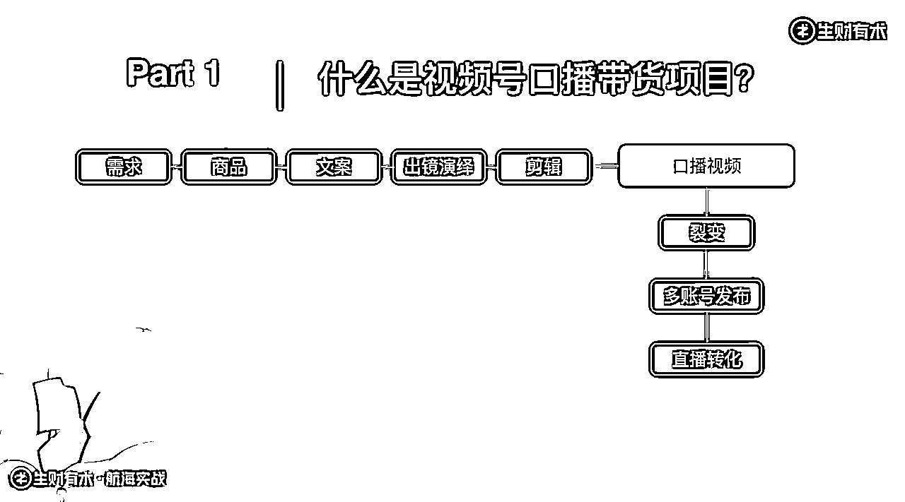
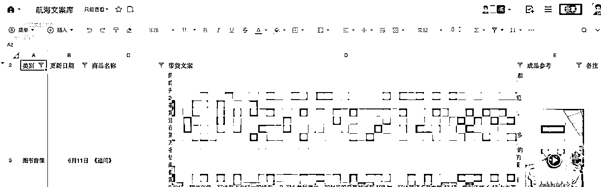

# 【航海总结&预告】28 天航海，60.56% 船员成功变现，变现船员累计GMV99万元，我们做对了什么？

> 来源：[https://y2mt3o47i3.feishu.cn/docx/VwEJdGBlfoh11Nxvr6ncBSBpnTg](https://y2mt3o47i3.feishu.cn/docx/VwEJdGBlfoh11Nxvr6ncBSBpnTg)

大家好呀，我是江湖人称最懂新手的男人郭晓文。

5.15～6.13，我们在生财单独开了一期航海——视频号口播带货航海。

（项目&航海详情见：https://t.zsxq.com/ql9AN）

感谢圈友抬爱，这期航海非常火爆。但我们担心第一次带这类航海，船员太多会影响交付质量，所以限制了名额。

现在，这期航海顺利靠岸了。

为了感谢大家的关注，我也借此机会，和大家：

1.  汇报一下这期航海的成绩

1.  分享一下这期航海做的相对成功的原因

1.  预告下一期航海

注意：这不是纯粹的秀成绩的帖子，「分析成功原因」的这部分，对想入局做项目的新手，会非常有帮助，绝对值得阅读！

话不多说，正文开始。

# 航海成绩

这一期视频号口播带货航海，持续 28 天，总计530 名船员，60.56% 船员成功变现，变现船员平均GMV3086.49元，累计GMV990766元。

其中：

*   1 人变现超 30 万

*   1 人变现超 10 万

*   3 人变现超 5 万

*   9 人变现超 1 万

*   46 人变现超 1000

*   122 人变现超 100

咦！竟然有人变现超过 30 万！

不，我们的目光别盯着这些极端的数据。

因为创造这些极端高的数据的人，往往都是在参加航海之前，就已经在做这个项目的人。

这些极端的数据，有助于大家理解项目天花板，但对新手来讲，除了制造焦虑之外，没有太多参考价值。

我更希望大家，盯着：

1.  这并不是通过高客单价筛出来的参与者，仅仅是通过交保证金（相当于免费）的方式筛出来的参与者

1.  在 28 天这个只够入门的时间内，有 60.56% 的人成功变现，赚到了第一块钱

不谦虚的说，在这种情况下，拿到这样的普遍式出单的成绩，应该是非常傲人的了。

但，前面说了，咱们今天不是光晒成绩的。

大家也不要只是抱着吃瓜的心态，以观众的姿态来观摩一下就完了。

加入生财有术，就要想办法真的「生财」，实实在在赚到钱。

「何以生财，唯有实战」

所以，接下来，我会和大家分享一下：「我们是如何做到这个成绩的」。

# 成绩背后

## 好项目，是成才率高的关键

一个培训，成才率很高，会是什么原因？

或许，很多做知识付费的人，会告诉你，是“我”的培训做得好。

但，我的理解是：

「成才率高的关键是好项目，好的培训只是锦上添花」

刚开始做培训的时候，我自认为自己的培训体系设计得非常好，是我的好交付，造就了「成才率高」的好结果。

但，很快我就发现：在我的培训体系不变，甚至变得更好的情况下，只要竞争加剧，行业环境变差，说白了，就是项目本身没那么好了，我们的成才率就会下跌得非常严重。

在这种情况下，我怎么优化培训体系，都很难去提升成才率。

真正能有效提升成才率的，是换个好项目/换个好平台/优化新玩法。

如果把做搞钱类培训比作养花，好的项目就相当于是好的土壤，好的培训就相当于是浇花施肥。

生长的土壤不行，浇花施肥做得再专业、再精细，都无济于事。

生长的土壤好，随手浇浇水，花就能长得很旺盛。

所以，成才率高的最关键原因是「视频号口播带货，这个项目本身就是个红利项目」。

选择大于努力。选好项目，非常重要。

## 活成一道激光

除了项目本身好之外，我们还做对了什么呢？

前生财有术合伙人@光合 曾经提到过一句话，影响了很多圈友：

「人要把自己活成一道激光」

说的直白一点，就是要聚焦，别分心，集中包括注意力在内的一切资源，突破遇到的困难。

越是竞争激烈的时候，越是要如此。

那，多聚焦算聚焦呢？

聚焦在一个平台，算不算聚焦？

聚焦在一个项目，算不算聚焦？

聚焦在一个项目的一种玩法，算不算聚焦？

带这次航海的时候，我们给出了自己版本的答案。

视频号口播带货项目，完整来看，你需要：

1.  懂用户需求。能知道当下用户的需求和痛点

1.  懂选品。能根据用户需求，选出能满足用户需求的产品

1.  懂写文案。能针对选出来的产品，写出能吸引用户又能刺激用户下单的口播文案

1.  有表现力。能用口播的形式，呈现文案，拍出口播视频

1.  懂剪辑。能用一些剪辑的手法，把口播视频剪辑得更加吸引人，更能刺激用户成交

1.  懂多账号矩阵运营。懂得通过去重混剪，把一条原视频裂变成多条，多账号分发来提高整体收益和视频爆率

1.  懂直播转化。懂直播，能够用直播的方式引导用户下单，提高转化率

这么一看，是不是觉得很复杂？

这还只是这个项目其中的一种玩法。

很多新手入门项目之所以总是失败，原因之一就是不知道从何下手。

*   感觉有很多要学的，又不知道从何学起

*   感觉问题很多，又不知道从何解决起

*   一个问题还没解决清楚，新的问题又产生了

于是，要么不知道做啥，要么像救火队员一样迷失在在各种项目细节以及产生的问题之间。

为了避免这种情况出现，我们干脆：

「帮大家把口播视频之外的环节都解决了，让大家专注在口播视频这一个环节上」

1.  你不需要懂用户需求，不需要懂选品，不需要懂写文案，不需要懂剪辑，我们直接把平台上爆火的好的文案找出来，每天更新，你对着文案口播，照着对标视频剪辑就行

1.  你不需要懂多账号矩阵运营，先把一个或少数几个账号运营好，后续跑通了，想放大收益的时候，再去学矩阵也不迟

1.  你也不需要懂直播，直接找代播团队帮你直播

也就是说，在这 28 天的时间里，船员们只需要专注于提升「口播视频」能力，就能跑通这个项目，甚至拿到月入几万的成绩。 （后续大家应该能陆陆续续看到一些航海优秀船员在生财里面发复盘贴，和大家分享自己的经历）

我们在 28 天内的所有的培训动作（手册、直播、答疑、连麦……），也几乎都是围绕着如何提升「口播视频」这一单项能力展开的。

至于其他环节嘛，船员们可以在「口播视频」这个环节的能力提升到足够好之后，再去逐一做单点突破。

大家自己做项目的时候，也可以尝试自己去拆解项目，然后对各个环节「单点突破」。

## 执行力拉满

同样的项目，同样的培训，有的人能做成，有的人做不成。

对个体来说，能不能做成项目，自己才是第一责任人。

这次航海的成才率高，还有一个很重要的原因就是：

「船员们的执行力都拉满了！」

口说无凭，上数据！

这期航海（与 3 月视频号带货航海相比）：

1.  上岸率（完成21 天打卡任务）比往期提升 17.02%

1.  全勤率（主动完成 28 天打卡目标）比往期提升 588.69%

1.  到课率提升 39.15%，学习深度提升了 6.83%

1.  每日手册学习人数提升 85%，打开频率提升 66%

有付出，才会有收获。

只要每天有实实在在的动作，即使动作是错误的，也会有所收获。

下场做项目，能做到：

1.  听话照做。听当下有结果的人的话，踏踏实实根据手册来执行

1.  每日复盘。踏踏实实打卡，每天有执行，有复盘

坚持足够长的时间，很难拿不到结果。

反面案例，是那些整天看帖，整天焦虑，整天怀疑这怀疑那却啥都不做的小伙伴。

在这边，我也对那些成功跑通项目，成功拿到结果的船员们说一声：好样的！

那，为什么这一期航海，大家的执行力会提升那么多呢？

有一部分原因，应该是我在开船第一课里的「劝退仪式」。

只要是我做的培训，都会做一波劝退。

因为所有项目都是背影杀手。

想做的时候看上去哪哪都好，真下场做哪哪都是问题。

刚开始下场干的第一周：

1.  是大家获得对项目更真实的体感的时候（之前都是听别人说的，吹的，不准确）

1.  也是大家最痛苦的时候（刚刚突破舒适区是最痛苦的）

这个时候，进行劝退的话，能劝退那些不适合这个项目的人，也能劝退那些意志不坚定的人。

劝退这些人有两个好处：

1.  避免浪费培训团队的精力。这些人当前的状态并不适合做这个项目，即使留下了，也很难做出结果，只会浪费彼此时间

1.  避免负面情绪蔓延。不适合、不坚定的人，会在执行过程中释放大量的负面情绪，影响整体氛围

这次航海，总计收了767 名船员，在劝退仪式后的一周时间内，劝退了216船员。

剩下来的，都是相对坚定，也更适合做这个项目的人。

这样的人在一起，群里的氛围自然好。

群里的氛围好，个体也会受影响，有更强的执行力。

# 写在最后

总结一下，这次航海有高成材率的原因有三点：

1.  视频号口播带货，本身就是个红利项目。

1.  船员员足够专注。我们把项目拆解清楚，让大家只需要专注在「口播视频」这个核心环节，即可完成出单、甚至爆单——活成一道激光

1.  船员执行力拉满。我们通过对项目的详细介绍和劝退仪式，劝退了不适合、不坚定的船员，为留下来的船员创造了积极坚定的氛围

也希望这三点，对想下场做项目的你，有所启发。

最后，也预告一下下一期航海。

新一期的航海，将会在7月5日-7月9日开启报名，7.15 号开船。

在这之前，我们还会在7.3 日在生财有术视频号开启一次直播对谈，和大家详细介绍视频号口播带货项目的前景、玩法和分享这个项目的一些干货。

感兴趣的小伙伴，可以提前预约起来！

