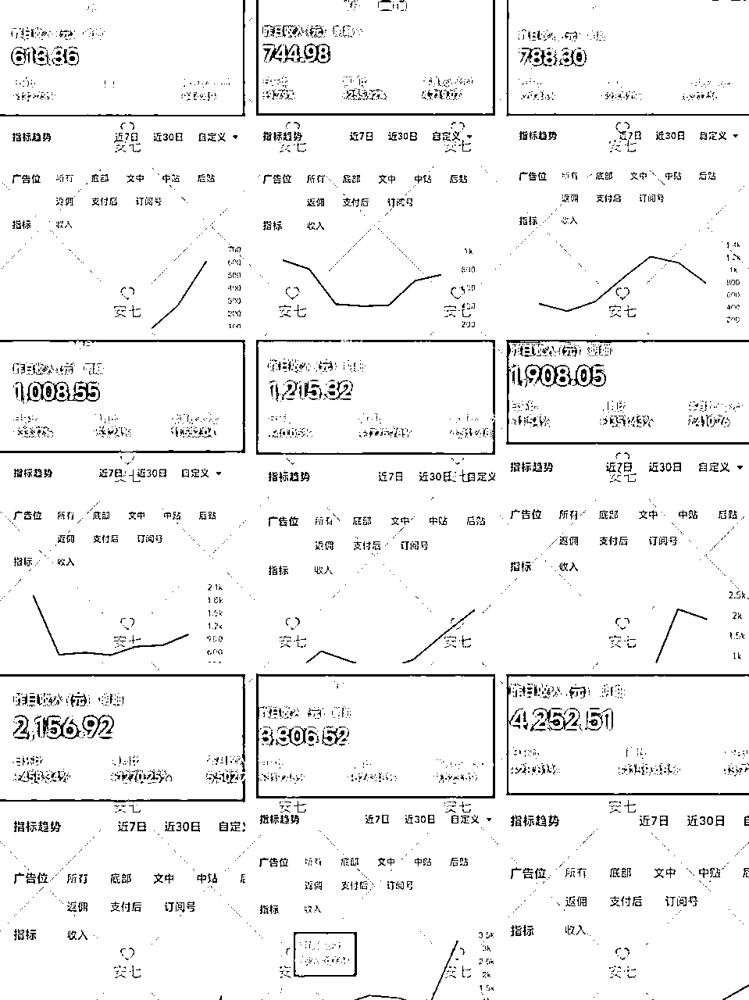
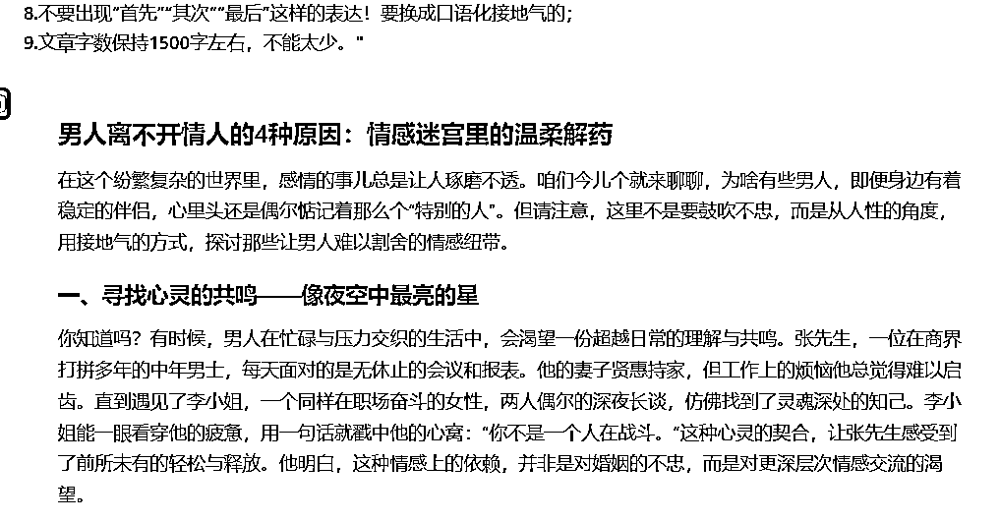
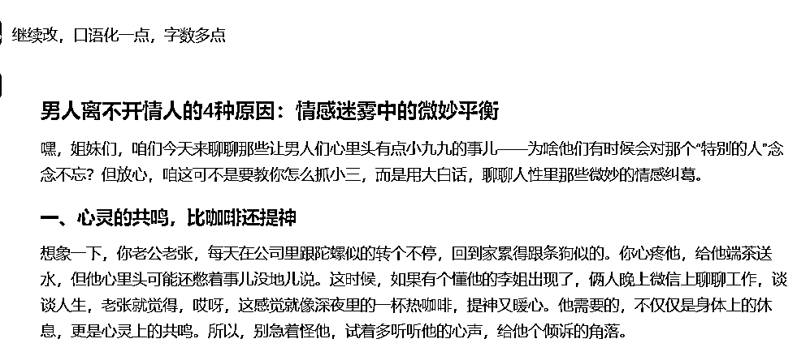
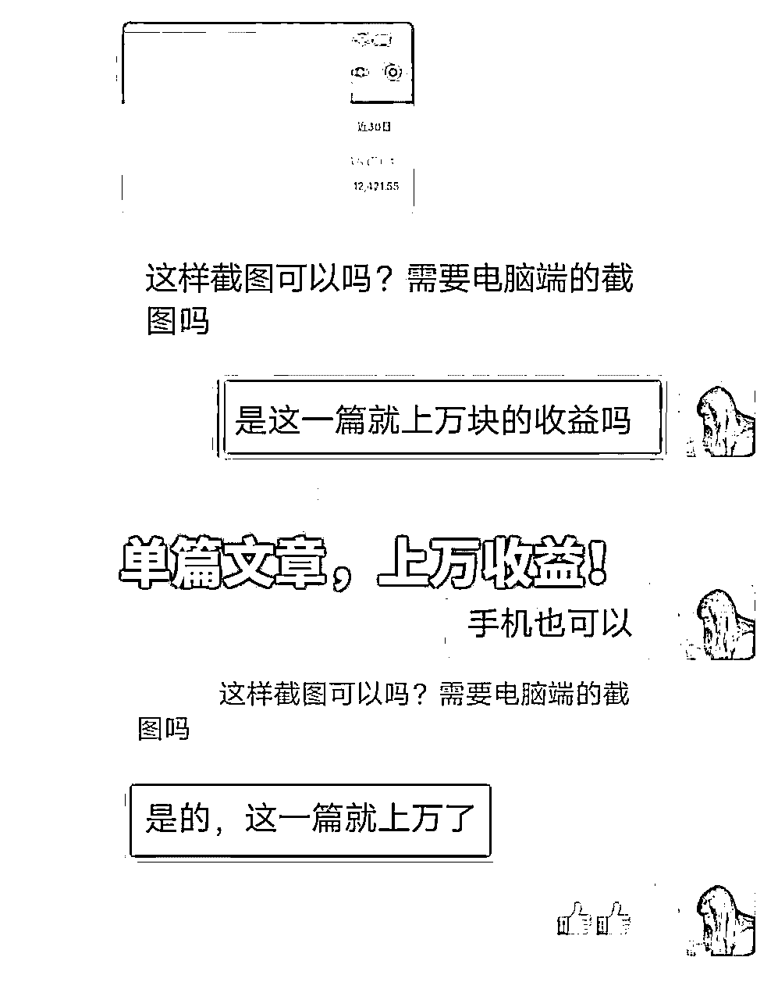
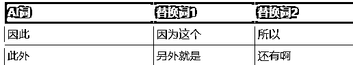

# 【坦白局】：毕业1年，通过公众号爆文项目赚到7位数，公众号爆文还值得做吗？（和晓文老师直播连麦补充）

> 来源：[https://die28mmde0k.feishu.cn/docx/XJTvdddEEosZXhxHnoOcf1CVnFh](https://die28mmde0k.feishu.cn/docx/XJTvdddEEosZXhxHnoOcf1CVnFh)

嗨，你好，我是安七。

在上周7.10生财直播间和晓文老师连麦过程中，有很多伙伴关于“公众号爆文”有很多问题，比如：

·公众号爆文是否值得做？听说现在不好做了啊

·爆过之后就没有什么流量了，号又有限，怎么办

·怎么样提高爆文率啊

·怎么借助AI写得又快又好……

等一系列，对公众号爆文感到疑惑和困扰。

直播间时间有限，不便细说，于是在晓文老师的建议下，结合我的一些玩法和看法，写了这篇帖子，希望对大家有帮助。

【写在前面】：

赚钱这件事，没有标准答案，每个人的成功路径和方法大不相同。

我分享的，可能也存在局限性和片面性，故而大家“取其精华，去其糟粕”就好。

为了方便大家阅读，我把文章大概分为这几个方面：

1/我是如何通过公众号实现“双百万”的？

2/现在公众号爆文还能做吗？

3/我的玩法揭秘

4/新人如果想做公众号，几个注意事项

5/航海圈友共创问题集子及补充

# 1/我是如何通过公众号实现“双百万”的？

之前写过一篇9000+字的文章，里面详细记录了我是如何从刚毕业没有找到方向、尝试了不同的项目、确定入手公众号爆文、1年时间蜕变……一系列内容。

文章在这里，就不赘述了：

直播间有伙伴发出疑惑：做公众号爆文，有这么赚钱？一个刚毕业的大学生，居然做到百万？

在这里可以说下，这个百万构成部分，主要是3大部分：

1.  我做“公众号爆文搭子”项目的收益

1.  流量主收益分成

1.  自营盘

为了避免有销售产品的嫌疑，具体项目不展开来说啦，

但是可以给到一个数据：光是1，我一个人便可以做到一个月12W业绩。

前两天也去见了一位做跨境的兄弟，他说了个故事，我印象比较深：

他刚开始做跨境的时候，从他姐姐（在跨境公司上班）选的一堆品当中选品，

其中有一个品，他姐姐看不上，也建议他不要去做。

结果就是这个被嫌弃的品，他做出来几十个的利润，之前不开张，开张吃半年。

他就跟我说：“很神奇，同一个项目，同一个品，到不同人手里，会有不一样的命运”。

其实公众号爆文也是一样的，除了运气外，想在这个门槛低的事上做到比较大的成绩，背后要付出很多东西。

但往往这些东西，是没有在人前展示的，所以我们看别人取得成绩的时候，总会有种“哇，真幸运”、“哇，天生厉害”的错觉。

# 2/现在公众号爆文还能做吗？

晓文老师在直播间问：“你是怎么看，公众号爆文这个项目的？”

我说，我觉得还可以做，

“为什么”？帅我一脸的晓文老师有点好奇。

浅分享一个点：

这个其实可以说是战略选择的问题，有人觉得不行，有人觉得行，

就跟有人觉得房地产不行，有人觉得房地产行是一样的，

那就看有人能不能从这个事情上挖掘到对自己有利的，可以实现商业价值的东西。

什么时候都有人觉得生意不好做，什么时候都有人觉得生意好做，

我们觉得这个事儿还行，除非腾讯倒闭了，除非张小龙不搞了，除非文字从这个世界消失了。

但事实上，短视频、长视频、播客、文字，哪个都有自己的一席之地。

话是这样说，有没有什么实际支撑来证明？

可以给大家看下，这段时间我这边收到的部分公众号数据报喜：

这个东西是我实实在在干出来的，没有实践就没有发言权。

躬身入局的人，永远比站在岸上的人更有体感。

另外，平台对好的内容依然是有需求和渴望的，它希望这个生态的良性循环的

所以，最核心的其实还是：做，做好内容。

AI永远只是工具，公众号爆文依然未来可期。

# 3/我的公众号爆文玩法

除了自营，我手里还有几百个搭子的号，这么多号，我一个人是怎么写、怎么运营、怎么管理的？

每次组线下局，听说我是做公众号爆文矩阵的，手里有这么多号的时候，很多圈友会“哇”的一下

会很好奇：“这么多个号，你怎么写得过来？”

我：“用AI呀”

“我基本上就是，

针对某个领域，写某个领域专属的提示词

然后，把标题填充进入提示词当中，让AI根据完整的提示词去写文章。”

ta：“可是平台不是打击AI吗？”

是的，如你所见，单纯AI出品的内容，已经越来越不行了。

公众号平台可以说是众多文字平台当中，对AI包容度很高的一个了，但哪怕是这样，单纯AI也是不行的。

想赚平台的钱，就要顺应平台规律，不要跟平台对抗。

好，回答几个大家很关心的问题：

## ①用AI写，不怕被平台检测出来吗？

不怎么担心。因为我们会加入人工润色。

而且，和传统的用AI不一样，我们团队并不是简单把10W+爆文丢给AI工具、然后告诉它模仿这个生成一篇新的文章

这个不叫原创，叫洗稿。

平台是不允许的，虽然偶尔也有漏网之鱼，但是长期肯定是不利于你的。

我们是：

针对某个领域，写某个领域专属的提示词，提示词尽可能完善和详细，

然后，把标题填充进入提示词当中，让AI根据完整的提示词去写文章。

可以给大家看下，标题填充进入提示词，完整的要求给到AI后

它生成的其中一些内容（演示）：

这个时候，它生成的内容只能满足我60%的期待，

和大家分享一句，我自己也在用的超简单的优化提示词：继续改，口语化一点，字数多点

这个时候，已经满足了70%~80%，剩下的，就是自己手动改改

所以，提示词很重要。

如果你提示词设计的好，基本可以满足60%甚至更高的期待。

## ②你这么多号，IP分离怎么做？

emm，和大家想的不一样，我不用怎么关注这个问题。

因为我只需要把稿子给到对方，对方去简单排下版发布就OK。

这个问题，要想解决也有办法，考验“搜商”的时候到了——生财里面有，挖一挖，找一找

或者B站、小红书……

## ③你一个人写多少个号？

“这么多号，就算有AI辅助，也是需要人工的呀”

是的，尤其我对文章质量还是有点要求和洁癖在的，必须人手动改改。

目前我们是跑通了爆文自动化的流程，从爆文标题抓取到自动化写文，都有AI工具帮忙解决。

之前没有跑通自动化的时候，除了用AI写文，其他流程是人工。

一个人一天1-3小时，大概写10-20篇（跟个人熟练程度有关），我养了十多个小助理，每个月支出都不少

后来跑通自动化写文，可以做到同样的时间，效率翻3倍

再后来，翻7~10倍。

可以和大家分享个数：

我用3个小助理，可以负责大概200来个号。

其实如果真的非常熟练、网感等各方面都具备了，1~2个人便足够。

# 4/新人如果想做公众号，几个注意事项

其实，生财里面关于公众号爆文的帖子真的很多很多了，

要是想从0-1的，可以去翻翻航海手册

我之前也写过一些很小白的，可以看下：

这里稍微写点不一样的，如果你是纯新手，看了大家的成绩，也想来做公众号，这几点也许能帮到你;

## ①先把航海手册看一遍

里面有很多精华内容，虽然没有被标精华帖，但是对做公众号爆文这个项目来说，超干货啦。

尤其是一些踩坑帖，可以花时间认真看下

## ②挑一个你感兴趣+有流量的领域，先去做

边做边完善，不要等100%会了再行动

其实，你把踩坑帖看的差不多了，就能帮你避免很多坑

也不可能一点错都不犯的，只要不致命就好

其他的，我想了很久，确实没有什么太多想补充的了，很多都已经在航海手册了：

【航海手册】：

https://scys.com/view/docx/RxOqdGqpUo9O2LxiYWacnluFn6g

我觉得，有时候很多东西是“过犹不及”的，太扣细节、太沉浸在细节上，迟迟不行动，不见得是好事。

所以这个环节就只分享2点啦。

# 5/航海圈友共创集子及补充：

为了更好解答大家真实的疑惑，我在23年12月的航海群里面发起了问卷调查

下面是几位圈友的疑惑，这部分我和他们一起共创：

## 圈友 吴较瘦：

目前做了五个公众号，陆陆续续开通的，最短时间刚好一周时间。

有三个老号，目前都是拿克劳德写的生肖类文章，但是流量一直超级差，

其中一个号在第五天的时间有1篇文章1000多，2篇文章900多，后续流量大多都是个位数，偶尔一篇会有几十或上百。

标题一般都是沿用爆文的标题，偶尔会尝试自己改写标题，流量差不多

1.请问在这种情况下，是否要换赛道，还是坚持写生肖类？

2.同一台电脑发五个账号是否会被限流？

3.自己身份证办的号有3个，是否会有影响（好早之前的老号）？

4.如何优化才能提高流量？

我没有用过克劳德写，我一般是国内AI软件，比如Kimi、文心一言，这两个用的多。

但听其他教练反馈，克劳德也很不错。

你说写生肖类，流量一直很差，问的几个问题：

## 1.请问在这种情况下，是否要换赛道，还是坚持写生肖类？

具体情况具体分析，我感觉可以把你的号发给我看下，要看过才好给出比较贴切的建议。

一般对外我是要收费的，但是生财圈友可以免费看2次。

在没有看过你号的情况下，我能给到的可能有帮助的建议是：

### ①不要把3个老号都拿来做生肖的

老号还是不错的，它可以拿来做更有可能性的领域。

投资我们常说“不要把鸡蛋放在同一个篮子里”，老号写公众号爆文也是一样

除非你有很多老号可以尝试，那这个建议可以忽略。

### ②你这3个老号做多久了？

我们之前说，一个号入池的时间在1-90天不等

也有流传的一些说法是：如果你的号写了10多天一直没有起色，可以考虑放弃，起不来

关于入池、写了很久还没有入池，是不是要放弃？

我觉得要见仁见智，不同的人，能接受度不一样。

说下我手里几百个号的情况，大概分这几个情况：

·一直没有起来的，这种比较少

·爆过，然后下滑，跌到个位数，继续写，重新起来的

·写了好几个月没有起来，测了好几个不同的领域，终于起来了

·写了好几个月没有起来，同一个大垂类，不同的细分爆款关键词，起来了，大爆的

·爆过，下滑，比较平稳的

如果按照“写了好久没有起色，要放弃”的说法，那我会有很多号会被扼杀掉

当然，我能熬过一段没有光的时间，

一方面是因为我号多，用数量对抗不确定性，一方面是因为我对自己比较自信、有把握。之前大学当过一段时间公众号编辑，锻炼了一定网感和语感。

还有就是，我能接受一定的不确定性。

但这种不适合大部分人，因为大家手里的号有限，试错次数有限。

如果是这样，如果是我面临这样的情况：

### ③只留1个号测生肖的，留那个之前有过生肖类异常值的

这个号继续写生肖，同时优化内容，模仿爆款标题。

你有提到：“标题一般都是沿用爆文的标题，偶尔会尝试自己改写标题，流量差不多”

这里分享一个小细节：

我一般会模仿爆款标题，但不是100%沿用。

我会在不改动爆款关键词的情况下，把一些数字、用词改了

比如，假设爆款标题是：

“最值得交往一辈子的三个生肖！一个厚道，一个坦诚，一个和善！”

我可能改成：

“最值得交往一生的4大生肖！一个坦诚、一个温和、一个厚道、一个……”

我的改动思路，原来写过，可以点击链接直达：

### ④还有一个点：

其他2个号，可以换领域，如果不想直接换，也可以“二条加测”

二条可以加测下，你比较感兴趣/觉得比较容易爆的领域

这样就相当于多了一次尝试

但要注意，测的二条，不要短期内频繁换领域

不要今天是情感，没起来，明天测职场，没起来，后天测极简……

测一段时间看看，没效果再换，同时生肖类的也可以正常更新，尽可能优化内容

如果确定要换、不测二条，也可以，那就直接换吧。

尽人事，听天命。

## 2.同一台电脑发五个账号是否会被限流？

还好，我觉得影响不大，但尽可能保持 一个浏览器登录一个固定的公众号，分开，不要交织

其实，在不违规的情况下，影响比较大的还是你的领域选择、标题吸睛度、内容质量……

## 3.自己身份证办的号有3个，是否会有影响（好早之前的老号）？

没听说有影响。

多好啊，你是入场比较早的那一波，现在只能1人1身份证1公众号了，你已经有先发优势了。

## 4.如何优化才能提高流量？

其实非常老生常谈、大道至简了。

这个问题的回复，可能很多伙伴都听过，但是不相信，觉得教练们怎么能“篇篇10W+”、“一定有什么独门秘籍”……

不是的。其实很多很牛的人，他们就是：

简单的事情重复做，做很多“无用功”，不走所谓的捷径，踏踏实实，一步一个脚印。

### ①领域选择

这是大前提。

领域选择有几个参考：

·有爆款

——要在有鱼的地方钓鱼，才能有收获

·你感兴趣

——感兴趣，才能坚持，哪怕不出爆款，也写给自己，锻炼了，心态不会那么容易崩

·结合两者，选一个领域

没错，我没有说，一定要去做红海、大家都在做的赛道

小众赛道是突破重围的利刃，我的百万爆款基本都出在蓝海、非常小众的。

我当时在怎么找到的？

刷，漫无目的的刷的过程中，发现一篇比较独特的选题和人群、领域

刷到异常值后，马上去搜这个领域，发现有爆款，可行+感兴趣，就去试

看，刷，这个动作也是“无用功”——你甚至不知道，刷到什么时候、刷到哪个，是有收获的。

但它必不可少。

张哥跟我们分享过一个故事，大意是：

没有下雨的时候就要准备好盆在那里，不然等到大雨下来的时候，你发现你的盆太小了，压根接不住。

### ②标题技巧

前面有分享过，我是怎么改标题的，这里就不赘述了。

但分享一个价值巨大的细节：

你可以在标题上【提前布局】

什么意思？

举个例子，我在6.20多号的时候，就写了一篇文章，讲7.1怎么样怎么样

结果那篇文章大爆，光是点赞都上千，一篇文章就赚了12000+

这就是提前布局，要刻意练习这个意识。

我们也经常能在文案号上面看到，节假日之前，就已经有了有关节假日的文案金句……

一个道理。

### ③内容优化

如果你是AI写文，一些很明显的AI用词，比如

可以做个类似上面的表格，我基本都会要求小助理在人工润色过程中，去积累词汇。

事上练，它不是你凭空能想出来的，

有时候你看别人文章过程中，一眼就能看出是AI写的，也可以把那些AI词记录下来，修改

### ④排版，封面技巧

不知道大家有没有发现，如果是手写的文章，一般排版也很不错

因为这是他们一字一句写下来的，是心血，所以排版的时候，也愿意花心思，有成就感

但是AI生成的，本来对它就没什么感情，只是“任务式”，可能就很潦草

换位思考：如果你是平台，你愿意看哪种？愿意给你的用户推荐哪种？

排版，不一定要雕出花来的那种精美才叫好看，每个人审美也不一样，

但你可以找一个，你平时爱看的、觉得很舒服的排版去模仿就好

和大家分享一个排版公式：

字号16/17

两端缩进16

行间距1.75

字间距1

段后距24（一般默认是24）

两端对齐

不要开头空两格，新媒体的文章跟论文之类还是不一样的。

封面选取小技巧，这里就说一个：

我一般是去小红书上搜动漫类的角色，如果是女性成长类的领域，这种就很合适。

如果是玄学类的领域，一般搜索关键词就是“好运图”“旺自己图”等之类的

跟你写的领域有关

如果不想那么麻烦，就用万能的风景图吧，一张用到底的懒人做法也未尝不可。

注：这种一定要注意，有没有版权风险！

我去小红书搜图的时候，也会看博主首页，是否有写“严禁二改、二创、商用、盗图”……之类的

## 圈友 小丑有殇joker

要展开写够两个广告，还是精简够

一个广告追求完读现在写文字数展开就太长，不容易读完，不展开精简的话只够写出基本情况的，

所以现在不知道应该怎么平衡字数与广告，追求完读还是广告量，

因为没什么爆文，两种方式暂时没有具体数据比较，哪种收入的更高可能性更好，或者爆文几率更高

这个问题很好解决，其实不用纠结。

一般比较合适的字数是1200字左右，不要超过1500，就可以比较好的平衡了

一般900字，就可以有1-2个广告了，前提是你文章中没有任何图片。

广告贴片位置是要求：前后300字

如果你文章配图太多，会把广告位挤没。

至于完读率，跟你的内容是否吸引人有关，这个才是最重要的。

如果内容足够好，一万字，也有很多人会坚持看完，因为他觉得，看完就是赚到，有收获，有这种期待，而不是看了前面300字，觉得“写的啥呀”，那就真不一定看到最后。

没有爆文，你不能只怀疑是不是字数有问题，而是要看综合的。

建议可以看下，我上面回答圈友吴较瘦的问题

## 圈友 海上灵光

AI生成的内容不满意，不知道该怎么写一篇好文章

这个问题太泛了

我有点怀疑，你是不是跟AI聊天的时候也这样问：帮我生成一篇标题是XXX的文章，1500字。

那它给到的，肯定是让人不满意的哦。

由于你给的信息缺乏信息量，所以没办法详细给到你详细的实操建议

感觉这个问题，可能出在口令（提示词）上。

也不知道你用的是什么AI工具，不同的AI工具提示词也不一样。

我一般用文心一言/Kimi，分享下，我自己做提示词的思路吧：

一般我的提示词包含：身份+标题+字数+要求

案例参考：

假设你是一个XXXX的XXX（有多年情感咨询经验的情感博主），请你以“XXX”为标题，写一篇1500字左右的文章。

要求：

1、

2、

3、

4、

5、

细节补充：

如果你想让它写的尽可能真实、有丰富的情感表达，在身份设定那里，可以多给它加持

比如：假设你是一位有着多年情感咨询经验的情感博主，同时你本人也是很擅长谈恋爱、处理情感的，有独属于你的情感、恋爱心得体验

也可以在要求那里，尽可能准确的表达你的需求。

口令没有现成的，要不断调，慢慢优化

## 圈友 零下

教练，之前文章至少有十几个阅读，现在连续好几天0阅读有可能是什么原因导致的呢

有可能：

### ①领域整体流量是下滑的

比如去年9-11月份的时候，名人名言类的整体流量很大很多。后来12月入场写的，明显感觉吃力，再努力，也没有之前那么好做。

### ②文章AI味太重

被识别和检测到了。

## 圈友 金泰宇

1、号入池是否会影响小绿书推荐量

2、小绿书有没有入池的说法

1会，会加多

2有

* * *

写到这里，全文7000字左右。

对我这种不太喜欢露脸、对文字捕捉比较敏感、内心天马行空的人来说，公众号爆文是我做的最顺手的项目。

在和晓文老师直播连麦的过程中，我分享过在做公众号爆文之前，还尝试过的项目，比如：问一问、视频号……

但可能它们都不是我的金钱赛道吧，真正让我“见缝插针”、“快速放大”、“感觉来了”的，还是公众号。

如果你和我一样，写文字写着写着能比较平静、能在书写过程中体会到心流、不太爱露脸，想尝试公众号爆文项目，我觉得是完全没问题的

在做公众号爆文项目，但目前还没有取得太多结果的伙伴，也不用着急

没有人能那么一帆风顺，就像去年我差不多有一两个月的时间都是在摸索、在摸索成功之前，我还花了很长一段时间走出低谷……

你的每一分努力，都在为你的逆天改命积累资本。

一起加油吧！我是安七，我们下次见~

欢迎大家链接，🔗V：LJY15575515912（备注：生财~）