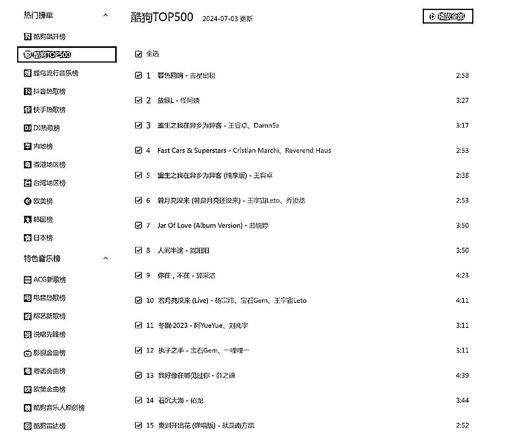
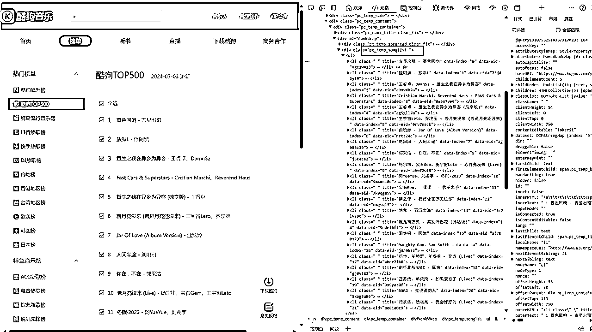

# 分享主题：爬虫实战 - 如何用Python爬虫技术获取酷狗音乐TOP500的歌曲信息

> 来源：[https://k0xx7qf6hkk.feishu.cn/docx/XKVud6pyXol51KxAf2rcNWgGnUh](https://k0xx7qf6hkk.feishu.cn/docx/XKVud6pyXol51KxAf2rcNWgGnUh)

滴滴滴~ 各位晚上好，感谢大家的热烈欢迎，星星点点的代码汇聚成知识的海洋。

我是大刘哥，AI编程航海船员，公众号#刘哥聊技术 主理人，与大家一起携手航行在AI编程航海上。

很荣幸能在生财分享一下自己的学习过程，也很荣幸被大家认可，喜欢我分享的内容。

今晚，我们要一起探索的主题是——如何用Python爬虫技术获取酷狗音乐TOP500的详细信息。



### AI项目实战 - 深入解析《酷狗TOP500歌曲》信息

分享人：[刘哥聊技术] - AI编程航海船员

分享形式：群内图文直播

## 一、项目背景

音乐是生活中不可或缺的调味品，而了解当下流行音乐的动态，更是许多音乐爱好者的兴趣所在。

同时刚好学习了航海中的爬虫技术，想着是否可以通过爬取下酷狗的歌曲信息来作为练习呢？有时候有趣的练习，能提升编程的乐趣，不然面对一堆字母的机器会显得很无聊的。

今晚的分享，将带大家一步步实现一个Python爬虫项目，获取酷狗音乐TOP500的歌曲信息，包括歌曲名称、歌手、排名和时长。

## 二、实现思路与步骤

### 2.1 导入相关库

在Python中，我们首先需要导入一些强大的库来帮助我们完成任务：

*   requests：用于发送网络请求。

*   BeautifulSoup：用于解析HTML页面。

*   csv：用于写入CSV文件，方便存储数据。

*   time：用于控制爬虫的请求频率。

*   io和sys：用于处理标准输出的编码。

```
import csv

import requests  # 用于请求网页获取网页数据
from bs4 import BeautifulSoup  # 用于解析网页数据
import time  # 让程序暂停
import io
import sys
```

### 2.2 编码设置

有时候获取的数据，会显示乱码，为了确保中文字符能够正确显示和处理，我们设置了Python的默认编码：

```
sys.stdout = io.TextIOWrapper(sys.stdout.buffer, encoding='utf-8')
```

### 2.3 用户代理设置

如果不添加这个请求头的话，反爬机制会不返回信息，所以可以设置下简单请求头伪装成浏览器访问，可以提高我们的爬虫在访问网页时的稳定性和成功率：

```
headers = {
    'User-Agent': 'Mozilla/5.0 (Windows NT 6.1; WOW64) AppleWebKit/537.36 (KHTML, like Gecko) Chrome/56.0.2924.87 '
                  'Safari/537.36'
}
```

### 2.4 获取网页信息并输出

定义一个函数get_info，它将负责获取和解析网页，提取我们需要的歌曲信息，并将其保存到CSV文件中：

*   使用requests.get发送请求，并传入我们的headers。

*   使用BeautifulSoup解析响应的文本内容。

*   提取排名、歌曲名称、歌手和时长。

*   将提取的数据写入CSV文件。

网页结构

```

### 酷狗TOP500

                                                                                                2024-07-01 更新
                                                                                                [*播放全部*](javascript:; "播放全部") *全选 

*   **1** 
                                                                                                                                    [暮色回响
                                                                                                                                                     - 吉星出租](https://www.kugou.com/mixsong/agc2wm13.html "吉星出租 - 暮色回响") 
                                                                    [播放](javascript:; "播放")
                                                                            [下载](javascript:; "下载")
                                                                            [分享](javascript:; "分享")
                                                                            2:58 

*   **2** 
                                                                                                                                    [放纵L
                                                                                                                                                     - 怪阿姨](https://www.kugou.com/mixsong/73j41y19.html "怪阿姨 - 放纵L") 
                                                                    [播放](javascript:; "播放")
                                                                            [下载](javascript:; "下载")
                                                                            [分享](javascript:; "分享")
                                                                            3:27 

*   **3** 
                                                                                                                                    [Fast Cars & Superstars
                                                                                                                                                     - Cristian Marchi、Reverend Haus](https://www.kugou.com/mixsong/9m5x7ve9.html "Cristian Marchi、Reverend Haus - Fast Cars & Superstars") 
                                                                    [播放](javascript:; "播放")
                                                                            [下载](javascript:; "下载")
                                                                            [分享](javascript:; "分享")
                                                                            2:53 

*   4 
                                                                                                                                    [重生之我在异乡为异客
                                                                                                                                                     - 王睿卓、Damn5z](https://www.kugou.com/mixsong/a9mv4k7a.html "王睿卓、Damn5z - 重生之我在异乡为异客") 
                                                                    [播放](javascript:; "播放")
                                                                            [下载](javascript:; "下载")
                                                                            [分享](javascript:; "分享")
                                                                            3:17 

*   5 
                                                                                                                                    [Jar Of Love (Album Version)
                                                                                                                                                     - 曲婉婷](https://www.kugou.com/mixsong/nrtz24c.html "曲婉婷 - Jar Of Love (Album Version)") 
                                                                    [播放](javascript:; "播放")
                                                                            [下载](javascript:; "下载")
                                                                            [分享](javascript:; "分享")
                                                                            3:50 

*   6 
                                                                                                                                    [你在，不在
                                                                                                                                                     - 郭采洁](https://www.kugou.com/mixsong/j5t4ce2.html "郭采洁 - 你在，不在") 
                                                                    [播放](javascript:; "播放")
                                                                            [下载](javascript:; "下载")
                                                                            [分享](javascript:; "分享")
                                                                            4:23 

*   7 
                                                                                                                                    [若月亮没来 (若是月亮还没来)
                                                                                                                                                     - 王宇宙Leto、乔浚丞](https://www.kugou.com/mixsong/9rv7necb.html "王宇宙Leto、乔浚丞 - 若月亮没来 (若是月亮还没来)") 
                                                                    [播放](javascript:; "播放")
                                                                            [下载](javascript:; "下载")
                                                                            [分享](javascript:; "分享")
                                                                            2:53 

*   8 
                                                                                                                                    [重生之我在异乡为异客 (纯享版)
                                                                                                                                                     - 王睿卓](https://www.kugou.com/mixsong/ag5gll7a.html "王睿卓 - 重生之我在异乡为异客 (纯享版)") 
                                                                    [播放](javascript:; "播放")
                                                                            [下载](javascript:; "下载")
                                                                            [分享](javascript:; "分享")
                                                                            2:38 

*   9 
                                                                                                                                    [若月亮没来 (Live)
                                                                                                                                                     - 杨宗纬、宝石Gem、王宇宙Leto](https://www.kugou.com/mixsong/ahw72o18.html "杨宗纬、宝石Gem、王宇宙Leto - 若月亮没来 (Live)") 
                                                                    [播放](javascript:; "播放")
                                                                            [下载](javascript:; "下载")
                                                                            [分享](javascript:; "分享")
                                                                            4:11 

*   10 
                                                                                                                                    [人间半途
                                                                                                                                                     - 刘阳阳](https://www.kugou.com/mixsong/agh85i30.html "刘阳阳 - 人间半途") 
                                                                    [播放](javascript:; "播放")
                                                                            [下载](javascript:; "下载")
                                                                            [分享](javascript:; "分享")
                                                                            3:50 

*   11 
                                                                                                                                    [我好像在哪见过你
                                                                                                                                                     - 薛之谦](https://www.kugou.com/mixsong/nmgsq13.html "薛之谦 - 我好像在哪见过你") 
                                                                    [播放](javascript:; "播放")
                                                                            [下载](javascript:; "下载")
                                                                            [分享](javascript:; "分享")
                                                                            4:39 

*   12 
                                                                                                                                    [冬眠·2023
                                                                                                                                                     - 阿YueYue、刘兆宇](https://www.kugou.com/mixsong/9m4msi0c.html "阿YueYue、刘兆宇 - 冬眠·2023") 
                                                                    [播放](javascript:; "播放")
                                                                            [下载](javascript:; "下载")
                                                                            [分享](javascript:; "分享")
                                                                            3:11 

*   13 
                                                                                                                                    [异客 (Live)
                                                                                                                                                     - 杨坤、王赫野、王睿卓](https://www.kugou.com/mixsong/aknr7lb8.html "杨坤、王赫野、王睿卓 - 异客 (Live)") 
                                                                    [播放](javascript:; "播放")
                                                                            [下载](javascript:; "下载")
                                                                            [分享](javascript:; "分享")
                                                                            3:47 

*   14 
                                                                                                                                    [石沉大海
                                                                                                                                                     - 佑龙](https://www.kugou.com/mixsong/7r7lv29c.html "佑龙 - 石沉大海") 
                                                                    [播放](javascript:; "播放")
                                                                            [下载](javascript:; "下载")
                                                                            [分享](javascript:; "分享")
                                                                            3:44 

*   15 
                                                                                                                                    [La La La
                                                                                                                                                     - Naughty Boy、Sam Smith](https://www.kugou.com/mixsong/j3a0h33.html "Naughty Boy、Sam Smith - La La La") 
                                                                    [播放](javascript:; "播放")
                                                                            [下载](javascript:; "下载")
                                                                            [分享](javascript:; "分享")
                                                                            3:40 

*   16 
                                                                                                                                    [离别开出花 (弹唱版)
                                                                                                                                                     - 就是南方凯](https://www.kugou.com/mixsong/9ndelhf2.html "就是南方凯 - 离别开出花 (弹唱版)") 
                                                                    [播放](javascript:; "播放")
                                                                            [下载](javascript:; "下载")
                                                                            [分享](javascript:; "分享")
                                                                            2:52 

*   17 
                                                                                                                                    [原来
                                                                                                                                                     - 南征北战NZBZ](https://www.kugou.com/mixsong/gj0vt82.html "南征北战NZBZ - 原来") 
                                                                    [播放](javascript:; "播放")
                                                                            [下载](javascript:; "下载")
                                                                            [分享](javascript:; "分享")
                                                                            3:53 

*   18 
                                                                                                                                    [暮色回响 (Live)
                                                                                                                                                     - 张碧晨、李承铉](https://www.kugou.com/mixsong/ao6u0676.html "张碧晨、李承铉 - 暮色回响 (Live)") 
                                                                    [播放](javascript:; "播放")
                                                                            [下载](javascript:; "下载")
                                                                            [分享](javascript:; "分享")
                                                                            3:56 

*   19 
                                                                                                                                    [执子之手
                                                                                                                                                     - 宝石Gem、一哩哩一](https://www.kugou.com/mixsong/7k9qga58.html "宝石Gem、一哩哩一 - 执子之手") 
                                                                    [播放](javascript:; "播放")
                                                                            [下载](javascript:; "下载")
                                                                            [分享](javascript:; "分享")
                                                                            3:11 

*   20 
                                                                                                                                    [先说谎的人
                                                                                                                                                     - h3R3](https://www.kugou.com/mixsong/5xog3u80.html "h3R3 - 先说谎的人") 
                                                                    [播放](javascript:; "播放")
                                                                            [下载](javascript:; "下载")
                                                                            [分享](javascript:; "分享")
                                                                            2:48 

*   21 
                                                                                                                                    [如果爱忘了 (Live)
                                                                                                                                                     - 汪苏泷、单依纯](https://www.kugou.com/mixsong/9x9yaz0f.html "汪苏泷、单依纯 - 如果爱忘了 (Live)") 
                                                                    [播放](javascript:; "播放")
                                                                            [下载](javascript:; "下载")
                                                                            [分享](javascript:; "分享")
                                                                            4:05 

*   22 
                                                                                                                                    [小美满
                                                                                                                                                     - 周深](https://www.kugou.com/mixsong/9upjnc1d.html "周深 - 小美满") 
                                                                    [播放](javascript:; "播放")
                                                                            [下载](javascript:; "下载")
                                                                            [分享](javascript:; "分享")
                                                                            3:34 

                                查看更多内容，请下载客户端 [立即下载](https://download.kugou.com/download/kugou_pc)

                                [首页](javascript:void(0) "首页")[上一页](javascript:void(0) "上一页")1[2](javascript:void(0))[3](javascript:void(0))[4](javascript:void(0))[5](javascript:void(0))[下一页](javascript:void(0) "下一页")[尾页](javascript:void(0) "尾页")*  *这个地方大家观察下网页的规律



get_info 函数介绍

```
def get_info(url):
    wb_data = requests.get(url, headers=headers)  # 传入url后进行请求和解析。
    soup = BeautifulSoup(wb_data.text, 'lxml')
    # 歌曲排名
    ranks = soup.select('span.pc_temp_num')
    # 歌曲名称
    titles = soup.select('div.pc_temp_songlist > ul > li > a')
    # 时长
    times = soup.select('span.pc_temp_tips_r > span')

    with open('kugou_top500.csv', 'a', newline='', encoding='utf-8-sig') as csvfile:
        writer = csv.writer(csvfile)

        for rank, title, time in zip(ranks, titles, times):
            # 去除title中的空白字符，包括换行符和制表符
            singer = title.get_text().strip().split('-')[0].strip()
            song = title.get_text().strip().split('-')[-1].strip()

            # 去除song中的换行符和制表符
            song = song.replace('\n', '').replace('\t', '')
            duration = time.get_text().strip()
            rank = rank.get_text().strip()
            data = {
                '排名': rank,
                '歌手': singer,
                '歌曲名称': song,
                '时长': duration
            }
            # print(data)
            # 将数据写入CSV文件
            writer.writerow([rank, singer, song, duration])
            print(f"已保存: {rank}, {singer} - {song}, {duration}")
```

首先，分别获取排名，歌曲，时长存入变量中

```
 # 歌曲排名
    ranks = soup.select('span.pc_temp_num')
    # 歌曲名称
    titles = soup.select('div.pc_temp_songlist > ul > li > a')
    # 时长
    times = soup.select('span.pc_temp_tips_r > span')
```

其次，通过获取的数据进行循环获取标签里面的信息，并且去掉无用的字符，拆分和分隔。

```
# 去除title中的空白字符，包括换行符和制表符
singer = title.get_text().strip().split('-')[0].strip()
song = title.get_text().strip().split('-')[-1].strip()

# 去除song中的换行符和制表符
song = song.replace('\n', '').replace('\t', '')
duration = time.get_text().strip()
rank = rank.get_text().strip()
```

最后，把获取到的数据存入到csv中。

```
data = {
    '排名': rank,
    '歌手': singer,
    '歌曲名称': song,
    '时长': duration
}
# print(data)
# 将数据写入CSV文件
writer.writerow([rank, singer, song, duration])
print(f"已保存: {rank}, {singer} - {song}, {duration}")
```

### 2.5 程序主入口

在程序的主入口部分，我们构造了23个URL（因为酷狗TOP500分布在23个页面上），并逐个调用get_info()函数来获取每个页面的歌曲信息。

```
if __name__ == '__main__':
    urls = ['http://www.kugou.com/yy/rank/home/{}-8888.html'.format(str(i)) for i in range(1, 24)]
    for url in urls:
        get_info(url)
        time.sleep(1)  # 每循环依次，让程序暂停1秒，防止请求网页频率过快而导致爬虫失败
```

## 三、代码解析

让我们来深入看看这段代码是如何工作的：

*   导入库：准备工作，导入所需的Python库。

*   设置编码：确保中文输出不会乱码。

*   用户代理：伪装浏览器，提高爬虫稳定性。

*   get_info函数：

*   发送网络请求，获取网页内容。

*   使用BeautifulSoup解析HTML，提取所需元素。

*   清洗和处理数据，比如去除歌曲名称中的换行符。

*   将数据写入CSV文件，并打印出保存的信息。

## 四、实操演示

接下来，我会演示如何运行这段代码，并展示如何查看结果。你可以在自己的计算机上尝试运行，亲自体验数据抓取的过程。

完整代码

```
# coding:utf-8
# 第一步：导入相关库
import csv

import requests  # 用于请求网页获取网页数据
from bs4 import BeautifulSoup  # 用于解析网页数据
import time  # 让程序暂停
import io
import sys

# 第二步：编码设置
sys.stdout = io.TextIOWrapper(sys.stdout.buffer, encoding='utf-8')  # 改变标准输出的默认编码

# 第三步：用户代理设置，伪装浏览器进行访问，便于爬虫的稳定性
headers = {
    'User-Agent': 'Mozilla/5.0 (Windows NT 6.1; WOW64) AppleWebKit/537.36 (KHTML, like Gecko) Chrome/56.0.2924.87 '
                  'Safari/537.36'
}

# 第四步：用于获取网页信息并输出信息
def get_info(url):
    wb_data = requests.get(url, headers=headers)  # 传入url后进行请求和解析。
    soup = BeautifulSoup(wb_data.text, 'lxml')
    # 歌曲排名
    ranks = soup.select('span.pc_temp_num')
    # 歌曲名称
    titles = soup.select('div.pc_temp_songlist > ul > li > a')
    # 时长
    times = soup.select('span.pc_temp_tips_r > span')

    with open('kugou_top500.csv', 'a', newline='', encoding='utf-8-sig') as csvfile:
        writer = csv.writer(csvfile)

        for rank, title, time in zip(ranks, titles, times):
            # 去除title中的空白字符，包括换行符和制表符
            singer = title.get_text().strip().split('-')[0].strip()
            song = title.get_text().strip().split('-')[-1].strip()

            # 去除song中的换行符和制表符
            song = song.replace('\n', '').replace('\t', '')
            duration = time.get_text().strip()
            rank = rank.get_text().strip()
            data = {
                '排名': rank,
                '歌手': singer,
                '歌曲名称': song,
                '时长': duration
            }
            # print(data)
            # 将数据写入CSV文件
            writer.writerow([rank, singer, song, duration])
            print(f"已保存: {rank}, {singer} - {song}, {duration}")

# 第五步：程序的主入口。通过对网页进行观察，利用列表的推导式构造23个URL，并依次调用get_info()函数
if __name__ == '__main__':
    urls = ['http://www.kugou.com/yy/rank/home/{}-8888.html'.format(str(i)) for i in range(1, 24)]
    for url in urls:
        get_info(url)
        time.sleep(1)  # 每循环依次，让程序暂停1秒，防止请求网页频率过快而导致爬虫失败
```

## 五、后期优化与思考

这个项目虽然基础，但提供了很多优化和拓展的空间：

*   异常处理：让爬虫更加健壮，能够处理网络请求失败等异常情况。

*   用户代理池：使用多个用户代理，进一步模拟浏览器行为。

*   数据可视化：将爬取的数据通过图表展示，提供更直观的分析结果。

## 六、邀请讨论

我相信，通过今晚的分享，大家一定能够有所收获。如果在实操过程中遇到任何问题，或者有任何想法和建议，欢迎在讨论区留言，我们一起探讨。

## 结束语

希望今晚的分享能够帮助大家打开爬虫世界的大门，激发大家对编程和数据探索的兴趣。动手实操是学习编程的最佳方式，期待看到大家的作品和成果。

拍拍我以表信心，让我们一起在编程的海洋中乘风破浪！* 
```