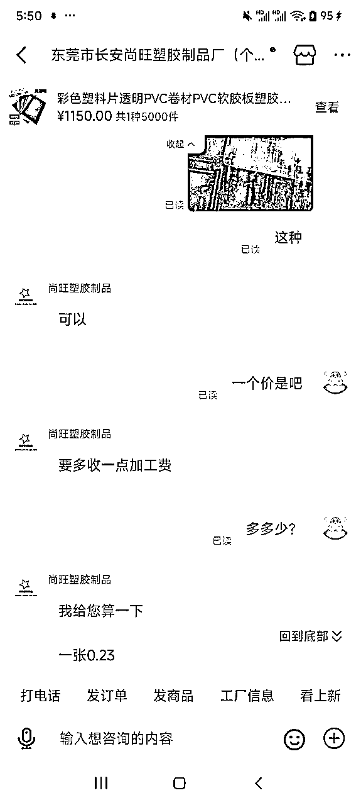

# 全面复盘关于阅读书签这个失败的经历

> 来源：[https://maes23mxkpz.feishu.cn/docx/XwSndGpDsoXBeXxjTB9c3HPynve](https://maes23mxkpz.feishu.cn/docx/XwSndGpDsoXBeXxjTB9c3HPynve)

# 前言：

每当我一个人思考的时候就会有很多话想写，但真正开始写的时候却不知道从何下手。

这是我第一次尝试写作，我认为产出点什么真正的东西是很有必要的。我要写的是一个失败的案例，因为近半年里，我没有任何成功的案例。换言之，我是一个彻头彻尾的的失败者。生财里有跟多的成功案例，有很多很多很厉害的人，所以这里需要一些失败的东西。这篇文章写给那些还没有确定项目的人，希望能通过我的案例给到一些帮助。

自我介绍:我叫友恒,谐音“有恒”，也是希望我做什么事情都能够坚持下去。04年，目前是一名大二预备生。在大一上学期，我通过闲鱼攒下一笔积蓄。闲鱼最好的时候，一个月利润有2w+。那时候主要卖的是羽绒服，一单的利润能达到100左右。后来因为过年了，羽绒服又很吃季节，就没做了。大一下学期里开始随波逐流...于今年4月25日加入了生财有术。

我也许是生财里最底层的人，但我不会甘愿停留于此。

# 正文开始:

这一切的一切都要从加入生财前的那3天体验开始，其中一天我在“中标”板块中看到了一篇关于阅读书签的文章。详情看:https://t.zsxq.com/lw1Ov

我立马去小红书看了一下这个账号，发现是纯个人账号。并且去别的平台寻找类似产品，结果是几乎没有。

他帖子的评论区里几乎全是夸赞这个产品的评论，商品0差评。销量也非常可观。

我意识到这是一个机会，是一个我可以触碰的机会。也正是因为这个，我选择加入生财！

另外我想说一个有趣的事情，这个小红书博主大概是在2023年12月份开始做这个产品。我看到这个风向标是在24年4月份。让我震惊的是，在24年1月份，生财的圈友就有发过这个风向标

这足以说明，风向标的含金量还是很高的___

接下来我要最先解决的就是货源问题，我首先从1688找到类似产品，但代发的价格太高，我想把价格控制到和那个小红书博主一样。

图上是现在1688上的价格，之前是0.8一张，5张4块，加上运费是9块。几乎没得赚，所以我直接否定了这个方案。

那该如何解决呢？我认为这个产品的市场很大很大，所以没想那么多，转手去解决开店铺的问题。随即在淘宝买了一个体户执照。趁着办执照的时间，我又去想如何去解决货源。代发没希望，而且如果要做大就必须自己做产品，所以我决定批量拿货，自己发货。（这时我忽略了很严重的一点，那就是对于一个还在上学的我来说，没有那么多精力来自己发货）

我到处去找货源，首先是去类似产品的地方和老板谈价格。随即否认这个想法，因为即使是批量，利润还是很低。

在寻找货源中，我发现这个产品的材料是pvc版，立刻转换思路，去找生产pvc版的厂家。价格立刻成倍缩小，一张卡片的成本来到0.23。上个商家所说的不可能，让我实现了！

至此这个阅读卡片才具有真正的可行性，我一次要了5000张卡片。

之后我依据卡片的尺寸去定制包装盒,去买包装贴纸...过程也都挺曲折的，这里就不赘述了。更多的产品是在拼多多找的商家

记得当时发生了一件很有趣的事，我所有的费用加起来居然和生财的门票价格一样。

这才只是个开始。我的自我介绍里说过，我是一名大学生，我的这么多东西放在哪里也是个很致命的问题。另外，我的寝室在5楼，把他们从学校门口搬到我的寝室也快要把我累死！所有东西加起来应该有几百斤了....

我想尽一切办法把这些原材料放在各个角落，最后只有包装袋在活动室，其他都在寝室。

产品大概是这样.......

随后我去图书馆拍了很多很多的产品照片

每个照片都进行了优化，调整了亮度以及对比度..

由于之前没有进行过店铺注册，我用ai起了个名字，并设计了一个头像

我自认为很不错

然后我要解决的是邮费。最开始一点头目都没有，问了很多家物流，最便宜的也要8元起。

我也尝试在生财问方法

我很感谢这位老哥能回答我的问题，云仓这个东西我还是第一次听说。 但是，我的城市似乎并没有任何云仓。我只能继续找.....最终让我找到了一个专门做大学生网单的兄弟，并以5元的单价合作。我第一次充单号就充了100个

至此，寄货的渠道解决了。一套书签的成本是2.7，运费5。总成本就是7.7。因为我想着做大了就好了，做大了可以谈运费。所以就硬着头皮继续干！

最初把最主要的阵地放在抖音，因为抖音目前没有一个人在做！！我认为抖音这种短视频平台才更有可能把这个产品推广起来。但是抖店门槛太高，保证金2000交了，也花了1000刷体验分。自然流的效果并不好，几乎不出单。我去找做图书类的博主，可能是我找的不够多的原因（又或者是因为我方法不对）很少有博主回我。倒是有一个博主愿意把我的商品上橱窗，确实带来了成交，不过是个位数。我似乎真的没那么多精力，我感觉很累。

小红书也在时不时出单，让我没想到的是，拼多多才是出单最多的那一个。凭着自然流，每天能出7单左右，多的时候10多单。拼多多有个很烦人的地方就是，他要让你参加各种活动才推流。没有办法，我只能参加。最开始的几单赔本在出，后来以7.7的单价包本出。最后以8.7的单价一单只赚1块钱在出。

前前后后出了有100多单

# 最后

一直截止到6月10几号我便下架了。很大一个原因是因为拼多多这个平台太恶心了，必须要让我参与一个“自动跟价”，这样他就会让我真正赔本！不然就给我限流，一单都出不掉的那种。还有一个原因就是那段时间我们在备考期末，精力会不集中。后来我陆续把抖店和小红书的产品都下架了，这个项目到此结束，我连本钱都没赚回来。

# 总结

一个很根本的原因是，这个产品的客单价太低，利润率太低，我们这种个人卖家很难能有个好的结果。但是对于我一个自发货的学生来说，优点是总成本不算特别高。

# 希望破圈

我大一上学期在闲鱼留下了3w的积蓄，目前只有2w出头了。回顾最近这4个月，一时无成。我不认为我是一个废人，我应该还是有一些执行力，只是很多时间是在孤军奋战。我希望和更多的生财的圈友链接起来，我希望有一起努力的伙伴。也希望生财里和我境遇差不多的人能找到我，我们一起谈想法，一起奋斗。

这一篇文章不知是分析我失败的原因，也有很多具体解决问题的方法。我认为这种项目里问题的具体解决方法是很重要的，很多教程都是侃侃而谈，遇到容易出现问题的地方就一带而过。这篇文章真正记录了我的经历的从头到尾,希望帮到我自己的同时，也能帮到那个正在努力的你！