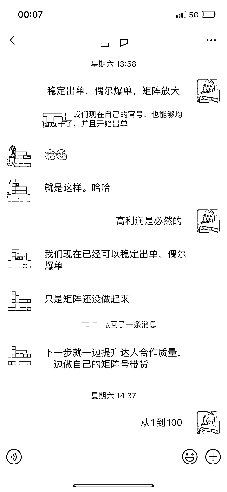
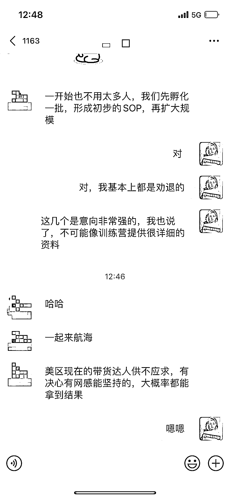
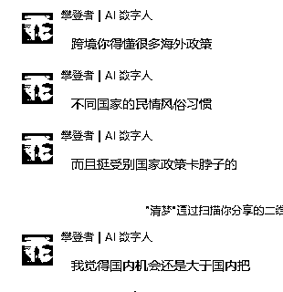
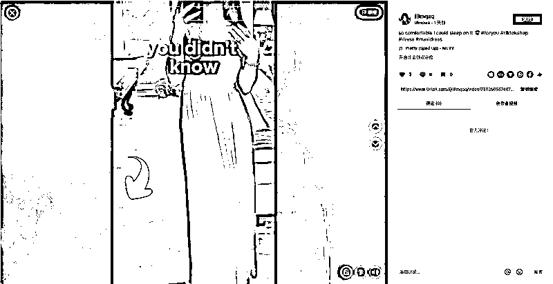
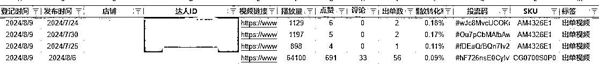
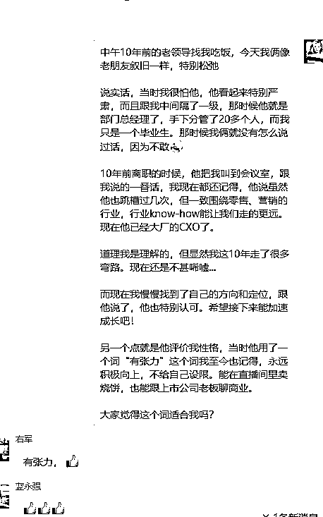

# 稳定出单，偶尔爆单

> 原文：[`www.yuque.com/for_lazy/zhoubao/hkgkw2dnwdvwe13v`](https://www.yuque.com/for_lazy/zhoubao/hkgkw2dnwdvwe13v)

## (30 赞)稳定出单，偶尔爆单

作者： 旋子

日期：2024-08-21

**大家好，我是旋子。视频号头部玩家，近半年 300 万 gmv，100 多个账号，搭过 30 多个直播间，也帮助过 100 多个视频号新人走出第一步！**

今天我和大家讲一下近期的一个新项目，利润很高，但对大家的自律性和设备要求很高。

这是我最近看到的、实践的一个非常大的**确定性风口，**可能是我们这代人接下来 10 年的翻盘机会。

从小了说【视频号】至少能做 2 年，

往大点说【内容电商】的红利最少 3 年，

再往大点说【流量变现】的红利最少 10 年。

最近看到的机会就是 tk 带货

目前对于个体来说，TK 门槛还是比较高的，但换个角度同样也能阻隔很多对手，下午跟攀登者也探讨了这个问题。

但我觉得，海外政策，不是我们应该考虑的，因为我们的体量还不足以受就这些影响，已经足够过的很好了。

很多人不看好美区 tk，但实际上，我一直说的，内容电商的底层逻辑是相通的，之后 Q4，欧洲，中东也会陆续开放。

这就说明如果美区因为地缘政治而导致发展受限了，我们转战其他的市场也是完全 OK 的。

我们这边有三个单店 GMV 都已经超过 2000 了，偶尔爆单，一天可以到 2 万美金。

顺着攀登者的对于政治的分析，支撑国家 GDP 的三驾马车，房地产、外贸，基建，房地产跟基建我都不用说了，国家一定是要大力扶持出口的。

正好我今天中午一起吃饭的领导，也是做了 20 年的营销了，他感觉现在的出海电商相当于 15、16 年的中国电商，至少整个风口还有**10 年**。

我们做电商的人都知道，你只要踩中了一两年加速的增长，基本就财务自由了。

# **1.Tiktok 项目介绍**

## **①了解 TK**

大家如果在 tk 刷一下，可以看到，其实里面的那些达人可以说完全是毫无技巧和水平，很多开着直播就在那唠嗑，但是就这样也能卖，整个平台目前是缺内容的。

不知道刷过的小伙伴有没有看过图中这种视频：

有没有人猜到这种视频是如何变现的？

其实就是达人采用**多个片段混剪+贴图购物**引导，突出强调了现在买价格很划算来促销，这种销售逻辑，看过的伙伴都知道。

这个视频的制作成本也不高，主要靠搬运混剪别人的火的视频后发布到自己账号，光是靠这种手段就可以养活一个账号了，而且也不需要寄样品，没有什么顾虑。

而且这个账号就是中国人运营的，运营所用的营销手段和逻辑在国内是差不多的，很容易复制。

就比如我们现在自己的官号，也能够均播过千了，并且开始出单。

## **②TK 红利**

可见直播的推流非常猛，只要你想做，尤其是在美国的，基本上都能做起来。

再说价格的红利，大家都知道我们中国是生产大国，我 11 年前在美国实习过，在那里一件泳衣 20 美金，而国内淘宝上只要 20 人民币。

我之前做的假发，在国内卖 150 人民币，在美国可以卖到 100 多美金，而我们国内早就普及的五六十块钱的充电宝，他们没见过，愿意花 30 刀找我们买。

攀登者说的非常对，这个项目确实对很多人是有门槛，要懂得很多的海外政策，不过我们达人其实并不需要知道太多，反倒是那些商家需要去了解。

很多人反而都卡在账号注册这一步，前两天带我一个私教的同学开始做，他也是破局的合伙人，才两天就已经起了两个号了。

难对我们这些有经验的反而是优势，越难越能帮我们阻隔掉对手。

而且我们还会换脸技术，还会 AI 视频，还会数字人。对海外那些做视频的达人来说，是**降维打击**。

# **2.稳定出单，偶尔爆单，矩阵放大**

目前我们已经达成出单到爆单的稳定规律了，但是想要扩大利润，就要在矩阵这下很大功夫，所以我们目前的目标是：**①提升达人合作质量②做自己的矩阵号带货。**

我们这个项目从达人端和商家端都打通了，主要做的是女装带货，然后现在整个 TK 美国的生态是很缺达人的，需求量非常大。

你这个达人号培养起来之后，也可以去带其他品牌商的货，甚至可以去教海外的达人怎么做 tk 出课程，一起成立海外的 mcn。

目前这个项目是发展前期，如果加入并坚持做的话，应该是能够吃到一波红利的，后续你也可以根据自己的资源去开展更多的 tk 业务，这都是有非常大商业潜能去挖掘。

尤其是目前美国 tk 直播不仅处于红利期，推流很猛，而且很多美国人不具备直播的能力，竞争力小，属于蓝海项目，可以说只要勤劳一点去播就有出单。

在美国的小伙伴一定一定要抓住机会！！！

如果是国内特别特别想做的同学也可以加入，付出更多学习来弥补对网络、设备的要求。

# **3.须知事项**

## **①积极主动，持之以恒**

这个项目我们已经有 3 个稳定的号，每天单号**2000GMV+**，偶尔爆单**10000+。**

*用他的话来说，只要现在你是有决心去做，愿意去付出，想在里面做点事儿的，是一定能拿到结果的，所以决心和投入度至关重要！*

## **②把握机遇，利用资源**

这个项目之所以现在竞争力不强，是很多人都卡在了最关键的一环：**网络环境和账号注册以及报税问题。**

资金投入前期和国内达人带货一样，没有什么需要投钱的，主要是投入时间来做视频，所以能来的一定要留住时间做视频，达成量产，如果暂时没这个精力，可以等之后的通知。

账号、网络和报税都有相应的解决方法，说白了就是利用**信息差和资源差**比别人先一步赚钱。

当务之急是抓住风口做出成绩最重要！！！

下午跟大家分享了一段感悟，总结来说就是：**基本盘+不设限**，军哥也补充了：基本盘决定起点厚度，不设限决定起飞高度。

如今的 tk 项目也是如此，希望大家能抓紧风口赚一笔。

* * *

评论区：

追梦人~ : 如何上车？
旋子 : xuan626

* * *