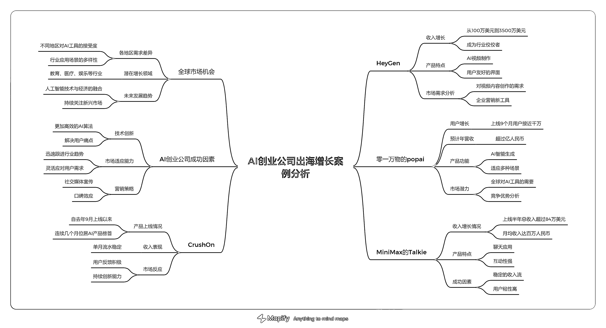
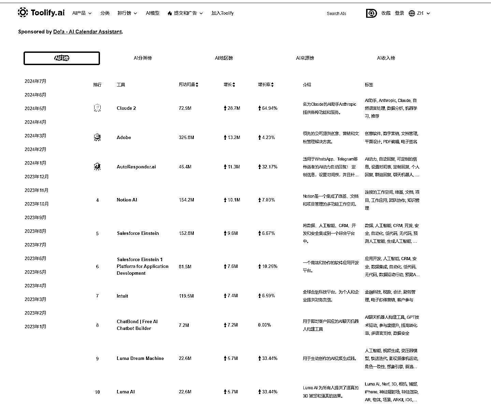

# AI 出海营销;百万访问量 AI 产品 TikTok 广告营销情况

> 原文：[`www.yuque.com/for_lazy/zhoubao/vnfpuogbq5fbpeo3`](https://www.yuque.com/for_lazy/zhoubao/vnfpuogbq5fbpeo3)

## (10 赞)AI 出海营销;百万访问量 AI 产品 TikTok 广告营销情况

作者： 梁小伟

日期：2024-08-20

当下，中国 AI 企业正如潮水般涌向全球市场，这不仅是“出海”，更是“全球化”时代热潮。出海后的 AI，想占据市场，除了靠本身的产品力，更重要的是“走出去”，让世界人民使用你的产品。

### **大获成功：不止是运气。**

一些 AI 创业公司在出海后迅速实现了令人瞩目的增长。例如，AI 视频明星公司 HeyGen 在短短一年内将收入从 100 万美元增长到了 3500 万美元，成为了行业中的佼佼者。零一万物的 AI 产品 popai 海外上线 9 个月后，用户数量接近千万，预计年营收过亿人民币。这些令人惊叹的增长不仅展示了 AI 技术的潜力，也证明了全球市场对 AI 工具的巨大需求。

另一个成功的例子是 MiniMax 的 Talkie，这款应用在上线后的短短半年内，总收入已超 84 万美元，月均收入达百万人民币。这样稳定的收入流对于一个新兴的 AI 工具来说，无疑是巨大的成功。再看 CrushOn，这款产品自去年 9 月上线以来，连续几个月位居 AI 产品榜首，单月流水能达到 6 万美元。Fotor 更是凭借着 1.5 亿的新粉丝实现了早期盈利

当然，中国 AI 产品在海外市场的成功并非偶然。一夜之间吸引了成百上千万的用户。这些成功背后，是深思熟虑的市场定位和精准的广告投放 。这些公司不仅熟练地使用全球社交媒体平台，还深谙如何利用这些平台的算法让自己的产品“出圈”。

总的来说，出海背后的逻辑：更多流量、更好技术、更快盈利

全球 AI 排行月榜

文章内容涉及视频广告解析，详情各位星友移步文章查看

[`za6kyadmdr.feishu.cn/docx/DkU1d4iLboHRmzxvuOkc9mTLn0c?from=from_copylink`](https://za6kyadmdr.feishu.cn/docx/DkU1d4iLboHRmzxvuOkc9mTLn0c?from=from_copylink)

* * *

评论区：

来颗苹果咩 : 飞书权限开成互联网可编辑了[破涕为笑]
梁小伟 : ^_，谢谢提醒呀

* * *