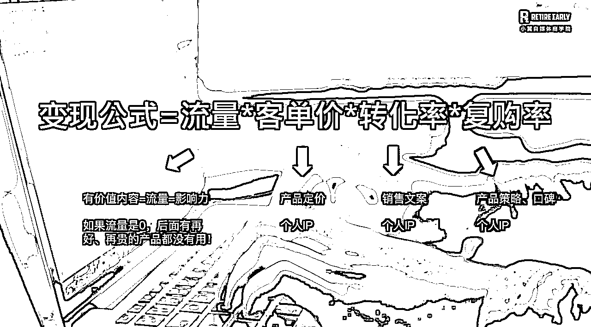

# 小红书 1 年涨粉 10w+，30 岁后不上班，变现 80W，一个普通女孩的十年退休之路

> 原文：[`www.yuque.com/for_lazy/zhoubao/dn7lu4uog5ywi3un`](https://www.yuque.com/for_lazy/zhoubao/dn7lu4uog5ywi3un)

## (32 赞)小红书 1 年涨粉 10w+，30 岁后不上班，变现 80W，一个普通女孩的十年退休之路

作者： 丁小翼

日期：2024-08-22

你好哇， 我是小翼。

自从去年 7 月辞职，上个月刚好是我**不上班一周年**。

**30 岁后的我，靠一个人做自媒体，累计变现了 80W。**

（上个月单个号营收）

今天想跟大家聊聊，我是怎么走过来的，

**一个没资源没背景的普通女生，如何实现十年早日退休？**

先说声抱歉，我这里没有什么轻松年入百万的神话，

也没有“惊天地泣鬼神”的爽文逆袭故事，

**每一步，都来自一个普通平凡的个体，真实、踏实的实战经历，**

相信能给同样价值观、并想要实现早日退休的你，一点触动和启发。

## **01 我的觉醒之路：**

## **一个没有父母托举的女生 29 岁觉醒**

**“一个没有父母托举的女孩，觉醒年纪一般在 25 岁之后，**

**如果这几年能看清事物的本质，摸清运行逻辑的重点，30 岁就会是第二个人生起点。”**

这句话，简直就是我的人生写照。

作为一个超普通家庭出来的女孩，18 岁上大学，还是我第一次出省。

（去年故地重游了母校）

大学毕业后，家里也没有任何助我就业的资源，我只身一人来上海打拼。

我也曾天真地对职场充满向往，毕业前，凭借努力获得 500 强外企培训生的 offer，

一年后，我认清自己并不需要光鲜亮丽的 title，于是力排众议辞职，去更能发挥我才能的创业公司。

就这样一路升级打怪，从市场营销师，到市场经理，再到市场总监。角色从执行者，变成管理者。

但是在 29 岁，我感到前所未有的焦虑，我觉得事情隐约有些不对劲，仿佛所有人都按照既定的轨道，

**上学-上班-买房-结婚-生娃-工作到 65 岁，这种老鼠跑圈不断循环的模式，并不是我想要的生活。**

即使我的职级在上升，我的薪资翻了 5 倍，我仍然感受到了一种不自由、一种命运掌握在别人手上的感觉。

在那段时间，我看了非常多的书，花了很长时间去思考，我到底想要什么。

有两本书对我影响很大，一本是《有限与无限的游戏》，另一本是《认知觉醒》，它们让我在 29 岁的年纪，幡然醒悟过来：

**1、从小到大，我们都在玩一种有限游戏。一种有明显边界的、结局可以望到头的、你赢我就输的游戏。**

比如读书是为了好成绩，好成绩是为了好大学，好大学是为了好工作，好工作是为了好找对象......

在这样的游戏中，手段、过程是不重要的，结果才是最重要的。

我并不想玩这样的游戏，与此对应的，还有一种无限游戏，整个人生，就是成为更好自己的无限游戏。

2、之前的我，看似上进，但想做的事很多，大多浅尝辄止；业余时间也会读书、学习，但这些都没有给生活带来本质改变。

为什么呢？**因为我所做的只是最表层的学习，学了却没有真正去践行，没想好用来干嘛，那其实就是根本没学会。**

我的工作虽然收入在上涨，但收入模式单一，并不能跳出老鼠出圈的循环。

小富即安的状态，反而限制了我的发展。我并没有真正为自己活过，做出主动跳出循环的选择。

这些新的觉知，让我彻底醒悟过来，我想换一种活法，想要玩无限游戏，也是在那时，确定了想要“40 岁退休”的目标。

可能有人好奇，为什么定在了 40 岁？

**一个很简单的道理：人这一辈子也就差不多能活 70、80 岁。**

**过了 40 岁，你的人生进度条已经走完一半了。**

剩下的半辈子，你还要一直出卖自己的时间去上班吗？

反正我是不想。

因为我还有太多的事情想做，太多的地方没去。

**我理解的早日退休，追求的并不是躺平，而是不再为了钱去上班。**

30-40 岁，我计划用是十年时间，积攒本金，打造好被动收入管道。

40 岁之后，我另有安排，**人生的可能性有很多，前提是让自己有得选。**

## **02 我的自媒体之路：**

## **小红书给了我实现十年退休的希望**

定下了目标后，如何实现呢？

首先打工是不可能实现的，一份时间只能出售一次，一旦停止了工作，收入也就停止了。

那什么能够让自己一份时间，被出售多次呢？

《纳瓦尔宝典》里说，**如果你想要不靠运气，5-10 年变得富有又幸福，路径只有两个：**

**一种是靠资产（公司、股票、实业），另一种是靠代码或媒体，获得被动收入。**

那资产不是每个人说有就有，代码我也不会，做自媒体，算是普通人唯一的选择了。

对于我们这种没有父母托举的东亚女孩来说，做自媒体不需要任何人脉和资源，

我一个人就能低成本起步，低成本试错，没有实体创业那么复杂，只要掌握了方法，就能做出一番成绩。

于是，我又拾起了荒废已久的小红书，重新注册了一个号。

我从 0 开始做小红书，靠自己一个人持续更新 1 年，刚好涨粉 10W：

就在这 1 年，我的小红书广告报价，在 1 年时间里翻了 20 倍。

这听起来是不是很夸张？

自媒体就是这么神奇，一开始你可能会觉得：付出这么多，才挣几百块钱，看不上，还不如我打工一天挣得多。

**但坚持一年你再看看，它的指数增长和复利效应，让你的作品，睡觉都在被别人观看、都在涨粉，**

如果副业超过了主业，即使你不辞职，上班的底气和安全感，是完全不一样的。

我意识到，做自媒体，就是我在寻找的人生无限游戏呀！

我用我的创作内容作为杠杆，去影响更多人，不用担心赚不到钱。

**在这个时代，流量和影响力就能换钱，而这些资金又能支撑我去更多地体验世界，从而有更好的创作......如此循环。**

我想通了这点之后，瞬间豁然开朗，我发现世界竟然还有这种玩法，不需要再去参与，你赢我输的零和游戏。

如果我持续做十年呢？能否实现早日退休的目标？

答案是肯定的。

总而言之，**在自媒体领域，如果你每天持续输出，积累几年后爆发，这不是运气，是自然规律。**

感谢小红书给的我希望和救赎，让我有底气，30 岁后开启新的人生阶段。

## **03 我的不上班之路：**

## **商业模式升级，让我又一次蜕变**

因为小红书，让我的副业收入持续超过主业，

且我的财务储蓄，已经让我有一笔“3 年以上不工作都没问题”的存款，

于是我在去年 7 月，正式告别职场，不仅是辞职，而是这辈子再也不打算上班了。

这一年来，作为自由职业，**我的商业模式又进行了升级，拓展了多个收入渠道，**

**从 0-1 搭建了自己的产品体系，不再单一只靠小红书广告渠道了。**

而且在这个做的过程中，会有许多新的收入形式冒出来，不仅有了广告收入、还有产品、带货、社群收入等等，

其实这已经是一套业内很成熟的体系，如果你置身局外，可能还停留在“写作是不是靠投稿赚钱”，或者除了广告，不知道还有其他变现形式。

**我相信：什么拯救过你，就拿什么去拯救别人。**

我是做小红书起家的，我自然地开始教别人做小红书，

学员们对课程给出了 5 星好评，有了千赞爆款，实现了千元、万元的变现，

而且还将做小红书的底层能力，迁移到了各平台上。

**说明这不是能力的问题，是认知的问题：**

很多人不相信，这样就能做起来？做起来能有什么用？怎么变现？

因为不重视、没人指点，鼓捣两下又去搞别的了，这样是不可能做起来的。

**自媒体最终的竞争，是商业认知、商业模式的竞争。太多自媒体博主，并不缺少能力，但是缺少商业化思维。**

我将自己实战出来的经验，给到跟我一样想要早日退休的普通人，

在帮到大家的同时，又有收入，就是我今年重点在做的事。

这个时代，90%的人都想「早日退休」，但很少有人会有明确的「退休规划」。

**与其停留在「一夜暴富 」的幻想中，不如跟着小翼一起行动起来，**

传统的「工作到 65 岁退休的模式」并不适合每一个人，

**关于「跳出老鼠跑圈」、「拿回人生主动权」这种愈演愈烈的需求，值得且应该被满足。**

最后我想说，没有人可以一下子变强，因为时间是最大的竞争力；

但所有人都可以一点点变强，因为所有大佬都是这样走过来的；

觉醒之后持续行动、持续搞钱，就能跳出老鼠跑圈，拿回人生主动权。

* * *

评论区：

刘智行 : 作者真的很棒，有被鼓舞到。对作者的一句话感同身受，因为我所做的只是最表层的学习，学了却没有真正去践行，没想好用来干嘛，那其实就是根本没学会。高效率的学习，学了就去实践，不仅是阅读，项目也是如此，这样才会得到质的改变。
阿仁 : 很厉害的经历
大栗子 : 好厉害👍涨粉这么快！怎么做到的啊[色]

* * *