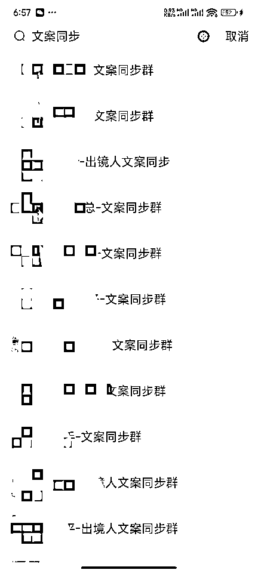
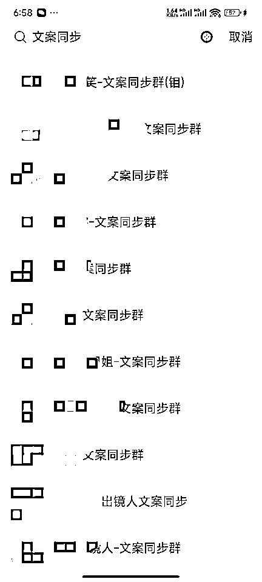
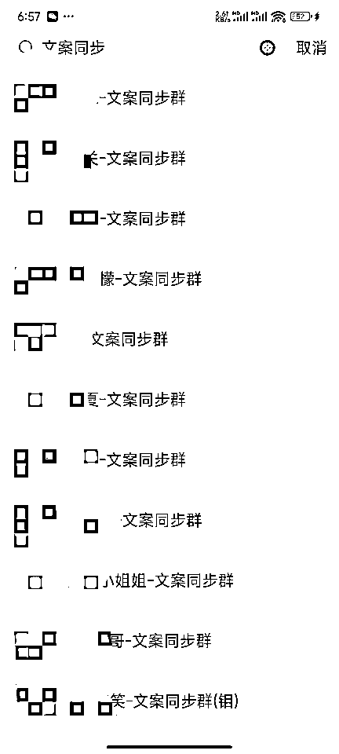

# 千万播放、条条爆款的口播带货视频，是如何实现的？（干货分享）

> 原文：[`www.yuque.com/for_lazy/zhoubao/ag1vai0q1l02bq66`](https://www.yuque.com/for_lazy/zhoubao/ag1vai0q1l02bq66)

## (54 赞)千万播放、条条爆款的口播带货视频，是如何实现的？（干货分享）

作者： 韩商量·有内韩

日期：2024-08-21

本人老韩，入行短视频做的是口播 IP。

今年 4 月入行短视频口播带货，4 月底爆单，5 月开始坚持原创，保持条条爆款，几十万上百万的播放是常态，最高记录是单条视频 12 小时跑了 1500 万+的播放。

如果你想提升口播带货视频的爆率，建议你仔细看完我的文章。我会尽量详细的把真实的爆款逻辑分享给大家。

想要提升爆率，一定要调整认知：

爆款的核心是什么？

大多数爆款的背后逻辑是什么？

怎么才能拍出必爆的口播视频？

第一、爆款的核心是文案。

从我入行开始，我一直强调，文案决定了爆率，和出镜人没有太大关系。

如果真的有点关系的话，就是所谓的表现力，最关键的表现力就是发音吐字和读稿的流畅度。

我开始做口播 IP 的时候，拍出了第一个爆款视频之后，我的团队开始分析我拍视频所在的环境、走路的姿势、穿的衣服等等。

然并卵！

我测试了一下，同一个文案，我坐着躺着跑着走着站着，我在家在天台在公司在车里，我穿黑衣红衣黄衣单衣棉衣......都爆！换我合伙人读了个磕磕绊绊拍出来，也爆！

我几次直播免费分享时也都讲过，爆款的核心在于文案。

可惜，几乎全行业的带货达人都不认同我的话，甚至爆款我自己的团队！

开始，他们宁可去搬运他们理解的爆款，和他们理解的出镜人素材，也不愿意发我拍的带货视频，理由是我的脸不如木头爆。

我勒个去！封建迷信害死人啊！我口播 IP 视频的播放也是过千万级的，我脸怎么了？

结果我团队的小伙伴说，人家是带货脸。

结果就是我使出铁腕手段，强制团队用我拍的视频，然后我的视频爆了。

等到我开始坚持原创，我拍的视频都是自己的账号先发，毫不夸张地讲，我首发的几个账号发几个爆几个，不存在概率问题，就是必爆。然后，我再分发给我的团队，我的团队批量爆单后，才是同行的大量翻拍。

所以，爆款视频的核心就是文案，你能写出爆款的文案，你就能拍出爆款的视频！视频号爆、抖音爆、快手小红书也爆！很长一段时间，快手、小红书上还有不少人搬运我拍的视频在上面带货的。

当然，并不是所有人不信我的话，这个行业还是有人信的，就是当时那些大脸出镜人。因为他们才是打品最前沿，他们自测爆单后才会分发素材，他们非常清楚爆款视频的核心就是文案。

所以，当时，口播行业内的几十个知名出镜人，都来找我拿文案授权。

↓↓↓↓↓

直到视频号出镜人身份验证几乎无法通过的情况出现后，这种认脸不认文案的乱局才结束，大家这才发现文案好重要。

备注：有新手朋友可能不理解出镜人身份验证，这是视频号上做口播经常会触发的一个机制，就是一张人脸高频次出现在多个账号后，会触发一个出镜人身份验证，为了防止有人搬运侵犯出镜人的肖像权。

第二，大多数爆款背后的真实逻辑其实是尸骨累累的账号堆砌出来的概率！

如果你带货打品很少爆单，甚至是没爆单，大多数情况下就是因为你号太少，或者是你并不是那个幸运儿！

我在拍原创视频之前，也是搬运所谓爆款的文案拍摄，自己拿号堆爆了之后，有几个社群也开始剪我拍的视频，我不完全统计，大约有 1790 多条剪我视频的报备记录，如果是木头这种老牌出镜人，剪他视频的账号只能是更多！

口播行业的真实是，所谓爆款出镜人的背后，其实是大量追随者堆出来的名气。

如果你没有能力分辨一个素材的文案是否符合高爆率，那么你不爆是正常的，爆单是幸运的。

所以，想要拍出必爆的口播带货视频，需要做到如下几点：

1、有分辨爆款文案的能力！

千篇一律的口水文案，不是不爆，而是几年前就已经用烂的结构，被无限翻拍，当然爆率低了。行业在发展，iPhone 刚出来的时候，愤怒的小鸟都可以爆火，因为没得选择。抖音视频号发展到现在，创作者的水平越来越高，还停留在几年前的口水文层次怎么行？

所以，一个所谓的爆款摆在你面前，你要有能力判断出这个文案或者脚本是高爆率还是低爆率？下一篇文章，我会给大家详细讲讲如何分辨爆款文案！

2、要有出镜能力！

出镜人不重要，但是也不是完全不重要，你最起码得突破自己的羞耻心勇于出镜！表情可以不自然，但是吐字要清楚、语速平稳、断句节奏必须要流畅！

这一点，以后我会重点分享一下，如何提升自己的口播能力，今天就不详细展开了。

如果你实在没有出镜欲望，就使用数字人。早在出镜人身份验证还能 100%通过的时候，我就做过免费分享，鼓励大家自己出镜，教大家使用数字人分身。结果现在冒出好些个人拿这个数字人当课程卖，而且还卖的不便宜。

其实这数字人，10 分钟就能学会的事，没必要花那个冤枉钱。

记住，赚钱的永远不是技术，而是项目本身！学会剪映有什么用？学会配音有什么用？学会数字人有什么用？最简单的栗子，你学会开车，你至少也得做开出租车这个项目的工作才能赚钱吧？

学技术的动力只能是为了做一个能赚钱的项目去提升自己的能力，不是为了技术而技术！

另外，关于数字人这个问题，AIGC 或许是未来，但是不会成为视频号、抖音的主流，因为视频号抖音是一个完善的 UGC 平台，具体原因我以后写贴子再讲。

所以，可以用数字人，但是不要依赖数字人。

3、道具准备好！

工欲善其事必先利其器，带货还是讲究个人货场，哪怕只是个口播短视频你也得有人设概念啊。至少你的衣服得应景，要和你的内容契合度高。

4、剪辑装修要用心！

我发现很多新手甚至是老手，剪视频的时候根本就不看内容，短视频的装修是解决场景要素，剪辑之前耐心把文案内容理解好。

5、创作力！

一定要提升自己的创作力，原创文案不一定是爆款，但是爆款一定是因为原创。

我之所以一直保持必爆，不在于我的产量，而是在于我的质量。

2024 年 5 月开始，截止到现在，我不过写了几个文案而已，包括：

我太爷爷的牙粉，小满节气的四龙聚首未满时，端午节的端午遇青龙，夏至的一天短一线，六月初六的天贶节，立秋的下山虎，处暑的北斗指西南，中元节的中元鬼门开。内容没有一个重复的，没有一个文案没爆的，如今大量口水文里面还在引用我这些文案的一些爆点。

这是最近的爆款，中原鬼门开。

↓↓↓↓↓↓

这里的爆不单单是视频号，搬抖音快手上也爆。

你要说你不用创作，你翻拍人家的也能爆，那就是抬杠了，人家不就是原创吗？

以后我会单独开几篇主题，重点讲一下拆解爆款文案和如何撰写爆款文案。

有意愿在口播带货领域有所作为的朋友，可以关注我后续主题。

未完待续~

附：问个问题，这个插图片只能用网页版的吗？这可太麻烦了：（

* * *

评论区：

废柴战歌 : 使用飞书文档，编辑阅读更友好
韩商量·有内韩 : 我第一次用知识星球，为生财来的
废柴战歌 : [强][强][强]感谢分享，期待后续
Mr_Zhang : 写的几篇文章都看了，很不错，希望您后续继续分享爆款文案（同在深圳，可以加入生财深圳群，同城交流）
韩商量·有内韩 : 好啊好啊，不胜荣幸[鼓掌]怎么加？
Mr_Zhang : 深圳群主是 ，你加她，看看咋入群，我就是她拉入深圳群的。
冬日暖阳 : 我翻拍的文案不能爆
韩商量·有内韩 : 因素颇多

* * *