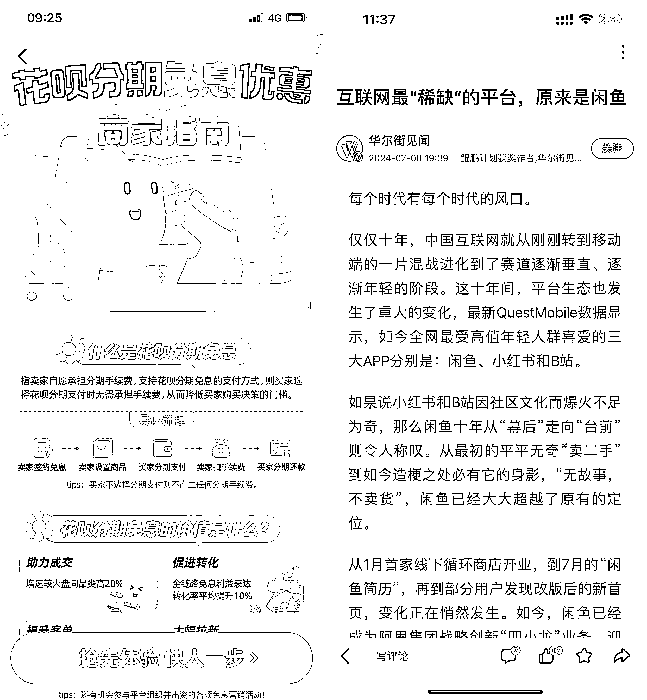
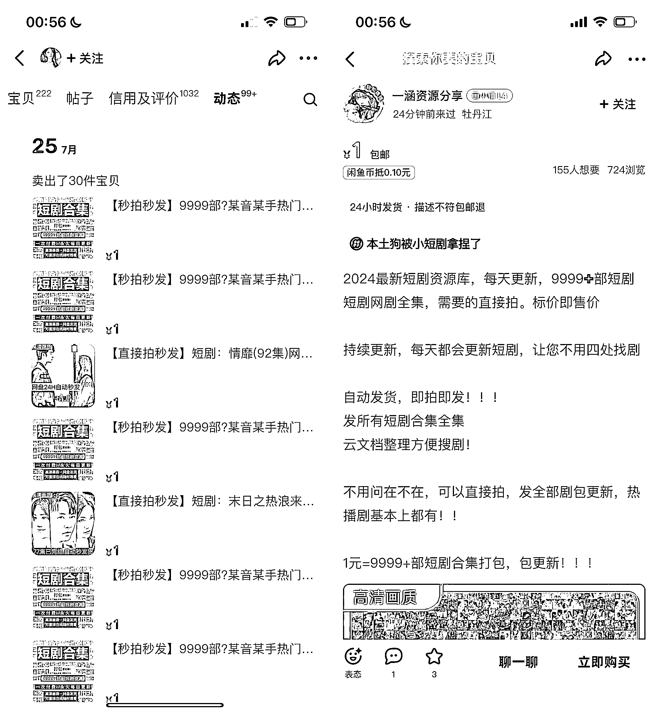
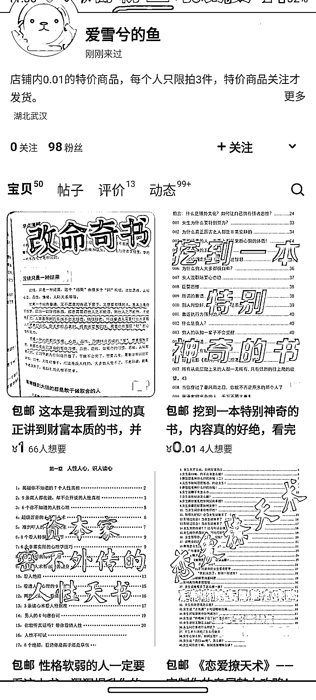
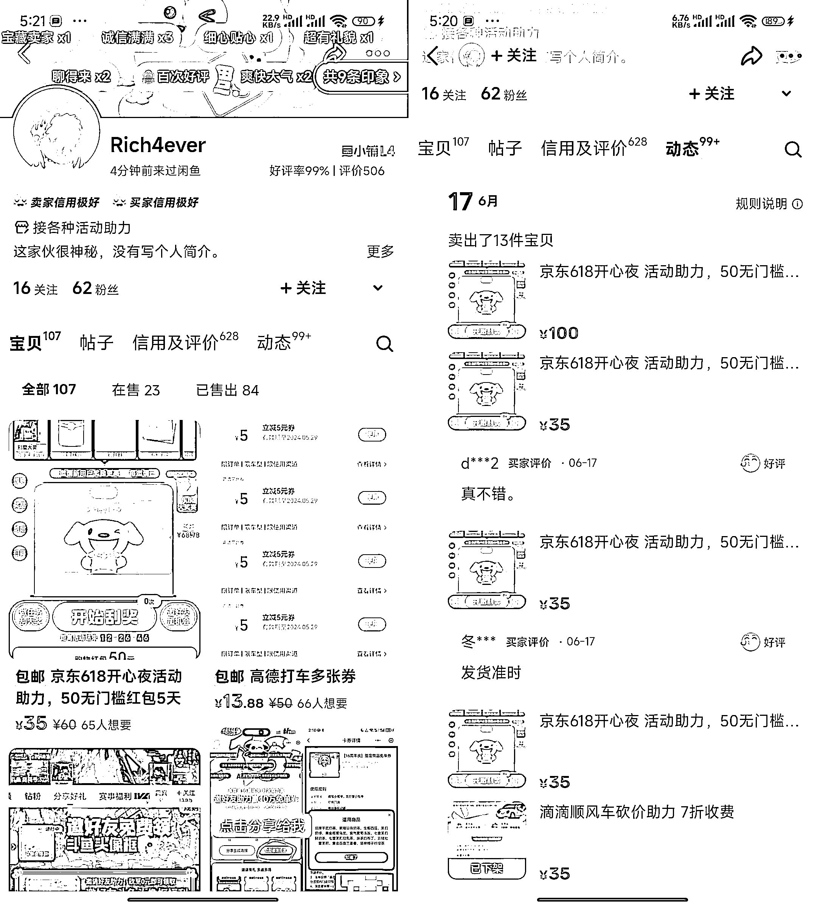
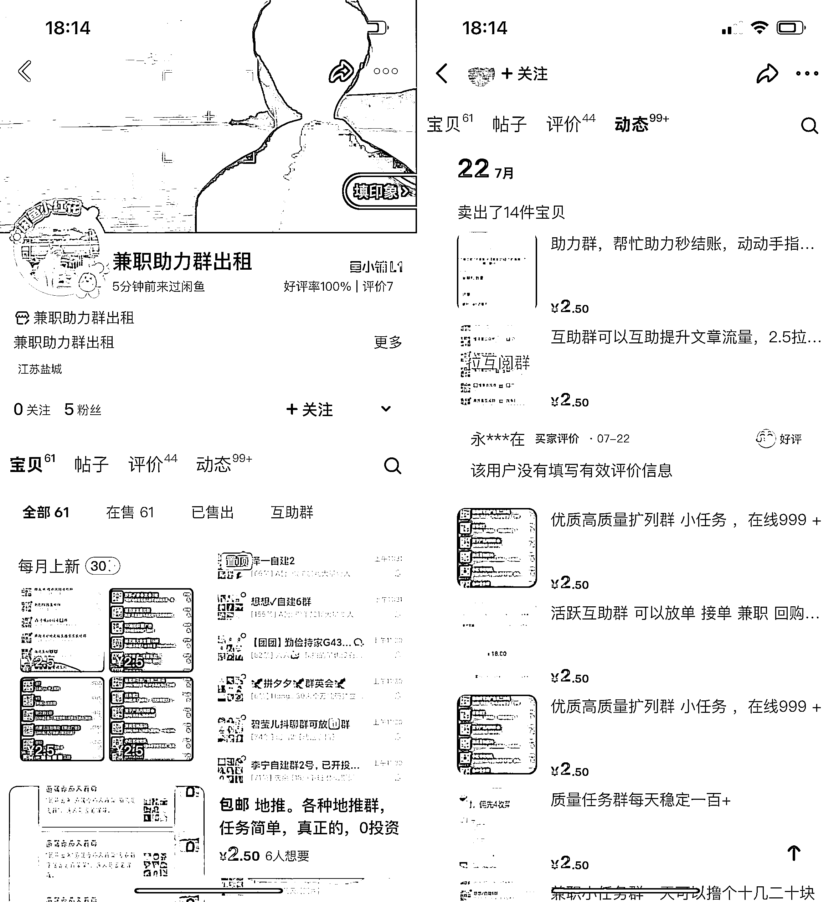
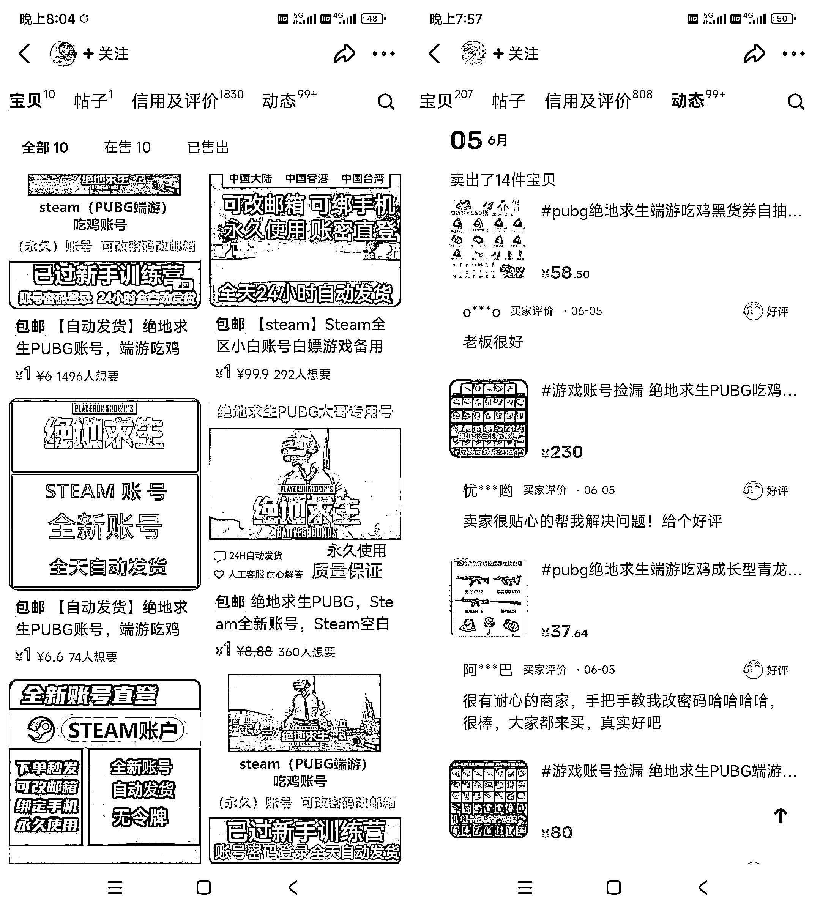
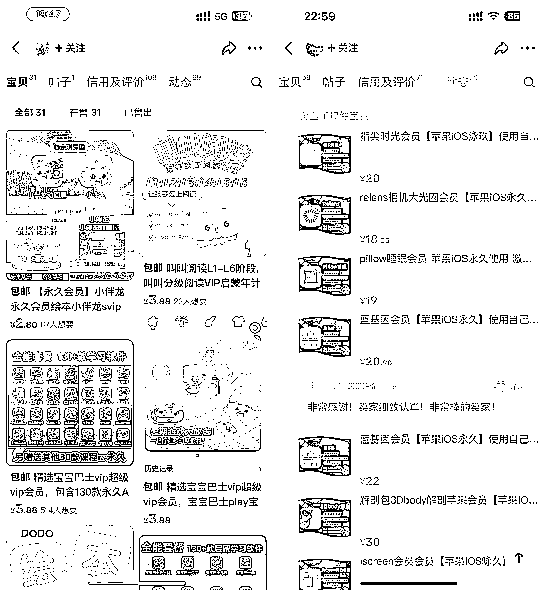
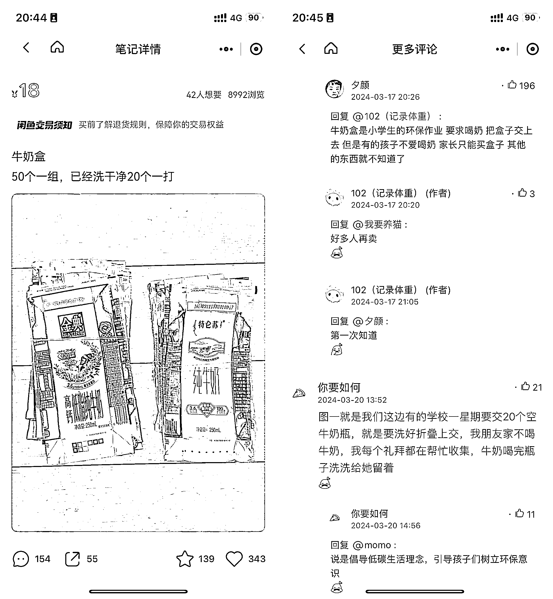
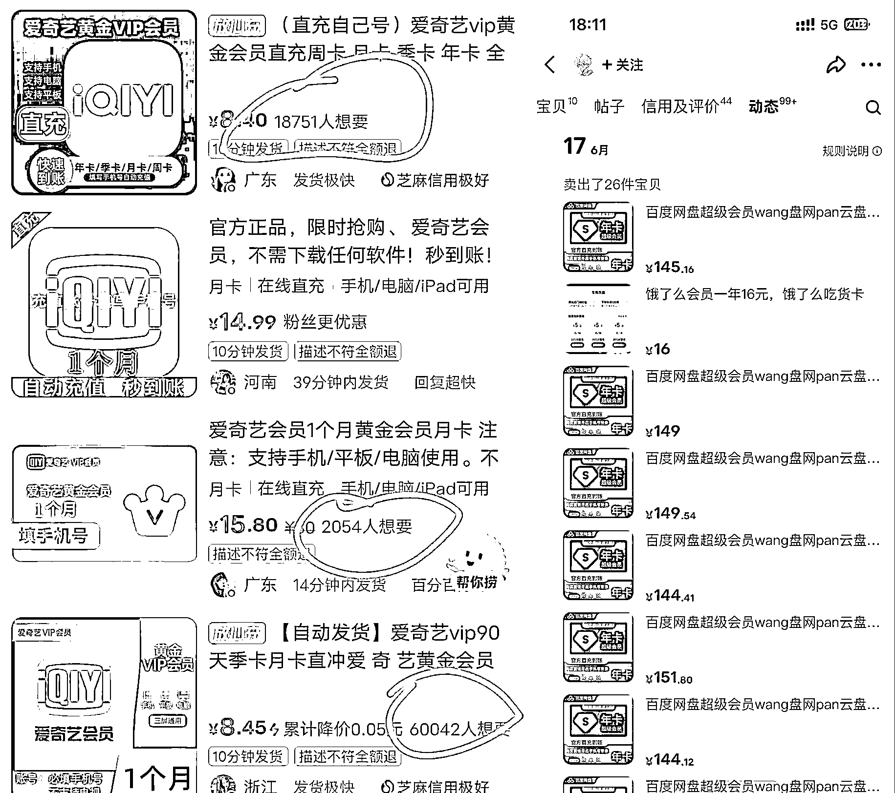
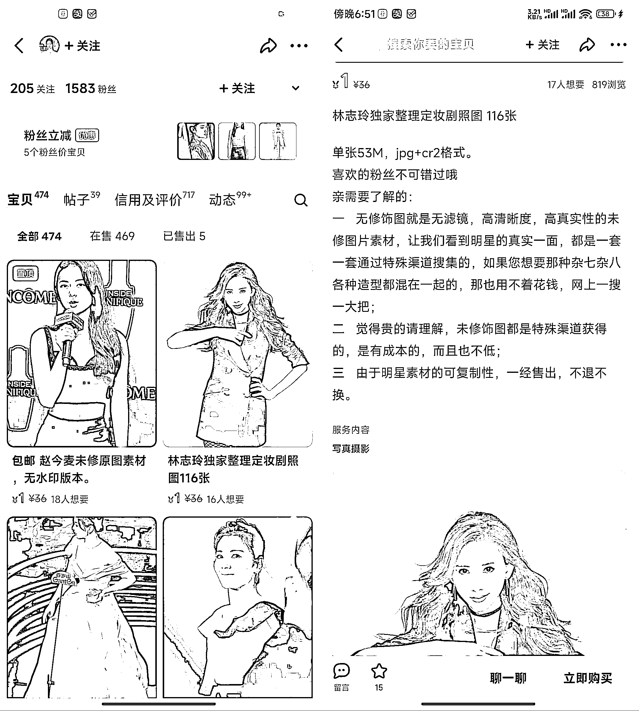

# 多数人瞧不上，但闷声赚钱的小项目

> 原文：[`www.yuque.com/for_lazy/zhoubao/fh00lvt483pmt8he`](https://www.yuque.com/for_lazy/zhoubao/fh00lvt483pmt8he)

## (46 赞)多数人瞧不上，但闷声赚钱的小项目

作者： 大鹏

日期：2024-08-20

最近发现闲鱼平台最近的动作非常多

前段时间刚打通了微信小程序，前两天又上线了网页版，就在昨天闲鱼又开通花呗付款了

作为一个老牌的二手交易平台，随着经济下行，主流电商平台利润下滑，这个后娘养的闲鱼似乎越来越被阿里官方重视了，有越做越大的趋势

一说到闲鱼，大部分人都会想到“闲鱼无货源”项目

作为网创圈的长青树，闲鱼无货源项目确实是我见过的为数不多的能这么持久的项目了

我 19 年入行就做的这个项目，当时就有人告诉我说很卷了，但是直到现在依然有大把人通过闲鱼无货源项目发家致富，且有越做越猛的架势。

作为一个二手交易平台，在闲鱼开店的门槛极低，只需要注册一个账号，商品上架审核也相对宽松很多，不需要乱七八糟的资质和审核。

也正因此，闲鱼上卖啥的都有

很多你根本就想不到的东西，但就是有人在卖，而且卖的还不错，闷声发财。

帮大家整理了一些，可以直接抄作业，赚个零花钱问题不大。

**1、卖短剧合集**

把多部短剧打包一起售卖，有人下单就发个网盘链接，除了出单收益还可以配合网盘拉新再赚一波

**2、卖电子书**

电子资料的，需求很大，一个卖了 6 千多，一个卖了 9 百多，如果再加上网盘拉新一起，双份收益，绘本漫画，小学教材、教辅资料也都可以按这个来做。

**3、卖助力**

帮别人做各种助力活动，每一单基本上都是纯利润，而且复购非常高，非常的有搞头

**4、闲鱼卖羊毛群**

进一堆羊毛群，有人下单就引流到微信拉进群，新号也能稳定出单，后面可以自己组群，卖高阶卖线报群，变现更高

**5、卖游戏账号**

游戏账号需求相当高，可以做账号回收，然后在闲鱼出售，销量很好。

**6、卖破解软件**

闲鱼专卖各类破解软件，出单很猛，单价也不低，利润比较可观，销量高评价好，有资源的可以跟进。

**7、卖空牛奶盒子**

小学生买来交作业，真的是有需求就有钱赚

**8、闲鱼卖会员**

这个做的人就很多了，通过各种低价充值渠道去帮客户充值会员，中间自己赚个差价，有渠道就可以做。

**9、卖图片**

卖明星的原素材照片，流量不错，可以结合网盘拉新，增加收益！

好了，这次就先分享这么多

看到这里你有没有感觉人的脑洞是真的大

有些玩法把我都惊讶到了，比如那个卖牛奶盒的，哈哈哈...

闲鱼这个平台是真的神奇，万物皆可闲鱼！

其实还有很多没写出来的新奇玩法，你自己也可以挖掘一下

当然，也欢迎大家在评论区留言补充~

其实作为普通人来讲，如果对副业收入要求不是太高

完全没必要去搞那么多乱七八糟的项目

盯住闲鱼这一个平台足够了，买个资料，配合上网盘拉新

一个月搞个几百上千块还是很简单的

好了以上就是今天的分享啦，如果对你有所帮助，点个赞即可~

* * *

评论区：

刘智行 : 收获满满。谢谢🙏 小六六 : 卖空牛奶盒子，大开眼界！
跑通小闭环✅ : 卖空牛奶盒子，这个我可以啊，大宝最爱喝牛奶，之前的盒子都丢了，感觉丢了好多钱[偷笑][偷笑][偷笑]
大鹏 : [抱拳][抱拳]
大鹏 : 哈哈哈，万物皆可闲鱼[调皮]
大鹏 : 再去捡回来[呲牙]
元宝团子 : 卖会员的那个不知道哪里有货源，就是不知道哪里有货源，我自己就在闲鱼买会员用 💋李姑娘 : 对，我也是，用在咸鱼买这种。不知道生菜有没有有资源的人

* * *