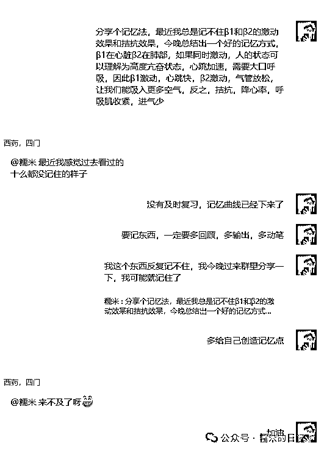

# 掏心窝子说说，避免在知识付费上“花冤枉钱”

> 原文：[`www.yuque.com/for_lazy/zhoubao/xht4y4dhknwkdpmf`](https://www.yuque.com/for_lazy/zhoubao/xht4y4dhknwkdpmf)

## (26 赞)掏心窝子说说，避免在知识付费上“花冤枉钱”

作者： 糯米

日期：2024-08-19

糯米的第一次知识付费，是在高中毕业的时候，当时失恋了，买了个 888 的情感课程

后来去广州学电商直播带货，混社群，最贵的花了 2w 多，最便宜的 8 百多

时至今日，前前后后花了十多二十万是有了

现在糯米也有自己的课程，圈子，产品了，身边也围绕了些学员，经常也会遇到些人说我是卖课的，是割韭菜的

其实我也很明白，大部分人都心里痒痒，但是一旦说要花钱学习，迈出的脚步就缩回来了

今天掏心窝子跟大家唠唠

**关于知识付费，是不是花“冤枉钱”，糯米又是怎么看待知识付费的**

**NO.1**

**最没有风险的知识付费是什么？**

在糯米看来，有一种知识付费风险极低，大家也可放心去消费！

当你在业务中遇到问题，且，你确认，如果解决了这个问题，是能提高你的产能/产值/效率，能帮你更好赚钱的

那如果刚好遇到一个这方面的专家，能点对点，针对性给你解决这个问题的，或者能回答你这个问题的，那就大胆付费！

举个例子，糯米搭建矩阵是个生手，如果自己摸索不出来，勉强弄出来的矩阵操作起来也非常难受，没有成型的管理 sop，刚好这个时候遇到了个做矩阵的行家，那我就会选择知识付费，人情付费，点对点解决问题

**这种是你本身问题明确，而且回报明确的，还是避无可避的**

那么哪怕你的这次知识付费没有解决问题，起码你获取了信息，可能目前圈子内的最优解还没有那么明朗，是需要自己靠实战来总结的，那么只要弄出来，你就是行业前列

**NO.2**

**什么是有风险的知识付费呢？**

只要你没有想好这个是不是自己要的，没有想清楚自己付费图什么，那大概率你会后悔，会觉得人家割韭菜

举个例子，你看到一个人光鲜亮丽，过着你想要的生活，其实人家背后付出了许多辛劳和汗水，但你看不出来，你想得也简单

这个时候人家刚好有课程或者别的什么产品，于是你希望满满的付费了，但最后发现执行起来有点难，甚至是自己懒得执行，那会儿热血劲儿过了，你就会后悔，过分一点的人反而觉得人家割韭菜

无独有偶，糯米不是今年在备考执业药师么？

昨天就遇到了大跌眼镜的一幕

这是一个备考群，大家买了同一个课程，所以班主任拉群在一起

因为糯米昨天学到那个地方，灵感来了，就在群里输出了一番，于是有了两个互动，这个是其中一个

对面的小伙伴今年要考四门，现在还有 60 天，虽然对方也明白自己是学了记不住，但就是不愿想办法解决这个记不住的问题

然后他摆烂了，说来不及了，可是明明还有 60 天呀~

（ps.也有可能我妄自揣测了，人家只是说句玩笑话，该学还是学的）

然后还有第二个

你说你都知道自己报了课不学习，难道你来问我就能有什么好办法么？难不成我有记忆面包（哭死）

综合两个案例，我真的是无可奈何花落去，让我随波飘走吧，你们的问题我回答不了~~~~~

如果是放到糯米的陪诊课程里，我一定会说

“那你自己都没有决心去做这个事儿嘛，要不先想想好，到底要不要做”

其实糯米这边陪诊的知识付费和上面的执业药师课程又有多大区别呢？执业药师你会觉得是割韭菜，那执业药师你会不会也觉得是割韭菜呢？

**还有一种风险比较高的知识付费，就是宣称得非常漂亮，只要你买了就能怎么怎么样**

这种非常像割一刀就跑的类型，就是要极度吹嘘夸大，给你希望，因为人家就是冲着迅速成交来的

**NO.3**

**那这个部分，糯米分享一下，以我 20 多 w 知识付费，且持续成长至今的知识付费原则**

首先，知识付费不要超过你的经济承受力

你是来学东西或者解决问题，或者是投资人情的，不是来花钱赌一个未来的，那种孤注一掷，一把梭哈，然后赢个大满贯的，只有周星驰的《赌神》里存在

其次，想清楚这次知识付费，自己要的什么，保底能获得什么？自己能不能接受这个保底？

按照糯米现在的知识付费观念，我会知识付费，会有这么几个逻辑

1.为了获取一个圈子，或者靠近一些人

2.为了了解某个/些业务的运作逻辑

3.为了实打实解决我的问题，可能买的是服务，可能是工具

总结下来，糯米的知识付费的所图，无非是**知识，工具，人脉，人情，圈子，身份，氛围**

OK，刚才讲了知识付费的两个原则和一套逻辑

最后跟愿意看糯米文章的小伙伴讲两句关于知识付费的肺腑之言吧

糯米也曾经是个嫩雏儿，也在知识付费后又后悔了，觉得自己被割韭菜过，但是以我现在的眼光来看，那都是**必经之路**

只要是我接受不了平平凡凡，碌碌无为，安心当咸鱼，我就得去折腾，只要折腾一定会探索未知，只要我不是全能天才，我就不可能啥都能自学完成，个人之力犹有尽时

所以踩坑是必然的，如果一个坑都不敢踩，那始终会是一只心里痒痒的闲鱼，而且闲着闲着就老了，更折腾不动了

**人生苦短，不折腾一番，谁都不知道自己头顶会不会出现彩虹**

而且对于一个嫩雏来说，就算你知识付费了，你也不一定能成长多快，成功多少，因为吸收能力有限，实战能力有限

大部分知识付费的价值不在于当下的那几节课，而是你对这个人付费了，你获得了一个付费关系

他能卖你一个知识付费，一定是有东西值得学习的，你需要做的就是持续靠近他，学习他

有的知识付费，最重要的同样不是那点知识，而是一个高质量的圈子

俗话说近朱者赤近墨者黑，糯米已经深受其益了

老生常谈的几个说法，像是头等舱的人都习惯看书办公，一线城市的人都喜欢聊经济聊项目，南方人都喜欢喝茶聊搞钱

其实换个好一点的圈子，真的，做事的动力有了，每天思考的东西变了，聊的东西变了，那些你现在觉得很难的自律，自然而然都会随着圈子改变

当然，糯米也不是一味鼓吹知识付费，如果能安心躺平说不定也很快乐，但要保持不受外界的焦虑感染，糯米感觉很难，而且我想折腾，如果你能做到，恭喜你，从看山是山，直接跨越了看山不是山，直接回归看山还是山，其实快乐可以很简单（笑死，好顺口）

还有一种人，也不需要知识付费，这种人足够聪明，他们可以只是看看你的口播，就直接动手模仿你，模仿出来还非常像样

他们也可以看看免费/盗版网课，直接复刻一版课程，同样的，他们可以来你朋友圈潜伏一阵子，扒光你的文章，短视频，直播，弄清你的产品，私域等等

这种我称之为，“牛逼的人，你是拦不住的，不如拉一把”

**这个时代要抄，你根本拦不住，如果人家抄得好，不妨主动拥抱对方，把当做宣传案例**

至此，糯米全文完~如果你耐心看到了此处，糯米深感敬服，敬服你的耐心，也感谢你对我文章的认可，文章尾部点赞评论转发，你干了，我随意~

* * *

评论区：

高原 : 学习到了
糯米 : [奋斗][奋斗][奋斗]
希平 : 感谢糯米的分享
糯米 : [呲牙][呲牙]有帮助就好

* * *